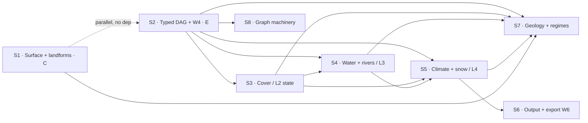

# Terrain Studio — parity & production roadmap

**What this is.** A sprint/story plan that turns the `GAEA-GAP.md` recommendation into schedulable
work. It does not re-derive the gap analysis; it references it. Every story cross-references the
`BACKLOG.md` item, the `GAEA-GAP.md` section, and the D7 layer it belongs to. New architecture work
is called out explicitly instead of being hidden inside a node story.

**Derived from** (read, not remembered):
- [GAEA-GAP.md](../../GAEA-GAP.md) — the measured 60-vs-183 node gap and the Part 3 prioritised list.
- [BACKLOG.md](../../BACKLOG.md) — decisions (D1–D7), confirmed defects (C1–C11), open work (W1–W9).
- [PROGRESS.md](../../PROGRESS.md) — what has shipped and the current gate readings.

**Baseline correction.** `GAEA-GAP.md` measured 60 plugins before Rock Fracture landed. The working
tree now contains **61** plugin types. Gates must measure the baseline at sprint start; no story may
hard-code 60 or infer a target count from its story count.

---

## The decision: a hybrid two-track schedule

The in-repo `GAEA-GAP.md` optimises **value ÷ cost** (cheap surface/landform packs first). A second
analysis optimised **structural value** (hydrology/output/utility first). They agree on the atoms and
differ only on ordering. The tie-breaker both missed is that **multi-output ports (W4)** is the shared
keystone: it simultaneously unblocks Lake/Basin with real outputs, Export-as-a-node, and
Sediments-as-state. So this plan runs two tracks rather than choosing one ordering:

- **Track A — visible product, no new graph contract `[C]`.** Scalar surface detail, landforms,
   filter completion, and aspect. Ships terrain that *looks* finished. This is Sprint 1 and remains
   a pull-anytime backlog thereafter. Vector derives such as Normals wait for typed ports in Sprint 2.
- **Track B — the structural spine `[E]/[K]`.** typed multi-output DAG + W4 → cover (L2) → water
   (L3) → output → regimes → graph machinery. This is where the systems learn to compose. The typed
   port/runtime migration is first because every ambitious story waits on it.

The two tracks share reviewers and the gate suite but not dependencies, so Track A can absorb slack
whenever Track B is blocked on review.

---

## Sprint map

| Sprint | Theme | Track | Cost | D7 layer | Depends on |
|---|---|---|---|---|---|
| [1](sprint-01-visible-product-packs.md) | Surface family/detail, landforms, scalar filters, aspect | A | `[C]` | L5 dressing / L0 gen | — |
| [2](sprint-02-multi-output-ports.md) | Typed multi-output DAG + auxiliary-map registry (**the keystone**) | B | `[E]` | enables L2 | — |
| [3](sprint-03-cover-layer.md) | Cover layer: soil / sediment / sand as **state** | B | `[K]`+`[E]` | L2 | S2 |
| [4](sprint-04-water-and-rivers.md) | Depression policy, physical flow, sources, lakes, rivers (**no carve**) | B | `[K]`+`[E]` | L3 | S2, S3, L1 (done) |
| [5](sprint-05-climate-and-snow.md) | Moisture, typed climate, moisture-driven Snow, hex correctness | B | `[K]`+`[E]` | L4 | S2, S3, S4 |
| [6](sprint-06-output-and-export.md) | Pure export sinks, formats, profiles, tiles, bake-boundary | B | `[K]`+`[E]` | — | S2–S5 |
| [7](sprint-07-geology-and-regimes.md) | Strata/Sandstone/Outcrops, aeolian, mass-movement | A/B | `[K]` | L2/L5 | S1–S5 |
| [8](sprint-08-graph-machinery.md) | Subgraphs, Var, Math, Switch, Route, Edge | B | `[E]` | — | S2 |



---

## Capacity and cadence

The eight thematic packets total **249 points** (S1 27 · S2 34 · S3 32 · S4 31 · S5 26 · S6 34 ·
S7 31 · S8 34). The repo records no stable team velocity or sprint duration, so these numbers are
relative scope, **not calendar estimates**. At each kickoff:

- commit no more than demonstrated recent velocity;
- preserve the dependency/order and story IDs while carrying excess stories into a named continuation
   (for example Sprint 2B), rather than extending the timebox silently;
- split any 8-point story into reviewable implementation cuts, while retaining one end-to-end story
   outcome and exit gate;
- for Sprint 2, treat S2.1 + S2.2 as the first landable checkpoint (descriptors + migrated edge/UI
   schema) before starting the evaluator/cache rewrite in S2.3;
- record delivered points and elapsed cadence here after the first two sprints, then forecast later
   packets from measured velocity.

---

## Architecture gates

Sprint 2 changes an internal interface, edge schema, persistence shape, evaluation model, and cache
ownership. Sprint 6 adds an emitter boundary. Both are architecturally significant under the local
documentation rules, so implementation starts only after two short ADRs are accepted:

1. **Typed multi-output DAG ADR:** port descriptors, value kinds, source-port identity on edges,
    primary-output compatibility, demand-driven evaluation, cache ownership, and saved-graph
    migration.
2. **Pure sink / emitter ADR:** graph nodes remain pure declarations; explicit Build/Export commands
    execute side effects once, outside `eval`; browser format writers and packaging live behind the
    emitter boundary.

The ADRs belong beside [adr-001-gpu-hydraulic-composition.md](../adr-001-gpu-hydraulic-composition.md).
Sprint 2 also updates [phase-a-plugin-contract.md](../phase-a-plugin-contract.md) or adds its Phase B
successor with the typed port/result/edge/evaluation contract. Sprint 6 adds the emitter contract and
manifest schema to that design set. These are planned documentation deltas, not optional cleanup.

---

## Audit decisions (2026-07-31)

The plan was reviewed against the working implementation and independently rubber-ducked by a
read-only second model. The correction pass made these decisions explicit:

- Working baseline is 61 plugins, not the pre-Fracture 60 in `GAEA-GAP.md`; all count gates are
   relative and require digest `skipped = 0`.
- Sprint 2 is a typed DAG/runtime migration, including source-port edges, UI, persistence, caching,
   and legacy adapters. It is not “return an object from eval.”
- Doctrine enforcement is staged. Typed/lens/Legal Order checks land in S2; hydraulic co-evolution
   arms in S3; the Snow Rule arms only after moisture exists in S5.
- L4 climate/snow is a real sprint before export. It cannot be manufactured by a manifest check.
- Output sinks are pure declarations; explicit emitters own side effects. The current export writer
   is only 8-bit PNG and is not counted as R32F/PNG16/RAW/EXR support.
- `d_texture` and other preset classifications are preview-only. Salinity remains deferred pending
   its own state/advection/export decision.
- Reference implementations are evidence and oracle sources, not assumed production-ready ports.

**Remaining product decisions before the owning story becomes Ready:**

1. Salinity: omit (current plan) or approve a continued-state field with unit, source mixing,
    evaporation concentration, advection, and export contract.
2. EXR: select a browser/offline-capable maintained writer in S6.2; if none passes the documented
    spike, ship R32F master and mark EXR blocked rather than implementing a partial codec.
3. Regolith production law and River hydraulic-geometry relation: select the cited model and freeze
    tolerances before S3.2/S4.5 implementation.

---

## Doctrine guardrails — copying Gaea here is a regression, not parity

Every story is bound by these. They come from `GAEA-GAP.md` Part 4 and `BACKLOG.md`, and a story that
violates one is rejected at review regardless of its gate.

1. **Water does not carve the heightfield.** (`GAEA-GAP §4.1`, `D5`.) A river is a `discharge` /
   `waterSurface` / `waterDepth` field; geometry is owned by the simulation. The *only* legitimate
   height write from hydrology is bedrock drainage conditioning — that is `hydrofix`, and it stays a
   distinct node with a distinct label. Do not port Gaea's carving `Rivers`.
2. **Ship drivers, not classifications.** (`GAEA-GAP §4.3`, ch27 Masking Doctrine.) Emit
   `moisture` / `temperature` / `soilDepth` / `slope`, never a baked biome ID or baked albedo.
   `satmap` / `colormixer` and any Colorize additions are **preview-only** — no export profile may
   depend on them (enforced in Sprint 6).
3. **The bake set is closed under predecessors.** (`D6`.) Bake X ⇒ every ancestor of X is baked; an
   illegal cut is mechanically detectable and is gated in Sprint 6.
4. **Material transport co-updates state in the same pass.** (ch27 co-evolution, `C3`.) A node with
   `writes: ['height']` that moves material must declare `coUpdates: ['soilDepth', …]` or fail
   registration. This is the whole point of Sprint 3.
5. **Continued-state maps ship an initial condition + drivers + an epoch.** (`BACKLOG §2`.) Snow /
   water / ice export a start state and their drivers, not a frozen answer. The Snow Rule: a snow
   plugin not declaring `moisture` in its reads fails registration.
6. **Physical units throughout.** Metres, °C, °C/km, m/s, m³/s, degrees of repose — surfaced in the
   `params` formatters, not just internally.
7. **Position-pure generators declare exact-transform eligibility.** The current table is
   `EXACT_TYPES` in `src/legacy.js`, not `params.js`. Add only generators whose coordinate
   evaluation truly commutes with Transform; whole-field/self-normalising generators such as
   Mountain and Canyon are deliberately excluded.
8. **Every edge is typed and unit-carrying.** A port declares value kind, semantic field type, unit,
   range contract, and optionality. A bare `Float32Array` is storage, not a type. At minimum the
   substrate supports scalar raster, vector raster, scalar value, and feature/point set; unsupported
   kinds are deferred explicitly rather than smuggled through node instance side fields.
9. **Nodes stay pure.** `eval(params, inputs, context)` returns values and has no downloads, file
   writes, DOM actions, or hidden graph lookups. Output nodes are declarative sinks; emitters run only
   from an explicit command. During migration, existing evaluators may run through an enumerated
   compatibility adapter that extracts documented side channels from an isolated state bag; new
   nodes may not add such debt, and each exception has an owner sprint.

---

## Definition of Ready

A story may enter implementation only when:

- Its **user outcome** is stated and its inputs/outputs name field type and physical unit.
- Every numeric acceptance threshold is fixed from an analytic case, a cited reference, or a
  measured broken/fixed baseline. Phrases such as “within a stated bound” mark the story **not
  ready** until replaced; no implementer may choose the threshold after seeing the fixed result.
- Square and hex behavior, world extent, resolution pair, boundary policy, and seed are specified.
- The failing control is a test fixture or mutation fixture; arming a gate never requires leaving
  production code deliberately broken.
- Any schema change names its saved-graph migration, undo/redo impact, quick-create compatibility,
  bridge impact, and old-document fixture.

---

## Definition of Done — the gate discipline

The project's standing failure mode is **the vacuous gate: a check that passes on a broken build**
(six recurrences in one session, `BACKLOG §5`). A story is not done until its gate satisfies all of:

- **Armed between two measured endpoints.** The oracle must have been *seen to fail* on the broken
  path and *seen to pass* on the fixed one. A gate that has never failed is not a gate. State both
  numbers in the story's closing note.
- **Assert on output, never exit status.** A process can exit 0 having done nothing.
- **A quantity worth printing is worth asserting.** No report-only probes (`_verify_realtime.js` is
  the anti-pattern — 0 PASS / 0 FAIL).
- **Absence of evidence is a failure.** An empty result set, a scan that matched no files, a probe
  that compared nothing — all red.
- **The digest stays honest.** `npm run verify -- _verify_digest.js` covers every registered type and
   reports **skipped = 0**; the oracle and the app never move in the same commit for an existing node.
- **Visible terrain has visual evidence.** Generator/surface/process stories capture hillshade,
   slope, and relevant field overlays at two zoom levels on square and hex; numeric oracles remain the
   gate, screenshots are the review evidence.
- **Runtime changes validate the built app.** In addition to focused oracles, run the plugin/bridge
   checks, production build, built-bundle digest, and full standalone sweep.

Run gates from `apps/terrain-studio/`:

```
npm run verify -- _verify_digest.js        node types bit-identical at 256²
node scripts/sweep-oracles.mjs             every standalone oracle, one line each
node scripts/sweep-oracles.mjs _verify_x   a subset
```

Current record to hold: **74/74 standalone oracles green** (`PROGRESS.md`, 2026-07-31). The current
working tree has 61 plugin types; measure rather than copying the stale 60-type prose above.

---

## Story ID scheme

`S<sprint>.<n>` — e.g. `S2.1`. Where a story *is* an existing backlog item it says
**Implements: W4** and does not renumber it. Cost class `[C]`/`[K]`/`[E]` per `GAEA-GAP` Part 2.
Size is Fibonacci points (1/2/3/5/8), relative, not time.
