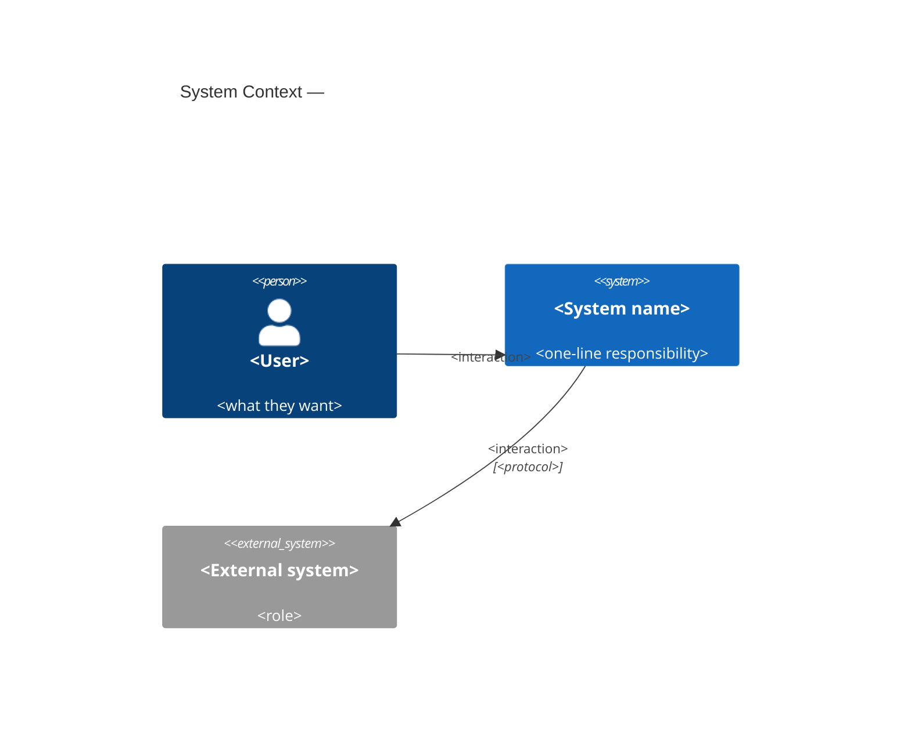
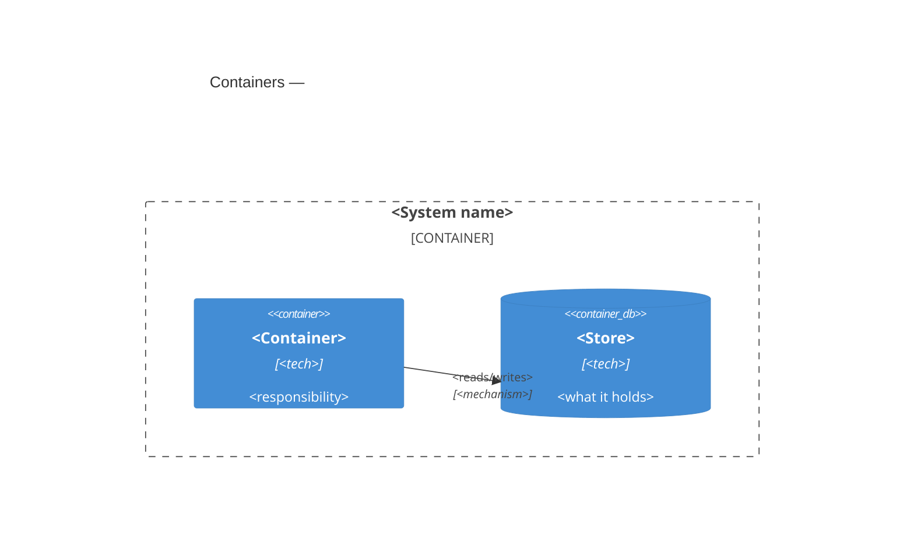
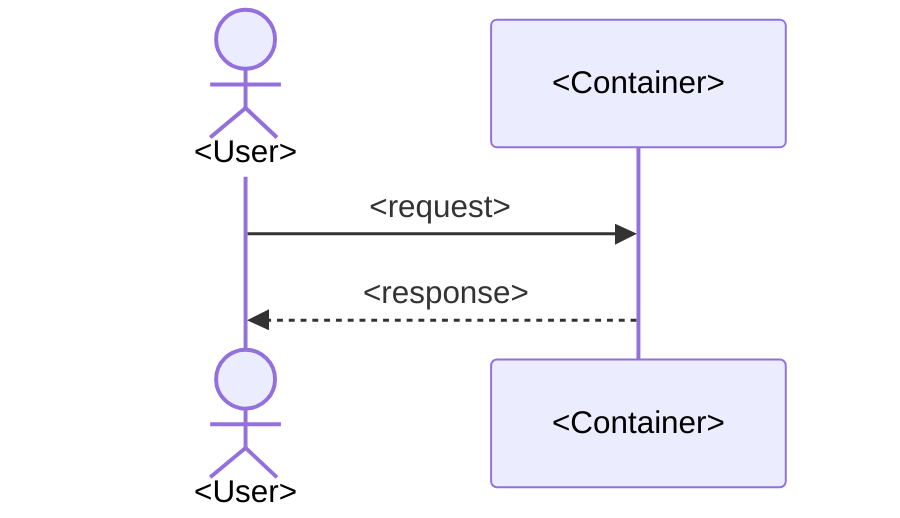
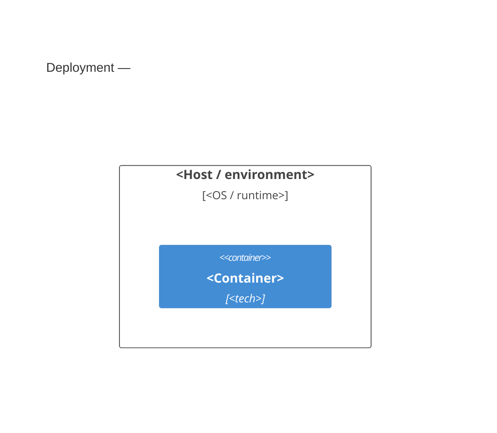

# HLD — <System name>

> Realizes the context, container/building-block, runtime and deployment **views**
> of the Architecture Description (governed by viewpoints VP-CTX, VP-FUNC, VP-RUN,
> VP-DEP in [AD.md](./AD.md) §5–6). Keep diagrams consistent with their viewpoints.

The shape of the system: what the major parts are, how they fit, how the main
flows run, and the trade-offs baked in. Detail lives in the SDs; rationale lives
in the ADRs (linked by ID). Keep this readable in one sitting.

## 1. Overview
Two or three sentences: what the system does and the central design idea.

## 2. System context (C4 L1 — mandatory)
> External view — users and neighbouring systems. See `references/mermaid-guide.md`.

## 3. Containers (C4 L2 — mandatory)
> The major runnable/deployable parts and their technologies. Component-level (C4 L3)
> detail for significant containers lives in the SDs.

## 4. Components & responsibilities
| Component | Responsibility | Detailed in |
|---|---|---|
| <name> | <what it owns> | [SD-<area>.md](./SD-<area>.md) |

## 5. Main runtime flows
The handful of flows that define how the system behaves. A sequence diagram if a
flow is non-obvious; otherwise a numbered list.

## 6. Deployment view
> Where the containers run and on what infrastructure (arc42 §7). Include only if
> deployment is non-trivial; for a single local binary, one sentence is enough.

## 7. Cross-cutting concerns
How the system handles, across components: communication style (e.g. files vs
shared memory vs network), concurrency, error handling, configuration, security.
Link the ADR for each non-obvious choice.

## 8. Security & privacy — threat model + DPIA (mandatory)
Threat-model every system. Use **STRIDE** per element of the L1/L2 diagrams and map
findings to the **OWASP Top 10:2025** (https://owasp.org/Top10/2025/). One row per
credible threat; sign off by setting `security-reviewed: true`.

| Element / data flow | STRIDE category | Threat | OWASP 2025 | Mitigation | Owner |
|---|---|---|---|---|---|
| <e.g. API ↔ DB> | Tampering | <…> | A04 Cryptographic Failures | <TLS, integrity check> | <team> |

> STRIDE = **S**poofing · **T**ampering · **R**epudiation · **I**nformation disclosure ·
> **D**enial of service · **E**levation of privilege. Treat trust boundaries (where data
> crosses an element) as the priority. A significant residual risk becomes an ADR.

### Privacy & data protection (DPIA)
**Mandatory where the system processes personal or otherwise regulated data** — else state
"no personal data processed" and set `privacy-reviewed: n/a`. A lightweight Data Protection
Impact Assessment (full method in `references/privacy.md`): what personal data, on what
lawful basis, where it flows and lives (residency), how long it's kept, and the safeguards.

| Data category | Sensitivity | Lawful basis | Residency | Retention | Safeguard |
|---|---|---|---|---|---|
| <e.g. account email> | PII | <consent / contract> | <EU> | <24 mo> | <encrypted at rest, access-logged> |

> Map obligations to the regimes that apply (GDPR/UK-GDPR, CCPA, HIPAA, PCI-DSS, …). Data
> minimisation and purpose limitation are design constraints (`C.xx`), not afterthoughts.
> A significant residual privacy risk becomes an ADR. Sign off with `privacy-reviewed: true`.

## 9. FinOps — cost estimate (mandatory before build)
Estimate cloud/infra cost **before** building, so cost is a design input, not a surprise.
Use the provider calculators (AWS/Azure/GCP) at design time and **Infracost**
(https://www.infracost.io) on the IaC in CI to keep it honest. Sign off with
`cost-reviewed: true`.

| Component / resource | Cloud / service | Sizing assumption | Est. monthly cost | Cost driver | Optimisation |
|---|---|---|---|---|---|
| <e.g. API compute> | <AWS ECS Fargate> | <2 vCPU × 3 tasks> | <$X> | <runtime hours> | <autoscale / spot> |
| **Total (est.)** | | | **$X / month** | | |

> Note the main cost drivers and the scaling assumption; tie expensive choices to the
> quality driver (Q.xx) that justifies them, and record build-vs-buy as an ADR.

## 10. Key trade-offs
The deliberate tensions and where they were resolved (link ADRs). Be honest about
the cost side, not just the benefit.
- <quality A> vs <quality B>: <how it's balanced> — see ADR-NNNN.

## 11. Known issues / debt
Smells and accepted compromises and the quality attribute each threatens. Recording
them is not the same as fixing them — it's how the team chooses deliberately.

---
*Consistency (ISO 42010): if a change alters any view above, update the
corresponding diagrams, SDs, and ADRs in the same change. A view that disagrees
with another, or with the code, misleads more than a missing one.*
