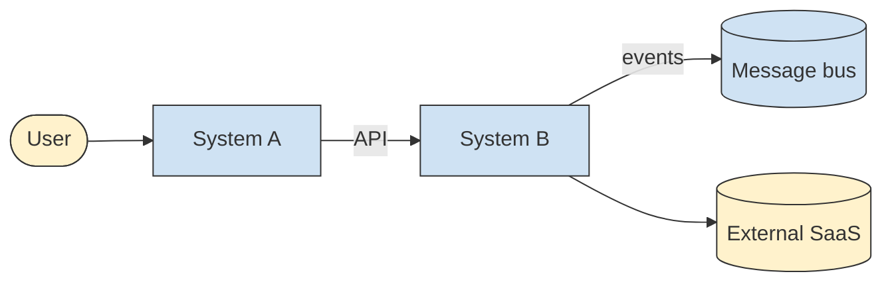
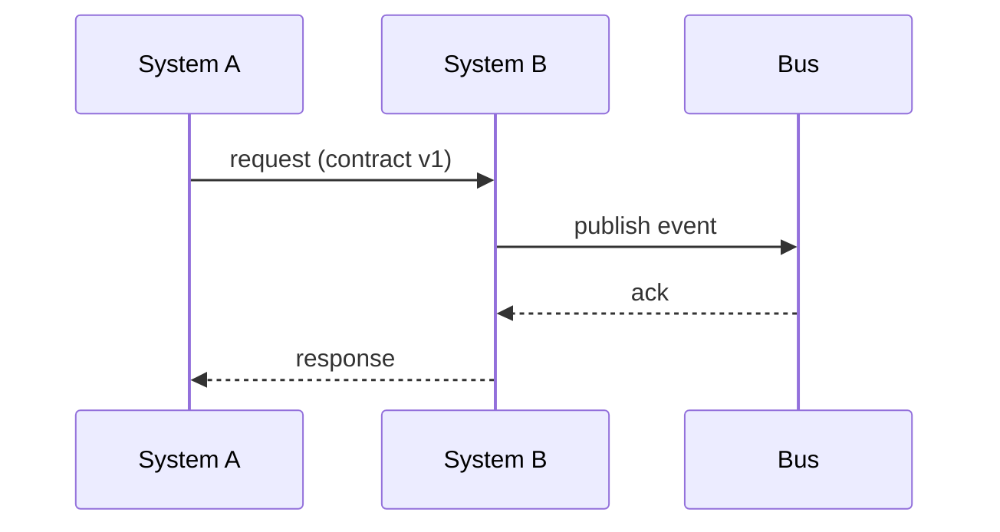

# Solution Architecture Document — <Solution name>

> Solution-level architecture: the **end-to-end** design that solves one business
> problem, often **spanning several systems/components and integrations**. Bridges the
> enterprise architecture (principles, capabilities) down to the software architecture
> (the per-system HLD/SD). A solution architect owns integration, technology selection,
> build-vs-buy, and the cross-cutting NFRs — not the internals of any single system.

## 1. Problem & context
The business problem, the goals/outcomes, scope (in/out), constraints, and assumptions.
Which **enterprise capabilities** (EA §4) this realizes and which **principles** (EA §2)
it must comply with.

## 2. Solution options & decision
Solution architecture is decision-heavy. Evaluate **2–4 genuine options** end-to-end
(build vs buy vs extend; integration style; key platforms) against the drivers and
NFRs, then choose. Record the choice as an ADR (`level: solution`).

| Option | Summary | Pros | Cons | Fit to NFRs/principles |
|--------|---------|------|------|------------------------|
| A | <…> | <…> | <…> | <…> |

**Selected:** <option> — see ADR-NNNN.

## 3. Solution overview (logical view)
The major building blocks of the solution and how they fit — across systems. A C4
**System Landscape / Container** view works well here (mermaid).

## 4. Integration architecture
How the parts communicate end-to-end: interfaces, protocols, sync vs async, data
contracts, error/idempotency/retry strategy, sequencing. A sequence diagram for the
critical flow.

## 5. Data architecture (solution scope)
Data ownership across the solution, the shared/canonical models, data flows, residency
and migration concerns. Which system is the source of truth for each entity.

## 6. Technology selections
The concrete platforms/products chosen and **why** (this is where vendor/product choice
lives, unlike enterprise Phase D). Each significant selection is an ADR.

| Selection | Choice | Alternatives considered | Rationale | ADR |
|---|---|---|---|---|

## 7. Quality attributes / NFRs (solution-wide)
Cross-cutting NFRs as ISO 25010 quality attribute scenarios (6-part + measure) that the
*whole solution* must meet — performance, availability, security, scalability. Reuse the
PRD quality-driver form; these often drive the integration and technology choices.

## 8. Security — threat model (mandatory)
Threat-model the **end-to-end** solution, with extra attention to the integration points
and trust boundaries between systems. Use **STRIDE** per element/flow and map to
**OWASP Top 10:2025** (https://owasp.org/Top10/2025/); sign off with `security-reviewed: true`.

| Element / integration | STRIDE | Threat | OWASP 2025 | Mitigation | Owner |
|---|---|---|---|---|---|
| <e.g. System A → B API> | Spoofing | <…> | A01 Broken Access Control | <mTLS, authz> | <team> |

> Cross-system flows are the highest-risk surface; model A03 Software Supply Chain Failures
> for third-party/SaaS dependencies. A significant residual risk becomes an ADR.

## 9. FinOps — cost estimate (mandatory before build)
Estimate the solution's cloud/infra cost across all systems **before** building. Use the
AWS/Azure/GCP calculators at design time and **Infracost** (https://www.infracost.io) in CI
on the IaC; sign off with `cost-reviewed: true`.

| System / resource | Cloud / service | Sizing assumption | Est. monthly cost | Cost driver |
|---|---|---|---|---|
| <System A> | <managed Kafka> | <3 brokers> | <$X> | <throughput> |
| **Total (est.)** | | | **$X / month** | |

> Build-vs-buy is largely a cost+control decision — record it as an ADR with the numbers.

## 10. Deployment & operations
How the solution is deployed and run across environments; the deployment view; key
operational concerns (observability, SLAs, DR).

## 11. Risks, roadmap & traceability
- **Risks** and mitigations (and accepted risks).
- **Roadmap**: delivery increments / transition states. If this solution replaces or
  modernizes an existing system, the staged path (As-Is → interim states → To-Be, with
  rollback per state) belongs in a **`transition-architecture.md`** — link it here
  (`references/migration.md`).
- **Traceability**: capabilities (EA §4) → this solution → systems (their HLDs).
  Per-system internals live in each system's `HLD.md` / `SD-*.md`, which link back here.
