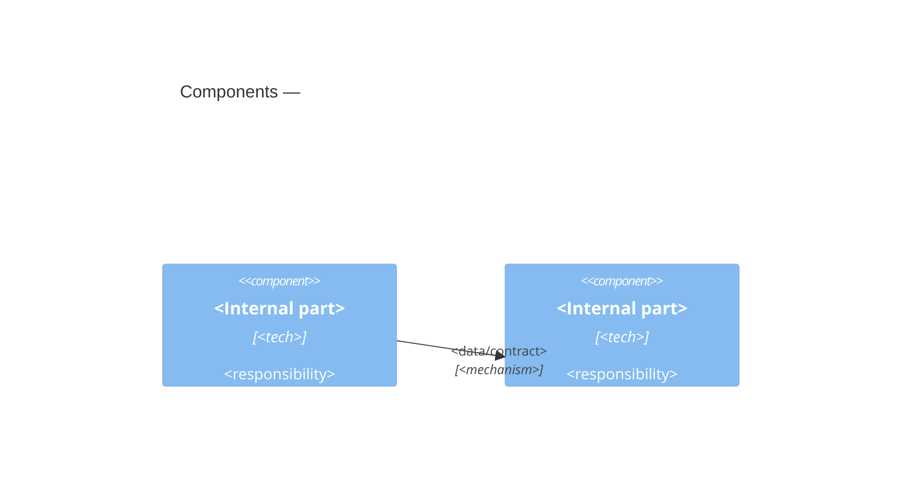
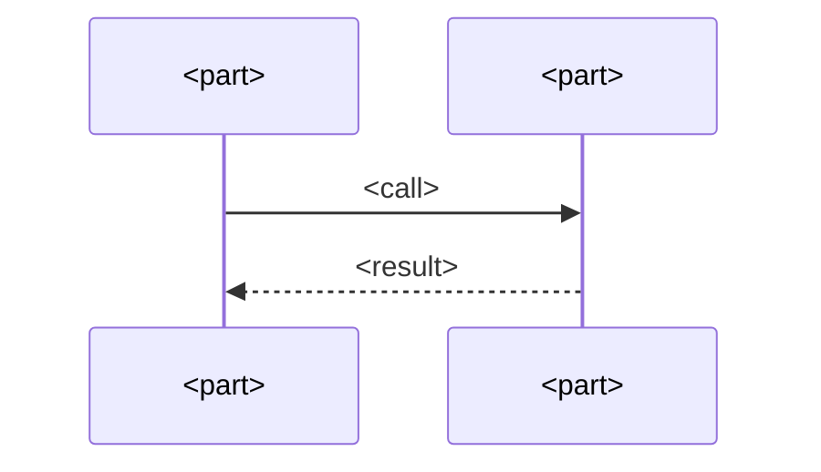

# SD — <Component / feature>

> Realizes the component (and relevant runtime) **views** of the Architecture
> Description (governed by VP-FUNC / VP-RUN in [AD.md](./AD.md) §6). The components
> shown here must correspond to those in the HLD container view (rule CR.03).
> Sequence diagrams may be **designed** (To-Be) or **traced** (As-Is, auto-recovered from
> distributed tracing/APM/logs — set `source: traced`; see `references/migration.md` §4).
> An As-Is SD can be conformance-checked against its To-Be counterpart to reveal drift.

Detailed design of one component or feature. Small and focused beats large and
comprehensive — split if it grows past what fits in your head.

## 1. Purpose & scope
What this component is responsible for, and explicitly what it is **not**.

## 2. Component view (C4)

## 3. Key interactions
Sequence diagram(s) for non-obvious collaborations — the ones a reader couldn't
guess. Skip if the interaction is trivial.

## 4. Interfaces & contracts
The public surface: functions/APIs/messages/file formats others depend on. Point
`api-spec:` at the machine-readable contract (OpenAPI/AsyncAPI/`.proto`/GraphQL SDL) —
**the spec is the source of truth**; here, summarise only what the schema can't say:
auth, idempotency, ordering, pagination, error semantics, rate limits, and the
**versioning/compat policy**. Changes to a published contract are architecturally
significant — they need an ADR + a version bump (`references/interfaces.md`).

## 5. Data structures & types
The important types and their relationships. A `classDiagram` if composition/
association matters (see mermaid guide).

## 6. Error handling & edge cases
How failures propagate, what's retried, what's fatal, and the boundary conditions
that bite (empty input, oversized data, partial failure of a chain, etc.).

## 7. Decisions & drivers
- Satisfies drivers: <F.xx, Q.xx>
- Shaped by: <ADR-NNNN — one-line why>

## 8. Known issues / debt
Local smells or compromises and the quality attribute they threaten.
