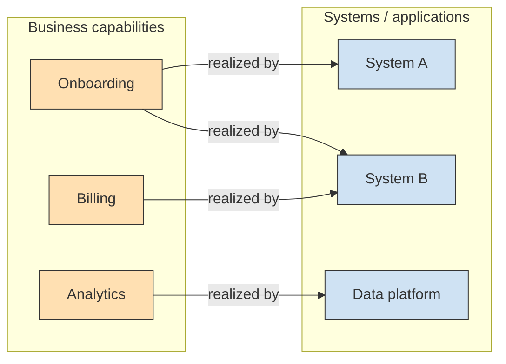

# Capability ⇄ System map

The bridge between the **enterprise** altitude (business capabilities, from
`enterprise-architecture.md` §4) and the **solution/software** altitudes (the systems
that realize them). This is the traceability backbone of business–IT alignment: every
capability should be supported by at least one system, and every system should serve at
least one capability — gaps and overlaps are where investment decisions live.

## Capability → System matrix

| Capability (EA §4) | Realized by system(s) | Solution(s) | Owner | Maturity | Health | Gap / note |
|---|---|---|---|---|---|---|
| <e.g. Customer onboarding> | <System A>, <System B> | <SAD-onboarding> | <team> | <managed> | <green/amber/red> | <e.g. no system → build> |

## Map (capability → application realization)

## Coverage analysis
- **Unsupported capabilities** (no system) → candidate builds/buys → enterprise roadmap.
- **Duplicated coverage** (many systems, one capability) → rationalisation candidate.
- **Orphan systems** (serve no current capability) → retire candidate.

## Traceability
- Up: each capability links to its EA strategy/goal (`enterprise-architecture.md` §1, §4).
- Down: each system links to its `software/HLD.md`; each solution to its `SAD-*.md`.
- Decisions that change the map (build/buy/retire) are ADRs with `level: enterprise` or
  `level: solution`, tagged with the capability they affect.
