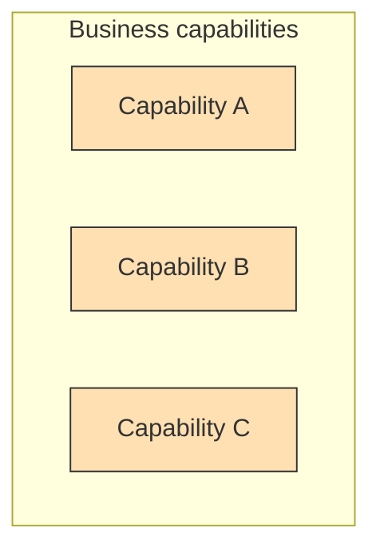
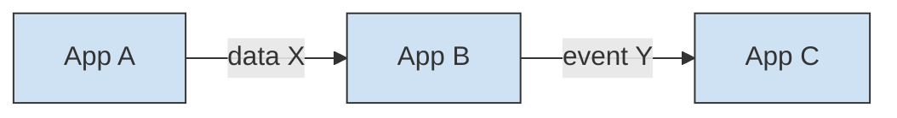

# Enterprise Architecture — <Entity of Interest>

> Enterprise-level architecture: the organisation's capabilities and its IT landscape
> across the four TOGAF domains (**B**usiness, **D**ata, **A**pplication,
> **T**echnology), aligned to strategy. Operates *across* systems — individual systems
> get their own software-level docs (HLD/SD) and link up to here. This document is the
> essence of a TOGAF Architecture Definition Document, kept lean. Enterprise architecture
> is usually maintained in a central EA repository; from a system repo, reference the
> relevant principles/capabilities rather than copying them.

## 1. Architecture vision *(TOGAF ADM Phase A)*
The high-level target and why it matters: scope, the strategic drivers, the key
stakeholders, and the value/outcomes sought. One or two paragraphs + a problem
statement. Link the motivating business strategy/goals.

## 2. Architecture principles *(TOGAF Preliminary)*
Enterprise-wide rules that govern decisions (each: name · statement · rationale ·
implications). Principles cascade down: solution and software decisions must comply
or raise an exception. Keep IDs stable (`PR.xx`).

| ID | Principle | Statement | Rationale |
|----|-----------|-----------|-----------|
| PR.01 | <e.g. Buy before build> | <one line> | <why> |

## 3. Stakeholders & concerns *(ISO 42010)*
| ID | Stakeholder | Role | Key concerns |
|----|-------------|------|--------------|
| SH.01 | <e.g. CIO> | <sponsor> | strategy alignment, cost, risk |

## 4. Business architecture *(ADM Phase B)*
Capabilities, value streams, and key business processes — the "what the organisation
does", independent of IT. A **business capability map** is the anchor artifact.

| Capability | Owner | Maturity | Supported by (apps) |
|---|---|---|---|

## 5. Data & application architecture *(ADM Phase C)*
The application landscape and the data it owns. Baseline (today) → target → **gap**.

| Application | Capability served | Data owned | Status (keep/retire/replace) |
|---|---|---|---|

## 6. Technology architecture *(ADM Phase D)*
Logical technology building blocks — platforms, integration, infrastructure
categories — **not** specific vendor products (that's implementation). Baseline →
target → gap.

| Technology building block | Realizes | Baseline | Target |
|---|---|---|---|

## 7. Architecture roadmap & gap analysis *(ADM Phases E–F)*
The prioritised path from baseline to target: work packages, dependencies, transition
states. Derived from the gaps in §4–6.

| Work package | Closes gap | Depends on | Transition state |
|---|---|---|---|

## 8. Building blocks
- **ABBs** (Architecture Building Blocks) — reusable capability definitions.
- **SBBs** (Solution Building Blocks) — implementable components realizing ABBs
  (often delivered by solution/software projects; link to the SAD/HLD that builds them).

## 9. Decisions, correspondences & conformance
- Enterprise-level decisions are ADRs with `level: enterprise` in `decisions/`.
- Solution and software decisions must trace up to the principles (§2) and capabilities
  (§4) here; record the links (`satisfies:` / `complies-with:` front-matter).
- Audit against ISO/IEC/IEEE 42010 with `conformance-checklist.md`.
