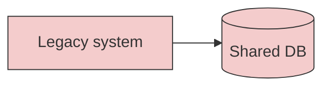
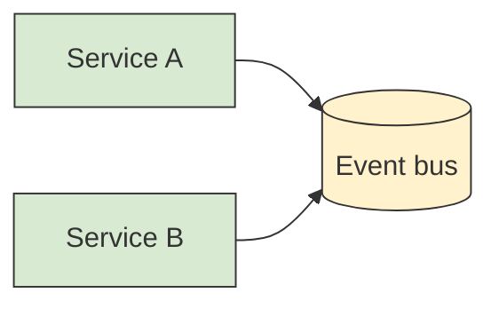
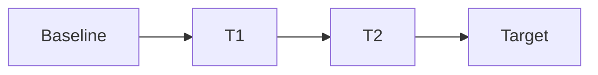

# Transition Architecture — <Transformation name>

> The roadmap from the current state to the target, **through documented interim states**.
> Never jump As-Is → To-Be in one undocumented leap. Each interim state must be a viable,
> testable, *reversible* configuration. Method and patterns: `references/migration.md`.

## 1. Drivers & scope
Why transform now, the goals/outcomes, scope (systems in/out), constraints, and the
enterprise principles (`PR.xx`) and capabilities this serves. Scenario type
(local-to-global / on-prem→cloud / monolith→distributed/SaaS — `migration.md` §2).

## 2. Baseline architecture (As-Is)
The current state, captured from evidence — including **As-Is sequence diagrams**
recovered from runtime (tracing/APM/logs, `source: traced`; see `migration.md` §4).

Known constraints, coupling, and debt that shape the path.

## 3. Target architecture (To-Be)
The desired end state and why it meets the drivers. Link the HLD/SAD that define it.

## 4. Migration strategy (per system — 7 R's)
| System | 7 R's strategy | Rationale | Target |
|---|---|---|---|
| <System A> | refactor | <high value, cloud-native> | <To-Be> |
| <System B> | rehost → replatform | <speed first, optimise later> | <To-Be> |

## 5. Transition states (the heart of this document)
One subsection per interim state. Each must stand on its own and be reversible.

### T1 — <name of interim state>
- **Scope / what changes:** <which slice moves; what runs in parallel>
- **Patterns used:** <Strangler Fig router / ACL at boundary / event-driven intermediary>
- **Data & protocol mapping:** <CDC running? old↔new schema/protocol adapters; SoT per entity>
- **Risks:** <risk → likelihood/impact → mitigation>
- **Rollback strategy:** <exact steps to revert to the previous state; data reconciliation;
  feature-flag/route flip; what makes rollback safe and how long it stays possible>
- **Validation / exit criteria:** <objective checks that must pass before T2: traffic %,
  error budget, reconciliation counts, conformance of As-Is vs To-Be SD>

### T2 — <name of interim state>
<repeat the structure>

## 6. Cutover & decommission
The final cutover plan, the decommissioning of retired systems (7 R's: retire), and the
point of no return (after which rollback is no longer the strategy — forward-fix only).

## 7. Risks, dependencies & decisions
- Cross-cutting risks and mitigations; sequencing dependencies between states.
- Each significant choice (strategy, pattern, mapping/CDC, cutover) is an ADR
  (`level: solution`/`enterprise`), linked here.
- Threat model and FinOps for each interim state live in the relevant HLD/SAD; summarise
  residual risk here.
