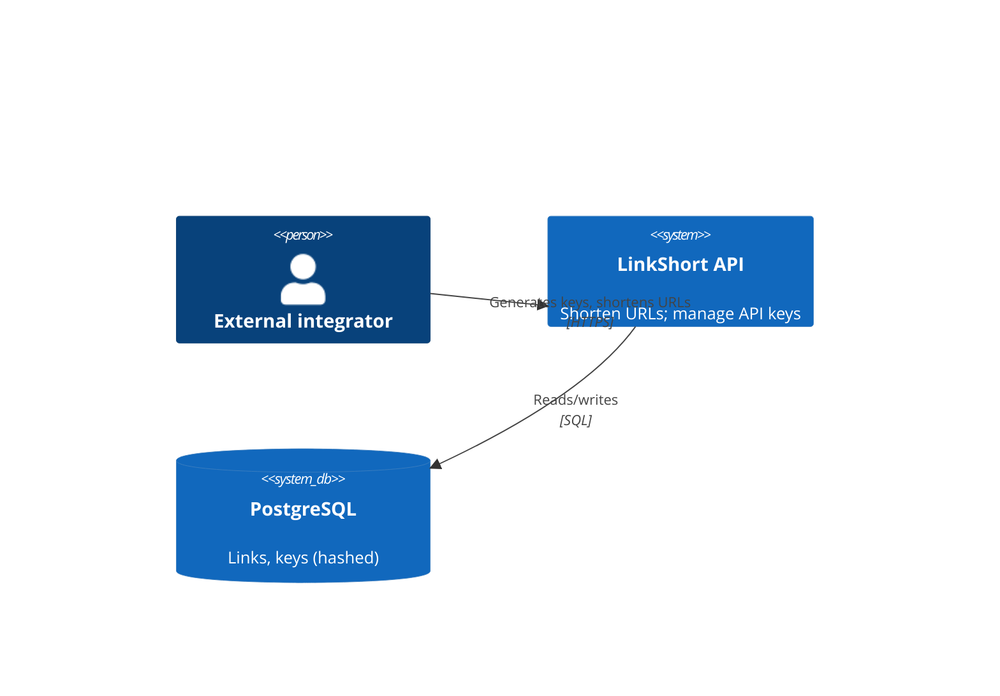
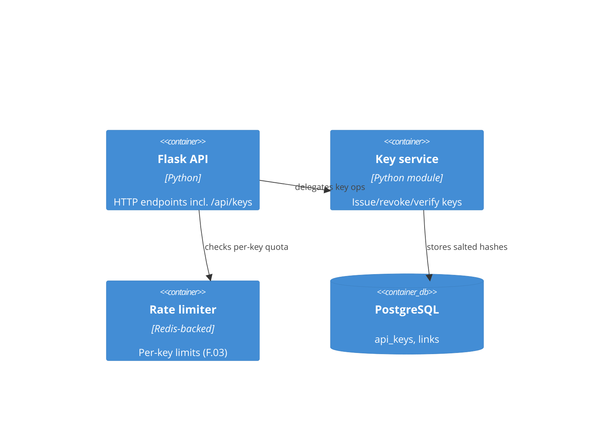

# HLD — LinkShort

## 1. Overview
LinkShort is a Flask REST API over PostgreSQL. This HLD covers the existing shape plus the
self-service API-keys epic (EP-001).

## 2. System context (C4 L1 — mandatory)

## 3. Containers (C4 L2 — mandatory)

## 4. Components & responsibilities
- **Key service** — issues a key (random 256-bit), returns it once, stores only its salted hash; verifies and revokes. Detailed in `SD-api-keys`.
- **Rate limiter** — enforces per-key request budgets (F.03).

## 5. Main runtime flows
Generate key: `POST /api/keys` → Key service mints token → stores hash → returns token once.

## 6. Deployment view
Single container image on the existing ECS service; PostgreSQL via RDS; Redis via ElastiCache.

## 7. Cross-cutting concerns
AuthN reuses the existing integrator session; keys are bearer credentials going forward.

## 8. Security — threat model (mandatory)
STRIDE → OWASP Top 10:2025.

| STRIDE | Threat | OWASP | Mitigation |
|---|---|---|---|
| Information disclosure | Key DB leak reveals usable keys | A02 Cryptographic Failures | Store only salted SHA-256 hashes (`ADR-0001`, `Q.01`) |
| Spoofing | Stolen key reused | A07 Identification & Auth Failures | Revocation (F.02); per-key rate limit (F.03) |
| Denial of service | One key floods the API | A04 Insecure Design | Per-key rate limiting (F.03) |

`security-reviewed: true` — threat model signed off.

## 9. FinOps — cost estimate (mandatory before build)
| Item | Driver | Est. monthly |
|---|---|---|
| Redis (rate limiting) | per-key counters | ~$15 (existing cache, marginal) |
| PostgreSQL columns | hashed keys | negligible |
| Compute | within existing service | $0 incremental |

Infracost: no new infrastructure; marginal cost. `cost-reviewed: true`.

## 10. Key trade-offs
One-time key reveal (better security) vs. integrator convenience (must store it themselves) —
accepted; mitigated by easy regeneration.

## 11. Known issues / debt
No key rotation policy yet — tracked for a later epic.
