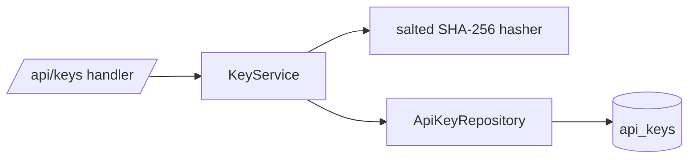
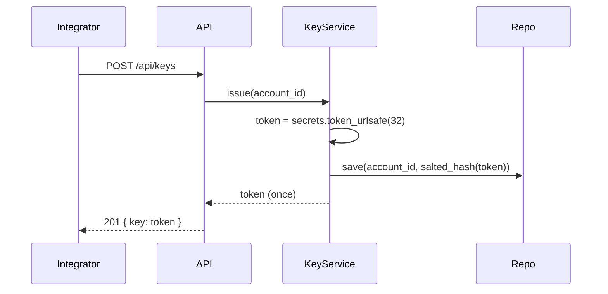

# SD — API-key management

Detailed design of the **Key service** container (recovered from the existing code and
extended for EP-001). Realizes view `V-COM-keys`.

## 1. Responsibilities
Issue, verify, and revoke API keys; never persist a key in plaintext.

## 2. Components (C4 L3)

## 3. Key generation flow

## 4. Data structures
`api_keys(id, account_id, key_hash, salt, created_at, revoked_at NULL)`. No `key_value` column
exists — by design (`ADR-0001`, `Q.01`).

## 5. Interfaces
- `issue(account_id) -> token` — returns the plaintext token once; persists only the hash.
- `verify(token) -> account_id | None` — hashes input, looks up, rejects if revoked.
- `revoke(account_id, key_id)` — sets `revoked_at` (F.02).

## 6. Error / edge handling
Unknown or revoked token → 401. The one-time token is never retrievable again (US-001 AC).

## 7. Decisions & drivers
Enacts `ADR-0001`; satisfies `F.01`, `F.02`, `Q.01`.
