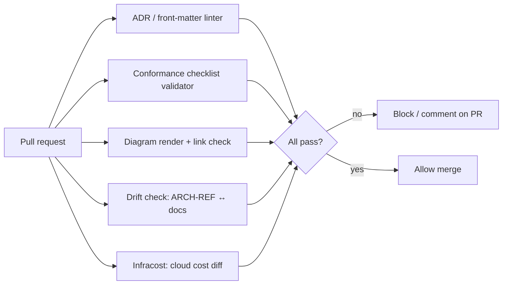

# Automation — Architecture-as-Code in CI/CD

Treat the architecture documentation as code: version-controlled, reviewed via pull
requests, and **validated automatically**. The same gates that protect source code protect
the architecture. Wire these checks into CI (GitHub Actions, GitLab CI, etc.) so docs stay
true, conformant, and current without manual policing.

> **Ready-to-run.** Working implementations ship with this skill in `assets/ci/`:
> `tools/arch_lint.py` (the validator — pure stdlib, no install), `tools/detect_doc_conventions.py`
> (learns the org's house style into `house-profile.yaml`), `spectral.yaml` (optional Spectral
> ruleset), `workflows/architecture-as-code.yml` (the CI workflow), and a `README.md` with
> copy-in instructions. Copy them into the target repo; the gate runs out-of-the-box, and
> `arch_lint.py` auto-loads `house-profile.yaml` to enforce the company's own mandatory
> sections and fields per document type.

## What to validate on every pull request



### 1. ADR & front-matter linter
Enforce the machine-readable contract from `conventions.md`:
- Required front-matter present and well-typed (`id`, `title`, `status`, `level`, `date`,
  `owner`, …); `status` is one of the allowed values; `level` ∈ {enterprise, solution,
  software}; ADR IDs are unique and zero-padded.
- Status transitions are legal (no `accepted → draft`); `superseded` ADRs link both ways.
- Tools: a YAML/JSON linter such as **Spectral** (https://github.com/stoplightio/spectral)
  with custom rules over front-matter, **markdownlint** for structure, or purpose-built ADR
  tooling — **adr-tools** (https://github.com/npryce/adr-tools) and **Log4brains**
  (https://github.com/thomvaill/log4brains, which also builds a searchable ADR site in CI).

### 2. Conformance-checklist validator
Fail the build if the ISO checklist isn't satisfied: every concern framed by a viewpoint,
every view governed by a viewpoint, every stakeholder has a concern, decisions present.
Implemented by `arch_lint.py conformance`: it parses `AD.md` (every concern framed by a
known viewpoint, every view governed by exactly one viewpoint, ≥1 stakeholder/concern/
viewpoint/view, ≥1 ADR) and fails on any unresolved ❌ in `conformance-checklist.md`.

### 3. Diagram render + link check
- Render `diagrams/workspace.dsl` with the **Structurizr CLI**
  (https://docs.structurizr.com/cli) to export SVGs as build artifacts (diagrams-as-code:
  the picture can never silently drift from the model). Validate embedded ```mermaid``` blocks
  parse. Run a Markdown link checker so cross-references (ADR ↔ doc ↔ code) aren't broken.

### 4. Architecture drift check (reflexion-as-CI)
- Verify each `ARCH-REF: ADR-NNNN` in the code points to an existing, non-superseded ADR,
  and flag accepted ADRs that no code references (possible drift).
- For stronger enforcement, run a **fitness function**: a dependency rule check that fails
  the build when code violates a recorded decision — e.g. **dependency-cruiser** (JS/TS),
  **ArchUnit** (JVM, https://www.archunit.org), **jQAssistant** constraints, or **NetArchTest**
  (.NET). This is the executable form of the Reflexion Model (`reverse-engineering.md`):
  divergences fail CI.

### 5. FinOps cost gate (Infracost)
- Run **Infracost** (https://www.infracost.io, https://github.com/infracost/infracost) on
  IaC (Terraform/CloudFormation/CDK/Bicep) to post a **cost diff on the PR** and, via policy,
  block changes that exceed a budget threshold. This "shifts FinOps left" so the cost
  estimate in `HLD`/`SAD` is checked against the actual infrastructure change before merge.

## The CI workflow (shipped)

The full workflow is `assets/ci/workflows/architecture-as-code.yml` (copy to
`.github/workflows/`). Its gate is a single dependency-free step:

```yaml
- uses: actions/setup-python@v5
  with: { python-version: "3.11" }
- name: Validate architecture docs (gate)
  run: python tools/arch_lint.py all --root docs/architecture --src src
```

The optional jobs (Spectral over the emitted front-matter, markdownlint + link check,
Structurizr C4 render, Infracost cost diff) are `continue-on-error`/conditional so the gate
never depends on external tooling or network. Local equivalents and a pre-commit hook are in
`assets/ci/README.md`.

## Principles

- **Docs are part of "done."** The same PR that changes architecturally significant code
  updates the ADR/SD and passes these gates — enforced, not hoped for.
- **Fail loud, early, cheap.** Cost, conformance, and drift problems surface on the PR, not
  in production or an audit.
- **Generate, don't hand-draw.** Diagrams and the cost matrix come from sources (Structurizr
  DSL, Infracost) so they can't lie about the system.
