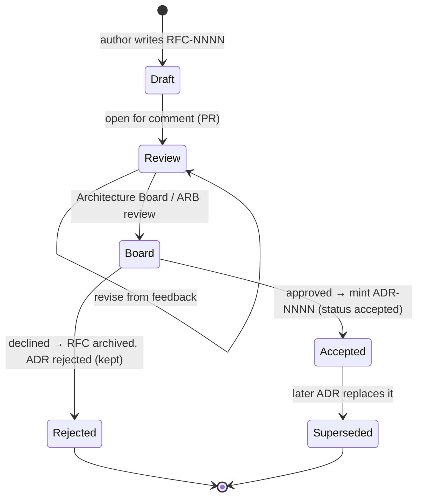

# Governance — RFC → ADR lifecycle

Enterprise-grade decisions follow a controlled path from *proposal* to *accepted
record*. This separates **deliberation** (an RFC, open for comment) from the **immutable
outcome** (an ADR). It mirrors how mature engineering orgs and the IETF/Python (PEP) and
Rust (RFC) communities work, and how TOGAF expects an Architecture Board to govern change.

## The flow

1. **Draft an RFC** (`decisions/rfc/RFC-NNNN-<slug>.md`, template `RFC.md`). It frames the
   problem, drivers, options, and a recommendation — but decides nothing yet.
2. **Open for comment** via a pull request. Reviewers (peers, affected teams, external
   contributors) discuss in the PR thread; the author revises. Time-box it.
3. **Architecture Board / ARB review.** For architecturally significant or cross-team
   decisions, the board (the architect group-lead + domain owners) approves, requests
   changes, or rejects. Trivial/local decisions can skip the board (lightweight path).
4. **On approval → mint the ADR.** Create `decisions/ADR-NNNN-<slug>.md` (Nygård/MADR,
   `status: accepted`), carrying `derived-from-rfc: RFC-NNNN`. The RFC's status becomes
   `accepted` and points to the ADR. The decision is now immutable.
5. **On rejection** → RFC `status: rejected` (archived, kept); optionally a short ADR with
   `status: rejected` records *why* the road was not taken. History is never deleted.
6. **Supersession.** A new ADR with `supersedes: ADR-XXXX` replaces an old one; update both
   files' links (see `conventions.md`).

## When to use the full RFC path vs go straight to an ADR

Match ceremony to impact (proportional rigour):

| Situation | Path |
|---|---|
| Cross-team / enterprise / one-way-door / contested | **Full RFC → Board → ADR** |
| Significant but within one team, low controversy | Lightweight: short ADR `proposed` → peer review on PR → `accepted` |
| Local, reversible, single reasonable option | No RFC, often no ADR (see triage) |

## Roles (TOGAF-aligned)

- **Architecture Board / ARB** — governs architecturally significant decisions, owns the
  principles, grants exceptions, and arbitrates trade-offs. In a small team this is the
  architect (group-lead) plus one or two domain owners.
- **Author / proposer** — anyone (internal or external contributor) may raise an RFC.
- **Reviewers** — affected teams and domain experts; comment on the PR.

## Traceability

The RFC and ADR are linked both ways (`derived-from-rfc:` / `resulting-adr:`), and the ADR
links up to the enterprise principles it honours (`complies-with: [PR.xx]`) and the drivers
it serves (`satisfies: [F.xx, Q.xx]`). This gives an unbroken chain:
**principle → RFC discussion → ADR → code (`ARCH-REF:`)**, which an auditor or agent can
follow in either direction by grep.

## Automation

The lifecycle is enforceable in CI — an ADR linter checks required front-matter and status
transitions, and the conformance checklist is validated on every PR. See `automation.md`.
