# Mermaid diagram guide

Embed mermaid in the doc it explains. A diagram earns its place only when it shows
something prose can't say cleanly — boundaries, a non-trivial flow, who-talks-to-
whom. If a sentence is clearer, write the sentence.

## The C4 model — mandatory levels & detail

Software architecture **must** be captured with the C4 model (Simon Brown,
https://c4model.com). The four levels zoom in progressively; which are mandatory depends
on the altitude/significance of the work:

| Level | Diagram | Shows | Detail | When **mandatory** |
|---|---|---|---|---|
| **L1 Context** | `C4Context` | the system as a box among users + external systems | lowest; no internals | **Always** for any system (HLD §2). One per system. |
| **L2 Container** | `C4Container` | deployable/runnable units (apps, services, stores) + tech | medium; no code | **Always** for any system (HLD §3). One per system. |
| **L3 Component** | `C4Component` | components inside one container + responsibilities | high; not code-level | **Required** for any container that is non-trivial or changed (SD §2). One per significant container. |
| **L4 Code** | `classDiagram`/UML | classes/types within one component | highest; implementation | **Optional** — only for a genuinely complex component; usually auto-generated from code, not hand-maintained. |

Rules: pick the **highest level that answers the question** and stop; L1+L2 are the
non-negotiable minimum for a system; L3 where a container is significant; L4 rarely and
preferably generated. For models-as-code across all levels from one source, use
**Structurizr DSL** (`diagrams/workspace.dsl`, https://docs.structurizr.com/dsl) — see the
end of this guide.

### Copy-paste snippets

**L1 — System Context:**
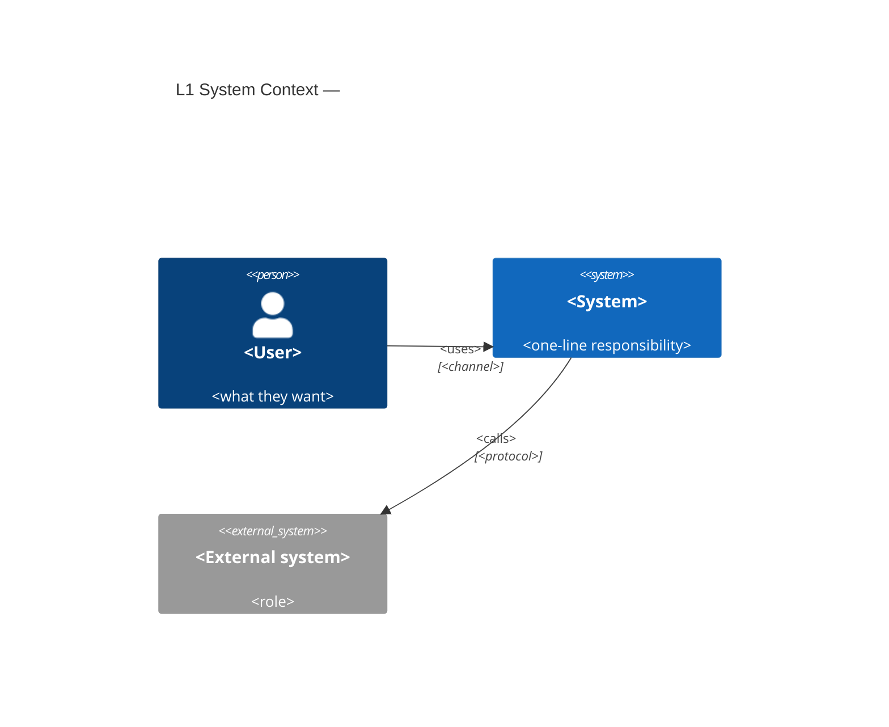

**L2 — Containers:**


**L3 — Components (inside one container):**
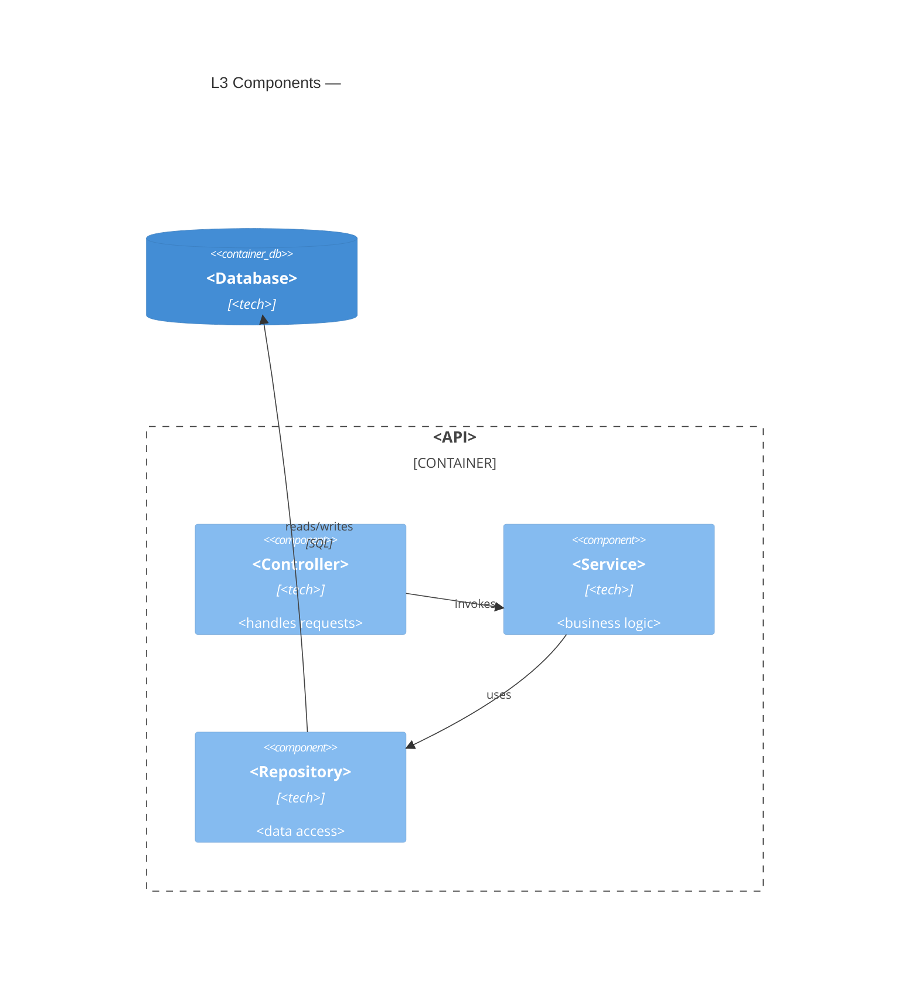

**L4 — Code (only when genuinely needed; prefer generated):**
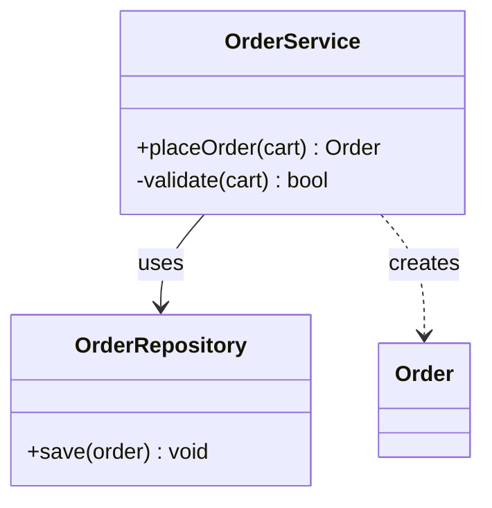

## Which view answers which question

| You need to show | Use | Lives in |
|---|---|---|
| System in its environment: users + external systems | `C4Context` | HLD |
| Major deployable/runnable parts and their tech | `C4Container` | HLD |
| Internals of one container: components & responsibilities | `C4Component` | SD |
| A specific runtime collaboration over time | `sequenceDiagram` | SD (sometimes HLD) |
| A dynamic step-by-step across elements | `C4Dynamic` | SD |
| Data-type relationships (composition/association) | `classDiagram` | SD/HLD |

Pick the **highest level that answers the question** and stop. Don't draw a
component diagram when a container diagram suffices.

## C4 Context (HLD)

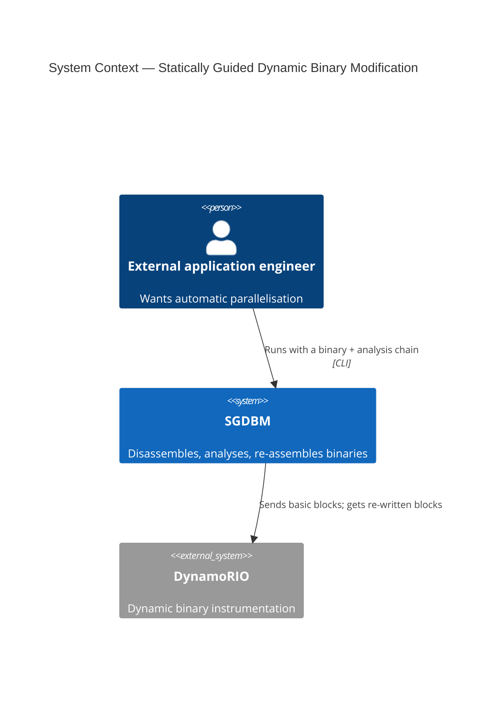

## C4 Container (HLD)

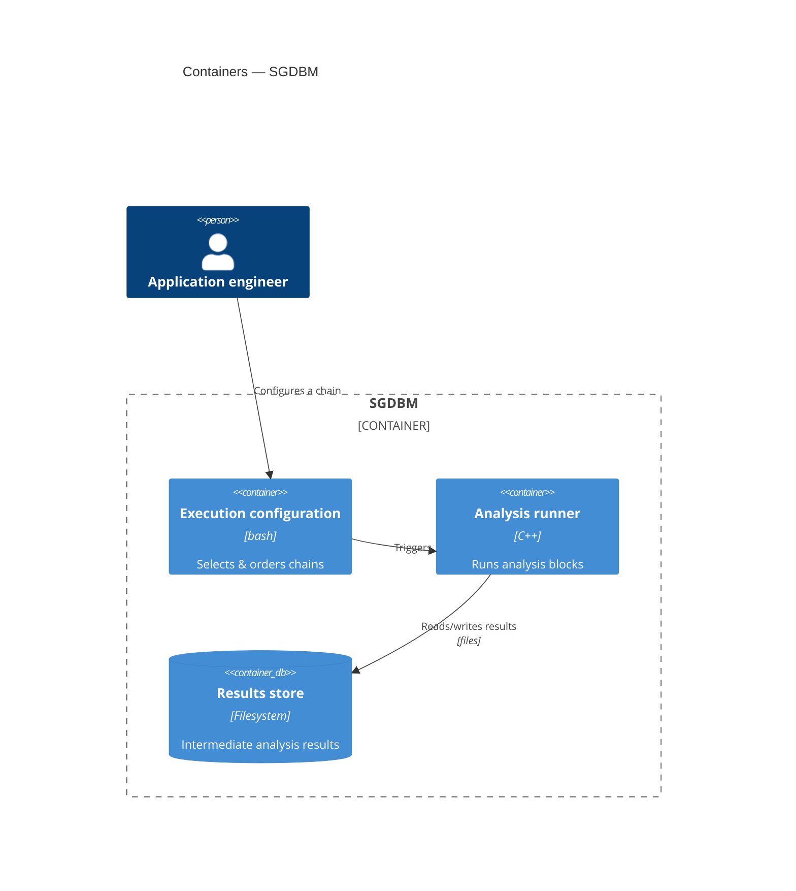

## C4 Component (SD)

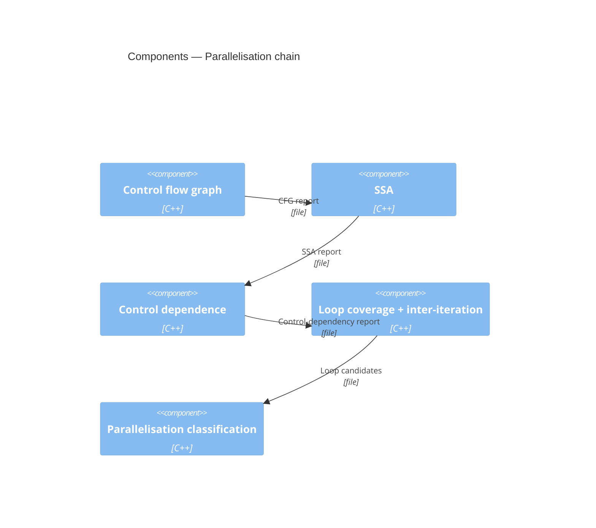

## Sequence diagram (SD)

Use for a concrete interaction with ordering, requests/responses, or alternative
paths. Show only the participants that matter to the point.

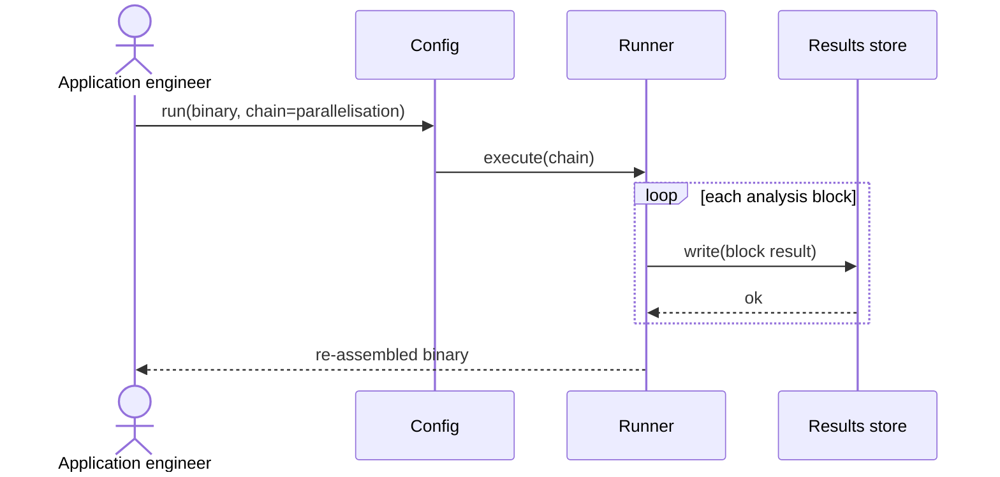

## C4 Dynamic (SD) — when ordering across elements is the point

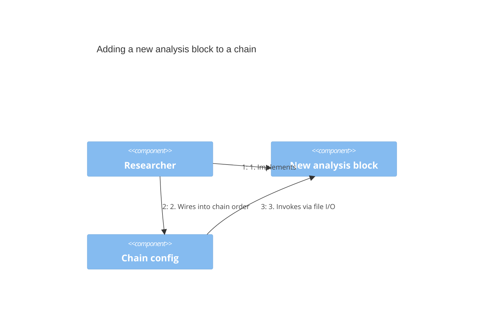

## Data types (SD/HLD) — composition vs association

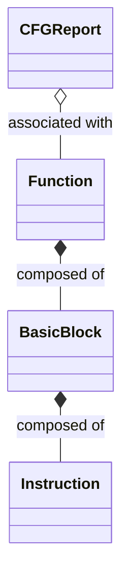
`*--` = composition (child can't exist without parent). `o--` = association
(logical link).

## Flowchart fallback

C4 mermaid blocks may render imperfectly in some viewers. If a renderer chokes,
or for a quick boundary sketch, fall back to a labelled `flowchart` and colour by
ownership (blue = this system, yellow = required external, purple = integrating
system — the Cambridge convention):

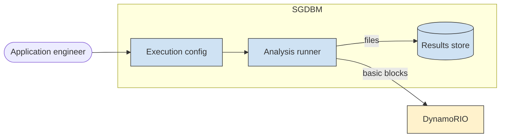

## Enterprise & solution views (ArchiMate / TOGAF in mermaid)

Mermaid has no native ArchiMate notation. Represent higher-altitude views as layered
flowcharts, colouring by ArchiMate layer (motivation/strategy/business/application/
technology) and using nesting for realization.

**Business capability map (enterprise, TOGAF Phase B):**
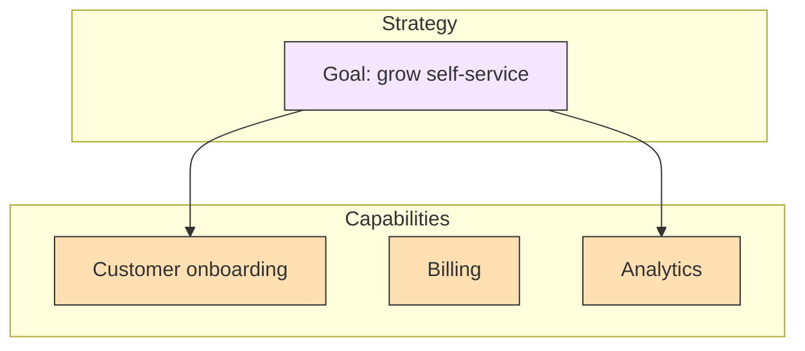

**Layered landscape (enterprise/solution, business→application→technology):**
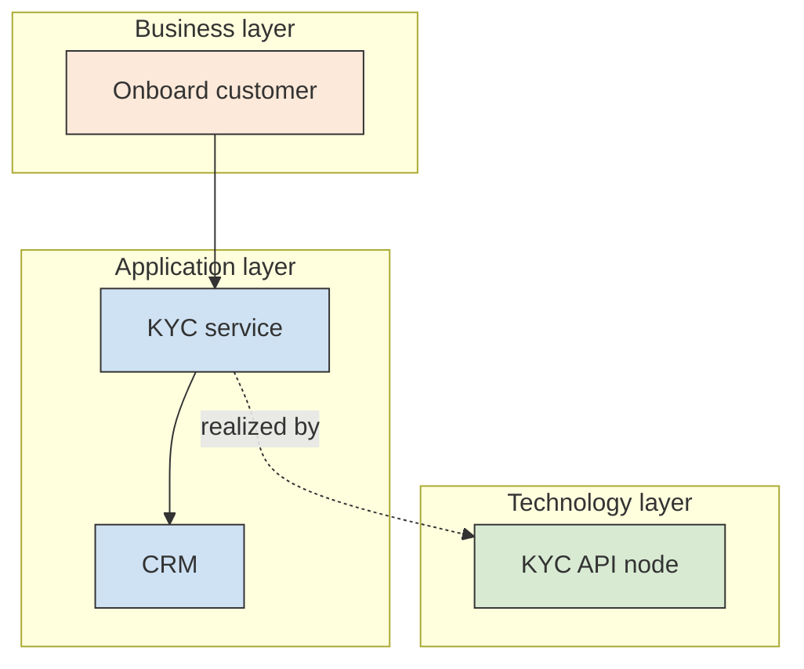

**Solution landscape (solution):** use a C4 `C4Context`/System-Landscape or a flowchart
spanning the systems involved (see the SAD template §3). Show systems as nodes,
integrations as labelled edges (contract + sync/async), and external SaaS in the
"external" colour.

Keep the ArchiMate intent even without the notation: distinguish *active structure*
(who/what acts), *behavior* (what happens), and *passive structure* (data acted on),
and use realization edges (`-.realized by.->`) to link a higher layer to the one below.

## Migration & transition views

For modernization/migration work, show the coexistence of old and new explicitly:
- **Strangler Fig / coexistence** — a router in front, legacy + new behind, an event bus and
  ACL between (full snippet in `references/migration.md` §3).
- **Transition states** — a simple left-to-right chain `Baseline → T1 → T2 → Target` makes the
  staged path legible (see the `transition-architecture.md` template).
- **As-Is sequence diagrams** — recovered from runtime (tracing/APM/logs) as a normal
  `sequenceDiagram`, tagged `source: traced` in the SD; compare against the designed (To-Be)
  one to reveal drift (`migration.md` §4).

## Rules of thumb

- One idea per diagram. If it needs a legend longer than the diagram, split it.
- Label edges with the data/contract that flows (e.g. "CFG report", "file"),
  matching the data-type names used in the SD.
- Keep diagrams in sync with the prose around them — a stale diagram misleads more
  than missing one. If you change the design, change the diagram in the same edit.

## Models-as-code: Structurizr DSL (the C4 source of truth)

For anything beyond a couple of diagrams, define **one C4 model** in Structurizr DSL and
render every level/view from it (https://docs.structurizr.com/dsl). The diagram can then
never drift from the model, and CI can export SVGs (`automation.md`).

```text
workspace {
  model {
    user = person "User"
    sys  = softwareSystem "System" {
      web = container "Web app" "tech"
      api = container "API" "tech"
      db  = container "Database" "tech"
    }
    user -> web "uses"
    web  -> api "calls"
    api  -> db  "reads/writes"
  }
  views {
    systemContext sys { include * autolayout lr }   // L1
    container sys      { include * autolayout lr }   // L2
    // component api  { include * autolayout lr }    // L3 per container
    theme default
  }
}
```

Store as `diagrams/workspace.dsl`; render with the Structurizr CLI in CI. Embedded mermaid
snippets (above) remain the lightweight default for a single doc.
