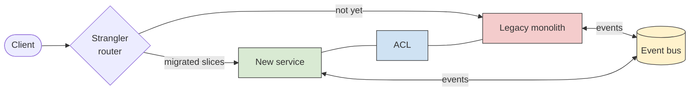

# Migration & modernization — As-Is → To-Be

A grounded strategy for large system transformations: choosing a migration approach,
recovering the **As-Is** accurately, designing safe **transition states**, and applying the
right modernization/integration patterns so reliability holds *during* the move. Migration
is usually **solution** or **enterprise** altitude work and is documented in a dedicated
**Transition Architecture** (`transition-architecture.md`), which sits between the Baseline
(As-Is) and Target (To-Be) architectures — a TOGAF ADM Phase E/F concept.

## 1. Pick the migration strategy — the 7 R's

For each system/workload, classify the move with the industry-standard **7 R's** (AWS,
expanding Gartner's original 5 R's). Most portfolios use 3–5 of these across their apps.

| Strategy | What it means | Use when |
|---|---|---|
| **Retire** | decommission | the app is unused / superseded |
| **Retain** | keep as-is (revisit later) | not worth moving yet, or constrained |
| **Rehost** | lift-and-shift, no code change | speed/exit-datacenter; optimize later |
| **Relocate** | move at hypervisor/VM level | bulk move without rebuild (e.g. VMware→cloud) |
| **Replatform** | lift-tinker-shift (e.g. managed DB) | small cloud wins without re-architecting |
| **Repurchase** | replace with a (SaaS) product | a good COTS/SaaS alternative exists |
| **Refactor / re-architect** | rebuild for cloud-native | high value justifies deep change |

> Gartner's 5 R's were Rehost, Refactor, Revise, Rebuild, Replace; AWS added Retire (2016)
> and Retain (2017), and Relocate later. Reference: AWS Prescriptive Guidance, "The 7 Rs."

## 2. The three transformation scenarios (blueprints)

**A. Local-to-Global** — decentralised, locally-built systems → one central global platform.
- Forces: data sovereignty/residency, latency, divergent local data models, regional rules.
- Blueprint: define the **canonical global model** + a per-region **Anti-Corruption Layer**
  (§3) so local quirks don't pollute the platform; converge via **event-driven
  intermediaries** while regions cut over one at a time (**Strangler Fig**). Keep a single
  source of truth per entity; map local schemas/protocols to the global standard (§5).

**B. On-Premise → Cloud-native** — own datacenters → public/hybrid cloud.
- Forces: cost (FinOps), operational model change, networking, security boundary.
- Blueprint: classify each workload with the **7 R's**; usually rehost for speed, then
  replatform/refactor the high-value ones. Run **hybrid** during transition (a network
  bridge + identity federation), validate per workload, and use the FinOps cost matrix
  (HLD/SAD §9) as a go/no-go gate.

**C. Monolith → Distributed / SaaS** — split a legacy monolith or integrate SaaS.
- Forces: tangled data model, shared database, transactional coupling.
- Blueprint: **Strangler Fig** around the monolith; carve **bounded contexts** out one at a
  time behind an **ACL**; decouple with **event-driven intermediaries**; split the shared DB
  last (data is the hardest part — use CDC, §5). Repurchase capabilities that a SaaS does
  better.

## 3. Modernization & integration patterns — when to use which

| Pattern | Purpose | Use when | Grounding |
|---|---|---|---|
| **Strangler Fig** | gradually replace a legacy system by routing slices to the new one until the old is "strangled" | you cannot do a big-bang cutover; want incremental, reversible steps | Martin Fowler, *StranglerFigApplication* (martinfowler.com); AWS/Azure migration patterns |
| **Anti-Corruption Layer (ACL)** | a translation layer so the legacy data model does not leak into / corrupt the new model | the legacy and target domain models differ; integrating with a system you don't control | Eric Evans, *Domain-Driven Design*; Azure Architecture Center — Anti-Corruption Layer pattern |
| **Event-Driven Intermediary** | decouple old and new via an event broker/queue so neither calls the other directly | you need temporal decoupling, buffering, or fan-out during coexistence | enterprise integration / event-driven architecture; broker e.g. Kafka |

A typical transition uses all three together: a façade/router (Strangler Fig) in front, an
ACL at each legacy boundary, and an event bus carrying changes between old and new while both
run in parallel.

## 4. Recover the As-Is from runtime (automated)

Static archaeology (`reverse-engineering.md`) shows *structure*; to capture true **runtime
behaviour** of an existing system, use **dynamic analysis** — it is preferred over static
analysis for behaviour because polymorphism and dynamic binding hide call paths in the
source. Turn observed runs into **As-Is sequence diagrams** (`SD.md`):

- **Distributed tracing** — instrument with **OpenTelemetry** (https://opentelemetry.io);
  spans across services *are* the message sequence. Trace backends (Jaeger, Zipkin, Grafana
  Tempo) and **APM** (Datadog, Dynatrace, New Relic) render service maps and traces you
  translate into a mermaid `sequenceDiagram`.
- **Log analysis** — correlate structured logs by request/correlation ID to reconstruct the
  call order when tracing isn't available.
- **Trim & merge** — collapse repeated traces and merge scenarios (k-tail/LTS merging) so the
  diagram shows distinct behaviours, not noise.

**Grounding (sequence-diagram recovery from traces):** Briand, Labiche & Leduc, "Toward the
Reverse Engineering of UML Sequence Diagrams for Distributed Java Software," *IEEE TSE*
32(9):642–663 (2006); Briand, Labiche & Miao, WCRE 2003; Delamare, Baudry & Le Traon (2006);
Ziadi et al., "A Fully Dynamic Approach…," ICECCS 2011. A key benefit they note: a
reverse-engineered (As-Is) sequence diagram can be **conformance-checked against the designed
(To-Be) one** — discrepancies reveal drift or defects (the behavioural twin of the reflexion
model in `reverse-engineering.md`).

Mark every recovered SD with `source: traced` (vs `source: designed`) — see `SD.md`.

## 5. Data & protocol mapping (legacy → modern standards)

The hardest part of any migration is data. Map deliberately, and prefer automation:

- **Protocol mapping** — legacy/proprietary protocols, SOAP, fixed-width/EDI, RPC → modern
  **REST** (resource CRUD), **GraphQL** (client-shaped reads), **gRPC** (typed, low-latency
  service-to-service), or **cloud-native event streams** (Kafka/Kinesis/PubSub). Put the
  translation in the **ACL** or an API gateway, never in the new domain core.
- **Schema mapping** — document old→new field/type mappings explicitly (a mapping table per
  entity); generate adapters from a schema registry (Avro/Protobuf/JSON-Schema) where
  possible; keep a single source of truth per entity.
- **Data movement** — use **Change Data Capture (CDC)** (e.g. Debezium) to stream changes
  from the legacy store to the new one so both stay consistent during coexistence, enabling a
  reversible cutover. Validate with reconciliation counts/checksums before each cutover.
- **File integrations** — replace local file drops/batch with event streams or object-storage
  events; keep an ACL adapter that still speaks the old format until producers migrate.

Record each significant mapping/CDC/protocol choice as an ADR; capture residual risks in the
Transition Architecture (§6) and the threat model (HLD/SAD §8).

## 6. Document it: the Transition Architecture

Use `transition-architecture.md`. It forces **Baseline (As-Is) → interim states (T1, T2 …) →
Target (To-Be)**, and for each interim state: scope, the patterns used (§3), a **risk
analysis**, **rollback strategy**, and **validation/exit criteria** before the next step. This
is TOGAF ADM Phase E (Opportunities & Solutions) / Phase F (Migration Planning): never jump
from As-Is to To-Be in one undocumented leap.
