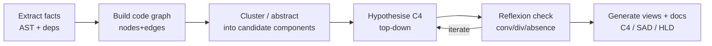

# Reverse engineering — code-to-architecture at scale

A grounded, repeatable strategy for **generating** architecture documentation and C4
diagrams from existing/legacy code — including polyglot codebases of hundreds or
thousands of files. It is built on the established academic discipline of **Software
Architecture Reconstruction (SAR)**, not ad-hoc guessing, and pairs classic techniques
with modern AST tooling and LLM assistance.

## The grounding: Software Architecture Reconstruction (SAR)

SAR is a recognised research field. Anchor the work in these references:

- **Chikofsky & Cross (1990), "Reverse Engineering and Design Recovery: A Taxonomy,"**
  *IEEE Software* 7(1):13–17 — the foundational vocabulary (reverse engineering, design
  recovery, re-documentation).
- **Murphy, Notkin & Sullivan (1995), "Software Reflexion Models: Bridging the Gap
  Between Source and High-Level Models,"** ACM SIGSOFT FSE — the **Reflexion Model**:
  define a *hypothesised* high-level architecture, map source entities to it, then compute
  **convergences / divergences / absences** against the *actual* code, and iterate. This is
  the single most useful technique for validating a reconstructed architecture and is how
  the skill's ISO-42010 *correspondence rules* should be checked against real code.
- **Ducasse & Pollet (2009), "Software Architecture Reconstruction: A Process-Oriented
  Taxonomy,"** *IEEE TSE* 35(4):573–591 — classifies SAR by goals, processes (bottom-up,
  top-down, hybrid), inputs, techniques, and outputs.
  PDF: https://scg.unibe.ch/archive/external/Duca09x-SOAArchitectureExtraction.pdf
- **van Deursen, Hofmeister, Koschke, Moonen, Riva (2004), "Symphony: View-Driven Software
  Architecture Reconstruction,"** WICSA — a view-driven reconstruction process (define
  target views → extract source views → map → reconcile). Aligns with C4/42010 views.
- **O'Brien, Stoermer & Verhoef (2002), "Software Architecture Reconstruction: Practice
  Needs and Current Approaches,"** **CMU/SEI-2002-TR-024** — the SEI practitioner report and
  the "Horseshoe" reengineering model.

Core principle from all of the above: SAR is **hybrid and iterative** — combine *bottom-up*
extraction (parse the code) with a *top-down* hypothesis (what you expect the architecture
to be), then reconcile the two with a reflexion model. Never trust a single auto-generated
graph as "the architecture."

## The pipeline (scales to polyglot, hundreds of files)

### 1. Extract facts (bottom-up, language-agnostic)
Parse every file to an **AST** and emit facts: files, modules, classes/functions, and edges
(imports, calls, inheritance, instantiation). For polyglot scale, use a uniform parser:
- **Tree-sitter** (https://tree-sitter.github.io) — fast, incremental, error-tolerant
  parsing with grammars for 100+ languages; the de-facto standard for editor/code analysis
  and the basis of most modern repo-mapping tools. `tree-sitter-graph`
  (https://github.com/tree-sitter/tree-sitter-graph) constructs graphs directly from ASTs.
- Language/ecosystem-specific extractors when available: **dependency-cruiser**
  (JS/TS, https://github.com/sverweij/dependency-cruiser), **jQAssistant**
  (JVM → Neo4j, https://jqassistant.org), **CodeQL** (multi-language semantic queries,
  https://codeql.github.com), **Sourcegraph/SCIP** for cross-repo code graphs,
  and commercial **SciTools Understand**, **NDepend**, **Structure101**, **Lattix** for
  large estates and dependency-structure-matrix (DSM) analysis.

### 2. Build a code knowledge graph
Load the facts into a graph (Neo4j, SQLite+FTS, or an in-memory graph). Nodes = code
entities; edges = relationships. This is the queryable substrate for clustering and for
**GraphRAG**-style LLM retrieval (give the agent the graph, not the raw files).

### 3. Cluster into candidate components
Group fine-grained nodes into architectural elements using: directory/package structure,
naming conventions, **dependency clustering** (high cohesion / low coupling), and DSM /
community-detection algorithms. These candidates become C4 *components* and *containers*.

### 4. Hypothesise the C4 model (top-down)
Independently sketch the architecture you *expect* (from READMEs, entry points, domain
knowledge) as a C4 Context/Container model. This is the conceptual view.

### 5. Reflexion check (reconcile)
Map the extracted clusters onto the hypothesised model and compute **convergences**
(present in both), **divergences** (in code, not expected), and **absences** (expected, not
in code). Iterate until the model matches reality. This step is what makes the output
*true* rather than plausible, and it directly produces the "known inconsistencies" for the
AD (§7) and the technical-debt entries.

### 6. Generate views and documents
Emit the artifacts: C4 views (prefer **Structurizr DSL**, https://docs.structurizr.com/dsl,
as a single models-as-code source that renders all levels, or mermaid snippets inline),
then draft the `HLD`/`SD`/`SAD` and recover ADRs (`methods.md` §8) from git history.

## LLM-assisted reverse engineering (how the agent should work)

- **Index before reasoning.** Build the AST/graph first; have the agent query it
  (GraphRAG) instead of reading hundreds of files blindly — this is how modern tools work
  (e.g. Aider's repo map, tree-sitter-based code knowledge graphs). It controls context and
  improves accuracy on large codebases.
- **AST-aware chunking.** When feeding code to the model, chunk along AST boundaries
  (functions/classes), not arbitrary line windows, so each chunk is semantically whole.
- **Map-reduce over the repo.** Summarise per-module bottom-up, then synthesise the
  container/context view top-down — never attempt a whole large repo in one context window.
- **Human/agent-in-the-loop reflexion.** Treat every generated diagram as a *hypothesis* to
  be reflexion-checked against extracted facts before it lands in the docs.
- **Cite evidence.** Each reconstructed component/decision should point to the files or
  commits it was derived from, and inferred rationale must be marked inferred (see the
  evidence discipline in `methods.md` §10).

## Polyglot & scale checklist

- Use Tree-sitter (or per-language extractors) so **every** language is parsed uniformly.
- Persist facts in a graph DB so the analysis is incremental (re-parse only diffs).
- Cluster by dependencies + structure; don't rely on folders alone.
- Reconcile with a reflexion model; record divergences/absences as debt.
- Output models-as-code (Structurizr DSL) so diagrams regenerate as the code evolves.
- Bound LLM context with retrieval over the graph; chunk on AST nodes; map-reduce.
