<!-- GENERATED by scripts/render.py from data/*.json — do not edit by hand -->

# 02 · Skill Dependency Graph

Skills never depend on each other's internals; they depend on **contracts**. A skill depends on another skill exactly when it consumes a contract that skill owns. Contracts carry a layer (0 platform → 5 tools, P = process) and a build-level `requires` list that `check.py` proves acyclic and never upward. Runtime data may flow in both directions between subsystems (animation ↔ physics), but only through frame phases declared in `C-FRAME`.

## Domain-level dependencies (required edges)

Nodes are top-level skills (a domain lead with its subtree, or a standalone cross-cutting skill). Edges are aggregated required contract dependencies between their subtrees; process contracts and universal runtime contracts (`C-ERR`, `C-MEM`, `C-INSTR`, `C-CRASH`, `C-BUDGET`) are omitted for legibility — every runtime skill consumes them.

```mermaid
flowchart LR
  architecture_governance["Architecture Governance"]
  program_orchestration["Engine Program Orchestration"]
  research_evidence["Research & Evidence"]
  performance_architect["Performance Architect"]
  test_architect["Test Architect"]
  security_engineering["Security Engineering"]
  observability_telemetry["Observability & Telemetry"]
  crash_diagnostics["Crash & Hang Diagnostics"]
  determinism_replay["Determinism & Replay"]
  hot_reload_iteration["Hot Reload & Iteration"]
  accessibility["Accessibility"]
  api_lifecycle_migration["API Lifecycle & Engine Migration"]
  developer_experience_docs["Developer Experience & Documentation"]
  core_runtime_architect["Core Runtime Architect"]
  platform_architect["Platform Architect"]
  content_pipeline_architect["Content Pipeline Architect"]
  resource_streaming_architect["Resource & Streaming Architect"]
  world_architect["World Architect"]
  render_architect["Render Architect"]
  physics_architect["Physics Architect"]
  animation_architect["Animation Architect"]
  audio_architect["Audio Architect"]
  network_architect["Network Architect"]
  gameplay_architect["Gameplay Framework Architect"]
  ui_architect["UI Architect"]
  editor_architect["Editor Architect"]
  build_release_architect["Build & Release Architect"]
  gpu_platform_architect["GPU Platform Architect"]
  engine_product_management["Engine Product Management"]
  accessibility --> platform_architect
  accessibility --> ui_architect
  animation_architect --> accessibility
  animation_architect --> core_runtime_architect
  animation_architect --> determinism_replay
  animation_architect --> gpu_platform_architect
  animation_architect --> physics_architect
  animation_architect --> render_architect
  animation_architect --> resource_streaming_architect
  animation_architect --> world_architect
  api_lifecycle_migration --> build_release_architect
  api_lifecycle_migration --> core_runtime_architect
  api_lifecycle_migration --> engine_product_management
  audio_architect --> accessibility
  audio_architect --> content_pipeline_architect
  audio_architect --> core_runtime_architect
  audio_architect --> platform_architect
  audio_architect --> resource_streaming_architect
  audio_architect --> ui_architect
  audio_architect --> world_architect
  build_release_architect --> content_pipeline_architect
  build_release_architect --> core_runtime_architect
  build_release_architect --> engine_product_management
  build_release_architect --> platform_architect
  build_release_architect --> resource_streaming_architect
  content_pipeline_architect --> core_runtime_architect
  core_runtime_architect --> api_lifecycle_migration
  core_runtime_architect --> determinism_replay
  core_runtime_architect --> observability_telemetry
  core_runtime_architect --> platform_architect
  core_runtime_architect --> resource_streaming_architect
  core_runtime_architect --> security_engineering
  crash_diagnostics --> observability_telemetry
  crash_diagnostics --> platform_architect
  determinism_replay --> core_runtime_architect
  editor_architect --> build_release_architect
  editor_architect --> content_pipeline_architect
  editor_architect --> core_runtime_architect
  editor_architect --> render_architect
  editor_architect --> ui_architect
  editor_architect --> world_architect
  engine_architect --> engine_product_management
  gameplay_architect --> accessibility
  gameplay_architect --> content_pipeline_architect
  gameplay_architect --> core_runtime_architect
  gameplay_architect --> determinism_replay
  gameplay_architect --> physics_architect
  gameplay_architect --> platform_architect
  gameplay_architect --> resource_streaming_architect
  gameplay_architect --> security_engineering
  gameplay_architect --> ui_architect
  gameplay_architect --> world_architect
  gpu_platform_architect --> core_runtime_architect
  gpu_platform_architect --> platform_architect
  gpu_platform_architect --> render_architect
  gpu_platform_architect --> resource_streaming_architect
  hot_reload_iteration --> core_runtime_architect
  hot_reload_iteration --> resource_streaming_architect
  network_architect --> build_release_architect
  network_architect --> core_runtime_architect
  network_architect --> determinism_replay
  network_architect --> platform_architect
  network_architect --> security_engineering
  network_architect --> world_architect
  observability_telemetry --> core_runtime_architect
  observability_telemetry --> platform_architect
  performance_architect --> core_runtime_architect
  performance_architect --> engine_product_management
  performance_architect --> gpu_platform_architect
  performance_architect --> network_architect
  performance_architect --> observability_telemetry
  performance_architect --> resource_streaming_architect
  physics_architect --> animation_architect
  physics_architect --> core_runtime_architect
  physics_architect --> determinism_replay
  physics_architect --> editor_architect
  physics_architect --> observability_telemetry
  physics_architect --> resource_streaming_architect
  physics_architect --> world_architect
  platform_architect --> accessibility
  platform_architect --> core_runtime_architect
  platform_architect --> security_engineering
  platform_architect --> world_architect
  program_orchestration --> engine_product_management
  render_architect --> accessibility
  render_architect --> animation_architect
  render_architect --> audio_architect
  render_architect --> content_pipeline_architect
  render_architect --> core_runtime_architect
  render_architect --> gpu_platform_architect
  render_architect --> platform_architect
  render_architect --> resource_streaming_architect
  render_architect --> ui_architect
  render_architect --> world_architect
  resource_streaming_architect --> content_pipeline_architect
  resource_streaming_architect --> core_runtime_architect
  resource_streaming_architect --> platform_architect
  resource_streaming_architect --> security_engineering
  security_engineering --> core_runtime_architect
  security_engineering --> platform_architect
  test_architect --> animation_architect
  test_architect --> api_lifecycle_migration
  test_architect --> audio_architect
  test_architect --> core_runtime_architect
  test_architect --> determinism_replay
  test_architect --> gameplay_architect
  test_architect --> gpu_platform_architect
  test_architect --> physics_architect
  test_architect --> platform_architect
  test_architect --> render_architect
  test_architect --> resource_streaming_architect
  ui_architect --> accessibility
  ui_architect --> content_pipeline_architect
  ui_architect --> core_runtime_architect
  ui_architect --> platform_architect
  ui_architect --> render_architect
  ui_architect --> world_architect
  world_architect --> content_pipeline_architect
  world_architect --> core_runtime_architect
  world_architect --> determinism_replay
  world_architect --> physics_architect
  world_architect --> resource_streaming_architect
```

## Layered contract graph

- **L0** (2): `C-PAL`, `C-BASE`
- **L1** (16): `C-ERR`, `C-MOD`, `C-CFG`, `C-MATH`, `C-MEM`, `C-TYPES`, `C-SYNC`, `C-TASK`, `C-INSTR`, `C-CRASH`, `C-DET`, `C-PLUGIN`, `C-LIFETIME`, `C-SCALE`, `C-TESTHOST`, `C-SIGN`
- **L2** (27): `C-FRAME`, `C-ID`, `C-ECS`, `C-REFL`, `C-SER`, `C-IO`, `C-VFS`, `C-ASSET`, `C-RES`, `C-RELOAD`, `C-SPATIAL`, `C-RHI`, `C-GPUMEM`, `C-ML`, `C-IPC`, `C-FLOW`, `C-PRESENT`, `C-SNAPSHOT`, `C-VIEW`, `C-SIGNIF`, `C-GPUTIER`, `C-DEVICE`, `C-NETLINK`, `C-GOVERN`, `C-RTAS`, `C-CMD`, `C-STATECLASS`
- **L3** (55): `C-WORLD`, `C-RG`, `C-SHADER`, `C-MATIF`, `C-RSCENE`, `C-TEMPORAL`, `C-RT`, `C-TEXT`, `C-DRAW2D`, `C-PHYS`, `C-ANIM`, `C-AUDIO`, `C-INPUT`, `C-NET`, `C-SVC`, `C-LOC`, `C-UI`, `C-NAV`, `C-SCRIPT`, `C-SAVE`, `C-REPLAY`, `C-ENV`, `C-INSTANCES`, `C-GEOLOD`, `C-VT`, `C-LIGHT`, `C-GI`, `C-ATMOS`, `C-VIDEO`, `C-REP`, `C-PREDICT`, `C-GAMEDATA`, `C-DIALOGUE`, `C-A11YRT`, `C-DEVUI`, `C-LIVE`, `C-XRVIEW`, `C-MLGPU`, `C-SCENETEX`, `C-COLOR`, `C-LIGHTENV`, `C-TRANSLUCENT`, `C-PCG`, `C-VEHICLE`, `C-NETSESSION`, `C-SERVER`, `C-SHARD`, `C-SRVDATA`, `C-AUTOMATION`, `C-INTEGRITY`, `C-VFX`, `C-PTREF`, `C-HOSTAUTH`, `C-REWIND`, `C-CHARCTRL`
- **L4** (9): `C-GAME`, `C-MOVE`, `C-AIAGENT`, `C-EDIT`, `C-ABILITY`, `C-CROWD`, `C-SEQ`, `C-AI`, `C-CAMERA`
- **L5** (11): `C-COOK`, `C-EDCMD`, `C-GRAPH`, `C-BUILD`, `C-PKG`, `C-EDHOST`, `C-TARGETPLAT`, `C-EDVIEW`, `C-VCS`, `C-EDPREVIEW`, `C-IMPORT`
- **LP** (14): `C-BUDGET`, `C-ARCH`, `C-ADR`, `C-EVID`, `C-ORCH`, `C-TEST`, `C-API`, `C-TRUST`, `C-A11Y`, `C-CERT`, `C-PERF`, `C-BENCH`, `C-PROD`, `C-RELEASE`

## Contracts

Fan-in counts explicit consumers (universal contracts are consumed implicitly by every runtime skill or every skill). High fan-in contracts are the **critical architectural contracts**: they are designed first, versioned under `C-API`, and changed only through the change-request protocol in `C-ORCH`.

`Oracle author` writes the contract's acceptance suite (`tests/acceptance/<contract>/`, read-only for implementers). Implementers are backends registered for the contract (per platform where marked).

| Contract | Layer | Owner | Implementers | Oracle author | Requires | Fan-in | Summary |
|---|---|---|---|---|---|---|---|
| `C-PAL` Platform abstraction layer | 0 | platform-architect | platform-desktop, platform-console, platform-mobile, platform-web, platform-server-host | robustness-fuzzing | C-BASE | 30 | OS services, CPU/GPU capability discovery and device database, windowing, display & safe area, lifecycle and system events (memory pressure, thermal/power, network reachability, audio endpoint, locale, OS accessibility settings, overlay/focus, storage, page size), clocks and clock-domain correlation, processes/pipes/shared memory/dev sockets, HTTP(S)/TLS client, permissions, thread creation/affinity/QoS and main-thread dispatch. Platform code lives only in the PAL or in a registered platform backend slot; suspend/resume quiesce protocol (outstanding IO, GPU idle/device recreate, connection loss) and time-discontinuity events; interfaces and policy owned by platform-architect; each platform's implementation is a registered backend implemented by that platform's skill; key chain: device record → GPU feature tier (C-GPUTIER) + platform capability tier → performance tier → knob set (C-SCALE). |
| `C-FRAME` Frame schedule, phases & time | 2 | frame-orchestration | — | robustness-fuzzing | C-TASK | 28 | Time domains and multi-rate cadences, pipelining depth, the minimal set of named global sync points, frame-wide access declarations (ECS components and registered service resources) from which ordering is derived, the canonical simulation schedule, injectable test clock. |
| `C-PHYS` Physics world & scene queries | 3 | physics-architect | rigid-body-dynamics, physics-2d | simulation-validation | C-SPATIAL, C-FRAME, C-ID, C-SNAPSHOT, C-DET | 26 | Bodies, shapes, queries (handle-addressed, batched), contact events with budgets, stepping phases, batch add/remove O(batch), snapshot/restore/resimulate participation, collider history for rewind; world instances and local simulation spaces; conformance: restore + resimulate N ticks reproduces the state hash at the declared determinism level; backends (in-house 2D, in-house 3D, or middleware behind the integration layer PHY.ARCH.middleware-layer) implement it; every configuration that requires it contains one; substep policy hook whose outputs are recorded or deterministic; active-set/change-set output for replication; contact events are delivered as batched, filtered outputs (no per-body synchronous callbacks) |
| `C-TASK` Task graph & job API | 1 | job-system-task-graph | — | robustness-fuzzing | C-SYNC, C-MEM | 26 | Task creation, dependencies, priorities/QoS, blocking rules, completion-token integration, process-wide thread inventory with pinned/affinity lanes and middleware adapters, serial deterministic test mode and schedule-perturbation hooks, task tracing; cancel/stop-token and cancel-vs-completion semantics (CORE.JOBS.cancellation). |
| `C-RG` Render graph | 3 | render-graph-scheduling | — | render-validation | C-RHI, C-GPUMEM | 24 | Pass/resource declaration, queues, history resources, readback, dynamic GPU-generated work nodes; barrier output mapped or elided on implicit-sync backends. |
| `C-RSCENE` Render scene & render features | 3 | render-architect | — | render-validation | C-RG, C-SPATIAL, C-MATIF | 23 | Render features and views, render-scene data streams extracted as change-tracked deltas (no per-object proxy mirror; CPU cost O(changes)), feature registration with minimum GPU tier, non-mesh primitive kinds; GPU-deformation flags and a cache-invalidation channel (pages, surface caches, BLAS updates); one persistent instance scene (C-INSTANCES); features consume it and never mirror it. |
| `C-DET` Determinism | 1 | determinism-replay | — | simulation-validation | C-MATH | 20 | Determinism levels, floating-point rules, ordered-execution rules, state-hash hooks; recorded state-hash traces are regression-only; an analytic or fixed-point determinism reference scenario anchors cross-platform claims. |
| `C-RES` Resource lifetime & streaming requests | 2 | resource-streaming-architect | — | functional-automation-soak | C-ASSET, C-VFS, C-MEM | 19 | Resource handles and explicit lifetime; load requests with priority/deadline; the staged load pipeline (IO → decompress → fixup → GPU upload → publish) that every resource type implements; pool registration, pressure signals and shrink-by-deadline requests; residency notifications drained at a declared C-FRAME phase; fallbacks; every CPU/GPU pool registers with the arbiter and never sizes itself. |
| `C-ANIM` Animation pose output | 3 | animation-architect | — | simulation-validation | C-SPATIAL, C-ID | 17 | Pose output and control input (parameters, action/montage requests, instance lifetime), root motion, animation events, pose history for rewind, network-sync hooks, physics/render hand-off; trajectory/desired-motion input and root-motion delta output; animation events are delivered as batched outputs via C-FLOW |
| `C-RELOAD` Hot reload | 2 | hot-reload-iteration | — | robustness-fuzzing | C-RES, C-MOD | 17 | Change notifications, invalidation, state preservation hooks. |
| `C-WORLD` World partition & streaming cells | 3 | world-architect | — | simulation-validation | C-SPATIAL, C-RES | 17 | Cells, streaming sources, world data activation in budgeted, time-sliced batches with bulk registration. |
| `C-ML` ML inference | 2 | ml-inference-runtime | — | robustness-fuzzing | C-TASK, C-MEM | 16 | Model format and packaging, CPU and NPU backends, async invocation, precision classes, budgets; sequence sessions, streaming results, residency class, local/remote routing. |
| `C-SER` Serialization & schema evolution | 2 | serialization-schema | — | robustness-fuzzing | C-REFL | 16 | Formats, versioning, upgraders, canonical form, untrusted-input rules. |
| `C-BASE` Bootstrap base | 0 | platform-architect | — | foundation-conformance | — | 15 | Raw page allocator, raw log/assert/abort sink, monotonic clock, raw thread primitives and late-bound hook tables that higher layers install (allocator, log sink, assert handler, crash annotator). Depends on nothing. |
| `C-ENV` Environment queries | 3 | world-architect | terrain, water-ocean, atmosphere-weather, voxel-worlds | simulation-validation | C-SPATIAL | 15 | Environment query service: ground height/surface type, water surface/volume (height, velocity, depth, body id), wind field, weather parameters, deformation deltas; implemented by terrain, water, atmosphere and voxel providers; headless-capable; queries submitted as batched streams per phase; provider bound per region/cell at activation (no per-query dispatch across providers). |
| `C-TEMPORAL` Temporal data | 3 | reconstruction-upscaling | — | render-validation | C-RG | 15 | Motion vectors, jitter, history validity, reactive/transparency masks, resolution scaling; motion-vector obligations for every moving/animated surface; UI/HUD separation for frame generation; depth+motion submission for XR spacewarp; denoiser signal submission (signal class, hit distance, sample count, guide buffers from C-SCENETEX) with per-signal and joint ray-reconstruction modes. |
| `C-A11Y` Accessibility requirements | P | accessibility | — | — | — | 14 | Mapped guideline requirements per player-facing feature. |
| `C-ECS` ECS | 2 | ecs-runtime | — | foundation-conformance | C-ID, C-TASK, C-FRAME | 14 | Components, queries, systems, access declarations, command buffers. |
| `C-SCENETEX` Per-view scene textures | 3 | render-architect | — | render-validation | C-RG, C-MATIF | 14 | Named per-view render-graph resources and their producer phases: depth, HZB, visibility IDs, surface-attribute decode (visibility buffer and deferred), velocity, scene color, denoiser/upscaler guide buffers; variants per shading path and tier; depth and projection conventions per RND.ARCH.depth-convention. |
| `C-REP` Replication | 3 | replication | — | simulation-validation | C-NETLINK, C-SER, C-ID, C-STATECLASS | 13 | Replicated state declaration, relevancy hooks, RPCs, net IDs, batch registration, replay and spectator streams; producers mark dirty state; no per-connection full-state comparison; per-faction visibility registers as a relevancy filter through the relevancy hooks (basis of XC.SEC.info-hiding); layout negotiation within the compatibility window; per-RPC validator and authority declaration. |
| `C-AUDIO` Audio emitters & events | 3 | audio-architect | — | simulation-validation | C-SPATIAL, C-ID | 12 | Emitter/listener data (multiple listeners), event triggering, parameters, busses, the sample-accurate audio clock exposed to gameplay. |
| `C-INSTANCES` Instance scene | 3 | geometry-pipeline | — | render-validation | C-RG, C-GPUMEM | 12 | Persistent instance/primitive handles, batched add/remove/update with delta upload (cost O(changes)), instance data layout shared with the ray-tracing instance builder; served by both CPU and GPU submission paths. |
| `C-NET` Netcode model & authority policy | 3 | network-architect | — | simulation-validation | C-FRAME, C-ID | 12 | Netcode model per game type, authority model, net tick and time policy, compatibility window and handshake policy. |
| `C-REFL` Reflection & type metadata | 2 | reflection-metadata | — | robustness-fuzzing | C-TYPES | 12 | Type registry, properties, attributes, dynamic invocation. |
| `C-SPATIAL` Transforms & spatial queries | 2 | spatial-transforms | — | simulation-validation | C-MATH, C-ID | 12 | Transform representation incl. large-world coordinates, hierarchy, generic spatial queries, per-phase change sets (moved/attached/teleported) consumed by all spatial replicas; batched query API. |
| `C-SYNC` Concurrency primitives & thread-safety annotations | 1 | concurrency-primitives | — | robustness-fuzzing | C-BASE | 12 | Atomics, locks, lock-free queues, safe reclamation, thread-safety annotation conventions, OS-waitable completion tokens that IO/GPU fences plug into; lock-free node storage uses the C-BASE raw allocator (not C-MEM). |
| `C-VIEW` Views & view arbitration | 2 | spatial-transforms | — | simulation-validation | C-SPATIAL | 12 | View registry: view sources (gameplay camera, cinematic, editor, photo mode, XR pose) with priority/blend stack and shake/FOV channels, per-local-player views, view origin for LWC rebasing; derived listener and streaming-source signals for sinks; shake and FOV channels are final composition of view sources; shake content and its accessibility scaling belong to C-CAMERA. |
| `C-A11YRT` Accessibility runtime | 3 | accessibility | — | ui-text-conformance | C-TEXT | 11 | Caption/subtitle submission, screen-reader announcements and accessibility-tree ingestion, TTS/STT, accessibility settings and change events; caption sources: dialogue, audio-event captions, sequencer; settings read through a snapshot like C-CFG; accessibility settings are C-CFG settings entries. |
| `C-ASSET` Asset identity & references | 2 | content-pipeline-architect | — | functional-automation-soak | C-SER, C-ID | 11 | Asset IDs, soft/hard references, dependency declaration, registry queries; registry queries are served from chunked, on-demand indexes. |
| `C-GPUTIER` GPU feature tiers | 2 | gpu-platform-architect | — | render-validation | C-RHI | 11 | Named GPU feature tiers (binding model, pipeline-state model, queue topology, mesh/RT/tensor support, memory model) and the API baseline each tier maps to; render features declare the minimum tier they need; tiers 'rt' and 'rt+tensor' declare hardware ray tracing and tensor support as required baselines for configurations carrying the hwrt profile; features declare a required capability set (API-neutral feature bits with versioned limits); tiers are named bundles for configurations and QA matrices. |
| `C-MATIF` Material interface | 3 | material-system | — | render-validation | C-SHADER | 11 | Material parameters, shading model inputs, material domains; raster-stage program (mask, world-position offset, displacement) and visibility-buffer/deferred resolve entry points. |
| `C-LIGHT` Direct lighting sampling | 3 | direct-lighting-shadows | — | render-validation | C-RSCENE | 10 | Light lists (clustered or stochastic), shadow lookups, light units, many-light sampling API for any shading point incl. translucency, volumes and particles. |
| `C-SIGNIF` Significance & simulation tiers | 2 | world-architect | — | simulation-validation | C-VIEW | 10 | Per-entity significance, simulation tier and update budget, computed once from views/players (all players on a server) and consumed by each domain's LOD policy; significance/relevancy computed over a spatial bucketing (C-SPATIAL index) with declared cost per player; tier-transition protocol: per-domain promote/demote handlers, state hand-off records, spawn-in validity (depenetration, grounding), hysteresis. |
| `C-COLOR` Color, exposure & display state | 3 | post-color-hdr | — | render-validation | C-RG, C-PAL | 9 | Working color space, per-view exposure and pre-exposure with its frame latency, output display descriptor (SDR/HDR, transfer function, paper white, peak luminance, calibration), UI/video composition rules. |
| `C-GPUMEM` GPU resources & memory | 2 | gpu-memory-resources | — | render-validation | C-RHI | 9 | Resource creation, heaps, residency, upload/readback, lifetime; residency obeys arbiter pressure/shrink requests delivered through the C-RES pool registration hook. |
| `C-ID` Identity & references | 2 | entity-object-model | — | robustness-fuzzing | C-TYPES | 9 | Entity IDs, GUIDs, reference kinds, lifetime rules. |
| `C-INPUT` Input actions | 3 | input-system | — | functional-automation-soak | C-FRAME | 9 | Action definitions and values, tick-stamped input-command frames and their serialization (all targets incl. server); device binding contexts are client-side. |
| `C-PREDICT` Prediction & rollback | 3 | prediction-rollback | — | simulation-validation | C-NETLINK, C-DET, C-SNAPSHOT, C-INPUT, C-STATECLASS | 9 | Predicted/rollback-able state registration, tick-stamped input history, resimulation hooks, rewind queries, cosmetic-effect suppression during resim. |
| `C-RHI` Render hardware interface | 2 | rhi-core | rhi-d3d12, rhi-vulkan, rhi-metal, rhi-webgpu, rhi-console | render-validation | C-PAL, C-MEM, C-SYNC | 9 | Devices, queues and command recording, completion tokens, binding-model tier (bindless / descriptor-buffer / bind-group), pipeline-state-model tier (monolithic PSO / libraries / shader objects / state-object programs), GPU-generated work primitives, presentation, implicit-sync backends; the RHI consumes C-PRESENT to report present feedback; shipping-grade GPU timestamp signal for the governor; optional tensor/matrix resource types and weight-layout conversion tier (reviewed by ml-inference-runtime before freeze). |
| `C-RT` Render-scene ray tracing | 3 | ray-tracing-infrastructure | — | render-validation | C-RSCENE, C-RTAS | 9 | Render-side binding over C-RTAS: TLAS population from C-INSTANCES/C-RSCENE, hit/material binding, RT LOD, update policy. |
| `C-LOC` Localized strings | 3 | localization-i18n | — | ui-text-conformance | C-ASSET | 8 | String IDs, formatting, locale switching; term references (per-locale grammatical attributes of substituted terms such as items, characters and places: gender, animacy, case forms, articles, particles) resolved for agreement in messages (UI.LOC.terms). |
| `C-SAVE` Save games | 3 | persistence-save | — | functional-automation-soak | C-SER, C-ID, C-STATECLASS | 8 | Save participation, versioned save records, async save/load; persisted player-settings store per scope, populating the C-CFG user layer. |
| `C-SCRIPT` Script bindings | 3 | scripting-runtime | — | functional-automation-soak | C-REFL | 8 | Binding generation, sandbox limits, script lifecycle; execution on task-graph workers via per-worker VMs/isolates; world mutation only through deferred command buffers; weak handles to engine objects; script-authored systems declare access sets and are scheduled through C-FRAME. |
| `C-SNAPSHOT` Frame-state snapshot & resimulation | 2 | determinism-replay | — | simulation-validation | C-FRAME, C-SER, C-STATECLASS | 8 | Snapshot/restore, resimulate N ticks, history ring, per-participant cost declaration. |
| `C-SVC` Platform services | 3 | platform-services | platform-console | functional-automation-soak | C-PAL, C-TASK | 8 | Identity tokens, entitlements & commerce, privileges, social graph, achievements, leaderboards, cloud save, region/age policy; platform-user handle and sign-in/user-change events on every platform. |
| `C-FLOW` Cross-subsystem data channels | 2 | frame-orchestration | — | robustness-fuzzing | C-FRAME | 7 | Versioned snapshots, double/triple-buffered hand-off, mailboxes and multi-rate resampling between subsystems; producer/consumer declared per channel. The default for runtime data flow; global barriers need an ADR. |
| `C-GAME` Gameplay framework extension | 4 | gameplay-architect | — | functional-automation-soak | C-ID, C-FRAME | 7 | Game module entry points, rules/session state, data-oriented control binding (input source or AI → controlled entity), scheduled gameplay systems, extension hooks. |
| `C-INTEGRITY` Integrity validation hooks | 3 | anti-cheat-integrity | — | security-engineering | C-ID, C-FRAME | 7 | Validator registration per authoritative action (movement deltas, hits, economy), anomaly-signal sink, rate-limit policy, client anti-cheat middleware boundary, attestation results; verdict types (kick, ban, quarantine, flag) applied through C-HOSTAUTH; listen-host kick conformance case. |
| `C-NETLINK` Network links & channels | 2 | network-transport | platform-services, online-services-liveops | simulation-validation | C-PAL, C-TASK | 7 | Sessions, channels, reliability/ordering classes, send budgets, link statistics, connection events; used by replication, voice, rollback input exchange and telemetry streams; platform-SDK transports (Steam/EOS/console relays) register as backends implemented by platform-services and online-services-liveops. |
| `C-EDCMD` Editor commands & tool extension | 5 | editor-architect | — | functional-automation-soak | C-REFL, C-SER, C-IPC, C-CMD | 6 | Serializable, diff-based commands and transactions, undo/redo scopes (world, asset editor, PIE exclusion), selection, tool registration; journal feed for recovery and multi-user; cross-process transactions. |
| `C-GI` Indirect lighting sampling | 3 | global-illumination | — | render-validation | C-RSCENE | 6 | Indirect diffuse/specular sampling for any shading point (incl. translucent and volumetric), probes, sky/environment lighting. |
| `C-IO` Async IO | 2 | async-io-storage | — | functional-automation-soak | C-PAL, C-TASK | 6 | IO requests, priorities, deadlines, completions, decompression targets; GPU decompression is declared as external work items executed as render-graph nodes where no dedicated decompression queue exists; write path with durability classes and atomic replace; power-cut crash-consistency oracle. |
| `C-LIGHTENV` Per-frame lighting environment | 3 | render-architect | atmosphere-weather | render-validation | C-RG | 6 | Per-view environment block published in an early declared phase: sun/moon direction and illuminance after atmospheric transmittance, sky irradiance, cloud-shadow and fog resources, weather material scalars. Implemented by atmosphere-weather where present; a static default otherwise. |
| `C-MATH` Math & numeric conventions | 1 | math-simd-numerics | — | foundation-conformance | — | 6 | Vector/matrix types, precision classes, deterministic-math variants, fixed and scalable (vector-length-agnostic) SIMD kernels, convention enforcement. |
| `C-NETSESSION` Network session | 3 | net-session | — | simulation-validation | C-NETLINK, C-NET | 6 | Session lifecycle events (connect, join-ready, spawn, reconnect, travel, disconnect with reason), host mode, baseline hand-off, auth results; content-set agreement results; participant interface (on_join_ready, provide_baseline, on_travel, on_reconnect, on_disconnect) implemented by replication, prediction-rollback and determinism-replay. |
| `C-SIGN` Crypto & signed artifacts | 1 | security-runtime | — | security-engineering | C-TYPES | 6 | Crypto primitives and CSPRNG, signature envelope, trust roots, rotation/revocation, version floors (anti-rollback), algorithm agility; constant-time test obligation in the conformance suite. |
| `C-TEXT` Text layout & glyphs | 3 | text-fonts | — | ui-text-conformance | C-TYPES | 6 | Shaped glyph runs, font fallback, glyph atlas/curve data; runs carry BCP-47 language/script; locale-aware line breaking. |
| `C-TYPES` Core types & containers | 1 | containers-core-types | — | foundation-conformance | C-MEM | 6 | Containers, strings, versioned stable hashing, general-purpose compression codecs, hashing, ownership/view types. |
| `C-VFX` Effect instances & data-source bindings | 3 | vfx-particles | — | functional-automation-soak | C-RSCENE | 6 | Batched effect-instance requests with pooled handles (spawn, attach, parameterize, stop), user parameters, event payloads, data-source bindings (deformation streams, C-PHYS contacts, C-ENV fields), significance/budget class and determinism class. |
| `C-VT` Texture residency & virtual texturing | 3 | texture-streaming-vt | — | render-validation | C-RG, C-GPUMEM | 6 | Texture residency requests, VT page tables/feedback and allocation for terrain, materials and runtime-composited textures; shader-side VT sampling and feedback interface for material-generated code. |
| `C-AUTOMATION` Runtime automation & introspection | 3 | visual-debugging-tools | — | functional-automation-soak | C-IPC, C-REFL | 5 | Structured command/query/observe protocol, discovery of exposed debug state and controls, frame stepping, capture triggers, capability negotiation, versioned schema from C-REFL, dev-only authentication; compiled out of shipping builds. |
| `C-DEVICE` Input devices & haptics | 2 | input-devices-haptics | — | functional-automation-soak | C-PAL | 5 | Device enumeration, raw state and events with timestamps, device↔platform-user pairing, haptic, trigger-effect and LED output, virtual device injection for automation. |
| `C-DIALOGUE` Dialogue lines & narrative state | 3 | narrative-dialogue | — | functional-automation-soak | C-LOC, C-ID | 5 | Line records (speaker, text per locale, VO per locale, timing, lip-sync data), conditions, playback requests, narrative fact store; runtime line records (provenance = generated, transient ID, locale, moderation verdict, TTS/lip-sync-at-runtime flags, caption obligations). |
| `C-GEOLOD` Geometry LOD & page residency | 3 | virtualized-geometry-lod | — | render-validation | C-RG | 5 | Cluster/LOD selection and page residency for raster, shadow and ray-tracing consumers. |
| `C-HOSTAUTH` Host authority services | 3 | net-session | — | simulation-validation | C-NETLINK, C-NET | 5 | Per-connection quotas and budgets, overload state and degradation signals, kick/ban primitives and the local console only (RBAC, audit and remote transport are NET.SRV.admin); available in every host mode (dedicated, listen, P2P host, rollback and lockstep hosts). |
| `C-LIVE` Online & live-ops services | 3 | online-services-liveops | — | functional-automation-soak | C-PAL, C-TASK | 5 | Sessions/matchmaking tickets, remote config, events/experiments, chat sessions, moderation, generative/inference service calls with quotas, trusted time, service emulation; cross-platform parties and presence; content-key delivery for pre-loaded and embargoed content; live-production actions carry a human-approval token. |
| `C-PRESENT` Present timeline | 2 | frame-orchestration | — | robustness-fuzzing | C-FRAME | 5 | Present timeline and display-time prediction, latency markers, interposed presenters (frame generation, XR compositor), GPU-frame-complete and present-feedback sink implemented by the RHI (dependency inversion); shipping-grade GPU-frame-time and present-feedback signals that do not depend on C-INSTR. |
| `C-PROD` Engine roadmap & intake | P | engine-product-management | — | — | — | 5 | Roadmap priorities consumed by work decomposition, intake/triage SLAs, release-note obligations. |
| `C-TRANSLUCENT` Translucent & decal submission | 3 | translucency-decals | — | render-validation | C-RSCENE, C-MATIF, C-SCENETEX | 5 | Translucent surface submission (sort keys, OIT tier, composition pass before/after DOF and upscale), refraction/distortion buffer, decal submission. |
| `C-UI` UI widgets & binding | 3 | ui-architect | — | ui-text-conformance | C-REFL, C-INPUT, C-DRAW2D, C-TEXT, C-LOC | 5 | Widget model, data binding, focus, layout; bindings resolved at load time and driven by change notification; per-local-player UI roots and focus owners; world-to-view projection for in-world UI; marker-source interface for the map service (implemented by gameplay marker registries). |
| `C-COOK` Cook-step processors | 5 | content-pipeline-architect | — | functional-automation-soak | C-ASSET, C-SER, C-TASK | 4 | Processor inputs, cache keys, determinism class (bit-exact / tolerance / pinned-artifact), platform variants, world-scope steps, per-asset on-demand invocation, validation hooks; interactive, editor-invoked geometry operations (boolean/remesh/UV) for blockout. |
| `C-DRAW2D` 2D draw lists | 3 | render-2d-vector | — | render-validation | C-RG, C-SHADER, C-TEXT | 4 | Batched 2D/vector/text draw submission used by UI, 2D games, debug overlays. |
| `C-GAMEDATA` Gameplay data | 3 | gameplay-data | — | functional-automation-soak | C-REFL, C-ASSET | 4 | Data tables, curve assets, tuning assets with overrides, live override layer; gameplay tag registry and tag queries; the live override layer is a sink of the single C-LIVE remote-config payload (precedence in CORE.LIFE.config); surface-type IDs (GAM.DATA.surface-types) referenced by C-ENV, audio, VFX and materials. |
| `C-MLGPU` GPU inference | 3 | ml-inference-runtime | — | robustness-fuzzing | C-RG, C-ML | 4 | Inference as a render-graph pass under async-compute and budget scheduling; weights for in-shader networks. |
| `C-RELEASE` Release model | P | build-release-architect | — | — | — | 4 | Branch model, release trains, version identifiers, client/server/content compatibility keys, LTS and hotfix streams. |
| `C-REPLAY` Replay container & streams | 3 | determinism-replay | — | simulation-validation | C-SNAPSHOT, C-SER | 4 | Replay container, timeline, stream registration (input, replication, visual log, animation debug, external/nondeterministic inputs) and cross-build versioning; physics-debug stream (bodies, contacts, queries). |
| `C-SHADER` Shader interface & interop | 3 | shader-system | — | render-validation | C-RHI | 4 | Shader modules, permutations and budgets, binding layouts generated per binding tier, interop headers, neural/tensor intrinsics tier; neural/tensor intrinsics are an optional tier with a mandatory standalone-dispatch fallback through C-MLGPU. |
| `C-SRVDATA` Server persistence & transactions | 3 | server-scaleout-persistence | — | functional-automation-soak | C-SER, C-NET, C-STATECLASS | 4 | Persistent records with leases and write-behind, idempotent transactions, schema migration hooks. |
| `C-STATECLASS` State-class declaration | 2 | reflection-metadata | — | functional-automation-soak | C-REFL | 4 | One declaration of the state class of every component and reflected property; C-SNAPSHOT, C-REP, C-PREDICT, C-SAVE and C-SRVDATA registries derive from it; a fitness function requires every declared component or property to have a class. |
| `C-VEHICLE` Vehicle control & telemetry | 3 | vehicle-physics | — | simulation-validation | C-PHYS | 4 | Control inputs (throttle, brake, steer, collective…), seat/occupant attachment points, telemetry stream (RPM, load, slip, contacts), force-feedback torque source, simulation-tier hand-off (physics ↔ kinematic ↔ abstract). |
| `C-VFS` Package & VFS mounts | 2 | package-formats-vfs | — | functional-automation-soak | C-IO, C-SER | 4 | Package format, mount layering (base, patch, DLC, mods, remote), chunk IDs, integrity; codec per target constrained by available hardware decompressors. |
| `C-AI` AI agents | 4 | ai-behavior-perception | — | simulation-validation | C-GAME, C-NAV | 3 | Brain assignment (behavior/state trees, utility, HTN), perception stimulus sources, smart-object claim/release, environment query service; learned/LLM providers plug in through C-AIAGENT; per-faction visibility and explored-state queries; the visibility field is published to fog rendering and maps through a declared C-FLOW channel; tactical/environment queries (EQS class), not world queries (C-ENV). |
| `C-ATMOS` Atmosphere & participating media | 3 | atmosphere-weather | — | render-validation | C-RSCENE | 3 | Aerial perspective, froxel/local media volumes, cloud shadows, weather-driven global material parameters; media sampling and injection only; sun/sky lighting inputs travel through C-LIGHTENV; inject-media and sample-media API for the single media integrator. |
| `C-BUILD` Build description | 5 | build-system-toolchains | — | functional-automation-soak | — | 3 | Targets, configurations, toolchains, codegen steps. |
| `C-CAMERA` Gameplay camera requests | 4 | gameplay-camera | — | functional-automation-soak | C-VIEW | 3 | Camera mode/hint requests with priority and blend, per-local-player rig binding, shake/impulse assets scaled by accessibility settings, framing targets; output is a view source for C-VIEW. |
| `C-CMD` Command & transaction core | 2 | serialization-schema | — | functional-automation-soak | C-SER, C-REFL, C-ID | 3 | Serializable diff-based commands, apply/invert, transaction batching, journal and merge hooks; the schema shared by the editor (C-EDCMD) and runtime edit sessions (C-EDIT). |
| `C-IPC` Engine IPC | 2 | core-runtime-architect | — | robustness-fuzzing | C-PAL, C-TASK | 3 | Process model and IPC/RPC transport for editor↔runtime, tool workers, profiler and script debugger; dev-only port security; untrusted-frame validation (ipc-messages input) on every endpoint that survives into shipping. |
| `C-NAV` Navigation queries | 3 | navigation-pathfinding | — | simulation-validation | C-SPATIAL | 3 | Path requests, navmesh/grid queries, dynamic obstacles; batched path/query requests; nav produces path corridors and steering intents and never moves bodies. |
| `C-PCG` Procedural generation requests | 3 | procedural-generation | — | simulation-validation | C-DET, C-SPATIAL | 3 | Seeded, deterministic generation requests per cell/chunk/level, headless-capable; results as entity/instance batches. |
| `C-REWIND` Rewound world queries | 3 | prediction-rollback | — | simulation-validation | C-SNAPSHOT, C-NET | 3 | Hit volumes with poses as of tick T: collider-history and pose-history providers, consistency and memory-cost declaration per tick of history. |
| `C-AIAGENT` AI decision-provider extension point | 4 | ai-behavior-perception | — | simulation-validation | C-GAME | 2 | Optional decision providers (learned policies, LLM agents) with budget, timeout, moderation and authored fallback; conversational memory persisted through C-SAVE with retention and PII limits; generated text routed through localization; provider outputs enter simulation only as recorded external inputs (C-REPLAY external stream; replicated from authority); providers are never re-invoked on resimulate. |
| `C-EDHOST` Editor host | 5 | editor-ui-framework | — | functional-automation-soak | C-EDCMD | 2 | Asset-editor host (panel embedding of preview worlds from C-EDVIEW), thumbnail caching, inspector customization, shared curve/timeline widgets; every asset editor registers a diff/merge provider (C-VCS). |
| `C-PLUGIN` Plugin descriptor & loading | 1 | plugin-system | — | robustness-fuzzing | C-MOD | 2 | Plugin manifest, dependency resolution, load phases, ABI tags. |
| `C-PTREF` Reference render service | 3 | path-tracing | — | render-validation | C-RSCENE, C-MATIF | 2 | Reference render request (scene snapshot, view, convergence criterion, seed, AOVs) and converged, undenoised output with a per-pixel variance estimate; shares no sampling code with the real-time lighting modules. |
| `C-SERVER` Server host lifecycle | 3 | dedicated-server | — | functional-automation-soak | C-NET, C-FRAME, C-HOSTAUTH | 2 | Host process and fleet lifecycle (allocate, ready, health, drain, shutdown), instance metadata, authenticated admin command surface; per-connection budgets and overload live in C-HOSTAUTH. |
| `C-SHARD` Multi-server authority | 3 | server-scaleout-persistence | — | simulation-validation | C-REP, C-WORLD, C-NET | 2 | Region/cell → server ownership map, entity migration protocol, authority transfer, cross-boundary relevancy, cross-server messages. |
| `C-VIDEO` Video surfaces | 3 | media-playback | — | render-validation | C-RG | 2 | Video playback sessions, surfaces as textures, timing against the audio clock. |
| `C-ABILITY` Abilities, effects & attributes | 4 | gameplay-systems-toolkit | — | functional-automation-soak | C-GAME, C-GAMEDATA | 1 | Ability activation, effects, attributes, gameplay messages, hit results; marker registry (POIs) published to C-UI marker sources. |
| `C-CHARCTRL` Character controller primitive | 3 | physics-architect | character-physics, physics-2d | simulation-validation | C-PHYS | 1 | Collide-and-slide, step/slope/ledge handling, up-vector, platform carry and push-vs-dynamic-body as a re-steppable controller: resimulating N moves from a snapshot reproduces state; middleware backends implement it through PHY.ARCH.middleware-layer. |
| `C-CROWD` Crowds & mass agents | 4 | crowd-simulation | — | simulation-validation | C-NAV, C-SIGNIF | 1 | Agent spawn/despawn, batched queries, LOD and tier hooks, traffic promotion requests. |
| `C-DEVUI` Developer UI | 3 | visual-debugging-tools | — | functional-automation-soak | C-DRAW2D | 1 | Immediate-mode developer UI and debug menus available in development builds on every target. |
| `C-EDIT` Runtime edit session | 4 | modding-ugc | — | functional-automation-soak | C-SER, C-ID, C-FRAME, C-CMD | 1 | In-game creation sessions: serializable commands (schema shared with C-EDCMD per ED.ARCH.transactions), undo, selection, permissions and per-creation budgets, publish/version; runtime graph authoring and compilation (XC.EXT.runtime-graphs; node/pin schema shared with C-GRAPH); command schema from C-CMD. |
| `C-GOVERN` Runtime governor | 2 | runtime-scalability | — | perf-benchmarking | C-SCALE, C-PRESENT, C-RES | 1 | Governor control inputs from shipping-grade signals (GPU frame time, present feedback, pool pressure, thermal/power) independent of C-INSTR; actuator commands through C-SCALE; decision log; CPU critical-path and per-phase tick-overrun signals from C-FRAME (shipping-grade); CPU-vs-GPU-bound classification selects actuators; server tick overrun is the primary input on server targets. |
| `C-MOVE` Character movement | 4 | character-movement | — | simulation-validation | C-PHYS, C-GAME, C-CHARCTRL | 1 | Movement modes, move requests, resimulatable move API, root-motion hand-off. |
| `C-PKG` Release packages & patches | 5 | packaging-release-patching | — | functional-automation-soak | C-VFS, C-BUILD | 1 | Package manifests, patch/DLC chunks, version compatibility. |
| `C-RTAS` Acceleration structures & ray queries | 2 | ray-tracing-infrastructure | — | render-validation | C-RHI, C-GPUMEM | 1 | Acceleration-structure build/refit/compaction, instance and geometry inputs, ray-query API with hardware and software backends; independent of the render scene. |
| `C-SEQ` Sequences | 4 | cinematics-sequencer | — | simulation-validation | C-ANIM, C-VIEW | 1 | Sequence playback, actor binding, batched event/track outputs via C-FLOW, skip and blend policy. |
| `C-XRVIEW` XR views | 3 | xr-runtime | — | render-validation | C-VIEW | 1 | View poses, projections, foveation maps, compositor layers and spacewarp depth/motion submission. |
| `C-ADR` ADR & fitness functions | P | architecture-governance | — | — | — | universal (all) | ADR template incl. revisit conditions; automated architectural checks. |
| `C-API` API stability & deprecation | P | api-lifecycle-migration | — | — | — | universal (all) | Public vs internal APIs, versioning, deprecation windows, upgraders. |
| `C-ARCH` Architecture, layering & profiles | P | engine-architect | — | — | — | universal (all) | Layer rules, contract registry, configuration profiles, conventions; every query contract declares its batch granularity. |
| `C-BENCH` Benchmark registration | P | perf-benchmarking | — | — | — | universal (all) | Benchmark registration, metric schema, C-BUDGET line reference, warm-up and variance rules, required hardware tier, replay-driven runs; runs through the in-process runner in OBS.LOG.bench-runtime, present in every configuration; gates run on the profile build configuration; thermal-soak preconditioning and sustained-window measurement. |
| `C-BUDGET` Budgets & performance gates | P | performance-architect | — | — | — | universal (all) | Budget numbers per hardware tier × configuration × refresh class, derived from the performance model; perf gate thresholds; transfer bytes per frame and async-queue occupancy per tier; resimulation-window line per rollback/prediction configuration ((window × tick cost) + snapshot save/restore per tick fits one frame); size lines per configuration × platform (binary/WASM, install, download, shader/PSO cache); energy per frame / battery-hours and sustained-state frame-time budgets per battery-powered tier; network lines (per-connection bytes/s, server egress per CCU, tick cost per player, packet rate) and named link-class profiles (home Wi-Fi, cellular, console NAT) with values supplied by NET.ARCH.budgets; DRAM/fabric bandwidth-per-frame line by consumer class for UMA and mobile tiers; p50/p99/p99.9 frame time, max hitch length and hitches per hour per tier, startup and level-transition time, stream-in quality at traversal speed, input-to-photon latency per refresh class and netcode family; tier records declare the internal-resolution budget and reconstruction mode where the tier mandates upscaling. |
| `C-CERT` External requirements register | P | certification-compliance | — | — | — | universal (all) | Register of external requirements per program (console cert, Steam Deck Verified, store review, law) each mapped to an owning capability; owners must satisfy their entries; the shared register is public: id, owner capability and a sanitized paraphrase; holder-specific TRC text lives only in per-holder confidential partitions under PLAT.CON.confidential-slots and is never published through the shared register. |
| `C-CFG` Configuration & cvars | 1 | core-runtime-architect | — | foundation-conformance | C-BASE | universal (runtime) | Layered config sources (defaults, platform, device profile, remote/live, user) with precedence, typed cvars read through versioned immutable snapshots latched at sync points, queued change notification; per-layer trust tier and per-cvar settable-from allow-list; settings are declared as scoped C-CFG entries (device/user/cloud); the user layer is a read-only projection populated by the persisted settings store (GAM.SAVE.settings); the remote/live layer is a sink of the single C-LIVE remote-config payload. |
| `C-CRASH` Crash & diagnostic hooks | 1 | crash-diagnostics | — | robustness-fuzzing | C-BASE, C-INSTR | universal (runtime) | Crash context annotations, breadcrumbs, watchdog registration; the handler uses PAL process/pipe primitives via C-BASE only and is not a C-IPC dependency; crash-in-OOM and crash-with-lock-held conformance cases. |
| `C-EDPREVIEW` Editor preview worlds | 5 | world-editor-viewport | — | functional-automation-soak | C-EDCMD | 0 | Preview-world lifetime, orbit viewport widget, picking and basic gizmos for asset editors; requires only C-EDCMD; C-EDHOST embeds its panels. |
| `C-EDVIEW` Viewport tool modes | 5 | world-editor-viewport | — | functional-automation-soak | C-EDCMD | 0 | Viewport tool modes, brush/stroke input and world raycast picking, gizmo/manipulator extension, viewport overlays, 2D/ortho mode, preview-world creation. |
| `C-ERR` Error & failure model | 1 | core-runtime-architect | — | foundation-conformance | C-BASE | universal (runtime) | Result types, assertion tiers, fatal vs recoverable, degradation rules. |
| `C-EVID` Evidence grading | P | research-evidence | — | — | — | universal (all) | Source tiers, maturity classes, claim standards. |
| `C-GRAPH` Graph authoring & compilation | 5 | graph-editor-framework | — | functional-automation-soak | C-EDCMD | 0 | Node/pin model, validation, compilation hooks for domain graphs. |
| `C-IMPORT` Asset import | 5 | asset-import-interchange | — | functional-automation-soak | C-ASSET, C-SER, C-COOK | 0 | Importer registration, per-asset-type import-settings schema, domain asset-factory hook, reimport-preserve rules, batch entry and schema version. |
| `C-INSTR` Instrumentation | 1 | observability-telemetry | — | robustness-fuzzing | C-BASE | universal (runtime) | Log/trace/metric API; zero cost when compiled out; trace format; declared overhead per zone/counter class, overhead budget in C-BUDGET. |
| `C-LIFETIME` Ownership & retirement | 1 | concurrency-primitives | — | robustness-fuzzing | C-SYNC | universal (runtime) | Engine-wide ownership and cross-thread reference rules; deferred-destruction/retirement service keyed to completion tokens (task completion, frames in flight, GPU fences). |
| `C-MEM` Allocation & memory accounting | 1 | memory-allocators | — | foundation-conformance | C-BASE, C-SYNC | universal (runtime) | Allocator interface, tagging, budgets hooks, OOM behavior. |
| `C-MOD` Module & lifecycle | 1 | core-runtime-architect | — | robustness-fuzzing | C-ERR, C-TASK | universal (runtime) | Module descriptors, serial bootstrap then parallel init dependency graph, service registration, shutdown order, declarative self-registration (no central tables). |
| `C-ORCH` Agent coordination protocol | P | program-orchestration | — | — | — | universal (all) | Ownership ledger with access classes; write sets by module convention (src/<skill-id>/, tools/<skill-id>/; tests owned by the test-owning skill); shared-file protocol; contributor semantics (review + change request, never direct writes); change requests; integration order and milestones; human-gate tasks; failure triage; per-change provenance; critic gates with calibration and independent adjudication; access classes per skill and per path (public | nda:<holder> | sealed:oracle); NDA work routed only to cleared agents; test write sets: tests/unit/<skill-id>/ implementer-owned; tests/acceptance/<contract-id>/ owned by the contract's oracle_author, read-only (oracle-ro) for implementers; sealed holdouts, gate-time seeds and expected outputs live under access class sealed:oracle, readable only by oracle_author agents and CI runners and never by an implementer of that contract (BLD.CI.sealed-suites, QA.AGENT.holdout); lock leases and hand-off records (ARCH.ORG.agent-continuity); work-package format for delegated planning; model lineage recorded per change. |
| `C-PERF` Performance findings protocol | P | performance-architect | — | — | — | universal (all) | Finding format (hypothesis, capture, attribution, expected gain), routing as a change request to the owning skill, time-boxed territory loans recorded in the ledger. |
| `C-SCALE` Scalability & governor | 1 | runtime-scalability | — | perf-benchmarking | C-CFG | universal (runtime) | Device-profile knobs, scalability cvars, budget query/report API, actuator registration and governor control signals; each actuator carries a class ('presentation' | 'sim-local-nonobservable' | 'sim-authoritative'); under lockstep, rollback and replay recording only presentation actuators are client-driven, sim-authoritative ones go through tick-stamped recorded events. |
| `C-TARGETPLAT` Target-platform tool modules | 5 | platform-architect | platform-desktop, platform-console, platform-mobile, platform-web, platform-server-host | functional-automation-soak | C-COOK | 0 | Per-target-platform tool modules loaded by editor, cooker and packager: cook format variants, shader backend compiler hook, packager, deploy/launch/debug on device. |
| `C-TEST` Test & validation definition of done | P | test-architect | — | — | — | universal (all) | Required test kinds per skill, test determinism, coverage & mutation thresholds, the evidence bundle an implementer hands to S3/S4 critics, oracle independence, conformance suites authored by the contract's oracle_author (the contract owner owns the specification text; consumers add cases by change request; implementers maintain only harness hooks); fuzz evidence is per-target coverage and reachability of the registered parser functions plus plateau evidence, harnesses are co-signed by robustness-fuzzing and fall under oracle change control; a provider change merges only when the contract's conformance suite, including consumer-contributed cases, passes. |
| `C-TESTHOST` Test host | 1 | test-runtime-harness | — | robustness-fuzzing | C-BASE | universal (runtime) | Test registration, runner, fixtures, fault-point registry, result reporting; present in development and test builds of every configuration. |
| `C-TRUST` Trust boundaries | P | security-engineering | — | — | — | universal (all) | Untrusted inputs list, validation obligations, sandbox rules. |
| `C-VCS` Version control | 5 | collaboration-version-control | — | functional-automation-soak | C-ASSET, C-SER | 0 | Workspace/changelist model, status and lock queries, checkout-on-write hook, semantic diff/merge provider registration, sparse-sync payload requests, partner-scoped access. |

## Critical contracts (top fan-in, excluding universals)

- `C-PAL` (30 consumers) — Platform abstraction layer: accessibility, async-io-storage, audio-architect, concurrency-primitives, core-runtime-architect, crash-diagnostics, frame-orchestration, gpu-platform-architect, input-devices-haptics, job-system-task-graph, math-simd-numerics, memory-allocators, ml-inference-runtime, network-transport, observability-telemetry, online-services-liveops, platform-services, post-color-hdr, rhi-console, rhi-core, rhi-d3d12, rhi-metal, rhi-vulkan, rhi-webgpu, runtime-scalability, security-runtime, test-runtime-harness, text-fonts, ui-architect, xr-runtime
- `C-FRAME` (28 consumers) — Frame schedule, phases & time: ai-behavior-perception, animation-architect, atmosphere-weather, audio-architect, dedicated-server, determinism-replay, ecs-runtime, gameplay-architect, input-system, media-playback, ml-inference-runtime, navigation-pathfinding, net-session, network-architect, physics-architect, prediction-rollback, reconstruction-upscaling, render-architect, replication, resource-streaming-architect, rhi-core, runtime-scalability, scripting-runtime, spatial-transforms, systems-simulation, ui-architect, world-architect, xr-runtime
- `C-TASK` (26 consumers) — Task graph & job API: animation-architect, async-io-storage, audio-architect, content-pipeline-architect, core-runtime-architect, cpu-performance, crowd-simulation, determinism-replay, ecs-runtime, fluid-simulation, frame-orchestration, gameplay-architect, ml-inference-runtime, navigation-pathfinding, network-transport, online-services-liveops, physics-architect, platform-services, render-graph-scheduling, replication, resource-streaming-architect, rigid-body-dynamics, runtime-scalability, scripting-runtime, spatial-transforms, systems-simulation
- `C-PHYS` (26 consumers) — Physics world & scene queries: ai-behavior-perception?, animation-architect?, anti-cheat-integrity?, character-movement, character-physics, cloth-deformables, collision-detection, crowd-simulation?, destruction-fracture, fluid-simulation, gameplay-architect?, gameplay-camera?, gameplay-systems-toolkit?, ik-procedural-animation, navigation-pathfinding?, physics-2d, physics-tools, prediction-rollback?, replication?, rigid-body-dynamics, simulation-validation, spatial-audio-acoustics?, terrain?, vehicle-physics, vfx-particles?, voxel-worlds
- `C-RG` (24 consumers) — Render graph: atmosphere-weather?, character-rendering, cloth-deformables?, deformation-skinning, direct-lighting-shadows, fluid-simulation?, geometry-pipeline, global-illumination, gpu-performance, media-playback, ml-inference-runtime?, physics-architect?, post-color-hdr, ray-tracing-infrastructure, reconstruction-upscaling, render-2d-vector, render-architect, render-validation, terrain?, texture-streaming-vt, translucency-decals, vfx-particles, virtualized-geometry-lod, water-ocean?
- `C-RSCENE` (23 consumers) — Render scene & render features: atmosphere-weather?, character-rendering, cinematics-sequencer?, deformation-skinning, destruction-fracture?, direct-lighting-shadows, fluid-simulation?, geometry-pipeline, global-illumination, path-tracing, ray-tracing-infrastructure, render-2d-vector?, render-validation, terrain?, texture-streaming-vt, translucency-decals, vegetation-foliage?, vfx-particles?, virtualized-geometry-lod, visual-debugging-tools?, voxel-worlds?, water-ocean?, world-editor-viewport
- `C-DET` (20 consumers) — Determinism: ai-behavior-perception?, character-movement, character-physics, cloth-deformables?, collision-detection, crowd-simulation, fluid-simulation, gameplay-architect?, gameplay-data?, gameplay-systems-toolkit?, navigation-pathfinding?, network-architect, physics-2d, physics-architect, prediction-rollback, procedural-generation, rigid-body-dynamics, scripting-runtime?, systems-simulation, vehicle-physics
- `C-RES` (19 consumers) — Resource lifetime & streaming requests: audio-dsp-mixing, cinematics-sequencer, geometry-pipeline, hot-reload-iteration, loading-streaming-performance, media-playback, memory-performance, ml-inference-runtime, physics-architect, ray-tracing-infrastructure, render-graph-scheduling, runtime-scalability, shader-system, terrain, texture-streaming-vt, vegetation-foliage, virtualized-geometry-lod, voxel-worlds, world-architect
- `C-RELOAD` (17 consumers) — Hot reload: animation-graphs?, animation-runtime?, audio-content-runtime?, cinematics-sequencer?, ecs-runtime?, gameplay-camera?, gameplay-data?, input-system?, localization-i18n?, material-system?, navigation-pathfinding?, scripting-runtime?, shader-system?, text-fonts?, ui-architect?, vfx-particles?, world-data-model?
- `C-WORLD` (17 consumers) — World partition & streaming cells: dedicated-server?, destruction-fracture?, editor-architect, gameplay-architect?, navigation-pathfinding?, net-session?, persistence-save?, physics-architect?, procedural-generation?, replication?, server-scaleout-persistence, terrain?, vegetation-foliage?, voxel-worlds, water-ocean?, world-data-model, world-editor-viewport
- `C-ANIM` (17 consumers) — Animation pose output: animation-graphs, animation-runtime, character-movement?, character-rendering, cinematics-sequencer?, cloth-deformables, crowd-simulation?, deformation-skinning, facial-animation, gameplay-architect?, gameplay-systems-toolkit?, ik-procedural-animation, motion-synthesis, prediction-rollback?, rigid-body-dynamics?, simulation-validation, vfx-particles?
- `C-SER` (16 consumers) — Serialization & schema evolution: api-lifecycle-migration, collaboration-version-control, content-pipeline-architect, determinism-replay, editor-architect, gameplay-data, graph-editor-framework, input-system, narrative-dialogue, network-architect, package-formats-vfs, persistence-save, replication, robustness-fuzzing, server-scaleout-persistence, world-data-model

## Runtime coupling cycles

None among required edges.

## Per-skill dependencies

| Skill | Provides | Runtime (required) | Runtime (optional) | Tool-side | Depends on skills |
|---|---|---|---|---|---|
| engine-architect | C-ARCH | C-PROD | — | — | engine-product-management |
| architecture-governance | C-ADR | — | — | — | — |
| program-orchestration | C-ORCH | C-PROD | — | — | engine-product-management |
| research-evidence | C-EVID | — | — | — | — |
| performance-architect | C-BUDGET, C-PERF | C-PROD | — | — | engine-product-management |
| perf-benchmarking | C-BENCH | C-INSTR, C-BUDGET, C-AUTOMATION | — | — | observability-telemetry, performance-architect, visual-debugging-tools |
| cpu-performance | — | C-INSTR, C-BUDGET, C-TASK | — | — | job-system-task-graph, observability-telemetry, performance-architect |
| gpu-performance | — | C-INSTR, C-BUDGET, C-RG, C-RHI | — | — | observability-telemetry, performance-architect, render-graph-scheduling, rhi-core |
| loading-streaming-performance | — | C-INSTR, C-BUDGET, C-IO, C-RES | — | — | async-io-storage, observability-telemetry, performance-architect, resource-streaming-architect |
| test-architect | C-TEST | — | — | — | — |
| render-validation | — | C-RG, C-RHI, C-RSCENE, C-SCENETEX, C-AUTOMATION, C-PRESENT | C-RT?, C-PTREF?, C-DRAW2D?, C-TEXT? | — | frame-orchestration, path-tracing, ray-tracing-infrastructure, render-2d-vector, render-architect, render-graph-scheduling, rhi-core, text-fonts, visual-debugging-tools |
| functional-automation-soak | — | C-AUTOMATION | C-GAME?, C-INPUT?, C-NET? | — | gameplay-architect, input-system, network-architect, visual-debugging-tools |
| robustness-fuzzing | — | C-SER, C-IO | — | — | async-io-storage, serialization-schema |
| certification-compliance | C-CERT | C-SVC | C-A11Y? | — | accessibility, platform-services |
| security-engineering | C-TRUST | — | — | — | — |
| anti-cheat-integrity | C-INTEGRITY | — | C-NET?, C-PREDICT?, C-PHYS?, C-SVC?, C-LIVE?, C-SRVDATA?, C-ML?, C-HOSTAUTH? | — | ml-inference-runtime, net-session, network-architect, online-services-liveops, physics-architect, platform-services, prediction-rollback, server-scaleout-persistence |
| observability-telemetry | C-INSTR | C-PAL, C-BASE, C-SYNC | — | — | concurrency-primitives, platform-architect |
| crash-diagnostics | C-CRASH | C-PAL, C-BASE, C-INSTR | — | — | observability-telemetry, platform-architect |
| determinism-replay | C-DET, C-SNAPSHOT, C-REPLAY | C-MATH, C-TASK, C-SER@C-SNAPSHOT, C-FRAME@C-SNAPSHOT | — | — | frame-orchestration, job-system-task-graph, math-simd-numerics, serialization-schema |
| hot-reload-iteration | C-RELOAD | C-RES, C-MOD, C-REFL | — | C-BUILD | build-system-toolchains, core-runtime-architect, reflection-metadata, resource-streaming-architect |
| accessibility | C-A11Y, C-A11YRT | C-TEXT, C-PAL | C-DIALOGUE?, C-AUDIO? | C-EDCMD, C-EDHOST | audio-architect, editor-architect, editor-ui-framework, narrative-dialogue, platform-architect, text-fonts |
| api-lifecycle-migration | C-API | C-SER, C-REFL, C-RELEASE, C-PROD | — | — | build-release-architect, engine-product-management, reflection-metadata, serialization-schema |
| plugin-system | C-PLUGIN | C-MOD, C-BASE, C-API, C-SIGN | — | — | api-lifecycle-migration, core-runtime-architect, platform-architect, security-runtime |
| modding-ugc | C-EDIT | C-VFS, C-SCRIPT, C-PLUGIN, C-SVC, C-SIGN, C-CMD | C-SHADER?, C-NETSESSION? | C-EDCMD, C-EDHOST, C-COOK | content-pipeline-architect, editor-architect, editor-ui-framework, net-session, package-formats-vfs, platform-services, plugin-system, scripting-runtime, security-runtime, serialization-schema, shader-system |
| developer-experience-docs | — | — | — | — | — |
| ml-inference-runtime | C-ML, C-MLGPU | C-TASK, C-PAL, C-FRAME, C-RES | C-RHI?@C-MLGPU, C-RG?@C-MLGPU | — | frame-orchestration, job-system-task-graph, platform-architect, render-graph-scheduling, resource-streaming-architect, rhi-core |
| core-runtime-architect | C-MOD, C-CFG, C-ERR, C-IPC | C-PAL, C-BASE, C-MEM, C-TYPES, C-SYNC, C-TASK, C-INSTR | — | — | concurrency-primitives, containers-core-types, job-system-task-graph, memory-allocators, observability-telemetry, platform-architect |
| math-simd-numerics | C-MATH | C-PAL | — | — | platform-architect |
| memory-allocators | C-MEM | C-PAL, C-BASE, C-SYNC, C-LIFETIME | — | — | concurrency-primitives, platform-architect |
| containers-core-types | C-TYPES | C-MEM, C-BASE | — | — | memory-allocators, platform-architect |
| concurrency-primitives | C-SYNC, C-LIFETIME | C-PAL, C-BASE | — | — | platform-architect |
| job-system-task-graph | C-TASK | C-SYNC, C-PAL, C-BASE, C-MEM | — | — | concurrency-primitives, memory-allocators, platform-architect |
| frame-orchestration | C-FRAME, C-FLOW, C-PRESENT | C-TASK, C-CFG, C-PAL | — | — | core-runtime-architect, job-system-task-graph, platform-architect |
| entity-object-model | C-ID | C-TYPES, C-SYNC, C-LIFETIME | — | — | concurrency-primitives, containers-core-types |
| ecs-runtime | C-ECS | C-ID, C-TASK, C-FRAME, C-SNAPSHOT, C-STATECLASS | C-REFL?, C-RELOAD? | C-COOK | content-pipeline-architect, determinism-replay, entity-object-model, frame-orchestration, hot-reload-iteration, job-system-task-graph, reflection-metadata |
| reflection-metadata | C-REFL, C-STATECLASS | C-TYPES | — | — | containers-core-types |
| serialization-schema | C-SER, C-CMD | C-REFL, C-TYPES | — | — | containers-core-types, reflection-metadata |
| platform-architect | C-PAL, C-BASE, C-TARGETPLAT | — | — | C-COOK | content-pipeline-architect |
| platform-desktop | — | C-BASE | — | C-COOK | content-pipeline-architect, platform-architect |
| platform-console | — | C-BASE | — | C-COOK | content-pipeline-architect, platform-architect |
| platform-mobile | — | C-BASE | — | C-COOK | content-pipeline-architect, platform-architect |
| platform-services | C-SVC | C-PAL, C-TASK, C-CFG | C-INTEGRITY? | — | anti-cheat-integrity, core-runtime-architect, job-system-task-graph, platform-architect |
| input-system | C-INPUT | C-FRAME, C-SER, C-A11Y, C-FLOW | C-DEVICE?, C-A11YRT?, C-LOC?, C-RELOAD? | C-EDCMD, C-EDHOST | accessibility, editor-architect, editor-ui-framework, frame-orchestration, hot-reload-iteration, input-devices-haptics, localization-i18n, serialization-schema |
| input-devices-haptics | C-DEVICE | C-PAL | — | C-EDCMD, C-EDHOST | editor-architect, editor-ui-framework, platform-architect |
| xr-runtime | C-XRVIEW | C-PAL, C-INPUT, C-FRAME, C-PRESENT, C-VIEW, C-DEVICE, C-A11Y | C-TEMPORAL?, C-COLOR? | C-EDCMD, C-EDVIEW | accessibility, editor-architect, frame-orchestration, input-devices-haptics, input-system, platform-architect, post-color-hdr, reconstruction-upscaling, spatial-transforms, world-editor-viewport |
| content-pipeline-architect | C-ASSET, C-COOK | C-SER, C-TASK, C-REFL | — | C-ML?, C-TARGETPLAT | job-system-task-graph, ml-inference-runtime, platform-architect, reflection-metadata, serialization-schema |
| asset-import-interchange | C-IMPORT | C-ASSET, C-COOK | — | — | content-pipeline-architect |
| asset-cook-processors | — | C-COOK, C-MATH | C-ML? | — | content-pipeline-architect, math-simd-numerics, ml-inference-runtime |
| resource-streaming-architect | C-RES | C-ASSET, C-VFS, C-IO, C-TASK, C-FRAME, C-LIFETIME | C-GPUMEM? | — | async-io-storage, concurrency-primitives, content-pipeline-architect, frame-orchestration, gpu-memory-resources, job-system-task-graph, package-formats-vfs |
| async-io-storage | C-IO | C-PAL, C-TASK | C-GPUMEM? | — | gpu-memory-resources, job-system-task-graph, platform-architect |
| package-formats-vfs | C-VFS | C-IO, C-SER, C-SIGN | — | — | async-io-storage, security-runtime, serialization-schema |
| world-architect | C-WORLD, C-SIGNIF, C-ENV | C-SPATIAL, C-RES, C-VIEW, C-FRAME | C-ECS? | C-COOK | content-pipeline-architect, ecs-runtime, frame-orchestration, resource-streaming-architect, spatial-transforms |
| world-data-model | — | C-WORLD, C-SER, C-ASSET, C-ID | C-RELOAD? | C-EDCMD, C-EDHOST, C-EDVIEW, C-VCS | collaboration-version-control, content-pipeline-architect, editor-architect, editor-ui-framework, entity-object-model, hot-reload-iteration, serialization-schema, world-architect, world-editor-viewport |
| spatial-transforms | C-SPATIAL, C-VIEW | C-MATH, C-TASK, C-ID, C-FRAME | C-ECS? | — | ecs-runtime, entity-object-model, frame-orchestration, job-system-task-graph, math-simd-numerics |
| terrain | — | C-RES, C-ENV | C-WORLD?, C-RSCENE?, C-PHYS?, C-MATIF?, C-INSTANCES?, C-VT?, C-RG?, C-GEOLOD?, C-TEMPORAL?, C-PCG?, C-LIGHT?, C-RT?, C-GI?, C-SCENETEX? | C-EDCMD, C-EDHOST, C-EDVIEW, C-EDPREVIEW | direct-lighting-shadows, editor-architect, editor-ui-framework, geometry-pipeline, global-illumination, material-system, physics-architect, procedural-generation, ray-tracing-infrastructure, reconstruction-upscaling, render-architect, render-graph-scheduling, resource-streaming-architect, texture-streaming-vt, virtualized-geometry-lod, world-architect, world-editor-viewport |
| vegetation-foliage | — | C-RES | C-WORLD?, C-RSCENE?, C-ENV?, C-INSTANCES?, C-TEMPORAL?, C-MATIF?, C-GEOLOD?, C-RT?, C-LIGHT?, C-PCG?, C-SCENETEX? | C-EDCMD, C-EDHOST, C-EDVIEW | direct-lighting-shadows, editor-architect, editor-ui-framework, geometry-pipeline, material-system, procedural-generation, ray-tracing-infrastructure, reconstruction-upscaling, render-architect, resource-streaming-architect, virtualized-geometry-lod, world-architect, world-editor-viewport |
| water-ocean | — | C-ENV | C-WORLD?, C-RSCENE?, C-RG?, C-LIGHT?, C-GI?, C-TEMPORAL?, C-SCENETEX?, C-LIGHTENV?, C-TRANSLUCENT? | C-EDCMD, C-EDHOST, C-EDVIEW | direct-lighting-shadows, editor-architect, editor-ui-framework, global-illumination, reconstruction-upscaling, render-architect, render-graph-scheduling, translucency-decals, world-architect, world-editor-viewport |
| atmosphere-weather | C-ATMOS | C-FRAME, C-ENV | C-RSCENE?, C-RG?, C-LIGHT?, C-TEMPORAL?, C-VFX?, C-SCENETEX?, C-COLOR?, C-GI? | C-EDCMD, C-EDHOST, C-EDVIEW | direct-lighting-shadows, editor-architect, editor-ui-framework, frame-orchestration, global-illumination, post-color-hdr, reconstruction-upscaling, render-architect, render-graph-scheduling, vfx-particles, world-architect, world-editor-viewport |
| procedural-generation | C-PCG | C-DET, C-SPATIAL | C-ML?, C-INSTANCES?, C-WORLD? | C-COOK, C-EDCMD, C-EDHOST, C-GRAPH, C-EDVIEW | content-pipeline-architect, determinism-replay, editor-architect, editor-ui-framework, geometry-pipeline, graph-editor-framework, ml-inference-runtime, spatial-transforms, world-architect, world-editor-viewport |
| render-architect | C-RSCENE, C-SCENETEX, C-LIGHTENV | C-RG, C-SPATIAL, C-MATIF, C-FRAME, C-FLOW, C-VIEW, C-GPUTIER, C-A11Y | C-ECS?, C-XRVIEW? | C-EDCMD, C-EDHOST | accessibility, ecs-runtime, editor-architect, editor-ui-framework, frame-orchestration, gpu-platform-architect, material-system, render-graph-scheduling, spatial-transforms, xr-runtime |
| rhi-core | C-RHI | C-PAL, C-SYNC, C-PRESENT, C-FRAME | — | — | concurrency-primitives, frame-orchestration, platform-architect |
| gpu-memory-resources | C-GPUMEM | C-RHI, C-GPUTIER, C-LIFETIME | — | — | concurrency-primitives, gpu-platform-architect, rhi-core |
| render-graph-scheduling | C-RG | C-RHI, C-GPUMEM, C-TASK, C-RES | C-IO? | C-EDCMD, C-EDHOST | async-io-storage, editor-architect, editor-ui-framework, gpu-memory-resources, job-system-task-graph, resource-streaming-architect, rhi-core |
| shader-system | C-SHADER | C-RHI, C-GPUTIER, C-RES | C-ML?, C-RELOAD? | C-COOK | content-pipeline-architect, gpu-platform-architect, hot-reload-iteration, ml-inference-runtime, resource-streaming-architect, rhi-core |
| material-system | C-MATIF | C-SHADER, C-ASSET, C-GPUTIER | C-MLGPU?, C-LIGHTENV?, C-RELOAD?, C-VT? | C-EDCMD, C-EDHOST, C-GRAPH, C-EDPREVIEW, C-IMPORT | asset-import-interchange, content-pipeline-architect, editor-architect, editor-ui-framework, gpu-platform-architect, graph-editor-framework, hot-reload-iteration, ml-inference-runtime, render-architect, shader-system, texture-streaming-vt, world-editor-viewport |
| geometry-pipeline | C-INSTANCES | C-RSCENE, C-RG, C-SHADER, C-GPUMEM, C-GPUTIER, C-RES, C-SCENETEX, C-MATIF | C-GEOLOD?, C-TEMPORAL?, C-TRANSLUCENT?, C-VT? | C-COOK | content-pipeline-architect, gpu-memory-resources, gpu-platform-architect, material-system, reconstruction-upscaling, render-architect, render-graph-scheduling, resource-streaming-architect, shader-system, texture-streaming-vt, translucency-decals, virtualized-geometry-lod |
| virtualized-geometry-lod | C-GEOLOD | C-RSCENE, C-RG, C-RES, C-INSTANCES, C-MATIF | C-RT? | C-COOK, C-EDCMD, C-EDHOST, C-IMPORT | asset-import-interchange, content-pipeline-architect, editor-architect, editor-ui-framework, geometry-pipeline, material-system, ray-tracing-infrastructure, render-architect, render-graph-scheduling, resource-streaming-architect |
| texture-streaming-vt | C-VT | C-RES, C-GPUMEM, C-RG, C-RSCENE | C-ML?, C-MLGPU?, C-INSTANCES?, C-VIEW? | C-COOK, C-EDCMD, C-EDHOST | content-pipeline-architect, editor-architect, editor-ui-framework, geometry-pipeline, gpu-memory-resources, ml-inference-runtime, render-architect, render-graph-scheduling, resource-streaming-architect, spatial-transforms |
| direct-lighting-shadows | C-LIGHT | C-RSCENE, C-RG, C-TEMPORAL, C-SCENETEX, C-COLOR, C-LIGHTENV | C-RT?, C-INSTANCES?, C-GEOLOD? | C-EDCMD, C-EDHOST | editor-architect, editor-ui-framework, geometry-pipeline, post-color-hdr, ray-tracing-infrastructure, reconstruction-upscaling, render-architect, render-graph-scheduling, virtualized-geometry-lod |
| global-illumination | C-GI | C-RSCENE, C-RG, C-TEMPORAL, C-LIGHT, C-SCENETEX, C-COLOR, C-LIGHTENV | C-RT?, C-ATMOS?, C-MLGPU? | C-COOK, C-EDCMD, C-EDHOST, C-EDVIEW | atmosphere-weather, content-pipeline-architect, direct-lighting-shadows, editor-architect, editor-ui-framework, ml-inference-runtime, post-color-hdr, ray-tracing-infrastructure, reconstruction-upscaling, render-architect, render-graph-scheduling, world-editor-viewport |
| ray-tracing-infrastructure | C-RT, C-RTAS | C-RHI, C-GPUMEM, C-GPUTIER, C-RES, C-RSCENE@C-RT, C-RG@C-RT, C-INSTANCES@C-RT, C-MATIF@C-RT | C-GEOLOD?@C-RT | — | geometry-pipeline, gpu-memory-resources, gpu-platform-architect, material-system, render-architect, render-graph-scheduling, resource-streaming-architect, rhi-core, virtualized-geometry-lod |
| path-tracing | C-PTREF | C-MATIF, C-RSCENE, C-INSTANCES, C-SCENETEX | C-RT?, C-LIGHT?, C-TEMPORAL? | — | direct-lighting-shadows, geometry-pipeline, material-system, ray-tracing-infrastructure, reconstruction-upscaling, render-architect |
| reconstruction-upscaling | C-TEMPORAL | C-RG, C-FRAME, C-PRESENT, C-SCENETEX | C-MLGPU? | — | frame-orchestration, ml-inference-runtime, render-architect, render-graph-scheduling |
| post-color-hdr | C-COLOR | C-RG, C-RHI, C-CFG, C-A11Y, C-PAL, C-VIEW | C-A11YRT?, C-TEMPORAL?, C-SCENETEX? | C-EDCMD, C-EDHOST | accessibility, core-runtime-architect, editor-architect, editor-ui-framework, platform-architect, reconstruction-upscaling, render-architect, render-graph-scheduling, rhi-core, spatial-transforms |
| translucency-decals | C-TRANSLUCENT | C-RSCENE, C-RG, C-MATIF, C-LIGHT, C-TEMPORAL, C-SCENETEX, C-COLOR, C-LIGHTENV | C-GI?, C-ATMOS?, C-VT? | C-EDCMD, C-EDHOST, C-EDVIEW | atmosphere-weather, direct-lighting-shadows, editor-architect, editor-ui-framework, global-illumination, material-system, post-color-hdr, reconstruction-upscaling, render-architect, render-graph-scheduling, texture-streaming-vt, world-editor-viewport |
| character-rendering | — | C-RSCENE, C-MATIF, C-ANIM, C-RG, C-LIGHT, C-SCENETEX, C-TEMPORAL | C-GI?, C-TRANSLUCENT?, C-RT?, C-INSTANCES? | C-EDCMD, C-EDHOST, C-EDPREVIEW | animation-architect, direct-lighting-shadows, editor-architect, editor-ui-framework, geometry-pipeline, global-illumination, material-system, ray-tracing-infrastructure, reconstruction-upscaling, render-architect, render-graph-scheduling, translucency-decals, world-editor-viewport |
| render-2d-vector | C-DRAW2D | C-RG, C-SHADER, C-TEXT, C-A11Y, C-COLOR | C-TEMPORAL?, C-RSCENE?, C-MATIF?, C-LIGHT?, C-VT? | C-EDCMD, C-EDHOST, C-EDVIEW | accessibility, direct-lighting-shadows, editor-architect, editor-ui-framework, material-system, post-color-hdr, reconstruction-upscaling, render-architect, render-graph-scheduling, shader-system, text-fonts, texture-streaming-vt, world-editor-viewport |
| vfx-particles | C-VFX | C-RG, C-A11Y, C-COLOR | C-PHYS?, C-LIGHT?, C-GI?, C-ATMOS?, C-TEMPORAL?, C-ENV?, C-LIGHTENV?, C-TRANSLUCENT?, C-RELOAD?, C-ANIM?, C-VT?, C-PREDICT?, C-RSCENE?, C-MATIF?, C-SCENETEX? | C-GRAPH, C-EDCMD, C-EDHOST, C-EDPREVIEW | accessibility, animation-architect, atmosphere-weather, direct-lighting-shadows, editor-architect, editor-ui-framework, global-illumination, graph-editor-framework, hot-reload-iteration, material-system, physics-architect, post-color-hdr, prediction-rollback, reconstruction-upscaling, render-architect, render-graph-scheduling, texture-streaming-vt, translucency-decals, world-architect, world-editor-viewport |
| physics-architect | C-PHYS, C-CHARCTRL | C-SPATIAL, C-FRAME, C-DET, C-TASK, C-RES, C-SNAPSHOT, C-FLOW | C-ECS?, C-SIGNIF?, C-ENV?, C-RG?, C-SAVE?, C-WORLD?, C-ML? | — | determinism-replay, ecs-runtime, frame-orchestration, job-system-task-graph, ml-inference-runtime, persistence-save, render-graph-scheduling, resource-streaming-architect, spatial-transforms, world-architect |
| collision-detection | — | C-PHYS, C-MATH, C-DET | C-ENV? | C-COOK, C-IMPORT | asset-import-interchange, content-pipeline-architect, determinism-replay, math-simd-numerics, physics-architect, world-architect |
| rigid-body-dynamics | — | C-PHYS, C-TASK, C-DET | C-ANIM?, C-ENV?, C-ML?, C-REWIND? | C-IMPORT | animation-architect, asset-import-interchange, determinism-replay, job-system-task-graph, ml-inference-runtime, physics-architect, prediction-rollback, world-architect |
| character-physics | — | C-PHYS, C-DET | C-ENV?, C-SIGNIF? | C-EDCMD, C-EDHOST | determinism-replay, editor-architect, editor-ui-framework, physics-architect, world-architect |
| cloth-deformables | — | C-PHYS, C-ANIM | C-RG?, C-ENV?, C-DET?, C-ML? | C-EDCMD, C-EDHOST | animation-architect, determinism-replay, editor-architect, editor-ui-framework, ml-inference-runtime, physics-architect, render-graph-scheduling, world-architect |
| destruction-fracture | — | C-PHYS | C-RSCENE?, C-REP?, C-NAV?, C-AUDIO?, C-INSTANCES?, C-VFX?, C-WORLD?, C-SAVE?, C-SNAPSHOT?, C-SIGNIF? | C-COOK, C-EDCMD, C-EDHOST, C-EDVIEW, C-EDPREVIEW | audio-architect, content-pipeline-architect, determinism-replay, editor-architect, editor-ui-framework, geometry-pipeline, navigation-pathfinding, persistence-save, physics-architect, render-architect, replication, vfx-particles, world-architect, world-editor-viewport |
| fluid-simulation | — | C-PHYS, C-DET, C-TASK | C-RG?, C-RSCENE?, C-ENV?, C-SNAPSHOT? | C-EDCMD, C-EDHOST | determinism-replay, editor-architect, editor-ui-framework, job-system-task-graph, physics-architect, render-architect, render-graph-scheduling, world-architect |
| physics-2d | — | C-PHYS, C-DET | — | C-EDCMD, C-EDHOST, C-EDVIEW | determinism-replay, editor-architect, editor-ui-framework, physics-architect, world-editor-viewport |
| animation-architect | C-ANIM | C-SPATIAL, C-FRAME, C-TASK, C-SNAPSHOT, C-FLOW | C-ECS?, C-PHYS?, C-NET?, C-REP?, C-SIGNIF? | — | determinism-replay, ecs-runtime, frame-orchestration, job-system-task-graph, network-architect, physics-architect, replication, spatial-transforms, world-architect |
| animation-runtime | — | C-ANIM, C-MATH | C-RELOAD?, C-VFX?, C-PREDICT?, C-REWIND? | C-COOK, C-EDCMD, C-EDHOST, C-EDPREVIEW, C-IMPORT | animation-architect, asset-import-interchange, content-pipeline-architect, editor-architect, editor-ui-framework, hot-reload-iteration, math-simd-numerics, prediction-rollback, vfx-particles, world-editor-viewport |
| deformation-skinning | — | C-ANIM, C-RSCENE, C-RG, C-TEMPORAL | C-RT?, C-ML?, C-INSTANCES? | C-EDCMD, C-EDHOST, C-COOK | animation-architect, content-pipeline-architect, editor-architect, editor-ui-framework, geometry-pipeline, ml-inference-runtime, ray-tracing-infrastructure, reconstruction-upscaling, render-architect, render-graph-scheduling |
| animation-graphs | — | C-ANIM | C-RELOAD? | C-EDCMD, C-EDHOST, C-GRAPH, C-EDPREVIEW | animation-architect, editor-architect, editor-ui-framework, graph-editor-framework, hot-reload-iteration, world-editor-viewport |
| motion-synthesis | — | C-ANIM | C-ML? | C-COOK, C-EDCMD, C-EDHOST | animation-architect, content-pipeline-architect, editor-architect, editor-ui-framework, ml-inference-runtime |
| ik-procedural-animation | — | C-ANIM, C-PHYS | C-ML? | C-EDCMD, C-EDHOST | animation-architect, editor-architect, editor-ui-framework, ml-inference-runtime, physics-architect |
| facial-animation | — | C-ANIM | C-AUDIO?, C-ML?, C-DIALOGUE? | C-EDCMD, C-EDHOST | animation-architect, audio-architect, editor-architect, editor-ui-framework, ml-inference-runtime, narrative-dialogue |
| cinematics-sequencer | C-SEQ | C-RES, C-VIEW, C-A11Y | C-AUDIO?, C-RSCENE?, C-GAME?, C-UI?, C-LOC?, C-REP?, C-VIDEO?, C-DIALOGUE?, C-ANIM?, C-A11YRT?, C-SCRIPT?, C-RELOAD?, C-VFX?, C-PTREF?, C-CAMERA? | C-EDCMD, C-EDHOST, C-EDPREVIEW | accessibility, animation-architect, audio-architect, editor-architect, editor-ui-framework, gameplay-architect, gameplay-camera, hot-reload-iteration, localization-i18n, media-playback, narrative-dialogue, path-tracing, render-architect, replication, resource-streaming-architect, scripting-runtime, spatial-transforms, ui-architect, vfx-particles, world-editor-viewport |
| audio-architect | C-AUDIO | C-PAL, C-TASK, C-SPATIAL, C-VIEW, C-FRAME, C-FLOW | C-ECS?, C-SIGNIF? | C-EDCMD, C-EDHOST | ecs-runtime, editor-architect, editor-ui-framework, frame-orchestration, job-system-task-graph, platform-architect, spatial-transforms, world-architect |
| audio-dsp-mixing | — | C-AUDIO, C-RES, C-MATH | C-NETLINK? | — | audio-architect, math-simd-numerics, network-transport, resource-streaming-architect |
| spatial-audio-acoustics | — | C-AUDIO | C-PHYS?, C-ENV?, C-RTAS? | C-EDCMD, C-EDHOST, C-COOK, C-EDVIEW | audio-architect, content-pipeline-architect, editor-architect, editor-ui-framework, physics-architect, ray-tracing-infrastructure, world-architect, world-editor-viewport |
| audio-content-runtime | — | C-AUDIO, C-ASSET, C-LOC, C-A11Y, C-A11YRT | C-DIALOGUE?, C-DEVICE?, C-ML?, C-VEHICLE?, C-RELOAD?, C-PREDICT? | C-GRAPH, C-COOK, C-EDCMD, C-EDHOST, C-EDPREVIEW, C-IMPORT | accessibility, asset-import-interchange, audio-architect, content-pipeline-architect, editor-architect, editor-ui-framework, graph-editor-framework, hot-reload-iteration, input-devices-haptics, localization-i18n, ml-inference-runtime, narrative-dialogue, prediction-rollback, vehicle-physics, world-editor-viewport |
| network-architect | C-NET | C-FRAME, C-SER, C-DET, C-ID, C-RELEASE | C-ECS? | — | build-release-architect, determinism-replay, ecs-runtime, entity-object-model, frame-orchestration, serialization-schema |
| network-transport | C-NETLINK | C-PAL, C-TASK, C-SIGN | — | — | job-system-task-graph, platform-architect, security-runtime |
| replication | C-REP | C-NET, C-NETLINK, C-SER, C-ID, C-SPATIAL, C-FLOW, C-FRAME, C-TASK, C-STATECLASS, C-NETSESSION | C-ECS?, C-WORLD?, C-SIGNIF?, C-REPLAY?, C-SHARD?, C-HOSTAUTH?, C-INTEGRITY?, C-PHYS? | — | anti-cheat-integrity, determinism-replay, ecs-runtime, entity-object-model, frame-orchestration, job-system-task-graph, net-session, network-architect, network-transport, physics-architect, reflection-metadata, serialization-schema, server-scaleout-persistence, spatial-transforms, world-architect |
| prediction-rollback | C-PREDICT, C-REWIND | C-NET, C-DET, C-SNAPSHOT, C-INPUT, C-FRAME, C-NETLINK, C-NETSESSION, C-STATECLASS | C-ECS?, C-PHYS?, C-ANIM?, C-REP?, C-INTEGRITY?, C-HOSTAUTH? | — | animation-architect, anti-cheat-integrity, determinism-replay, ecs-runtime, frame-orchestration, input-system, net-session, network-architect, network-transport, physics-architect, reflection-metadata, replication |
| dedicated-server | C-SERVER | C-NET, C-NETLINK, C-FRAME, C-NETSESSION, C-INTEGRITY, C-HOSTAUTH | C-SVC?, C-WORLD?, C-SHARD?, C-LIVE? | — | anti-cheat-integrity, frame-orchestration, net-session, network-architect, network-transport, online-services-liveops, platform-services, server-scaleout-persistence, world-architect |
| gameplay-architect | C-GAME | C-ID, C-FRAME, C-TASK, C-A11Y | C-ECS?, C-INPUT?, C-PHYS?, C-ANIM?, C-AUDIO?, C-NET?, C-REP?, C-WORLD?, C-SAVE?, C-UI?, C-VIEW?, C-AIAGENT?, C-NETSESSION?, C-SRVDATA?, C-A11YRT?, C-SEQ?, C-CROWD?, C-AI?, C-SCRIPT?, C-DET?, C-HOSTAUTH? | — | accessibility, ai-behavior-perception, animation-architect, audio-architect, cinematics-sequencer, crowd-simulation, determinism-replay, ecs-runtime, entity-object-model, frame-orchestration, input-system, job-system-task-graph, net-session, network-architect, persistence-save, physics-architect, replication, scripting-runtime, server-scaleout-persistence, spatial-transforms, ui-architect, world-architect |
| gameplay-systems-toolkit | C-ABILITY | C-GAME, C-GAMEDATA, C-A11Y | C-PHYS?, C-ANIM?, C-AUDIO?, C-DEVICE?, C-PREDICT?, C-REP?, C-INPUT?, C-EDIT?, C-INTEGRITY?, C-A11YRT?, C-AI?, C-SCRIPT?, C-LOC?, C-DET?, C-UI?, C-VIEW?, C-VFX?, C-CAMERA?, C-REWIND? | C-EDCMD, C-EDHOST | accessibility, ai-behavior-perception, animation-architect, anti-cheat-integrity, audio-architect, determinism-replay, editor-architect, editor-ui-framework, gameplay-architect, gameplay-camera, gameplay-data, input-devices-haptics, input-system, localization-i18n, modding-ugc, physics-architect, prediction-rollback, replication, scripting-runtime, spatial-transforms, ui-architect, vfx-particles |
| scripting-runtime | C-SCRIPT | C-REFL, C-TASK, C-LIFETIME, C-FRAME, C-ID | C-RELOAD?, C-ECS?, C-DET? | C-GRAPH, C-EDCMD, C-EDHOST | concurrency-primitives, determinism-replay, ecs-runtime, editor-architect, editor-ui-framework, entity-object-model, frame-orchestration, graph-editor-framework, hot-reload-iteration, job-system-task-graph, reflection-metadata |
| navigation-pathfinding | C-NAV | C-SPATIAL, C-TASK, C-FRAME | C-PHYS?, C-WORLD?, C-ENV?, C-DET?, C-RELOAD? | C-COOK, C-EDCMD, C-EDHOST, C-EDVIEW | content-pipeline-architect, determinism-replay, editor-architect, editor-ui-framework, frame-orchestration, hot-reload-iteration, job-system-task-graph, physics-architect, spatial-transforms, world-architect, world-editor-viewport |
| crowd-simulation | C-CROWD | C-NAV, C-ECS, C-SPATIAL, C-DET, C-SIGNIF, C-TASK | C-PHYS?, C-SNAPSHOT?, C-INSTANCES?, C-ANIM?, C-AIAGENT?, C-REP?, C-VEHICLE?, C-AI? | C-EDCMD, C-EDHOST, C-EDVIEW | ai-behavior-perception, animation-architect, determinism-replay, ecs-runtime, editor-architect, editor-ui-framework, geometry-pipeline, job-system-task-graph, navigation-pathfinding, physics-architect, replication, spatial-transforms, vehicle-physics, world-architect, world-editor-viewport |
| ai-behavior-perception | C-AIAGENT, C-AI | C-GAME, C-SPATIAL, C-FRAME, C-FLOW | C-NAV?, C-PHYS?, C-ML?, C-LIVE?, C-DIALOGUE?, C-SIGNIF?, C-SAVE?, C-VEHICLE?, C-ABILITY?, C-MOVE?, C-SCRIPT?, C-DET?, C-REP? | C-GRAPH, C-EDCMD, C-EDHOST | character-movement, determinism-replay, editor-architect, editor-ui-framework, frame-orchestration, gameplay-architect, gameplay-systems-toolkit, graph-editor-framework, ml-inference-runtime, narrative-dialogue, navigation-pathfinding, online-services-liveops, persistence-save, physics-architect, replication, scripting-runtime, spatial-transforms, vehicle-physics, world-architect |
| persistence-save | C-SAVE | C-SER, C-ID, C-CFG, C-SIGN, C-STATECLASS | C-SVC?, C-WORLD?, C-SRVDATA?, C-LOC? | C-EDCMD, C-EDHOST | core-runtime-architect, editor-architect, editor-ui-framework, entity-object-model, localization-i18n, platform-services, reflection-metadata, security-runtime, serialization-schema, server-scaleout-persistence, world-architect |
| ui-architect | C-UI | C-REFL, C-INPUT, C-DRAW2D, C-TEXT, C-LOC, C-A11YRT, C-PAL, C-A11Y, C-FRAME, C-COLOR, C-VIEW | C-AUDIO?, C-VIDEO?, C-TRANSLUCENT?, C-SCRIPT?, C-RELOAD?, C-VFX? | C-EDCMD, C-EDHOST | accessibility, audio-architect, editor-architect, editor-ui-framework, frame-orchestration, hot-reload-iteration, input-system, localization-i18n, media-playback, platform-architect, post-color-hdr, reflection-metadata, render-2d-vector, scripting-runtime, spatial-transforms, text-fonts, translucency-decals, vfx-particles |
| text-fonts | C-TEXT | C-TYPES, C-ASSET, C-A11Y, C-PAL | C-RELOAD? | — | accessibility, containers-core-types, content-pipeline-architect, hot-reload-iteration, platform-architect |
| localization-i18n | C-LOC | C-ASSET, C-REFL | C-TEXT?, C-VFS?, C-RELOAD? | C-COOK, C-EDCMD, C-EDHOST | content-pipeline-architect, editor-architect, editor-ui-framework, hot-reload-iteration, package-formats-vfs, reflection-metadata, text-fonts |
| editor-architect | C-EDCMD | C-REFL, C-SER, C-ASSET, C-WORLD, C-PLUGIN, C-IPC, C-AUTOMATION, C-CMD | C-UI?, C-NET?, C-REP?, C-ML?, C-NETSESSION?, C-NETLINK?, C-PREDICT?, C-SERVER? | C-VCS | collaboration-version-control, content-pipeline-architect, core-runtime-architect, dedicated-server, ml-inference-runtime, net-session, network-architect, network-transport, plugin-system, prediction-rollback, reflection-metadata, replication, serialization-schema, ui-architect, visual-debugging-tools, world-architect |
| editor-ui-framework | C-EDHOST | C-EDCMD, C-REFL, C-DRAW2D, C-TEXT | C-DEVUI? | C-VCS | collaboration-version-control, editor-architect, reflection-metadata, render-2d-vector, text-fonts, visual-debugging-tools |
| world-editor-viewport | C-EDVIEW, C-EDPREVIEW | C-EDCMD, C-EDHOST, C-WORLD, C-RSCENE, C-SPATIAL, C-VIEW | — | C-COOK, C-COLOR | content-pipeline-architect, editor-architect, editor-ui-framework, post-color-hdr, render-architect, spatial-transforms, world-architect |
| graph-editor-framework | C-GRAPH | C-EDCMD, C-SER | — | C-VCS | collaboration-version-control, editor-architect, serialization-schema |
| collaboration-version-control | C-VCS | C-EDCMD, C-SER, C-ASSET, C-RELEASE, C-IPC, C-CMD | C-NETLINK? | — | build-release-architect, content-pipeline-architect, core-runtime-architect, editor-architect, network-transport, serialization-schema |
| visual-debugging-tools | C-DEVUI, C-AUTOMATION | C-INSTR, C-IPC, C-REFL | C-ECS?, C-DRAW2D?, C-RSCENE?, C-REPLAY?, C-GOVERN? | — | core-runtime-architect, determinism-replay, ecs-runtime, observability-telemetry, reflection-metadata, render-2d-vector, render-architect, runtime-scalability |
| ai-assisted-authoring | — | C-EDCMD, C-ASSET | C-ML? | — | content-pipeline-architect, editor-architect, ml-inference-runtime |
| build-release-architect | C-RELEASE | C-BUILD, C-PKG, C-PROD | — | C-COOK | build-system-toolchains, content-pipeline-architect, engine-product-management, packaging-release-patching |
| build-system-toolchains | C-BUILD | — | — | — | — |
| ci-cd-automation | — | C-BUILD, C-COOK, C-AUTOMATION | — | C-VCS | build-system-toolchains, collaboration-version-control, content-pipeline-architect, visual-debugging-tools |
| packaging-release-patching | C-PKG | C-VFS, C-BUILD, C-SVC, C-COOK, C-RELEASE | — | C-TARGETPLAT | build-release-architect, build-system-toolchains, content-pipeline-architect, package-formats-vfs, platform-architect, platform-services |
| runtime-scalability | C-SCALE, C-GOVERN | C-CFG, C-PAL, C-INSTR, C-TASK, C-PRESENT@C-GOVERN, C-RES@C-GOVERN, C-FRAME@C-GOVERN | C-GPUMEM?@C-GOVERN | — | core-runtime-architect, frame-orchestration, gpu-memory-resources, job-system-task-graph, observability-telemetry, platform-architect, resource-streaming-architect |
| voxel-worlds | — | C-WORLD, C-ENV, C-SPATIAL, C-RES, C-PCG, C-PHYS | C-RSCENE?, C-REP?, C-SAVE?, C-SRVDATA? | C-EDCMD, C-EDHOST, C-EDVIEW | editor-architect, editor-ui-framework, persistence-save, physics-architect, procedural-generation, render-architect, replication, resource-streaming-architect, server-scaleout-persistence, spatial-transforms, world-architect, world-editor-viewport |
| gpu-platform-architect | C-GPUTIER | C-RHI, C-PAL | — | — | platform-architect, rhi-core |
| rhi-d3d12 | — | C-PAL, C-SYNC, C-GPUTIER | — | — | concurrency-primitives, gpu-platform-architect, platform-architect |
| rhi-vulkan | — | C-PAL, C-SYNC, C-GPUTIER | — | — | concurrency-primitives, gpu-platform-architect, platform-architect |
| rhi-metal | — | C-PAL, C-SYNC, C-GPUTIER | — | — | concurrency-primitives, gpu-platform-architect, platform-architect |
| rhi-webgpu | — | C-PAL, C-SYNC, C-GPUTIER | — | — | concurrency-primitives, gpu-platform-architect, platform-architect |
| media-playback | C-VIDEO | C-IO, C-RES, C-GPUMEM, C-AUDIO, C-FRAME, C-RG | C-COLOR? | C-COOK | async-io-storage, audio-architect, content-pipeline-architect, frame-orchestration, gpu-memory-resources, post-color-hdr, render-graph-scheduling, resource-streaming-architect |
| vehicle-physics | C-VEHICLE | C-PHYS, C-DET | C-ENV?, C-DEVICE?, C-PREDICT?, C-SIGNIF? | C-EDCMD, C-EDHOST | determinism-replay, editor-architect, editor-ui-framework, input-devices-haptics, physics-architect, prediction-rollback, world-architect |
| physics-tools | — | C-EDCMD, C-EDHOST, C-PHYS, C-INSTR, C-REPLAY | — | C-EDVIEW | determinism-replay, editor-architect, editor-ui-framework, observability-telemetry, physics-architect, world-editor-viewport |
| character-movement | C-MOVE | C-GAME, C-PHYS, C-INPUT, C-DET, C-GAMEDATA, C-CHARCTRL | C-ANIM?, C-PREDICT?, C-VEHICLE?, C-INTEGRITY?, C-CAMERA? | C-EDCMD, C-EDHOST, C-EDVIEW | animation-architect, anti-cheat-integrity, determinism-replay, editor-architect, editor-ui-framework, gameplay-architect, gameplay-camera, gameplay-data, input-system, physics-architect, prediction-rollback, vehicle-physics, world-editor-viewport |
| gameplay-data | C-GAMEDATA | C-REFL, C-ASSET, C-SER, C-CFG | C-LIVE?, C-LOC?, C-DET?, C-RELOAD?, C-A11YRT? | C-EDCMD, C-EDHOST, C-VCS | accessibility, collaboration-version-control, content-pipeline-architect, core-runtime-architect, determinism-replay, editor-architect, editor-ui-framework, hot-reload-iteration, localization-i18n, online-services-liveops, reflection-metadata, serialization-schema |
| narrative-dialogue | C-DIALOGUE | C-LOC, C-SER, C-ID, C-A11Y | C-SAVE?, C-REP?, C-A11YRT?, C-GAMEDATA?, C-SCRIPT? | C-EDCMD, C-EDHOST, C-GRAPH | accessibility, editor-architect, editor-ui-framework, entity-object-model, gameplay-data, graph-editor-framework, localization-i18n, persistence-save, replication, scripting-runtime, serialization-schema |
| reference-games | — | C-GAME, C-API | C-INPUT?, C-UI?, C-SCRIPT?, C-GAMEDATA? | — | api-lifecycle-migration, gameplay-architect, gameplay-data, input-system, scripting-runtime, ui-architect |
| platform-web | — | C-BASE | — | C-COOK | content-pipeline-architect, platform-architect |
| online-services-liveops | C-LIVE | C-PAL, C-TASK, C-CFG, C-SIGN | C-SVC?, C-A11YRT? | — | accessibility, core-runtime-architect, job-system-task-graph, platform-architect, platform-services, security-runtime |
| memory-performance | — | C-MEM, C-RES, C-INSTR, C-BUDGET | C-GPUMEM? | — | gpu-memory-resources, memory-allocators, observability-telemetry, performance-architect, resource-streaming-architect |
| simulation-validation | — | C-PHYS, C-ANIM, C-AUDIO, C-REPLAY | C-NET? | — | animation-architect, audio-architect, determinism-replay, network-architect, physics-architect |
| engine-product-management | C-PROD | — | — | — | — |
| online-performance | — | C-INSTR, C-BUDGET, C-NET | C-REP?, C-PREDICT? | — | network-architect, observability-telemetry, performance-architect, prediction-rollback, replication |
| systems-simulation | — | C-DET, C-ECS, C-TASK, C-FRAME | C-SIGNIF?, C-SNAPSHOT?, C-SAVE? | C-EDCMD, C-EDHOST | determinism-replay, ecs-runtime, editor-architect, editor-ui-framework, frame-orchestration, job-system-task-graph, persistence-save, world-architect |
| platform-server-host | — | C-BASE | — | C-COOK | content-pipeline-architect, platform-architect |
| rhi-console | — | C-PAL, C-SYNC, C-GPUTIER | — | — | concurrency-primitives, gpu-platform-architect, platform-architect |
| net-session | C-NETSESSION, C-HOSTAUTH | C-NETLINK, C-NET, C-FRAME | C-SVC?, C-LIVE?, C-WORLD?, C-INTEGRITY? | — | anti-cheat-integrity, frame-orchestration, network-architect, network-transport, online-services-liveops, platform-services, world-architect |
| server-scaleout-persistence | C-SHARD, C-SRVDATA | C-NET, C-REP, C-WORLD, C-SER, C-SERVER | C-SAVE? | — | dedicated-server, network-architect, persistence-save, replication, serialization-schema, world-architect |
| test-runtime-harness | C-TESTHOST | C-BASE, C-PAL, C-SYNC, C-MEM | — | — | concurrency-primitives, memory-allocators, platform-architect |
| security-runtime | C-SIGN | C-BASE, C-TYPES, C-PAL | — | — | containers-core-types, platform-architect |
| privacy-data-protection | — | C-TRUST | — | — | security-engineering |
| gameplay-camera | C-CAMERA | C-VIEW, C-GAME | C-PHYS?, C-INPUT?, C-A11YRT?, C-RELOAD? | C-EDCMD, C-EDHOST, C-EDVIEW | accessibility, editor-architect, editor-ui-framework, gameplay-architect, hot-reload-iteration, input-system, physics-architect, spatial-transforms, world-editor-viewport |
| pipeline-performance | — | C-INSTR, C-BUDGET, C-BENCH | — | — | observability-telemetry, perf-benchmarking, performance-architect |
| foundation-conformance | — | C-TEST | — | — | test-architect |
| ui-text-conformance | — | C-TEST | — | — | test-architect |
