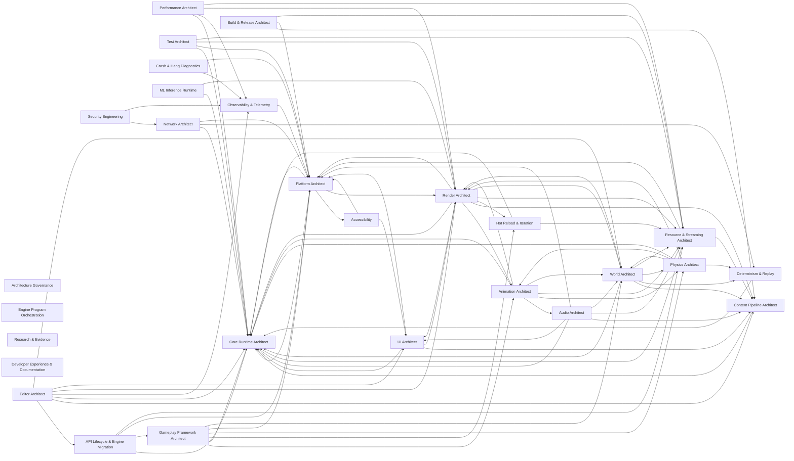

<!-- GENERATED by scripts/render.py from data/*.json — do not edit by hand -->

# 02 · Skill Dependency Graph

Skills never depend on each other's internals; they depend on **contracts**. A skill depends on another skill exactly when it consumes a contract that skill owns. Contracts carry a layer (0 platform → 5 tools, P = process) and a build-level `requires` list that `check.py` proves acyclic and never upward. Runtime data may flow in both directions between subsystems (animation ↔ physics), but only through frame phases declared in `C-FRAME`.

## Domain-level dependencies (required edges)

Nodes are top-level skills (a domain lead with its subtree, or a standalone cross-cutting skill). Edges are aggregated required contract dependencies between their subtrees; process contracts and universal runtime contracts (`C-ERR`, `C-MEM`, `C-INSTR`, `C-CRASH`, `C-BUDGET`) are omitted for legibility — every runtime skill consumes them.

## Contracts

Fan-in counts explicit consumers (universal contracts are consumed implicitly by every runtime skill or every skill). High fan-in contracts are the **critical architectural contracts**: they are designed first, versioned under `C-API`, and changed only through the change-request protocol in `C-ORCH`.

| Contract | Layer | Owner | Requires | Fan-in | Summary |
|---|---|---|---|---|---|
| `C-RG` Render graph | 3 | render-graph-scheduling | C-RHI, C-GPUMEM | 21 | Pass/resource declaration, queues, history resources, readback. |
| `C-RSCENE` Render scene & render features | 3 | render-architect | C-RG, C-SPATIAL, C-MATIF | 21 | Render proxies, world→render sync, feature registration, views. |
| `C-PAL` Platform abstraction layer | 0 | platform-architect | — | 18 | OS services, CPU/GPU capability discovery, windowing, lifecycle events. No platform #ifdefs above this line. |
| `C-PHYS` Physics world & scene queries | 3 | physics-architect | C-SPATIAL, C-ECS | 18 | Bodies, shapes, queries, contact events, stepping phases. |
| `C-TASK` Task graph & job API | 1 | job-system-task-graph | C-SYNC, C-MEM | 17 | Task creation, dependencies, priorities, blocking rules, completion integration. |
| `C-COOK` Cook-step processors | 5 | content-pipeline-architect | C-ASSET, C-SER, C-TASK | 15 | Processor inputs, cache keys, determinism, platform variants. |
| `C-SER` Serialization & schema evolution | 2 | serialization-schema | C-REFL | 12 | Formats, versioning, upgraders, canonical form, untrusted-input rules. |
| `C-ECS` ECS | 2 | ecs-runtime | C-ID, C-TASK, C-FRAME | 11 | Components, queries, systems, access declarations, command buffers. |
| `C-ANIM` Animation pose output | 3 | animation-architect | C-ECS, C-SPATIAL | 10 | Pose buffers, root motion, animation events, physics/render hand-off. |
| `C-ASSET` Asset identity & references | 2 | content-pipeline-architect | C-SER, C-ID | 10 | Asset IDs, soft/hard references, dependency declaration, registry queries. |
| `C-FRAME` Frame, tick phases & time | 2 | frame-orchestration | C-TASK | 10 | Phase list, sync points, time domains, fixed-step, pipelining depth. |
| `C-WORLD` World partition & streaming cells | 3 | world-architect | C-SPATIAL, C-RES | 10 | Cells, streaming sources, world data activation, simulation LOD signals. |
| `C-INPUT` Input actions | 3 | input-system | C-PAL, C-FRAME | 9 | Action values, contexts, device/user association, timestamps. |
| `C-REFL` Reflection & type metadata | 2 | reflection-metadata | C-TYPES | 9 | Type registry, properties, attributes, dynamic invocation. |
| `C-RES` Resource lifetime & streaming requests | 2 | resource-streaming-architect | C-ASSET, C-VFS, C-MEM | 9 | Handles, request priority/deadline, residency callbacks, budgets, fallbacks. |
| `C-SPATIAL` Transforms & spatial queries | 2 | spatial-transforms | C-MATH, C-ECS | 9 | Transform representation incl. large-world coordinates, hierarchy, generic spatial queries. |
| `C-NET` Replication & authority | 3 | network-architect | C-ECS, C-SER, C-FRAME | 8 | Replicated state declaration, authority, prediction hooks, net ticks. |
| `C-AUDIO` Audio emitters & events | 3 | audio-architect | C-ECS, C-SPATIAL | 7 | Emitter/listener data, event triggering, parameters, busses. |
| `C-DET` Determinism | 1 | determinism-replay | C-MATH | 7 | Determinism levels, FP rules, ordered execution rules, state-hash hooks. |
| `C-EDCMD` Editor commands & tool extension | 5 | editor-architect | C-REFL, C-SER | 7 | Transactions, undo/redo, selection, tool registration. |
| `C-RHI` Render hardware interface | 2 | rhi-core | C-PAL, C-MEM, C-SYNC | 7 | Devices, queues, command lists, sync, bindless, PSOs, presentation. |
| `C-RT` Ray-tracing scene | 3 | ray-tracing-infrastructure | C-RSCENE | 7 | Acceleration structures, instance data, hit-group/material binding, update policy. |
| `C-SVC` Platform & online services | 3 | platform-online-services | C-PAL, C-TASK | 7 | Async service calls, identity tokens, entitlements, sessions. |
| `C-MATH` Math & numeric conventions | 1 | math-simd-numerics | — | 6 | Vector/matrix types, precision classes, deterministic-math variants, convention enforcement. |
| `C-ML` ML inference | 2 | ml-inference-runtime | C-RHI, C-TASK | 6 | Model format, inference invocation on GPU/CPU, budgets, precision. |
| `C-GPUMEM` GPU resources & memory | 2 | gpu-memory-resources | C-RHI | 5 | Resource creation, heaps, residency, upload/readback, lifetime. |
| `C-GRAPH` Graph authoring & compilation | 5 | graph-editor-framework | C-EDCMD | 5 | Node/pin model, validation, compilation hooks for domain graphs. |
| `C-MATIF` Material interface | 3 | material-system | C-SHADER | 5 | Material parameters, shading model inputs, material domains. |
| `C-TEXT` Text layout & glyphs | 3 | text-fonts | C-TYPES | 5 | Shaped glyph runs, font fallback, glyph atlas/curve data. |
| `C-GAME` Gameplay framework extension | 4 | gameplay-architect | C-ECS, C-PHYS, C-ANIM, C-WORLD | 4 | Game module entry points, rules, players, extension hooks. |
| `C-ID` Identity & references | 2 | entity-object-model | C-TYPES | 4 | Entity IDs, GUIDs, reference kinds, lifetime rules, events. |
| `C-IO` Async IO | 2 | async-io-storage | C-PAL, C-TASK | 4 | IO requests, priorities, deadlines, completions, decompression targets. |
| `C-TYPES` Core types & containers | 1 | containers-core-types | C-MEM | 4 | Container, string, hash and ownership types used across the engine. |
| `C-BUILD` Build description | 5 | build-system-toolchains | — | 3 | Targets, configurations, toolchains, codegen steps. |
| `C-CFG` Configuration & cvars | 1 | core-runtime-architect | C-PAL | 3 | Layered config sources, typed cvars, change notification, per-device overrides. |
| `C-DRAW2D` 2D draw lists | 3 | render-2d-vector | C-RG, C-SHADER, C-TEXT | 3 | Batched 2D/vector/text draw submission used by UI, 2D games, debug overlays. |
| `C-SHADER` Shader interface & interop | 3 | shader-system | C-RHI | 3 | Shader modules, permutations, binding layouts, interop headers. |
| `C-SYNC` Concurrency primitives & thread-safety annotations | 1 | concurrency-primitives | C-PAL | 3 | Atomics, locks, lock-free queues, reclamation, annotation conventions. |
| `C-TEMPORAL` Temporal data | 3 | reconstruction-upscaling | C-RG | 3 | Motion vectors, jitter, history validity, reactive masks, resolution scaling. |
| `C-VFS` Package & VFS mounts | 2 | package-formats-vfs | C-IO, C-SER | 3 | Package format, mount layering, chunk IDs, integrity. |
| `C-A11Y` Accessibility requirements | P | accessibility | — | 2 | Mapped guideline requirements per player-facing feature. |
| `C-LOC` Localized strings | 3 | localization-i18n | C-ASSET | 2 | String IDs, formatting, locale switching. |
| `C-MOD` Module & lifecycle | 1 | core-runtime-architect | C-PAL, C-ERR | 2 | Module descriptors, init dependency graph, service registration, shutdown order. |
| `C-NAV` Navigation queries | 3 | navigation-pathfinding | C-SPATIAL, C-PHYS | 2 | Path requests, navmesh/grid queries, dynamic obstacles. |
| `C-PLUGIN` Plugin descriptor & loading | 1 | plugin-system | C-MOD | 2 | Plugin manifest, dependency resolution, load phases, ABI tags. |
| `C-RELOAD` Hot reload | 2 | hot-reload-iteration | C-RES, C-MOD | 2 | Change notifications, invalidation, state preservation hooks. |
| `C-UI` UI widgets & binding | 3 | ui-architect | C-REFL, C-INPUT, C-DRAW2D, C-TEXT, C-LOC | 2 | Widget model, data binding, focus, layout. |
| `C-PKG` Release packages & patches | 5 | packaging-release-patching | C-VFS, C-BUILD | 1 | Package manifests, patch/DLC chunks, version compatibility. |
| `C-SAVE` Save games | 4 | persistence-save | C-SER, C-ID | 1 | Save participation, versioned save records, async save/load. |
| `C-SCRIPT` Script bindings | 4 | scripting-runtime | C-REFL, C-GAME | 1 | Binding generation, sandbox limits, script lifecycle. |
| `C-ADR` ADR & fitness functions | P | architecture-governance | — | universal (all) | ADR template incl. revisit conditions; automated architectural checks. |
| `C-API` API stability & deprecation | P | api-lifecycle-migration | — | universal (all) | Public vs internal APIs, versioning, deprecation windows, upgraders. |
| `C-ARCH` Architecture, layering & profiles | P | engine-architect | — | universal (all) | Layer rules, contract registry, configuration profiles, conventions. |
| `C-BUDGET` Budgets & scalability profiles | 1 | performance-architect | C-CFG | universal (runtime) | Per-subsystem budgets per tier, device profiles, scalability hooks, perf gate thresholds. |
| `C-CRASH` Crash & diagnostic hooks | 1 | crash-diagnostics | C-PAL, C-INSTR | universal (runtime) | Crash context annotations, breadcrumbs, watchdog registration. |
| `C-ERR` Error & failure model | 1 | core-runtime-architect | C-PAL | universal (runtime) | Result types, assertion tiers, fatal vs recoverable, degradation rules. |
| `C-EVID` Evidence grading | P | research-evidence | — | universal (all) | Source tiers, maturity classes, claim standards. |
| `C-INSTR` Instrumentation | 1 | observability-telemetry | C-PAL | universal (runtime) | Log/trace/metric API; zero cost when compiled out; trace format. |
| `C-MEM` Allocation & memory accounting | 1 | memory-allocators | C-PAL | universal (runtime) | Allocator interface, tagging, budgets hooks, OOM behavior. |
| `C-ORCH` Agent coordination protocol | P | program-orchestration | — | universal (all) | Ownership ledger, change requests, integration order, critic gates. |
| `C-TEST` Test & validation definition of done | P | test-architect | — | universal (all) | Required test kinds per skill, determinism of tests, coverage policy. |
| `C-TRUST` Trust boundaries | P | security-engineering | — | universal (all) | Untrusted inputs list, validation obligations, sandbox rules. |

## Critical contracts (top fan-in, excluding universals)

- `C-RG` (21 consumers) — Render graph: atmosphere-weather, character-rendering, cloth-deformables?, deformation-skinning, direct-lighting-shadows, fluid-simulation, global-illumination, gpu-driven-pipeline, gpu-performance, ml-inference-runtime, post-color-hdr, ray-tracing-infrastructure, reconstruction-upscaling, render-2d-vector, render-architect, render-validation, texture-streaming-vt, translucency-decals, vfx-particles, virtualized-geometry-lod, water-ocean
- `C-RSCENE` (21 consumers) — Render scene & render features: atmosphere-weather, character-rendering, cinematics-sequencer, deformation-skinning, destruction-fracture, direct-lighting-shadows, fluid-simulation?, global-illumination, gpu-driven-pipeline, path-tracing, ray-tracing-infrastructure, render-validation, terrain, translucency-decals, vegetation-foliage, vfx-particles, virtualized-geometry-lod, visual-debugging-tools?, water-ocean, world-editor-viewport, xr-runtime
- `C-PAL` (18 consumers) — Platform abstraction layer: async-io-storage, audio-architect, concurrency-primitives, core-runtime-architect, crash-diagnostics, input-devices-haptics, input-system, job-system-task-graph, math-simd-numerics, memory-allocators, network-transport, observability-telemetry, platform-console, platform-desktop, platform-mobile-portable, platform-online-services, rhi-core, xr-runtime
- `C-PHYS` (18 consumers) — Physics world & scene queries: ai-behavior-perception, animation-architect?, character-vehicle-physics, cloth-deformables, collision-detection, destruction-fracture, fluid-simulation, gameplay-architect, ik-procedural-animation, navigation-pathfinding, physics-2d, prediction-rollback?, rigid-body-dynamics, spatial-audio-acoustics?, terrain, vegetation-foliage?, vfx-particles?, water-ocean
- `C-TASK` (17 consumers) — Task graph & job API: animation-architect, async-io-storage, audio-architect, content-pipeline-architect, cpu-performance, determinism-replay, ecs-runtime, frame-orchestration, ml-inference-runtime, navigation-pathfinding, network-transport, physics-architect, platform-online-services, render-graph-scheduling, resource-streaming-architect, rigid-body-dynamics, spatial-transforms
- `C-COOK` (15 consumers) — Cook-step processors: animation-runtime?, asset-cook-processors, asset-import-interchange, build-release-architect, ci-cd-automation, collision-detection?, destruction-fracture?, global-illumination?, localization-i18n?, motion-synthesis?, packaging-release-patching, procedural-generation?, shader-system, texture-streaming-vt, virtualized-geometry-lod
- `C-SER` (12 consumers) — Serialization & schema evolution: api-lifecycle-migration, collaboration-version-control, content-pipeline-architect, determinism-replay, editor-architect, graph-editor-framework, network-architect, package-formats-vfs, persistence-save, replication, robustness-fuzzing, world-data-model
- `C-ECS` (11 consumers) — ECS: animation-architect, audio-architect, crowd-simulation, gameplay-architect, network-architect, physics-architect, render-architect, replication, spatial-transforms, visual-debugging-tools, world-architect
- `C-FRAME` (10 consumers) — Frame, tick phases & time: animation-architect, atmosphere-weather, dedicated-server, ecs-runtime, input-system, network-architect, physics-architect, reconstruction-upscaling, render-architect, xr-runtime
- `C-ASSET` (10 consumers) — Asset identity & references: ai-assisted-authoring, asset-import-interchange, audio-content-runtime, collaboration-version-control, editor-architect, localization-i18n, material-system, resource-streaming-architect, text-fonts, world-data-model
- `C-WORLD` (10 consumers) — World partition & streaming cells: editor-architect, gameplay-architect, navigation-pathfinding, persistence-save, procedural-generation, terrain, vegetation-foliage, water-ocean, world-data-model, world-editor-viewport
- `C-ANIM` (10 consumers) — Animation pose output: animation-graphs, animation-runtime, character-rendering, cinematics-sequencer, cloth-deformables, deformation-skinning, facial-animation, gameplay-architect, ik-procedural-animation, motion-synthesis

## Runtime coupling cycles

Required-edge cycles between skills. Each must be mediated by a frame phase or event contract, never by a direct call:

- accessibility, input-system, ui-architect

## Per-skill dependencies

| Skill | Provides | Consumes (required) | Consumes (optional) | Depends on skills |
|---|---|---|---|---|
| engine-architect | C-ARCH | — | — | — |
| architecture-governance | C-ADR | — | — | — |
| program-orchestration | C-ORCH | — | — | — |
| research-evidence | C-EVID | — | — | — |
| performance-architect | C-BUDGET | C-INSTR, C-CFG | — | core-runtime-architect, observability-telemetry |
| perf-benchmarking | — | C-INSTR, C-BUDGET | — | observability-telemetry, performance-architect |
| cpu-performance | — | C-INSTR, C-BUDGET, C-TASK | — | job-system-task-graph, observability-telemetry, performance-architect |
| gpu-performance | — | C-INSTR, C-BUDGET, C-RG, C-RHI | — | observability-telemetry, performance-architect, render-graph-scheduling, rhi-core |
| loading-streaming-performance | — | C-INSTR, C-BUDGET, C-IO, C-RES | — | async-io-storage, observability-telemetry, performance-architect, resource-streaming-architect |
| test-architect | C-TEST | — | — | — |
| render-validation | — | C-RG, C-RHI, C-RSCENE | C-RT | ray-tracing-infrastructure, render-architect, render-graph-scheduling, rhi-core |
| functional-automation-soak | — | — | C-GAME, C-INPUT, C-NET | gameplay-architect, input-system, network-architect |
| robustness-fuzzing | — | C-SER, C-IO | — | async-io-storage, serialization-schema |
| certification-compliance | — | C-SVC | C-A11Y | accessibility, platform-online-services |
| security-engineering | C-TRUST | — | — | — |
| anti-cheat-integrity | — | C-NET, C-INSTR | — | network-architect, observability-telemetry |
| observability-telemetry | C-INSTR | C-PAL | — | platform-architect |
| crash-diagnostics | C-CRASH | C-PAL, C-INSTR | — | observability-telemetry, platform-architect |
| determinism-replay | C-DET | C-MATH, C-TASK, C-SER | — | job-system-task-graph, math-simd-numerics, serialization-schema |
| hot-reload-iteration | C-RELOAD | C-RES, C-MOD, C-REFL | — | core-runtime-architect, reflection-metadata, resource-streaming-architect |
| accessibility | C-A11Y | C-UI, C-INPUT, C-TEXT | C-AUDIO | audio-architect, input-system, text-fonts, ui-architect |
| api-lifecycle-migration | C-API | C-SER, C-REFL | — | reflection-metadata, serialization-schema |
| plugin-system | C-PLUGIN | C-MOD | — | core-runtime-architect |
| modding-ugc | — | C-VFS, C-SCRIPT, C-PLUGIN, C-SVC | — | package-formats-vfs, platform-online-services, plugin-system, scripting-runtime |
| developer-experience-docs | — | — | — | — |
| ml-inference-runtime | C-ML | C-RHI, C-RG, C-TASK | — | job-system-task-graph, render-graph-scheduling, rhi-core |
| core-runtime-architect | C-MOD, C-CFG, C-ERR | C-PAL | — | platform-architect |
| math-simd-numerics | C-MATH | C-PAL | — | platform-architect |
| memory-allocators | C-MEM | C-PAL | — | platform-architect |
| containers-core-types | C-TYPES | C-MEM | — | memory-allocators |
| concurrency-primitives | C-SYNC | C-PAL | — | platform-architect |
| job-system-task-graph | C-TASK | C-SYNC, C-PAL | — | concurrency-primitives, platform-architect |
| frame-orchestration | C-FRAME | C-TASK, C-CFG | — | core-runtime-architect, job-system-task-graph |
| entity-object-model | C-ID | C-TYPES, C-SYNC | — | concurrency-primitives, containers-core-types |
| ecs-runtime | C-ECS | C-ID, C-TASK, C-FRAME | C-REFL | entity-object-model, frame-orchestration, job-system-task-graph, reflection-metadata |
| reflection-metadata | C-REFL | C-TYPES | — | containers-core-types |
| serialization-schema | C-SER | C-REFL, C-TYPES | — | containers-core-types, reflection-metadata |
| platform-architect | C-PAL | — | — | — |
| platform-desktop | — | C-PAL | — | platform-architect |
| platform-console | — | C-PAL, C-SVC | — | platform-architect, platform-online-services |
| platform-mobile-portable | — | C-PAL | — | platform-architect |
| platform-online-services | C-SVC | C-PAL, C-TASK | — | job-system-task-graph, platform-architect |
| input-system | C-INPUT | C-PAL, C-FRAME, C-A11Y | — | accessibility, frame-orchestration, platform-architect |
| input-devices-haptics | — | C-PAL, C-INPUT | — | input-system, platform-architect |
| xr-runtime | — | C-PAL, C-RSCENE, C-INPUT, C-FRAME | — | frame-orchestration, input-system, platform-architect, render-architect |
| content-pipeline-architect | C-ASSET, C-COOK | C-SER, C-TASK, C-REFL | — | job-system-task-graph, reflection-metadata, serialization-schema |
| asset-import-interchange | — | C-ASSET, C-COOK | — | content-pipeline-architect |
| asset-cook-processors | — | C-COOK, C-MATH | — | content-pipeline-architect, math-simd-numerics |
| resource-streaming-architect | C-RES | C-ASSET, C-VFS, C-IO, C-TASK | — | async-io-storage, content-pipeline-architect, job-system-task-graph, package-formats-vfs |
| async-io-storage | C-IO | C-PAL, C-TASK | C-GPUMEM | gpu-memory-resources, job-system-task-graph, platform-architect |
| package-formats-vfs | C-VFS | C-IO, C-SER | — | async-io-storage, serialization-schema |
| world-architect | C-WORLD | C-SPATIAL, C-RES, C-ECS | — | ecs-runtime, resource-streaming-architect, spatial-transforms |
| world-data-model | — | C-WORLD, C-SER, C-ASSET, C-ID | — | content-pipeline-architect, entity-object-model, serialization-schema, world-architect |
| spatial-transforms | C-SPATIAL | C-MATH, C-ECS, C-TASK | — | ecs-runtime, job-system-task-graph, math-simd-numerics |
| terrain | — | C-WORLD, C-RSCENE, C-PHYS, C-RES, C-MATIF | C-EDCMD | editor-architect, material-system, physics-architect, render-architect, resource-streaming-architect, world-architect |
| vegetation-foliage | — | C-WORLD, C-RSCENE, C-RES | C-PHYS | physics-architect, render-architect, resource-streaming-architect, world-architect |
| water-ocean | — | C-WORLD, C-RSCENE, C-PHYS, C-RG | — | physics-architect, render-architect, render-graph-scheduling, world-architect |
| atmosphere-weather | — | C-RSCENE, C-RG, C-FRAME | — | frame-orchestration, render-architect, render-graph-scheduling |
| procedural-generation | — | C-WORLD, C-DET | C-COOK, C-GRAPH | content-pipeline-architect, determinism-replay, graph-editor-framework, world-architect |
| render-architect | C-RSCENE | C-RG, C-SPATIAL, C-MATIF, C-FRAME, C-ECS | — | ecs-runtime, frame-orchestration, material-system, render-graph-scheduling, spatial-transforms |
| rhi-core | C-RHI | C-PAL, C-SYNC | — | concurrency-primitives, platform-architect |
| gpu-memory-resources | C-GPUMEM | C-RHI | — | rhi-core |
| render-graph-scheduling | C-RG | C-RHI, C-GPUMEM, C-TASK | — | gpu-memory-resources, job-system-task-graph, rhi-core |
| shader-system | C-SHADER | C-RHI, C-COOK, C-RELOAD | — | content-pipeline-architect, hot-reload-iteration, rhi-core |
| material-system | C-MATIF | C-SHADER, C-ASSET | C-GRAPH | content-pipeline-architect, graph-editor-framework, shader-system |
| gpu-driven-pipeline | — | C-RSCENE, C-RG, C-SHADER, C-GPUMEM | — | gpu-memory-resources, render-architect, render-graph-scheduling, shader-system |
| virtualized-geometry-lod | — | C-RSCENE, C-RG, C-RES, C-COOK | C-RT | content-pipeline-architect, ray-tracing-infrastructure, render-architect, render-graph-scheduling, resource-streaming-architect |
| texture-streaming-vt | — | C-RES, C-GPUMEM, C-RG, C-COOK | C-ML | content-pipeline-architect, gpu-memory-resources, ml-inference-runtime, render-graph-scheduling, resource-streaming-architect |
| direct-lighting-shadows | — | C-RSCENE, C-RG, C-TEMPORAL | C-RT | ray-tracing-infrastructure, reconstruction-upscaling, render-architect, render-graph-scheduling |
| global-illumination | — | C-RSCENE, C-RG, C-TEMPORAL | C-RT, C-COOK | content-pipeline-architect, ray-tracing-infrastructure, reconstruction-upscaling, render-architect, render-graph-scheduling |
| ray-tracing-infrastructure | C-RT | C-RSCENE, C-RG, C-GPUMEM | — | gpu-memory-resources, render-architect, render-graph-scheduling |
| path-tracing | — | C-RT, C-MATIF, C-RSCENE | — | material-system, ray-tracing-infrastructure, render-architect |
| reconstruction-upscaling | C-TEMPORAL | C-RG, C-FRAME | C-ML | frame-orchestration, ml-inference-runtime, render-graph-scheduling |
| post-color-hdr | — | C-RG, C-RHI, C-CFG | — | core-runtime-architect, render-graph-scheduling, rhi-core |
| translucency-decals | — | C-RSCENE, C-RG, C-MATIF | — | material-system, render-architect, render-graph-scheduling |
| character-rendering | — | C-RSCENE, C-MATIF, C-ANIM, C-RG | — | animation-architect, material-system, render-architect, render-graph-scheduling |
| render-2d-vector | C-DRAW2D | C-RG, C-SHADER, C-TEXT | — | render-graph-scheduling, shader-system, text-fonts |
| vfx-particles | — | C-RSCENE, C-RG | C-GRAPH, C-PHYS | graph-editor-framework, physics-architect, render-architect, render-graph-scheduling |
| physics-architect | C-PHYS | C-SPATIAL, C-ECS, C-FRAME, C-DET, C-TASK | — | determinism-replay, ecs-runtime, frame-orchestration, job-system-task-graph, spatial-transforms |
| collision-detection | — | C-PHYS, C-MATH | C-COOK | content-pipeline-architect, math-simd-numerics, physics-architect |
| rigid-body-dynamics | — | C-PHYS, C-TASK, C-DET | — | determinism-replay, job-system-task-graph, physics-architect |
| character-vehicle-physics | — | C-PHYS | C-INPUT | input-system, physics-architect |
| cloth-deformables | — | C-PHYS, C-ANIM | C-RG | animation-architect, physics-architect, render-graph-scheduling |
| destruction-fracture | — | C-PHYS, C-RSCENE | C-NET, C-COOK | content-pipeline-architect, network-architect, physics-architect, render-architect |
| fluid-simulation | — | C-PHYS, C-RG | C-RSCENE | physics-architect, render-architect, render-graph-scheduling |
| physics-2d | — | C-PHYS, C-DET | — | determinism-replay, physics-architect |
| animation-architect | C-ANIM | C-ECS, C-SPATIAL, C-FRAME, C-TASK | C-PHYS | ecs-runtime, frame-orchestration, job-system-task-graph, physics-architect, spatial-transforms |
| animation-runtime | — | C-ANIM, C-MATH | C-COOK | animation-architect, content-pipeline-architect, math-simd-numerics |
| deformation-skinning | — | C-ANIM, C-RSCENE, C-RG, C-TEMPORAL | C-RT, C-ML | animation-architect, ml-inference-runtime, ray-tracing-infrastructure, reconstruction-upscaling, render-architect, render-graph-scheduling |
| animation-graphs | — | C-ANIM | C-GRAPH | animation-architect, graph-editor-framework |
| motion-synthesis | — | C-ANIM | C-COOK, C-ML | animation-architect, content-pipeline-architect, ml-inference-runtime |
| ik-procedural-animation | — | C-ANIM, C-PHYS | — | animation-architect, physics-architect |
| facial-animation | — | C-ANIM, C-AUDIO | C-ML | animation-architect, audio-architect, ml-inference-runtime |
| cinematics-sequencer | — | C-ANIM, C-AUDIO, C-RSCENE, C-RES | C-EDCMD | animation-architect, audio-architect, editor-architect, render-architect, resource-streaming-architect |
| audio-architect | C-AUDIO | C-PAL, C-TASK, C-ECS, C-SPATIAL | — | ecs-runtime, job-system-task-graph, platform-architect, spatial-transforms |
| audio-dsp-mixing | — | C-AUDIO, C-RES, C-MATH | — | audio-architect, math-simd-numerics, resource-streaming-architect |
| spatial-audio-acoustics | — | C-AUDIO | C-PHYS, C-RT | audio-architect, physics-architect, ray-tracing-infrastructure |
| audio-content-runtime | — | C-AUDIO, C-ASSET, C-LOC | C-GRAPH | audio-architect, content-pipeline-architect, graph-editor-framework, localization-i18n |
| network-architect | C-NET | C-ECS, C-SER, C-FRAME, C-DET | — | determinism-replay, ecs-runtime, frame-orchestration, serialization-schema |
| network-transport | — | C-PAL, C-TASK | C-SVC | job-system-task-graph, platform-architect, platform-online-services |
| replication | — | C-NET, C-ECS, C-SER, C-ID | — | ecs-runtime, entity-object-model, network-architect, serialization-schema |
| prediction-rollback | — | C-NET, C-DET | C-PHYS, C-INPUT | determinism-replay, input-system, network-architect, physics-architect |
| dedicated-server | — | C-NET, C-FRAME, C-SVC | — | frame-orchestration, network-architect, platform-online-services |
| gameplay-architect | C-GAME | C-ECS, C-PHYS, C-ANIM, C-WORLD, C-SAVE | C-INPUT, C-AUDIO, C-NET | animation-architect, audio-architect, ecs-runtime, input-system, network-architect, persistence-save, physics-architect, world-architect |
| gameplay-systems-toolkit | — | C-GAME | C-NET, C-INPUT | gameplay-architect, input-system, network-architect |
| scripting-runtime | C-SCRIPT | C-REFL, C-GAME, C-RELOAD | — | gameplay-architect, hot-reload-iteration, reflection-metadata |
| navigation-pathfinding | C-NAV | C-SPATIAL, C-PHYS, C-WORLD, C-TASK | — | job-system-task-graph, physics-architect, spatial-transforms, world-architect |
| crowd-simulation | — | C-NAV, C-ECS, C-SPATIAL | — | ecs-runtime, navigation-pathfinding, spatial-transforms |
| ai-behavior-perception | — | C-GAME, C-SPATIAL, C-PHYS | C-NAV | gameplay-architect, navigation-pathfinding, physics-architect, spatial-transforms |
| persistence-save | C-SAVE | C-SER, C-ID, C-SVC, C-WORLD | — | entity-object-model, platform-online-services, serialization-schema, world-architect |
| ui-architect | C-UI | C-REFL, C-INPUT, C-DRAW2D, C-TEXT, C-LOC | — | input-system, localization-i18n, reflection-metadata, render-2d-vector, text-fonts |
| text-fonts | C-TEXT | C-TYPES, C-ASSET | — | containers-core-types, content-pipeline-architect |
| localization-i18n | C-LOC | C-ASSET | C-TEXT, C-COOK | content-pipeline-architect, text-fonts |
| editor-architect | C-EDCMD | C-REFL, C-SER, C-ASSET, C-WORLD, C-PLUGIN | C-UI | content-pipeline-architect, plugin-system, reflection-metadata, serialization-schema, ui-architect, world-architect |
| editor-ui-framework | — | C-EDCMD, C-REFL, C-DRAW2D, C-TEXT | — | editor-architect, reflection-metadata, render-2d-vector, text-fonts |
| world-editor-viewport | — | C-EDCMD, C-WORLD, C-RSCENE, C-SPATIAL | — | editor-architect, render-architect, spatial-transforms, world-architect |
| graph-editor-framework | C-GRAPH | C-EDCMD, C-SER | — | editor-architect, serialization-schema |
| collaboration-version-control | — | C-EDCMD, C-SER, C-ASSET | — | content-pipeline-architect, editor-architect, serialization-schema |
| visual-debugging-tools | — | C-INSTR, C-ECS | C-DRAW2D, C-RSCENE, C-DET | determinism-replay, ecs-runtime, observability-telemetry, render-2d-vector, render-architect |
| ai-assisted-authoring | — | C-EDCMD, C-ASSET | C-ML | content-pipeline-architect, editor-architect, ml-inference-runtime |
| build-release-architect | — | C-BUILD, C-PKG, C-COOK | — | build-system-toolchains, content-pipeline-architect, packaging-release-patching |
| build-system-toolchains | C-BUILD | — | — | — |
| ci-cd-automation | — | C-BUILD, C-COOK | — | build-system-toolchains, content-pipeline-architect |
| packaging-release-patching | C-PKG | C-VFS, C-BUILD, C-SVC, C-COOK | — | build-system-toolchains, content-pipeline-architect, package-formats-vfs, platform-online-services |
