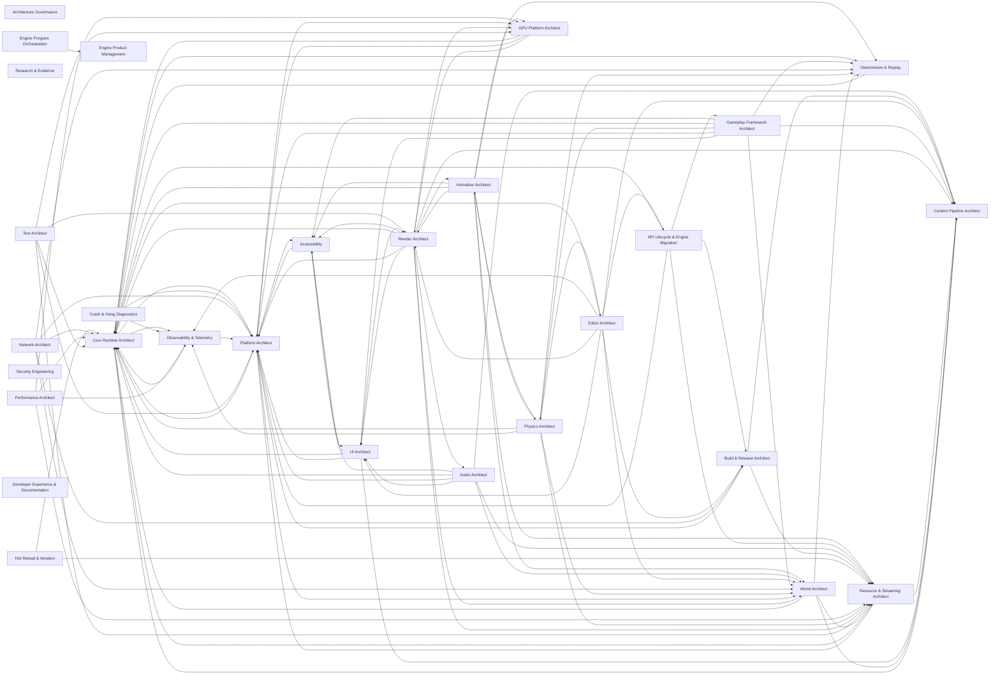

<!-- GENERATED by scripts/render.py from data/*.json — do not edit by hand -->

# 02 · Skill Dependency Graph

Skills never depend on each other's internals; they depend on **contracts**. A skill depends on another skill exactly when it consumes a contract that skill owns. Contracts carry a layer (0 platform → 5 tools, P = process) and a build-level `requires` list that `check.py` proves acyclic and never upward. Runtime data may flow in both directions between subsystems (animation ↔ physics), but only through frame phases declared in `C-FRAME`.

## Domain-level dependencies (required edges)

Nodes are top-level skills (a domain lead with its subtree, or a standalone cross-cutting skill). Edges are aggregated required contract dependencies between their subtrees; process contracts and universal runtime contracts (`C-ERR`, `C-MEM`, `C-INSTR`, `C-CRASH`, `C-BUDGET`) are omitted for legibility — every runtime skill consumes them.

## Layered contract graph

- **L0** (2): `C-PAL`, `C-BASE`
- **L1** (14): `C-ERR`, `C-MOD`, `C-CFG`, `C-MATH`, `C-MEM`, `C-TYPES`, `C-SYNC`, `C-TASK`, `C-INSTR`, `C-CRASH`, `C-DET`, `C-PLUGIN`, `C-LIFETIME`, `C-SCALE`
- **L2** (23): `C-FRAME`, `C-ID`, `C-ECS`, `C-REFL`, `C-SER`, `C-IO`, `C-VFS`, `C-ASSET`, `C-RES`, `C-RELOAD`, `C-SPATIAL`, `C-RHI`, `C-GPUMEM`, `C-ML`, `C-IPC`, `C-FLOW`, `C-PRESENT`, `C-SNAPSHOT`, `C-VIEW`, `C-SIGNIF`, `C-GPUTIER`, `C-DEVICE`, `C-NETLINK`
- **L3** (38): `C-WORLD`, `C-RG`, `C-SHADER`, `C-MATIF`, `C-RSCENE`, `C-TEMPORAL`, `C-RT`, `C-TEXT`, `C-DRAW2D`, `C-PHYS`, `C-ANIM`, `C-AUDIO`, `C-INPUT`, `C-NET`, `C-SVC`, `C-LOC`, `C-UI`, `C-NAV`, `C-SCRIPT`, `C-SAVE`, `C-REPLAY`, `C-ENV`, `C-INSTANCES`, `C-GEOLOD`, `C-VT`, `C-LIGHT`, `C-GI`, `C-ATMOS`, `C-VIDEO`, `C-REP`, `C-PREDICT`, `C-GAMEDATA`, `C-DIALOGUE`, `C-A11YRT`, `C-DEVUI`, `C-LIVE`, `C-XRVIEW`, `C-MLGPU`
- **L4** (3): `C-GAME`, `C-MOVE`, `C-AIAGENT`
- **L5** (6): `C-COOK`, `C-EDCMD`, `C-GRAPH`, `C-BUILD`, `C-PKG`, `C-EDHOST`
- **LP** (14): `C-BUDGET`, `C-ARCH`, `C-ADR`, `C-EVID`, `C-ORCH`, `C-TEST`, `C-API`, `C-TRUST`, `C-A11Y`, `C-CERT`, `C-PERF`, `C-BENCH`, `C-PROD`, `C-RELEASE`

## Contracts

Fan-in counts explicit consumers (universal contracts are consumed implicitly by every runtime skill or every skill). High fan-in contracts are the **critical architectural contracts**: they are designed first, versioned under `C-API`, and changed only through the change-request protocol in `C-ORCH`.

| Contract | Layer | Owner | Requires | Fan-in | Summary |
|---|---|---|---|---|---|
| `C-PAL` Platform abstraction layer | 0 | platform-architect | C-BASE | 30 | OS services, CPU/GPU capability discovery and device database, windowing, display & safe area, lifecycle and system events (memory pressure, thermal/power, network reachability, audio endpoint, locale, OS accessibility settings, overlay/focus, storage, page size), clocks and clock-domain correlation, processes/pipes/shared memory/dev sockets, HTTP(S)/TLS client, permissions, thread creation/affinity/QoS and main-thread dispatch. Platform code lives only in the PAL or in a registered platform backend slot. |
| `C-RG` Render graph | 3 | render-graph-scheduling | C-RHI, C-GPUMEM | 23 | Pass/resource declaration, queues, history resources, readback, dynamic GPU-generated work nodes; barrier output mapped or elided on implicit-sync backends. |
| `C-PHYS` Physics world & scene queries | 3 | physics-architect | C-SPATIAL, C-FRAME, C-ID | 22 | Bodies, shapes, queries (handle-addressed, batched), contact events with budgets, stepping phases, batch add/remove O(batch), snapshot/restore/resimulate participation, collider history for rewind. |
| `C-TASK` Task graph & job API | 1 | job-system-task-graph | C-SYNC, C-MEM | 22 | Task creation, dependencies, priorities/QoS, blocking rules, completion-token integration, process-wide thread inventory with pinned/affinity lanes and middleware adapters, serial deterministic test mode and schedule-perturbation hooks, task tracing. |
| `C-RSCENE` Render scene & render features | 3 | render-architect | C-RG, C-SPATIAL, C-MATIF | 21 | Render features and views, render-scene data streams extracted as change-tracked deltas (no per-object proxy mirror; CPU cost O(changes)), feature registration with minimum GPU tier, non-mesh primitive kinds. |
| `C-FRAME` Frame, tick phases & time | 2 | frame-orchestration | C-TASK | 16 | Time domains and multi-rate cadences, pipelining depth, the minimal set of named global sync points, frame-wide access declarations (ECS components and registered service resources) from which ordering is derived, the canonical simulation schedule, injectable test clock. |
| `C-ENV` Environment queries | 3 | world-architect | C-SPATIAL | 15 | Environment query service: ground height/surface type, water surface/volume (height, velocity, depth, body id), wind field, weather parameters, deformation deltas; implemented by terrain, water, atmosphere and voxel providers; headless-capable. |
| `C-SER` Serialization & schema evolution | 2 | serialization-schema | C-REFL | 15 | Formats, versioning, upgraders, canonical form, untrusted-input rules. |
| `C-A11Y` Accessibility requirements | P | accessibility | — | 14 | Mapped guideline requirements per player-facing feature. |
| `C-ANIM` Animation pose output | 3 | animation-architect | C-SPATIAL, C-ID | 14 | Pose output and control input (parameters, action/montage requests, instance lifetime), root motion, animation events, pose history for rewind, network-sync hooks, physics/render hand-off. |
| `C-WORLD` World partition & streaming cells | 3 | world-architect | C-SPATIAL, C-RES | 14 | Cells, streaming sources, world data activation in budgeted, time-sliced batches with bulk registration. |
| `C-ECS` ECS | 2 | ecs-runtime | C-ID, C-TASK, C-FRAME | 12 | Components, queries, systems, access declarations, command buffers. |
| `C-RES` Resource lifetime & streaming requests | 2 | resource-streaming-architect | C-ASSET, C-VFS, C-MEM | 12 | Resource handles and explicit lifetime; load requests with priority/deadline; the staged load pipeline (IO → decompress → fixup → GPU upload → publish) that every resource type implements; pool registration, pressure signals and shrink-by-deadline requests; residency notifications drained at a declared C-FRAME phase; fallbacks. |
| `C-ASSET` Asset identity & references | 2 | content-pipeline-architect | C-SER, C-ID | 11 | Asset IDs, soft/hard references, dependency declaration, registry queries. |
| `C-DET` Determinism | 1 | determinism-replay | C-MATH | 11 | Determinism levels, floating-point rules, ordered-execution rules, state-hash hooks. |
| `C-GPUTIER` GPU feature tiers | 2 | gpu-platform-architect | C-RHI | 11 | Named GPU feature tiers (binding model, pipeline-state model, queue topology, mesh/RT/tensor support, memory model) and the API baseline each tier maps to; render features declare the minimum tier they need. |
| `C-ML` ML inference | 2 | ml-inference-runtime | C-TASK, C-MEM | 11 | Model format and packaging, CPU and NPU backends, async invocation, precision classes, budgets. |
| `C-SPATIAL` Transforms & spatial queries | 2 | spatial-transforms | C-MATH, C-ID | 11 | Transform representation incl. large-world coordinates, hierarchy, generic spatial queries, per-phase change sets (moved/attached/teleported) consumed by all spatial replicas. |
| `C-TEMPORAL` Temporal data | 3 | reconstruction-upscaling | C-RG | 11 | Motion vectors, jitter, history validity, reactive/transparency masks, resolution scaling; motion-vector obligations for every moving/animated surface; UI/HUD separation for frame generation; depth+motion submission for XR spacewarp. |
| `C-AUDIO` Audio emitters & events | 3 | audio-architect | C-SPATIAL, C-ID | 10 | Emitter/listener data (multiple listeners), event triggering, parameters, busses, the sample-accurate audio clock exposed to gameplay. |
| `C-REFL` Reflection & type metadata | 2 | reflection-metadata | C-TYPES | 10 | Type registry, properties, attributes, dynamic invocation. |
| `C-INSTANCES` Instance scene | 3 | geometry-pipeline | C-RG, C-GPUMEM | 9 | Persistent instance/primitive handles, batched add/remove/update with delta upload (cost O(changes)), instance data layout shared with the ray-tracing instance builder; served by both CPU and GPU submission paths. |
| `C-REP` Replication | 3 | replication | C-NETLINK, C-SER, C-ID | 9 | Replicated state declaration, relevancy hooks, RPCs, net IDs, batch registration, replay and spectator streams. |
| `C-SYNC` Concurrency primitives & thread-safety annotations | 1 | concurrency-primitives | C-BASE | 9 | Atomics, locks, lock-free queues, safe reclamation, thread-safety annotation conventions, OS-waitable completion tokens that IO/GPU fences plug into. |
| `C-BASE` Bootstrap base | 0 | platform-architect | — | 8 | Raw page allocator, raw log/assert/abort sink, monotonic clock, raw thread primitives and late-bound hook tables that higher layers install (allocator, log sink, assert handler, crash annotator). Depends on nothing. |
| `C-ID` Identity & references | 2 | entity-object-model | C-TYPES | 8 | Entity IDs, GUIDs, reference kinds, lifetime rules, events. |
| `C-NET` Netcode model & authority policy | 3 | network-architect | C-FRAME, C-ID | 8 | Netcode model per game type, authority model, net tick and time policy, compatibility window and handshake policy. |
| `C-RHI` Render hardware interface | 2 | rhi-core | C-PAL, C-MEM, C-SYNC | 8 | Devices, queues and command recording, completion tokens, binding-model tier (bindless / descriptor-buffer / bind-group), pipeline-state-model tier (monolithic PSO / libraries / shader objects / state-object programs), GPU-generated work primitives, presentation, implicit-sync backends; the RHI consumes C-PRESENT to report present feedback. |
| `C-SVC` Platform services | 3 | platform-services | C-PAL, C-TASK | 8 | Identity tokens, entitlements & commerce, privileges, social graph, achievements, leaderboards, cloud save, region/age policy. |
| `C-VIEW` Views & view arbitration | 2 | spatial-transforms | C-SPATIAL | 8 | View registry: view sources (gameplay camera, cinematic, editor, photo mode, XR pose) with priority/blend stack and shake/FOV channels, per-local-player views, view origin for LWC rebasing; derived listener and streaming-source signals for sinks. |
| `C-CFG` Configuration & cvars | 1 | core-runtime-architect | C-BASE | 7 | Layered config sources (defaults, platform, device profile, remote/live, user) with precedence, typed cvars read through versioned immutable snapshots latched at sync points, queued change notification. |
| `C-GPUMEM` GPU resources & memory | 2 | gpu-memory-resources | C-RHI | 7 | Resource creation, heaps, residency, upload/readback, lifetime. |
| `C-INPUT` Input actions | 3 | input-system | C-FRAME | 7 | Action definitions and values, tick-stamped input-command frames and their serialization (all targets incl. server); device binding contexts are client-side. |
| `C-LIGHT` Direct lighting sampling | 3 | direct-lighting-shadows | C-RSCENE | 7 | Light lists (clustered or stochastic), shadow lookups, light units, many-light sampling API for any shading point incl. translucency, volumes and particles. |
| `C-RT` Ray queries | 3 | ray-tracing-infrastructure | C-RSCENE | 7 | Ray-query contract with hardware and software (SDF/BVH compute) backends: acceleration structures, instance data, hit/material binding, update policy. |
| `C-EDCMD` Editor commands & tool extension | 5 | editor-architect | C-REFL, C-SER | 6 | Transactions, undo/redo, selection, tool registration. |
| `C-GAME` Gameplay framework extension | 4 | gameplay-architect | C-ID, C-FRAME | 6 | Game module entry points, rules/session state, data-oriented control binding (input source or AI → controlled entity), scheduled gameplay systems, extension hooks. |
| `C-MATH` Math & numeric conventions | 1 | math-simd-numerics | — | 6 | Vector/matrix types, precision classes, deterministic-math variants, fixed and scalable (vector-length-agnostic) SIMD kernels, convention enforcement. |
| `C-DEVICE` Input devices & haptics | 2 | input-devices-haptics | C-PAL | 5 | Device enumeration, raw state and events with timestamps, device↔platform-user pairing, haptic, trigger-effect and LED output, virtual device injection for automation. |
| `C-DIALOGUE` Dialogue lines & narrative state | 3 | narrative-dialogue | C-LOC, C-ID | 5 | Line records (speaker, text per locale, VO per locale, timing, lip-sync data), conditions, playback requests, narrative fact store. |
| `C-GI` Indirect lighting sampling | 3 | global-illumination | C-RSCENE | 5 | Indirect diffuse/specular sampling for any shading point (incl. translucent and volumetric), probes, sky/environment lighting. |
| `C-IO` Async IO | 2 | async-io-storage | C-PAL, C-TASK | 5 | IO requests, priorities, deadlines, completions, decompression targets. |
| `C-MATIF` Material interface | 3 | material-system | C-SHADER | 5 | Material parameters, shading model inputs, material domains. |
| `C-SIGNIF` Significance & simulation tiers | 2 | world-architect | C-VIEW | 5 | Per-entity significance, simulation tier and update budget, computed once from views/players (all players on a server) and consumed by each domain's LOD policy. |
| `C-TEXT` Text layout & glyphs | 3 | text-fonts | C-TYPES | 5 | Shaped glyph runs, font fallback, glyph atlas/curve data. |
| `C-TYPES` Core types & containers | 1 | containers-core-types | C-MEM | 5 | Containers, strings, versioned stable hashing, general-purpose compression codecs, vetted cryptographic primitives wrapper, ownership/view types. |
| `C-COOK` Cook-step processors | 5 | content-pipeline-architect | C-ASSET, C-SER, C-TASK | 4 | Processor inputs, cache keys, determinism class (bit-exact / tolerance / pinned-artifact), platform variants, world-scope steps, per-asset on-demand invocation, validation hooks. |
| `C-LIFETIME` Ownership & retirement | 1 | core-runtime-architect | C-SYNC | 4 | Engine-wide ownership and cross-thread reference rules; deferred-destruction/retirement service keyed to completion tokens (task completion, frames in flight, GPU fences). |
| `C-LIVE` Online & live-ops services | 3 | online-services-liveops | C-PAL, C-TASK | 4 | Sessions/matchmaking tickets, remote config, events/experiments, chat sessions, moderation, generative/inference service calls with quotas, trusted time, service emulation. |
| `C-LOC` Localized strings | 3 | localization-i18n | C-ASSET | 4 | String IDs, formatting, locale switching. |
| `C-MLGPU` GPU inference | 3 | ml-inference-runtime | C-RG, C-ML | 4 | Inference as a render-graph pass under async-compute and budget scheduling; weights for in-shader networks. |
| `C-PREDICT` Prediction & rollback | 3 | prediction-rollback | C-REP, C-DET, C-SNAPSHOT, C-INPUT | 4 | Predicted/rollback-able state registration, tick-stamped input history, resimulation hooks, rewind queries, cosmetic-effect suppression during resim. |
| `C-RELEASE` Release model | P | build-release-architect | — | 4 | Branch model, release trains, version identifiers, client/server/content compatibility keys, LTS and hotfix streams. |
| `C-RELOAD` Hot reload | 2 | hot-reload-iteration | C-RES, C-MOD | 4 | Change notifications, invalidation, state preservation hooks. |
| `C-SNAPSHOT` Frame-state snapshot & resimulation | 2 | determinism-replay | C-FRAME, C-SER | 4 | Snapshot/restore, resimulate N ticks, history ring, per-participant cost declaration. |
| `C-VFS` Package & VFS mounts | 2 | package-formats-vfs | C-IO, C-SER | 4 | Package format, mount layering (base, patch, DLC, mods, remote), chunk IDs, integrity; codec per target constrained by available hardware decompressors. |
| `C-ATMOS` Atmosphere & participating media | 3 | atmosphere-weather | C-RSCENE | 3 | Aerial perspective, froxel/local media volumes, cloud shadows, weather-driven global material parameters. |
| `C-BUILD` Build description | 5 | build-system-toolchains | — | 3 | Targets, configurations, toolchains, codegen steps. |
| `C-DRAW2D` 2D draw lists | 3 | render-2d-vector | C-RG, C-SHADER, C-TEXT | 3 | Batched 2D/vector/text draw submission used by UI, 2D games, debug overlays. |
| `C-NAV` Navigation queries | 3 | navigation-pathfinding | C-SPATIAL | 3 | Path requests, navmesh/grid queries, dynamic obstacles. |
| `C-NETLINK` Network links & sessions | 2 | network-transport | C-PAL, C-TASK | 3 | Sessions, channels, reliability/ordering classes, send budgets, link statistics, connection events; used by replication, voice, rollback input exchange and telemetry streams. |
| `C-PRESENT` Present timeline | 2 | frame-orchestration | C-FRAME | 3 | Present timeline and display-time prediction, latency markers, interposed presenters (frame generation, XR compositor, cloud encoder), GPU-frame-complete and present-feedback sink implemented by the RHI (dependency inversion). |
| `C-REPLAY` Replay container & streams | 3 | determinism-replay | C-SNAPSHOT, C-SER | 3 | Replay container, timeline, stream registration (input, replication, visual log, animation debug, external/nondeterministic inputs) and cross-build versioning. |
| `C-SAVE` Save games | 3 | persistence-save | C-SER, C-ID | 3 | Save participation, versioned save records, async save/load. |
| `C-SHADER` Shader interface & interop | 3 | shader-system | C-RHI | 3 | Shader modules, permutations and budgets, binding layouts generated per binding tier, interop headers, neural/tensor intrinsics tier. |
| `C-UI` UI widgets & binding | 3 | ui-architect | C-REFL, C-INPUT, C-DRAW2D, C-TEXT, C-LOC | 3 | Widget model, data binding, focus, layout. |
| `C-EDHOST` Editor host | 5 | editor-ui-framework | C-EDCMD | 2 | Asset-editor host, preview-scene registration, thumbnail providers, inspector customization, tool-mode registration, shared curve/timeline widgets. |
| `C-GEOLOD` Geometry LOD & page residency | 3 | virtualized-geometry-lod | C-RG | 2 | Cluster/LOD selection and page residency for raster, shadow and ray-tracing consumers. |
| `C-IPC` Engine IPC | 2 | core-runtime-architect | C-PAL, C-TASK | 2 | Process model and IPC/RPC transport for editor↔runtime, tool workers, crash handler, profiler and script debugger; dev-only port security. |
| `C-MOD` Module & lifecycle | 1 | core-runtime-architect | C-ERR, C-TASK | 2 | Module descriptors, serial bootstrap then parallel init dependency graph, service registration, shutdown order, declarative self-registration (no central tables). |
| `C-PLUGIN` Plugin descriptor & loading | 1 | plugin-system | C-MOD | 2 | Plugin manifest, dependency resolution, load phases, ABI tags. |
| `C-VIDEO` Video surfaces | 3 | media-playback | C-RG | 2 | Video playback sessions, surfaces as textures, timing against the audio clock. |
| `C-A11YRT` Accessibility runtime | 3 | accessibility | C-TEXT | 1 | Caption/subtitle submission, screen-reader announcements and accessibility-tree ingestion, TTS/STT, accessibility settings and change events. |
| `C-AIAGENT` AI decision-provider extension point | 4 | ai-behavior-perception | C-GAME | 1 | Optional decision providers (learned policies, LLM agents) with budget, timeout, moderation and authored fallback. |
| `C-DEVUI` Developer UI | 3 | visual-debugging-tools | C-DRAW2D | 1 | Immediate-mode developer UI and debug menus available in development builds on every target. |
| `C-FLOW` Cross-subsystem data channels | 2 | frame-orchestration | C-FRAME | 1 | Versioned snapshots, double/triple-buffered hand-off, mailboxes and multi-rate resampling between subsystems; producer/consumer declared per channel. The default for runtime data flow; global barriers need an ADR. |
| `C-GAMEDATA` Gameplay data | 3 | gameplay-data | C-REFL, C-ASSET | 1 | Data tables, curve assets, tuning assets with overrides, live override layer. |
| `C-MOVE` Character movement | 4 | character-movement | C-PHYS, C-GAME | 1 | Movement modes, move requests, resimulatable move API, root-motion hand-off. |
| `C-PKG` Release packages & patches | 5 | packaging-release-patching | C-VFS, C-BUILD | 1 | Package manifests, patch/DLC chunks, version compatibility. |
| `C-PROD` Engine roadmap & intake | P | engine-product-management | — | 1 | Roadmap priorities consumed by work decomposition, intake/triage SLAs, release-note obligations. |
| `C-SCRIPT` Script bindings | 3 | scripting-runtime | C-REFL | 1 | Binding generation, sandbox limits, script lifecycle. |
| `C-VT` Texture residency & virtual texturing | 3 | texture-streaming-vt | C-RG, C-GPUMEM | 1 | Texture residency requests, VT page tables/feedback and allocation for terrain, materials and runtime-composited textures. |
| `C-XRVIEW` XR views | 3 | xr-runtime | C-VIEW | 1 | View poses, projections, foveation maps, compositor layers and spacewarp depth/motion submission. |
| `C-ADR` ADR & fitness functions | P | architecture-governance | — | universal (all) | ADR template incl. revisit conditions; automated architectural checks. |
| `C-API` API stability & deprecation | P | api-lifecycle-migration | — | universal (all) | Public vs internal APIs, versioning, deprecation windows, upgraders. |
| `C-ARCH` Architecture, layering & profiles | P | engine-architect | — | universal (all) | Layer rules, contract registry, configuration profiles, conventions. |
| `C-BENCH` Benchmark registration | P | perf-benchmarking | — | universal (all) | Benchmark registration, metric schema, C-BUDGET line reference, warm-up and variance rules, required hardware tier, replay-driven runs. |
| `C-BUDGET` Budgets & performance gates | P | performance-architect | — | universal (all) | Budget numbers per hardware tier × configuration × refresh class, derived from the performance model; perf gate thresholds. |
| `C-CERT` External requirements register | P | certification-compliance | — | universal (all) | Register of external requirements per program (console cert, Steam Deck Verified, store review, law) each mapped to an owning capability; owners must satisfy their entries. |
| `C-CRASH` Crash & diagnostic hooks | 1 | crash-diagnostics | C-BASE, C-INSTR | universal (runtime) | Crash context annotations, breadcrumbs, watchdog registration. |
| `C-ERR` Error & failure model | 1 | core-runtime-architect | C-BASE | universal (runtime) | Result types, assertion tiers, fatal vs recoverable, degradation rules. |
| `C-EVID` Evidence grading | P | research-evidence | — | universal (all) | Source tiers, maturity classes, claim standards. |
| `C-GRAPH` Graph authoring & compilation | 5 | graph-editor-framework | C-EDCMD | 0 | Node/pin model, validation, compilation hooks for domain graphs. |
| `C-INSTR` Instrumentation | 1 | observability-telemetry | C-BASE | universal (runtime) | Log/trace/metric API; zero cost when compiled out; trace format. |
| `C-MEM` Allocation & memory accounting | 1 | memory-allocators | C-BASE | universal (runtime) | Allocator interface, tagging, budgets hooks, OOM behavior. |
| `C-ORCH` Agent coordination protocol | P | program-orchestration | — | universal (all) | Ownership ledger with access classes; write sets by module convention (src/<skill-id>/, tools/<skill-id>/; tests owned by the test-owning skill); shared-file protocol; contributor semantics (review + change request, never direct writes); change requests; integration order and milestones; human-gate tasks; failure triage; per-change provenance; critic gates with calibration and independent adjudication. |
| `C-PERF` Performance findings protocol | P | performance-architect | — | universal (all) | Finding format (hypothesis, capture, attribution, expected gain), routing as a change request to the owning skill, time-boxed territory loans recorded in the ledger. |
| `C-SCALE` Scalability & governor | 1 | runtime-scalability | C-CFG | universal (runtime) | Device-profile knobs, scalability cvars, budget query/report API, actuator registration and governor control signals. |
| `C-TEST` Test & validation definition of done | P | test-architect | — | universal (all) | Required test kinds per skill, test determinism, coverage & mutation thresholds, the evidence bundle an implementer hands to S3/S4 critics, oracle independence, conformance suites owned by contract owners with consumer-driven additions. |
| `C-TRUST` Trust boundaries | P | security-engineering | — | universal (all) | Untrusted inputs list, validation obligations, sandbox rules. |

## Critical contracts (top fan-in, excluding universals)

- `C-PAL` (30 consumers) — Platform abstraction layer: accessibility, async-io-storage, audio-architect, concurrency-primitives, core-runtime-architect, crash-diagnostics, frame-orchestration, gpu-platform-architect, input-devices-haptics, job-system-task-graph, math-simd-numerics, memory-allocators, ml-inference-runtime, network-transport, observability-telemetry, online-services-liveops, platform-console, platform-desktop, platform-mobile, platform-services, platform-web, post-color-hdr, rhi-core, rhi-d3d12, rhi-metal, rhi-vulkan, rhi-webgpu, runtime-scalability, ui-architect, xr-runtime
- `C-RG` (23 consumers) — Render graph: atmosphere-weather?, character-rendering, cloth-deformables?, deformation-skinning, direct-lighting-shadows, fluid-simulation?, geometry-pipeline, global-illumination, gpu-performance, media-playback, ml-inference-runtime?, physics-architect?, post-color-hdr, ray-tracing-infrastructure, reconstruction-upscaling, render-2d-vector, render-architect, render-validation, texture-streaming-vt, translucency-decals, vfx-particles, virtualized-geometry-lod, water-ocean?
- `C-TASK` (22 consumers) — Task graph & job API: animation-architect, async-io-storage, audio-architect, content-pipeline-architect, core-runtime-architect, cpu-performance, determinism-replay, ecs-runtime, frame-orchestration, gameplay-architect, ml-inference-runtime, navigation-pathfinding, network-transport, online-services-liveops, physics-architect, platform-services, render-graph-scheduling, resource-streaming-architect, rigid-body-dynamics, runtime-scalability, scripting-runtime, spatial-transforms
- `C-PHYS` (22 consumers) — Physics world & scene queries: ai-behavior-perception?, animation-architect?, anti-cheat-integrity?, character-movement, character-physics, cloth-deformables, collision-detection, destruction-fracture, fluid-simulation, gameplay-architect?, gameplay-systems-toolkit?, ik-procedural-animation, navigation-pathfinding?, physics-2d, physics-tools, prediction-rollback?, rigid-body-dynamics, spatial-audio-acoustics?, terrain?, vehicle-physics, vfx-particles?, voxel-worlds?
- `C-RSCENE` (21 consumers) — Render scene & render features: atmosphere-weather?, character-rendering, cinematics-sequencer?, deformation-skinning, destruction-fracture?, direct-lighting-shadows, fluid-simulation?, geometry-pipeline, global-illumination, path-tracing, ray-tracing-infrastructure, render-validation, terrain?, translucency-decals, vegetation-foliage?, vfx-particles, virtualized-geometry-lod, visual-debugging-tools?, voxel-worlds?, water-ocean?, world-editor-viewport
- `C-FRAME` (16 consumers) — Frame, tick phases & time: animation-architect, atmosphere-weather, dedicated-server, determinism-replay, ecs-runtime, gameplay-architect, input-system, media-playback, network-architect, physics-architect, reconstruction-upscaling, render-architect, resource-streaming-architect, rhi-core, world-architect, xr-runtime
- `C-SER` (15 consumers) — Serialization & schema evolution: api-lifecycle-migration, collaboration-version-control, content-pipeline-architect, determinism-replay, editor-architect, gameplay-data, graph-editor-framework, input-system, narrative-dialogue, network-architect, package-formats-vfs, persistence-save, replication, robustness-fuzzing, world-data-model
- `C-ENV` (15 consumers) — Environment queries: atmosphere-weather, character-physics?, cloth-deformables?, collision-detection?, fluid-simulation?, navigation-pathfinding?, physics-architect?, rigid-body-dynamics?, spatial-audio-acoustics?, terrain, vegetation-foliage?, vehicle-physics?, vfx-particles?, voxel-worlds, water-ocean
- `C-WORLD` (14 consumers) — World partition & streaming cells: dedicated-server?, editor-architect, gameplay-architect?, navigation-pathfinding?, persistence-save?, physics-architect?, procedural-generation, replication?, terrain?, vegetation-foliage?, voxel-worlds, water-ocean?, world-data-model, world-editor-viewport
- `C-ANIM` (14 consumers) — Animation pose output: animation-graphs, animation-runtime, character-movement?, character-rendering, cinematics-sequencer?, cloth-deformables, deformation-skinning, facial-animation, gameplay-architect?, gameplay-systems-toolkit?, ik-procedural-animation, motion-synthesis, prediction-rollback?, rigid-body-dynamics?
- `C-A11Y` (14 consumers) — Accessibility requirements: audio-content-runtime, certification-compliance?, cinematics-sequencer, gameplay-architect, gameplay-systems-toolkit, input-system, narrative-dialogue, post-color-hdr, render-2d-vector, render-architect, text-fonts, ui-architect, vfx-particles, xr-runtime
- `C-ECS` (12 consumers) — ECS: animation-architect?, audio-architect?, crowd-simulation, gameplay-architect?, network-architect?, physics-architect?, prediction-rollback?, render-architect?, replication?, spatial-transforms?, visual-debugging-tools?, world-architect?

## Runtime coupling cycles

None among required edges.

## Per-skill dependencies

| Skill | Provides | Runtime (required) | Runtime (optional) | Tool-side | Depends on skills |
|---|---|---|---|---|---|
| engine-architect | C-ARCH | — | — | — | — |
| architecture-governance | C-ADR | — | — | — | — |
| program-orchestration | C-ORCH | C-PROD | — | — | engine-product-management |
| research-evidence | C-EVID | — | — | — | — |
| performance-architect | C-BUDGET, C-PERF | — | — | — | — |
| perf-benchmarking | C-BENCH | C-INSTR, C-BUDGET | — | — | observability-telemetry, performance-architect |
| cpu-performance | — | C-INSTR, C-BUDGET, C-TASK | — | — | job-system-task-graph, observability-telemetry, performance-architect |
| gpu-performance | — | C-INSTR, C-BUDGET, C-RG, C-RHI | — | — | observability-telemetry, performance-architect, render-graph-scheduling, rhi-core |
| loading-streaming-performance | — | C-INSTR, C-BUDGET, C-IO, C-RES | — | — | async-io-storage, observability-telemetry, performance-architect, resource-streaming-architect |
| test-architect | C-TEST | — | — | — | — |
| render-validation | — | C-RG, C-RHI, C-RSCENE | C-RT? | — | ray-tracing-infrastructure, render-architect, render-graph-scheduling, rhi-core |
| functional-automation-soak | — | — | C-GAME?, C-INPUT?, C-NET? | — | gameplay-architect, input-system, network-architect |
| robustness-fuzzing | — | C-SER, C-IO | — | — | async-io-storage, serialization-schema |
| certification-compliance | C-CERT | C-SVC | C-A11Y? | — | accessibility, platform-services |
| security-engineering | C-TRUST | — | — | — | — |
| anti-cheat-integrity | — | — | C-NET?, C-PREDICT?, C-PHYS?, C-GAME?, C-SVC?, C-LIVE? | — | gameplay-architect, network-architect, online-services-liveops, physics-architect, platform-services, prediction-rollback |
| observability-telemetry | C-INSTR | C-PAL, C-BASE, C-SYNC | — | — | concurrency-primitives, platform-architect |
| crash-diagnostics | C-CRASH | C-PAL, C-BASE, C-INSTR | — | — | observability-telemetry, platform-architect |
| determinism-replay | C-DET, C-SNAPSHOT, C-REPLAY | C-MATH, C-TASK, C-SER@C-SNAPSHOT, C-FRAME@C-SNAPSHOT | — | — | frame-orchestration, job-system-task-graph, math-simd-numerics, serialization-schema |
| hot-reload-iteration | C-RELOAD | C-RES, C-MOD, C-REFL | — | C-BUILD | build-system-toolchains, core-runtime-architect, reflection-metadata, resource-streaming-architect |
| accessibility | C-A11Y, C-A11YRT | C-TEXT, C-PAL | C-DIALOGUE? | — | narrative-dialogue, platform-architect, text-fonts |
| api-lifecycle-migration | C-API | C-SER, C-REFL, C-RELEASE | — | — | build-release-architect, reflection-metadata, serialization-schema |
| plugin-system | C-PLUGIN | C-MOD, C-BASE, C-API | — | — | api-lifecycle-migration, core-runtime-architect, platform-architect |
| modding-ugc | — | C-VFS, C-SCRIPT, C-PLUGIN, C-SVC | — | — | package-formats-vfs, platform-services, plugin-system, scripting-runtime |
| developer-experience-docs | — | — | — | — | — |
| ml-inference-runtime | C-ML, C-MLGPU | C-TASK, C-PAL | C-RHI?@C-MLGPU, C-RG?@C-MLGPU | — | job-system-task-graph, platform-architect, render-graph-scheduling, rhi-core |
| core-runtime-architect | C-MOD, C-CFG, C-ERR, C-LIFETIME, C-IPC | C-PAL, C-BASE, C-MEM, C-TYPES, C-SYNC, C-TASK, C-INSTR | — | — | concurrency-primitives, containers-core-types, job-system-task-graph, memory-allocators, observability-telemetry, platform-architect |
| math-simd-numerics | C-MATH | C-PAL | — | — | platform-architect |
| memory-allocators | C-MEM | C-PAL, C-BASE | — | — | platform-architect |
| containers-core-types | C-TYPES | C-MEM, C-BASE | — | — | memory-allocators, platform-architect |
| concurrency-primitives | C-SYNC | C-PAL, C-BASE | — | — | platform-architect |
| job-system-task-graph | C-TASK | C-SYNC, C-PAL, C-BASE, C-MEM | — | — | concurrency-primitives, memory-allocators, platform-architect |
| frame-orchestration | C-FRAME, C-FLOW, C-PRESENT | C-TASK, C-CFG, C-PAL | — | — | core-runtime-architect, job-system-task-graph, platform-architect |
| entity-object-model | C-ID | C-TYPES, C-SYNC, C-LIFETIME | — | — | concurrency-primitives, containers-core-types, core-runtime-architect |
| ecs-runtime | C-ECS | C-ID, C-TASK, C-FRAME, C-SNAPSHOT | C-REFL?, C-RELOAD? | — | determinism-replay, entity-object-model, frame-orchestration, hot-reload-iteration, job-system-task-graph, reflection-metadata |
| reflection-metadata | C-REFL | C-TYPES | — | — | containers-core-types |
| serialization-schema | C-SER | C-REFL, C-TYPES | — | — | containers-core-types, reflection-metadata |
| platform-architect | C-PAL, C-BASE | — | — | — | — |
| platform-desktop | — | C-PAL | — | — | platform-architect |
| platform-console | — | C-PAL, C-SVC, C-GPUTIER | — | — | gpu-platform-architect, platform-architect, platform-services |
| platform-mobile | — | C-PAL | — | — | platform-architect |
| platform-services | C-SVC | C-PAL, C-TASK, C-CFG | — | — | core-runtime-architect, job-system-task-graph, platform-architect |
| input-system | C-INPUT | C-FRAME, C-SER, C-A11Y | C-DEVICE? | — | accessibility, frame-orchestration, input-devices-haptics, serialization-schema |
| input-devices-haptics | C-DEVICE | C-PAL | — | — | platform-architect |
| xr-runtime | C-XRVIEW | C-PAL, C-INPUT, C-FRAME, C-PRESENT, C-VIEW, C-DEVICE, C-A11Y | C-TEMPORAL? | — | accessibility, frame-orchestration, input-devices-haptics, input-system, platform-architect, reconstruction-upscaling, spatial-transforms |
| content-pipeline-architect | C-ASSET, C-COOK | C-SER, C-TASK, C-REFL | — | C-ML? | job-system-task-graph, ml-inference-runtime, reflection-metadata, serialization-schema |
| asset-import-interchange | — | C-ASSET, C-COOK | — | — | content-pipeline-architect |
| asset-cook-processors | — | C-COOK, C-MATH | C-ML? | — | content-pipeline-architect, math-simd-numerics, ml-inference-runtime |
| resource-streaming-architect | C-RES | C-ASSET, C-VFS, C-IO, C-TASK, C-FRAME, C-LIFETIME | C-GPUMEM? | — | async-io-storage, content-pipeline-architect, core-runtime-architect, frame-orchestration, gpu-memory-resources, job-system-task-graph, package-formats-vfs |
| async-io-storage | C-IO | C-PAL, C-TASK | C-GPUMEM? | — | gpu-memory-resources, job-system-task-graph, platform-architect |
| package-formats-vfs | C-VFS | C-IO, C-SER | — | — | async-io-storage, serialization-schema |
| world-architect | C-WORLD, C-SIGNIF, C-ENV | C-SPATIAL, C-RES, C-VIEW, C-FRAME | C-ECS? | — | ecs-runtime, frame-orchestration, resource-streaming-architect, spatial-transforms |
| world-data-model | — | C-WORLD, C-SER, C-ASSET, C-ID | C-RELOAD? | C-EDCMD, C-EDHOST | content-pipeline-architect, editor-architect, editor-ui-framework, entity-object-model, hot-reload-iteration, serialization-schema, world-architect |
| spatial-transforms | C-SPATIAL, C-VIEW | C-MATH, C-TASK, C-ID | C-ECS? | — | ecs-runtime, entity-object-model, job-system-task-graph, math-simd-numerics |
| terrain | — | C-RES, C-ENV | C-WORLD?, C-RSCENE?, C-PHYS?, C-MATIF?, C-INSTANCES?, C-VT? | C-EDCMD, C-EDHOST | editor-architect, editor-ui-framework, geometry-pipeline, material-system, physics-architect, render-architect, resource-streaming-architect, texture-streaming-vt, world-architect |
| vegetation-foliage | — | C-RES | C-WORLD?, C-RSCENE?, C-ENV?, C-INSTANCES?, C-TEMPORAL? | C-EDCMD, C-EDHOST | editor-architect, editor-ui-framework, geometry-pipeline, reconstruction-upscaling, render-architect, resource-streaming-architect, world-architect |
| water-ocean | — | C-ENV | C-WORLD?, C-RSCENE?, C-RG?, C-LIGHT?, C-GI?, C-TEMPORAL? | C-EDCMD, C-EDHOST | direct-lighting-shadows, editor-architect, editor-ui-framework, global-illumination, reconstruction-upscaling, render-architect, render-graph-scheduling, world-architect |
| atmosphere-weather | C-ATMOS | C-FRAME, C-ENV | C-RSCENE?, C-RG?, C-LIGHT?, C-TEMPORAL? | C-EDCMD, C-EDHOST | direct-lighting-shadows, editor-architect, editor-ui-framework, frame-orchestration, reconstruction-upscaling, render-architect, render-graph-scheduling, world-architect |
| procedural-generation | — | C-WORLD, C-DET | C-ML?, C-INSTANCES? | C-COOK, C-EDCMD, C-EDHOST, C-GRAPH | content-pipeline-architect, determinism-replay, editor-architect, editor-ui-framework, geometry-pipeline, graph-editor-framework, ml-inference-runtime, world-architect |
| render-architect | C-RSCENE | C-RG, C-SPATIAL, C-MATIF, C-FRAME, C-FLOW, C-VIEW, C-GPUTIER, C-A11Y | C-ECS?, C-XRVIEW?, C-INSTANCES? | — | accessibility, ecs-runtime, frame-orchestration, geometry-pipeline, gpu-platform-architect, material-system, render-graph-scheduling, spatial-transforms, xr-runtime |
| rhi-core | C-RHI | C-PAL, C-SYNC, C-PRESENT, C-FRAME | — | — | concurrency-primitives, frame-orchestration, platform-architect |
| gpu-memory-resources | C-GPUMEM | C-RHI, C-GPUTIER, C-LIFETIME | — | — | core-runtime-architect, gpu-platform-architect, rhi-core |
| render-graph-scheduling | C-RG | C-RHI, C-GPUMEM, C-TASK | — | — | gpu-memory-resources, job-system-task-graph, rhi-core |
| shader-system | C-SHADER | C-RHI, C-GPUTIER | C-ML?, C-RELOAD? | C-COOK | content-pipeline-architect, gpu-platform-architect, hot-reload-iteration, ml-inference-runtime, rhi-core |
| material-system | C-MATIF | C-SHADER, C-ASSET, C-GPUTIER | C-MLGPU? | C-EDCMD, C-EDHOST, C-GRAPH | content-pipeline-architect, editor-architect, editor-ui-framework, gpu-platform-architect, graph-editor-framework, ml-inference-runtime, shader-system |
| geometry-pipeline | C-INSTANCES | C-RSCENE, C-RG, C-SHADER, C-GPUMEM, C-GPUTIER | C-GEOLOD?, C-TEMPORAL? | — | gpu-memory-resources, gpu-platform-architect, reconstruction-upscaling, render-architect, render-graph-scheduling, shader-system, virtualized-geometry-lod |
| virtualized-geometry-lod | C-GEOLOD | C-RSCENE, C-RG, C-RES, C-INSTANCES | C-RT? | C-COOK, C-EDCMD, C-EDHOST | content-pipeline-architect, editor-architect, editor-ui-framework, geometry-pipeline, ray-tracing-infrastructure, render-architect, render-graph-scheduling, resource-streaming-architect |
| texture-streaming-vt | C-VT | C-RES, C-GPUMEM, C-RG | C-ML?, C-MLGPU? | C-COOK | content-pipeline-architect, gpu-memory-resources, ml-inference-runtime, render-graph-scheduling, resource-streaming-architect |
| direct-lighting-shadows | C-LIGHT | C-RSCENE, C-RG, C-TEMPORAL | C-RT?, C-INSTANCES?, C-GEOLOD? | — | geometry-pipeline, ray-tracing-infrastructure, reconstruction-upscaling, render-architect, render-graph-scheduling, virtualized-geometry-lod |
| global-illumination | C-GI | C-RSCENE, C-RG, C-TEMPORAL, C-LIGHT | C-RT?, C-ATMOS?, C-MLGPU? | C-COOK, C-EDCMD, C-EDHOST | atmosphere-weather, content-pipeline-architect, direct-lighting-shadows, editor-architect, editor-ui-framework, ml-inference-runtime, ray-tracing-infrastructure, reconstruction-upscaling, render-architect, render-graph-scheduling |
| ray-tracing-infrastructure | C-RT | C-RSCENE, C-RG, C-GPUMEM, C-INSTANCES, C-GPUTIER | — | — | geometry-pipeline, gpu-memory-resources, gpu-platform-architect, render-architect, render-graph-scheduling |
| path-tracing | — | C-MATIF, C-RSCENE, C-LIGHT | C-RT?, C-GI? | — | direct-lighting-shadows, global-illumination, material-system, ray-tracing-infrastructure, render-architect |
| reconstruction-upscaling | C-TEMPORAL | C-RG, C-FRAME, C-PRESENT | C-MLGPU? | — | frame-orchestration, ml-inference-runtime, render-graph-scheduling |
| post-color-hdr | — | C-RG, C-RHI, C-CFG, C-A11Y, C-PAL | — | — | accessibility, core-runtime-architect, platform-architect, render-graph-scheduling, rhi-core |
| translucency-decals | — | C-RSCENE, C-RG, C-MATIF, C-LIGHT, C-TEMPORAL | C-GI?, C-ATMOS? | — | atmosphere-weather, direct-lighting-shadows, global-illumination, material-system, reconstruction-upscaling, render-architect, render-graph-scheduling |
| character-rendering | — | C-RSCENE, C-MATIF, C-ANIM, C-RG, C-LIGHT | C-GI? | — | animation-architect, direct-lighting-shadows, global-illumination, material-system, render-architect, render-graph-scheduling |
| render-2d-vector | C-DRAW2D | C-RG, C-SHADER, C-TEXT, C-A11Y | C-TEMPORAL? | C-EDCMD, C-EDHOST | accessibility, editor-architect, editor-ui-framework, reconstruction-upscaling, render-graph-scheduling, shader-system, text-fonts |
| vfx-particles | — | C-RSCENE, C-RG, C-A11Y | C-PHYS?, C-LIGHT?, C-GI?, C-ATMOS?, C-TEMPORAL?, C-ENV? | C-GRAPH, C-EDCMD, C-EDHOST | accessibility, atmosphere-weather, direct-lighting-shadows, editor-architect, editor-ui-framework, global-illumination, graph-editor-framework, physics-architect, reconstruction-upscaling, render-architect, render-graph-scheduling, world-architect |
| physics-architect | C-PHYS | C-SPATIAL, C-FRAME, C-DET, C-TASK, C-RES, C-SNAPSHOT | C-ECS?, C-WORLD?, C-SIGNIF?, C-ENV?, C-RG? | — | determinism-replay, ecs-runtime, frame-orchestration, job-system-task-graph, render-graph-scheduling, resource-streaming-architect, spatial-transforms, world-architect |
| collision-detection | — | C-PHYS, C-MATH, C-DET | C-ENV? | C-COOK | content-pipeline-architect, determinism-replay, math-simd-numerics, physics-architect, world-architect |
| rigid-body-dynamics | — | C-PHYS, C-TASK, C-DET | C-ANIM?, C-ENV? | — | animation-architect, determinism-replay, job-system-task-graph, physics-architect, world-architect |
| character-physics | — | C-PHYS, C-DET | C-ENV? | — | determinism-replay, physics-architect, world-architect |
| cloth-deformables | — | C-PHYS, C-ANIM | C-RG?, C-ENV?, C-DET?, C-ML? | — | animation-architect, determinism-replay, ml-inference-runtime, physics-architect, render-graph-scheduling, world-architect |
| destruction-fracture | — | C-PHYS | C-RSCENE?, C-REP?, C-NAV?, C-AUDIO?, C-INSTANCES? | C-COOK, C-EDCMD, C-EDHOST | audio-architect, content-pipeline-architect, editor-architect, editor-ui-framework, geometry-pipeline, navigation-pathfinding, physics-architect, render-architect, replication |
| fluid-simulation | — | C-PHYS | C-RG?, C-RSCENE?, C-ENV? | — | physics-architect, render-architect, render-graph-scheduling, world-architect |
| physics-2d | — | C-PHYS, C-DET | — | — | determinism-replay, physics-architect |
| animation-architect | C-ANIM | C-SPATIAL, C-FRAME, C-TASK, C-SNAPSHOT | C-ECS?, C-PHYS?, C-NET?, C-REP?, C-SIGNIF? | — | determinism-replay, ecs-runtime, frame-orchestration, job-system-task-graph, network-architect, physics-architect, replication, spatial-transforms, world-architect |
| animation-runtime | — | C-ANIM, C-MATH | — | C-COOK, C-EDCMD, C-EDHOST | animation-architect, content-pipeline-architect, editor-architect, editor-ui-framework, math-simd-numerics |
| deformation-skinning | — | C-ANIM, C-RSCENE, C-RG, C-TEMPORAL | C-RT?, C-ML?, C-INSTANCES? | — | animation-architect, geometry-pipeline, ml-inference-runtime, ray-tracing-infrastructure, reconstruction-upscaling, render-architect, render-graph-scheduling |
| animation-graphs | — | C-ANIM | — | C-EDCMD, C-EDHOST, C-GRAPH | animation-architect, editor-architect, editor-ui-framework, graph-editor-framework |
| motion-synthesis | — | C-ANIM | C-MOVE?, C-ML? | C-COOK, C-EDCMD, C-EDHOST | animation-architect, character-movement, content-pipeline-architect, editor-architect, editor-ui-framework, ml-inference-runtime |
| ik-procedural-animation | — | C-ANIM, C-PHYS | — | C-EDCMD, C-EDHOST | animation-architect, editor-architect, editor-ui-framework, physics-architect |
| facial-animation | — | C-ANIM | C-AUDIO?, C-ML?, C-DIALOGUE? | C-EDCMD, C-EDHOST | animation-architect, audio-architect, editor-architect, editor-ui-framework, ml-inference-runtime, narrative-dialogue |
| cinematics-sequencer | — | C-RES, C-VIEW, C-A11Y | C-AUDIO?, C-RSCENE?, C-GAME?, C-UI?, C-LOC?, C-REP?, C-VIDEO?, C-DIALOGUE?, C-ANIM? | C-EDCMD, C-EDHOST | accessibility, animation-architect, audio-architect, editor-architect, editor-ui-framework, gameplay-architect, localization-i18n, media-playback, narrative-dialogue, render-architect, replication, resource-streaming-architect, spatial-transforms, ui-architect |
| audio-architect | C-AUDIO | C-PAL, C-TASK, C-SPATIAL, C-VIEW | C-ECS?, C-SIGNIF? | — | ecs-runtime, job-system-task-graph, platform-architect, spatial-transforms, world-architect |
| audio-dsp-mixing | — | C-AUDIO, C-RES, C-MATH | C-NETLINK? | — | audio-architect, math-simd-numerics, network-transport, resource-streaming-architect |
| spatial-audio-acoustics | — | C-AUDIO | C-PHYS?, C-RT?, C-ENV? | — | audio-architect, physics-architect, ray-tracing-infrastructure, world-architect |
| audio-content-runtime | — | C-AUDIO, C-ASSET, C-LOC, C-A11Y | C-DIALOGUE?, C-DEVICE?, C-ML? | C-GRAPH, C-EDCMD, C-EDHOST | accessibility, audio-architect, content-pipeline-architect, editor-architect, editor-ui-framework, graph-editor-framework, input-devices-haptics, localization-i18n, ml-inference-runtime, narrative-dialogue |
| network-architect | C-NET | C-FRAME, C-SER, C-DET, C-ID, C-RELEASE | C-ECS? | — | build-release-architect, determinism-replay, ecs-runtime, entity-object-model, frame-orchestration, serialization-schema |
| network-transport | C-NETLINK | C-PAL, C-TASK | — | — | job-system-task-graph, platform-architect |
| replication | C-REP | C-NET, C-NETLINK, C-SER, C-ID, C-SPATIAL | C-ECS?, C-WORLD?, C-SIGNIF?, C-REPLAY? | — | determinism-replay, ecs-runtime, entity-object-model, network-architect, network-transport, serialization-schema, spatial-transforms, world-architect |
| prediction-rollback | C-PREDICT | C-NET, C-REP, C-DET, C-SNAPSHOT, C-INPUT | C-ECS?, C-PHYS?, C-ANIM? | — | animation-architect, determinism-replay, ecs-runtime, input-system, network-architect, physics-architect, replication |
| dedicated-server | — | C-NET, C-NETLINK, C-FRAME, C-LIVE | C-SVC?, C-WORLD? | — | frame-orchestration, network-architect, network-transport, online-services-liveops, platform-services, world-architect |
| gameplay-architect | C-GAME | C-ID, C-FRAME, C-TASK, C-A11Y | C-ECS?, C-INPUT?, C-PHYS?, C-ANIM?, C-AUDIO?, C-NET?, C-REP?, C-WORLD?, C-SAVE?, C-UI?, C-VIEW?, C-AIAGENT? | — | accessibility, ai-behavior-perception, animation-architect, audio-architect, ecs-runtime, entity-object-model, frame-orchestration, input-system, job-system-task-graph, network-architect, persistence-save, physics-architect, replication, spatial-transforms, ui-architect, world-architect |
| gameplay-systems-toolkit | — | C-GAME, C-VIEW, C-GAMEDATA, C-A11Y | C-PHYS?, C-ANIM?, C-AUDIO?, C-DEVICE?, C-PREDICT?, C-REP?, C-INPUT? | C-EDCMD, C-EDHOST | accessibility, animation-architect, audio-architect, editor-architect, editor-ui-framework, gameplay-architect, gameplay-data, input-devices-haptics, input-system, physics-architect, prediction-rollback, replication, spatial-transforms |
| scripting-runtime | C-SCRIPT | C-REFL, C-TASK, C-LIFETIME | C-RELOAD? | C-GRAPH | core-runtime-architect, graph-editor-framework, hot-reload-iteration, job-system-task-graph, reflection-metadata |
| navigation-pathfinding | C-NAV | C-SPATIAL, C-TASK | C-PHYS?, C-WORLD?, C-ENV? | C-COOK, C-EDCMD, C-EDHOST | content-pipeline-architect, editor-architect, editor-ui-framework, job-system-task-graph, physics-architect, spatial-transforms, world-architect |
| crowd-simulation | — | C-NAV, C-ECS, C-SPATIAL | — | — | ecs-runtime, navigation-pathfinding, spatial-transforms |
| ai-behavior-perception | C-AIAGENT | C-GAME, C-SPATIAL | C-NAV?, C-PHYS?, C-ML?, C-LIVE?, C-DIALOGUE?, C-SIGNIF? | C-GRAPH, C-EDCMD, C-EDHOST | editor-architect, editor-ui-framework, gameplay-architect, graph-editor-framework, ml-inference-runtime, narrative-dialogue, navigation-pathfinding, online-services-liveops, physics-architect, spatial-transforms, world-architect |
| persistence-save | C-SAVE | C-SER, C-ID, C-CFG | C-SVC?, C-WORLD? | — | core-runtime-architect, entity-object-model, platform-services, serialization-schema, world-architect |
| ui-architect | C-UI | C-REFL, C-INPUT, C-DRAW2D, C-TEXT, C-LOC, C-A11YRT, C-PAL, C-A11Y | C-AUDIO?, C-VIDEO? | C-EDCMD, C-EDHOST | accessibility, audio-architect, editor-architect, editor-ui-framework, input-system, localization-i18n, media-playback, platform-architect, reflection-metadata, render-2d-vector, text-fonts |
| text-fonts | C-TEXT | C-TYPES, C-ASSET, C-A11Y | — | — | accessibility, containers-core-types, content-pipeline-architect |
| localization-i18n | C-LOC | C-ASSET | C-TEXT?, C-VFS? | C-COOK | content-pipeline-architect, package-formats-vfs, text-fonts |
| editor-architect | C-EDCMD | C-REFL, C-SER, C-ASSET, C-WORLD, C-PLUGIN, C-IPC | C-UI?, C-NET?, C-REP? | — | content-pipeline-architect, core-runtime-architect, network-architect, plugin-system, reflection-metadata, replication, serialization-schema, ui-architect, world-architect |
| editor-ui-framework | C-EDHOST | C-EDCMD, C-REFL, C-DRAW2D, C-TEXT | C-DEVUI? | — | editor-architect, reflection-metadata, render-2d-vector, text-fonts, visual-debugging-tools |
| world-editor-viewport | — | C-EDCMD, C-EDHOST, C-WORLD, C-RSCENE, C-SPATIAL, C-VIEW | — | — | editor-architect, editor-ui-framework, render-architect, spatial-transforms, world-architect |
| graph-editor-framework | C-GRAPH | C-EDCMD, C-SER | — | — | editor-architect, serialization-schema |
| collaboration-version-control | — | C-EDCMD, C-SER, C-ASSET, C-RELEASE | — | — | build-release-architect, content-pipeline-architect, editor-architect, serialization-schema |
| visual-debugging-tools | C-DEVUI | C-INSTR, C-IPC | C-ECS?, C-DRAW2D?, C-RSCENE?, C-REPLAY? | — | core-runtime-architect, determinism-replay, ecs-runtime, observability-telemetry, render-2d-vector, render-architect |
| ai-assisted-authoring | — | C-EDCMD, C-ASSET | C-ML? | — | content-pipeline-architect, editor-architect, ml-inference-runtime |
| build-release-architect | C-RELEASE | C-BUILD, C-PKG | — | C-COOK | build-system-toolchains, content-pipeline-architect, packaging-release-patching |
| build-system-toolchains | C-BUILD | — | — | — | — |
| ci-cd-automation | — | C-BUILD, C-COOK | — | — | build-system-toolchains, content-pipeline-architect |
| packaging-release-patching | C-PKG | C-VFS, C-BUILD, C-SVC, C-COOK, C-RELEASE | — | — | build-release-architect, build-system-toolchains, content-pipeline-architect, package-formats-vfs, platform-services |
| runtime-scalability | C-SCALE | C-CFG, C-PAL, C-INSTR, C-TASK | — | — | core-runtime-architect, job-system-task-graph, observability-telemetry, platform-architect |
| voxel-worlds | — | C-WORLD, C-ENV, C-SPATIAL, C-RES | C-RSCENE?, C-PHYS?, C-REP?, C-SAVE? | — | persistence-save, physics-architect, render-architect, replication, resource-streaming-architect, spatial-transforms, world-architect |
| gpu-platform-architect | C-GPUTIER | C-RHI, C-PAL | — | — | platform-architect, rhi-core |
| rhi-d3d12 | — | C-PAL, C-SYNC, C-GPUTIER | — | — | concurrency-primitives, gpu-platform-architect, platform-architect |
| rhi-vulkan | — | C-PAL, C-SYNC, C-GPUTIER | — | — | concurrency-primitives, gpu-platform-architect, platform-architect |
| rhi-metal | — | C-PAL, C-SYNC, C-GPUTIER | — | — | concurrency-primitives, gpu-platform-architect, platform-architect |
| rhi-webgpu | — | C-PAL, C-SYNC, C-GPUTIER | — | — | concurrency-primitives, gpu-platform-architect, platform-architect |
| media-playback | C-VIDEO | C-IO, C-RES, C-GPUMEM, C-AUDIO, C-FRAME, C-RG | — | — | async-io-storage, audio-architect, frame-orchestration, gpu-memory-resources, render-graph-scheduling, resource-streaming-architect |
| vehicle-physics | — | C-PHYS, C-DET | C-ENV?, C-DEVICE?, C-PREDICT? | — | determinism-replay, input-devices-haptics, physics-architect, prediction-rollback, world-architect |
| physics-tools | — | C-EDCMD, C-EDHOST, C-PHYS, C-INSTR | C-REPLAY? | — | determinism-replay, editor-architect, editor-ui-framework, observability-telemetry, physics-architect |
| character-movement | C-MOVE | C-GAME, C-PHYS, C-INPUT, C-DET | C-ANIM?, C-PREDICT? | — | animation-architect, determinism-replay, gameplay-architect, input-system, physics-architect, prediction-rollback |
| gameplay-data | C-GAMEDATA | C-REFL, C-ASSET, C-SER, C-CFG | C-LIVE? | C-EDCMD, C-EDHOST | content-pipeline-architect, core-runtime-architect, editor-architect, editor-ui-framework, online-services-liveops, reflection-metadata, serialization-schema |
| narrative-dialogue | C-DIALOGUE | C-LOC, C-SER, C-ID, C-A11Y | C-SAVE?, C-REP? | C-EDCMD, C-EDHOST, C-GRAPH | accessibility, editor-architect, editor-ui-framework, entity-object-model, graph-editor-framework, localization-i18n, persistence-save, replication, serialization-schema |
| reference-games | — | — | — | — | — |
| platform-web | — | C-PAL | — | — | platform-architect |
| online-services-liveops | C-LIVE | C-PAL, C-TASK, C-CFG | C-SVC? | — | core-runtime-architect, job-system-task-graph, platform-architect, platform-services |
| memory-performance | — | — | — | — | — |
| simulation-validation | — | — | — | — | — |
| engine-product-management | C-PROD | — | — | — | — |
