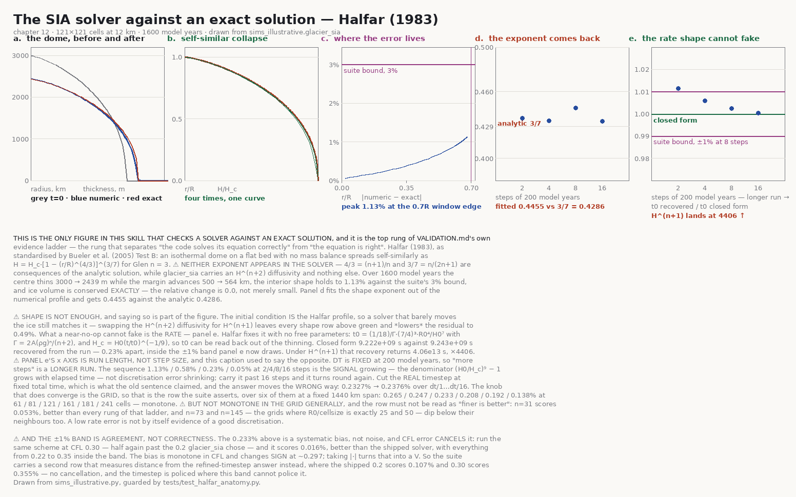

---
# --- okf v0.2, written by tools/okf_apply.py -----------------------
type: Reference
title: "Glacial, Coastal & Marine"
description: Glacial carving on the shallow-ice approximation, and the coastal chain from radiation stress through nearshore currents to the bar and rip system.
tags: [glacial, coastal, surf, sia]
status: stable
generated: { by: process:claude-code, at: 2026-08-21T14:22:53Z }
# --- end okf v0.2 ----------------------------------------------------
---
# Glacial, Coastal & Marine

Contents: [Glacial: why it matters](#glacial-why-it-matters) · [Mass balance](#mass-balance) ·
[Glen's flow law & SIA](#glens-flow-law--the-shallow-ice-approximation) ·
[Glacial erosion](#glacial-erosion) · [Landforms](#glacial-landforms) · [Glacial deposition](#glacial-deposition) ·
[Outburst floods & megafloods](#glacial-outburst-floods--megafloods) ·
[Coastal: be honest](#coastal-be-honest) · [Wave exposure](#wave-exposure) ·
[Sea ice](#sea-ice--a-gate-on-the-coastal-loop-not-a-landform) ·
[Cliff retreat & beaches](#cliff-retreat--beaches) ·
[Lacustrine (lake) shores](#lacustrine-lake-shores) ·
[Marine: the honest frame](#marine-the-honest-frame) ·
[Longshore drift & depositional landforms](#longshore-drift--depositional-landforms) · [Coastal dunes & foredunes](#coastal-dunes--foredunes) ·
[Marine terraces](#marine-terraces) · [Deltas, estuaries, rias](#deltas-estuaries-rias) ·
[Wave base & the submarine profile](#wave-base--the-submarine-profile) ·
[Surf-zone morphodynamics](#surf-zone-morphodynamics--bars-rips--the-nearshore-circulation) ·
[Tides & the intertidal zone](#tides--the-intertidal-zone) ·
[Tidal inlets & their deltas](#tidal-inlets--their-deltas) · [Biogenic muddy coasts](#biogenic-muddy-coasts--mangroves--cheniers) · [Coral reefs & atolls](#coral-reefs--atolls) ·
[Seafloor, ridges & submarine processes](#seafloor-ridges--submarine-processes)

## Glacial: why it matters

**The diagnostic is the valley cross-section.** Fluvial erosion cuts **V**-shaped valleys —
incision concentrates at the channel. Glacial erosion cuts **U**-shaped valleys — erosion is
proportional to basal sliding velocity, which is distributed across the full width of the ice.

That single difference is why glaciated terrain reads as glaciated. If your brief says "alpine"
and you only ran fluvial erosion, the valleys are V-shaped and it will read as wrong to anyone
who has seen a mountain, even if they can't say why.

**Provenance:** **Argudo et al. 2020**, *Simulation, Modeling and Authoring of Glaciers*, ACM
TOG 39(6) (SIGGRAPH Asia). The underlying physics — Glen's flow law and the Shallow Ice
Approximation — is standard glaciology, not graphics.

## Mass balance

Ice accumulates above the **ELA** (equilibrium line altitude) and melts below it.

```
massBalance(z, ELA):
    b = beta * (z - ELA)                        # beta ≈ 0.005–0.01 /yr (m ice per m elevation)
    return min(b, bMax)                          # accumulation saturates; melt does not
```

`bMax` caps accumulation (precipitation is finite — couple it to `13` if you have an orographic
model; the windward side of a range accumulates far more, which is real and visible).

**ELA is the master parameter.** Lower it and glaciers advance and fill the valleys; raise it
and they retreat to cirques. A glacial landscape is authored by choosing an ELA history, not by
painting ice.

## Glen's flow law & the Shallow Ice Approximation

Glen's flow law: ice deforms with strain rate proportional to stress cubed.

```
ε̇ = A · τⁿ            with n = 3, A ≈ 2.4e-24 Pa⁻³ s⁻¹ at 0 °C (temperature-dependent)
```

The SIA integrates this through the ice column, assuming the ice is thin relative to its extent
and that shear stress is dominated by the surface slope. The result is a depth-averaged
velocity:

```
s = h + H                                        # surface = bedrock + ice thickness

ū = -(2A / (n+2)) · (ρ_ice · g)ⁿ · H^(n+1) · |∇s|^(n-1) · ∇s
```

with `ρ_ice ≈ 917 kg/m³`. Then ice thickness evolves by mass conservation:

```
∂H/∂t = -∇·(ū H) + b(z)
```

**The `H^(n+1)` is the whole character of the model.** With `n = 3` the depth-averaged *velocity*
scales as `H⁴` — and the ice *flux* `ū·H` as `H⁵`. Thick ice flows enormously faster than thin
ice, so glaciers self-organise into fast trunk streams in valleys and near-stationary ice on the
interfluves. That's why glaciers carve valleys and leave arêtes between them.

**Numerics:**
- **This is a diffusion equation and it is stiff.** Explicit timestepping needs
  `Δt < cellSize² / (2·D_max)` where `D` is the effective diffusivity of the *flux*,
  `D = (2A/(n+2))·(ρg)^n · H^(n+2) · |∇s|^(n−1)` — which blows up under thick ice. Use an
  implicit or semi-implicit solve, or subcycle adaptively (`15` prefers subcycling on GPU). If
  someone reports "my glacier sim explodes where the ice is thick", this is it.
- **Compute `∇s` on the surface, not the bedrock.** This is the coupling that makes ice flow
  downhill along the *ice* surface, which can differ from the bedrock slope. Getting it wrong
  gives ice that flows uphill out of overdeepenings — which real glaciers do, and a bedrock-slope
  implementation cannot.
- Guard `H → 0` at the margins; the exponents make the terms singular.

**The step loop** — the implementable form, in the `04`/`19` pattern (double-buffered):

```
glacierStep(bed, H, Δt):
    # 1. Mass balance (climate, 13): accumulate above the ELA, melt below
    s  = bed + H
    H += clamp(β * (s − ELA), −∞, bMax) * Δt ;  H = max(H, 0)
    melt = the negative part → a WATER SOURCE for 03's discharge (the coupled loop, below)

    # 2. SIA diffusivity on the ICE SURFACE gradient (numerics above)
    D  = (2A/(n+2)) * (ρ_ice g)^n * H^(n+2) * |∇s|^(n−1)      # zero where H ≈ 0

    # 3. Ice transport — adaptive explicit subcycling (stable Δt' = 0.25 cellSize² / max(D))
    repeat until Δt consumed:  H += ∇·(D ∇s) * Δt'

    # 4. Erosion at the bed
    u_b  = f * ū                                # sliding fraction; 0 where cold-based
    bed -= K_g * |u_b|^l * Δt                    # + plucking where steep & fractured
    # eroded volume → a moraine/sediment field at margins and terminus (the mass budget)
```



> **The one benchmark in this skill against an EXACT solution.** `P` (Halfar 1983; Bueler et al.
> 2005 'Test B'), measured `D`. Drawn by
> [`reference-impl/halfar_anatomy.py`](../reference-impl/halfar_anatomy.py) from
> `sims_illustrative.glacier_sia`, guarded by `tests/test_halfar_anatomy.py`. An isothermal dome on
> a flat bed with no mass balance spreads self-similarly as
> `H = H_c·[1 − (r/R)^(4/3)]^(3/7)` for Glen `n = 3`.
>
> ⚠️ **Neither exponent appears anywhere in the solver.** `4/3 = (n+1)/n` and `3/7 = n/(2n+1)` are
> consequences of the analytic solution; `glacier_sia` carries an `H^(n+2)` diffusivity and nothing
> else. That independence is what makes this the top rung of
> [`VALIDATION.md`](../reference-impl/VALIDATION.md)'s ladder — the rung that separates *the code
> solves its equation correctly* from *the equation is right* — and it is the property most easily
> lost to a refactor that shares a constant, which is why a test greps the solver for it.
>
> Over **1600 model years** the centre thins **3000 → 2439 m** while the margin advances
> **500 → 564 km**; the interior shape holds to **1.13%** against the suite's 3% bound; and ice
> volume is conserved **exactly** — the relative change is `0.0`, not merely small. Panel **b** is
> the claim itself: four different times, each normalised by its own centre height and radius,
> falling on one curve. Panel **d** fits the shape exponent back out of the numerical profile and
> gets **0.4455** against the analytic **0.4286**. Panel **c** shows the residual growing toward
> the margin, which is where the SIA is expected to degenerate — the exact profile has an infinite
> surface slope there.

*Runnable reference: `reference-impl/glacier.py` (`glacier_carve` = this `glacierStep`; SIA transport
reused from `sims_illustrative.glacier_sia`, Halfar-validated), verified by `tests/test_glacier.py`.
Invariant-checked (illustrative-morphological tier): it reduces to the ice-only sim when `K_g=0`,
carves only (never raises), only under ice, conserves the eroded volume into a moraine field, and
thick trunk ice erodes far more than thin ice — the arête / hanging-valley differential. The idealised
parabolic **U** cross-section is the **L-tier** emergent form below: a vertically-integrated SIA
concentrates abrasion at the thalweg and does not by itself reproduce the textbook parabola (that
needs a higher-order ice model or the cross-valley sliding distribution of Harbor 1992); the optional
`wall_abrasion` widens the trough as an honest F-tier "look". The explicit solver is also stiff — it
stays stable for modest step counts / gentle terrain (as the chapter warns, use an implicit solve for
large `Δt` on rough beds).*

**The coupled fluvial–glacial loop.** "Glacial runs alongside fluvial" (the Legal Order's 6b) has
a concrete shape: an outer loop where `glacierStep` erodes under the ice, the mass-balance melt
feeds `03`'s discharge as a source term (proglacial rivers are melt-fed — it's why they surge in
summer, `03`), and the fluvial backbone (`04`) erodes the ice-free terrain. Timesteps differ by
orders of magnitude — ice wants years, stream power tolerates millennia (`04`) — so run the fluvial
solve every N glacier steps, not in lockstep.

**Glacier parameter reference** (order-of-magnitude starts; tune against the U-valley/ELA checks):

| Parameter | Start | Notes |
|---|---|---|
| `A` (Glen) | ~2.4×10⁻²⁴ Pa⁻³ s⁻¹ at 0 °C | The Cuffey & Paterson 2010 recommended value; Arrhenius `A₀·exp(−Q/RT)`, colder ice stiffer |
| `n` | 3 | Glen's exponent |
| `ρ_ice` | 917 kg/m³ | |
| `β` (mass balance) | 0.005–0.01 /yr | m of ice per m of elevation |
| `bMax` | ~0.5–2 m/yr | Accumulation cap — precipitation is finite (couple to `13`) |
| `ELA` | **the master parameter** | Author its *history*, not the ice |
| `f` (sliding fraction) | ~0.5 | 0 where cold-based (no erosion) |
| `K_g`, `l` (abrasion) | ~1e-4, l ≈ 1 | `05`-style erosion constant |
| `Δt` | years–decades | With subcycling from the CFL above |

## Glacial erosion

```
ė = K_g · |u_b|^l                                # abrasion; l ≈ 1, K_g ≈ 1e-4
```

`u_b` is the **basal sliding velocity**, not the depth-averaged velocity — erosion happens at
the bed. In a simple model, `u_b = f · ū` with `f ≈ 0.5`, or zero where the bed is frozen
(cold-based ice does not erode; this is why some plateaux survive glaciation untouched — a
detail worth knowing and mostly ignorable).

Add plucking (quarrying) if you want cirque headwalls to work — it scales with the same
velocity but concentrates where the bed is steep and fractured:

```
ė_pluck = K_p · |u_b| · fractureDensity
```

**In the graph:** glacial erosion runs *alongside* fluvial (`04`), not after. A landscape with
glacial history has both — fluvial valleys that were later occupied and reshaped by ice, and
tributaries that weren't. The characteristic **hanging valley** (a tributary whose floor sits
high above the trunk) is exactly what you get when the trunk was glaciated harder than the
tributary. You don't author it; it falls out.

## Glacial landforms

All **L-tier**. The recipes:

| Landform | Falls out of |
|---|---|
| **U-shaped valley** | Distributed basal erosion under a trunk glacier |
| **Cirque** | Plucking at the head of a small glacier, near the ELA. Armchair-shaped hollow. |
| **Arête** | The interfluve between two cirques/valleys, eroded from both sides |
| **Horn** | Three or more cirques meeting. The Matterhorn. |
| **Hanging valley** | Tributary eroded less than the trunk |
| **Overdeepening** | Ice eroding below the outlet — a closed basin the ice could climb out of. **Becomes a lake.** Do not fill it in `03`; it's real. |
| **Fjord** | Overdeepened glacial valley + sea-level rise |
| **Moraine** | Deposition of the eroded load at the margins and terminus. Track it as a sediment field. |

Note that **overdeepenings and fjords are both cases where a genuine closed basin is correct** —
the second exception (after karst, `11`) to the mandatory-fill rule in `03`. Glacial erosion
*creates* depressions, which is why glaciated terrain is full of lakes and fluvial terrain
isn't. If your fill node runs after glacial erosion with no mask, you have erased the most
recognisable signature of the process.

## Glacial deposition

Erosion (above) carves the valleys; the material it removes has to go somewhere, and where it lands is
the **diagnostic** half of a glacial landscape. A U-valley in cross-section can be mistaken for a big
fluvial one — but nothing except ice leaves **drumlins, eskers and erratics**, so the deposits, not
the troughs, are what say "ice was here". They all draw on one budget: the volume eroded by
`glacierStep` (above) *is* the sediment supply, so `Σ deposited = Σ eroded` — the same
mass-conservation discipline as fluvial (`SKILL.md`). Don't let a deposition node mint sediment the
ice never excavated. Two families, split by whether **water sorted the load**.

**Ice-laid (till — unsorted, dumped directly by the ice):**

| Landform | Recipe |
|---|---|
| **Moraine** (already noted) | The eroded load released at the ice margin: **terminal** at the snout, **lateral** on the flanks, **medial** where two glaciers merge, **ground** under the sole. A terminal moraine dams a proglacial lake (`03` — a real basin). |
| **Drumlin** | Streamlined till hill, **blunt up-ice, tapered down-ice**, in swarms under fast ice. Author the *form*, not the genesis (below): streamline a till field along the ice-flow vector, sized by Clark et al. 2009. |
| **Till plain / ground moraine** | The low-relief till sheet smeared under the sole — a thickness blanket that mutes the underlying relief, not a feature in its own right. |
| **Erratic** | A boulder carried far from source and dropped. Pure `07` scatter of **out-of-lithology** clasts (`11` material tag ≠ local bedrock) — the cheapest, most legible ice fingerprint there is. |

**Meltwater-laid (glaciofluvial — sorted, kin to the outburst floods below):**

| Landform | Recipe |
|---|---|
| **Esker** | A sinuous sand-and-gravel ridge — the cast of a subglacial meltwater tunnel. Route it, but *not* on the bed (see the Shreve callout). |
| **Kame** | An ice-contact stratified mound — a delta or fan built against or on top of stagnant ice, left standing when the ice melts out. |
| **Kettle** | A pit where a buried ice block melted out. **A closed basin — it joins the `03` no-fill list** (with overdeepenings and karst); it usually holds a pond. Kame-and-kettle country is hummocky ice-stagnation terrain. |
| **Outwash plain / sandur** | Braided meltwater deposits fanning beyond the terminus — the `03` braided-river / `16` fan process driven by the mass-balance melt discharge, fining downstream. |
| **Tunnel valley** | A large subglacial meltwater channel, cut then often part-infilled; kin to the esker and the jökulhlaup below. Frequently overdeepened → a lake chain (another `03` no-fill case). Genesis debated — steady vs outburst drainage (Kehew et al. 2012). |

**The esker routing insight (Shreve 1985).** An esker is a river deposit, but it does *not* obey the
bed's topography — so a heightfield router (`03`) run on the bed places it wrong. In a water-filled
subglacial tunnel the water pressure ≈ the ice overburden, so flow follows the gradient of the
**hydraulic potential** φ = ρ_i·g·s + (ρ_w − ρ_i)·g·b, where `s` is the ice surface and `b` the bed.
Because ρ_i ≈ 11·(ρ_w − ρ_i), the **ice-surface slope outweighs the bed by ~11×**: route on
`(11·s + b)`, essentially the ice surface. The visible consequence, and the tell that sells it, is
that eskers **run uphill over the bed and cross divides at low passes**, trending with ice flow rather
than down the local slope. A router on the bare bed pools them in hollows — exactly wrong.

**Drumlin genesis is unresolved — so don't claim it (`?`).** Whether drumlins form by a deforming
bed, a subglacial instability, or catastrophic meltwater floods is a genuine, decades-old debate with
no winner. The honest move is the skill's standard one: author the **form** — blunt-up-ice till ridges
aligned to the ice-flow field, elongation ~2–4 and length 250–1000 m, obeying Clark et al. 2009's
`E_max ≈ L^(1/3)` limit — and make **no mechanism claim**. Anyone selling a "drumlin algorithm" with a
physical story is backing one side of an open argument.

**Alignment is machinery you already have.** Drumlins and eskers both trend with **ice flow**, exactly
as dunes trend with wind (`05`): the SIA surface gradient `∇s` (above) is a ready-made direction field
that orients both. And their closed basins — kettles, tunnel valleys — join overdeepenings and fjords
on the `03` no-fill list; a fill node run after glaciation with no mask erases them.

**Tier.** All **L** compositions over the erosion budget, with three anchors: **Shreve 1985** (esker
tunnel routing, **P**), **Clark et al. 2009** (drumlin morphometry & scaling, **P**), **Kehew et al.
2012** (tunnel valleys, **P** review); drumlin *genesis* is **?**. The synthesis reference for the
whole suite is **Benn & Evans 2010**, *Glaciers and Glaciation*. **The tell:** deposits align to ice
flow, erratics sit on foreign bedrock, and the deposited volume balances the eroded troughs — reverse
the flow direction and the drumlins point the wrong way.

## Glacial outburst floods & megafloods

The largest freshwater floods in Earth's history were not rain — they were **water released
catastrophically from behind or beneath ice**. Two source mechanisms, one landform signature:

- **Jökulhlaup (subglacial outburst)** — meltwater or a subglacial lake escapes through a tunnel in
  the ice, and the tunnel **enlarges by frictional melting as flow rises, in a runaway feedback**
  (Nye 1976): more discharge melts a wider tunnel, which carries more discharge. The hydrograph is the
  tell — a **slow exponential rise over days, then an abrupt cutoff** as the lake empties and the
  tunnel creeps shut:
  ```
  dS/dt = m/ρ_ice − creepClosure(S, p_ice − p_water)     # melt-open minus Glen-law closure
  Q     = (S/n) · R_h^(2/3) · √(hydraulicGradient)        # Manning; grows as the tunnel S grows
  # lake mass balance closes the loop: dV_lake/dt = Q_in − Q,  a runaway until V_lake → 0
  ```
  Nye 1976; extended by Clarke 1982, 2003; Icelandic type locality Björnsson 2003. Walder & Costa
  1996 note that *non-tunnel* drainage (an ice dam failing bodily) gives a **higher, sharper** peak
  than tunnel drainage.
- **Glacial-lake-outburst flood (ice-dam failure)** — an ice-dammed lake fails and empties in days.
  Glacial Lake Missoula doing exactly this is the **Channeled Scabland** source (Bretz 1923, 1969 —
  the once-ridiculed "outrageous hypothesis", later vindicated; Baker 1973; Baker & Nummedal 1978).

Route the released hydrograph over the DEM as an **extreme-discharge flood** (`03` routing, `04`
erosion at very high shear stress) and the **megaflood landform suite** falls out — all L-tier
composition targets, not algorithms:

| Landform | How it forms |
|---|---|
| **Scabland** | Basalt stripped of its loess/soil cover where shear stress exceeds threshold; anastomosing scoured channels |
| **Coulee** | A large flood-cut canyon, often now dry (Grand Coulee) |
| **Giant current ripples** | Gravel dunes, wavelength ~20–200 m, transverse to flow — bedforms scaled to flood *depth*, not to a normal river |
| **Streamlined residual island** | A teardrop hill of pre-flood loess, blunt upstream and tapered downstream, left where shear stayed below threshold |
| **Cataract & plunge pool** | A recessional knickpoint (Dry Falls) with a deep scour basin — a waterfall (`04`) at megaflood scale |
| **Loess island** | An uneroded silt upland isolated between scoured tracts |

```
megaflood(h, hydrograph):
    for Q in hydrograph:                              # the Nye / Missoula release curve
        route Q over the DEM (shallow water; 03)
        τ = ρ_water · g · depth · slope               # bed shear stress
        if τ > τ_c(material):  h -= K_e·(τ − τ_c)·Δt  # strip loess → scabland; cut coulees
        deposit gravel where velocity drops (eddies, expansions) → giant-ripple field
        retreat knickpoints headward at scarps        → cataracts / Dry Falls (04)
    # cells that never exceed τ_c survive as streamlined loess islands
```

**Watch for** treating these as ordinary river valleys — the diagnostic is **scale mismatch**: ripples
and bars sized to a flood hundreds of metres deep, dry coulees far too big for any current stream, and
cataracts with no river above them. On a dry world (Mars' outflow channels, `20` entry 29; Beggar's
Canyon) the *same* suite with the water switched off is the signature of a vanished catastrophic
flood.

**Verify.** The outburst hydrograph rises exponentially then cuts off abruptly (not a slow symmetric
bump), and every landform is scaled to a flood hundreds of metres deep — dry coulees, giant ripples,
streamlined loess islands; **scale mismatch is the signature** (`09`, *Checks for the extended
families*).

**Tier.** The jökulhlaup tunnel-enlargement physics and hydrograph are P (Nye 1976; Clarke 1982,
2003; Walder & Costa 1996; Björnsson 2003); the Missoula-flood interpretation of the Scabland is P
(Bretz 1923, 1969; Baker 1973). The individual megaflood landforms are L compositions over
extreme-discharge `03`/`04`.

## Coastal: be honest

**There is no canonical graphics paper for coastal erosion.** The catalogue entry "Coastal
Erosion — Various" is correct, and saying so is better than inventing a citation.

What exists: coastal engineering, which is about protecting infrastructure over decades, not
about carving landforms over millennia. **Bruun 1962** (*Sea-level rise as a cause of shore
erosion*, J. Waterways & Harbors Div., ASCE) gives the Bruun rule for shoreline retreat under
sea-level rise. The CERC formula gives longshore transport. Neither is what you want.

**In practice, coastal erosion in terrain tools is a look, not a simulation.** Be upfront about
that. The look is achievable and cheap; it just isn't physics.

## Wave exposure

The one part that's genuinely worth computing, because it's what makes the coastline *vary*
instead of being uniformly eroded.

```
fetch(p, dir, maxDist):
    # how far can wind blow over open water before reaching p?
    # isWater, not isOcean: the same sweep drives lake wind-waves (03 body-type LAKE), not just coasts
    d = 0
    while d < maxDist and isWater(p - dir * d):
        d += cellSize
    return d

exposure(p):
    e = 0
    for i in 0..N-1:
        φ = 2π * i / N
        w = max(0, dot((cos φ, sin φ), prevailingWind))      # weight by wind rose
        e += w * sqrt(fetch(p, (cos φ, sin φ), maxDist))     # wave energy ~ sqrt(fetch)
    return e / N
```

This is structurally the same sweep as horizon AO (`06`) — and it can use the same
Timonen & Westerholm O(1) machinery. Exposed headlands get high fetch, sheltered bays get low.
That asymmetry drives everything. (On a hexagonal grid the sweep is unchanged — the azimuths
are world-space and must stay so — but every `isOcean(p − dir·d)` lookup at a continuous
position goes through `cube_round`, never per-axis rounding; `26`.)

One refinement the sweep misses: real waves **refract** — shoaling bends crests toward shallow
water, *focusing* energy onto headlands and spreading it in bays, which sharpens the same
asymmetry. Fold it in as an exposure multiplier from coastline convexity (shore-plan curvature,
`06`) rather than simulating waves.

## Sea ice — a gate on the coastal loop, not a landform

**Sea ice is not terrain, and the first rule is not to make it terrain.** It is a transient solid
crust on the *water surface* — the layer stack's `waterSurface` grows a lid (`08`). It never enters
`solidTop`, it carries no bathymetry, and baking it in is the sea-going version of baking water into
the height field. If it is rendered at all it is a surface with a thickness field, exactly like snow
over land (`13`).

**Its first-order geomorphic effect is switching the rest of this chapter off.** Shore-fast ice and
an ice foot armour the shoreline for part of the year, and offshore pack ice removes the open water
that waves need. So the coastal loop does not run year-round: it runs during an **open-water
season**. Implementation is one multiplier and it is most of the story:

```
iceFree(azimuth, season)                       # fraction of the year that direction is open water
fetch'(p, dir) = fetch(p, dir) * iceFree(dir, season)     # ice-limited fetch — 12's sweep, gated
coastalStep(...) *= openWaterFraction           # the whole wave budget scales with the season
```

**And then the part that gets Arctic coasts backwards if you stop there.** Ice-bound coasts are not
protected on net — they are among the fastest-retreating shorelines on Earth, several metres a year,
because the dominant mechanism is not wave abrasion at all. Where the bluff is **ice-rich
permafrost** (`17`), the sea does *thermal* work: a thaw niche is melted at the waterline, undercuts,
and the block above collapses along its ice wedges. Retreat is therefore driven by **water
temperature and open-water duration**, not by wave energy, and it is **not** proportional to fetch —
a sheltered ice-rich bluff can retreat faster than an exposed rock headland. Model an ice-rich coast
as thermal abrasion gated by the open-water season, and a rock coast with the wave machinery above;
using the wave model for both is the defect.

**Ice is also a sediment-transport path with no wave analogue**, and it matters to the budget
invariant (`SKILL.md`). Sediment freezes into shore-fast and anchor ice during the freeze-up, rides
out with the floes, and drops wherever they melt — **ice rafting**, offshore and often far from any
current that could have carried it. The signature is a *dropstone*: a clast far too coarse for the
mud it sits in, with the laminae beneath it deformed by the impact. The paleo record of the same
process at scale is **Heinrich 1988** (*Quaternary Research* 29 — North Atlantic ice-rafted debris
layers from iceberg armadas). For a graph, this is a **net offshore export term**: a sediment budget
closed with waves alone will not close on an ice-affected coast.

Three further forms, all cheap and all recognisable:

- **Ice push / ice shove (ivu).** Wind- and current-driven pack ice rides up the shore and bulldozes
  whatever it meets into ridges — **boulder barricades** and ice-push ramparts above the waterline.
  Episodic and metre-scale; a displacement event, not a rate.
- **Ice-keel gouging.** Pressure-ridge keels plough the shallow seabed, cutting linear scours with
  levées either side, in water shallower than the keel draught. This is *seabed* morphology (`12`
  submarine profile), not coastline, and it is a strong tell that a shelf is ice-affected.
- **The ice surface itself**, if you render it, is composition rather than simulation (`10`): floes
  are a fracture tessellation (Worley/Voronoi, `01`), leads are the linear openings between them, and
  pressure ridges run along floe boundaries. Do not simulate ice dynamics to get a look you can
  compose.

**Tier — and the honesty is the point.** As with coastal erosion above, **there is no graphics paper
for any of this**, and saying so beats inventing one. The process literature is periglacial and
coastal geomorphology and sea-ice oceanography, not computer graphics: the mechanisms above are
**P** as observed process, the ice-rafting paleo record is **P** (Heinrich 1988), and every
*implementation* here — the fetch gate, the open-water multiplier, the thermal-abrasion coupling —
is **F**, assembled from this chapter's existing machinery. Rates are strongly regional; treat any
number as a knob to calibrate against a reference coast, not a constant. Permafrost substrate,
ice-wedge geometry and thermokarst are `17`.

## Cliff retreat & beaches

```
coastalStep(h, seaLevel, exposure):
    # 1. Erode a band around sea level, weighted by exposure
    band = exp(-(h - seaLevel)² / (2 * notchHeight²))        # a notch AT sea level
    h -= K_coast * exposure * band * hardness⁻¹

    # 2. Thermal (05) collapses the undercut cliff above the notch
    thermal(h, talusAngle=rockRepose)

    # 3. Deposit the eroded material in sheltered areas as beaches
    beach = (1 - exposure) * nearShore * (h < seaLevel + beachHeight)   # ── DEFECT: zero over
    h += K_deposit * beach * sedimentBudget                             #    open water, and not
                                                                        #    coupled to step 1.
                                                                        #    See below.
```

The three-step loop — **notch, collapse, deposit** — is what produces the whole coastal suite:
the notch undercuts, thermal collapses the overhang into a cliff face, and the debris either
armours the base (slowing retreat) or gets carried to a bay. Iterate it and headlands retreat
faster than bays, which is correct and self-reinforcing until the coast straightens.

> **The "until the coast straightens" clause is right, and it is exactly why this chapter is
> missing a landform.** Found by implementing the block against a photographed embayment
> (`water-physics/reference-impl/beach.py`; 1408 m of coast, one offshore spectrum
> `H₀ = 1.5 m, T = 9 s, θ₀ = 20°`). Impose zero longshore transport on the CERC closure below —
> `Q ∝ sin(2·θ_loc)`, so `Q = 0 ⟺ θ_loc = 0` — with **plane offshore crests and shore-parallel
> contours**, and Snell gives `sin θ_b = (c_b/c₀)·sin θ₀,local` with `c_b/c₀ > 0`, so `θ_b = 0`
> requires `θ₀,local = 0` at *every* station. Integrating `φ_s = −θ₀` gives **one straight line,
> rotated to face the swell**, and any curvature raises the transport. This chapter's clause is a
> theorem for the wave field this chapter assumes.
>
> **What is missing is the landform that the clause therefore cannot produce: the
> static-equilibrium (headland-)bay.** A sandy shore between two rock control points under a
> persistent oblique swell relaxes to a *crenulate* plan-form with **zero longshore transport
> everywhere along it**, and it has two published closed forms — the **logarithmic spiral**
> (Krumbein 1944; Yasso 1965; Silvester 1970) and the **parabolic bay-shape equation**
> (Hsu & Evans 1989), keyed to a diffraction point at the updrift headland tip, a control line, and
> the wave obliquity β at the downcoast control point. Neither is anywhere in this chapter, and the
> bay is the commonest sandy-coast plan-form there is. **P** for the forms; the attributions are
> quoted from model knowledge and not verified against the papers, so treat them as **`?`** until
> checked.
>
> **The bay is not a property of a shoreline; it is a property of a shoreline *and* the headland
> that shelters it.** The equilibrium exists only where the wave orthogonal **fans** alongshore,
> and the fan is diffraction plus refractive focusing at the headland — which is why
> [Wave exposure](#wave-exposure)'s "fold refraction in as an exposure multiplier from coastline
> convexity" is the right instinct pointed at the wrong quantity: convexity modulates the *energy*,
> and what makes a bay is the *direction*. Measured on the implementation, the fan that scene's bay
> requires is **39.6° of alongshore swing** in the orthogonal, and the same shoreline under a plane
> crest carries **twice** the straight coast's transport rather than none. The derivation of why the
> spiral (a constant residual obliquity forces a constant tangent-to-radius angle, which is the
> logarithmic spiral and nothing else) and the measured residuals are in
> `water-physics/references/12a-water-derivations.md` §11.
>
> **One derived member, for anyone adding this here.** If the orthogonals radiate from the
> diffraction point, "shore normal to the orthogonal" reads "shore normal to the radius" and the bay
> is a **circular arc about that point, exactly** — `α = 90°`. Silvester's published `α` for real
> bays is 30–50°, an empirical fit to the residual obliquity, and it must not be presented as a
> computed quantity.

**Wave-cut platform.** The flat bench at sea level is the signature. It emerges if `band` is
narrow and `K_coast` is high — the terrain is planed off at exactly `seaLevel` and can go no
lower. ~~If you're not getting one, `notchHeight` is too large.~~ — **struck: that diagnostic and
the retreat loop are in conflict as written. See below.**

> **Correction — `coastalStep` taken literally stops retreating, and its two stated remedies are
> mutually exclusive.** This was found by implementing the block
> (`water-physics/reference-impl/beach.py`, `coastal_step()` / `evolve_coast()`; 1408 m of
> coast, 4 m grid, run here at every setting quoted). It is a defect in the pseudocode, not in the
> physics above it.
>
> **The mechanism, and it is one line.** `band = exp(−(h − seaLevel)²/(2·notchHeight²))` is a
> function of the **cell's own elevation**. Once the notch has cut the cliff toe *below* the band,
> and the thermal step is holding the face at repose *above* it, **no cell that is still intact
> rock is inside the band.** The erosion term has nothing left to act on and the coast stops. It
> does not stop *eroding* — it goes on planing seabed it had already cut, which is why the failure
> reads as a working loop.
>
> **Measured.** Mean shoreline retreat, and the width of the shallow shelf (bed within 2 m of the
> datum, seaward of the shoreline) that the loop planes:
>
> | | retreat @ 800 steps | @ 1600 | shelf @ 800 | @ 1600 |
> |---|---|---|---|---|
> | **the block exactly as written** | 23.56 m | **23.77 m** | 86.2 m | **32.7 m** |
> | the same, `notchHeight` × 6 | 112.57 m | **160.98 m** | 5.3 m | **5.8 m** |
> | with the undercutting term below | 79.59 m | **119.79 m** | 159.3 m | **213.0 m** |
>
> **0.21 m of retreat in 800 further steps** — it has stopped, and the shrinking shelf is the
> notch deepening water it already opened. Row two is the section's own diagnostic run backwards:
> widening `notchHeight` **does** restart the retreat, and it takes the bench with it (86 m → 5 m).
> **So "narrow band for a bench" and "the coast must keep retreating" cannot both be satisfied by
> tuning `notchHeight`**, and a reader who follows the diagnostic above will trade one landform for
> the other without being told that is the trade.
>
> **The fix is a physics statement, not a patch: what is missing is undercutting.** A real notch
> cuts *into* the cliff at the waterline and the overhang falls. A heightfield cannot hold an
> overhang — `11`'s representation warning, which this chapter already invokes for arches — so the
> undercut has to be expressed some other way, and the direct expression is that **waves attack the
> first land cell above the waterline, whatever its elevation**, because that is the cell the water
> reaches. In the pseudocode that is one extra term:
>
> ```
> band = exp(-(h - seaLevel)² / (2 * notchHeight²))        # as before
> band = max(band, firstLandCellAboveWaterline)            # ── the undercut
> ```
>
> With it the loop retreats indefinitely **and** planes a bench (row three), and the `notchHeight`
> diagnostic works in **both** directions again — narrow band, bench; wide band, no bench.
>
> **A second defect in the same block, whose fix is *not* settled.** Nothing in `coastalStep`
> limits how wide a platform it planes: the notch cuts as fast 200 m from the cliff as at its foot,
> because nothing attenuates the wave crossing the bench. Measured with the undercutting term in:
> the shelf runs **300 → 347 → 380 m at 1600 / 3200 / 6400 steps and is still widening when the
> domain runs out.** A real shore platform has a width, and this loop has no term that gives it
> one.
>
> ⚠️ **The obvious remedy does not demonstrably work, and it is recorded as an open problem rather
> than as a fix.** The natural energetics choice is to weight the notch by `(H/H_0)²` with
> `H = min(H_0, γ_b·d)` — a cliff behind a wide shallow bench is attacked by a small wave, and it
> introduces no new constant, since `γ_b` is the same 0.78 this chapter already shares with the
> renderer's break mask. It slows the whole loop down; it does **not** bound the platform. Measured
> here, same runs, same metric: **213 → 284 → 341 m** at 1600 / 3200 / 6400 steps, i.e. widening
> by +71 and +57 m per interval against the unattenuated loop's +47 and +33. Neither saturates
> before the domain does. The depth-limited breaker is **P** and the coupling is plausible; the
> claim that it produces an *equilibrium* width is **`?` and unverified**, and it is left that way
> here rather than repeated.
>
> **A third defect, in step 3, and this one breaks a rule this chapter states in its own words.**
> `beach = (1 − exposure) · nearShore · …` is **identically zero over open water.** `exposure` is
> the fetch sweep above, and in open water every seaward azimuth is unobstructed, so it *saturates*
> — measured on the same run, `exposure` over open water has **min 1.0000 and max 1.0000**, so
> `1 − exposure` there is **exactly 0**. The one place a retreating cliff's debris has to go is the
> one place the weight sends none of it, and the loop **loses the rock it eroded out of a closed
> domain**: of **3 825 309 m³** eroded, **1 455 980 m³ — 38.1% — is unaccounted for** at the end of
> the run (4000 steps, 4 × 16 m grid, run here).
>
> **And the leak is not a coefficient that can be tuned out, which is the part worth checking
> before reaching for one.** `h += K_deposit · beach · sedimentBudget` has no coupling to the volume
> step 1 just removed — it is a source term with a free rate, not a redistribution — so nothing in
> the block makes `Σ deposited = Σ eroded`. Run it at three deposition rates and the missing volume
> barely moves:
>
> | `K_deposit` | rock eroded | unaccounted | share |
> |---|---|---|---|
> | 0.5 | 3 235 054 m³ | 1 479 873 m³ | 45.7% |
> | 1.0 | 3 825 309 m³ | **1 455 980 m³** | 38.1% |
> | 2.0 | 3 939 768 m³ | 1 450 694 m³ | 36.8% |
>
> **Four times the deposition rate moves the missing volume by 2%.** That is the diagnosis: the loop
> is not moving the eroded rock at all. It is adding an unrelated amount wherever the weight is
> nonzero, filling those cells to their cap, and dropping the remainder — so the imbalance is set by
> the geometry of the weight, not by the rate. Note also that `exposure` is **zero on land** (no
> fetch reaches a cell behind the cliff), so taking the weight literally over the whole grid rather
> than over the nearshore inverts the problem instead of fixing it: `1 − exposure` is then *largest*
> in the middle of the plateau, and the debris piles onto the highest, driest, most sheltered ground.
>
> ⚠️ **This chapter already states the rule the block breaks.** [Glacial deposition](#glacial-deposition)
> says it plainly — *"`glacierStep` (above) **is** the sediment supply, so `Σ deposited = Σ eroded`
> … Don't let a deposition node mint sediment the erosion never produced."* The coastal block is the
> same architecture with the discipline missing, and the reason it survived is that a leak in a
> *closed* domain looks like a working loop: the coast retreats, the cliffs look right, and nothing
> in the frame is the missing volume.
>
> **Three corrections, and none of them adds a constant:**
>
> 1. **`nearShore` is water.** Restrict the band to cells below the datum; that is what the name
>    says and it removes the plateau-piling failure at the same time.
> 2. **The material stays in the row it came from.** A single global `sedimentBudget` spread by
>    `1 − exposure` moves rock *alongshore*, and moving sediment alongshore **is longshore drift** —
>    a mechanism this block does not model, arriving through a weighting term where nobody will look
>    for it. Row-local deposition needs no coefficient and leaves the alongshore redistribution
>    named rather than faked.
> 3. **The fill is capacity-limited, and the excess is exported and reported.** A cliff makes far
>    more debris than a beach can hold: retreating 100 m of a plain at 1:12.5 removes ~750 m² of
>    rock per metre of coast and the nearshore band holds ~120. So most of it leaves, and **that is
>    a fact about coasts rather than a leak** — the difference is entirely whether the loop returns
>    the number. With the three corrections the same run books **3 014 153 m³ eroded = 301 415
>    deposited + 2 712 737 exported**, closing to **1.1×10⁻⁸ m³** — machine precision on a
>    three-million-cubic-metre account, and 90% of the debris leaving the domain *with a number on
>    it* (all four figures measured here).
>
> **Tier, for this third defect.** The zero-over-open-water mechanism is **arithmetic on the block as written** and needs
> no warrant beyond reading it; the volumes and the `K_deposit` insensitivity are **implemented and
> measured** at those settings. `Σ deposited = Σ eroded` is this chapter's own rule, `F`. The 1:12.5
> capacity arithmetic is `D` for *that* profile — recompute it for another, since it is what decides
> whether the export is 90% or 10%.
>
> **Tier.** The stall and the mutual exclusivity are **implemented and measured** — reproducible by
> anyone who runs that file at those settings, which is the warrant this scheme still has no mark
> for. Undercutting followed by cliff collapse is **P** and not in dispute; its *expression* as
> "attack the first land cell above the waterline" is **N** — a statement about what a heightfield
> can represent, and it belongs beside the arch warning rather than beside the erosion law.

> **A fourth finding in the same block, and it is about the bench rather than the cliff.** Same
> implementation, measured at the settings above. The wave-cut platform this section promises does
> appear — 14–16 m of it in every row of 1408 m of coast, planed to within 0.75 m of the datum —
> and **none of it is visible, because step 3 buries the part of it that is above water.** The
> deposition band lays the eroded sand over every cell below the swash plane, and a bench at sea
> level is below the swash plane by definition. Measured on the subaerial bench: **median regolith
> 2.27 m against a rock roughness of 0.25 m**, so the sand is nine times the relief it would have
> to *infill* to leave anything showing, and the surface reads as beach with cover = 1.000
> everywhere. The bare platform is all below the waterline.
>
> **It is one declared number away, and the number is the sand fraction.** The wedge needs
> 34.3 m³ per metre of coast and the loop delivers 206.1 at a 10% sand yield, so the bench emerges
> subaerially only below about **1.7%**. That is the whole distance between "this coast has a sand
> beach" and "this coast has a rock platform", and both are photographed at the same coast a
> hundred metres apart — so a scene wanting both needs the yield to be a **field** (it is a
> function of what the cliff is made of, which is the hardness field this block already carries)
> rather than one constant. **`?` and unbuilt**; recorded so the next reader does not conclude the
> platform is missing from the loop when what is missing is its exposure.

**Sand infilling the hollows is an AREA fraction, and it is not a blending coefficient.** The
bench in a photograph is *pocketed* — bare rock standing through sand that has filled the hollows —
and that is a statement about area, not about depth. It has a closed form and needs no texture. Let
the rock inside one cell have elevation `z ~ N(0, σ_r)` about its own mean and let sand pond to a
level `l`:

```
covered area fraction   f   = Φ(u),                    u = l/σ_r
mean sand depth         reg = σ_r·(φ(u) + u·Φ(u))      # = E[(l − z)+], the volume book
```

so a mean depth fixes `u` and `u` fixes `f`, with nothing left over. **It is strongly non-linear
and that non-linearity IS the pocketing**: a veneer whose mean depth *equals* the rock's roughness
covers **81.6%** of the area, not 100% — a fifth of the surface still stands through it. Half a
roughness covers 57.5%, a quarter 36.5%. A linear "sand if `reg > 0`" test gives a clean edge where
the photograph has an interfinger.

> **And then it must be drawn as a MASK, not multiplied in as a coefficient.** Found by
> implementing exactly the paragraph above and shipping it for a wave: an area fraction used as a
> blend paints the *expectation* of a binary spatial field — every square metre reading a quarter
> rock, where "pocketed" means a quarter of the **area**. The fix costs one field and no new
> physics: sand fills each pocket from the bottom up, so the bare share is the top `1 − f` of the
> rock's own **height ordering**, and a rank field is uniform on [0,1] by definition, which is the
> only marginal for which `E[bare] = 1 − f` identically. The realisation and the closed form then
> check each other, and neither is built from the other.
>
> **Why this survived a whole wave: the mean was always right.** Reintroducing the blend as a
> deliberate defect moves **not one** of the five suite rows that check the bare share against
> `Φ(u)`. What it moves are the rows that ask whether the shader's field is *binary*. A
> quantity that is correct in expectation and wrong as a surface is invisible to every test written
> about its expectation — which is the general lesson, and this chapter's `glacierStep` volume rule
> is the same shape one level down.
>
> The pocket **scale** is a second `?` and it is the first one seen sideways: `σ_r` is the relief's
> amplitude, the correlation length is its wavelength, and together they are an rms slope. Declared
> at 2 m, bracketed 0.7–6 m, and the bracket moves the *size* of a pocket and **not** how much rock
> shows — because the mask's mean is the closed form at any scale. That is how to hold an unknown
> the volume book cannot decide.

**Sea stacks and arches** are `L`-tier and **need `11`'s representation warning**: an arch
cannot exist in a heightfield. A sea *stack* can (it's just an isolated column), and it emerges
naturally where a hard bed survives while the softer rock around it retreats — so it requires
spatially varying hardness. With uniform rock you get a straight cliff and nothing else, which
is the usual reason a coastal graph looks boring.

> **"Spatially varying" is not enough — the hardness field needs a SPECTRUM, and a single
> correlation length silently forbids the stack.** Measured on the same implementation, which uses
> a band-limited field of seven modes spread one octave around an alongshore correlation length of
> 380 m. That field produces the headlands and the bay it was built for: 150 m of shoreline
> amplitude over 1408 m of coast, with hardness varying by ±0.29 along the shoreline. It produces
> **zero** isolated highs standing seaward of the shoreline, in the whole domain, at any step count
> — and the reason is arithmetic rather than dynamics. **The shortest mode present is 190 m; the
> grid's alongshore Nyquist is 32 m; a sea stack is 10–30 m across.** There is no power at the
> landform's own scale, so no run of the loop can produce one.
>
> The consequence for a reader is a ranking, not a patch: **a hardness field with one scale is a
> headland-and-bay generator, and a stack, a skerry or an offshore reef needs power two orders
> below it** — which is what rock-mass strength actually looks like, since it is set by joint and
> bedding spacing and fracture networks are scale-free over orders of magnitude. Whether a
> power-law hardness field produces stacks **is not verified here** and is `?`: it was diagnosed
> and left, because changing the field's spectrum changes the plan-form every other measurement in
> this block was made on. The *diagnosis* is `D` — three numbers and a comparison.

## Lacustrine (lake) shores

The coastal loop is **water-body-agnostic**. A large lake has fetch, waves, and a shoreline, so
`coastalStep` runs unchanged with `waterSurface = lakeLevel` and the `fetch` sweep taken over the
lake instead of the ocean (`isOcean → isWater`). The mountain lakes of `03` are not just flat
plates — given enough fetch they erode their own shores. What you get:

- **A wave-cut bench at lake level** — the lacustrine wave-cut platform, planed at the lake
  surface exactly as the marine one is planed at sea level.
- **Lake terraces from a lake-LEVEL history** — the freshwater twin of *Marine terraces* below.
  Run the loop across a sequence of lake stands; each stand planes a bench, then the level drops
  (outlet incision, a drying climate) and strands the bench above the modern shore. The
  foundational study is **Gilbert 1890** (*Lake Bonneville*, USGS Monograph 1); the Bonneville and
  Provo shorelines ringing the Utah basins are the type example — and they are *horizontal* (a
  dead-flat contour wrapping the topography), which is the tell that a bench is an old shoreline
  and not a structural bed (`11`).
- **Beaches, spits, and bay bars** from lake longshore drift (small lakes have too little fetch —
  skip it; a tarn is a mirror, not a wave machine).
- **Deltas prograding into the lake** where a river enters — the classic **Gilbert delta**
  (topset / foreset / bottomset beds), named for the same G.K. Gilbert. The lake case of the delta
  recipe in *Deltas, estuaries, rias* below.

**Lake level is not authored free-hand** — it is the spill elevation from depression handling
(`03`). Lower the outlet and the whole shoreline suite drops, leaving the terrace flight above:
the same *notch → collapse → deposit across a level history* machinery as marine terraces, pointed
at an inland basin instead of the sea.

## Marine: the honest frame

"Oceanic erosion" sounds like the sea grinding down the seabed. It mostly doesn't. Wave energy
does work in a narrow band **at and just below sea level**; below **wave base** (~½ the
wavelength — tens of metres for ordinary swell) the water barely stirs the bottom and the seabed
is **depositional**, not erosional. So marine processes in a terrain graph are four things, none
of them "carve the abyss":

1. **The shoreline band** — cliff retreat and wave-cut platform, the `notch → collapse → deposit`
   loop above.
2. **Longshore redistribution** — moving the freed sediment *along* the coast.
3. **Marine deposition** — deltas, beaches, spits, and the smooth equilibrium profile of the
   shoreface.
4. **Surf-zone morphodynamics** — the one strip of seabed the sea *does* continuously rework:
   breaker bars, rip channels, and the nearshore circulation (its own section below).

Same honesty as coastal for items 1–3: **no canonical graphics paper** (`00`, F-tier), and what
follows in those sections is a look built from the same fetch/exposure sweep, not physics — say
so. Item 4 is the exception and is tiered separately: the surf-zone loop rests on real
coastal-engineering physics (**P**), and only its graph realisation is authored (**L/F**). Do not
extend the F-tier caveat over it.

## Longshore drift & depositional landforms

Cliff retreat frees a sediment budget (the `beach` term above). Waves approaching the shore at an
angle drive that sediment *along* the coast — longshore (littoral) drift. The transport rate is
classically CERC-shaped:

```
Q_long ∝ sin(2 * (waveAngle − shorelineNormal))       # CERC / littoral drift; peaks near 45° approach
```

The `sin(2·angle)` dependence is the measured basis of the CERC formula (**Komar & Inman 1970**,
*Longshore sand transport on beaches*, JGR 75(30)) — coastal engineering, not graphics.

Route the freed budget downdrift along the shoreline and deposit it where the coast turns away
from the flow or shelters (low `exposure`). What falls out:

| Landform | Where it deposits |
|---|---|
| **Spit** | Sediment carried past a change in coast direction, building into open water |
| **Recurved spit / hook** | A spit whose tip curls landward where refracted waves wrap in |
| **Tombolo** | A spit that reaches an offshore island and ties it to the mainland |
| **Bay-mouth bar** | A spit grown across a bay, enclosing a lagoon behind it (breached by a tidal inlet where the prism is large enough — below) |
| **Barrier island** | An offshore sediment ridge parallel to a low, sediment-rich coast |
| **Cuspate foreland** | Deposition where two opposing drift directions meet |

All **L-tier** *as landforms* — compositions of drift + deposition + sheltering, not algorithms.
`00` carries the caveat: the CERC transport *closure* is empirical coastal engineering and its
graphics version is authored. Note the split, because it is easy to misread: the transport
formula is F-tier, but the **current that does the transporting** is P-tier dynamics
(Longuet-Higgins 1970) and is derived in
[Surf-zone morphodynamics](#surf-zone-morphodynamics--bars-rips--the-nearshore-circulation)
below. The one quantity worth actually computing here is the drift *direction* from the
wave-approach angle relative to the local shoreline normal — that asymmetry is what makes spits
point the right way instead of being symmetric blobs.

## Coastal dunes & foredunes

A **coastal dune** is what onshore wind does with a sandy beach — the humid-coast cousin of the desert
erg, and the defining landform of the Dutch, Danish and Atlantic sandy shores (and the crest of every
barrier island, above). Three things make it a *different* problem from a Namib dune (`05`): the **sand
source is the beach** (marine sand kept supplied by longshore drift, above — not deflated off a basin
floor), the **wind is onshore**, and **vegetation is a first-class control**, not the rare gate it is
in the desert. Marram / *Ammophila* grass grows up *through* burial and traps saltating sand, so the
plants build the dune and the dune feeds the plants — a biotic feedback the desert model lacks.

**The sequence.** Dry backshore sand → onshore wind → sand caught by pioneer plants on the upper beach
→ an **incipient foredune** → an established **foredune ridge** running *parallel to the shore* → a
**dune belt** landward, breaking into **blowouts and parabolic dunes** (`05`) where the cover fails or
supply is high. Which incipient form appears is set by the *vegetation pattern*, not the wind:
scattered plants make shadow-dune hummocks, continuous pioneer cover makes a laterally-continuous
ridge — **Hesp 1989** distinguishes four incipient-foredune types on exactly that basis.

**The implementable model — DECAL (Baas 2002).** Werner's bare-sand slab CA (`05`) has no plants, so it
cannot make a foredune. The coastal analogue is **Baas 2002's DECAL**: the same slab transport plus a
**vegetation field that grows under moderate burial, dies under erosion or too-deep burial, and locally
raises the deposition probability**. That one feedback self-organises foredunes, blowouts, parabolic
dunes and nebkhas out of the plant–sand coupling — it is "Werner for a vegetated coast", reusing the
shadow-zone and availability-mask machinery you already have (`05`) under the onshore wind field (`13`).

**What caps the height (Durán & Moore 2013).** A foredune does not grow without limit: its **maximum
size is set by vegetation, not wind** — the dune rises until plant growth can no longer keep pace with
the burial rate, so height is a **growth-rate-vs-sand-supply balance**. Expose vegetation vigour and
sand supply and the dune ceiling falls out instead of being authored.

**The Dutch coast as a composite.** The classic North Sea stack is these pieces in a row: a wide
dissipative **beach** (above) → a **foredune ridge** and **dune belt** (here) → behind them the
**Wadden barrier islands** (above) and **tidal flats** (below) → and, reclaimed inland, **polders and dikes**
(the anthropogenic surface, `20`). Every rung was already in the skill; the coastal dune was the
missing one.

**Tier.** All **L** as generated landforms — beach sand budget + onshore wind + a vegetation feedback —
grounded by **P** sources: Hesp 1989, 2002 (foredune initiation and form), Baas 2002 (the DECAL
vegetated-dune model), Durán & Moore 2013 (vegetation sets the size ceiling). **The tell:** the dunes
run *parallel* to the shore, *anchored* by vegetation, fronted by the beach that feeds them — kill the
vegetation feedback and you get bare migrating desert dunes, which is the wrong coast.

## Marine terraces

Run the shoreline loop (notch → collapse → deposit) not at one sea level but across a **sea-level
or uplift history**. Each stillstand planes a bench at its own level; tectonic uplift (or a
sea-level fall) then lifts that bench clear, and the next stillstand cuts a new one below it. The
result is a **flight of marine terraces** — a staircase of old wave-cut platforms climbing inland,
the signature of an uplifting coast (the Californian and New Zealand coasts are the textbook
cases).

```
for stand in seaLevelHistory:            # each (level, duration)
    repeat ∝ stand.duration:  coastalStep(h, stand.level, exposure)
    h += upliftField * dt                # tectonics between stands lifts the finished bench
```

The single-stand case is the wave-cut platform above; the *sequence* is how you author an
uplifted coast — one stand for one clean terrace, several for the staircase. Do **not** fill the
flat benches in `03`; like glacial overdeepenings they are real, deliberate flats.

> **The single-stand loop leaves the ground BEHIND the cliff undefined, and on a clifftop camera
> that ground is most of the frame.** Found by rendering the coastal loop's own output from the
> viewpoint one of the reference photographs was taken from: the plateau the photographer is
> standing on is **45.4% of the pixels**, and the loop never touched it — it is still the initial
> condition's ramp, one albedo, with a normal whose tilt varies by 3.7° across the whole frame and
> a high-frequency standard deviation of **0.0009 of 255**. Zero texture, and the largest single
> object in the picture.
>
> **It is not a missing constant and no weathering coefficient reaches it.** Differential subaerial
> weathering keyed to the same hardness field lowers the plateau by 2–18 cm over the 182 m this
> coast retreated (denudation 0.01–0.1 mm/yr against cliff retreat 0.05–0.5 m/yr, a ratio of 10⁻³
> to 10⁻⁴), so its relief has slopes of order 10⁻⁴ — invisible at any coefficient in that bracket.
>
> **What the plateau IS, is this section's own landform.** A flat surface at 36–44 m behind an
> actively retreating cliff on an Atlantic coast is an **emerged marine terrace** — the same bench
> the single stand cuts, lifted clear. So the structure it is missing (an old cliff line at its
> inner edge, a bench at a former stand's level, the same planed roughness under a soil mantle) is
> what the loop above already produces, run at a sea-level history instead of at one stand. The
> alternative explanation — that a real coastal plain's relief is *drainage* — is fluvial and out
> of this chapter, and the two are distinguishable by whether the relief is shore-parallel or
> dendritic. **Recorded as a gap with its mechanism named and not closed**: running a stand history
> changes the plan-form every measurement in [Cliff retreat & beaches](#cliff-retreat--beaches) was
> made on.

> **THE PRESCRIPTION ABOVE WAS FOLLOWED, AND THE PICTURE GOT WORSE — because a terrace flight
> moves the clifftop the note above is standing on.** The stand history was run (four stands,
> 100 kyr apart) and the plateau did become an emerged tread with real relief. Measured on the
> radiance buffer over the same rectangle, **holding the camera fixed**, the high-frequency
> standard deviation rose from `2.75e-04` to `1.59e-03` — a factor of **5–9**, and 8–9 distinct
> display levels became 30–34. The landform half of the prescription is **correct and is now
> confirmed by measurement**. But the shipped frame is not taken at a fixed camera: the viewpoint
> is *derived from the landform*, and re-derived on the new landform it walked to the domain's
> landward boundary and stood on the oldest tread, 2–3 m from the eye. The same rectangle then
> read `1.7e-06` — **one RGB triple across 30 000 pixels**, 161–194× flatter than the frame this
> note was written about, with the sea down from 16.8% of the frame to 1.6%.
>
> **The mechanism is general and belongs in this section, because this section is what creates
> it.** A clifftop viewpoint is normally found as a break in slope, and both of the obvious rules
> for finding one are broken by a terrace flight — not by a bug in them, but by the landform:
>
> - **A threshold expressed as a multiple of the profile's own median slope collapses when you
>   add a tread.** The tread is flat *and large*; on this coast it became 63% of the land, and the
>   median land slope fell from `0.0800` to `0.0007`. The threshold falls with it until the
>   tread's **own microrelief** — the relief the terrace was built to produce — clears it. Anchor
>   the threshold to the **plain's declared gradient**, which is a generator input and does not
>   move when the ground does.
> - **"The first break in slope walking inland-to-seaward" stops being "the seaward-most break"
>   the moment there is a flight**, because a flight has a **riser per rung** by construction.
>   Stopping at the first one puts the camera on the upper tread with the lower tread occluding
>   the sea. Walk to the **last** break before the land ends, and take the **top** of that run and
>   not its foot.
>
> Both corrections restore the original frame **bit-identically** on a single-stand bed, which is
> the test that says they are repairs and not a new policy.
>
> **Two corrections to the figures in the note above, both measured.** First, `0.0009 of 255` is
> **mostly the quantiser**: the same estimator on the same un-quantised buffer reads `7.1e-05`,
> **twelve times smaller**. A high-frequency statistic taken from an 8-bit image of an
> already-flat surface is measuring the display, and the un-quantised figure is the one a later
> round can compare against. Second, "no weathering coefficient reaches it" is **true for a
> stronger reason than the one given**. The bracket argument is about amplitude; the binding
> constraint is **resolution**. At a clifftop camera the near ground is sampled far finer than the
> heightfield is stored — measured here, a median land pixel covers **~4 mm against a 2 m grid**,
> with **97–99% of land pixels below half a cell** — so the near field is a bilinear interpolant
> of four corners and is *a plane by construction*. **No field that lives on the grid can put
> texture there**, whatever its amplitude: not weathering, not drainage, not a vegetation mask,
> not an albedo keyed to slope or aspect or wetness. Structure at that scale has to come from a
> **sub-grid closed form evaluated per sample**, the way sub-pixel rock-pocket coverage already
> is — and **the one such form that exists is switched off on a tread by this section's own soil
> model**. Sub-pixel bare-rock coverage is a function of mantle thickness against rock roughness;
> the mantle this section prescribes is denudation × terrace age, which for one 100 kyr cycle is
> 1–10 m against a roughness of ~0.25 m, so the coverage fraction **saturates at 1.000 exactly**
> and the bare-rock realisation returns identically zero. Measured on the tread: `cover` = 1.000000
> with zero range, `bare` = 0 everywhere. That is not a defect in either model — a 100 kyr tread
> *is* soil-covered, and the mantle argument is this section's own and is right. It means the two
> results compose to **"the only sub-grid texture in the pipeline is the one the landform has
> buried"**. **Named and not closed**: a soil-mantled tread needs its own sub-grid surface process
> — soil-creep microrelief, desiccation polygons, a vegetation patch statistic, rill spacing from a
> drainage-density law — and this chapter has none of them. Inventing one to fill a frame would be
> the failure mode this whole discipline exists to prevent.

## Deltas, estuaries, rias

Where a river (`03`, `04`) meets the sea it drops its load — fluvial transport capacity collapses
in standing water. This is **deposition-dominant hydraulic erosion at a base level** (`00`, L-tier
"Deltas, alluvial fans"): keep the erosion model running with sea level as the base and let
sediment accumulate at the mouth. Delta *shape* is a competition — river supply vs wave
redistribution (above) vs tide — so the same longshore machinery decides whether you get a
bird's-foot delta (river wins) or a smooth arcuate one (waves win).

The drowned cases are the marine counterpart to the glacial **fjord** above:

- **Ria** — a river valley drowned by sea-level rise. A dendritic, branching inlet (it's a flooded
  *fluvial* network), where a fjord is U-shaped and straight (a flooded *glacial* one). Same
  operation as the fjord — valley plus sea-level rise — applied to a different valley.
- **Estuary** — the tidal, brackish reach of a drowned river mouth. For a heightfield it's just the
  flooded lower valley via the sea-level flood fill of `03`, never a bare height threshold.

## Wave base & the submarine profile

The reason not to model the seabed as eroded: below **wave base** the sea does not carve. Two
practical consequences:

- **Don't run cliff-retreat erosion below wave base.** Gate the `band` term above to a few metres
  around sea level; deeper than that, waves don't reach the bottom and any erosion you apply is
  fiction that flattens bathymetry you wanted to keep.
- **Shape the nearshore as an equilibrium profile, not a carved one.** The shoreface settles into a
  smooth concave-up curve — depth ∝ distance^⅔, the **Dean (1991)** equilibrium beach profile
  (coastal engineering, not graphics). Author it as a graded ramp from shoreline to shelf break,
  then let deposition (deltas, longshore) modify it. This reads correctly and costs nothing;
  trying to *erode* a seabed into shape does not.

> **"Distance" in `depth ∝ distance^⅔` is the distance to the shoreline CURVE, and the obvious
> implementation is not that.** Found by implementing this bullet against a curved coast
> (`water-physics/reference-impl/beach.py`). The natural code is
> `d = A·(x_s(y) − x)^(2/3)` — one array subtract per row — and on a curved shore it is a
> *different surface* from the one this bullet asks for. `x_s(y) − x` is an offset along the grid's
> cross-shore **axis**, and the family of curves it generates is the family of **translates** of the
> shoreline; the distance to the shoreline generates the family of **normal offsets**. The two
> coincide if and only if the shore runs parallel to the grid's alongshore axis. **D**
>
> Two things go wrong, and the first is a terrain problem before it is ever a water one.
>
> 1. **The bathymetry acquires a grid dependence.** Two translates separated by `Δs` along the axis
>    are separated by `Δs·cos φ_s` *perpendicular*, `φ_s = atan(dx_s/dy)`, so the contour spacing —
>    and therefore the nearshore slope — varies alongshore purely with how the coast happens to lie
>    on the grid. Measured on a 1409 m embayment: the perpendicular gap between the 2 m and 6 m
>    contours runs 239.5–253.2 m, **5.4 %** of crowding, where the Dean offset itself is a constant
>    253.2 m. **Rotate the grid and the seabed changes.** **M**
> 2. **Refraction reads the difference.** A normal offset shares its normal lines with the curve it
>    offsets, so a wave orthogonal that arrives normal to the shore stays normal to every contour it
>    crosses. On the translate family it does not, and the mismatch after travelling `s` is
>    `Δθ = −(dφ_s/dy)·s·sin φ_s` to first order — curvature × offset × the sine of the shore's
>    obliquity to the grid. Measured at the 2 m contour of that embayment: **0.397°** axis-keyed,
>    **0.0008°** keyed to the curve, against **0.397°** from the formula. On the longshore transport
>    the fix is worth 12 % of the residual obliquity that a static-equilibrium bay is supposed not
>    to have. **D**, checked **M**
>
> **The rule:** key the ramp to `dist(P, shoreline)`, not to `x_s(y) − x`. It costs a
> point-to-polyline distance, it is exactly the axis version on a shore parallel to the grid, and it
> is exactly a concentric ramp about a pole when the shore is a circular arc about that pole — so
> nothing that was right before becomes wrong.
>
> **The one limit, and it is a property of the shoreline rather than of the method.** Normal offsets
> of a concave curve fold at its centres of curvature; past that **medial axis** the nearest-point
> map is many-to-one and the ramp gets a crease (a slope discontinuity, not a step). Measure it as
> the share of ramp cells with `|∇dist| < 1`: **0 %** on an analytic bay plan-form, **0.25 %** on the
> same scene's rock shoreline, whose hardness-field roughness gives it a 90 m minimum radius of
> curvature inside a 483 m ramp. A coast too wiggly to have a single-valued offset field inside its
> own shoreface is telling you the equilibrium ramp is not a description of it at that scale —
> smooth the plan-form you key to, or accept the crease knowingly. **M**
>
> Derivation and the transport measurements:
> `water-physics/references/12a-water-derivations.md` §11.

**One bounded exception, below.** The rule above governs the seabed *below wave base*. Inside the
surf zone the bed genuinely is reworked every day, and that band gets a real morphodynamic step —
see [Surf-zone morphodynamics](#surf-zone-morphodynamics--bars-rips--the-nearshore-circulation).
The exception is bounded on both sides: it never runs below wave base, and its far field relaxes
back onto this Dean ramp.

## Surf-zone morphodynamics — bars, rips & the nearshore circulation

The equilibrium-ramp doctrine has one deliberate exception. Between the shoreline band and wave
base lies the **surf zone**, and there the sea reworks the bottom continuously — its products
(breaker bars, rip channels, the nearshore current field) are exactly what the render side's
shore-wave and wave–current systems consume (`08`; terrain-renderer `12`). The full coupled
model is a 2DH morphodynamic code (Delft3D/XBeach class) and stays honestly out of scope; but
the loop's *structure* is P-tier physics, and a 1D-profile step plus compositions captures the
landforms.

**Symbols.** This chapter's glacial half already owns `A`, `D`, `H`, `n` and `C` (Glen's-law rate
factor and exponent, SIA diffusivity, ice thickness, turbidity concentration). The marine set is
therefore subscripted throughout — `H_w`/`H_b`, `D_w`, `A_inlet`, `C_OB`, `n_OB` — and `h` keeps
the chapter-wide meaning of **bed elevation**, with local water depth written `d`. Do not let the
two sets touch.

**The loop.** Waves shape currents; currents move sand; sand reshapes the bed; the bed reshapes
the waves:

```
waves (shoal, refract, break)                   # H_w(x), θ(x), dissipation D_w(x)
  → currents (radiation stress)                 # setup, longshore V(x), undertow, rips
    → sediment flux q (energetics)              # stirred by waves, carried by currents
      → bed change (Exner)                      # ∂h/∂t = −∇·q / (1 − poros)
        → waves feel the new bed → repeat
```

**Radiation stress — the engine (Longuet-Higgins & Stewart 1962, 1964).** Waves carry momentum;
where they break, that momentum flux converges and pushes water. Cross-shore it piles water
against the beach (**setup**); alongshore, for obliquely incident waves, the thrust delivered per
unit length of coast is `(E₀/4)·sin 2θ₀` in **deep-water** quantities (Longuet-Higgins 1970).

> **Factor-of-two trap.** That coefficient carries `c_g/c`, which is ½ in deep water but **1** at
> breaking. The same conserved flux therefore reads `(E_b/2)·sin 2θ_b` in breaking-zone
> quantities. Write `E₀/4` with deep-water subscripts or `E_b/2` with breaking ones — pairing
> the ¼ with breaking-zone values is wrong by exactly two, and it is the easy mistake here.

That thrust drives a **longshore current** confined to the surf zone:

```
V_long(x) ∝ (γ / C_f) · tanβ · sqrt(g·d_b) · sinθ_b · cosθ_b · f(x/X_surf)   # peaks mid-surf-zone
# d_b = depth at breaking (= H_b/γ);  tanβ = beach slope;  C_f = bed friction
# the sin2θ, slope and depth structure is P-tier; C_f and the mixing profile f are tuned
```

The beach slope is **structural, not a fudge factor** — a steep coast runs a materially faster
longshore current than a flat one, and the slope field is already in hand (it is the same one
that picks breaker class below). Dropping `tanβ` gives every coast the same drift, which is the
tell that someone copied the proportionality without the derivation.

**The `∝` has a closed form, and the derivation is worth more than the number.** The chapter left
this as a proportionality; an implementation built against it needed the constant, derived one,
got it wrong by 25%, and the missing term turns out to be the same *kind* of omission the
paragraph above warns about. On a **saturated plane slope** (`H_w = γ·d`, `n = c_g/c → 1`), with
the standard linearised bed stress `τ_b = ρ·C_f·(2/π)·u_orb·V` and `u_orb = (γ/2)·√(g·d)`:

```
S_yx      = (ρ·g·γ²·d²/8) · sinθ·cosθ                         # radiation stress, n = 1
−∂S_yx/∂x = (ρ·g·γ²/8) · [ 2·d·(∂d/∂x)·sinθ·cosθ              # ── the DEPTH term
                           + d²·∂(sinθ·cosθ)/∂x ]             # ── the REFRACTION term
# depth term alone, balanced against τ_b:
V_long = (π/4)   · (γ/C_f) · tanβ · √(g·d) · sinθ·cosθ        # = 0.7854 — INCOMPLETE
# in shallow water Snell gives c = √(g·d), so sinθ ∝ √d and, for small θ,
#   ∂ln(sinθ·cosθ)/∂x = ½·∂ln d/∂x  →  the refraction term is EXACTLY a quarter of the
#   depth term, with the SAME sign, so the bracket carries 5/2 where it looked like 2:
V_long = (5π/16) · (γ/C_f) · tanβ · √(g·d) · sinθ·cosθ        # = 0.9817 — complete
```

**Checked, not asserted** (rewritten independently of the implementation: plane beach `tanβ = 0.02`,
`T = 9 s`, `θ₀ = 20°`, `S_yx` differentiated numerically with the true `θ(x)` from Snell and the
balance re-solved). The numerical solve divided by the two closed forms, as the shallow-water
limit is approached:

| `d` | `kd` | `V_num ÷ (π/4) form` | `V_num ÷ (5π/16) form` |
|---|---|---|---|
| 4.0 m | 0.46 | 1.228 | 0.982 |
| 2.0 m | 0.32 | 1.239 | 0.991 |
| 1.0 m | 0.23 | 1.244 | 0.996 |
| 0.25 m | 0.11 | **1.249** | **0.999** |

The refraction factor `∂(d²·sinθcosθ)/∂x ÷ [sinθcosθ·∂(d²)/∂x]` measured on its own runs
1.228 → 1.2486 over the same range, i.e. → **5/4**; and `∂ln sinθ/∂ln d` measures **0.467** against
the ½ the derivation assumes, the residual being `kd` not yet zero. The 25% is the whole of the
gap, and it is not in the friction closure.

**Provenance.** The coefficient is **derived here**, from radiation stress (P) and Snell (P) plus
a linearised bed stress (F); `5π/16` is also the value carried in the Longuet-Higgins 1970 row of
`00`, so treat the derivation as the reason and the citation as the corroboration — **do not
report the constant as read off a paper this chapter has not opened.** Tier of the *structure*
is unchanged at **P**; `C_f`, the `2/π` cycle-mean and the mixing profile `f` remain tuned/F.
And the practical warning is the sibling of the one above: **dropping the alongshore refraction
term is a 25% error with no symptom** — the profile shape is unchanged, only the magnitude, so
nothing looks wrong.

This is the current that physically executes the CERC transport above — `Q_long` is the sand
flux it carries.

**Undertow and the breakpoint bar (Svendsen 1984; Bailard 1981).** Breaking waves fling water
shoreward above trough level (Stokes drift plus the surface roller); continuity returns it
seaward *below* the trough — the **undertow**, scaling like `u_u ~ E_w/(ρ·c·d)`, strongest where
dissipation is strongest. (Check the dimensions of that group: it must come out in m/s. Building
it from the *dissipation rate* `D_w` instead of the *energy density* `E_w` yields an
acceleration, and is a standing trap in reimplementations.) Seaward of the breakpoint, wave-orbital
**skewness** (sharp shoreward crest-strokes) nudges sand shoreward; landward of it, the undertow
drags stirred sand seaward. ~~The two fluxes converge at the break point~~ — **corrected below:
the *onshore* flux converges at the break point, and it does so whether or not the undertow is
there** — and the Exner balance
turns convergence into a ridge — the **breaker bar**, crest near depth `d_bar ≈ H_b/γ` with
`γ ≈ 0.78`, the same breaking index the renderer's break mask uses. Storms (large `H_b`) push the
bar seaward; calm swell walks it back — the profile breathes on a storm/calm cycle.

> **Correction — what the undertow actually does, and what it does not.** The struck sentence
> reads as *two* fluxes meeting, and implies both are load-bearing. They are not, and the
> difference decides what an implementer builds first.
>
> **The measurement.** A reference implementation of this loop
> (`water-physics/reference-impl/beach.py`, `sediment_flux(undertow_on=…)` inside `evolve()`;
> 500 m of profile, `H_0 = 1.5 m`, `T = 9 s`, 6000 morphological steps from a monotone Dean ramp)
> was run with the offshore term **deleted entirely** — no undertow, no roller, nothing carrying
> sand seaward:
>
> | | crest depth | ratio to `H_b/γ` | crest amplitude above the ramp | bar-to-trough relief |
> |---|---|---|---|---|
> | undertow **on** | 2.084 m | 0.893 | 1.421 m | 0.900 m |
> | undertow **off** | **2.070 m** | **0.887** | 1.146 m (**−19%**) | **0.011 m** |
>
> **A bar still forms, in the same depth.** The onshore flux converges against **zero**: breaking
> ~~destroys~~ **rotates away** the very skewness that drives it (corrected in the block below — the
> result stands, the verb does not), so `q_on` collapses over a few metres at the break
> point regardless of what is happening on the other side. `∂q/∂x < 0` needs one flux that stops,
> not two that meet.
>
> **What the undertow is for.** It sets the **relief**, and it is the sole author of the
> **trough** — 0.900 m of bar-to-trough relief with it, 0.011 m without, i.e. the couplet
> disappears and only the ridge survives. It also holds the crest in place: without it the crest
> drifts 17 m shoreward (x = 360 → 377 m) and the scour hollow moves to the *seaward* side.
>
> **So the honest statement is:** the **skewness flux and its collapse at breaking put the bar
> where it is**; the **undertow sets how much bar there is, and carves the trough**. Build the
> transform and the skewness term first — they produce the landform. Add the undertow second —
> it produces the *profile*.
>
> Tier unchanged at **P** (Svendsen 1984, Bailard 1981 both still do exactly what they are cited
> for). What moved is not the physics but the *attribution of necessity* inside it.

> **Correction — "breaking destroys the skewness" is the right arithmetic and the wrong verb, and
> the difference is a missing term.** The correction above rests on the sentence *breaking destroys
> the very skewness that drives it*, and that sentence is repeated twice more in this section. It is
> **not** what happens to the wave's third moment. Breaking **turns** the moment; only its
> *projection onto the skewness* dies, and the half that arrives has a name and a transport
> consequence this loop does not carry.
>
> **The algebra, and it needs no new constant.** A shoaling wave is a primary plus a bound second
> harmonic, `η = a[cos φ + r cos(2φ + ψ)]`, with `r → 2·Ur` in shallow water — so any loop with an
> Ursell number in it already has `r`. Both third moments are closed forms of that one shape
> parameter and one phase (`H` = Hilbert transform, `H(cos nφ) = sin nφ`):
>
> ```
> Sk = <eta^3>/sigma^3    = +(3/4) r cos(psi) / ((1 + r^2)/2)^(3/2)      skewness  (peaked crest)
> As = <H(eta)^3>/sigma^3 = -(3/4) r sin(psi) / ((1 + r^2)/2)^(3/2)      asymmetry (pitched front)
>
>    =>   Sk^2 + As^2  =  (9/16) r^2 / ((1 + r^2)/2)^3        -- a function of r ALONE
> ```
>
> **`ψ` cannot create or destroy third moment. It can only rotate it between the two.** And the
> endpoints are exactly what this section already describes: `ψ = 0` is the peaked, fore–aft
> symmetric crest of the shoaling wave, `ψ = −π/2` the pitched-forward sawtooth of the bore.
> Breaking is that rotation. In shallow water `u = η√(g/d)` — a positive multiple of the surface at
> every phase — so the elevation moments *are* the velocity moments the transport reads, and none of
> this needs a second theory.
>
> **Where the moment goes, verified rather than cited.** The asymmetry is, at fixed `r`, exactly
> proportional to the **skewness of the near-bed acceleration** — `Sk(du/dt) / As(u)` = −1.914,
> −1.698, −1.435, −0.988 at `r` = 0.1, 0.2, 0.3, 0.5, and **independent of `ψ` to all printed
> digits** in each case (`D`, direct quadrature here). So the rotation moves the moment continuously
> out of the term an energetics model reads (`⟨u³⟩`) and into the term it does not. That
> acceleration-skewness transport is a real and published mechanism for onshore bar migration
> (Hoefel & Elgar 2003, *Science*; Drake & Calantoni 2001) — **`P`, cited and not opened here**, and
> this chapter is **not** prescribing a coefficient for it. What is claimed is only that the moment
> has a destination and the destination has a literature.
>
> **The defect in the coupling, measured on the reference implementation.** `beach.py`'s
> `sediment_flux` writes the onshore term as `Sk(Ur) × (1 − f_brk) × u_orb³`, with **no asymmetry
> term at all**. `(1 − f_brk)` is a **straight line standing in for `cos ψ`** — it is the rotation
> seen from one side, flattened. Under that file's own declared schedule `ψ = −(π/2)·f_brk` (both
> endpoints derived, the interpolation between them declared — see the tier note):
>
> | `f_brk` | 0 | ¼ | **½** | ¾ | 1 |
> |---|---|---|---|---|---|
> | rotation, `cos(π f/2)` | 1.000 | 0.924 | **0.707** | 0.383 | 0 |
> | as implemented, `1 − f` | 1.000 | 0.750 | **0.500** | 0.250 | 0 |
> | the linear factor reads low by | — | 18.8% | **29.3%** | 34.7% | — |
>
> They agree at both endpoints, which is why nothing ever caught it, and the gap peaks in between:
> **0.207 at half breaking — 41% of the value the implementation uses.** ⚠️ The percentages are
> contingent on the declared `ψ(f)`; the **missing `As` term is not**, because `Sk² + As² = g(r)`
> holds whatever `ψ` does.
>
> **What this does and does not overturn.** The correction above **survives intact**, and it is worth
> saying so plainly: `⟨u³⟩` genuinely does collapse at the break point, so the onshore flux really
> does converge against zero and the bar really does form without an undertow. What changes is the
> *mechanism* under that result — a rotation rather than a destruction — and one consequence:
> the collapse is **slower than a straight line through breaking**, so a loop using `(1 − f_brk)`
> sharpens the convergence, and with it the crest, more than the shape warrants. **Read this as a
> defect in the coupling between the wave shape and the sediment transport, not in either half.**
> Both halves are individually defensible; what is wrong is that the transport reads **one** of the
> two moments its own wave shape carries.
>
> **Tier.** The moment identities and the `Sk² + As²` invariant are **`D`** — second-order Stokes
> is `P` (Dean & Dalrymple) for the surface form; everything after the substitution is arithmetic
> checked here against direct quadrature. `ψ(f_brk)` is **`?`** on the interpolation and `D` on both
> endpoints (a bound harmonic is phase-locked; a fully broken bore is a sawtooth). Ruessink et al.
> (2012) publish a `ψ(Ur)` going the same way — **not verified here and not claimed**.

```
# 1D cross-shore profile step — the runnable core (energetics-style)
#   h = BED ELEVATION (chapter convention);  d = waterSurface − h = local water depth
#   H_0 = deep-water wave height IN; H_b (the breaker height) is an OUTPUT of the transform
profileStep(h[], H_0, T, dt):
    d      = waterSurface − h
    H_w    = min(shoal(H_0, d), γ·d)                  # transform: shoaling + breaker cap
    #        ^^^ MEMORYLESS FIRST APPROXIMATION. Correct for where breaking STARTS;
    #            cannot decay a broken wave and cannot reform one. Replace with the
    #            energy-flux march below before using this on a barred bed.
    E_w    = ρ·g·H_w² / 8                             # wave energy density
    D_w    = −∂(E_w·c_g)/∂x                           # dissipation rate, where the cap bites
    u_u    = k_u · E_w / (ρ·c·max(d, d_min))          # undertow return flow — E_w, not D_w
    q      = k_on·Sk(H_w,T,d)·u_orb³ − k_off·u_u·stir(D_w)
    #        └ onshore: orbital SKEWNESS Sk (→0 for a symmetric wave, so q→0 — the skewness
    #          factor is what makes this term exist; u_orb³ alone would move sand onshore
    #          under a perfectly symmetric swell, which is wrong)
    h     -= dt/(1 − poros) · ∂q/∂x                   # Exner: flux convergence builds the bar
# equilibrium: bar crest settles near depth d ≈ H_b/γ; far field relaxes to the Dean ramp
```

**Correction — the runnable core's transform cannot produce the reform this section is about.**
`min(shoal(H_0,d), γ·d)` is a **pure function of the local depth**. `shoal()` is the unbroken,
flux-conserving height; the `min` re-evaluates it at every station with no record of the energy
the last breaker removed. So the cap is a **mask, not a transform**, and everything that depends
on a broken wave *staying* broken is outside its reach — which includes the break–reform–break
couplet over a bar, the thing this section exists to explain.

**The measurement** (`water-physics/reference-impl/beach.py`, `transform()`; the `min` form
evaluated on the same barred bed that file's loop produced). Take two stations in **the same
depth**, one seaward of the bar with an unbroken wave, one 44 m landward with a wave that has just
broken across the crest:

| | seaward, x = 358 m, d = 2.55 m | landward, x = 402 m, d = 2.60 m | difference |
|---|---|---|---|
| `min(shoal, γ·d)` | 1.786 m | 1.778 m | **7 mm** |
| energy-flux march (below) | 1.788 m | 1.204 m | **584 mm** |

The `min` form does not know the bar happened. Following its energy flux across the crest makes
the same point in one number: `F/F₀` is back to **1.000** in the trough at x = 375 m — the entire
flux the breaker took out is handed back the instant the water deepens — against **0.642** for a
march that carries the loss.

**Be precise about the failure, because the `min` form does come off the cap.** Over a trough deep
enough that `shoal(H_0,d) < γ·d` it stops being capped — 55 cells on this bed — and a careless
reading of that would call it a reform. It is not one. What emerges is the wave that **never
broke**, restored to full height (1.727 m in the trough, *above* the 1.625 m it carried before it
ever reached the bar), rather than a bore that decayed and is now re-shoaling. And because the
on/off test is `H = γ·d` in *both* directions, the set "broken, but not yet re-broken" is **empty
by construction**; in the marched model on this same bed it holds **139 cells**. That set *is* the
reform, and it is the one the `min` form cannot represent at any bathymetry.

**What the runnable core needs instead: dissipation carried as state.** March the energy flux
shoreward and let breaking subtract from it, with **hysteresis** — two indices, not one:

```
# transform with memory — replaces the min() line above. Dally, Dean & Dalrymple (1985).
#   γ_b ≈ 0.78  breaking STARTS when H_w ≥ γ_b·d      (the same index as everywhere else)
#   γ_s ≈ 0.40  breaking STOPS  when H_w ≤ γ_s·d      (the STABLE wave the bore decays to)
#   F = E_w·c_g·cosθ   — energy flux per unit length of COAST, the conserved quantity
waveTransform(h[], H_0, T, θ_0):
    d, k, c, c_g, θ = dispersion(h) and Snell(θ_0)     # as before
    F[0]   = (ρ·g·H_0²/8) · c_g0 · cosθ_0              # offshore boundary: F is the input
    broken = false
    for i in stations, shoreward:
        H_w[i] = sqrt(8·F[i] / (ρ·g·c_g[i]·cosθ[i]))   # height is READ OUT of the flux
        if H_w[i] ≥ γ_b·d[i]:   broken = true          # ── onset
        elif H_w[i] ≤ γ_s·d[i]: broken = false         # ── cessation: the reform, and the
        if broken:                                     #    reason two indices are needed
            F_s    = (ρ·g·(γ_s·d[i])²/8)·c_g[i]·cosθ[i]        # the stable flux it decays to
            F[i+1] = F_s + (F[i] − F_s)·exp(−K·Δx/d[i])        # exact for locally constant d
            #                              ^^ CROSS-SHORE distance. A plan-view divergence form
            #                              applies the same rate per unit RAY distance, ds =
            #                              Δx/cosθ. Same statement only at θ = 0; see below.
        else:
            F[i+1] = F[i]                                      # no dissipation: pure shoaling
    D_w = −∂F/∂x                                       # dissipation rate falls out, as a RATE
# H_b and d_b are still OUTPUTS: they are where H_w first reaches γ_b·d.
# K ≈ 0.15 in this energy-flux form is a decay RATE and is NOT the onset — the break point,
# and with it the predicted crest depth, is independent of it.
```

Three properties the `min` form does not have and a bar section needs: the wave **loses** energy
where it breaks; it **stays** lost when the water deepens again; and `γ_b ≠ γ_s` opens a band of
depths in which the wave is broken but has not restarted — which is the trough, and the reform.

> **The decay carries an obliquity, and the 1-D form above and the 2-D divergence form are not the
> same statement.** `exp(−K·Δx/d)` applies Dally's rate **per unit cross-shore distance**. The
> conservation law a plan-view model writes, `∇·(E c_g ŝ) = −(K/d)(E c_g − (E c_g)_s)`, applies it
> **per unit ray distance**, and a ray crossing an oblique coast covers `ds = Δx/cos θ` of its own
> path per `Δx` of coast. **The two agree only at normal incidence.** Both are defensible
> statements — the disagreement is not a bug in either, it is a choice of independent variable that
> the 1-D form makes silently and a reader porting it to a plan view will make wrongly with no
> symptom to warn them.
>
> **Measured** (same bed, same sea state, the 1-D march against a 2-D one on an alongshore-uniform
> bed, so only this term can differ; `water-physics/reference-impl/beach.py`, run here):
>
> | deep-water angle `θ₀` | worst height disagreement | as a share of peak `H` | crest angle where it breaks |
> |---|---|---|---|
> | 0° | **4.4×10⁻¹⁶ m** | 0.000% | — the identity |
> | 20° | 2.6 mm | **0.14%** | 6.56° |
> | 40° | 8.0 mm | **0.47%** | 11.84° |
>
> **It is small here *because refraction is doing its job*, and that is the condition under which
> it stays small.** The last column is the whole reason: by the time the wave breaks on this gentle
> beach Snell has turned it to 6.6°, and `1/cos 6.6° − 1` is 0.66%. On a **steep** coast, where the
> wave breaks before it has turned, the same term is worth per cent — and on a reef edge or a
> plunging shore, more. So the rule is not "the term is negligible" but: **state which distance the
> decay is per, and check the crest angle at breaking rather than the offshore angle.** A model
> that turns the wave has earned the approximation; one that does not, has not. This is the same
> family as the `E₀/4` versus `E_b/2` trap
> [above](#surf-zone-morphodynamics--bars-rips--the-nearshore-circulation) — a factor that is
> nearly 1 in the case it was written for, quietly wrong in the case it is carried to.
>
> **Tier: P.** Both sides are derivations, and the size of the residual is scene-specific.

> **And a verification instrument for the refraction itself, because the usual one tests nothing.**
> Checking that `sin θ / c` is invariant is worthless when `sin θ` was *computed* from `c` — the
> ratio is then an identity and it will hold to machine precision through any defect that leaves
> the identity alone. Two checks replace it, and both work against any refraction model:
>
> 1. **Give the model a plane beach whose contours run at an angle `φ` to its own grid.** The exact
>    answer is Snell about the **rotated** normal, and no correct model needs to be told `φ`.
>    Measured on a march that integrates `∂k_y/∂x = ∂k_x/∂y` on the grid axes and is never given the
>    rotation: worst error **0.186° / 0.310° / 0.277°** at `φ` = 10 / 20 / 30°, and **0.000°** at
>    `φ = 0`, where it collapses back into the old identity. ⚠️ Measure it in a window that follows
>    the ramp: pinned to the grid centre the same row reads **0.030°** at 30° and gets *easier* the
>    more rotation is applied, which is `terrain-renderer/11`'s eleventh way in one line.
> 2. **The closed form for how far a crest turns, which settles what "crests parallel to the
>    contours" is allowed to mean.** Differentiate Snell about a contour at azimuth `β`:
>
> > **`dθ/dβ = 1 − c(d)/c(d_ref)`**
>
> A crest is parallel to its contour **only in the limit `c → 0`.** So "surf arrives shore-parallel"
> is a **bound, not an assertion**: regress crest azimuth on contour azimuth and the slope must sit
> *below* `1 − c(d)/c(d_ref)` and *above* zero. Measured across a modelled embayment at `d = 1.7 m`
> against a `d_ref = 8 m` shelf: slope **0.366** (R² 0.67) against a bound of **0.513**, and
> **−0.000000** with the refraction term frozen and everything else left running. The frozen control
> is what makes the row mean something — without it a slope of 0.37 is equally consistent with a
> crest that never turned and a coast whose contours happen to correlate with the shot.
>
> **Tier: P** for both derivations; the numbers are one implementation's, recomputed here.

**Tier.** The `min` cap: **F** — a first approximation with a known failure mode, not a model.
The energy-flux march with hysteresis: **P** for the model (Dally, Dean & Dalrymple 1985 — the
canonical reference for exactly this). The onset criterion and `γ_s ≈ 0.4` are **relayed**: they
are quoted from the REF/DIF 1 v3.0 manual §2.3.5 by the implementation named above, and neither
that manual nor the 1985 paper was opened by this chapter — so they are as good as that relay and
no better, and a reader who needs `γ_s` to two figures should open one of them. `K` is **`?`** on its numeric
value — it is quoted as 0.15 in the energy-flux form and 0.017 in amplitude form and the
conversion was not settled here; use it bounded, and note that nothing this section predicts
depends on it.

**What this correction does *not* touch.** The rest of the block stands: `E_w`, `u_u` built from
`E_w` and not `D_w`, the skewness factor on the onshore term, and Exner are unchanged, and the
`min` cap remains the right two-line answer for *where the surf zone begins* on a monotone ramp
— which is what a graph node that only needs a break mask is asking.

### The reform is a distance condition, and a one-bar loop is structurally short of it

Giving the transform hysteresis is **necessary and not sufficient**. The march above *can* reform;
whether it *does* is decided by one line of algebra that this section did not carry, and the answer
is not the one the prose implies. The section's own picture — "storms push the bar seaward, calm
swell walks it back", two lines of white water with calm between them — is asking for a reform that
the loop it prescribes cannot deliver, and a reader deserves to be told that before spending a week
tuning coefficients at it.

**The algebra, and it is four lines.** Put `H_w = Γ·d` into the march in shallow water, where
`c_g → √(gd)` and `cos θ → 1`, so `F = (ρg^{3/2}/8)·Γ²·d^{5/2}`. Substitute into
`dF/dx = −(K/d)(F − F_s)` and divide out the common `(ρg^{3/2}/8)·d^{3/2}`:

```
2·Γ·Γ'·d  +  (5/2)·m·Γ²  =  −K·(Γ² − γ_s²)              m = ∂d/∂x, x SHOREWARD
```

Two results fall out, and both are new to this chapter.

**1 · A broken wave does not decay to `γ_s`. It decays to a slope-dependent ratio above it.**
Setting `Γ' = 0`:

> **`Γ_eq = γ_s / √(1 + (5/2)·(∂d/∂x)/K)`**

On a **shoaling** bed `∂d/∂x < 0`, the denominator is below 1, and `Γ_eq > γ_s` **always** — the bed
takes depth away as fast as breaking takes height. So `γ_s = 0.40` is the **flat-bed limit of a
family**, not a value any real surf zone sits at, and the pseudocode's `elif H_w ≤ γ_s·d` is a
cessation test the inner surf zone can never satisfy. **The wave can only un-break where the bed
*deepens*.**

**Measured** (`water-physics/reference-impl/beach.py`, `transform()` and `saturated_ratio()`;
recomputed here rather than relayed — the plane-slope march below was rewritten independently and
the numbers are this chapter's own):

| plane slope | marched `H/d` where it settles | `Γ_eq`, closed form | gap |
|---|---|---|---|
| 1:100 | 0.4396 | 0.4382 | +0.3% |
| 1:60 | 0.4735 | 0.4707 | +0.6% |
| 1:30 | 0.6225 | 0.6000 | +3.7% |
| 1:20 | still climbing at `d = 0.3 m` | 0.9798 | — |

The two routes share no arithmetic — one is the fixed point of an ODE, the other a cell-by-cell
march that has never been told a fixed point exists — and the residual is the shallow-water flux
assumption failing as the slope steepens, not the model. On the reference scene's own inner slope
(1:59.6) the transform reads **0.4815** against a closed form of **0.4755**.

**Corroboration from outside, and it is not derived from Dally.** Raubenheimer, Guza & Elgar
(1996), *Wave transformation across the inner surf zone*, measured saturated `H/h` on a natural
beach at **0.2–1.0**, uncorrelated with offshore steepness and **positively correlated with the
local bed slope**. A 1996 field measurement and the fixed point of a 1985 decay model, agreeing in
sign, in range, and in the claim that γ is not a constant. ⚠️ Relayed through the implementation's
reading; this chapter did not open it.

**2 · Integrate the same equation and the reform criterion is a *distance*.** With `m` constant and
positive down the back of the bar, change variable from `x` to `d` and the equation is linear in
`G = Γ²`:

```
G(d) = G_eq + (G_c − G_eq)·(d/d_c)^(−a),    a = K/m + 5/2,    G_eq = K·γ_s²/(K + 5m/2)
```

**The exponent is the whole answer.** `a` carries `K/m`, and `m = relief/L`, so `a·ln(d_t/d_c)` is
essentially `K·L/d̄` — **the decay is paid for in travel distance, not in depth gained.** Doubling
the relief over the same 15 m of trough buys far less than keeping the relief and doubling `L`.
Anyone who reads the couplet as "the trough is not deep enough" will reach for relief, which is the
axis that does not move.

**The direct demonstration, which needs no closed form at all.** Take the loop's own bar, keep its
own 0.90 m of relief, and spread it over a longer back slope. Nothing else changes — same sea
state, same transform, same constants:

| back slope `L` | surf-zone spans the march returns |
|---|---|
| 15 m *(what the loop builds)* | 360–500 m — **one continuous band** |
| 20 m | 360–500 m — one band |
| 25 m | 360–500 m — one band |
| **30 m** | **360–388 m and 453–500 m — two lines, 65 m of calm between them** |
| 40 m | 360–392 m and 458–500 m |

**Why a one-bar loop cannot get there, and why no coefficient closes it.** The trough this loop digs
sits almost exactly **one Dally decay length** behind the crest, `L ≈ d_crest/K`, and the reform
needs about **two**. Measured across a factor of three in sea state:

| `H_0` | 1.0 m | 1.5 m | 2.0 m | 2.5 m | 3.0 m |
|---|---|---|---|---|---|
| crest→trough distance `L` | 10 m | 15 m | 21 m | 28 m | 34 m |
| **`L·K/d_crest`** | **0.95** | **0.99** | **1.09** | **1.19** | **1.24** |
| e-foldings the back slope **delivers**, `(K/m)·ln(d_t/d_c)` | 0.82 | **0.86** | 0.96 | 1.07 | 1.13 |
| e-foldings the reform **needs**, same relief | 1.57 | **1.71** | 1.89 | 2.20 | 2.49 |
| shortfall | ×1.9 | **×2.0** | ×2.0 | ×2.1 | ×2.2 |

A factor of two, flat across the sweep. Equivalently, at the base state: the reform needs a **30 m**
back slope and the loop builds 15, or **1.11 m** of relief at 15 m and the loop builds 0.71 m (both
read in the depth field the transform uses — see the two-field rule below).

**And `K` is not the lever, which is the part worth knowing before anyone tries it.** The closed form
says `a = K/m + 5/2`, so doubling `K` doubles the e-foldings a *given* trough delivers — but the
trough is not given, it is an output of the same loop. Run it: at `K = 0.30` the coupled loop stops
building a trough at all, bar-to-trough relief collapsing from **0.71 m to 0.03 m**, and the minimum
`H/d` behind the crest does not improve. The decay that would reform the wave is the same decay that
concentrates the dissipation — and therefore the undertow, and therefore the scour — into a shorter
band. **The reform gap is a structural property of a one-bar breakpoint model, not a tuning gap.**

> ⚠️ **What is measurement here and what is reading.** `L·K/d_crest ≈ 1` is a measurement, over one
> sweep at one `K`, and it should be marked as such until someone checks it against a survey. The
> *reason* offered for it — the excavation is confined to the band where the wave is losing energy,
> which is `d/K` wide — is a **reading**, and it is only partly borne out: the dissipation profile
> behind this crest falls to `1/e` in about 8 m rather than the 15 m the bare `d/K` predicts,
> because `F_s ∝ d^{5/2}` is rising at the same time. The `K` sweep above does not confirm the
> identity either — it destroys the trough rather than narrowing it. **The factor-of-two shortfall
> reproduces; the one-line mechanism for why the trough is exactly one e-folding wide does not yet.**

**What is missing is named, and this section already declares it out of scope.** Everything in a
1-D energetics loop is local: the undertow at `x` is driven by the dissipation at `x`, so the
excavation is confined to the band where the wave is losing energy. Widening the trough without
flattening the bar needs a **circulation** — the rip-feeder cell, where water piled behind the bar
runs *alongshore* in the trough before escaping seaward, scouring the trough's whole length rather
than the band under the break. That is the **2DH solve this section declares out of scope in its
own opening paragraph**, and the rip section below describes the very circulation that would do it.
So the honest statement is not "the model fails to reform" but: **the reform and the 2DH solve are
the same exclusion, and the scope boundary is load-bearing rather than a matter of ambition.** The
field record agrees on which way to build out of it — the configuration that most reliably shows two
lines is a **double-bar** system (Duck, NC runs a narrow inner bar at 1–2 m and a broad outer one at
4–5 m), and an inner bar is grown by that same circulation.

**Four candidates were separated before this was concluded, and three are dead.** Recorded because
each is a plausible first guess: *no memory in the transform* — dead, the march has hysteresis and
reforms the moment it is given 30 m; *forcing history* — dead and it reverses, storm/calm cycling,
a ±1.0 m tide and a Rayleigh height distribution each **lower** the relief, so steady monochromatic
forcing is this model's most favourable case; *the grid* — dead, refining `Δx` and `Δt` together
moves the trough minimum *away* from `γ_s` (see the hygiene note below); *relief too small* — live,
but misdescribed, because it is a joint condition on relief **and** distance and distance is the
binding axis.

> **Correction — the whole argument above is written for ONE wave train, and the section never says
> so.** Everything from `profileStep(h[], H_0, T, dt)` down takes a single deep-water height at a
> single period. That is not wrong, but it silently answers a different question from the one a
> reader arrives with. *How many lines of white water does this coast show?* is **not** a question
> about the bed. It is a question about the **offshore boundary condition**, and the section's own
> loop diagram cannot express it.
>
> **The measurement that separates them** (`water-physics/reference-impl/beach.py`,
> `evolve_climate` and `climate_breakpoints`; 500 m of profile, 6000 morphological steps, the same
> transform and the same constants as every number above). Force the loop with **two simultaneous
> partitions** instead of one — a remote swell at 1.5 m / 9 s and the local wind sea a 6 m/s wind
> implies, `H_s ≈ 0.886 m`, `T_p ≈ 4.38 s`, both Pierson-Moskowitz on a wind that scene had already
> declared for its glitter and its whitecaps:
>
> | | breakpoints, `H/d` upcrossing `γ_b` | bars in the bed | their separation |
> |---|---|---|---|
> | one partition, the equilibrium bed | 1 | 1 | — |
> | **two partitions**, same loop | **2** (x = 373.5, 467.6 m) | **2** (d = 2.10 m, 1.11 m) | **94.1 m** |
> | **two partitions on a BARE DEAN RAMP** | **2** (x = 424.0, 472.5 m) | **0** | 48.5 m |
>
> **Read the third row before the second.** A monotone ramp with no bar on it at all carries two
> breakpoints under a two-partition sea, because two partitions break at two depths on any profile.
> So the **count is the boundary condition's**; what the **bed** contributes is the **separation**,
> ×1.94 here, and the two bars — each of which lands at **its own partition's `H_b/γ`**, ratios 0.90
> and 0.94 against the single-bar loop's 0.893 on the same prediction. That is this section's central
> quantitative claim, tested twice in one profile instead of once.
>
> **The criterion for "two and not one" is a length, and it is the march's own.** The band over which
> a partition's onshore flux collapses is the Dally length `d_b/K` — the exponent in
> `F₊ = F_s + (F − F_s)·exp(−K·Δx/d)` and nothing else — so two convergences are distinct when
>
> > **`|x_b1 − x_b2| > (d_b1 + d_b2) / (2·K)`**
>
> Measured 48.5 m against 11.7 m needed. Swept over ±50% in `H_s` and ±40% in `T_p` the worst ratio
> is 1.60; at `H_s × 2` it fails, and correctly — the "wind sea" is then the same size as the swell
> and breaks in the same water.
>
> **What this does NOT overturn.** The reform argument above stands in full: with two partitions the
> swell's `H/d` still bottoms out at **0.4389** against the 0.40 cessation needs, so `surf_zone_spans`
> still returns **one** entry. Two breaking *onsets* with a dimmer band between them is not two lines
> with calm water between them, and the missing mechanism is unchanged — the rip-feeder circulation
> of the 2DH solve this section declares out of scope. What changes is the *diagnosis of the picture*:
> a reader counting lines in a photograph was being pointed at the reform, and most of that count is
> the spectrum.
>
> **And one candidate on the dead list is dead for the wrong reason.** *Forcing history — a Rayleigh
> height distribution lowers the relief* is what a **largest-anomaly** reader returns. Counted
> instead, five equal-probability quantiles leave **4 separate crests and 5 breakpoints**, and
> thirteen leave **14 crests at 5–11 m spacing**. **The count follows the SAMPLE count**, so it is
> quadrature and not sea: a continuous Rayleigh has no modes and cannot put a bar anywhere in
> particular. The verdict "it does not reform" survives; the reason given for it did not distinguish
> a bed with one bar from a bed with four. ⚠️ **This is exactly why the two-partition result above is
> stated as depending on the swell and the wind sea being two PHYSICALLY SEPARATE systems with a real
> gap between their spectral peaks** — N bars from N samples of a smooth distribution would be a
> model reporting its own quadrature.
>
> **Tier.** The two-breakpoint result and the separation criterion are **implemented and measured**
> on one reference loop, with their sweep, exactly as `L ≈ d_crest/K` is. The Pierson-Moskowitz
> coefficients behind the wind sea are **`?`** and ⚠️ **recalled, not opened** — which is why the
> criterion is swept rather than asserted. The `H_b/γ` crest prediction the two bars are checked
> against is unchanged at **P**.

**Tier.** `Γ_eq` and the `(d/d_c)^(−a)` integral are **P** — closed forms off a
published model (Dally, Dean & Dalrymple 1985), derived and checked here against an independent
march. The Raubenheimer et al. corroboration is **P**, ⚠️ relayed. The `L ≈ d_crest/K` identity and
the factor-of-two shortfall are **implemented and measured** on one reference loop — which is the
warrant this scheme still has no mark for, so they are stated as measurements with their file and
their sweep, and nothing here upgrades a tier on the strength of them.

**`d_bar ≈ H_b/γ` — attacked twice and standing, and the second attack corrected the first.** This
is the section's central quantitative prediction and it has now been run at rather than assumed.
Two rounds against it are recorded below **in the order they happened**, because the second
overturns the first's *explanation* while keeping its numbers, and a reader who sees only the
conclusion will not know which parts of the reasoning are safe to reuse.

**Round 1 — the shortfall, and a trend across sea states.** The implementation above swept five
sea states from `H_0 = 1.0` to `3.0 m` and reported the crest consistently *shallower* than
predicted, closing as the waves grew — which looks exactly like a missing term that matters at
small `H_b`:

| `H_0` | `H_b` | `H_b/γ` | crest depth **read from the raw bed** | ratio |
|---|---|---|---|---|
| 1.0 m | 1.306 m | 1.675 m | 1.367 m | 0.82 |
| 1.5 m | 1.820 m | 2.333 m | 2.084 m | 0.89 |
| 2.0 m | 2.307 m | 2.958 m | 2.729 m | 0.92 |
| 2.5 m | 2.776 m | 3.560 m | 3.394 m | 0.95 |
| 3.0 m | 3.234 m | 4.146 m | 4.010 m | 0.97 |

~~**It is mostly the grid, not the physics, and this is the correction to the *finding* rather
than to the chapter.**~~ ~~The apparent dependence on `H_b` is a dependence on **cells per bar
width** wearing the same trend.~~ — **struck by round 2: it is neither the physics nor the cells.
The two numbers in that ratio were read from two different depth fields, and the whole trend is
the difference between them.** The table below is *also* struck as an explanation and kept as a
measurement — every cell in it reproduces, and none of it means what it was taken to mean:

| `Δx` | `H_0 = 1.0 m` | `H_0 = 1.5 m` | `H_0 = 3.0 m` |
|---|---|---|---|
| 1.00 m | 0.816 | 0.893 | 0.967 |
| 0.50 m | 0.930 | 0.941 | 0.981 |
| 0.25 m | 0.950 | 0.971 | *(the missing cell — `Δt` was left outside the bound; see hygiene, below)* |

~~Halving the **morphological time step** at either spacing changes the ratio by `1×10⁻⁴`, so the
time integration is converged and the space step is not.~~ — **struck, and it is the pivot of the
whole error.** That check was run at `Δx = 1 m`, where `Δt = 300 s` sits at **0.40 of the
diffusion bound** and time genuinely is converged, and its conclusion was then carried to the
refined rows, where the *same* `Δt` sits at **1.6×** the bound at `Δx = 0.5 m` and **6.4×** at
`0.25 m`. So round 1's fine end is partly under-resolved **time**, not a clean refinement in
space — which is why its finest row blew up and is missing from the table rather than reported.
**A convergence check is only valid at the spacing it was run at.**

> **Correction, round 2 — the ratio straddled two depth fields, and that is the entire trend.**
> Re-measured on the same implementation with the comparison made *within* one field
> (`water-physics/reference-impl/beach.py`, `crest_depth_ratio(tr, cr, b, field=…)`; the numbers
> below were reproduced independently here, not relayed).
>
> **The two fields.** `H_b` and `d_b` are outputs of `transform()`, which does not read the bed —
> it reads `smooth_depth(d, Δx, 1.5·Δx)`, a filtered copy, so that one-cell bed noise cannot
> dither the break point in a loop that is writing the bed it is reading. The crest depth was read
> off the **raw** bed. A low-pass filter always *deepens* the water over a bed maximum — to leading
> order by `½σ²·|∂²d/∂x²|` with `σ = 1.5·Δx` — so the two terms of the ratio disagree by
> construction, and they disagree most where the crest is sharpest.
>
> **The arithmetic, which is exact and settles it.** Write `δ = d_filtered − d_raw > 0` at the
> crest. Then the two forms of the ratio differ by a term that contains no physics at all:
>
> > `d_bar/(H_b/γ)|raw  =  d_bar/(H_b/γ)|filtered  −  δ·γ/H_b`
>
> On the base scene (`H_0 = 1.5 m`, `Δx = 1 m`, 6000 × 300 s) the bar is **11 m wide at half
> amplitude**, `δ = 0.1875 m`, and `H_b/γ = 2.3333 m`, so the offset is `0.0804` — against a
> measured gap of `0.9734 − 0.8930 = 0.0804`. Four figures, both sides. **The shortfall was
> `δ`.**
>
> **And it explains the trend in *both* tables, which is why it looked physical.** `δ` is a
> property of the filter and the crest's curvature, not of the wave. Along the sea-state axis a
> bigger bar is a *broader* bar (9 m at `H_0 = 1.0 m`, 19 m at `3.0 m`, measured), so a fixed
> filter takes proportionally less off it and `δ·γ/H_b` shrinks twice over. Along the grid axis
> the filter is `1.5·Δx`, so refining `Δx` **shrinks the filter itself**. One monotone,
> physically plausible curve, seen down two axes.
>
> **The controlled experiment that separates cause from correlation**, and the reason round 1's
> mechanism is *disproved* rather than merely displaced. Round 1 refined `Δx` and moved two things
> at once — cells per bar width **and** filter width, which `1.5·Δx` locks together. Pin the
> filter at **1.5 m absolute** and refine `Δx` alone:
>
> | filter width | cells per bar width, `Δx` = 1.0 → 0.5 → 0.25 m | raw-bed ratio, same three |
> |---|---|---|
> | `1.5·Δx` (shipped — filter shrinks with the grid) | 10 → 18 → 38 | 0.864 → 0.896 → **0.964** |
> | **1.5 m, pinned** (only the resolution moves) | 10 → 19 → 34 | 0.864 → 0.870 → **0.858** |
>
> (`H_0 = 1.0 m`, `Δt` at 0.6 of the bound below, run length held in **seconds**.) **Cells per bar
> width more than tripled and the ratio did not move.** The climb in round 1's `Δx` table follows
> the filter, not the resolution.
>
> **The relation, measured in one field.** Refining space and time together at
> `Δx` = 2.0 / 1.0 / 0.5 / 0.25 m the raw-bed form runs **0.834 / 0.906 / 0.942 / 0.974** — still
> climbing, because the filter is still shrinking — while the same-field form sits at
> **0.959 / 0.953 / 0.982 / 0.994** and is already at its answer on the coarsest grid. Read in one
> field the relation is met to **0.953–0.998 over every grid and sea state tried** with `Δt`
> inside the bound, and to **0.994–0.998** on the finest grid tried (`Δx = 0.25 m`, the only one
> carrying more than 38 cells across the bar) — i.e. **within 0.6% once the bar is properly
> resolved, and within 5% on anything coarser**. The residual is the geometry inside the `≈`: the
> crest sits marginally shoreward of the break crossing, in marginally less water.
>
> **It is not asymptotic in `H_b`, which was round 1's headline.** At `Δx = 0.25 m` the same-field
> ratio is **0.995 at `H_0 = 1.0 m` and 0.998 at `3.0 m`** — a spread of 0.3%, against the 15%
> spread the mixed-field form shows across the same sea states at `Δx = 1 m`. The trend is gone,
> not reduced.
>
> **Was round 1 wrong or merely incomplete?** Its measurements were right — every number in both
> tables above reproduces to the digits printed. Its *mechanism* was wrong, and wrong in the way
> that is hardest to catch: it had a real correlation, one confounded axis, and a physically
> plausible story that fit. **Tier unchanged at P**, and the relation is stronger than before:
> it has now been attacked twice, from two different directions, and stood both times.

**Numerical hygiene, kept from round 1 and re-framed.** The stability limit round 1 documented is
real, generally useful, and **is the reason its own table has a hole** — so it survives the
correction with its standing raised rather than lowered. The slope term of the energetics flux is
a **diffusion**, with `D_eff = k·ε·u_orb³/(1−poros)` — measured at `6.7×10⁻⁴ m²/s` at the top of
the sweep — so the explicit Exner step needs

> `Δt < Δx²/(2·D_eff)` — **746 s at `Δx = 1 m`, but only 47 s at `Δx = 0.25 m`.**

**Refining space without refining time blows the bed up.** Reproduced here as the missing cell
itself: `H_0 = 3.0 m`, `Δx = 0.25 m`, `Δt` left at 300 s — **6.4× the bound** — and after 6000
steps the bed carries a spike **4415 m** high. The same run with `Δt = 28 s` (0.6 of the bound) is
healthy, closes its sand volume to `2.5×10⁻¹² m²`, and fills in the missing cell at **0.989**.
Note which cell went missing: `D_eff` is largest at the top of the sweep, so the `H_0 = 3.0 m`
column blows up while `H_0 = 1.0 m` at the same `Δx` and `Δt` survives — which is exactly the
shape of the hole. **Halve `Δx`, quarter `Δt`**, and hold the run length in *seconds*, not in
steps. Done that way the grid is **converged**: the minimum `H/d` behind the bar runs
**0.4574 / 0.4607 / 0.4629 / 0.4625** over the four spacings — settled by 0.5 m, and moving *away*
from the `γ_s = 0.40` threshold rather than toward it.

**The finding that replaces round 1's, because it is not about beaches.** Round 1's error was not
a coastal error and the guard against it is not a coastal guard:

> **A ratio must name the field each of its terms came from.** Comparing two quantities computed
> from **different versions of the same field** — raw against filtered, pre- against post-relaxation,
> nodal against cell-centred, one resolution against another — is a silent error class. It does not
> announce itself as a discrepancy, because both numbers are correct in their own field; it
> announces itself as a **clean, monotone, physically plausible trend**, which is the most
> dangerous possible failure, because a trend that shape *invites a physical explanation* and will
> usually be given one.

This chapter is full of places to make that mistake, because it filters on purpose: the transform
reads a smoothed depth (`27`), the break mask reads another, and the bed is a state variable being
written by the loop that reads it. The same trap sits wherever `06`'s masks are cut from a
smoothed height and then compared against the raw one.

**The guard is a signature, not a discipline.** Make the field an **explicit argument** rather than
a default, so that a comparison across fields has to be *written down* to happen — the
implementation now ships `crest_depth_ratio(tr, cr, b, field=…)` with no default field for the
depth it reads, and carries a deliberate-defect row, `crest-depth-mixed-fields`, that puts the
raw-against-filtered comparison back and checks that a test fires. A convention that lives in a
signature outlives the person who knew about it; one that lives in a comment does not.

**Which surf zone to author — beach states (Wright & Short 1984).** One number picks the
template: the dimensionless fall velocity `Ω = H_b/(w_s·T)`, where `w_s` is the sand **settling
velocity** — derived from grain size (`04` ships `D50`) through a settling law (Stokes in the
fine limit, a drag-corrected form for sand); `04` carries the grain sizes but not `w_s` itself,
so the settling law is yours to state:

| Ω | State | The look |
|---|---|---|
| < 1 | **Reflective** | Steep, coarse, no bar, no rips; surging breakers at a beach step |
| 1–6 | **Intermediate** | The bar–rip family: longshore bar-trough → rhythmic bar & beach → transverse bar & rip → low-tide terrace |
| > 6 | **Dissipative** | Wide flat surf zone, multiple shore-parallel bars, spilling waves, no discrete rips |

Fine sand plus big waves → dissipative; coarse sand plus gentle swell → reflective; rips live
in between. Author Ω from grain size and the wave-exposure sweep and the surf-zone template
follows per coast segment — it is the marine sibling of the channel-pattern classifier (`03`).

> **This classifier and the wave-decay model above are not independent statements, and that is
> the most useful thing in this subsection.** The same algebra that gives `Γ_eq` gives a slope at
> which it ceases to exist. The denominator of
> `Γ_eq = γ_s/√(1 + (5/2)·(∂d/∂x)/K)` vanishes at
>
> > **`tan β_crit = 2K/5` — 0.060, or one in 16.7, at `K = 0.15`.**
>
> Steeper than that and the shoaling gain outruns the breaking loss: `Γ` grows without bound,
> nothing saturates, and **the wave surges up the face instead of spilling down it** — which is the
> reflective end of the table above, arriving out of a 1985 energy-flux decay model that has never
> heard of Wright & Short. Reflective beaches are the steep ones. `tan β_crit` lands within a
> factor of 1.5 of the 1:10–1:15 slopes reflective beaches are usually quoted at. ⚠️ That slope
> band is **relayed** through the reference implementation's reading — Wright & Short's parameter
> is `Ω`, not a slope, and this chapter did not open the 1984 paper for a slope figure. The
> correspondence is the finding; the factor of 1.5 is as good as the relay.
>
> **Measured, on the same march the previous subsection used** — plane slopes, `H_0 = 2 m`,
> `T = 12 s`, `H/d` read down the profile from 3 m of water to 0.3 m:
>
> | slope | `H/d` at `d` = 3.0 / 2.0 / 1.5 / 1.0 / 0.6 / 0.3 m | behaviour |
> |---|---|---|---|
> | 1:60 *(gentler than `β_crit`)* | 0.641 / 0.485 / 0.474 / 0.473 / 0.474 / 0.479 | **settles**, on `Γ_eq = 0.471` |
> | 1:20 | 0.792 / 0.828 / 0.850 / 0.879 / 0.913 / 0.964 | climbing toward a fixed point of 0.98 it does not reach |
> | 1:12 *(steeper than `β_crit`)* | 0.833 / 1.026 / 1.174 / 1.407 / 1.774 / 2.388 | **diverges** — no saturated state exists |
>
> **The transition is not sharp in practice and the reason matters.** `Γ_eq` diverges *continuously*
> as `tan β → 2K/5` from below, so the fixed point is already unphysical well before the slope is
> critical: at 1:20 it is 0.98, i.e. a wave as high as the water is deep. The honest reading is
> that the model stops describing a saturated surf zone somewhere in the **1:25 to 1:17** band, and
> `2K/5` is where it formally ceases to have one. ⚠️ Do not quote 1:16.7 as a beach-state boundary;
> quote it as the pole of the family.
>
> **What to do with it.** Two things a graph should not do. First, **do not carry `Ω` and a
> saturated `γ` as unrelated authored numbers** — a segment the fall-velocity classifier calls
> reflective and the transform is asked to run a saturated surf zone across is an internally
> inconsistent scene, and the transform will tell you so by refusing to settle. Second, **the slope
> field is already the shared input**: it is the same `tanβ` the longshore current above is
> structural in, and it is what picks the breaker class. One field, three consumers.
>
> **Tier.** `tan β_crit = 2K/5` is **P** — it is the pole of a closed form off a published model,
> derived here and confirmed by the march. The **correspondence with Wright & Short's reflective
> boundary is `L`**: it is one implementation, one `K` — and `K` is `?` on its numeric value in
> this very section, so the boundary moves with it. What is not `L`-tier is the *structural* claim,
> which needs no number: a decay model with a stable ratio and a beach-state classifier both
> partition beaches by slope, so they cannot be independent, and a chapter carrying both should say
> which one it is deriving the other from.

**Rip currents (Bowen 1969; MacMahan, Thornton & Reniers 2006).** Waves break hard over the
bar and weakly over a gap, so setup shoreward of the bar exceeds setup behind the gap; the
alongshore pressure gradient drives **feeder currents** that converge on the gap and jet
seaward — a **rip**. The circulation scours the channel it flows through, which further
suppresses breaking there, which maintains the gradient: a positive feedback that organises a
uniform bar into a **rhythmic bar–rip system**. Characteristic spacing is **O(100 m)** (field
values typically 50–500 m), and the correct description is **quasi-rhythmic** — a preferred
wavelength with real scatter about it, neither a fixed period nor true disorder. Composition
version:

```
ripSystem(bar, λ_rip):                                 # λ_rip ~ 100 m (typically 50–500 m)
    for y along shore, channels near spacing λ_rip (jittered — quasi-rhythmic, not exact):
        carve gap through bar:  h -= channelDepth · gaussAlong(y)   # LOWER the bed to cut it
        flowVelocity += feeder(alongshore in the trough, converging on the gap)
                      + jet(seaward through the gap, u_rip ~ 0.5–1 m/s,
                            decaying over ~2–3 surf-zone widths offshore)
    shoal bar crests slightly between gaps                # transverse/crescentic look
```

**The nearshore circulation is an export, not a private variable.** Everything this section
computes — the longshore current, rip feeders and jets, inlet and river-mouth jets (below) —
belongs in the `flowVelocity` field (`08`), extended seaward across the surf band instead of
stopping at the waterline. That field is precisely what the renderer's wave–current
interaction and flow foam consume (terrain-renderer `12`): a rip exists for the player only if
it exists in the export. The undertow stays internal — it is depth-structured (seaward at the
bed, shoreward at the surface), and a single 2D field carries the *surface* circulation.

**Verify.** The bar crest sits near **depth** `d ≈ H_b/γ` and migrates seaward when `H_b` is
raised; coast segments with `1 < Ω < 6` grow rips and segments outside the band don't; rip
spacing clusters around λ_rip with scatter (quasi-rhythmic, neither exactly periodic nor
uniformly random); `flowVelocity` is nonzero in the surf band, and its jets point seaward
through the gaps they carved (`09`). Four additions from the implementation review above, each of
which caught something: **name the depth field on both sides of the ratio before believing any
crest-depth shortfall** — the crest depth and `H_b` must come from *one* field, and on this bar
the raw-against-filtered comparison was worth 0.08 of the ratio, which was the whole of the
apparent shortfall — *then* halve `Δx` (and quarter `Δt` with it) to check what is left; check the
bar survives whatever **depth filter** the transform reads (`27`) by
measuring the crest depth in the *filtered* field, not the raw one; assert the wave's **energy
flux is monotone non-increasing** shoreward, which the `min` cap violates and a marched transform
cannot; and check the domain's **sand volume** to round-off, since a loop that quietly gains sand
will build any bar you ask for.

**Tested against an implementation.** Four claims in this section were re-derived and measured by
a reference implementation written against it (`water-physics/reference-impl/beach.py`,
`water-physics/reference-impl/validate_beach.py`; the corrections are inline above, each with its
file, function and number).
**Two were corrected** — the bar's mechanism (the undertow sets relief, not position) and the
runnable core's transform (memoryless; cannot reform). **One was extended** — the longshore
coefficient now carries its derivation. **One was attacked twice and stood both times**:
`d_bar ≈ H_b/γ`, whose apparent shortfall was first attributed to the grid and turns out to be a
**mixed-field** artefact — the crest depth read from the raw bed and `H_b` from the filtered one.
Read within one field it is met to within 0.6% on a grid that resolves the bar (within 5% on
anything coarser), and its apparent dependence on `H_b` is gone rather than reduced. That last is a result, and it is
recorded because a claim that has been attacked and survived is in a different state from one
nobody has tested — and a claim that survived a *second* attack which overturned the first
attack's reasoning is in a different state again.

> **A gap in the tier vocabulary, stated rather than papered over.** The scheme in `SKILL.md` —
> **P** verified paper, **F** folklore, **L** landform, **N** tool node, **?** claimed but
> unverified — has **no mark for "implemented, measured, and it held"**, which is a different and
> in some ways stronger warrant than a citation: it is reproducible by anyone who runs the file,
> whereas a citation is only as good as the reader's library access. Until the scheme has one,
> this section carries the fact in prose. Nothing here upgrades a tier on the strength of a
> measurement, and nothing should.
>
> **Still true, and now it costs more.** A second round re-read `SKILL.md` before writing the
> correction above and the vocabulary is unchanged. The gap has widened in the meantime: this
> section now holds a claim that has been **implemented, measured, attacked twice — once with an
> explanation that was itself wrong — and held**, and the scheme's only way to say that is the
> same **P** it wore before anyone ran it. **For a maintainer:** the missing mark is not a
> convenience. Without it a reader cannot tell an untested `P` from a twice-attacked one, and the
> difference is precisely what round 2 above exists to record.

**Tier.** The loop's physics is **P**: radiation stress (Longuet-Higgins & Stewart 1962, and the
1964 nearshore exposition), longshore current (Longuet-Higgins 1970), undertow (Svendsen 1984),
energetics transport (Bailard 1981), beach states (Wright & Short 1984), rip circulation
(Bowen 1969; review MacMahan, Thornton & Reniers 2006). Sediment continuity is the **classical
Exner equation** — attribute the plain `∂h/∂t = −∇·q/(1−poros)` form to Exner himself, *not* to
Paola & Voller 2005, whose contribution is the generalisation (uplift/subsidence, compaction,
soil creep, independently evolving bedrock–sediment and sediment–flow interfaces); cite them when
you need those terms, which a surf-zone step does not. The graph realisation — profile step,
bar/rip stamps, flow-field composition — is **L/F**: the `k` coefficients, rip speeds, and
spacings are tuned looks, and the full 2DH coupled model is out of scope by declaration.

## Tides & the intertidal zone

Sea level is not a constant — it **oscillates** with the tide, and the band swept between high and
low water is the **intertidal zone**, one of the most distinctive coastal strips. This is the clean
example of the doctrine that water is a **fluid layer with a moving surface** (`08` layer stack),
not solid ground: the geometry underneath doesn't change, the *water* rises and falls over it. For
terrain the tide is an **authored oscillation of the water plane**, not a simulation — the astronomy
(the gravitational pull of Moon and Sun) is a look here.

```
waterSurface(t) = meanSeaLevel + 0.5 * tidalRange * tidalCurve(t)    # tidalCurve ∈ [−1,1], ~semidiurnal
intertidalWidth = tidalRange / tan(shoreSlope)                       # wide on flat coasts, narrow on steep
intertidalMask  = solidTop in [meanSeaLevel − 0.5*range, meanSeaLevel + 0.5*range]
```

What falls out of the range and the shore slope:

- **Tidal flats** — a large range over a gentle shore exposes broad flats of mud/sand at low water
  (a near-flat depositional surface just below high tide). A steep shore gives a narrow intertidal
  band; a flat shore gives a wide one — the width is `range / slope`.
- **The intertidal is a material/ecology band, not a new height.** Mark `intertidalMask` (`06`) for
  wet-sand, mud, and salt-marsh materials and scatter (`07`); the geometry is the same shoreface —
  only the water moves across it, drowning the flat and draining it twice a day.
- **Tides drive the water layer's dynamics.** A boat floats, the flat drowns and dries on a cycle,
  and none of it touches the solid collision height (`08`) — which is exactly why water must be
  emitted as its own dynamic surface, not baked into the terrain.

Honest tier: **F-tier**, a look. Real tides are astronomy; for terrain you author the range and the
curve, and the geomorphic products — tidal flats, salt marshes, the intertidal zone — are
compositions on top of the shoreface.

## Tidal inlets & their deltas

A barrier coast (the longshore section) is not a sealed wall: the tide must fill and drain the
lagoon behind it, and it does so through **inlets** whose geometry the tide itself maintains.
**O'Brien's relation** (1969; first form 1931): at equilibrium, the inlet's minimum flow
cross-section tracks the **tidal prism** `P_tide` — the water volume exchanged per half tidal cycle:

```
P_tide  = tidalRange · bayArea            # tidal prism per half cycle; range from the tides section
A_inlet = C_OB · P_tide^n_OB              # O'Brien 1969: n_OB ≈ 0.85 in the classic fit
u_jet   ~ P_tide / (A_inlet · T_tide/2)   # MEAN throat speed over the half cycle, O(1 m/s);
                                          #   peak ≈ (π/2)× this for a sinusoidal tide
# C_OB is empirical and unit-system-bound (O'Brien's ft-units fit: 4.69e-4 over all 28 US
# entrances, 1.08e-4 over the 8 unjettied ones, same exponent) — a calibration, not a constant
```

The equilibrium is a scour feedback: a throat too small runs a faster jet and erodes; too
large, and the jet slows below transport capacity and the throat shoals — which is why inlets
persist and why `A_inlet` is predictable from `P_tide` at all. The jet drops its load where it decelerates
on *both* sides of the throat, building the two signature sediment bodies on the sea bottom and
lagoon floor:

- **Ebb-tidal delta** — a seaward lobe with radial channels, shoal enough to *break waves*: it
  makes its own arc of surf offshore of the inlet (the renderer's depth-keyed break mask picks
  this up for free — a worked example of shoal-aware waves).
- **Flood-tidal delta** — the fan inside the lagoon, shallower and wave-sheltered, the substrate
  for tidal flats and marsh (`06` intertidalMask).

Budget honesty: both deltas grow by intercepting longshore drift, so a large ebb delta starves
the downdrift beach — couple the stamps to the `Q_long` budget or the coast reads as
inconsistent.

```
inletStamp(barrier, bay, tide):
    P_tide = tide.range · bay.area;   A_inlet = C_OB · P_tide^0.85
    carve throat through the barrier to area A_inlet    # width ≫ depth
    stamp ebbDelta   (seaward lobe + radial channels; crest shallow enough to break)
    stamp floodDelta (lagoonward fan, shallower, sheltered)
    flowVelocity += tidalJet(throat, u_jet)             # reverses with tidalCurve(t) sign
    downdriftBudget −= k_trap · Q_long                  # the deltas are fed by the drift
```

Export the **ebb-phase** (seaward) jet as the representative `flowVelocity` unless the engine
carries the tidal oscillation — ebb is when the jet-versus-incoming-surf interaction
(terrain-renderer `12` wave–current) is visible, and it is the river-mouth bar's tidal twin.

**The lagoon is still a closed basin — do not "fix" it with flow routing.** Cutting an inlet does
*not* turn the lagoon into a pit to drain. A barrier lagoon remains one of the **legitimate closed
basins** `03` lists as never-fill (alongside crater lakes, playas and kettle holes), exactly like
the atoll lagoon further down this chapter: it is a flat at sea level, not a bowl. The inlet is a
channel *at* sea level connecting two bodies of water, not a drainage path out of a depression —
carve it geometrically and leave the depression-handling pass alone. And the inlet is conditional,
not universal: a lagoon on a microtidal or fetch-sheltered coast may have **no** inlet at all and
is perfectly correct sealed. Tidal prism is what decides.

**Verify.** `A_inlet` tracks `P_tide^0.85` across the map's inlets (near-straight in log-log);
lagoons whose prism is large enough to sustain one *have* an inlet, and the flood-fill pass has
not silently drained any lagoon whether or not it does; the ebb delta breaks waves in the
exposure sweep; downdrift beaches measurably thin (`09`).

**Tier.** The prism–area relation is **P** (O'Brien 1969, ASCE — first form 1931; refined by
later work). The deltas and the stamp are **L** compositions; `C_OB`, delta shapes, and `k_trap`
are authored.

## Biogenic muddy coasts — mangroves & cheniers

The intertidal section above is the *physical* muddy coast; two features make it a **biological** one,
and both are progradation engines.

**Mangroves** are the tropical intertidal counterpart of the salt marsh (above): a **biogenic
geomorphic agent**, not just vegetation on a shore. Prop-roots and canopy impede the tidal flow, so
fine cohesive mud flocculates and settles — a mangrove forest **traps ~80% of the suspended sediment**
a spring flood tide carries in and raises the bed ~0.1 cm/yr (Furukawa, Wolanski & Mueller 1997) —
while the same drag **damps waves and currents**, so the forest builds intertidal mudflats and
**progrades a tropical muddy shoreline** (Woodroffe 1992). Surface elevation is held by **both** mineral
sedimentation and **belowground root/peat accumulation**, which is how mangrove soils **keep pace with
sea-level rise** — the control on whether the coast progrades, holds or drowns (Alongi 2008). Implement
it as a biogenic mask on tropical intertidal cells (`13` biome + `06` intertidalMask) that (a) raises
fine-sediment deposition, (b) attenuates incident wave energy (`12` wave exposure), and (c) adds an
organic elevation term — the mangrove counterpart of the marsh, kin to the nebkha's
vegetation-traps-sediment logic (`13`).

**Cheniers** are the coarse punctuation on such a coast: **isolated sand or shell ridges resting on,
and separated by, mudflat** (Otvos & Price 1979). The diagnostic is exactly that — a coarse ridge on a
**muddy** substrate — and it forms when a **lull in mud supply** lets episodic wave reworking winnow and
pile the coarse fraction into a beach ridge; renewed mud supply then buries its flanks and pushes the
shoreline seaward again (Augustinus 1989). So each ridge is a **former shoreline and a pause**, and a
**chenier plain** (alternating ridges and mudflats) is a stratigraphic record of episodic progradation.
Build it as mud progradation (mangrove / tidal flat) **stamped with coarse longshore ridges** (`12`
longshore) during supply lulls. **The tell** that it's a chenier and not a beach-ridge strand plain is
the substrate: mud beneath and between the ridges, not a continuous sand body (Otvos 2000).

**Tier.** Both **P**: mangroves (Woodroffe 1992; Furukawa et al. 1997; Alongi 2008), cheniers (Otvos &
Price 1979; Augustinus 1989). As *generated* landforms both are **L** — compositions over the shoreface,
sediment supply and a biogenic/longshore mask — grounded by those P sources.

## Coral reefs & atolls

An atoll is the one marine landform that is **built up, not carved**. It is Darwin's subsidence
sequence (**Darwin 1842**, *The Structure and Distribution of Coral Reefs* — confirmed a century
later by drilling to volcanic basement at Enewetak): a volcanic island subsides while reef-
building coral grows *upward* to stay in the sunlit shallows, so the reef outlives the island
that seeded it.

```
volcano → fringing reef → barrier reef + lagoon → atoll (ring, no island)
          reef hugs shore   island subsides,        island gone; the reef ring
                            a lagoon opens behind    keeps pace with sea level
```

The mechanism is a race between subsidence and coral accretion — cheap to model as a height
update:

```
reefStep(h, seaLevel, subsidence, Δt):
    # 1. The volcanic edifice sinks
    h -= subsidence * Δt                                   # the whole island subsides

    # 2. Coral grows upward toward the light — only in the photic zone, faster in moving water
    depth  = seaLevel - h
    growth = coralRate * inPhotic(depth) * waveEnergy(exposure)    # exposure/fetch from above
    #   inPhotic(depth): ~1 just below the surface, → 0 below ~50 m and above the waterline
    h += growth * Δt
    h  = min(h, seaLevel + reefCrestHeight)               # coral can't grow into the air

    # 3. Lagoon fill: dead coral + carbonate sand accumulate to a shallow flat floor
    inLagoon = enclosedBy(reefRing) and depth > lagoonDepth
    h += lagoonFill * inLagoon * Δt
```

**What each detail buys:**
- **The photic-zone gate is what pins the crest at sea level.** Coral grows only where light
  reaches — a few metres down to ~50 m. Too deep and growth stops, so the reef can only ever
  *catch up* to the surface as the island sinks, never overshoot. That is the whole trick.
- **Wave-energy weighting (`12` exposure).** Reefs build fastest on the windward, wave-washed
  rim, so a real atoll ring is *asymmetric* — wider and shallower to windward, often breached to
  leeward. Uniform growth gives a suspiciously perfect ring.
- **The lagoon is a flat, not a bowl.** Do not let flow routing (`03`) treat it as a pit to
  drain — it is a closed marine basin at sea level, the same skip-the-fill case as a crater lake.

**Fringing vs barrier vs atoll is one parameter: cumulative subsidence.** A little → fringing
reef; more → the lagoon opens to a barrier reef; enough to drown the island → atoll. You author
the stage by choosing how far the edifice has sunk, exactly as ELA authors a glacier and the
water table authors tower karst (`11`).

**Tier.** No graphics paper — atolls are **L-tier**, a composition of a volcanic primitive
(`02`/`11`), subsidence, photic-zone coral accretion, and wave exposure. The subsidence theory is
Darwin 1842; the recipe above is the honest way to realise it in a heightfield.

### Coral as an ecosystem — growth forms & zonation

`reefStep` above treats the reef as an **accreting height** — right for the atoll's *shape*, but a
real reef surface is a **living cover**, and it is placed like one: the marine sibling of the
vegetation ecosystem in `13`/`07`. Coral really is a kind of foliage — a benthic community whose
**growth forms zone by light and wave energy**, which is exactly the constraint-based scatter of `07`
driven by masks from `06`. Two environmental drivers set everything:

- **Light falls off with depth** (Beer–Lambert), and coral growth saturates with it (a
  photosynthesis–irradiance curve):
  ```
  I(z) = I₀ · exp(−K_d · z)          # K_d ≈ 0.03–0.06 /m clear water, 0.1–0.2 /m turbid
  growth ∝ tanh(I(z) / I_k)          # saturates above I_k; → 0 near the compensation depth
  ```
  This is the same photic gate that pins `reefStep`'s crest at sea level — here it also selects
  *form*. **Graus & Macintyre 1976** (*Science*) showed by computer simulation that light alone
  controls colony growth form.
- **Wave energy** falls off with depth too (near-bed orbital velocity, linear wave theory) and rises
  on the exposed rim — the `12` exposure/fetch sweep is the cheap proxy. **Chappell 1980** ties coral
  morphology to the *combination* of light and mechanical wave stress.

Growth form is then a **lookup on (light, energy)** — the reef-zonation pattern (Done 1982, 1983):

| Zone | Light | Wave energy | Dominant form |
|---|---|---|---|
| Reef crest / very shallow | high | high | robust branching, encrusting, low massive |
| Reef flat / back-reef | high | low–moderate | massive, hemispherical, digitate |
| Upper fore-reef | high | moderate | tabular / table corals, arborescent |
| Mid–deep fore-reef | moderate → low | low | foliose, plate/laminar (maximise light capture) |
| Near photic limit | low | low | thin plate → encrusting; growth → 0 |

Within a form, **flow sets branch openness** — the accretive-growth models of **Kaandorp et al. 1996**
(*Phys. Rev. Lett.*), **Merks et al. 2003** (*J. Theor. Biol.*) and **Kaandorp & Kübler 2001** show it
as a diffusion-versus-flow competition (a Péclet number `Pe = U·L/D`): strong flow → compact, thick
colonies; weak flow → open, thin branches.

```
coralCover(cell):
    if cell.depth ≤ 0 or cell.depth > photicDepth: return none       # subaerial or aphotic → no coral
    L = tanh(I(cell.depth) / I_k)                                     # light mask (06)
    E = exposure(cell)                                               # wave-energy mask (12 fetch sweep)
    density = L · gaussian(E, E_opt, E_σ) · hardSubstrate(cell)       # colonies/m²; peaks at mid energy
    form    = lookupForm(L, E)                                       # the zonation table above
    openness = clamp(1 − Pe(cell)/Pe_ref, 0, 1)                      # low flow → open branching
    instances = poissonDisk(cell, density, r = colonyRadius(form))   # 07 scatter
    orient branching/tabular colonies into the swell (a 07 direction field)
```

**Spur-and-groove** — the ribbed fore-reef of shore-normal coral ridges (spurs) and sand-floored
grooves — is the reef's most distinctive meso-texture, and it self-organises with the **grooves
pointed into the dominant swell** (Shinn 1963; Storlazzi et al. 2003; **Duce et al. 2016**, who found
groove length and orientation track wave exposure across thousands of grooves). Realise it as a
ridge–valley mask on the fore-reef band (`06` curvature) oriented by swell direction, modulating both
the reef height and the `coralCover` density.

**Verify.** Growth-form zonation is **monotone** with depth and wave energy (branching/encrusting on
the high-energy crest → massive on the flat → plate/foliose deep), and cover **stops** above the
waterline and below the compensation depth — coral on the abyssal plain means the photic gate is off
(`09`, *Checks for the extended families*).

**Tier.** Growth-form-controlled-by-light is P (Graus & Macintyre 1976; Chappell 1980); the
accretive-growth morphogenesis is P (Kaandorp et al. 1996; Merks et al. 2003; Kaandorp & Kübler
2001); zonation is P (Done 1982, 1983); spur-and-groove is P (Shinn 1963; Duce et al. 2016). Placing
the community as density-and-form scatter over `06` masks is the F/L realisation — coral as the
seafloor's foliage layer (`07`), not a new algorithm.

## Seafloor, ridges & submarine processes

*Runnable reference: `reference-impl/analytic.py` (age–depth `d₀+C√age`, GDH1), verified by
`tests/test_analytic.py` — matches the law and flattens for old crust (`09`).*

The atoll that keeps subsiding past the photic zone doesn't stop — it drowns, and its dead flat top
sinks into deep water as a **guyot**. That is the hand-off from the shallow marine story to the deep
one: the ocean floor is terrain too, and it has its own shape-makers. Three matter.

**1. Ridge age–depth subsidence — why ocean basins deepen away from the ridge.** New seafloor is born
hot at a mid-ocean ridge and *sinks as it cools and contracts* with age, following a **√age** law
(half-space cooling; **Parsons & Sclater 1977**):

```
d(t) = d₀ + C · √t          # t = crustal age [Myr];  d₀ ≈ 2500 m, C ≈ 350 m/√Myr  (valid t ≲ 70 Myr)
```

For old crust the curve flattens to a plateau (~5–6 km); the **plate model** GDH1 (**Stein & Stein
1992**) captures both regimes. In a graph this is a **remap of a seafloor-age field to depth** — not
an erosion pass — and it is the correct way to get the ridge-crest-to-abyssal-plain profile that the
margin note in `02` only sketched. The ridge itself is a `02` divergent boundary; the age field grows
outward from it.

**2. Hotspot tracks, seamounts & guyots.** A stationary mantle hotspot under a moving plate builds an
**age-progressive chain** of volcanoes (Wilson 1963; Morgan 1971 — the mantle-plume hypothesis, still
actively debated, so attribute it as a hypothesis, not settled fact). Each edifice ages and subsides
on the same √age curve as it rides away from the source; an emergent volcano truncated flat by waves
and then carried down becomes a **flat-topped guyot** (**Hess 1946**). This is the same `11`-edifice +
subsidence machinery as Darwin's atoll sequence — a guyot is what an atoll becomes when subsidence
outruns coral.

```
for edifice i along the plate-motion line:
    age_i = distanceFromHotspot_i / plateSpeed         # plateSpeed ~ 0.05–0.10 m/yr
    build cone (11);  crest -= subsidence(age_i)        # the same √age subsidence
    if crest ever rose above sea level: planeFlatAtWaveBase → guyot (Hess 1946)
```

**3. Submarine canyons & turbidity currents — the one real deep-water sim.** Below wave base the sea
does not carve (the honesty frame above) — *except* where a **turbidity current** runs: a dense,
sediment-laden underflow that races down the continental slope, cuts submarine canyons, and builds
deep-sea fans. It is a **gravity/density current**, the underwater sibling of the fluvial machinery,
and it has a real layer-averaged model (**Parker, Fukushima & Pantin 1986**; review: **Meiburg &
Kneller 2010**). The three conserved quantities are water, suspended sediment, and momentum:

```
d(U·h)/dx    = e_w · U                        # entrains ambient water (the current grows downslope)
d(U·h·C)/dx  = v_s · (E_s − r₀·C)             # picks sediment up / drops it at the bed
d(U²·h)/dx   = R·g·C·h·S − drag               # driven by excess density × slope
#   U = velocity, h = thickness, C = concentration, R = submerged specific gravity, S = slope
#   Ri = R·g·C·h / U²   (bulk Richardson number)
```

The paper's result is **autosuspension**: when the current entrains more bed sediment than it drops,
`C` and `U` grow downslope — a self-accelerating runaway, and exactly why a turbidity current can run
hundreds of km and carve a canyon. The deposit it leaves fines upward as the flow wanes — the **Bouma
sequence** (Bouma 1962; Middleton 1993).

```
turbidityRun(h, path):                                 # path = steepest descent below the shelf break
    U, C, thick = ignite()
    for step ds along path:
        Ri = R·g·C·thick / U²
        integrate the three equations (RK4) → update U, C, thick
        net = v_s·(E_s − r₀·C)
        if net < 0:  h -= erode(U)      → carves the submarine CANYON
        else:        h += deposit(net)  → builds the FAN lobe; stamp a Bouma bed
```

**Verify.** Seafloor depth tracks `d₀ + C·√age` (flattening for old crust); the turbidity current
self-accelerates then wanes, leaving a deposit that **fines upward** (Bouma) — a flat uniform abyss or
a current that dies on the slope is a missing law or missing entrainment (`09`, *Checks for the
extended families*).

**Tier.** Age–depth subsidence is P (Parsons & Sclater 1977; Stein & Stein 1992). The hotspot/plume
origin of chains is a P-tier *hypothesis* (Wilson 1963; Morgan 1971); guyot truncation is Hess 1946
(P). The turbidity-current model is P (Parker, Fukushima & Pantin 1986; Meiburg & Kneller 2010);
seamounts, guyots, canyons and fans as *landforms* are L compositions over it.
