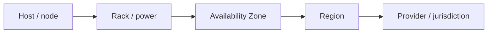

# Cloud architecture — foundations, failure domains, compute, tenancy, exit

Cloud already appears across this skill: FinOps in every HLD and SAD, cloud design patterns
in `structure.md` §3, the on-premises-to-cloud blueprint in `migration.md`, SLOs and RTO/RPO
in `operability.md`. What is missing is the layer those assume: **how the cloud estate itself
is structured, which failures the topology must survive, and how the compute and tenancy
model is chosen.** Read this file when:

- you set up or change a **landing zone**, account/subscription/project hierarchy, or
  guardrail policy;
- a reliability or residency driver forces a **topology decision**: multi-AZ, multi-region,
  multi-cloud, cells;
- you **choose a compute model** (VMs, managed containers, Kubernetes, functions, PaaS);
- you design a **multi-tenant SaaS** platform;
- **sovereignty, regulation or exit** is a driver (DORA, the EU Data Act, data residency).

**Altitude.** The landing zone, guardrails and cloud operating model are **enterprise**
altitude (principles `PR.xx`, TOGAF Phase D building blocks). A workload's region and
failure-domain topology is a **solution** or **software** decision, recorded as an ADR whose
driver is a `Q.xx` with an RTO, RPO or latency measure.

---

## 1. Well-Architected frameworks are review lenses, not architecture

AWS (six pillars: operational excellence, security, reliability, performance efficiency,
cost optimisation, sustainability), Azure (five pillars) and Google Cloud each publish a
Well-Architected or Architecture Framework. They are good **checklists** for an
architecture review (`methods.md` §11). They do not replace drivers: a pillar becomes part of
the design only when it is written as a `Q.xx` against an ISO/IEC 25010 characteristic with
a response measure. Reliability maps to reliability, performance efficiency to performance
efficiency, cost to the FinOps section, operational excellence to operability, security to
the threat model, and sustainability to a `Q.xx` measured in carbon intensity (§9).

---

## 2. The foundation — landing zone and account structure

**The account (AWS), subscription (Azure) or project (Google Cloud) is the strongest
isolation unit the provider gives you.** IAM, quotas, billing and blast radius all stop at
it. Use it deliberately:

- **one account per workload per environment** as the default, grouped in an organisational
  hierarchy (OUs, management groups, folders) that mirrors how policy differs, not the
  org chart;
- **guardrails as policy**: service control policies, Azure Policy, organisation policy,
  enforced centrally (regions allowed, encryption required, public access denied);
- **one identity provider**, federated, with no long-lived access keys; break-glass accounts
  that are monitored and tested;
- **central log archive and security tooling accounts** that workload teams cannot alter
  (this is the repudiation control in `threat_modeling.md`);
- **a network hub** (`network-architecture.md` §2) and an address plan for the whole estate;
- **mandatory tags** for owner, cost centre and environment, because FinOps allocation
  depends on them.

Use the provider's reference: AWS Control Tower and Landing Zone Accelerator, the Azure
Cloud Adoption Framework landing zones, or the Google Cloud enterprise foundations blueprint.
Customise them through ADRs rather than starting from a blank page.

---

## 3. Failure domains and topology

Name the failure the system must survive, then pick the cheapest topology that survives it.

| Failure to survive | Topology | Typical RTO | Relative cost |
|---|---|---|---|
| host or zone loss | **multi-AZ** in one region (the production default) | seconds to minutes | low |
| region loss, hours acceptable | **backup and restore** to a second region | hours | lowest of the multi-region options |
| region loss, tens of minutes | **pilot light**: data replicated, core services provisioned but scaled down | tens of minutes | moderate |
| region loss, minutes | **warm standby**: a smaller full copy running | minutes | high |
| region loss, near zero; or global latency | **multi-site active/active** | near zero | highest; data consistency becomes the hard problem |

The ladder follows the AWS disaster-recovery strategies. The cost rises steeply at each rung,
so the RTO and RPO in `operability.md` must justify the rung. A multi-region design is never
the default.

**Multi-cloud is rarely the right answer to resilience.** A second region from the same
provider gives most of the availability at a fraction of the cost and complexity. Legitimate
multi-cloud drivers are regulatory (concentration risk and exit plans under DORA, Regulation
(EU) 2022/2554, applicable since January 2025), sovereignty, or a clearly better service
elsewhere. Record the price: the lowest common denominator of services, two sets of skills,
and cross-provider egress.

---

## 4. Limiting blast radius

Availability Zones protect against infrastructure failure. Most outages come from **bad
deployments, bad configuration and overload**, which hit every zone at once. These patterns
address that:

- **Cell-based architecture.** Split the workload into identical, independent cells, each
  serving a subset of customers, behind a thin routing layer. A bad change or a poison
  request then hits one cell, not everyone. Cells also bound the size of every test
  environment and scaling problem (AWS Well-Architected, *Reducing the Scope of Impact with
  Cell-Based Architecture*). The router is the one shared component and must stay very
  simple.
- **Shuffle sharding.** Give each customer a random combination of a few workers out of many,
  so that one noisy or malicious customer shares its full set of workers with almost no one
  else (AWS Builders' Library).
- **Static stability.** Stay up on last-known-good state when a dependency or control plane
  fails (`network-architecture.md` §1). Pre-provision capacity for zone loss instead of
  launching it during the incident.
- **Constant work.** Systems that do the same amount of work whether healthy or failing
  (for example, pushing the full configuration every cycle instead of deltas) have no
  untested failure mode. Avoid bimodal behaviour.
- **Safe deployments.** Roll out per cell, zone and region, with bake time, automatic
  rollback on alarms and a one-box or canary stage. A deployment pipeline is a reliability
  mechanism and belongs in HLD §7.
- **Quotas and limits are constraints.** Service quotas, API rate limits and account limits
  are `C.xx` items. Check them for the peak scenario, including failover, when the second
  zone suddenly takes all the traffic.

---

## 5. Choosing the compute model

| Model | Buys | Costs / avoid when |
|---|---|---|
| **Virtual machines** | full control; any OS; licensing and legacy fit | you patch and scale the OS; lowest abstraction |
| **Managed containers** (ECS/Fargate, Cloud Run, Azure Container Apps) | container packaging without operating a cluster; scale to zero on some | fewer knobs than Kubernetes; provider-specific |
| **Kubernetes** (EKS, AKS, GKE, or self-managed) | portable platform API; a large ecosystem; a foundation for an internal platform | a platform that needs a team to run it; not an isolation boundary (`systems-architecture.md` §3) |
| **Functions** (Lambda, Azure Functions, Cloud Run functions) | no idle cost; scaling per request; little to operate | cold starts; execution time and payload limits; cost at sustained load; harder local testing |
| **PaaS / managed runtimes** | the provider runs the stack | least control; deepest lock-in |

Two rules keep the choice honest.

1. **Kubernetes is a platform for building platforms.** Choose it when several teams will
   share it, when portability is a real driver, or when the ecosystem is needed. For a few
   services and one team, managed containers do the job with far less operating effort.
2. **Serverless has a cost crossover.** Functions are cheapest for spiky or low traffic.
   At sustained load, the average concurrency is λ × duration (Little's Law,
   `quantitative-methods.md` §1). Price that concurrency as always-on containers or
   instances and compare it with the per-request bill. Record the crossover point in the
   FinOps section so the decision can be revisited when traffic grows.

---

## 6. Multi-tenancy for SaaS

| Model | Isolation | Cost per tenant | Fits |
|---|---|---|---|
| **Silo** — dedicated stack (account, VPC or database) per tenant | strongest; simple compliance story | highest; onboarding is provisioning | regulated or very large tenants |
| **Pool** — shared infrastructure, tenant ID on every row and request | enforced in code and data (row-level security, tenant-scoped credentials) | lowest | many small tenants |
| **Bridge** — mixed, for example pooled compute with siloed data | per layer | in between | a tiered product (premium tenants get silos) |

The model names come from the AWS SaaS Lens. Whichever model you choose, three things must be
designed explicitly:

- **Tenant isolation enforcement** — where it happens and how it is tested. The BOLA/IDOR
  red flag in `threat_modeling.md` §3 is the pooled model's main risk.
- **Noisy neighbours** — per-tenant quotas and rate limits, and cells or shuffle sharding
  (§4) for large tenant counts.
- **Tenant-aware operations** — metering, cost allocation per tenant, and per-tenant SLOs
  where contracts require them.

---

## 7. Shared responsibility and the managed-service trade

The provider is responsible for the security *of* the cloud; you are responsible for
security *in* it. The split moves with the service model: with IaaS you own the OS and up;
with PaaS and SaaS you own configuration, identity and data. Write the split for each managed
service into the threat model, because the gaps sit at the boundary.

A managed service buys operability at the price of control, unit cost and lock-in. **Lock-in
is a cost, not a sin.** Estimate the switching cost (data volume and egress, API surface,
retraining) in the ADR, compare it with what the managed service saves each year, and accept
it knowingly.

---

## 8. Sovereignty, residency and exit

- **Residency is not sovereignty.** Data stored in an EU region can still fall under a
  non-EU jurisdiction through the provider's ownership (the US CLOUD Act is the usual
  example). Where sovereignty is a driver, record which jurisdiction you need to exclude and
  choose between sovereign-cloud offerings, EU-owned providers, and technical controls.
- **Key control is the strongest technical lever.** Customer-managed keys in a key service
  you control, or external key management or hold-your-own-key arrangements, keep the
  provider from reading data without your cooperation. Confidential computing
  (`systems-architecture.md` §3) extends this to data in use.
- **Exit is now a legal requirement as well as a risk control.** The EU Data Act (Regulation
  (EU) 2023/2854) has applied since 12 September 2025. It requires providers to support
  switching, and switching charges, including egress fees for the switch, must be abolished
  from 12 January 2027. DORA requires financial entities to have exit strategies for critical
  ICT providers. Architecturally, exit means portable data formats, infrastructure as code,
  documented dependencies on proprietary services, and a tested export path for core data.
  Write the exit plan as a section of the SAD, not as a promise.

---

## 9. Platform engineering and sustainability

**An internal developer platform is a product.** It pays off once several stream-aligned
teams repeat the same infrastructure work. It offers paved roads (golden paths) for the
common cases and lets teams leave them when they need to (Team Topologies, Skelton and Pais).
Building a platform team for one or two delivery teams is over-engineering.

**Sustainability is measurable.** The Software Carbon Intensity specification (Green
Software Foundation; ISO/IEC 21031:2024) gives a rate per functional unit. Region choice,
utilisation and Arm-based instances are the main levers. When an organisation has carbon
targets, write them as a `Q.xx` with SCI as the response measure.

---

## 10. Legacy, modern, future

| Then | Now | Next |
|---|---|---|
| owned datacenters, virtualised with VMware | IaaS lift-and-shift, then managed services and containers | serverless and platform-first delivery for new work |
| one big shared account | landing zones with an account per workload | policy-as-code guardrails, automated account vending |
| DR as a document | multi-AZ by default, tested DR rungs | cells and continuous resilience testing (chaos engineering) |
| x86 instances | Arm instances for price-performance | accelerators (GPUs, TPUs, custom AI silicon) as a scarce, reserved resource and a `C.xx` |
| hyperscaler as the default | sovereign and regional offerings next to hyperscalers | portability enforced by regulation (Data Act, DORA) |
| trust the operator | customer-managed keys | confidential computing as a default for sensitive workloads |
| VMware estates | migration pressure after Broadcom's 2023 acquisition and licensing changes | replatforming VM estates to cloud-native virtualisation or containers |

---

## 11. How it lands in the artifacts

| Artifact | What goes in |
|---|---|
| **Enterprise architecture** | landing-zone design, account hierarchy, guardrail principles (`PR.xx`), approved regions, exit strategy for critical providers |
| **SAD / HLD** | region and failure-domain topology with its DR rung; compute model; tenancy model; shared-responsibility split in §8; quotas as `C.xx`; crossover and egress in §9 |
| **ADRs** | multi-region or multi-cloud, compute model, tenancy model, cell design, key management model, each managed service that carries lock-in |
| **Fitness functions** | policy-as-code checks on IaC (guardrails), DR restore drills against the stated RTO/RPO, quota headroom alarms, Infracost cost gate (`automation.md`) |

---

## 12. Over-engineering traps, cloud edition

- **Multi-cloud for resilience.** A second region of the same provider almost always gives
  more availability per euro.
- **Kubernetes for three services and one team.**
- **Active/active multi-region for an internal tool** whose users would accept an hour of
  downtime.
- **A platform team before there are teams to serve.**
- **Cells before there is a blast-radius problem.** Cells pay off at scale or for strict
  isolation; before that, multi-AZ and safe deployments carry the load.
- **The opposite mistake:** one shared production account for every workload, where any
  compromised role reaches everything.

---

## 13. Sources

| Topic | Source |
|---|---|
| Well-Architected frameworks | AWS Well-Architected Framework; Microsoft Azure Well-Architected Framework; Google Cloud Architecture Framework |
| Landing zones | AWS Control Tower / Landing Zone Accelerator; Microsoft Cloud Adoption Framework; Google Cloud enterprise foundations blueprint |
| DR strategies | AWS, *Disaster Recovery of Workloads on AWS* (whitepaper) |
| Cells, shuffle sharding, static stability, constant work | AWS Well-Architected, *Reducing the Scope of Impact with Cell-Based Architecture*; AWS Builders' Library |
| SaaS tenancy models | AWS Well-Architected SaaS Lens |
| Platform teams | M. Skelton, M. Pais, *Team Topologies* (2019) |
| Software carbon intensity | Green Software Foundation; ISO/IEC 21031:2024 |
| Regulation | Regulation (EU) 2022/2554 (DORA); Regulation (EU) 2023/2854 (Data Act) |
| Cloud definitions | NIST SP 800-145 (service and deployment models) |

Cross-references: networking and the hub — `network-architecture.md`; isolation boundaries
and confidential computing — `systems-architecture.md` §3; SLOs, RTO/RPO — `operability.md`;
availability maths — `quantitative-methods.md` §6; FinOps — HLD/SAD §9, `automation.md`;
on-premises to cloud — `migration.md` §2.
