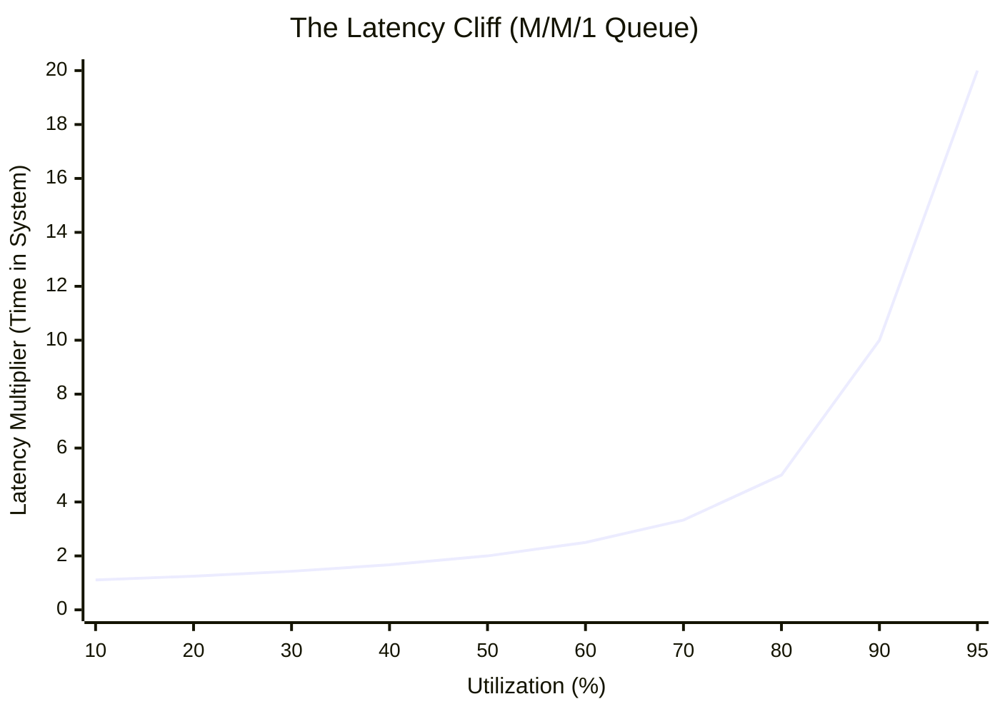
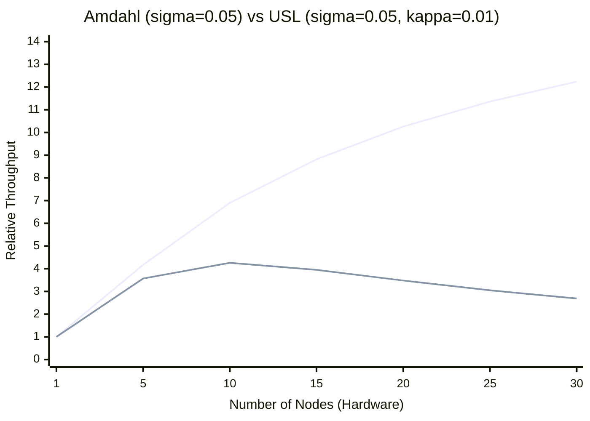
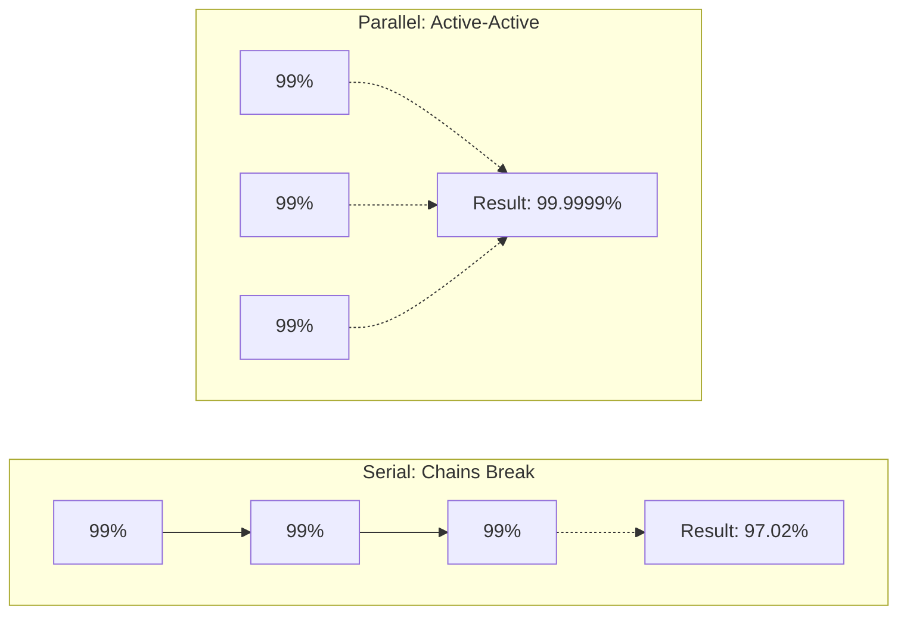
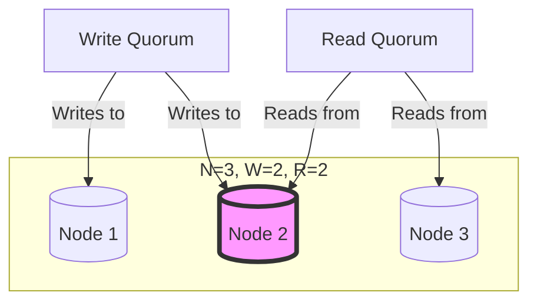

# Quantitative Methods & Statistical Sizing

A master architect does not rely on adjectives like "fast," "scalable," or "robust." They use math to bound uncertainty, size systems, and prove viability before code is written. This document provides the foundational quantitative methods to estimate capacity, predict latency under load, and validate SLAs. 

These methods operationalize the **ISO/IEC 25010:2023** (Performance Efficiency & Reliability) characteristics and must be measured according to **ISO/IEC 25023** (SQuaRE Quality Measures).

## 0. Using these models honestly

Every model in this file is an approximation with stated assumptions, and each one is wrong in some regime. What makes them useful is the same evidence discipline that governs everything else (`methods.md` §10): **state the assumption, check it against measurement, and label the output as a model result rather than an observation.**

*   **Name the assumption next to the number.** "p99 queueing delay is 11 s *under M/M/c with Poisson arrivals*" is a defensible claim. "p99 is 11 s" is not.
*   **Validate before you quote.** Arrival burstiness, service-time shape, and failure independence are all measurable. Where they have not been measured, the number is a hypothesis — mark it `TBD` or record it as a visible assumption, exactly as `methods.md` §10 requires.
*   **A model result is not a guarantee.** These formulas bound expectations *under their assumptions*; they do not prove an SLO will be met. The proof is a load test or a production measurement, wired up as a fitness function (`operability.md`).

Quantification replaces adjectives with numbers **and their error bars**. Swapping "scalable" for a confidently wrong figure is not an improvement — it is the same claim with better camouflage.

## 1. System Capacity (Little's Law & Erlangs)

Before sizing a system, you must distinguish between *Time in System* ($W$) and *Service Time* ($S$).

*   **Little's Law ($L = \lambda \times W$):** The long-term average number of items in a stable system ($L$) is the arrival rate ($\lambda$) multiplied by the total average time an item spends in the system ($W$, which includes queueing + service time).
*   **Offered Load in Erlangs ($E = \lambda \times S$):** To calculate the raw computational demand (how many concurrent workers you need *just* to do the work, ignoring queueing), multiply the arrival rate ($\lambda$) by the pure Service Time ($S$).

**Architectural Application:** If 500 requests arrive per second ($\lambda = 500$) and take exactly 50ms to process ($S = 0.05s$), your offered load is $E = 25$ Erlangs. You need an absolute minimum of 25 units of *real* concurrent capacity to keep up. A "unit" is whichever resource is actually scarce — a core for CPU-bound work, a connection the database can genuinely serve in parallel for DB-bound work — and not simply a thread: 25 threads on 8 cores is 8 units of capacity with 25 queue slots. Sizing above 25 dictates your queueing behavior.

## 2. Queueing Theory: Single Servers vs. Pools

Systems do not degrade linearly. As utilization ($\rho$) approaches 100%, waiting times explode asymptotically. However, the math differs completely depending on your topology.

### Single Server / Bottleneck (M/M/1 Queue)
Applies to a single worker, a single database write-lock, or a strictly sequential pipeline.

*   **Formula:** Time in system $W = S / (1 - \rho)$.
*   **The Latency Cliff:** At 50% utilization, latency is $2 \times S$. At 80% utilization, latency is $5 \times S$. At 90%, it is $10 \times S$.
*   **Architectural Rule:** A single server has no pooling to absorb variance, so it pays the full $1/(1-\rho)$ multiplier and the curve turns vertical fast — past ~70–80% a small traffic increase produces a large latency increase, and normal jitter is enough to cross it. Treat that band as the point where you must either shard the bottleneck or justify the utilization against an explicit latency budget, as in the pool case below.

### Multi-Server Pools (M/M/c Queue / Erlang C)
Applies where several workers draw from one shared queue: thread pools, connection pools, stateless service fleets (where $c$ is the number of workers).

*   **Check the assumptions before trusting the output.** M/M/c assumes Poisson arrivals, exponentially distributed service times, a single shared queue, and $c$ servers that each hold a full unit of capacity. Two violations are common in practice: arrivals that are bursty rather than Poisson (deadline-driven traffic usually is), and threads counted as servers when the work is CPU-bound — 30 threads on 8 cores is $c \approx 8$, not $c = 30$. Measure the arrival and service distributions before quoting any figure below.
*   **The Math (Erlang C):** $P_{wait} = \dfrac{\frac{a^c}{c!}\cdot\frac{1}{1-\rho}}{\sum_{k=0}^{c-1}\frac{a^k}{k!} + \frac{a^c}{c!}\cdot\frac{1}{1-\rho}}$, where $a = \lambda S$ (Erlangs) and $\rho = a/c$. The mean queueing delay is $W_q = P_{wait} \cdot S/(c - a)$ and total time in system is $W = S + W_q$. For $a = 20$ on $c = 30$ ($\rho = 67\%$), $P_{wait} = 2.5\%$ and $W_q = 0.0025\,S$ — here, and only at this utilization, $W \approx S$.
*   **Pooling efficiency is real but bounded.** At $\rho = 0.9$, the share of requests that queue falls as the pool grows: $c = 1$ → 90%, $c = 10$ → 67%, $c = 30$ → 47%, $c = 100$ → 22%. Pooling shrinks the penalty; it never converts a saturated pool into a fast one.
*   **Architectural Rule:** There is no universal "safe" utilization target. Compute the delay at the candidate $\rho$ and hold it against the SLO's tail budget, using $P(W_q > t) = P_{wait}\,e^{-(c-a)t/S}$ for the percentile. Worked example at $c = 30$, $S = 120$ s:

    | $\rho$ | $P_{wait}$ | mean $W_q$ | p99 queueing delay |
    | --- | --- | --- | --- |
    | 67% | 2.5% | 0.3 s | 11 s |
    | 80% | 17.3% | 3.5 s | 57 s |
    | 85% | 29.6% | 7.9 s | 90 s |
    | 90% | 47.1% | 18.9 s | 154 s |

    The p99 column is what an SLO is written against. Running this pool at 90% passes a 10-minute target and fails a 3-minute one — the ceiling follows from the budget, not from a rule of thumb.

## 3. Statistical Distributions: Bell Curves vs. Long Tails

Averages (arithmetic means) are dangerous in performance engineering. You must classify the distribution of your data.

### Normal Distributions (The Bell Curve)
*   **When to use:** For aggregated batch sizes, hardware metrics (CPU/RAM temperatures over time), or sums of independent random variables (Central Limit Theorem).
*   **The Math (Empirical Rule):** the familiar 68 / 95 / 99.7 figures are **two-sided** — they cover $\mu \pm k\sigma$. Capacity sizing is one-sided (only overshoot hurts), and the one-sided numbers are the relevant ones: $\mu + 1\sigma$ covers 84.1% of intervals, $\mu + 2\sigma$ covers 97.7%, $\mu + 3\sigma$ covers 99.87%.
*   **Architectural Rule:** Pick $k$ from the overflow you can afford, not from habit. Sizing at $\mu + 2\sigma$ accepts ~2.3% of intervals exceeding capacity; a 99.9% target needs $\mu + 3.1\sigma$. Test normality on the real metric (a QQ-plot will do) before relying on either figure — for skewed data these percentages are meaningless.

### Right-Skewed Distributions (Log-Normal / Power-Law)
*   **When to use:** System latency, network jitter, garbage collection pauses, DB query times. 
*   **The Flaw:** Applying Mean + $2\sigma$ to right-skewed data is mathematically invalid and will severely underestimate tail risk.
*   **Architectural Rule:** Never promise *latency* as an average or a standard deviation — state it as an empirical percentile (e.g. "p99 latency < 200 ms") in the ISO/IEC 25010 quality attribute (`Q.xx`) and its SLO. Which percentile is a business question, not a default: a nightly batch may only justify a p95, an interactive path may need p99.9. Averages are not banned outright — they are the correct input to capacity and cost maths (Little's Law, Erlangs, cost per request); they are simply not a promise about the tail. In distributed systems, tail-latency amplification means a p99 delay in one microservice often becomes the p50 delay for the end-user.

## 4. Limits of Scalability (Amdahl's Law & USL)

Adding more hardware does not yield infinite throughput. 

*(Both curves are plotted from the formulas below at the stated parameters. Top: Amdahl, climbing slowly toward its $1/\sigma = 20\times$ asymptote. Bottom: USL, peaking at $N^* = \sqrt{(1-\sigma)/\kappa} \approx 9.7$ nodes and degrading after it. These parameter values are illustrative — redraw the curves with your own fitted $\sigma$ and $\kappa$.)*

*   **Amdahl's Law (Contention):** Speedup is capped by the sequential portion of the task: $S(N) = \dfrac{N}{1 + \sigma(N-1)}$, with an asymptote of $1/\sigma$ as $N \to \infty$. If 5% of a transaction requires a sequential database lock, the ceiling is $1/0.05 = 20\times$ — but the approach is slow, and at $N = 30$ you have only reached $12.2\times$. The last nodes you add always buy the least.
*   **Universal Scalability Law (USL - Coherency):** Extends Amdahl with a *crosstalk/coherency* penalty: $X(N) = \dfrac{N}{1 + \sigma(N-1) + \kappa N(N-1)}$. Because the $\kappa$ term grows quadratically, throughput peaks at $N^* = \sqrt{(1-\sigma)/\kappa}$ and *decreases* beyond it — the overhead of nodes coordinating with each other (replication, cluster state sync) eventually outweighs the added capacity. Fit $\sigma$ and $\kappa$ by regression on measured throughput at several node counts; an unfitted USL curve is decoration, not evidence.
*   **Architectural Rule:** Use USL to push back on "just add more servers." Resolve contention (Amdahl) and coherency (USL) via architecture (e.g., sharding, CQRS, eventual consistency).

## 5. Combinatorial Complexity (Scheduling & Optimization)

For constraint solving (e.g., Timefold/OptaPlanner):
*   **The Search Space:** Understand how the problem scales (e.g., assigning $N$ tasks to $M$ resources scales at $M^N$ or $N!$).
*   **Search-space size does not settle the choice.** A huge space is not proof that an exact method is too slow: branch-and-bound, constraint propagation and MIP solvers prune almost all of it, and production instances are far more structured than the combinatorial worst case. What settles it is a measurement — run an exact solver and a meta-heuristic against a representative sample of real instances (including the largest observed) and compare solution quality as a function of elapsed time.
*   **Architectural Rule:** Whichever method wins, make the time bound explicit in the `Q.xx` scenario and make the solver **interruptible** — able to return the best solution found so far when the budget expires. That requirement is identical for exact and heuristic approaches, and it is what converts an open-ended search into a bounded ISO 25010 time-behaviour property.

## 6. Reliability & Redundancy (Uptime Math)

System availability (uptime) must be mathematically proven, not guessed.

### Serial Dependencies (Chains Break)
If your system requires Service A *and* Service B to succeed, you multiply their availabilities.
*   **The Math:** $A_{total} = A_1 \times A_2 \times \dots \times A_n$ — **valid only when the failures are independent.**
*   **Example:** If an API gateway (99.9%), an Auth service (99.9%), and a Database (99.9%) must all be up, total theoretical uptime is $0.999 \times 0.999 \times 0.999 \approx 0.997$ (99.7%).
*   **The Shared-Domain Caveat:** a shared switch, region or control plane correlates failures, so the product above is optimistic. It does not make them identical, though — $\min(A_1, A_2)$ is right only if the components have no independent failure modes at all, which is almost never true of real software. Decompose each component into a shared-domain factor and an independent factor, $A_{total} = A_{shared} \times \prod_i A_i^{ind}$, and be explicit about which is which. Take three services that each fail independently 0.1% of the time, all sitting in one region that is itself 99.9% available: the correct answer is $0.999 \times 0.999^3 \approx 99.60\%$. It is bracketed by two wrong ones — $\min() \approx 99.9\%$, which ignores the independent failures, and naive full independence ($0.998^3 \approx 99.40\%$), which charges for the region's outage three times over.
*   **Architectural Rule:** Adding synchronous microservices strictly *decreases* system availability. You must mitigate this via architectural decoupling (queues, caching, fallbacks).

### Parallel Redundancy (Active-Active)
If your system can survive as long as *at least one* node is up, you calculate the probability of total failure.
*   **The Math:** $A_{total} = 1 - ((1 - A_1) \times (1 - A_2))$
*   **The Cascading Failure Trap (Conditional Probability):** This formula assumes failures are strictly independent. However, if Node 1 fails, Node 2 instantly receives $2\times$ traffic. Due to Queueing Theory (Section 2), if this spike pushes Node 2 past 80% utilization, Node 2 will likely crash as well. The probability of Node 2 failing is conditionally much higher.
*   **Architectural Rule:** You cannot claim the 99.99% uptime of redundant math unless you mathematically prove the surviving nodes have the capacity to absorb the failover load without crossing the latency cliff.

## 7. Distributed Systems Consistency (Quorum Math)

In distributed databases (Cassandra, DynamoDB, MongoDB), the CAP theorem dictates tradeoffs between consistency and availability during network partitions. You manage this mathematically via Quorums.

*   **The Formula:** $R + W > N$
*   $N$: Total number of replicas (Replication Factor).
*   $W$: Write Quorum (number of nodes that must acknowledge a write).
*   $R$: Read Quorum (number of nodes that must respond to a read).

**Architectural Rules:**
1.  **Quorum Intersection (The "Cassandra Myth"):** Ensuring $R + W > N$ uses the Pigeonhole Principle to guarantee the read set and write set overlap. **This does NOT guarantee Strong Consistency (Linearizability).** Intersection only guarantees that a reader touches at least one replica holding the latest acknowledged write; it does not order concurrent operations in real time. Causality tracking (vector clocks) detects conflicting versions but still does not deliver linearizability — that requires consensus (Paxos/Raft, as in Cassandra's lightweight transactions) or a globally synchronised clock (TrueTime), each paying extra round trips. Furthermore, if a write partially fails (e.g. 1 out of 3 nodes updated before crash), a subsequent read might return this uncommitted "dirty" data.
2.  **Preventing Split-Brain ($W > N/2$):** To prevent two concurrent writes from succeeding on disjoint halves of a partitioned cluster, your write quorum MUST be a strict majority. E.g., if $N=4, W=2, R=3$, $R+W>N$ is met, but $W=2$ is not a majority. This allows concurrent data corruption.
3.  **Balanced / Standard:** $W > N/2$ AND $R + W > N$ (e.g., $N=3, W=2, R=2$). This is the industry standard. It allows 1 node to fail while preserving reads and writes, maintaining intersection and preventing split-brain.
## 8. Probabilistic Data Structures (Trading Accuracy for Memory)

In high-throughput systems, exact answers to certain queries (counting unique visitors, checking whether an item exists) cost memory proportional to the data, because every key has to be stored. Trading a bounded error for a much smaller footprint is often the right deal — but the two structures below scale very differently, and conflating them is how sizing goes wrong.

*   **Bloom Filters (Existence):** Tells you if an element is *definitely not* in a set, or *probably* in a set.
    *   **The Math:** at a target false-positive rate $p$, the optimal filter needs $m = -n\ln p/(\ln 2)^2$ bits for $n$ elements, using $k = (m/n)\ln 2$ hash functions. **Memory is linear in $n$, not constant** — the win is the constant factor: 9.6 bits per element at $p = 1\%$, whatever the elements themselves weigh. A million keys costs ~1.2 MB; a billion costs ~1.2 GB.
    *   **Architectural Rule:** Use Bloom Filters in front of expensive database reads. If the filter says "no", you skip the query — at $p = 1\%$ you still avoid 99% of the lookups for absent keys. Size $m$ from the *expected* $n$: a filter loaded well past its design capacity degrades silently, its false-positive rate climbing toward 100%.
*   **HyperLogLog (Cardinality):** Estimates the number of unique elements in a massive stream (e.g., unique IP addresses per day).
    *   **The Math:** the relative standard error is $\approx 1.04/\sqrt{m}$ for $m$ registers, and the footprint depends on $m$ alone — 2,048 six-bit registers (~1.5 KB) gives ~2.3% error whether the stream holds a thousand distinct values or a billion. This is the structure whose memory genuinely is near-constant in cardinality, where an exact `HashSet` would grow without bound.
    *   **Architectural Rule:** Never use `SELECT COUNT(DISTINCT ...)` on high-velocity analytical data if an approximation suffices. Use HLL — and report its answers with the error band ("12.4M ± 2.3%"), never as an exact count.

## 9. Statistical Sampling (Observability & FinOps)

Logging 100% of requests in a high-volume microservices architecture generates petabytes of data, causing telemetry costs (Datadog/Splunk) to exceed compute costs.

*   **Dynamic / Probabilistic Sampling:** Instead of logging everything, you keep a subset chosen by a known rule — known, so that what you keep can still stand in for what you dropped.
*   **The Math:** to *observe at least one* instance of a pattern present in 1% of requests, you need $n$ such that $0.99^n \le 0.01$, i.e. 459 sampled traces — a negligible fraction of a 10,000 req/s stream. Note precisely what that number is: a detection probability, not a measurement precision. *Estimating* that pattern's rate to within ±0.1% is a different and much larger calculation.
*   **Sampling on the outcome biases every unweighted rate computed from the result.** Keeping 100% of errors and 1% of successes is the standard tail-sampling policy and a sound one — but the retained set is deliberately not representative. At a true error rate of 0.1%, errors make up 9.1% of what you kept; reading an error rate straight off sampled traces overstates it by ~90×.
*   **Architectural Rule:** Keep the two jobs apart. **SLIs come from complete counters and histograms** — cheap, pre-aggregated, unsampled — and that is what proves an SLO. **Traces are for diagnosis**, and there you sample hard: head-based for volume, tail-based to guarantee errors and slow requests survive (`operability.md`). If you must estimate a population rate from sampled traces, weight each retained trace by the inverse of its inclusion probability; OpenTelemetry's consistent probability sampling propagates that weight, which is what makes the correction possible at all.

## 10. Monte Carlo Simulations (Cost & Project Forecasting)

When inputs are highly uncertain (e.g., "We expect between 10k and 50k users", or "Migration will take 2 to 6 months"), using single-point averages produces dangerously brittle budgets and timelines.

*   **The Method:** Instead of calculating `Average Users * Average Cost`, a Monte Carlo simulation runs the calculation 10,000 times, pulling random values from the defined probability distributions (e.g., a PERT distribution for time estimates). Model the *dependencies* as well — inputs that move together (traffic driving both compute and egress) must be correlated in the simulation, or the resulting spread comes out far too narrow.
*   **The Output:** a distribution of outcomes, summarised by its quantiles: "under this model, 85% of simulated months land below $4,000". That is a **predictive quantile conditional on the assumed inputs** — not a confidence interval, and not a statement about the true bill. Three separate uncertainties hide behind that one figure: simulation error (shrinks as you add runs, usually negligible at 10,000), parameter uncertainty (are the input ranges right?), and model uncertainty (is the cost formula right at all?). Only the first is fixed by running longer.
*   **Architectural Rule:** For significant architectural transitions (`transition-architecture.md`) or large FinOps commitments, refuse to give a single number. Publish quantiles (P50/P80/P95), state the input distributions and correlations they rest on, and run a sensitivity analysis identifying which input actually drives the answer — that input is where the next hour of estimating effort belongs.