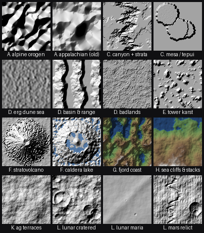
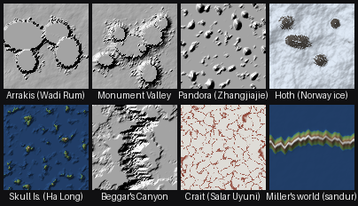

# Archetype compositions

The renderable **archetypes** from `references/20-archetypes.md` (the master enumeration is
`references/00-index.md`), each assembled from the verified Legal-Order blocks and rendered on a
~1.9 km tile. Regenerate with `python archetypes.py`.

These are the **province** altitude — *one recognisable place* — between `graph_demo.py` (the
generic baseline pipeline) and a single landform. The whole lesson of `20-archetypes.md` is that
these are **not new algorithms**: each is the same Legal Order with the dominant agent switched.
Adapt, don't paste — illustrative *kinds* of place at one small extent, not scale models. Every
archetype is **tier L** (a composition); the components keep their cited tiers, the assembly invents
no citation.

## Rendered (16, by tile — row, col)

| Tile | Group · archetype | The switch (diff from baseline) | `09` signature |
|---|---|---|---|
| 0,0 | A · **alpine orogen** | fbm+ridged uplift → droplet fluvial → talus to repose | dissected ridges, dendritic valleys; slopes toward repose |
| 0,1 | A · **appalachian (old)** | low uplift, HEAVY erosion, subdued relief | low relief, gentle slopes — a *mature* hypsometry (gentler than alpine) |
| 0,2 | C · **canyon + strata** | plateau + one incised meandering trunk, then **terrace** on walls | deep trunk in high ground (high HI); stepped benches |
| 0,3 | C · **mesa / tepui** | resistant caprock → flat top, steep cliffs | bimodal elevation (top vs base); flat summit |
| 1,0 | D · **erg dune sea** | dominant agent → **aeolian** (Werner slab CA) | transverse dunes ⟂ wind; low relief; slopes ≤ sand repose |
| 1,1 | D · **basin & range** | parallel fault-block ranges + flat sediment basins / playa | alternating ranges & flat floors; mostly low ground (low HI) |
| 1,2 | D · **badlands** | soft flat strata, densely dissected | very high drainage density; stepped strata; knife-edge divides |
| 1,3 | E · **tower karst** | dominant agent → **dissolution** (lower ∝ fracture) | residual towers over a low plain (bimodal, low HI) |
| 2,0 | F · **stratovolcano** | radial cone + summit crater, radial gullies | near-radial symmetry; a single central high |
| 2,1 | F · **caldera lake** | collapsed edifice (fractured flanks, jagged rim) holding a lake | an irregular rim + a resurgent-dome island in enclosed water (à la Crater Lake) |
| 2,2 | G · **fjord coast** | glacial U-troughs, flooded to sea level | long narrow drowned inlets reaching the ocean edge |
| 2,3 | H · **sea cliffs & stacks** | wave attack (coastal-retreat sim) | a cliff at the waterline fronting a wave-cut bench |
| 3,0 | K · **ag terraces** | contour agriculture: many level benches | strongly stepped elevation; benches ⟂ slope |
| 3,1 | L · **lunar cratered** | regime switch: fluvial **OFF**, impacts dominate | a saturated field of overlapping pits; no drainage |
| 3,2 | L · **lunar maria** | basaltic flood + wrinkle ridge + sparse craters | very low relief, a flat mature surface with a sinuous ridge |
| 3,3 | L · **mars relict** | craters + a relict outflow channel + aeolian ripples | craters AND a dry sinuous valley AND dune texture together |

The numbers `archetypes.py` prints (relief, 99th-percentile slope, hypsometric integral, depression
storage) are those signatures made quantitative — the by-eye montage's numeric partner, and what
`tests/test_archetypes.py` asserts. The plainest assertion matters most: **no composition blows up**
— the guard that caught a real thermal-erosion checkerboard instability on the alpine razor ridges
(fixed by lowering the talus step's `factor`).

## Not rendered — and why (the honest other 13 of the 29 blueprints)

"Everything the skill mentions that **can** be rendered" excludes three categories:

- **A variant of one already shown** (same pipeline, different regime knob): *Himalayan* (a
  higher-relief alpine), *Ardèche karst gorge* (an entrenched-meander canyon), *Zhangjiajie pillar
  forest* (≈ tower karst), *lunar-maria-like flood basalt / Iceland* columnar rift (the plain is
  the maria tile; columnar jointing is centimetre-scale).
- **Not a bulk-relief landform** — the story is a profile, water, hydrothermal activity, or a
  material mosaic, which a plan-view heightfield thumbnail can't carry: the **waterfalls** (Group B —
  Niagara caprock, Victoria fault gorge, Yosemite hanging valley: a *knickpoint* is a local step in
  the long profile), the **geothermal field** (Yellowstone — springs/geysers), **field-mosaic
  farmland & earthworks** (Group K — a texture/material overlay), **salt flat** (Uyuni — near-zero
  relief), **desert oasis** (a spring in a small basin).
- **A process `reference-impl` does not implement** (so it would be faked, not composed): the
  **coral reef & atoll** (biogenic reef growth) and the **inland delta** (distributary avulsion).

Where a place's real number would be nice and isn't verified, it is omitted — `00`'s citation
discipline does not relax because the subject is famous. The deeper treatments live in the chapters:
glacial `12`, coastal `12`, karst/volcanic/impact `11`/`19`, arid `16`, anthropogenic `20` Group K.

## Screen worlds — fictional planets as re-dressed archetypes

`python screen_worlds.py` — the "Screen worlds" section of `20-archetypes.md` made runnable: a
film's planet is never new physics, it is **an Earth archetype in costume, and the filming location
names the archetype**. Each tile is one of the compositions above, re-dressed (render / sea level /
material), so the point is *decompose the fiction, don't invent a recipe*.

| Tile | World *(filming location)* | Decomposes to |
|---|---|---|
| 0,0 | **Arrakis** *(Wadi Rum)* | extreme contrast — flat sand plains + sheer eroded sandstone **jebels** |
| 0,1 | **Monument Valley** *(US-163)* | the **mesa** end-member — plateau consumed to a butte→spire series |
| 0,2 | **Pandora** *(Zhangjiajie)* | **tower karst** pillars, one impossible edit (float them) |
| 0,3 | **Hoth** *(Finse / Hardangerjøkulen, Norway)* | **glacial** ice-sheet, sea off — ice + rock nunataks |
| 1,0 | **Skull Island** *(Ha Long Bay)* | **tower karst DROWNED** — the sea floods a fanged island coast |
| 1,1 | **Beggar's Canyon** *(Maguer Gorge, Tunisia)* | a **relict canyon** — carved by *vanished* water, like Mars |
| 1,2 | **Crait** *(Salar de Uyuni)* | the **evaporite playa** — a white crust over red substrate (a material stack, `08`) |
| 1,3 | **Miller's world** *(Icelandic sandur)* | a **braided outwash plain** flooded ankle-deep → a shoreless ocean + one tidal wave |

The re-dressing is the only difference: Arrakis reuses `erg`, Beggar's Canyon reuses `canyon`, Skull
Island is `tower karst` with the sea raised over the plain, Hoth/Crait swap the render for snow /
salt-crust materials. One substrate, one hydrology, per the skill — the fiction is set dressing.
Same tier-L discipline, same "nothing blows up" test guard (`tests/test_screen_worlds.py`).
