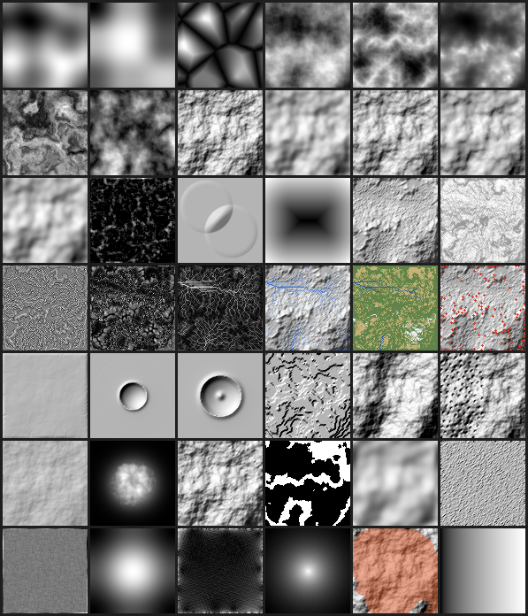

# Visual reference gallery

Every algorithm in `reference-impl`, rendered on **one shared seed-0 base** so a panel's look
is the *operator*, not the input. Regenerate deterministically with `python gallery.py`.

This is the **by-eye complement** to the quantitative oracles in `tests/` — not a replacement.
The `09` doctrine holds: the oracle decides correctness, the eye catches what a number didn't
think to check, and **neither is sufficient alone**. Two cautions this gallery makes concrete:

- **Renders normalise per view.** A hillshade of a 300 m terrain and a numerically blown-up
  70,000,000 m terrain look identical. So `gallery.py` also prints a **numeric range trace** and
  flags any field whose relief is absurd or non-finite — the check the eye cannot make. (That
  trace caught a real one: stream power run at the wrong extent silently explodes; the thumbnail
  looked fine.)
- **Match the backbone to the extent.** The eroded base uses **droplet** (the <2 km rule from
  `SKILL.md`); stream power is shown separately in its **continental** regime. Swapping them is
  the explosion above.

## Panel layout (row, col), and the `09` signature to look for

| | Panel | Look for |
|---|---|---|
| 0,0–0,5 | perlin · value · worley · fbm · ridged · hybrid | smooth gradient blobs (perlin); visible lattice (value); cell walls (worley F2−F1); fractal detail (fbm); sharp ridgelines (ridged); rough peaks / smooth plains (hybrid) |
| 1,0–1,1 | warp · curl \|v\| | flow-like swirling (warp); smooth divergence-free field (curl) |
| 1,2–1,5 | BASE · gaussian · median · bilateral | the shared base; blurred everything (gaussian); spike gone, edges kept (median); cliffs sharp, slopes smoothed (bilateral) |
| 2,0–2,3 | perona-malik · tophat · smin · SDF box | edge-preserving smooth (PM); small features isolated, mostly dark (tophat); two cones merged with **no crease** (smin); clean signed distance bands (SDF) |
| 2,4–2,5 | eroded · slope shade | dendritic drainage texture (eroded droplet+thermal); steep=dark, capped near repose (slope) |
| 3,0–3,5 | curvature · AO · TWI · flow · materials · scatter | ridge/valley divergence (curvature); valleys dark (AO); bright channel network (TWI); blue rivers reaching edges (flow); partitioned water/rock/sand/grass/snow (materials); boulders on steep ground (scatter) |
| 4,0 | streampower (200 km) | concave, connected drainage at the **correct** scale — bounded relief |
| 4,1–4,5 | crater simple · crater complex · terrace · fold · karst | bowl + **raised rim** (simple); bowl + **central peak** (complex); flat treads + risers (terrace); folded ridge train (fold); sinkhole pits on the **left (soluble) half only** (karst) |
| 5,0–5,3 | lava · glacier H · coastal · tides | ⚠ **illustrative** (invariant-checked only): a lava tongue from the vent; a spreading ice cap; a retreated coast; the intertidal band |
| 5,4–5,5 | diffusion (Culling) · dunes (Werner) | smoothed relief; a wind-transverse dune field |
| 6,0–6,2 | pipe water depth · flexure (200 km) · wind speed | water routed into the lows; the flexural deflection bowl under a mountain load; terrain-following wind magnitude |
| 6,3–6,5 | tephra fallout · PDC inundation · seafloor age–depth | radial thinning from the vent; the pyroclastic-flow footprint (red) over hillshade; bathymetry deepening with crustal age |

Panels 30–33 are the `sims_illustrative.py` tier — sketches you can watch move, **not** verified
numbers. Everything else is oracle-backed (`tests/`), and the ranges printed by `gallery.py`
must all read sane (no `SUSPECT`). The gallery now covers **every** algorithm module in
`reference-impl` (age–depth and avulsion have no natural heightfield rendering; age–depth is
shown as a bathymetry gradient, avulsion is a scalar criterion and is omitted).
