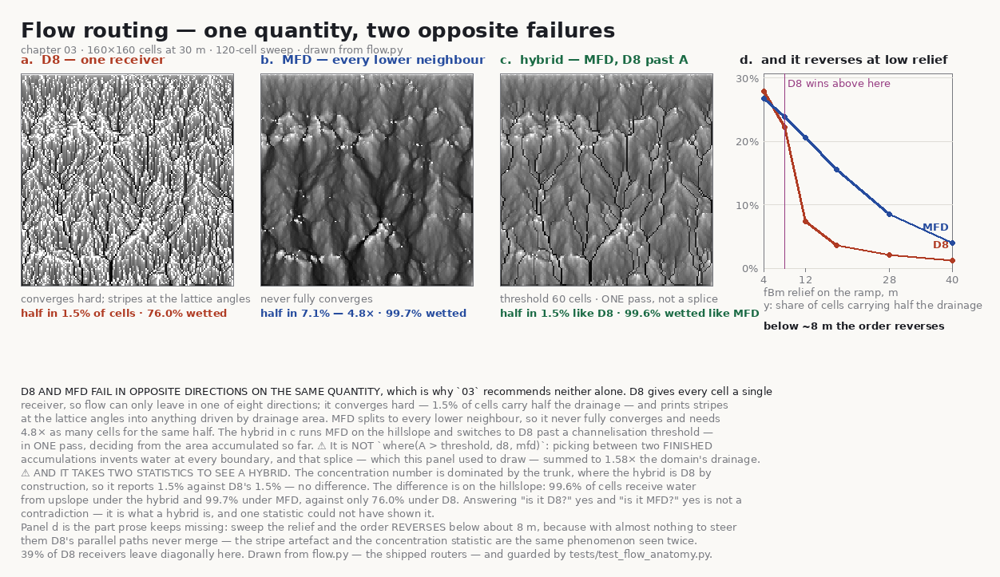
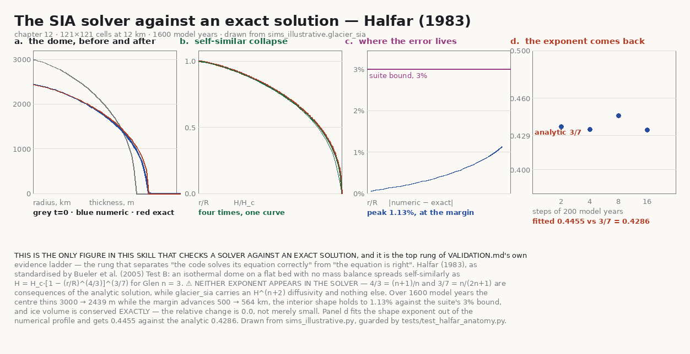

---
# --- okf v0.2, written by tools/okf_apply.py -----------------------
type: Evidence
title: Visual reference gallery
description: The committed visual reference montages and the script that regenerates each one.
tags: [terrain, figures]
status: stable
generated: { by: process:claude-code, at: 2026-07-28T21:24:36Z }
# --- end okf v0.2 ----------------------------------------------------
---
# Visual reference gallery


Every algorithm in `reference-impl`, rendered on **one shared seed-0 base** so a panel's look
is the *operator*, not the input. Regenerate deterministically with `python gallery.py`.

This is the **by-eye complement** to the quantitative oracles in `tests/` — not a replacement.
The `09` doctrine holds: the oracle decides correctness, the eye catches what a number didn't
think to check, and **neither is sufficient alone**. Two cautions this gallery makes concrete:

- **Renders normalise per view.** A hillshade of a 300 m terrain and a numerically blown-up
  70,000,000 m terrain look identical. So `gallery.py` also prints a **numeric range trace** and
  flags any field whose relief is absurd or non-finite — the check the eye cannot make. (That
  trace caught a real one: stream power run at the wrong extent silently explodes; the thumbnail
  looked fine.)
- **Match the backbone to the extent.** The eroded base uses **droplet** (the <2 km rule from
  `SKILL.md`); stream power is shown separately in its **continental** regime. Swapping them is
  the explosion above.

## Panel layout (row, col), and the `09` signature to look for

| | Panel | Look for |
|---|---|---|
| 0,0–0,5 | perlin · value · worley · fbm · ridged · hybrid | smooth gradient blobs (perlin); visible lattice (value); cell walls (worley F2−F1); fractal detail (fbm); sharp ridgelines (ridged); rough peaks / smooth plains (hybrid) |
| 1,0–1,1 | warp · curl \|v\| | flow-like swirling (warp); smooth divergence-free field (curl) |
| 1,2–1,5 | BASE · gaussian · median · bilateral | the shared base; blurred everything (gaussian); spike gone, edges kept (median); cliffs sharp, slopes smoothed (bilateral) |
| 2,0–2,3 | perona-malik · tophat · smin · SDF box | edge-preserving smooth (PM); small features isolated, mostly dark (tophat); two cones merged with **no crease** (smin); clean signed distance bands (SDF) |
| 2,4–2,5 | eroded · slope shade | dendritic drainage texture (eroded droplet+thermal); steep=dark, capped near repose (slope) |
| 3,0–3,5 | curvature · AO · TWI · flow · materials · scatter | ridge/valley divergence (curvature); valleys dark (AO); bright channel network (TWI); blue rivers reaching edges (flow); partitioned water/rock/sand/grass/snow (materials); boulders on steep ground (scatter) |
| 4,0 | streampower (200 km) | concave, connected drainage at the **correct** scale — bounded relief |
| 4,1–4,5 | crater simple · crater complex · terrace · fold · karst | bowl + **raised rim** (simple); bowl + **central peak** (complex); flat treads + risers (terrace); folded ridge train (fold); sinkhole pits on the **left (soluble) half only** (karst) |
| 5,0–5,3 | lava · glacier H · coastal · tides | ⚠ **illustrative** (invariant-checked only): a lava tongue from the vent; a spreading ice cap; a retreated coast; the intertidal band |
| 5,4–5,5 | diffusion (Culling) · dunes (Werner) | smoothed relief; a wind-transverse dune field |
| 6,0–6,2 | pipe water depth · flexure (200 km) · wind speed | water routed into the lows; the flexural deflection bowl under a mountain load; terrain-following wind magnitude |
| 6,3–6,5 | tephra fallout · PDC inundation · seafloor age–depth | radial thinning from the vent; the pyroclastic-flow footprint (red) over hillshade; bathymetry deepening with crustal age |
| 7,0–7,2 | crater size+angle · Voellmy runout · MFD accumulation | circular cavity + **downrange**-biased ejecta at 20° (`crater.py` — the size+angle model, vs the basic Pike crater at 4,1); the failed-mass track down a steep cone (red); dispersive multi-flow drainage (vs D8 at 3,3) |
| 7,3–7,5 | anticline · erosional rebound · scatter jittered-grid | a single up-fold ridge (vs the fold **train** at 4,4); isostatic rebound concentrated where erosion cut deepest; a stratified/tileable point set (vs blue-noise density scatter at 3,5) |

Panels 30–33 are the `sims_illustrative.py` tier — sketches you can watch move, **not** verified
numbers. Everything else is oracle-backed (`tests/`), and the ranges printed by `gallery.py`
must all read sane (no `SUSPECT`).

## What this gallery covers — and the twelve modules it does not

⚠️ **This section used to claim a field-renderable panel for *every* algorithm module in
`reference-impl`, and that was false.** Measured, 2026-08-30:

```
$ python3 -c "import gallery; print(len(gallery.panels()))"
48
$ python3 -c "import ast,pathlib; s=ast.parse(pathlib.Path('gallery.py').read_text()); \
  print(sorted({a.name for n in ast.walk(s) if isinstance(n,ast.Import) for a in n.names}))"
['analysis', 'analytic', 'crater', 'diffusion', 'dunes', 'erosion_droplet', 'erosion_pipe',
 'erosion_streampower', 'erosion_thermal', 'flow', 'isostasy', 'landforms', 'noise', 'numpy',
 'ops_filters', 'render', 'runout', 'scatter', 'sims_illustrative', 'winds']
```

**48 panels, drawn from 19 `reference-impl` modules** (the 20 imports minus `numpy`; one of the 19,
`render`, is the renderer rather than an operator), against **44 `.py` files on disk** — 25 of which
`gallery.py` never imports. The honest claim is the narrower
one: *the gallery covers the noise / ops / erosion / analysis / geological spine — the modules
`gallery.py` imports — on one shared seed-0 base.* It is **a** contact sheet, not **the** contact
sheet, and the wider coverage lives in `capability_grid.png` and in the anatomy figures below.

**The twelve modules with no panel here.** Every one was called and returns a **finite 2-D array**,
so "no natural heightfield image" is not the reason for any of them — that was the other half of
the false claim. Where the reason is simply that nobody drew it, this table says so.

| Module | 2-D field it returns (verified `ndim=2`) | Drawn instead in | Why it is not here |
|---|---|---|---|
| `braided` | `braided_river` → `(bed, Q)` | `capability_grid.py:445` | **nobody drew it here** |
| `meander` | `meander_belt` → `height` / `water` / `channel` | `capability_grid.py:233` | **nobody drew it here** |
| `snow` | `snow_step` → snow depth | `capability_grid.py:383` | **nobody drew it here** |
| `aeolian` | `exner_step`, `yardang` → bed | `capability_grid.py:393` | **nobody drew it here.** The dunes at 5,5 are `dunes.py` (Werner slab CA) — a *different* module |
| `shallow_water` | `simulate` → `depth` / `discharge` / `speed` | `capability_grid.py:207`, `hero.py` | **nobody drew it here.** The pipe water depth at 6,0 is `erosion_pipe`, not this |
| `tectonics` | `fault_scarp`, `fault_weakness`, `plate_uplift` | `capability_grid.py:413,424` | **nobody drew it here** |
| `glacier` | `glacier_carve` → `(bed, H, abrasion)` | `capability_grid.py:368` | **nobody drew it here.** ⚠️ **Panel 31 is `sims_illustrative.glacier_sia` — a different module**: ice flow only, no bed abrasion |
| `hydrology` | `water_surface`, `water_depth` | `hero.py:191` | **nobody drew it here.** ⚠️ `water_over_land` was listed here and does **not** belong in this column: it returns float **RGB**, `ndim=3` — a compositing stage, not a field |
| `heightfield_io` | `load_heightfield`, `window` → an imported DEM | `capability_grid.py:460` | real reason: it is I/O, and the gallery's premise is one shared **synthetic** base |
| `hex_grid` | `laplacian6`, `hessian6`, `gradient6` | `hex_anatomy.png` | real reason: a **different lattice** — it cannot share the square seed-0 base every panel here is built on |
| `placement` | `disc`/`rect`/`capsule`/`path_mask` coverage masks | inside every `landforms` panel (`landforms.py:12,129,…`) | real reason: a transform/masking layer, visible through its consumers rather than as an operator of its own |
| `empirical_dem` | `our_terrain` | — | real reason: a measurement/fetch harness (pulls SRTM over the network), not an operator; it is also the one module here with no `tests/test_*.py` of its own. ⚠️ `metrics` was listed here and does **not** belong in this column: it returns a tuple of three scalars `(hi, θ, hack)` |

The other **13** of the 25 un-imported files are not algorithm modules at all — they are the figure,
demo and harness scripts themselves: `gallery`, `capability_grid`, `archetypes`, `hero`,
`screen_worlds`, `graph_demo`, `crater_demo`, `conftest`, and the five `*_anatomy` scripts
(`hex_`, `anisotropy_`, `flow_`, `halfar_`, `crater_`). 19 imported + 12 undrawn operators + 13
scripts = the 44 files on disk, which is the whole accounting.

**Genuinely un-panellable, and this part of the old list was right:** **scalar / 1-D diagnostics** —
the energy-cone runout *distance* `L = Hc/μ` (shown instead as the PDC inundation footprint it
drives, at 6,4), the river **superelevation** and **avulsion** criteria, and the GDH1 seafloor
variant (visually identical to the HSC panel at 6,5) — plus the many `ops_filters` toolbox
primitives (SDF/morphology/warp/blend) shown by representative rather than exhaustively.

Nothing here is an argument for adding twelve panels. It is the map of what the montage does and
does not evidence, which is the thing a reader needs before trusting it as coverage.

## Labelled anatomy figures

Separate from the panel grid above: **diagrams and measured comparisons**, not field renders. The
gallery answers "what does this operator look like"; these answer "what is the geometry the chapter
is describing" and "does the shipped solver actually match its benchmark" — for the **four** places
where the prose was carrying more than prose should. Each regenerates deterministically and each is
guarded, because a figure that drifts from its text is worse than no figure.

| Figure | Regenerate | Guard | Chapter that uses it |
|---|---|---|---|
| `hex_anatomy.png` | `python hex_anatomy.py` | `tests/test_anatomy_figures.py` | `26` — `references/26-hexagonal-grids.md`, line 24 |
| `anisotropy_anatomy.png` | `python anisotropy_anatomy.py` | `tests/test_anatomy_figures.py` | `09` — `references/09-verification.md`, line 482 |
| `flow_anatomy.png` | `python flow_anatomy.py` | `tests/test_flow_anatomy.py` | `03` — `references/03-flow-routing.md`, line 249 |
| `halfar_anatomy.png` | `python halfar_anatomy.py` | `tests/test_halfar_anatomy.py` | `12` — `references/12-glacial-coastal.md`, line 123 |

⚠️ **This section said "the two places" and listed only the first two rows — `flow_anatomy` and
`halfar_anatomy` ship, are embedded in their chapters, and each has its own dedicated test file.**
Verified 2026-08-30:

```
$ python3 -m pytest -q tests/test_flow_anatomy.py tests/test_halfar_anatomy.py tests/test_anatomy_figures.py
tests/test_flow_anatomy.py ..........                                    [ 34%]
tests/test_halfar_anatomy.py ................                            [ 89%]
tests/test_anatomy_figures.py ...                                        [100%]
29 passed in 42.96s
```

Note the guards are not one file: `test_anatomy_figures.py` covers the two *geometry* diagrams (it
checks they still build and that the constants they draw still match the chapters); the two
*measured* figures each carry their own test module, because what has to be guarded there is the
measurement, not a constant.

### `hex_anatomy.png` — hexagonal grids (`26`)


Six panels: **a** the lattice and its two vertex classes (`N` centres, `2N` corners) with the two
lengths that get confused — `cellSize` centre-to-centre against `s = cellSize/√3` centre-to-corner;
**b** the rhombille tiling, `3N` diamonds, one per neighbour *pair*, in the three orientations that
make the tumbling-blocks cube; **c** the two diamonds side by side, which exists because they are
genuinely easy to conflate — the rhombille diamond (side `s`, centre·corner·centre·corner) against
the **array** diamond of the sheared 2D storage (side `cellSize`, *four centres*, `√3` larger and
turned 30°); **d** the three meshes and their counts; **e** the tile triangulations — the centre fan's six
equilaterals against all three corner-only families (6 fan + 6 zigzag + 2 ear-and-core = 14), whose
min angle is exactly 30° for every one of them; **f** the
`×1/3` result in cross-section — a one-cell spike rendered at full `H` by the fan and as a flat
plateau at `H/3` by corner-only, with the reminder that both reproduce an affine field exactly, so a
ramp cannot tell them apart.

### `anisotropy_anatomy.png` — lattice or field? (`09`)


The rotate-the-domain test made visible. A cone (radially symmetric, so it carries no direction of
its own) through an axis-locked operator and an isotropic control; then the rotation residual for
each at 30°, on **one shared colour scale** — the axis-locked operator scores about an order of
magnitude above the control, which measures the interpolation floor. The third residual is the
trap: the *same* axis-locked operator at **90°**, scoring exactly `0.000`, because a quarter turn
maps the square lattice onto itself. The test angle must not be a symmetry of the lattice under
test — avoid multiples of 90° on square and 60° on hex (`26`).

### `flow_anatomy.png` — D8, MFD, or the hybrid? (`03`)



`03`'s central routing choice, drawn from `flow.py`'s **own** routers on one 160×160 ramped-fBm DEM
at 30 m cells. Four panels: **a** D8, converging hard and printing stripes at the lattice angles;
**b** MFD, never fully converging (the "broad damp smears"); **c** the **hybrid** — and this is a
genuine one-pass router, `flow.hybrid_accumulation(channel_cells=60)`, which decides MFD-split or
D8-steepest *per cell from the area accumulated so far*, **not** a `np.where` splice of two finished
rasters — the splice conjured 58 % of the drainage at the compositing boundary, whereas the real
router's total sits at **1.018 × D8's** (D8 being exact by construction), against pure MFD's
**1.109 ×** — measured here as `hybrid.sum()/d8.sum()` and `mfd.sum()/d8.sum()`; **d** the
concentration statistic swept against relief, including the real order-reversal at very low relief.

⚠️ **That excess is not water leaving the domain, and this page used to say it was.** "MFD's genuine
dispersion off the domain edge" has the sign backwards: nothing leaves — the routers only look at
in-bounds neighbours, so an edge cell with nothing lower beside it is an outlet and keeps its water —
and water leaving early would make MFD's total *lower*, not higher. `acc.sum()` is not a water budget:
each cell's area is counted once in **every** cell downstream of it, so a router that splits its flow
visits more cells on the way down and each visit is another count. The conserved budget is the outlet
sum — accumulation totalled over the cells with no strictly-lower neighbour, which must equal the
domain area. `flow_anatomy.outlet_conservation` returns **1.000000000000** for D8, MFD *and* the
hybrid; the splice returns **1.039**. `tests/test_flow_anatomy.py` asserts that invariant on three
DEMs, having previously asserted a bound fitted to this one (`hybrid.sum()/d8.sum() < 1.15`) which
false-failed a correct hybrid at 1.196 on a plane tilted to a corner.

**It reports TWO statistics, because one cannot see a hybrid.** Re-measured 2026-08-30 via
`python3 -c "import flow_anatomy; print(flow_anatomy.measurements())"`:

| Statistic | D8 | MFD | hybrid |
|---|---|---|---|
| cells carrying half the drainage (`half_drainage_cells`) | **377** (1.47 %) | **1807** (7.06 %) | **379** (1.48 %) |
| share of cells wetted from upslope (`hillslope_wetted`) | **76.03 %** | **99.65 %** | **99.64 %** |

The first is dominated by the trunk — which is exactly where the hybrid runs D8 — so it scores the
hybrid as D8 and reports *no difference* (379 against 377). The second covers the hillslope, where
the hybrid runs MFD and scores as MFD. One statistic answering "is it D8?" yes and another answering
"is it MFD?" yes is not a contradiction; it is what a hybrid **is**, and it takes both to show it.
(`diagonal_share` = 0.389 of D8 receivers leave diagonally — reported, not asserted.)

⚠️ **Both readings hold at the 28 m relief drawn here and invert below about 8 m** — the same relief
as panel d's order-reversal. On the same ramp family at 8 m, D8 needs 22.2 % of cells for half the
drainage, MFD 23.9 %, and the hybrid **6.1 %**: several times *more* concentrated than either parent,
not indistinguishable from D8. And D8 wets 98.7 % of cells there, so there is no dry quarter to find.
`test_the_hillslope_statistic_is_a_claim_about_THIS_relief_only` pins that qualification.

### `halfar_anatomy.png` — the SIA solver against an exact solution (`12`)



The only figure in this skill that checks a solver against a **published exact solution** — the top
rung of [`VALIDATION.md`](VALIDATION.md)'s ladder. Halfar (1983) / Bueler et al. 2005 "Test B":
an isothermal dome on a flat bed with no mass balance spreads self-similarly as
`H = H_c·[1 − (r/R)^(4/3)]^(3/7)` for Glen `n = 3`. Neither exponent appears in the solver —
`sims_illustrative.glacier_sia` carries an `H^(n+2)` diffusivity and nothing else — which is what
makes the agreement independent rather than a restatement.

**FIVE panels (a–e), not four.** `COLS, ROWS = 5, 1` in `halfar_anatomy.py`. **a** the dome
before and after, with the analytic shape overlaid; **b** four times normalised by their own centre
height and radius, collapsing onto one curve; **c** the residual against radius with the 3 %
acceptance band, its x-axis stopping at the 0.7 R fit-window edge (not the margin); **d** the shape
exponent recovered by regression; **e** — the panel the other four cannot substitute for — **the
spreading RATE**, now drawing its own ±1 % acceptance band and labelling its x axis.
(An anchor rather than `halfar_anatomy.py:205`, which was the wrong line — it is at 296 today and
was at 213 when it was written. A `file.py:NN` token is invisible to the path guards, so a line
cite in this document rots silently; cite the text instead.)

**Panel e exists because shape alone is nearly vacuous here.** The initial condition *is* the Halfar
profile, so a solver that barely moves the ice scores **better** on the residual than the correct
one: swapping `H^(n+2)` for `H^(n+1)` — one character — leaves every shape row green and *lowers*
the residual to 0.49 %. What a near-no-op cannot fake is how fast the dome spreads, and Halfar fixes
that with no free parameters: `Γ = 2A(ρg)ⁿ/(n+2)`, `t0 = (1/18)/Γ·(7/4)³·R0⁴/H0⁷`, with
`H_c(t) = H0(t/t0)^(−1/9)` — so the same `t0` can be read back out of the numerical thinning and the
two must agree. Re-measured 2026-08-30 via
`python3 -c "import halfar_anatomy; print(halfar_anatomy.measurements())"` (121×121 at 12 km,
1600 model years):

| Quantity | Value |
|---|---|
| centre thickness | 3000 → **2438.6 m** |
| margin radius | 500 → **564 km** |
| interior shape residual | **1.13 %** against the suite's 3 % bound |
| ice volume change | **0.0 — exactly**, not merely small |
| fitted shape exponent | **0.4455** against the analytic 3/7 = 0.4286 |
| `t0` closed form vs recovered from the run | **9.2215e9 s** vs **9.2430e9 s** — **0.23 % apart** |

Both `H^(n+1)` numbers above were re-derived here rather than copied: patching that one exponent in a
scratch copy of `sims_illustrative.py` gives `shape_error = 0.4922 %` (down from 1.13 %, i.e. the
broken solver looks *better* on shape) and `t0_fitted = 4.063e13 s` — **a factor of 4406** against the
closed form, which is what the figure prints. That is four orders of magnitude off the top of panel
e's axis, which is why the figure states the number instead of clipping a marker.

⚠️ **`tests/test_halfar_anatomy.py` bounds the rate at 1 %, and it used to be 5 % — 21× the observed
error, which made this benchmark decorative.** Five plausible defects in `glacier_sia` passed the
whole file at 5 %, none of them visible to the shape rows: CFL factor 0.2 → 0.6 (rate error 0.0333),
the substep floor `1e-6·dt` → `0.05·dt` (0.0494), diffusivity ×1.04 (0.0364), CFL 0.2 → 0.45 (0.0279),
face averaging `mean` → `max` (0.0193). The correct solver scores **0.00233** at 8 steps, so 0.01 is
4× the observed error and all five now fail. `RATE_TOLERANCE` in `halfar_anatomy.py` carries that
derivation, and `test_the_rate_row_rejects_a_solver_run_above_its_own_CFL_limit` is the control that
proves the tightened bound can still fire.

⚠️ **Panel e's step sweep is a RUN-LENGTH sweep, not a timestep refinement, and the caption used to
say otherwise.** `DT` is a fixed 200 model years and `STEPS` multiplies total model time, so the
falling sequence 1.13 / 0.58 / 0.23 / 0.05 % at 2/4/8/16 steps is the *signal* growing — the
denominator `(H0/H_c)⁹ − 1` grows with elapsed time — not discretisation error shrinking. It is not
even convergent: past 16 steps it turns round (0.000459 / 0.000451 / 0.000854 / 0.000999 at
16/32/64/128). Refine the actual timestep at fixed total time and the answer moves *away*,
monotonically (0.002327 → 0.002376 over dt/1…dt/16). The knob that does converge is the **grid** —
0.265 % at 61 cells, 0.233 % at 121, 0.138 % at 241 — so that is the row the suite now asserts, with
`test_refining_the_TIMESTEP_is_not_what_moves_this_error` keeping the correction from going stale.
