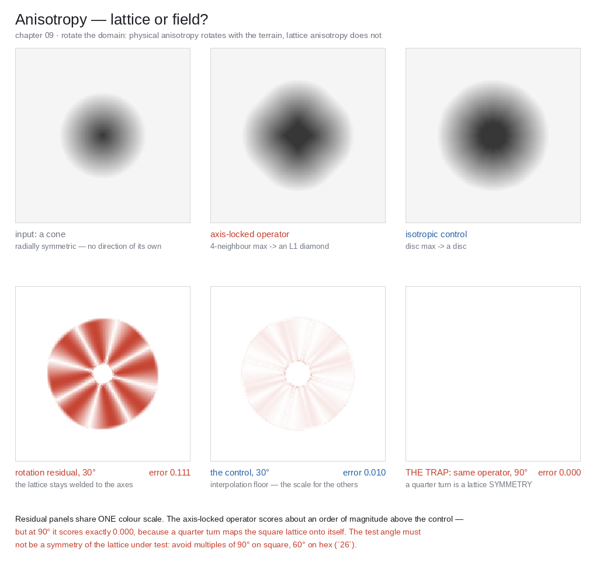

# Verification

Terrain is judged by eye, which makes it uniquely vulnerable to **plausible wrongness**: a
result that looks fine in a hillshade and is structurally broken. The whole point of this file
is that a handful of cheap, quantitative checks catch things that no amount of looking will.

Contents: [Validation suite](#validation-suite) · [The five checks](#the-five-checks) ·
[Two province-scale curves](#two-province-scale-curves) ·
[Checks for the extended families](#checks-for-the-extended-families) ·
[Visual review modes](#visual-review-modes) ·
[Failure catalogue](#failure-catalogue) · [Review checklist](#review-checklist)

## Validation suite

Before the visual checks, run every node against synthetic inputs whose correct output you can
state in advance. This is the difference between "looks plausible" and "is correct", and it is
cheap — these are a dozen lines of setup each.

**Canonical test inputs.** Each one is chosen because it breaks a specific class of node:

| Input | Catches |
|---|---|
| **Flat plane** | Division by zero in slope/TWI; erosion that creates relief from nothing; NaN from `atan2(0,0)` |
| **Constant slope** | Flow routing that doesn't route; D8 diagonal bias; erosion that doesn't incise |
| **Cone** | Radial symmetry — output must stay radially symmetric. Catches the thermal per-neighbour distance bug (`05`) and the pipe model's 4-pipe anisotropy (`04`) instantly: you get a plus shape. |
| **Inverted cone** | A single pit. Depression handling must resolve it. |
| **Ridge / valley** | Sign conventions in curvature and aspect |
| **Step** | Edge-preserving filters (bilateral, guided) must keep it; Gaussian must not |
| **Terrace** | Quantisation artefacts; derivative combs |
| **Closed basin** | Fill vs breach policy; must not leak |
| **Basin with a spill point** | Priority-Flood correctness — flow must exit via the spill, not the lowest rim cell |
| **Two connected basins** | Lake graph / spill cascade. The classic case that naive filling gets wrong. |
| **Plateau** | Flat resolution — epsilon fill; catches the parallel-lines artefact |
| **Coastline** | Sea-level flood fill vs threshold (`03`) |
| **Cross-tile river** | Tiling. A river authored to cross a tile boundary must arrive with the same `A` on both sides. |
| **Open-perimeter square** | Domain-edge policy. Uniform uplift, every edge open, run toward steady state: the boundary fringe and the dome **must** appear (`02`, `03`). This is the positive control — a metric that can't see it here isn't measuring anything. |
| **Extreme height range** (0–20 km) | Precision. R16 terracing shows up here and nowhere else. |
| **One-pixel spike** | Median/despike; erosion stability; capacity singularities |
| **One-pixel pit** | Depression handling; the `?` case where breach and fill disagree |
| **Radial vent (point source)** | Tephra fallout and PDC energy cone must stay radially symmetric on flat ground; a plus/star shape = lattice anisotropy in the fallout or flow (`11`) |
| **Ice-dammed lake + conduit** | Jökulhlaup hydrograph — slow exponential rise then abrupt cutoff; a slow symmetric bump = the tunnel-enlargement feedback is missing (`12`) |
| **Linear seafloor-age ramp** | Age→depth remap: depth monotonic in √age, flattening for old crust; no erosion applied below wave base (`12`) |
| **Superelevated channel belt** | Avulsion fires at superelevation `SE≈1`, not before and not never; the new course is steepest-descent *off* the ridge (`03`) |
| **Oscillating sediment supply** | River terraces — one tread stranded per cut-and-fill cycle; treads horizontal and parallel (`03`) |
| **Linear depth ramp (photic)** | Coral zonation bands by depth; density → 0 above the waterline and below the compensation depth (`12`) |
| **Point load on a plate** | Isostatic flexure matches the analytic response kernel; long-wavelength loads approach the Airy limit (`02`) |
| **Sphere / cube-face seam** | Planetary grid: height and `A` continuous across a cube-face seam; no pole pinch; erosion neighbourhoods cross the seam (`08`) |

**Invariants to assert.** These are machine-checkable and they belong in CI, not in an artist's
eyeballs:

| Invariant | How |
|---|---|
| **Determinism** | Run twice, same seed → bit-identical. Then run threaded → still bit-identical. This is the double-buffering check (`04`, `05`) and it fails loudly. |
| **No NaN / Inf** | Assert after every sim step, not at the end. The step that first produces NaN is the bug; by the end it's spread. |
| **No invalid negatives** | `waterDepth ≥ 0`, `sediment ≥ 0`, `A ≥ cellArea`. Negative water is the missing pipe-model scaling factor (`04`). |
| **Mass conservation** | Where applicable: `Σ(bedrock + sediment)` constant under pure transport (no uplift, no sources). Erosion models leak mass at boundaries and at every clamp; measure the leak and know it. **This is the single most under-used terrain assertion.** |
| **Tile continuity** | Height, normals, and `A` match across a shared edge to within float epsilon |
| **Monolithic vs tiled equivalence** | Run the graph whole; run it tiled; diff. Should be ~0 for local ops, provably non-zero for stream power (`08`) — **and knowing which is which is the point of the test.** |
| **CPU/GPU tolerance** | Same graph both paths, diff within tolerance. Establish the tolerance; don't discover it. |
| **Long-run stability** | 10× the intended iteration count. Should converge or plateau, not drift or explode. |
| **Resolution consistency** | Same world extent at 1k/2k/4k. Large-scale structure must match; only detail should differ. **If the mountains move, a parameter is in cells instead of metres** (`SKILL.md` invariants). |
| **No erosion-created pits** | After each stream-power step, every non-base-level node remains at or above its receiver; flooded nodes are unchanged. Count clamp/correction events and fail if they grow persistently (`04`, `22`). |

The resolution-consistency test deserves emphasis: it is the cheapest possible detector of the
most pervasive defect in terrain graphs. Run it first.

## The five checks

Run these before declaring a terrain graph correct. Together they cost minutes and they catch
almost everything.

### 1. Flow accumulation render

Render `log(A)` as an image. This is the highest-value diagnostic in the whole pipeline.

**Must show:** a connected, branching, dendritic network; every channel reaching either the
domain edge or a lake; tributaries joining at acute angles pointing downstream.

**Diagnoses:**

| What you see | Cause |
|---|---|
| Scattered confetti, no connectivity | No depression handling (`03`) |
| Channels stop mid-slope | Unfilled pits |
| Parallel straight lines on hillslopes | D8 artefact — use D∞/MFD (`03`) |
| Everything at 45° | Missing diagonal distance weighting in D8 |
| Fan of lines radiating from filled basins | Filled without epsilon — flat surfaces have no direction |
| Network exists but doesn't match the visible valleys | Analysis ran before erosion, or you're rendering `A` from a stale DEM |

### 2. Slope histogram

Plot the distribution of `atan(slope)` in degrees.

**Must show:** after thermal erosion, a distribution that *ends* near the repose angle — a
soft peak at 30–40° and essentially nothing above 45° (unless you have authored rock faces).

**Diagnoses:**

- **A spike at 0°** — over-deposition, or the terrain is mostly flat and you have a masking
  problem, or filling replaced your terrain with plateaux.
- **A long tail past 60°** — thermal never ran, or ran before hydraulic, or the talus angle is
  wrong, or (very common) the per-neighbour distance correction is missing so diagonals were
  never relaxed.
- **A spike at exactly 90°** — NaN or Inf in the height field. Check the pipe model's scaling
  factor (`04`).
- **Bimodal with a gap** — usually a mask threshold has been applied to height somewhere it
  shouldn't have been.

### 3. Slope–area plot (stream power only, and it's decisive)

For channel cells (`A` above the channelisation threshold), plot `log(S)` against `log(A)`.

**Must show:** a straight line with slope `−m/n`. With the standard `m=0.5, n=1`, that's
**−0.5**.

This is a direct test of whether the stream power implementation is correct. It comes from the
equilibrium condition `U = K·A^m·S^n` → `S = (U/K)^(1/n) · A^(−m/n)`. If your line isn't
straight, or its slope isn't `−m/n`, the solver is wrong — most likely the stack ordering, or
you're traversing the stack backward.

Nothing about eyeballing a hillshade will ever catch a subtly wrong stream power solver. This
plot catches it in one look. It is the single best argument for the "compiler-as-oracle"
approach applied to terrain: find the measurement that makes the bug loud.

### 4. Long profile

Plot elevation against distance downstream along the main channel.

**Must show:** a **concave** profile — steep at the head, flattening toward the mouth. This is
one of the most robust observations in geomorphology.

**Diagnoses:**

- **Convex** — uplift is winning; not enough erosion time, or `K` too low.
- **Straight** — you're looking at noise, not an eroded landscape. If this is a "realistic
  eroded mountains" brief, the erosion isn't doing anything.
- **Stepped** — either real (knickpoints, which are legitimate and interesting) or unfilled
  pits. Check `A` for connectivity to tell which.

### 5. Two-scale hillshade

Render a hillshade at full extent and at a 10× zoom on a representative patch.

**Must show:** structure at both. Terrain that reads well zoomed out and turns to mush zoomed
in has insufficient octaves or over-smoothing. Terrain that reads well zoomed in and looks
like noise zoomed out has no macro structure — it needs `02`.

**The bilinear filter test:** zoom in until you can see individual cells. If you see the
diamond-shaped bilinear interpolation pattern, your export resolution is below your detail
frequency and you're storing noise you can't represent.

## Two province-scale curves

The five checks validate a *simulation*. These two validate a *claimed landscape* — they are the
quantitative core of the archetype signatures in 20-archetypes.md.

### Hypsometric (area–altitude) curve

Plot the fraction of area above each elevation, both axes normalised (**Strahler 1952**,
*Hypsometric (area-altitude) analysis of erosional topography*, GSA Bulletin 63) — a one-glance
read of a landscape's **maturity**, i.e. how much mass erosion has removed:

- **Convex** (most area high) — youthful: uplift-dominated, little removed. Right for a
  Himalayan-type brief; wrong for "ancient worn mountains".
- **Sigmoid** — mature, near equilibrium (Alpine-type).
- **Concave** (most area low) — old age: most mass gone (Appalachian-type, shields).

**Diagnoses:** a brief and a curve that disagree — "young dramatic peaks" with a concave curve, or
"old rolling hills" with a convex one — mean the uplift/erosion balance is mis-tuned, whatever the
hillshade looks like.

### Cross-valley profile

Sample elevation along transects perpendicular to a valley axis.

**Must show:** the shape the process history claims. **V** = fluvial incision; **U** (flat floor,
steep walls) = glacial trough (`12`); a flat-floored V with terraces = incision into fill (`03`).

**Diagnoses:** the canonical discriminator when a brief says "glaciated" — V-profiles everywhere
mean the ice pass never ran or was overwritten (order bug: fluvial re-run *after* glacial at full
strength). U-profiles in an unglaciated temperate brief mean over-smoothed valley floors
(deposition or filtering too aggressive).

## Checks for the extended families

The five checks and two curves validate the fluvial / thermal / glacial backbone. The families that
run around it each carry their own decisive measurement — the analogue of the slope–area plot: cheap,
quantitative, and loud on the one wrongness that a hero shot hides.

| Family | Measure | Right looks like / diagnosis |
|---|---|---|
| **Tephra fallout** (`11`) | `log(thickness)` vs distance from vent | A straight line, slope `−k` (Pyle exponential thinning). Curvature or a flat blanket = not draping / no distance decay |
| **Pyroclastic density current** (`11`) | Inundation boundary vs the `H/L` energy line | Flow stops where the energy line meets the ground; **ponds in valleys, blocked by ridges**. Climbing a ridge it shouldn't = the topographic gate is off |
| **Caldera** (`11`) | Cross-section of the depression | Flat foundered floor ringed by fault scarps — **no raised rim, no central peak**. Rim+peak = an impact crater was stamped instead of a collapse |
| **Turbidity current** (`12`) | `C`, `U` along the run; Richardson number | Under autosuspension `C` and `U` **grow** downslope then wane; the deposit **fines upward** (Bouma). Instant death on a slope = no bed entrainment |
| **Seafloor age–depth** (`12`) | Depth vs √age | `d ≈ d₀ + C·√age` within tolerance, flattening for old crust. A uniform-depth abyss = the law was never applied |
| **Isostasy** (`02`) | Deflection vs the load convolution; peak vs mean elevation through erosion | Deflection = load ⊛ the flexural kernel; as valleys incise the **mean drops but peaks rise** (`ρc/ρm`). Peaks sinking with erosion = rebound missing |
| **Domain boundary** (`03`) | Incision, local relief, or drainage density binned by **inset distance** from the perimeter | **Flat, within the interior spread.** A monotone ramp confined to an outer band = the boundary fringe, and the knee where it meets the interior value *is* the boundary-influence distance — read the margin width off it. Pair with a flow-azimuth histogram in that band: four spikes at the edge normals, present near the edge but **not** in the interior (interior too = grid anisotropy, below, not this) |
| **River terraces** (`03`) | Elevation of a tread along the valley | **Horizontal**, parallel to the other treads — a level bevel, not a downstream-sloping surface. Sloping treads = cut without a base level |
| **Avulsion** (`03`) | Superelevation `SE` at the avulsion step | `SE ≈ 1` when it fires (one channel depth above the floodplain). Firing at `SE≪1`, or never, = the setup threshold is wrong |
| **Coral cover** (`12`) | Growth-form / density vs depth & wave energy | Zonation **monotone** — branching/encrusting on the high-energy crest, massive on the flat, plate/foliose deep; cover **stops** above water and below the photic depth |
| **Planetary grid** (`08`) | `A` and height across a cube-face seam; cell-area ratio | Continuous across the seam (metric-corrected `Δs`); resolution-consistent; no pole pinch. A drainage discontinuity at a face edge = seam routing missing |
| **Auxiliary maps / engine handoff** (`27`) | Layer-stack mass budget; dry-snow attribution; derived-map re-derivation | Under pure transport `Σ(Δheight + Δsoil + Δsediment [+ Δsnow])` closes as **one** budget even while layers exchange mass, or the leak is named (`assert_layer_budget`); every cell with `snowDepth > 0` and `moisture ≈ 0` traces to a wind lee, an avalanche runout, or ice flow (`snow.dry_snow_attribution`); every derived map re-derives bit-equal from the final R32F fields. Unattributed dry snow = a broken Snow Rule; a re-derivation mismatch = a patched or pre-final-geometry map |

The pattern is the file's thesis applied to each new family: **find the one measurement that makes the
bug loud.** A tephra blanket that ignores distance, a caldera with a central peak, terraces that slope
downstream, coral on the abyssal plain — each looks plausible in a hero shot and each is caught in a
single plot or cross-section.

## Visual review modes

The five checks are quantitative — each catches a *specific* bug. This is the complementary
palette: the render modes you flip between to judge a heightfield by eye. The discipline is
**match the view to the artefact**. No single view is sufficient, and the most common review
mistake is signing off from one pretty hero shot — which hides exactly the defects a plan view
or a raking light would show.

Everything here renders one of the `06`/`08` fields; none of it modifies the terrain. Bake all
of it from **R32F** (`08`) — a review render off the quantised R16 shows you the quantisation,
not the terrain.

| Mode | Renders | Reads / catches | Blind to |
|---|---|---|---|
| **Greyscale height** | `height`, per-view normalised | Absolute range, clipping, sea level, gross blunders | Shape — the eye can't read relief off a flat ramp; a canyon and a shallow dip look identical. Overlay contour lines to recover it |
| **Hillshade** | Lambert of the normal vs a low sun | Relief, drainage texture, the overall read | Anything parallel to the sun; a single azimuth hides ridges aligned with it |
| **Sun sweep** | hillshade animated through 360° of azimuth | Grid-aligned artefacts, terracing, D8 stripes — they *strobe* as the light rotates | — the single highest-value qualitative check |
| **Slope shade** | `atan(slope)` on a ramp | Steepness directly; pairs with the slope histogram (check 2); cliffs and repose faces | Convex vs concave — slope is unsigned |
| **Normal RGB** | `normal` as RGB (or aspect as hue) | Faceting, quantisation combs, lighting seams between tiles — the "normals view" | Macro shape; it's a derivative, all high-frequency |
| **Curvature** | profile/plan curvature, *diverging* ramp centred at 0 | Ridge vs valley structure, deposition zones, mask inputs; speckle = quantisation (`06`) | Absolute height and slope |
| **AO** | long-radius horizon AO (`06`) | Macro relief — valleys darken, peaks catch light; concentric rings = R16 (`08`) | Fine detail at large radius |
| **Insolation** | sun-arc received fraction (`06`) | The melt driver by eye: aspect asymmetry (equator-facing bright), shadowed ravines that hold snow; identical-looking to AO = the sun-arc test was skipped and one map was shipped twice (`27`) | Sky openness — that's AO's integral; a sun-shadowed but sky-open wall reads dark here and bright there, which is the point |
| **Flow / wetness overlay** | `log(A)` or TWI over hillshade | Connectivity, channel network, where water lingers (check 1) | — |
| **Diff / A–B** | two fields subtracted, diverging ramp | Before/after erosion; monolithic vs tiled; CPU vs GPU — must match where the invariants say it must | — |
| **False-colour clip** | height with out-of-range flagged | NaN/Inf (flag magenta), below sea, above cap — *before* they spread | Everything else |

**Top (plan) view vs hero (perspective) view — use both, deliberately.**

- **Plan / orthographic (straight down)** is for *structure*: drainage connectivity, mask
  layout, scatter distribution, tiling seams, whether the network is actually dendritic. Every
  seam and every masking error is visible from directly above and nearly invisible in
  perspective. This is where you catch that the graph is *wrong*.
- **Hero / perspective (grazing camera, low sun)** is for *silhouette and read*: does it look
  like a place, does the LOD hold, do distant mountains keep their height (`08`), does terracing
  show under raking light. This is where you catch that the graph is *ugly* — and where a client
  signs off. A hero shot alone will pass a terrain whose rivers stop mid-map, because at a
  grazing angle you never see the drainage.

The rule: **plan view to verify it's correct, hero view to verify it's convincing, and never
substitute one for the other.** A rotating sun over a plan-view hillshade plus one `log(A)`
render catches more real defects in thirty seconds than any amount of turntable-ing the hero
shot.

**Review the whole declared view envelope (`08`).** The plan/hero pair is necessary but not enough
for an asset that must work from a known camera range:

- At the **far end**, inspect silhouette, macro material breakup, haze-free structure and correctly
  sized scale cues. Peaks must survive LOD and the terrain must not depend on close-up noise to read.
- At the **near end**, inspect whether relief that affects parallax or silhouette is real geometry,
  whether material channels describe the same microstructure, and whether scatter instances are
  grounded and clear of obstacles.
- Use atmosphere and depth of field only after these passes. They can communicate depth, but they
  must not hide tiling, missing geometry, broken scale or intersection defects.

A useful scale-cue render includes one or more objects with known world dimensions (tree height,
boulder diameter, road width, doorway) and no camera trick that miniaturises the scene. If the cue
looks wrong, first check metres, material wavelengths and scatter sizes; do not "fix" it by scaling
the atmosphere or terrain independently.

## Failure catalogue

Symptom → mechanism → minimal fix. Ordered roughly by how often they occur.

| Symptom | Mechanism | Fix |
|---|---|---|
| Rivers stop mid-map; `A` is confetti | No depression handling | Insert epsilon priority-flood before routing (`03`) |
| Hard seams between tiles | Noise in tile-local UV | Evaluate noise in world space (`01`) |
| Soft seams / ridge at tile edges | Erosion run per-tile without apron | Apron ≥ max transport distance, or erode globally (`08`) |
| Fringe of short parallel gullies hanging off all four map borders ("tablecloth") | Uniform open perimeter — every edge cell is an outlet, so the outer band drains straight out | Author the outlets and close the rest; simulate a margin and crop it (`03`) |
| Radial fan at each map corner | Corner cell has two open boundary faces | Give corners an explicit status; same margin fix (`03`) |
| Drainage divide runs parallel to the border at a constant inset; map domes | Headward retreat inward at equal rates from four open edges | Break the four-fold symmetry — one outlet edge, or base level inside the domain (`02`, `03`) |
| Materials in the wrong places, subtly | Analysis upstream of erosion | Move all of `06` downstream of the last height write (`06`) |
| Terracing on gentle slopes | R16 quantised too early | Work R32F, quantise at export (`08`) |
| Faceted normals / ringed AO | Baked from quantised height | Bake from R32F (`06`, `08`) |
| Speckled curvature mask | 2nd derivative of noisy/quantised field | Pre-smooth σ≈1 cell; compute from R32F (`06`) |
| Terrain reads as a miniature | Detail/material/scatter frequencies disagree with world scale, or macro-style depth of field is used on a vista | Restore metre-based feature bands and correctly-sized scale cues; review at the declared view envelope (`08`) |
| Close rock relief vanishes at the silhouette | Feature exists only in bump/normal although it is large enough to affect parallax/edge shape | Promote that band to displacement/geometry; keep finer relief in the material (`08`) |
| Rocks float or disappear into the ground as size varies | Fixed embedding offset applied to every instance | Embed from the asset support radius with clamped bounds (`07`) |
| Vegetation intersects water, roads, rocks or neighbouring canopies | Scatter layers generated independently with no footprint distance constraints | Stage layers and feed exclusion/affinity/repulsion distance fields with an interaction apron (`07`) |
| Pipe erosion → NaN spikes | Missing outflow scaling factor `K` | Add step 3 of the pipe model (`04`) |
| Pipe erosion → channels align to grid axes | 4-pipe von Neumann stencil | 8-pipe variant with per-pipe length (`04`) |
| Droplet erosion → 1px scratches | Eroding point-wise instead of with a brush | Erode with disc radius 2–4 (`04`) |
| Droplet erosion → mushy, silted | Depositing with a brush instead of point-wise | Deposit bilinear to 4 cells (`04`) |
| Terrain grows tumours / spikes uphill | Droplet speed sign convention | `speed = sqrt(speed² + (−Δh)·g)` (`04`) |
| Stream power explodes | Explicit solver | Use Braun–Willett implicit; it's 3 lines (`04`) |
| Stream power → knife-edge ridges | No hillslope diffusion term | Add `D·∇²h`, or a thermal pass (`04`, `05`) |
| Plus-shaped artefacts on cones | Thermal without per-neighbour distance | `dLimit = tan(α) * dist_n` (`05`) |
| Thermal result changes when threaded | In-place neighbour updates | Double-buffer (`05`) |
| Dunes never form; flat sand sheet | `p_sand == p_bare` in Werner | `p_sand > p_bare`; the feedback IS the instability (`05`) |
| Dunes don't migrate | No shadow zone | Implement the 15° lee capture (`05`) |
| Wetness index → Inf | `tan(slope) → 0` on flats | Clamp slope ≥ 0.001 (`06`) |
| Wetness index → stripes | Computed from D8 | Use MFD (`03`, `06`) |
| Scatter has a doubled-density line | Per-tile scatter without shared edges | Ulichney tiles or jittered grid (`07`) |
| Scatter has pairs closer than `r` | 3×3 neighbourhood instead of 5×5 | Check 2 cells out (`07`) |
| Distant mountains shrink | Box-filtered height mips | Max-filter or proper decimation (`08`) |
| Distant terrain looks like wet plastic | Box-filtered normal mips | Toksvig / LEAN mapping (`08`) |
| Cracks between LOD levels | T-junctions | Skirts, or morph the fine edge (`08`) |
| Half-cell offset between height and materials | Vertex- vs pixel-centred grids | Pick a convention; offset the sample (`08`) |
| Everything below sea level is ocean, including inland basins | Threshold instead of flood fill | Flood fill from domain edge (`03`) |
| Lakes are flat plates of terrain | Filled DEM used as the terrain | Keep both DEMs; route on filled, render original (`03`) |
| Terrain looks fine but "procedural" | Hard thresholds on masks | Noise-perturb every threshold (`06`) |
| Forest reads as a stamp field | Variation from `random()` only | Derive scale/species from environment (`07`) |
| Jitter in terrain 100 km from origin | fp32 mantissa exhausted | Camera-relative or tile-relative coords (`01`, `08`) |
| Diagonal banding in 3D-noise-on-a-plane | Lattice aligned with the sampling plane | Use `noise3_ImproveXY` (`01`) |
| Grid of pinch points in FBM | All octaves share zero crossings | Offset each octave (`01`) |
| Hybrid multifractal → isolated absurd spikes | Missing `min(weight, 1)` | Clamp the weight (`01`) |
| Creases along grid lines under lighting | Original Perlin cubic fade | Use quintic `6t⁵−15t⁴+10t³` (`01`) |
| Mask outlines the noise lattice | Thresholding gradient noise near 0 | Threshold FBM, or offset from 0 (`01`) |
| Ash blanket has uniform thickness / ignores topography | No distance-thinning; drape not applied | `T = T₀·exp(−k·r)`, stretched downwind (`11`) |
| PDC climbs over ridges it should be blocked by | Energy line not gated by topography | Inundate only where `z_EL > z_topo` (`11`) |
| Caldera has a raised rim and a central peak | Stamped an impact crater, not a collapse | Piston subsidence `s = V/A`; flat floor, ring scarp (`11`) |
| Jökulhlaup peak is a slow symmetric bump | No tunnel-enlargement feedback | Runaway conduit `dS/dt`, abrupt cutoff at lake-empty (`12`) |
| Abyssal plain is a flat, uniform depth | Age→depth law never applied | Remap seafloor age to `d₀+C·√age` (`12`) |
| Turbidity current dies on entering a slope | No bed entrainment / autosuspension | 3-equation model with the `E_s` term (`12`) |
| River terraces slope downstream / aren't parallel | Treads not cut at a base level | Bevel each strath at the current base level — horizontal (`03`) |
| Avulsion fires every step, or never | Superelevation threshold missing / wrong | Require `SE≳1` (one channel depth) + a flood trigger (`03`) |
| Coral covers deep / aphotic seabed | No photic gate on placement | `density × inPhotic(depth)`; stop below compensation (`12`) |
| Range erodes straight down; peaks never rise | Isostatic rebound not coupled to erosion | Add flexural / erosional rebound alongside erosion (`02`) |
| Seams or a pole pinch on a planet | Lat-long grid, or tile-local coords on a sphere | Cube-sphere / HEALPix + metric-corrected `Δs`; seam routing (`08`) |
| Crease along the equator on a planet | Two hemispheres generated separately, or N mirrored to S | Generate one field on the whole `S²` (sample the 3D surface point); the equator is not a boundary (`25`) |

### The grid-anisotropy family

Many rows above are one disease: **a discrete stencil printing its directions through the
physics**. Every grid algorithm quantises direction — to 8 neighbours, to 4 pipes, to lattice
axes — and wherever the physics should be isotropic, that quantisation leaks into the output as
stripes, staircases, and plus-shapes. The instances are scattered across the skill because each
lives with its algorithm; this table is the family reunion, for when the symptom is "directional
artefacts" and the mechanism could be any of them.

| Instance | Where | Symptom | Fix | Test |
|---|---|---|---|---|
| D8 single-receiver routing | `03` | Parallel straight lines on hillslopes; TWI stripes | D∞/MFD for dispersive quantities; D8 only for channel extraction | Constant slope; `log(A)` render |
| Missing √2 weighting in D8 | `03` | Entire drainage network biased to 45° | Divide slope by `cellSize·√2` on diagonals | Constant slope |
| Thermal talus limit not per-neighbour | `05` | Plus-shaped collapse on cones | `dLimit = tan(α)·dist_n` per neighbour | Cone |
| Pipe model's 4-pipe stencil | `04` | Channels staircase and align to axes; plus-shaped ponding | 8-pipe variant with per-pipe length | Cone |
| Depression fill without epsilon | `03` | Fan of parallel lines radiating from filled basins | `nextafter`/epsilon fill | Basin with a spill point; `log(A)` |
| Diamond-square | `01` | Faint ridges along grid axes (anisotropic variance) | Don't use it | Sun sweep |
| 3D noise on an axis-aligned plane | `01` | Diagonal banding | Lattice-rotated variant (`noise3_ImproveXY`) | Sun sweep |
| Lava CA neighbour selection | `19` | Flow lobes align to the lattice | Monte Carlo neighbour selection (Miyamoto & Sasaki) | Cone (radial vent) |

The cures are three, and knowing which applies is most of the diagnosis: **distance-correct the
stencil** (the √2 family: D8, thermal, 8-pipe), **spread across more directions** (MFD/D∞,
8 pipes over 4), or **randomise the choice** (Monte Carlo neighbour selection, epsilon
tie-breaking). The universal detector is the sun sweep (visual review modes above) — every
member of this family strobes as the light azimuth rotates — and the universal producers of a
clean baseline are the cone and constant-slope synthetic inputs, whose correct outputs have no
preferred direction at all.

There is a fourth, structural cure the table doesn't list: **change the lattice.** The **hexagonal
grid** (`26`) *deletes* the *missing-√2* row of this family outright — with 6 equidistant
edge-neighbours there is no diagonal to under-weight and no 4-versus-8 choice to get wrong — and
*shrinks* the *D8-striping* row rather than deleting it: single-receiver striping is a
**quantisation** artefact, not a metric one, and D6 still quantises (6 directions at 60°, max aspect
error 30° against D8's 22.5°), so a planar slope still collects parallel flow lines along the hex
axes. The sun sweep and the constant-slope control still apply on hex, with *less than the square
grid* as the pass criterion, not *none*. The lattice swap also brings its **own failure rows**:
axial-vs-offset coordinate mixing, row-parity neighbour tables applied with the wrong parity,
pointy-top/flat-top orientation mismatch, and the un-renormalised 6-neighbour Laplacian (the hex
constant is `2/(3d²)`, not `1/d²` — keep the square constant and diffusivity is silently 1.5× high;
`26`). One of the new rows is invisible to the sun sweep: meshing visible hex tiles **corner-only**
(4 triangles) instead of fanning through the centre (6) drops the cell's own sample from the mesh
entirely and attenuates one-cell extrema by **exactly 1/3** — correct and free on flat prism tops or a
far LOD tier, a silent amplitude bug anywhere else. Both meshes reproduce affine fields exactly, so
the ramp and cone controls cannot see it; the detector is an **impulse** — raise one cell by `H` and
measure the rendered peak (`26`). It is not free (engines want a square raster, so you resample out) and not total (6-fold is
still not continuous), but when directional artefacts are endemic and the grid is yours to choose, the
lattice itself is the highest-leverage fix — it trades the family for a smaller one, not for zero. On
a sphere the same move is the **icosahedral hex DGGS** (`08`, `25`), where the residual stencil
irregularity is the 12 pentagons — a *topological* residue — plus the continuous metric distortion any
projected spherical grid carries (`08`).

The contrast case worth knowing: **droplet erosion is largely immune** — positions are
continuous and gradients bilinear, so there is no stencil to print through. If a droplet result
shows grid-aligned structure, the anisotropy came in with the height field (usually the noise,
`01`), not the simulation.

### "Anisotropy" names two different things — never conflate them

Everything above is **lattice anisotropy**: the discretisation printing through. It is *always*
a defect, and the reason is not aesthetic — the direction it prefers is a property of the
**array**, not of the terrain. Nothing in the world put it there, so there is no parameter value
that makes it correct.

**Field anisotropy is the opposite, and terrain without it looks generic.** Real landscapes are
full of direction, and every bit of it is sourced from a *cause*: bedding, strike and dip, joint
sets and differential erodibility (`11`); fault fabric and tectonic grain (`02`); the wind, in
yardangs, dune orientation and ventifacts (`05`, `16`); ice-flow direction, in striations,
drumlins and U-valley alignment (`12`); slope aspect and insolation, in asymmetric valleys
(`13`). Trellis drainage, hogbacks and strike valleys exist *because* erosion is directional.
Suppressing this is as wrong as printing the lattice.

**The rule that decides, and it is a sharp one: a directional control is legitimate exactly when
its direction comes from a field, not from the grid.** A strike field, a wind field, a flow
direction, an ice-flow vector — legitimate, and usually necessary. A single global angle
parameter, or worse a "strength" knob with no direction at all, is the defect wearing the
feature's clothes: it will align to the axes because the only direction available to it is the
array's. When a tool exposes an "anisotropy" control, that is the question to ask of it — *where
does the direction come from* — not whether directionality is allowed.

**The test: rotate the domain.** Physical anisotropy rotates with the terrain; lattice anisotropy
stays welded to the axes. Feed a radially symmetric input (the cone — it has no direction of its
own, so any direction in the output was put there by the operator or the grid), then compare
`rot(F(rot(h, −θ)), θ)` against `F(h)`. Any field the operator consumes must be rotated *with*
the terrain. The rotation interpolates, so this needs a control — run the same comparison on a
deliberately isotropic operator to measure the floor (`09`'s own rule: a metric with no control
is not evidence). Measured, on a 4-neighbour max against a disc max of the same radius:

| θ | Axis-locked operator | Isotropic control (the floor) |
|---|---|---|
| 23° | `0.093` | `0.016` |
| 30° | `0.111` | `0.014` |
| 45° | `0.128` | `0.020` |
| **90°** | **`0.000`** | `0.000` |

**The 90° row is the trap.** A quarter turn is a *symmetry of the square lattice*, so it maps the
grid onto itself and a grossly axis-locked operator comes back exactly equivariant — a perfect
score for a broken operator. **The test angle must not be a symmetry of the lattice under test**:
avoid multiples of 90° on a square grid and of 60° on hex. Otherwise the separation is about an
order of magnitude, which is plenty. Pinned by
`reference-impl/tests/test_anisotropy.py::test_ninety_degrees_is_a_lattice_symmetry_and_hides_the_defect`.

*The test, and its trap, in one figure — regenerate with `reference-impl/anisotropy_anatomy.py`.*

**A cure for one does nothing for the other, which is the proof they are different.** Swapping to
a hex lattice (`26`) shrinks lattice anisotropy and leaves field anisotropy completely untouched —
a strike-controlled valley network is just as directional on hex, because its direction never came
from the grid. If a single change fixes one and not the other, they were never the same defect.

**Deliberate stylised directionality is allowed, and it is an authoring choice, not a simulation
parameter.** Same status as the stepped hex-prism terracing of `26`: fine, even desirable, as a
declared style; a bug if you were hoping for geology. Record it as art direction, keep it out of
the physics, and it still may not be sourced from the grid — a stylistic direction that happens to
be the array's axes is indistinguishable from the defect, and will be read as one.

## Review checklist

For reviewing an existing graph. Ordered by expected yield.

- [ ] Depression handling present, and before flow routing?
- [ ] Is it the epsilon variant?
- [ ] Legitimate closed basins masked out of the fill? (the no-fill list in `03`: karst, glacial overdeepenings, kettle holes, craters, playas, thermokarst, oxbows, lagoons)
- [ ] All analysis nodes downstream of the last height write?
- [ ] Noise evaluated in world space?
- [ ] Erosion backbone matched to world extent? (droplet <2 km, pipe 2–50, stream power >50)
- [ ] Parameters in world units, not magic numbers tuned at one resolution?
- [ ] Thermal downstream of hydraulic?
- [ ] Sediment budget closed, or its leak measured and named? (erode-only or deposit-only is the tell; the usual sites are droplet expiry, flux caps/clamps, open boundaries, and an *effect* mask on an erosion node)
- [ ] Every terrain-altering node co-updates the auxiliary maps its process touches (`27`)? (height written but `soilDepth`/`wetness` untouched is the tell — that state is unrecoverable afterwards)
- [ ] State maps carried through the sim and derived maps recomputed from final R32F geometry — never the reverse (`27`)? (a curvature map whose parent hash mismatches `height` is the tell)
- [ ] Snow only where moisture supplies it, or attributably displaced by wind-loading / avalanche / glacial flow (`27`)?
- [ ] `A` reported in m², not cell counts?
- [ ] MFD (not D8) feeding any hillslope quantity (wetness, dispersive masks)?
- [ ] Quantisation to R16 after all derivatives?
- [ ] Normals and AO baked from R32F?
- [ ] Apron on tiled erosion ≥ max transport distance? (Or: is stream power being tiled? It can't be.)
- [ ] Boundary condition stated explicitly, per cell — and *not* a uniform open perimeter? (outlets authored, or base level inside the domain; the tell is a gully fringe and corner fans around the border, `03`)
- [ ] Domain simulated on a margin that export crops, sized from the inset-profile knee? (the domain edge is a tile edge with no neighbour, `03`, `08`)
- [ ] Seed derived from a documented root-seed rule?
- [ ] Double-buffering in every grid simulation?
- [ ] Masks partition to 1?
- [ ] Every hard threshold noise-perturbed?
- [ ] Any directional/"anisotropy" control sourced from a **field** (strike, wind, ice flow), not a global angle that will land on the axes? (rotate-the-domain test, at an angle that is *not* a lattice symmetry)
- [ ] Vertex- vs pixel-centring documented and consistent?
- [ ] If an extended family is in play (explosive volcanism, seafloor/turbidity, isostasy, terraces, avulsion, coral, planetary grid), has its check from *Checks for the extended families* been run?

**Report findings as: symptom → mechanism → minimal fix.** A graph with one misordered node
needs one node moved, not a rewrite. Minimal diffs are reviewable; rewrites are not.

## Failure modes of the measurement itself

**A saturating metric hides the thing you are testing.** Verifying that a 2× magnification really
doubles feature size by counting zero-crossings gave 2.14× and 5× for true 2× and 4× — the metric
was quantised (at 4× only ~3 crossings remain across a row), not the transform wrong. Replacing it
with an **analytic oracle** — transform a sine, and assert the result equals `sin()` evaluated at
the inverse-mapped coordinate — gave max error 0 / 0.0064 / 0.008, i.e. bilinear interpolation error
only. Prefer an oracle you can derive in closed form over a statistic of the output; when a
statistic is all you have, check its dynamic range covers the effect you are claiming.

**A metric in the wrong units inverts the conclusion.** Comparing surface roughness across
resolutions using mean per-cell height difference makes a *spikier* fine grid look *smoother*,
because cells are closer together. Convert to **slope** (per-cell drop × n) and the same data says
the fine grid is 3.15× spikier. Whenever a quantity is compared across two grids, state it in units
that do not contain the grid.

**Averaging over a region where the effect does not live.** A mountain primitive occupies perhaps
30% of its tile; comparing whole-tile means diluted a real 10% difference between two seeds to
0.0067 and read as "seeds do nothing". The same error in a different costume: sampling the first
4000 cells of a field to compare two variants, when those rows are above the feature's footprint
and identical either way. **Restrict the metric to the support of the thing you are measuring**,
and if you cannot state where that support is, you are not ready to measure.

**A harness that restates the defaults drifts away from them.** A verifier hard-coded
`relief: 0.66` and kept passing after the default moved to `0.80`; worse, it never passed the
`character` parameter at all, so the feature it existed to test was switched off in every run.
Build test inputs **from the implementation's own defaults** (`TYPES.<node>.params`, the function
signature, a shared fixture) and override only the one parameter under test. A literal copied into
a test is a fact that will silently go stale.

**Asserting an invariant the failure case also satisfies.** The clearest instance: a Mountain
primitive was checked for relief in range, one dominant summit, a summit above the mean, margins
below the mean, and deep interior incision. A smooth cone satisfies all five, and one shipped
twice. The fix is not a stricter threshold, it is a **control that must fail** — measure a cone and
pure noise with the same code, and assert the controls land where they should. If the control ever
stops separating, the test fails loudly instead of passing vacuously. See
`tests/test_landforms.py::test_mountain_is_not_a_solid_of_revolution`.

**Thresholds invented before the measurement.** Writing `assert ratio > 3.0` first and then
adjusting the code until it passes tests the threshold, not the code. Measure first with the
numbers printed, look at the spread across seeds and parameters, and *then* set the bound — below
the observed floor, with the observed values recorded in the docstring so the next person can see
whether a later change moved them.

**A number that is stable across the whole input range is not a measurement.** A "straightness"
statistic read 0.183 / 0.189 / 0.188 across the entire parameter sweep it was supposed to
characterise. That is not a weak effect, it is no instrument. Before trusting a green result, run
the metric at both extremes of its input and confirm the output actually moves; if it does not,
replace the metric rather than the threshold. When the replacement measures something weaker than
the original claim, **state the weaker claim** — do not let the wording outrun the instrument.

**When the obvious diagnosis appears, test it before acting on it.** A slope–area fit came out at
−1.11 instead of −0.5 and the natural reading was "heavy diffusion is contaminating the fit", so
the channel-area threshold was raised to exclude hillslopes — and the fit got *worse* (−0.35 →
−0.61 → −1.11), because there were zero channel cells left above the new threshold. Diffusion had
not contaminated the network, it had **erased** it (max drainage area 3969 → 707). Separately, a
solver was suspected when the slope–area oracle failed at −0.591 / −1.003 / −1.213; the harness was
wrong (a structured fBm initial condition with unbalanced uplift never reaches steady state), and
reproducing the reference conditions gave −0.387 / −0.490 / −0.591, errors of 0.013 / 0.010 /
0.009. **Suspect the harness at least as readily as the code**, and confirm which one is broken
with a cheap direct probe before changing either.

**A stability limit met exactly is not met.** The explicit 5-point Laplacian is stable for
`D·dt/Δx² ≤ 0.25`, and sub-cycling sized with `ceil(D·dt / (0.25·Δx²))` lands *exactly* on 0.25
whenever `D·dt` divides evenly. At exactly 0.25 the checkerboard mode's amplification factor is
`1 − 8c = −1`: it flips sign forever and never decays. The field stays finite, mass stays
conserved, and every blow-up assertion passes — while the diffusion pass **roughens** the terrain
(mean `|∇²h|` rose 0.68 → 2.36 across `D` = 0.1 → 10 instead of falling). Use the safety factor
(`diffusion.stable_dt`, 0.9), and test the *direction of the effect*, not merely that the output is
finite. This is the general shape: an assertion that a result is finite/conserved/non-NaN says
nothing about whether it is right.
