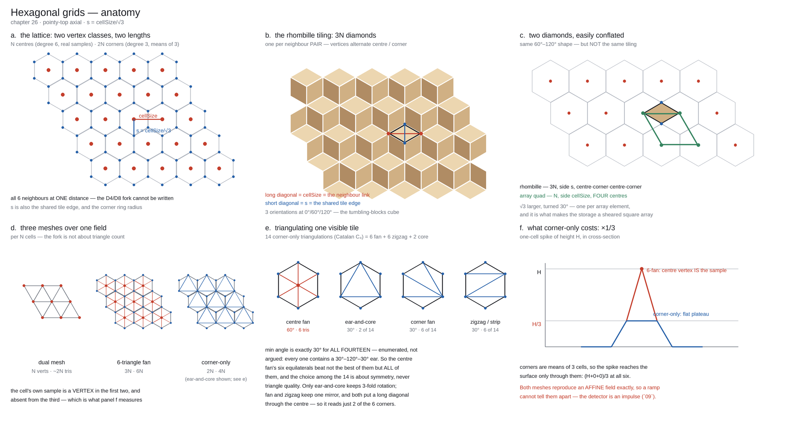

# Hexagonal Grids

The **other planar grid**. Every other chapter assumes the working grid is a square raster; this one
owns the alternative, end to end — the lattice and its metric, the stencils that change, meshing,
storage, engine integration, and the stepped hex-prism look. It is a *flat-terrain* chapter first: hex
earns its place on strategy and 4X maps, on erosion and CA sims where directional artefacts are the
problem, and in DEM/watershed analysis, none of which touch a sphere. The globe is one *further* domain
the same lattice closes onto, via the icosahedral hexagonal DGGS, which lives with the other spherical
grids in `08` and `25`. The grid *choice* is recorded in the manifest and the *delivery* rule is an
output-contract matter, so both stay in `08`; everything else is here. Read it when the requested output
is hex-native, or when grid anisotropy (`09`) is the problem you are trying to structurally remove.



*The geometry of this chapter in one figure — lattice and vertex classes, the rhombille, the
two easily-conflated diamonds, the three meshes, the tile triangulations, and the `×1/3` cost.
Regenerate with `reference-impl/hex_anatomy.py`.*

Contents: [Why hex is not a gimmick](#why-hex-is-not-a-gimmick--it-is-the-better-sampling-lattice) ·
[Coordinates and the metric](#coordinates-and-the-metric) · [Stencils](#stencils-routing-diffusion-gradients) ·
[Meshing](#meshing) · [The rhombille tiling](#the-rhombille-tiling) ·
[Storage: a sheared 2D array](#storage-a-sheared-2d-array) ·
[What does not port — hex-native operations](#what-does-not-port--hex-native-operations) ·
[Engine integration](#engine-integration) ·
[Triangulating a tile: 6 or 4](#triangulating-a-tile-6-or-4) · [Hex prisms](#hex-prisms) ·
[Interchange](#interchange) · [Verify](#verify) · [Tier](#tier)

## Why hex is not a gimmick — it is the better sampling lattice

Everything elsewhere in this skill quietly assumes the working grid is a **square raster** — `cellSize`
is one number, a cell has 4 edge-neighbours and 4 corner ones, and half the failure catalogue in `09` (the
*grid-anisotropy family*) is the square lattice printing its axes and its √2 diagonals through physics
that should be isotropic. The square raster is the right default — it is what every engine, DCC tool
and DEM ships — but it is **a grid choice, not the definition of a heightfield**. The **hexagonal grid**
is the other planar grid worth naming, and it is a grid system in its own right, not a spherical
curiosity: it stores a `HeightField` exactly like the square raster (a 2D array), and changes only the
neighbour structure and the metric — but that one change is precisely what dissolves much of the
anisotropy family.

**The sampling result.** For an isotropically band-limited 2D
signal the hexagonal lattice is the *optimal* sampling arrangement: it reconstructs the same bandwidth
with **~13.4% fewer samples** than the square lattice (**Petersen & Middleton 1962**; the DSP-standard
treatment is **Mersereau 1979**). Be precise about how that saving is realised, because it is a trap:
it comes from taking a **~15% coarser `cellSize`** (hex spacing `0.577/W` against square `0.5/W` for
radial band-limit `W`) — at *equal* `cellSize` a hex grid has **15.5% *more* cells** per unit area
(density `2/√3`), not fewer. Carry the square grid's `cellSize` over unchanged and the "memory saving"
is a memory *cost*. And the theorem is a motivation, not a derivation: its precondition is *isotropic*
band-limiting, and real terrain spectra are power-law and anisotropic (tectonic strike, ridge
lineation), so treat the 13.4% as the direction of the advantage, not a budget line. The two practical
reasons are structural:

- **Every neighbour is equidistant and edge-adjacent.** A hex cell has exactly **6 neighbours**, all one
  cell-spacing away, each sharing an *edge*. The square grid's fork — 4-connectivity (ignores the
  diagonals) versus 8-connectivity (diagonals are √2 farther and share only a *corner*) — **does not
  exist on hex**. Of the two most common members of the `09` anisotropy family, the *missing-√2
  diagonal weighting* genuinely **cannot be written** — there is no diagonal and no unequal neighbour
  distance to get wrong. *Single-receiver striping* is different: it is a **quantisation** artefact,
  not a metric one, and D6 still quantises — hex removes the metric bias and shrinks the striping, but
  does not delete it (the routing paragraph below is precise about this).
- **It is more isotropic.** Six directions at 60° instead of four/eight at 45°/90° means cellular
  automata, diffusion, and talus/flow stencils leak far less preferred direction — the plus-shaped
  collapse and axis-aligned lobes of `05`/`19` shrink. It does not vanish (6-fold symmetry is still not
  continuous), but the sun-sweep test (`09`) strobes far less.

**The advantage over a square grid, at a glance** — a *flat-terrain* comparison, no sphere involved:

| | Square raster | Hexagonal grid |
|---|---|---|
| Neighbours | 4 edge + 4 corner — the D4/D8 fork | **6, all edge-adjacent and equidistant** |
| Diagonal metric | √2 correction, easy to forget → 45° drainage bias | **none — there is no diagonal to weight** |
| Sampling | baseline | **~13.4% fewer samples** for the same isotropic bandwidth — via a **~15% coarser `cellSize`**; at equal `cellSize`, +15.5% cells |
| Flow routing | D8: √2 weights biasing receiver choice | **D6: uniform weight, no metric bias** — but coarser quantisation (6 directions vs 8) |
| Erosion / CA isotropy | 45°/90° leakage — plus-shapes, axis-aligned lobes | **60° leakage — markedly cleaner**, not zero |
| Storage | 2D array | 2D array (axial / offset) — same shape, **different index→world map** (row-parity offsets) |
| Engine / DEM interchange | native everywhere | **the one cost:** resample to a raster to deliver |

Where a hex heightfield actually earns its place is **flat terrain**, not planets: hex-native strategy /
4X and city-builder maps, erosion and cellular-automata sims where directional artefacts *are* the
problem, and DEM / watershed analysis on hex meshes (HexWatershed, `03`) — none of which touch a sphere.
The globe (`08`, `25`) is one *further* place the same grid applies, not what the hex grid is for.

## Coordinates and the metric

**Still a 2D array, new indexing.** Three coordinate systems; the practical, de-facto
reference is Amit Patel's *Red Blob Games — Hexagonal Grids* (**F** — engineering, no paper, but *the*
standard):

- **Axial `(q, r)`** — two axes 60°/120° apart, stored in a rhombic or offset-rectangular 2D array. This
  is the storage layout: the array *shape* is unchanged from a square raster, but the index→world map is
  not — an axial rhombus over a rectangular world extent wastes corner cells, and packing rectangularly
  means offset coordinates, whose neighbour offsets are **row-parity dependent** (*the* classic hex bug).
- **Cube `(x, y, z)` with `x + y + z = 0`** — the symmetric three-axis view; the cleanest coordinates for
  distance, rotation and line-drawing, because hex distance is `(|x|+|y|+|z|)/2`.
- **Offset (odd-r / even-r / odd-q / even-q)** — a square array with alternate rows/columns shifted half a
  cell; convenient for I/O, painful for arithmetic. Convert to axial/cube before doing any geometry.

"Still a 2D array" is worth stating sharply, because it is exact rather than approximate: a hex field is
a **sheared** square array, the shear being a single 2×2 matrix. That is easiest to see once the
rhombille tiling is on the table — *A diamond is a sheared square*, below.

Pick **pointy-top or flat-top** once and record it in the manifest (the `grid` / `hexOrientation` /
`hexCoords` fields in `08`'s manifest schema); the neighbour offsets and the row/column
spacing depend on it, and mixing the two is the hex analogue of `08`'s vertex-vs-pixel-centring bug.
The metric, precisely — there are two spacings in play and only one is a neighbour distance. For a
regular hexagon of circumradius `s` the apothem (centre-to-flat) is `(√3/2)·s`, and **all six
neighbours are exactly `√3·s` away** — twice the apothem, *including* the adjacent-row neighbours
(`√((√3/2)² + (3/2)²)·s = √3·s`). The `(3/2)·s` figure you also need is the **row pitch** — the spacing
between row centrelines — and is *not* a centre-to-centre neighbour distance; confuse the two and every
world-space position is wrong. `cellSize` is the neighbour spacing `√3·s`, and cell **area** in
manifest terms is `(√3/2)·cellSize² ≈ 0.866·cellSize²` (equivalently `(3√3/2)·s²`; the `√3/2` is the
same lattice-density constant as the sampling result above) — you need it for drainage area in m² and
every per-area rate, and the `SKILL.md` world-unit invariants hold unchanged.

**Cell centres are computed, never stored.** A centre is a pure function of index and manifest —
exactly as `x = origin + i·cellSize` on a square raster — and this formula is where the row-parity bug
lives, so print it rather than improvising it. Pointy-top axial:

```
centre(q, r):
    x = origin.x + cellSize · (q + r/2)      # cellSize = √3·s — the neighbour spacing
    y = origin.y + (√3/2)·cellSize · r       # (√3/2)·cellSize = (3/2)·s — the row pitch
```

Flat-top swaps the roles of the axes. From offset coordinates convert to axial *first* (odd-r:
`q = col − (row − (row & 1))/2`, `r = row`), then apply the formula; computing centres directly from
offset indices with the wrong parity shifts alternate rows by half a cell — the half-texel bug's hex
twin, invisible until two systems disagree about where a cell is. Everything positional — sampling a
raster at hex centres on import, meshing hex tiles, scatter placement (`07`) — goes through this one
function, which is why it must exist exactly once.

**This formula is planar-only.** It assumes a flat domain, where the lattice is exact and every cell is
congruent. On a spherical hex DGGS neither holds: cells are spherical polygons, they are not congruent,
and "the centre" is no longer one thing — the spherical centroid, the projection of the planar
centroid, and the projection preimage of the cell centre are three different points that a shading or
scatter pipeline will happily mix. Take centres from the grid library there, exactly as you must take
per-cell areas (`08`'s DGGS material), and do not carry the axial formula onto the sphere.

## Stencils: routing, diffusion, gradients

**Flow routing on hex is D6 — cleaner than D8, not finer.** Steepest descent picks the lowest of 6
equidistant edge-neighbours — no √2 rescaling, no 4-versus-8 decision, no metric bias tilting the
choice of receiver. What D6 does *not* buy is angular resolution: 6 directions at 60° is **coarser**
than D8's 8 at 45° (max aspect error 30° against 22.5°), so single-receiver flow on a planar slope
still collapses onto the nearest lattice direction — parallel drainage along the 60° family, smaller
than D8's but present — and ties between equal-drop neighbours still need a rule (`03`, *D6*).
Dispersive quantities (MFD) spread over up to 6 receivers with equal geometric weight. Everything else
in `03` is unchanged: **depression handling still comes first** (the Legal Order does not care about the
lattice), accumulation is the same recurrence over the new neighbour set, and channels threshold `A`.
This is not hand-waving — mesh-independent flow routing on a hex mesh is published (**Liao et al. 2020**,
HexWatershed; `03`), which is exactly why hex is the *low-anisotropy* grid to reach for when hydrology is
the point.

**Erosion, thermal and CA port by swapping the stencil — and renormalising it.** "Swap 4 neighbours
for 6" is not the whole port: the stencil's **normalisation constant changes**, and keeping the square
one is a silent 1.5× error. For unit neighbour vectors `Σₖ eₖeₖᵀ = 3I` on the hex lattice against `2I`
on the square 4-stencil, so the discrete Laplacian at neighbour spacing `d` is

```
square (4-neighbour):  ∇²h ≈ Σ(hᵢ − h₀) / d²
hex    (6-neighbour):  ∇²h ≈ Σ(hᵢ − h₀) · 2 / (3·d²)
```

Port `05`'s hillslope diffusion (or the diffusion term coupled into stream power) with the square
constant and the effective diffusivity is quietly **1.5× too high** — it reads as a tuning problem,
not a bug. Thermal talus redistributes to the 6 neighbours with a single per-neighbour distance (no
square-grid √2 split) and the pipe model becomes a **6-pipe** model with one pipe length — but both
inherit an *analogous* rescaling, not the exact 3/2: six outflow paths per step drain a cell faster,
so re-derive the stability (CFL-style) bound rather than carrying the square grid's maximum step. Lava
and other cellular automata (`19`) shed most of their lattice-aligned lobing. The parameters stay
world-unit-denominated — the stencil, the metric, *and the normalisation* change.

**Gradients, slope and normals use the same six samples — and the same constant.** `06`'s central
differences, Horn and Sobel are square-stencil machinery; the hex replacement is one ring and
*simpler*. For the six world-space unit vectors `eₖ` to the neighbours, `Σeₖ = 0` and `Σeₖeₖᵀ = 3I`
(the same identity as the Laplacian above), so the least-squares gradient at neighbour spacing
`d = cellSize` is

```
grad(c):
    g = Σₖ h[nₖ] · eₖ                  # eₖ = unit vector to neighbour k — from centre(), above
    return g / (3 · d)                 # Σeₖeₖᵀ = 3I; the centre height h₀ drops out (Σeₖ = 0)

slope  = |g|                           # tan, as in 06 — same downstream conventions
aspect = atan2(−g.y, −g.x)             # 06's downslope-negation rule holds verbatim
normal = normalize( (−g.x, −g.y, 1) )  # z-up; z = 1, not cellSize — g already has d in it
```

Three properties fall out. The centre height never appears, and all six samples contribute — the
noise-averaging that makes Horn/Sobel preferable on a square grid comes free, without a second ring.
It is second-order accurate — the quadratic Taylor term cancels exactly because the six directions are
three antipodal pairs. And the leading error term is **isotropic**: six evenly spaced directions have
isotropic moments up to order 5, so lattice anisotropy enters the gradient two orders down — central
differences' leading error is already axis-aligned. Lighting built from these normals is what the `09`
sun sweep actually probes, so this is the anisotropy story landing where it is most visible. `06`'s
other warnings transfer unchanged: bake normals from R32F, and if you deliver a raster, bake on the
delivery grid after resampling (below) — the analytic hex normal is for shading hex tiles directly and
for `06`'s analysis masks on the working grid.

## Meshing

**Meshing — a hex cell is not a planar facet.** Attach heights to six corners and they are
non-coplanar, exactly as a square heightfield quad's four corners are (the "which diagonal" problem).
That is a *meshing* question, never a centre or normal question — the lattice is 2D and height is a
fibre over it — but it decides which vertices exist:

- **Smooth terrain — mesh the dual; there are no corners.** Hex centres *are* a triangular lattice, so
  triangulate them directly: every mesh vertex is a real sample, no heights are invented, and the
  per-vertex normal is the 6-neighbour formula above, unchanged. **3× cheaper** — `N` vertices and
  `~2N` triangles against the fan's `3N` and `6N`. Reach for this whenever the hexes are a working
  grid rather than something the player sees.
- **Visible hex tiles (strategy/4X, DGGS) — mesh the tile itself**, which forks again into a
  **6-triangle centre fan** or a **4-triangle corner-only** triangulation (next paragraph — the
  choice is not about triangle count). The default, the 6-fan, is symmetric, and unlike the square
  quad's arbitrary diagonal it is *derived* rather than picked — the rhombille paragraph below shows
  the split is forced. Its centre vertex already holds the sampled height rather than an invented one. This mesh carries **two vertex classes**, and both are first-class: `N` **centres** and `2N`
  **corners**. The two meshes can also coexist over one field — a smooth dual mesh to render, a fan
  or its edge loops for tile borders and gameplay pick.

**Corner ownership: every cell owns exactly two.** Corners are the triangles of the centre lattice, in
two orientations, so a clean bijection assigns each cell one of each — no dedup pass, no hashing, and a
corner buffer the same shape as the cell array:

```
cornerA(q,r) = { (q,r), (q+1,r), (q,r+1) }        # "up"    — index (0,q,r)
cornerB(q,r) = { (q,r), (q,r+1), (q-1,r+1) }      # "down"  — index (1,q,r)
```

Each triple is 3 mutually adjacent cells; each corner sits at their **centroid**, `s = cellSize/√3`
from all three; every interior cell is ringed by exactly 6 corners; every interior corner is shared by
exactly 3 cells — hence `2N`.

**Corner vertices are exactly determined; do not average face normals.** Three points define a unique
plane, and the mean-of-3 height lands *exactly* on it, so height and normal agree by construction:

```
corner(i,j,k):                                  # the 3 cells meeting at this corner
    h = (hᵢ + hⱼ + hₖ) / 3                       # exact: the plane's value at the centroid
    g = (2 / (√3 · cellSize)) · Σ hₘ·uₘ          # uₘ = unit vector corner→centre m; Σuuᵀ = (3/2)I
    normal = normalize( (−g.x, −g.y, 1) )
```

Same construction as the centre stencil, one ring smaller: `Σuₘ = 0` kills the constant, `Σuₘuₘᵀ =
(3/2)I` sets the `2/(3s)` scale (`s = cellSize/√3` gives the `2/(√3·cellSize)` above). Both are the
same least-squares estimator — `g = (Σ vₘvₘᵀ)⁻¹ Σ hₘvₘ`, with the `3I` and `(3/2)I` constants being
just the complete-ring cases — so they are second-order samples of one gradient field and agree
exactly on a plane. That agreement is what makes shading continuous where a fan meets its neighbours'.
Area-weighted face-normal averaging is the generic fallback and is both slower and less accurate here,
since the exact plane is known.

**Both classes are shared, so compute each once.** A corner belongs to 3 cells and a centre to 6 fan
triangles; write them into the two buffers above and have every triangle *index* them. Recomputing a
corner per-fan gives three values differing in the last bit — `08`'s **edge vertex sharing** rule, and
it produces the same pinhole and the same lighting seam.

**Boundaries need the apron, for both classes.** The formulas assume a complete ring: a centre missing
neighbours and a corner missing cells are both under-determined (two cells leave a pencil of planes;
one leaves nothing). Take the `+1`-cell apron `08` already mandates for normal baking — on hex it is a
ring of 6·k cells, not a rectangular border — and derive both classes from it, or emit only vertices
whose ring is complete and let the mesh stop one cell short. The general least-squares form above also
degrades gracefully on a partial ring if you invert the actual `Σ vₘvₘᵀ`; do not silently apply the
complete-ring constants to a truncated stencil, which flattens the domain edge.

## The rhombille tiling

**All of it is one tiling — the rhombille — and the three meshes are its three projections.** Join every
cell centre to the six corners around it and the plane partitions into **60°–120° rhombi**: the
**rhombille tiling** (Conway's name; the dual of the trihexagonal/kagome tiling, the *dice lattice* in
physics, the *tumbling blocks* quilt pattern). This is the cleanest way to hold the whole meshing
question in one picture, because **one rhombus is exactly one neighbour pair**: its four vertices are two
adjacent centres `A, B` and the two corners `p, q` they share, all four sides are `s = cellSize/√3`, and
its two diagonals are the two things a hex grid is made of — the **long diagonal `AB` = `cellSize`** is
the neighbour link, the **short diagonal `pq` = `s`** is the shared tile edge. Per `N` cells there are
`3N` rhombi, which is precisely the `3N` edges of the hex adjacency graph, over the same `3N` vertices
the two classes already gave you (`N` degree-6 centres, `2N` degree-3 corners). Each rhombus is also a
*diamond* in the polyiamond sense — two equilateral triangles glued along `pq`.

| Mesh | Vertices kept | In rhombille terms | Per `N` cells |
|---|---|---|---|
| Dual mesh | centres only | the rhombi's **long diagonals**; one triangle per corner | `N` v, `2N` tri |
| Fan, 6 triangles | both classes | **split every rhombus on its short diagonal** — the two equilateral halves *are* the fan wedges of `A` and of `B` | `3N` v, `6N` tri |
| Corner-only, 4 triangles | corners only | the rhombi's **short diagonals** — the honeycomb, whose `N` hexagonal faces each take 4 triangles | `2N` v, `4N` tri |

Three things fall out that are hard to see any other way. **The "which diagonal" problem does have a hex
analogue — and here it has a right answer.** A rhombus carries four heights and is non-coplanar, so it
must be split, and there are two ways. On a square grid the two diagonals of a quad are exchanged by a
symmetry of the lattice, which is exactly why that choice is arbitrary and permanent. On the rhombille
they are not exchangeable: one joins centres, one joins corners, and they differ in length by `√3`.
Split on the **short** diagonal and both halves come out **equilateral** and every tile boundary stays a
mesh edge — that is the centre fan, derived rather than chosen. Split on the long one and you get
`30°–120°–30°` slivers *and* the hex outline vanishes from the geometry, so tile borders and per-tile
flat shading lose their crisp edge. Identical triangle count, worse on both axes.

**It is also why the 4- and 6-triangle meshes are watertight against each other.** Both contain all `3N`
short diagonals as mesh edges — the fan because that is where it splits, the corner-only mesh because
its edges *are* the short diagonals — so the tile boundary is literally the same set of segments in
both. That is the structural reason the LOD mixing below needs no stitching.

**And the rhombi are where *edge* quantities belong.** D6 flux, pipe-model flow, any per-neighbour-pair
scalar (`03`, `04`) is one value per rhombus — `3N`, not the `6N` you get storing six directions per
cell. Halving that buffer also deletes the class of bug where the two copies of one flux disagree.

**One trap the tiling suggests, and you should decline it: quads.** The *other* rhombic decomposition —
cut each hexagon on its own into 3 rhombi meeting at its centre — is the isometric cube (a cube viewed
down its body diagonal projects to exactly this figure), and it tempts you to emit **3 quads per tile**
instead of 6 triangles. Don't. Those four heights are non-coplanar too, so the GPU splits each quad on a
diagonal *you did not choose* — reintroducing the arbitrary-diagonal problem inside the tile, the one
thing the fan exists to avoid — and it saves nothing, because the hardware rasterises triangles either
way.

## Storage: a sheared 2D array

**A diamond is a sheared square — so the storage really is a 2D array, exactly.** The same shape settles
the storage question, but be exact about *which* diamond, because it is **not** one of the rhombille's.
Take the four plain-array neighbours `(q,r), (q+1,r), (q,r+1), (q+1,r+1)`: in world space they are again
a 60°–120° rhombus, but one with **four centres** for vertices rather than the rhombille's
centre–corner–centre–corner. It is the same shape `√3` larger and turned 30°, sides `cellSize`, and its
area is a whole cell's rather than a third of one. So there are **two diamond tilings over one field**,
and they answer different questions:

| | Count | Side | Vertices | Diagonals | What it structures |
|---|---|---|---|---|---|
| **Rhombille** diamonds | `3N` | `s = cellSize/√3` | centre, corner, centre, corner | long `cellSize` = the neighbour link; short `s` = the tile edge | the **tiles** — one per neighbour pair |
| **Array** diamonds | `N` | `cellSize` | four centres | short `cellSize` = the anti-diagonal, a neighbour link; long `√3·cellSize` = adjacent to nothing | the **storage** — one per array element, two dual-mesh triangles |

Both are sheared squares, and one rule covers both: **split a diamond on its short diagonal** and the
halves come out equilateral (the rhombille's give the fan wedges, the array's give the dual mesh). It is
the second family that makes the storage claim exact — a hex heightfield is **a square-grid heightfield
under a shear**, an identity rather than an analogy — and the adjustments are exactly three.

1. **`cellSize` stops being a scalar and becomes a 2×2 shear matrix `B`.** This is the single object the
   whole hex pipeline hangs on, so carry it explicitly rather than open-coding the trigonometry at each
   call site. Index → world is `x = B·(q,r)`:

   ```
   pointy-top:  B = cellSize · [[1, ½],  [0, √3/2]]        # the manifest's hexOrientation picks which
   flat-top:    B = cellSize · [[√3/2, 0], [½, 1]]         # they differ by a 30° rotation, nothing more
   in 3D:       diag(B, 1) — the shear is purely lateral; height is never sheared (it is a fibre)
   ```

   Everything metric routes through it. Distance uses the **metric tensor**
   `G = BᵀB = cellSize²·[[1, ½], [½, 1]]`, whose off-diagonal `½ = cos 60°` is exactly the term a
   square-grid code assumes is zero — and `G` is the *same for both orientations*, since they are one
   lattice rotated, so every metric consequence in this section is orientation-independent even though
   `B` is not. Area and handedness come from `det B = (√3/2)·cellSize²`: positive, so triangle winding
   and backface culling are unaffected — and note that the "cell areas sum to the domain area" check in
   *Verify* below **is** a `det B` check, which is the cheapest way to catch a wrong `B`. World
   gradients use `∇ₓh = B⁻ᵀ·∇₍q,r₎h` (next trap). The 6-neighbour Laplacian constant `2/(3d²)` above is
   the same non-orthogonality arriving by another route — through the stencil moments rather than
   through `G`. Do not store `B` in the manifest as an independent field: `cellSize` and
   `hexOrientation` already determine it, and a second copy is a thing that can drift out of agreement.
2. **The quad diagonal is pinned, not chosen.** Of the index quad's two diagonals, only the
   **anti-diagonal** `(q+1,r)–(q,r+1)` is a neighbour link (direction `(−1,+1)`); the main diagonal
   `(q,r)–(q+1,r+1)` spans `√3·cellSize` and is adjacent to nothing. Split every quad that same way and
   the two triangles come out **equilateral** and are exactly `cornerA(q,r)` and `cornerB(q+1,r)` from
   the ownership rule above — the dual mesh, obtained from stock square-heightmap meshing code by
   shearing the vertex positions and fixing the diagonal. Split the other way and your mesh edges are
   not adjacencies at all: unlike the square grid's arbitrary diagonal, this one has a wrong answer.
3. **One plain array per class.** Cells are `Q×R`, corners `2×Q×R` (two owned per cell, above), and
   rhombi — i.e. **edges** — are `3×Q×R`, because each cell owns exactly three, one per antipodal pair:

```
rhombus(k, q, r) = { (q,r), (q,r) + eₖ }          e₀ = (1,0)   e₁ = (1,−1)   e₂ = (0,1)
```

A bijection onto the `3N` adjacencies — no dedup, no hashing — and `k` is also the rhombus's
**orientation** (long diagonals at 0°/60°/120°: the three faces of the tumbling-blocks cube). This is
the buffer D6 flux and pipe-model flow belong in (`03`, `04`).

**What transfers for free: everything index-only.** Rectangular chunking, the `+1` apron (in *index*
space it is the ordinary one-cell array border, even though in world space it is the hex ring), LOD by
2× decimation (take both indices even — the sublattice basis is `2B`, still a triangular lattice, so a
hex mip pyramid is plain array decimation), cache-coherent row traversal, and upload as an ordinary
`R16`/`R32F` 2D texture with `B` in the shader. If the renderer meshes hex tiles directly, that removes
the square-raster round-trip entirely: the array *is* the texture and the shear is three multiplies.
Read that list as deliberately bounded — **index-only**. Operations that are *not* index-only mostly do
not port at all, however convenient the matrix makes them look; *What does not port*, below, draws that
line and gives the hex-native forms.

**What does not transfer — four traps, and the first is the one that bites everybody.**

- **A shear does not preserve normals.** This is *the* classic shear-matrix bug and it is easy to walk
  into here, because the tempting pipeline — build the mesh on integer indices, apply `B` in the vertex
  shader — leaves every normal and every slope computed in index space, where they are simply wrong.
  Directions transform by the **inverse transpose**, `∇ₓh = B⁻ᵀ·∇₍q,r₎h` (equivalently
  `normal ∝ (−∇ₓh, 1)`, normalised *after* the transform); the usual GPU spelling is
  `transpose(inverse(mat3(M)))`, never `mat3(M)`. Skip it and the error is not subtle: on the hex `B`
  the gradient **direction** is off by up to **30.5°** and the slope **magnitude** by a factor between
  `0.82` and `1.41` — a `√3` spread. That lands on lighting (`09`'s sun sweep sees it immediately), on
  every slope mask in `06`, and on any repose or talus threshold in `05`, which is the same class of
  silent-scale-factor bug as the un-renormalised Laplacian above.
- **Hardware bilinear on that texture is not hex interpolation.** `texture()` returns a bilinear patch
  over the sheared rhombus above, which is neither the dual mesh's two triangles nor symmetric under the
  lattice — it privileges the one vertex pair that is not even adjacent. It is affine-exact, so a ramp
  will not catch it (the same blind spot as the mesh controls above) and the error is the second-order
  cross term. Where it matters, interpolate by hand: locate the containing dual triangle (the 3 nearest
  centres) and go barycentric — already what the hex↔square resampling below prescribes.
- **Index-space box filters are anisotropic.** A `2×2` box averages a rhombus whose corner distances
  from its centroid are `0.5` and `0.866·cellSize` — a `√3` aspect ratio. Low-pass with the **7-cell**
  kernel (centre + ring) and *then* decimate; the decimation is isotropic, the box filter is not.
- **A parallelogram array over a rectangular world wastes its corners**, and not by a little: **~37%**
  on a square domain, ~25% at 16:9. The alternative is offset coordinates, which pack the rectangle
  exactly and hand you the row-parity neighbour table — *the* classic hex bug (above). Choose
  deliberately; the wasted memory is often the cheaper of the two.

## What does not port — hex-native operations

**The shear is a licence to reuse *storage and geometry*, not algorithms.** Everything above is true and
it is seductive: one 2×2 matrix and a hex field is a square field, so the temptation is to keep writing
square-grid code and let `B` clean up after it. Draw the line precisely. **If an operation needs only
positions and linear interpolation, the shear carries it** — culling, chunking, transforms, affine
sampling, anything that is a matrix multiply away from the square case. **If it branches on neighbour
structure, on distance, on rounding, or on axis-separability, there is nothing to port**: those idioms
encode the square lattice's own structure, and the hex form is a different algorithm, not the same one
in new coordinates. This failure mode is quiet — the square version usually returns *plausible* answers
and is wrong on a few percent of inputs, or wrong only in a direction nobody sun-sweeps for.

| Square idiom | On hex |
|---|---|
| `for dx, dy in −1..1` | a fixed **6-entry direction table**; in offset coords it is **row-parity dependent** — convert to axial/cube before any geometry |
| branch on 4- vs 8-connectivity | **delete the branch.** There is no diagonal; this is a removal, not a port |
| Manhattan or Chebyshev distance | `(|x|+|y|+|z|)/2` in cube coords — *neither* square metric is a hex metric |
| `floor(p / cellSize)` to find the cell | **`cube_round`** — per-axis rounding picks the wrong cell for ~17% of points |
| bilinear sample | **barycentric on the dual triangle** — no bilinear form exists on this lattice |
| Bresenham / DDA | **cube lerp + `cube_round`** per step |
| box loop for a neighbourhood | **ring** = `6k` cells, **disc** = `1 + 3k(k+1)` |
| separable 1D×1D blur | **not separable on two axes** — pass along all three lattice directions |
| 90° rotation | 60° rotation, and it is an exact **cube-coordinate permutation** |
| marching squares | marching **triangles** on the dual — 8 cases and **no ambiguous saddle** |

**Point → cell. Not `floor`, and not per-axis `round`.** The cell boundaries are hexagons; rounding each
axial coordinate independently draws *rhombi*, which is a different partition of the plane. Round in
cube space and repair the worst axis so the `x + y + z = 0` constraint survives:

```
cell_at(p):
    u    = B⁻¹ · p                          # fractional axial (q, r)
    x, z = u.q, u.r ;  y = −x − z           # fractional cube, x + y + z = 0
    rx, ry, rz = round(x), round(y), round(z)
    dx, dy, dz = |rx−x|, |ry−y|, |rz−z|
    if   dx > dy and dx > dz:  rx = −ry − rz     # re-derive whichever axis moved
    elif dy > dz:              ry = −rx − rz     # furthest, so the sum stays 0
    else:                      rz = −rx − ry
    return axial(rx, rz)
```

Measured against brute-force nearest-centre over 20 000 uniform points: `cube_round` is exact;
per-axis rounding of the fractional axial coordinates picks the **wrong cell 16.8% of the time**. That is
the shape of every bug in this section — right most of the time, wrong near every boundary.

**Point → value. There is no bilinear.** Interpolate barycentrically over the dual triangle, and the
triangle is found by the pinned anti-diagonal from *Storage* above, so what you sample is exactly what
you render:

```
sample(p):
    u = B⁻¹ · p ;   qi, ri = floor(u.q), floor(u.r) ;   fq, fr = u.q − qi, u.r − ri
    if fq + fr ≤ 1:                                        # lower dual triangle
        return (1−fq−fr)·h[qi,ri]  + fq·h[qi+1,ri] + fr·h[qi,ri+1]
    else:                                                  # upper dual triangle
        return (1−fr)·h[qi+1,ri] + (1−fq)·h[qi,ri+1] + (fq+fr−1)·h[qi+1,ri+1]
```

Weights are non-negative, sum to 1, and reproduce an affine field exactly (verified to `4e−15`). Note
that `cell_at` and `sample` answer **different questions** — one cell ("which tile did the player
click") against three ("what is the height here"). Conveniently the nearest centre is always the
heaviest of the three weights, because the dual triangles are equilateral; so `cell_at` is a sound
shortcut for the first question and tells you nothing about the other two cells you need for the second.

**Neighbourhoods are rings, not boxes.** A ring is `6k` cells and a disc `1 + 3k(k+1)`; walk `k` steps
out along any direction `dᵢ`, then `k` steps along each of `dᵢ₊₂, dᵢ₊₃, …` cyclically (verified closed
and distance-exact for every starting index). Lines are cube `lerp` plus `cube_round` per step — a DDA
over the array steps through rhombi and will skip and repeat cells.

**Separable filters do not port, and the error is the familiar one.** Blurring 1D along `q` and then 1D
along `r` is the square-grid reflex, but the axes are 60° apart, so the composite kernel is sheared.
Measured on an impulse, that gives a world-space aspect ratio of **`√3`** — the same `√3` as everywhere
else here. The hex-native form is a pass along **all three** lattice directions, which measures as
exactly isotropic (`1.0000`). The same argument condemns any row-then-column sweep: on hex there are
three axis families, not two, and using two of them prints the third.

**Contouring is the case where hex *gains*.** Marching squares carries the ambiguous saddle — two
diagonal corners in, two out, topology genuinely undecided. On the dual triangulation each triangle has
`2³ = 8` sign patterns, and every one is either uniform (no segment) or a 2–1 split cutting off the odd
vertex with exactly one segment. **No ambiguous case exists.** Coastline and contour extraction (`03`,
`12`) is strictly simpler here, which is worth knowing because the rest of this section is a list of
things that get harder.

**The porting map — where each family's hex form lives.** Every simulation and analysis chapter that
touches the lattice carries its own hex note; this table is the router. The pattern behind all of them:
*world-space quantities stay world-space* (wind, azimuths, radii, samplers), *cell lookups go through
`cube_round`*, *continuous sampling is barycentric*, *the two constants that change are the cell area
`(√3/2)·cellSize²` and the edge/contour width `cellSize/√3`*, and *distance-correction bugs vanish
rather than needing care*.

| Family | Hex form | Where |
|---|---|---|
| Flow routing | D6 steepest descent / D6-MFD, uniform weights, Quinn's contour-length split gone; `A` seeds from `(√3/2)·cellSize²` | `03` |
| Pipe-model hydraulics | 6 pipes, one length, no projection factor; cell area in every volume↔depth conversion and in the flux limiter | `04` |
| Droplet erosion | barycentric height sample; gradient = per-centre `gradient6` interpolated barycentrically (continuous, no per-triangle kinks); deposit over the 3 dual vertices; brush via `disc` | `04` |
| Thermal / talus | one `dLimit` for all 6 — the √2 bug cannot be written; per-pair clamp and convergence unchanged | `05` |
| Aeolian / dunes (Werner) | wind stays world-space (never snapped to 6 directions); hop and shadow walk land via `cube_round`; avalanche = D6 thermal | `05` |
| Slope / normals | one-ring 6-point gradient, shear inside the stencil (`gradient6`) | `06`, above |
| Curvature | full Hessian from the 3 antipodal second differences (`hessian6`); Zevenbergen–Thorne formulas then apply unchanged | `06` |
| TWI | cell area *and* contour width change together: `A_specific = A / (cellSize/√3)` | `06` |
| Horizon AO / fetch sweeps | azimuths world-space, unchanged; continuous lookups via barycentric sample / `cube_round` | `06`, `12` |
| Scatter | samplers untouched (world-space); per-cell jitter = uniform-in-hexagon via the 3-rhombi decomposition; density uses hex cell area | `07` |
| Lava CA | 6 neighbours, one distance; keep Monte Carlo selection — quantisation remains even though metric bias is gone | `19` |
| Diffusion / Laplacian | renormalised `2/(3d²)` constant (`laplacian6`) | above |
| Contours / coastline extraction | marching triangles on the dual — 8 cases, no ambiguous saddle | above, `03`, `12` |

Stream power's solver is graph-based and needs no port — it consumes the D6 receiver graph exactly as
it consumes D8's (`04`); noise and SDF primitives sample world coordinates and never see the lattice
(`01`, `10`).

**Tier.** **F** — engineering. The coordinate machinery is Red Blob Games' (`cube_round`, ring walks,
cube lerp lines); the barycentric sampler, the `16.8%` and the `√3` separability figure are measured in
a few lines, and the marching-triangles ambiguity claim is a `2³` enumeration.

## Engine integration

**Engine machinery: keep the tree in index space, put the shear in the transform.** `B` is affine, so
every index-only spatial structure a square-terrain engine already owns stays valid over the axial
array — **quadtrees**, Morton/Z-order keys, chunked LOD, geometry clipmaps, streaming pages. Subdivision,
nesting and containment are affine-invariant: a quadtree node is an index rectangle and its world
footprint is that rectangle, sheared. Four notes, and the last is the one people get wrong.

- **Cull in index space — exact, and free.** Points map `x = B·p`, so a world plane `n·x = d` pulls back
  to `(Bᵀn)·p = d`: transform the frustum's plane normals by **`Bᵀ`** once per frame and every stock
  axis-aligned node test is then exact. Mind that the two transposes are different rules — pushing an
  index-space gradient *out* to world is `B⁻ᵀ`, pulling a world covector *back* in is `Bᵀ`. Keep
  world-space AABBs around sheared nodes instead and you pay a constant **1.5× area slack**, which is
  scale-invariant and so does not wash out at any depth of the tree.
- **LOD distance is world distance.** Select on `G`, never on index-space Euclid: an index circle is a
  **`√3`-elongated ellipse** in world (semi-axes are `B`'s singular values, `1.22` and `0.71·cellSize`),
  so an index-metric LOD ring transitions markedly nearer along one lattice direction than another.
- **Folding `B` into the model matrix costs nothing at draw time — and is exactly where the normal trap
  bites.** The GPU does not care that the world transform shears, but the normal matrix must then be
  `transpose(inverse(M))`, and engines that assume rigid transforms take a `mat3(M)` fast path *because
  for rigid and uniformly-scaled transforms it is correct*. Under shear it is the 30.5° bug above,
  arriving through the renderer rather than through your mesher.
- **The quadtree refines the lattice, not the hexagons.** 2× subdivision nests the *centres* perfectly
  (basis `2B`, still triangular), which is all render LOD needs. It does **not** nest the *cells*: a
  coarse hex has 4× the area of a fine one but is not the union of four of them, because hexagons do not
  tile a hexagon. So an array quadtree buys free render LOD and **no** gameplay hierarchy — "this
  province contains those tiles" is a hex **aperture** hierarchy instead (aperture-3/4/7; H3's rotated
  aperture-7 — `08`, `25`), where children do not cleanly tile parents either. Do not conflate the two.

Nor should you over-extend the crack-free result above — it says the 4- and 6-triangle *tile* meshes
agree at one resolution. Quadtree LOD decimates vertices *between* levels, so it produces ordinary
T-junctions at level boundaries and wants the usual skirts, stitching strips or geomorphing.

**Physics is the exception, and it is why the raster round-trip below is not optional.** Engine
heightfield colliders take a rigid transform plus per-axis scale; there is no shear parameter, because a
shear breaks the penetration and normal maths they are built on. So even when the renderer eats hex
tiles directly and you skip the resample for geometry, **collision still wants a square raster** — or an
explicit triangle-mesh collider fed the already-sheared vertices, at a mesh collider's usual cost.

## Triangulating a tile: 6 or 4

**Triangulating one visible tile — 6 triangles or 4, and the cell's own sample is what is at stake.**
Once the hexes are rendered as tiles there is a second fork *inside* each cell, and it is not
primarily a triangle-count decision. A simple `n`-gon triangulates into `n − 2` triangles from its own
corners, so **4 triangles is the minimal triangulation of a hexagon** — three diagonals, six vertices,
no interior vertex. Adding an interior vertex to any triangulation adds exactly two triangles, which
is where the **6-triangle centre fan** comes from. So the fork is `4` against `6` triangles and `2N`
against `3N` vertices — and the real difference is that the fan's seventh vertex **is `h(q,r)`
itself**, while the 4-triangle mesh has nowhere to put it.

- **6 triangles — fan through the centre.** The default for smooth visible tiles. Invariant under the
  cell's full 6-fold symmetry, and the six triangles are **equilateral** (centre-to-corner and
  corner-to-corner are both `s = cellSize/√3`) — the best-conditioned triangles any triangulation of
  this cell can have. `3N` vertices (`N` centres + `2N` corners), `6N` triangles, 18 indices per cell.
- **4 triangles — corner-only.** Drop the centre vertex and triangulate the six corners: `2N`
  vertices — the corner buffer alone, with the cell array demoted to index data — `4N` triangles, 12
  indices per cell, **a third off both counts**. Exact and lossless precisely when the six corners are
  coplanar or nearly so: flat-top prisms (below), water-plane tiles, board/UI tiles, and any cell
  whose height is constant by construction. On smooth terrain it is a **lossy** simplification, and
  the amount is not small.

**What the 4-triangle mesh costs: the cell's own height, at a factor of 3.** Corner heights are means
of three cell heights, so with the centre vertex gone a cell reaches the surface only through its six
corners, at weight `1/3` each. Every ring neighbour is shared by exactly 2 of those corners, so

```
mean of the 6 corners of cell A  =  (1/3)·hᴀ  +  (1/9)·Σ h(ring)        # weights sum to 1
```

— a normalised low-pass. It preserves constants, and because the ring is symmetric it reproduces an
**affine field exactly**: a plane and a constant-slope ramp come out identical to the 6-fan, which is
why the `09` slope control cannot tell the two meshes apart. Curvature is what it eats, and the
extreme case is exact and worth memorising: an **isolated one-cell spike of height `H` renders as a
flat plateau at `H/3`** — all six of its corners evaluate to `(H + 0 + 0)/3`, so the tile has no relief
at all. Peaks, pits and one-cell ridges lose two thirds of their amplitude; the 6-fan renders the same
spike at full `H` as a correct cone. That impulse is the test that separates them — the sun sweep will
not.

**Which 4-triangle mesh — there are three families, and only one is symmetric.** A convex hexagon has
**14** triangulations (Catalan `C₄`) against a quad's 2: the "which diagonal" problem, seven times
over. Enumerated and classified by how the three diagonals meet, they are exactly:

| Family | Count | Diagonals | Symmetry kept | Value at the tile centre |
|---|---|---|---|---|
| **Corner fan** — all three from one vertex | **6** | `v₀v₂, v₀v₃, v₀v₄` | one mirror | mean of **2** opposite corners (`v₀v₃` runs through the centre) |
| **Zigzag / strip** — two share a vertex, one does not | **6** | e.g. `v₀v₂, v₂v₅, v₃v₅` | one mirror | mean of 2 corners (its long diagonal also crosses the centre) |
| **Ear-and-core** — the three diagonals form a triangle | **2** | `v₀v₂, v₂v₄, v₄v₀` | **3-fold rotation** | barycentric over **3** alternating corners |

`6 + 6 + 2 = 14`, which is the whole set — worth stating because it is easy to name the fan and the
core and quietly leave a third of the space unaccounted for. The two asymmetric families are asymmetric
in the same way: a **corner fan** `(v₀v₁v₂), (v₀v₂v₃), (v₀v₃v₄), (v₀v₄v₅)` keeps a single mirror and its
long diagonal `v₀v₃` passes through the tile centre, so **the height rendered at the middle of the tile
is the mean of just two opposite corners** and the other four never enter; a zigzag has the same defect
by a different route. Prefer the **ear-and-core** — three ears `(v₀v₁v₂), (v₂v₃v₄), (v₄v₅v₀)` plus the
core `(v₀v₂v₄)` — which keeps 3-fold rotational symmetry and puts an **equilateral** core over the tile
centre, blending three alternating corners there. It has the two variants above (core `v₀v₂v₄` or
`v₁v₃v₅`); pick one, apply it to **every** cell, and record it, because a position-dependent choice
prints a directional pattern straight into `09`'s anisotropy family.

What **no** corner-only triangulation can fix: every polygon triangulation has at least two ears, an ear
of a regular hexagon is `30°–120°–30°`, so `30°` bounds them — and enumerating all 14 confirms the
bound is *attained by every one of them*, fan, zigzag and core alike. Min angle is exactly `30°` across
the whole space, against the centre fan's `60°`. That is the real argument for the centre fan: it is not
better than the best corner-only triangulation, it is better than **all fourteen**, and the choice among
them is therefore about symmetry and which corners reach the tile centre, never about triangle quality.
Enumeration pinned by `reference-impl/tests/test_hex_grid.py::test_hexagon_triangulation_taxonomy`.

**Mixing the two is crack-free — no skirts, no stitching.** Both meshes carry the same `3N` short
diagonals as edges (the rhombille argument above) and neither inserts a vertex on one, so a 4-triangle
tile abutting a 6-triangle one is watertight by construction: **there is no T-junction**, which is not
true of a quadtree square heightfield. That makes the fork a per-cell LOD knob — 6 near
the camera, 4 in the distance, decided per tile with no transition geometry. Normals *are* discontinuous
across the seam, so cross-fade or switch where the cell subtends about a pixel, and remember the `H/3`
attenuation is a **biased** filter: it pulls extrema toward the local mean, so ridgelines lose height
as they recede. That is a low-pass you often want at distance and a pop you must not let the player
watch happen.

| Tile mesh (per `N` cells) | Vertices | Triangles | Cell's own sample | Symmetry | Min angle |
|---|---|---|---|---|---|
| Dual mesh — centres only, no tiles | `N` | `~2N` | every vertex **is** a sample | — | 60° |
| Fan through the centre — 6 triangles | `3N` | `6N` | **rendered at full amplitude** | full 6-fold | **60°** |
| Corner-only — 4 triangles | `2N` | `4N` | **not a vertex — attenuated ×1/3** | 3-fold (ear-and-core) / 1 mirror (fan) | 30° |

The dual mesh stays cheapest by a wide margin; the 4-versus-6 fork only arises once the tiles must be
visible as tiles.

## Hex prisms

**Hex prisms — the "pillar" / stepped-tile look.** The third representation, and the one the two vertex
classes above do *not* serve: quantise height to discrete levels and extrude each cell into a
flat-topped hexagonal prism, so the terrain reads as a field of columns with visible vertical walls.
It is the signature look of hex strategy games and of physical/3D-printed relief models. It looks like
Minecraft, and it is **not** — `24`'s voxel paradigm and everything it suspends does not apply here.
This is still a heightfield: one column per cell, one height per column, no overhangs, no 3D
occupancy grid, no chunk streaming. You keep the entire pipeline of this skill and change only how the
final surface is built.

**One scalar per cell is the whole of it — there are no corner heights.** All six top corners sit at
the cell's single quantised height, so everything the smooth meshes derive per vertex simply does not
exist here: no `2N` corner buffer, no mean-of-3 corner height, no corner normal, no per-vertex
anything. The cell array *is* the vertex data. Two consequences follow, and both are why this
representation is so cheap:

- **Every prism is the same solid.** The six top-corner offsets are constant — `s = cellSize/√3` at six
  fixed azimuths from `centre(q,r)` — identical for every cell, so a prism differs from its neighbour
  only by an xy translate and a z extent. That is exactly the shape of a GPU instance, which is why
  strategy (A) below is the default: the per-instance payload is `(x, y, h, material)`, one float of
  height.
- **No apron.** The smooth classes need a complete ring because they *estimate a gradient*; a prism
  derives nothing, so it needs no neighbour data to build its own geometry. The single cross-cell read
  is the six neighbour heights for wall culling — and a missing neighbour there is not a degenerate
  case the way an incomplete gradient ring is. It just means "emit the full wall", which is precisely
  the boundary skirt you want.

**Quantise last — this is the load-bearing rule.** `stepHeight` is a *presentation* transform, applied
after everything, exactly as `06`'s analysis must sit downstream of the last height edit. Simulate on
the continuous hex field; snap at mesh-build time. Quantise early and every process downstream breaks
in the same way: on a stepped field slope is either exactly `0` (on a top) or infinite (at a wall), so
flow routing has no gradient to follow, erosion has no transport term, and talus has nothing to
compare against repose. The stepping is also the **terrace node** of `11` under another name, so it
inherits that section's tell — steps track *absolute elevation* and therefore cut straight across
valleys rather than following bed geometry. That is fine, even desirable, as a deliberate style; it is
a bug if you were hoping for geology.

Record `stepHeight` in the manifest beside `cellSize` — it is a **third quantisation axis** alongside
horizontal `cellSize` and `08`'s R16 vertical precision, and note the inversion it creates: the
staircase that the precision rules call a defect ("the derivative of a staircase is a comb") is here
the intent. In a game the levels are usually gameplay state as well — movement cost, line of sight,
buildability — so the count is authored and coarse (a handful of levels, not hundreds) rather than
chosen for visual fidelity.

**Normals are enumerated, not computed.** Every face falls into **7 classes** and each has a constant
normal: the top is exactly `+Z` (flat by construction — one height for the whole prism), and the six
walls are vertical planes with fixed horizontal azimuths. The gradient
stencils above are bypassed entirely — there is no derivative to estimate. Two consequences invert
earlier rules. Every edge is a **hard** edge, so vertices must **not** be shared between top and wall
or between adjacent walls; duplicate them, each carrying its face normal, which is the exact opposite
of the shared-float rule for the smooth meshes. And because every top is identically lit by a
directional light, the tops carry no shading variation at all — the form is read entirely from the
wall shading and from AO, so `06`'s horizon AO stops being polish and becomes the thing that makes the
terrain legible.

**Two build strategies**, mirroring the fork above:

```
# A. instanced full-depth columns — simplest, GPU-friendly, some hidden overdraw
#    ONE prism mesh for the whole terrain; per-instance (centre.x, centre.y, h, material)
#    columns run down to a base plane; buried walls are never seen (the physical-model look)

# B. welded surface with culled walls — minimal geometry, needs a build pass
wallQuad(A, B) emitted only when hᴀ > hᴃ, of height (hᴀ − hᴃ)      # Minecraft's hidden-face removal
top(A)         = 4 triangles — the corner-only triangulation above, and here it is *exact*, not a
                 simplification: the top is flat, so its six corners are coplanar by construction and
                 the centre vertex would carry no information. All six sit at h; no corner heights are
                 computed, only the 6 constant offsets. (Fan or ear-and-core — on a flat top they
                 render identically, so take whichever your index buffer already emits.)
```

Budget: worst case ~16 triangles per cell (4 top + 6 walls × 2), against the smooth dual mesh's ~2 —
roughly an order of magnitude, which is why (A) plus instancing is the usual answer at scale. Strategy
(B) pays for itself only on flat-ish terrain, where most walls cull.

**Materials go per-cell, and the layer stack still holds.** There is no splatmap blending on a flat
top — take the dominant material per cell (argmax over `06`'s masks) and colour the prism, walls
included or separately for a cliff material. The three surfaces of the layer stack are unchanged, but
they need not all be quantised: the usual treatment leaves `waterSurface` a **smooth plane** at sea or
lake level cutting across the stepped solid, which is what gives the style its characteristic
crisp shoreline.

**Tier.** **F** throughout — a rendering and art-direction convention, not a result; there is no paper
and none is needed. The underlying quantisation is `11`'s terrace op, the culling is standard
hidden-face removal, and the AO is `06`.

## Interchange

**Interchange: hex is a working grid; deliver a raster.** Engines, meshers and every DCC import expect a
square raster (or, on a planet, an equirectangular one), so — exactly like equirectangular (`08`) — hex
is a grid you **simulate on and resample out of**, not usually one you ship. Resample square→hex on
import (bilinear at hex centres) and hex→square on export (barycentric over the 3 surrounding hex
centres); bake normals/AO *after* the resample, on whichever grid the engine will actually render, or a
half-cell offset creeps back in. If the renderer takes hex tiles directly (many strategy/4X games, and
any DGGS pipeline), skip the round-trip and mesh the hexes.

## Verify

**The measured claims in this chapter are pinned by tests.** The 16.8% wrong-cell rate of per-axis
rounding, the 30.5° naive-normal error and its `√3` magnitude spread, the `√3` anisotropy of a
two-axis "separable" blur, the `H/3` corner-mean plateau and its `(1/3, 1/9)` kernel, and the 1.5×
un-renormalised Laplacian are all measured — not asserted — in
`reference-impl/tests/test_hex_grid.py`, against the executable forms in `reference-impl/hex_grid.py`
(`basis`, `cell_at`, `sample`, `ring`/`disc`, `laplacian6`, `gradient6`).

**Verify.** The cone and constant-slope controls of `09` still apply, and hex should *beat* the square
grid on them — beat, not ace: a radial vent shows no plus-shaped collapse (the residual lobing is
6-fold and smaller), and a constant slope shows no 45°-biased drainage — but expect **residual
60°-family alignment** from D6's quantisation; the pass criterion is *smaller than the square grid's*,
not *absent*. Cell areas sum to the domain area — `N · (√3/2)·cellSize² ≈ w·h` (the manifest `extent`
is `[w, h]`), exact only up to the ragged partial row of boundary cells, since staggered rows do not
tile a rectangle — and a hex height resampled to a raster and back is within interpolation error; a
large drift means the offset/centring convention is wrong. The hex grid also **adds rows to the `09`
failure catalogue** rather than only deleting them: axial-vs-offset mixing, row-parity neighbour
tables applied with the wrong parity, pointy/flat orientation mismatch, and the un-renormalised
6-neighbour Laplacian above. One more, if the tiles are meshed: **impulse in, measure the peak.** A
single cell raised by `H` on an otherwise flat field must render at `H` through a 6-triangle centre fan
and at exactly `H/3` through a 4-triangle corner-only one. Anything else is a meshing bug; `H/3` when
you expected `H` means the centre vertex was dropped. The ramp and cone controls pass either way — they
are affine and near-affine, and both meshes reproduce affine fields exactly — so this is the only
control that distinguishes them.

## Tier

**Tier.** Hexagonal-lattice sampling optimality is **P** (Petersen & Middleton 1962; Mersereau 1979);
the axial/cube/offset coordinate machinery is **F** (Red Blob Games — the standard, no paper); D6/MFD
routing on a hex mesh is **P** (Liao et al. 2020, 2025). The centre formula and the one-ring
gradient/normal stencil are textbook lattice-moment identities (`Σeₖ = 0`, `Σeₖeₖᵀ = 3I`, and
`Σuₘuₘᵀ = (3/2)I` for the 3-cell corner) — **F** as engineering, derivable in four lines. The rhombille
identification and the mesh counts that hang off it are **F** and elementary — the tiling is classical
(Conway; dual of the trihexagonal tiling) and the counts are Euler's formula on three meshes — but it is
a *framing*, not a result: its value is holding the vertex classes, the mesh fork and the split rule in
one picture. The sheared-array formulation and the engine integration that follows from it (index-space
quadtrees and culling, the `B⁻ᵀ` normal rule, the collider's missing shear parameter) are **F** —
engineering, with the geometry elementary and the constants measurable in a few lines. The *engineering* of resampling between hex and
square rasters is **F**. Everything here is a **flat-grid** story and stands on its own; the sphere
(`08`, `25`) is one *further* domain the hex grid closes onto — via the icosahedral hex DGGS — not the
reason it exists.

