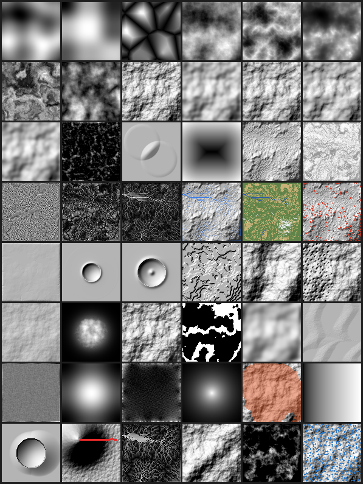

# Terrain Studio — node-based WebGL terrain generator

A self-contained, single-file terrain generator that runs in the browser: a **node graph** drives a
live **WebGL 3D viewport**. It's the interactive companion to this skill's pure-NumPy `reference-impl/`
atoms — the same algorithms (fractal noise, domain warp, thermal & hydraulic erosion, histogram
equalisation, slope/height masks, real-DEM import) exposed as a graph you build and tune by eye.

**Open `index.html`** in any modern browser — no build step, no server, no dependencies. Everything
(UI, terrain kernels, WebGL renderer) is inline in that one file.



## What it does

- **Production authoring workspace**: the **stacked vertical layout is the first-run default**,
  with the live rendering above the graph while Properties remains full-height; switch to the side
  layout when wanted. The rendering has a
  real browser **fullscreen** control, deliberate **Hero / Plan** cameras, and an **Output / Selected**
  display flag so any intermediate node can drive the viewport without rewiring the graph. Graph edits
  are undoable/redoable (including topology, node moves, parameters and terrain definition), and each
  node reports its last evaluation time directly on the graph.
- **Node graph** (the core): drag nodes, wire outputs into inputs, and every node shows a live
  hill-shaded **thumbnail** of its own output — so you read the pipeline at a glance.
- **Scene-linear deferred PBR surface + SatMap colour**: the terrain renders through a two-stage
  deferred pipeline. Authored SatMap colours are decoded from **sRGB to scene-linear albedo before
  lighting**, and the final HDR image is exposed, ACES-tonemapped, then encoded back to sRGB. This
  fixes the chalky, low-contrast result caused by lighting display-space colours. The terrain pass
  writes only **albedo** (SatMap colour + terrain-aware mineral exposure + snow) and per-material
  **perceptual roughness** into a G-buffer; a fullscreen composite then does all lighting:
  *all* the lighting from the height field:
  - **per-pixel surface normals** reconstructed from central differences of the height texture
    (finer than the mesh vertex normals),
  - **sun** (Lambert) **+ hemispheric sky-irradiance ambient** — a warm ground-bounce → cool sky-dome
    gradient, so shadowed faces read *blue* instead of flat grey (the single biggest realism lever),
  - an energy-balanced **Cook–Torrance GGX** BRDF with Smith visibility and Schlick Fresnel, driven by
    soil / rock / snow roughness, plus derivative-based specular anti-aliasing,
  - subtle multi-scale, non-directional albedo breakup and material normals, so a SatMap does not read
    as smooth elevation bands while still remaining an unlit material map,
  - **soft ray-marched cast shadows** toward a **movable sun** (azimuth + elevation sliders) and
    **horizon ambient occlusion** (crevice darkening), folded into the same pass,
  - a richer **analytic sky** (horizon→zenith gradient, sun disk, aureole, near-sun horizon scatter)
    and distance-tinted **aerial perspective**, resolved through **ACES** tone mapping and
    **supersampled** for anti-aliased silhouettes,
  - **Realistic, Clay, Albedo, Slope, and Normals** viewport styles. Albedo is deliberately unlit, so
    SatMaps can be judged without the sun; Clay isolates terrain form; Slope and Normals expose data.
    Sun azimuth/elevation, **exposure in stops**, and **haze** are live look-development controls.
  - Water uses dielectric Fresnel (F0 ≈ 0.02), wavelength-dependent **Beer–Lambert absorption**, a
    screen-stable shoreline, restrained ripples, and reflected scene-linear sky radiance.
- **SatMaps genuinely derived from real satellite imagery** (not hand-picked): pick from ~26 palettes
  in the viewport. The core set (Temperate, Alpine, Verdant, Canyon, Arid, Dune, Volcanic, Mars, Lunar,
  Arctic, Tundra) plus **Estuary/Dusk** and a **13-strip set** (Steel, Moss, Pewter, Copper, Chrome,
  Ash, Terracotta, Savanna, Frost, Fjord, Amber, Brass, Harvest) **traced from Gaea SatMap screenshots**
  — each gradient strip read as a per-column median of the bar (Dusk being the selected in-range window).
  Of the core set, **seven are extracted from real public-domain top-down satellite/aerial imagery** — the
  source image is ordered by luminance into an elevation ramp by the skill's own `reference-impl`
  `extract_satmap`, following the colour-lookup workflow Gaea documents, done reproducibly rather
  than by eye. Derived: **Alpine** (Ligurian Alps), **Dune** (Rub′ al Khali / Terra), **Verdant**
  (Amazon / Landsat), **Volcanic** (Icelandic lava / ESA), **Arctic** (Greenland), **Tundra**
  (Iceland / ESA), **Lunar** (LROC). The pipeline (`satmaps/extract_satmaps.py`) fetches from
  Wikimedia Commons (satellite-image categories guarantee orbital framing — no sky to pollute the
  ramp), masks out space + open ocean, and rejects false-colour / off-biome frames with a hue guard;
  provenance and licences are recorded in `satmaps/derived.json` (NASA/USGS = public domain, ESA =
  CC BY). Temperate/Canyon/Arid/Mars stay authored (labelled as such) where no on-biome true-colour
  source was found.
  - **Make your own in-app — SatMap Studio** (the **＋LUT** button). A **SatMap LUT is a 1-D colour
    gradient** — low elevation on the left → high on the right, baked to a 256-px strip and indexed by
    each point's normalised height. SatMap Studio is a **gradient editor** in a full-width bottom sheet
    (the 3D viewport stays visible above and **recolours live** as you edit):
    - **Drag stops** along the bar to set their elevation, **click the bar** to add one, **click a stop
      then pick its colour**, and remove with **－ Stop**. The **current terrain's elevation histogram**
      is drawn behind the bar, so a stop's position maps to how much of the surface it paints.
    - **Start from…** a built-in SatMap and tweak; toggle **Smooth ↔ Bands** interpolation; **Reverse**
      the ramp; and apply global **hue / brightness / contrast / saturation**.
    - **From image…** opens a photo panel: **Auto-extract** orders the whole image by luminance into a
      ramp (the same method as the derived built-ins), or click the image to **eyedrop** the selected
      stop's colour.
    - **Apply** bakes the LUT into the SatMap list and selects it. (Ordering is by brightness, the usual
      elevation proxy; the colour picker and eyedropper let you override any stop.)
- **Live 3D viewport** with **multi-stage rendering**: WebGL2 lit terrain mesh (the five render
  styles above, orbit + zoom, wireframe), rendered in two passes —
  1. **Opaque terrain + snow** — the **Snow** effect node produces a world-metre thickness field.
     Its mass-conserving stability pass unloads steep faces into gullies and hollows, physically
     displaces the mesh, rebuilds its normals, and drives a rough snow material. Temperature, lapse
     rate, mixed rain/snow, degree-day melt, and equator-facing solar warming determine what remains.
  2. **Water surface + composite** — a rasterized fluid-depth layer followed by screen-space
     refraction, absorption, Fresnel reflection, restrained animated ripples, and shoreline foam.
     It uses a **hydrologically
     correct water surface**, not a flat cut through the heightmap:
     - **Lakes** fill each closed basin to its own **spill level** via a
       **priority-flood depression fill** (Barnes 2014) — flat lakes whose edges follow the basin
       rim, at the right elevation for each basin.
     - **Rivers** are the **flow-accumulation** drainage network (D8 on the filled DEM): **River
       network** changes its catchment threshold and **River depth** changes its visible water film.
       A sub-visible epsilon gradient routes flow across filled flats instead of terminating in them.
     - **Sea level** mode instead lays a flat ocean at a chosen level — the simple, level-based water.
     The water-surface normal is computed from that surface (flat in lakes, sloped along rivers). This
     is the same `priority_flood_fill` + `d8_accumulation` pair the reference-impl uses.

  **Surface-aware deferred compositing.** On WebGL2 the terrain first renders into an offscreen
  **colour + depth** G-buffer. The hydrological surface is then rasterized into a separate
  **water-mask + water-depth** layer, after copying terrain depth so only genuinely visible fluid wins.
  A fullscreen triangle reconstructs both the lakebed and the actual fluid-plane world positions and
  composites **sky** and **water** analytically. Because it has the
  depth buffer and the terrain colour, the water gets **refraction** (the lakebed sampled with a
  normal-based offset), **Beer–Lambert depth absorption** from the real view-ray thickness, a
  **Fresnel** sky reflection, sun glint and soft foam — quality a forward transparent plane can't
  reach. (WebGL1 falls back to the forward geometry-water pass; wireframe uses it too. The one
  tradeoff is that terrain silhouettes lose the forward MSAA, softened by the device-pixel-ratio
  supersample on hi-dpi displays.)
- **Real heightmaps as a base**: the **Import DEM** node has a one-click **Use real SRTM sample**
  (a real public-domain USGS/SRTM crop of the Colorado Plateau, embedded in the page) *and* loads your
  own PNG or square 16-bit `.r16` raw — including real USGS/SRTM tiles exported from
  `reference-impl/heightfield_io.py`. So you can add erosion and effects to real-world areas, then
  **Export** the result as a heightmap PNG. (An in-browser live fetch of the USGS/SRTM buckets isn't
  possible — they send no CORS headers — which is why `heightfield_io.py` does the fetching and the
  Studio imports the file, plus the embedded sample for zero-setup real terrain.)

### Node library (mirrors the reference-impl atoms)

| Group | Nodes |
|---|---|
| **Generator** | Perlin fBm · **Simplex fBm** (triangular-lattice, isotropic noise) · Ridged MF · Voronoi (F1/F2−F1) · Gradient (linear/radial) · Constant · **Layout** (authored vector skeleton with per-vertex elevation) · **Mountain** (Mountain / Mountain range; 4 shape families × 5 geomorphic types) · **Shape** (SDF placement mask) · **Import DEM** (file *or* one-click real SRTM sample) |
| **Combine** | Blend (factor or mask) · Combine (add/sub/mul) · Max/Min · **Smooth Max** (crease-free union) · Smooth Min (intersection) · **Stamp** (place a patch onto a base through a mask) |
| **Filter** | Warp (domain warp) · **Transform** (translate/rotate/scale about a pivot, maskable, exact over procedural chains) · Terrace · Levels · Curve (bias/gain) · **Histogram EQ** · Blur · **Sculpt** (Raise/Lower/Flatten/Smooth through a mask) · Clamp · Invert |
| **Erosion** | Thermal (talus) · Hydraulic (droplet sim, brush-distributed scour) · **Stream power** (fluvial incision, Braun–Willett implicit solver) |
| **Mask** | **Draw Mask** (editable vector brush strokes) · Slope select · Height select · **Temperature select** (physical °C biome band) |
| **Data map** | **Height** · **Sun Shadow** (terrain-horizon visibility) · **Temperature** (base climate field) · **Temperature Modify** (localized heat/cooling) · **Slope** · **Curvature** (profile/plan/mean) · **Flow** (accumulation) · **Occlusion** (horizon AO) · **Deposits** (soil) · **Wear** · **Peaks** · **Texture** (slope+soil+flow composite) |
| **Effect** | **Water** (Hydrology = lakes + rivers, or Sea = a flat level) · **Snow** (metre-depth placement, melt, avalanches) · **SatMap** (one colour LUT) · **Color Erosion** (pigment transport/deposition) · **Weathering** (exposure/recess ageing) · **Color Blend** (two branches + mask) · **Color Mixer** (ordered 2–15 layer stack) |
| **Output** | Output (drives the viewport / export) |

**Water extent, snow and colour are nodes, not global switches.** Add and wire them into the pipeline; for example,
`… → erosion → SatMap → Color Erosion → Weathering → Output`. The viewport picks up whichever effect nodes
feed the Output. The **Water** node's **Mode** is either **Hydrology** (basin lakes + downhill rivers) or the
simple **Sea level** (a flat ocean at a level). Wave pattern, strength, scale, speed, and refraction are
**global renderer settings** in the viewport's Water Surface flyout: they describe how every fluid surface
is viewed, not where water exists. Waves are sampled at the reconstructed water-plane world position—not the
terrain/lakebed position—so motion cannot look glued to the heightmap. Effect nodes pass height through unchanged and add
or transform a separate scene/colour stream, so deleting one removes just that effect.

The default terrain ships with the full surface graph already wired:
`Thermal → SatMap → Color Erosion → Weathering → Water → Snow → Output`, plus
`Thermal → Deposits → Color Erosion.Sediment` and the explicit climate branch
`Weathering → Height → Sun Shadow → Temperature → Temperature Modify → Snow.Temperature`. Water is deliberately before
Snow: open liquid masks terrain snow out, while frozen standing water can receive a separate raised
snow-on-ice layer. Its Snow node starts with a 3 m settled-snow event, temperature/lapse melt, aspect
warming, and avalanche settling. The renderer supplies subtle animated ripples globally.

**Art direction — Shape masks and the universal Mask input.** A procedural graph that only generates
*everywhere* can't be directed, so two things make it placeable, mirroring Gaea (where "almost every
node contains a Mask input port… the processing of that node is applied only within the masked area"):

- A **Shape** generator — an SDF placement mask (circle / box / line) with position, size, aspect,
  rotation and a soft **falloff**, authored as a fraction of the terrain so it stays put when the
  resolution changes. Like Gaea's Mask-as-Primitive it is *both* a mask and a heightfield: wire it into
  a Mask input to confine an effect, or erode it directly into a landform.
- A **Draw Mask** node for artist-authored roads, corridors and regions. **Draw on terrain…** opens a
  plan-view editor over the optional Reference input with Draw/Erase, width, hardness, opacity, stroke
  undo and clear. Strokes are stored as normalized vectors rather than a fixed-resolution bitmap, so
  masks painted at 512² remain crisp when the graph builds at 2K or 4K.
- A mask-aware **Sculpt** merge modifier. Feed the existing terrain into **In**, Draw Mask into
  **Mask**, then choose **Raise**, **Lower**, **Flatten**, or **Smooth**. The modified copy is blended
  back only through the mask, so outside the painted road or region stays bit-identical. Blur the mask
  before Sculpt when a road needs broad, soft shoulders.
- A **Mask** input on **Thermal**, **Hydraulic**, **Warp**, **Terrace**, **Blur**, and **Sculpt** — the effect runs,
  then applies only where the mask is bright (`base + (modified − base) · mask`). Because it is a
  post-process, changing the mask never re-runs the erosion. Verified: with a circular Shape mask, mean
  change inside the mask is 5.2e-4 and **outside is exactly 0**.

Both mirror `reference-impl/placement.py` (`disc`/`rect`/`capsule`/`polygon`/`path_mask`,
`apply_masked`, `stamp`), where placements are authored in **metres**.

**Placing a feature takes three things**, and the studio has one node for each:

| | Node | Question it answers |
|---|---|---|
| **Transform** | Filter ▸ Transform | *Where does it go, which way does it face, how big is it?* |
| **Placement mask** | Generator ▸ Shape | *How far does it reach, and how soft is the edge?* |
| **Stamp** | Combine ▸ Stamp | *How does it meet the terrain already there?* |

The **Transform** is a full TRS: **Move X/Y** (shown in metres against the terrain definition),
**Rotation**, **Scale** + **Scale Y**, and a **Pivot**. Rotation is about the **up axis** — the only
rotation a heightfield admits, because tipping the surface would make it multi-valued, two heights over
one point. The **Pivot** is what rotation and scale turn about: leave it centred to spin a ridge in
place, move it to swing that ridge around a point instead. It also has a **Mask** input, so a move can
be confined — verified, change outside the mask is **exactly 0**.

**Stamp** is `placement.stamp`: **Max** unions a landform in without trenching what is already there
(the default, and the only mode that cannot dig a hole), **Add** accumulates relief so overlapping fans
build into a bajada, **Replace** overwrites — which only reads well inside a soft-edged mask. Without a
Mask the patch applies everywhere it is defined; the mask is what turns a global combine into a
*placement*.

Verified in `_verify_trs.js` — the placed centroid lands exactly where asked (`0.7, 0.4` requested and
measured); a 90° turn about the tile centre swings a disc from `(0.75, 0.5)` to `(0.5, 0.75)` with its
radius preserved, while the same turn about a pivot **on** the disc leaves it at `(0.75, 0.5)`; scale
gives **4.00×** and **0.25×** area for 2× and 0.5× exactly as the square law demands; and Stamp's Max
never drops below the base, Add accumulates, Replace overwrites, `Amount 0` and a missing Patch are both
the identity.

Exact and raster sampling describe the *same* placement including the pivot: correlation **0.9977**
across the tile interior. Over the whole tile it drops to 0.944, and that gap is not disagreement about
placement — it is the two modes' different edge policy, since exact mode has real terrain past the old
tile edge where raster has clamped smear. Scoring the interior separates the two.

### Tectonic uplift — Voronoi plates as the structural skeleton

Ported from `reference-impl/tectonics.py`'s `plate_uplift` (chapter 02). Voronoi cells are the classic
model for plate and block structure, but raw Voronoi edges are dead straight and that is the giveaway
in any plate map — so the coordinates are **domain-warped** before assignment and the sites are
**Lloyd-relaxed** so plates come out evenly sized instead of slivered. Each boundary is classified from
the relative velocity of its two plates — continent–continent collision, subduction, island arc, rift
(diverging, so subsidence) or transform (shear, ~no uplift) — and the uplift is diffused **inland**
over the orogen width, because a mountain belt is a broad welt rather than a line.

Its purpose is to drive Stream power's **Uplift** input: **this gives the structure, the rivers give
the topography.** F-tier — a plausible planar plate sketch, not plate physics.

Verified: orogen width monotonically widens the belt (0.019 → 0.063 → 0.131 of the tile), more plates
give more boundary, warping relocates 21% of belt cells, and handing the result to stream power yields
terrain **4.8× more textured than the uplift that produced it** with a drainage network reaching 1434
cells.

**A continent rises as a whole, not only along its belts.** Uplift confined to boundary belts leaves
the rest of the tile at base level, so the carved result came out **90% dead flat with razor blades
where the belts were** — slope median 0 and p90 0.47 against a real SRTM tile's 2.45 and 9.26, with a
maximum of 44.3 against the real tile's 22.8, i.e. edges twice as steep as anything real. **Continental
uplift** restores the per-plate base the reference includes, and the land mask is blurred over the
orogen scale so plate margins are shelves rather than cliff walls.

**The slope distribution is checked against the embedded real SRTM tile**, which is the strongest
grounded test in the studio and the thing that identified "spiky and erratic" precisely:

| | median | p90 | p99 | max |
|---|---|---|---|---|
| real SRTM | 2.45 | 9.26 | 15.72 | 22.8 |
| tectonic → stream power, shipped defaults | 3.72 | 10.27 | 16.49 | 24.8 |

Within about 1–2 units at every percentile. One caveat worth stating: the embedded DEM is the Colorado
**Plateau**, so matching its slope distribution does not by itself validate mountain-*range*
morphology — it rules out razor edges and dead-flat plains, not much more.

**Zero has to mean zero in an uplift field.** Rifts contribute *negative* boundary values, and
normalising the result mapped that negative floor to 0 — pushing "no uplift" up to the middle of the
range. Measured, the 25th, 50th and 75th percentiles all sat at **0.377**: a constant uplift over most
of the tile, which is why everything came out mountainous instead of just the belts. Clamping
subsidence away and scaling by the peak fixed three separate failing assertions at once — belt width,
plate count and drainage all became monotonic — because they were one bug, not three.

### Stream power — the process that organises a landscape

`dh/dt = U − K·A^m·S^n` (n = 1), Braun & Willett 2013's O(N) implicit solver, ported from
`reference-impl/erosion_streampower.py` where it is cross-validated against Landlab.

This is the piece that was missing, and its absence explains a lot. Drainage area **A** is what makes
valleys join into a tree and deepen downstream, so ridges emerge as *what is left between them*.
Droplet erosion cuts local gullies; this builds topography. A mountain is not an object you add — it
is the residue after a river network incises high ground, which is why authoring the summit directly
kept producing a children's-drawing triangle.

Verified against the slope–area law, not by eye: at steady state `S ∝ A^(−m/n)`, a straight line of
slope −m on a log–log plot of channel cells.

| m | fitted exponent | error |
|---|---|---|
| 0.4 | −0.387 | 0.013 |
| 0.5 | −0.490 | 0.010 |
| 0.6 | −0.591 | 0.009 |

all inside the reference's 0.1 tolerance, and stable across 100 / 200 / 400 / 800 iterations
(−0.468, −0.505, −0.490, −0.494) so it is converged rather than passing at one lucky count.

**Getting that oracle to work exposed a harness bug, not a solver bug.** Driven from structured fBm
with unbalanced uplift, the fitted exponent wandered between −0.28 and +0.02 and r² collapsed to 0 —
because that regime never reaches steady state. Reproducing the reference's own conditions (small
uniform noise so the network self-organises, `U·dt = K·dt`) it lands on −m immediately. Working code
came close to being "fixed" on the strength of a broken measurement.

**Hillslope diffusion is the other half of the equation.** The full detachment-limited form is
`dh/dt = U − K·A^m·S^n + D·∇²h`. Stream power sharpens interfluves without limit — run it alone from a
smooth uplift field and you get a field of razor blades. Diffusion relaxes them, giving hillslopes a
length and valleys a width. It runs *inside* the loop; one relaxation afterwards cannot undo ridges
that sharpened for 200 iterations. Measured, ridge sharpness falls **0.048 → 0.032 → 0.024 → 0.016**
across the Hillslope range while relief stays flat — relaxing ridges and flattening a landscape are
different things. (`reference-impl` has `hillslope_diffuse` but never couples it to stream power,
which is a gap there too.)

**Terrain built entirely by uplift and incision.** Wire a field into the **Uplift** input and the
rivers carve it: feed in a smooth featureless blob (texture 0.0006) and the result carries texture
0.0235 — **39× more structure than went in**, all of it residue between channels. No summit is
authored anywhere. This is the workflow the node exists for, and the answer to why authoring the
summit directly kept producing a children's drawing.

**D/K sets drainage density.** Past a point, diffusion does not blur the channel network — it erases
it:

| Hillslope (D·dt at K·dt = 2) | max drainage area | fitted exponent | r² |
|---|---|---|---|
| 0 | 3969 | −0.490 | 0.62 |
| 0.01 | 2758 | −0.521 | 0.69 |
| 0.04 | 973 | −0.531 | 0.18 |
| 0.08 | 707 | −0.352 | 0.06 |

That was nearly misread as "diffusion contaminates the fit". Raising the area threshold to escape the
contamination made the exponent *worse* (−0.35 → −0.61 → −1.11), and above A = 1000 there were **zero**
channel cells — because there was no fluvial domain left to fit. Higher D means fewer, longer
hillslopes and a sparser network, which is the textbook D/K competition rather than a defect.

**Uplift 0 will erode your terrain away, and that is correct.** Rivers reduce a landmass that has
stopped rising. Measured on a Mountain, peak height goes **0.687 → 0.530 → 0.196 → 0.000** as incision
rises with uplift at 0. The shipped defaults sit well clear of that (they keep 77% of peak relief while
still measurably carving), and the node says so in its panel rather than letting you discover it.

### Building a mountain range from placed massifs

The reference implementation prescribes the workflow in `landforms.mountain`'s own docstring — *"place
it, combine several (`np.maximum` / `ops_filters.smax`), then run a real hydraulic + thermal pass"* — so
the studio has a node for each step.

1. **Mountain** ×N, in **Mountain** landform mode. The primary mass is a variable-height, asymmetric
   crest ribbon with connected cellular shoulders and broad, unequal face basins — not a radial cone
   with grooves stamped into it. **Shape family** selects one of four clean-room uplift generators:
   **Dominant peak**, **Compound peaks** (default), **Ridgeline**, or **Broad dome**. Independently,
   **Mountain type** selects **Basic**, **Eroded**, **Old**, **Alpine**, or **Strata**; these change the
   core profile, cellular response, basin expression, and process history, not just viewport shading.
   Placement is built in (Position / Reach / Trend), so the feature is evaluated directly in world
   space rather than moved as a finished raster. Typical warmed default build: about 250–300 ms at
   192².
2. **Smooth Max** to union them. Union of two *surfaces* is a **max** — the merged terrain is whichever
   is higher.
3. **Thermal** or **Hydraulic** over the union. This is the step that actually makes it a *range*.

### Art direction: author the skeleton, generate the detail

All three reference tools converge on the same idea, and it is not "a mask that gates an effect":

| Tool | How you art-direct |
|---|---|
| **World Machine** | [Layout Generator](https://help.world-machine.com/topic/layout-generator/) — vector polygons/paths/primitives with per-shape elevation, opacity, falloff distance *and profile* (linear / squared / sqrt / S-curve), positive or negative, "breakup" fractal participation, bezier splines, and **per-vertex elevation with keypoints**. Source mode generates; Modifier mode embeds into incoming terrain. Overlaps resolve by greatest height. |
| **Houdini** | [HeightField Project](https://www.sidefx.com/docs/houdini/nodes/sop/heightfield_project) ray-casts real 3D geometry (curves, meshes) into the heightfield with Replace/Add/Multiply/Max/Min, and [Mask by Feature](https://www.sidefx.com/docs/houdini/nodes/sop/heightfield_maskbyfeature.html) derives selections from height, slope, curvature and direction. |
| **Gaea** | Geo primitives (Mountain, Ridge, Crater, Badlands, Dunes), Mask as a primitive, and an [explicitly retired Draw node](https://docs.quadspinner.com/Reference/Primitives/Draw.html) now rebuilt in Gaea 3 to combine vector *and* brush modes. Erosion2 exposes **Shape** and **Shape Sharpness** to trade authored shape against simulated reshaping. |

The **Layout** node is that idea: a list of vector shapes carrying elevation, evaluated as distance →
falloff profile → combine. Academically this is [Hnaidi et al. 2010](https://onlinelibrary.wiley.com/doi/abs/10.1111/j.1467-8659.2010.01806.x),
curves carrying elevation/slope/roughness constraints with the surface diffused between them.

```
path width=0.03 falloff=0.26 profile=scurve op=max breakup=0.45 seed=3
  0.10,0.70,0.35  0.28,0.62,0.85  0.44,0.66,0.55
  0.62,0.52,1.00  0.80,0.46,0.62  0.93,0.52,0.30
```

Shape kinds are `path`, `point` and `poly`; ops are `max` (greatest height wins, as in World Machine),
`add`, `sub` and `replace`; falloff profiles are `linear`, `squared`, `sqrt` and `scurve`; `breakup`
lets a fractal distort the outline so it is not geometric. With no **Base** wired the node generates
(Source); wire one and it embeds instead (Modifier).

**Elevation is per vertex, and that is the whole point.** A path is not a constant-height ribbon — it
carries a height profile along its length, so summits fall out at the high vertices, saddles at the low
ones, and faces fall away either side. Verified in `_verify_layout.js`: vertices authored at
0.30 / 0.90 / 0.45 / 1.00 measure **0.31 / 0.90 / 0.46 / 1.00**, values between vertices interpolate,
and the resulting spine scores 4 summits and 2 saddles along its crest with height falling away
perpendicular. The four falloff profiles are all distinct at the same distance (sqrt 0.698, linear
0.488, scurve 0.482, squared 0.238); overlapping shapes resolve to the greater height; Modifier mode
leaves the base at 0.25 away from the shape and lifts it to 0.80 on it.

#### Mountain: public Gaea contract, clean-room implementation

The public Gaea references clarify the abstraction. The current
[Mountain](https://docs.gaea.app/reference/nodes/terrain/mountain) is described as a modulated Voronoi
pattern plus distortions and exposes five styles: Basic, Eroded, Old, Alpine, and Strata. The older
[Mountain reference](https://docs.quadspinner.com/Reference/GeoPrimitives/Mountain.html) explicitly
says its Type control selected “four different generative algorithms,” but does not publish those
algorithms. Gaea's older [geo-variant Voronoi](https://docs.quadspinner.com/Reference/Primitives/Voronoi.html)
does publish several mountain-oriented cellular forms. The studio therefore implements the observable
contract without claiming proprietary internals: four genuinely different cellular uplift families,
followed by five genuinely different geomorphic types.

The topology gate uses **topographic prominence**: flood the terrain top-down, and when two basins
merge, the lower summit's prominence is its height above that saddle. Unlike the previous
one-summit-only gate, the expected result depends on the selected shape family.

| | summits >10% relief | 2nd/1st prominence | texture vs a cone |
|---|---|---|---|
| ideal cone | 1 | 0 | 1× |
| **Mountain — Dominant peak** | **1** | **0.066** | — |
| **Mountain — Compound peaks (default)** | **3** | **0.138** | **96.3×** |
| **Mountain range** | 12 | 0.353 | — |
| ridged fBm | 122 | 0.553 | — |

Note what the first two columns cannot tell you: a smooth cone scores perfectly on both. Texture is the
column that catches it, which is why it is measured now — and why the renders get looked at.

The four Mountain shape families are deliberately different landforms:

- **Dominant peak** favours one strong cellular uplift and a short hero summit.
- **Compound peaks** joins several high uplift cells through real saddles; it is the natural default.
- **Ridgeline** lengthens the connected crest and favours cellular boundaries.
- **Broad dome** favours cell interiors, wider faces, and a broader summit shoulder.

The five Mountain types then alter that chosen mass: **Basic** is restrained, **Eroded** deepens
cellular faces and runs hydraulic weathering, **Old** broadens and relaxes the profile while retaining
residual gullies, **Alpine** narrows and sharpens the rock divisions, and **Strata** applies a layered
elevation response. With weathering disabled, the least pairwise normalized field difference is
**0.0675** between shape families and **0.0245** between Mountain types, proving both settings change
generator geometry.

**A good texture stack cannot rescue the wrong mass.** The rejected version was a convex radial ramp
with summit-to-rim seams — the tipi tent failure. The current primary envelope is instead a
variable-height crest ribbon with unequal widths on its two faces. Connected cellular volumes add
shoulders and buttresses; broad basin heads begin at different crest positions; only then do meso
fracture and erosion operate. The editable skirt still supplies distinct upper-crag, shoulder, face,
talus, and pediment slope bands, but it no longer defines the whole landform as a solid of revolution.

  **Shape variation — so the mask does not stamp every mountain into one shape.** The seed alters
  reach, aspect, trend, and the low-order outline while leaving Position exact. The default Compound
  family is already elongated at zero variation; increasing the control broadens the distribution of
  areas, orientations, and aspect ratios across seeds.

  | Shape variation | elongation range | area spread |
  |---|---|---|
  | 0 | 1.90 – 1.96 | 0.011 |
  | 0.55 (default) | 1.44 – 2.28 | 0.105 |
  | 1.0 | 1.14 – **2.45** | 0.181 |

  **Character — macro structure, not a noisier cone.** Character expands the uplift cluster, warps
  level sets, and changes the balance between the crest ribbon, shoulders, and cellular crags. The
  authored Position remains the dominant high area.

  Raw field correlation was discarded as a misleading metric because radial bulk dominates it even
  when the shoulders differ strongly. The replacement measures the mid-elevation contour and the
  normalised L1 difference against a 90° rotation. A cone scores **0.020** difference. With variation
  and baked weathering disabled to isolate this control, Character 0 / 0.3 / default 0.72 / 0.9 score
  **0.419 / 0.540 / 0.612 / 0.631**: the control changes macro shape, not just high-frequency texture.

  **The skirt is drawn, not typed.** The exponent is gone; the Mountain node carries a curve editor in
  the properties panel. X is distance from the centre (0 at the summit, 1 at the radius), Y is the
  elevation multiplier (1 → 0). Drag control points to shape the apron, click empty space to add one,
  double-click to remove; endpoints stay pinned in X so the curve always spans exactly centre → rim.
  Presets: **Cone**, **Apron**, **Sweeping**, **Plateau**.

  | | |
  |---|---|
  | Interpolation | Monotone cubic Hermite (Fritsch–Carlson) |
  | Baked to | 256-entry `Float32Array` LUT, once per evaluation |
  | Read as | one lerped lookup per cell — cheaper than the `pow()` it replaced |

  Monotone cubic rather than a plain bezier or Catmull–Rom for a specific reason: **an overshooting
  spline is an invalid envelope.** Above 1 puts terrain higher than the summit; below 0 puts it under
  the plane. Monotone cubic cannot overshoot by construction, so every curve an artist can draw is
  valid. Verified against a deliberately nasty control set (a near-vertical drop between two nearly
  flat runs): the LUT stayed inside [0, 1] and stayed monotone throughout. The bake also reproduces
  an analytic `(1−r)^1.4` preset to a max error of 0.011, with exact endpoints.

  The curve genuinely drives the landform — mean apron height at 70% of the radius, by preset:
  Plateau **0.0486**, Cone **0.0295**, Apron **0.0168**, Sweeping **0.0064**, all distinct and ordered as
  the shapes imply. A hand-drawn curve matching no exponent works the same. Dragging a control point
  in the live widget changes the terrain (mean |Δ| 0.0026 in the current interaction probe).

  The footprint cut is now **binary at the envelope's own support** rather than a linear collar over
  the last 6% of the radius. The collar was mine, added to kill erosion speckle, and it re-introduced
  exactly the hard seam it was meant to hide.

  **Drainage is topology, cellular structure is rock mass.** Mountain authors only a few broad,
  unequal basin heads beginning on different shoulders. A coarse distorted-cellular band divides the
  primary faces and a finer band fractures them; the hydraulic pass supplies the smaller connected
  flow hierarchy. **Drainage detail** changes basin and fracture scale; **Reduce details** suppresses
  the cellular/micro bands independently.

- **Mountain range** — `Massif crests` unioned into a small range, which is what `landforms.mountain` builds by
  design (its docstring: *"n_ridges crest lines unioned into a small range"*). Right for a shoulder or a
  plateau edge; wrong as the thing you place three of, because you would be unioning three small ranges.

**The controls own independent axes.** The current quality gate verifies Height is linear (0.5 gives
exactly half the pre-weathering peak), High Bulk has over 25% more mass than Low, Reduce Details cuts
Alpine fine energy by at least 18%, and Weathering produces a materially different surface. Drainage
  detail rises monotonically from 0.6× through 3.4×, spanning **2.9×** in scale-free fine energy instead
of reversing or saturating.

Two of the measurements used to check this were themselves broken and had to be thrown out: an angular
crest count saturated at ~130 regardless of input at 192², and requiring *exactly* one summit is what
let the smooth pyramid through. The invariants that survive are scale-free — fine-detail energy per
unit height, family-appropriate summit topology, few summits, pairwise generator differences, and
render review.

The primitive also stays strictly inside its own footprint (total height outside it is exactly **0**).
At 192² versus 384², including baked weathering, the 48² macro comparison has RMS **0.0062** and max
error **0.0375** (the raw fine-detail comparison is 0.0079 RMS); the landform therefore survives
preview/build resolution changes while resolution-appropriate fracture detail is allowed to differ.

**Every placed node gets its own random seed, and you can still change it.** Node parameters used to
be initialised straight from the type defaults, so three placed Mountains were three *identical*
mountains and the whole place-and-combine workflow was pointless. A node carrying a `seed` now gets a
fresh random one in **[0, 1 000 000]**, on placement and on duplicate alike — a duplicate is a new
feature, not a clone, while every other parameter is copied.

The trade that makes, stated plainly: a graph is no longer reproducible from its construction order,
because reloading re-rolls every seed. **Reproducibility comes from the seed values instead**, which is
why the control is a typable number field with a **↻** reroll button rather than a slider — a million
values through a few hundred pixels cannot address a specific one, and the earlier requirement was that
you be able to *change* the seed, not just perturb it.

Verified: three fresh Mountains get three distinct in-range seeds, a second batch rolls different ones
again, typing `4242` takes and reroll moves off it, and — the control that gives the rest meaning — two
nodes forced to the same seed produce **bit-for-bit identical** terrain while two different-seeded ones
differ by **33%** of total height inside the footprint.

Verified in `_verify_range.js`. Three Mountains placed at X = 0.26 / 0.50 / 0.74 land at measured
centroids **0.281 / 0.505 / 0.722**, each with relief ≈ 0.84–1.08. Unioning with Smooth Max instead of a
hard Max cuts the curvature crease along the seam (135 seam cells) by **74.9%**.

The finding worth stating plainly: **three unioned massifs are not yet a range.** Thresholded at 35% of
peak height, the union is **4 disconnected components**. After a thermal pass it collapses to **1**
component of 20,833 cells. Erosion is what knits separate massifs into one connected landform, which is
also why the primitive is documented as *"ready for further erosion"* rather than finished.

**Smooth Max vs Smooth Min.** These are not interchangeable, and the studio previously had only the
wrong one — `smin` was labelled "crease-free smooth union", which it is not for a heightfield. `smin`
takes the *lower* envelope: applied to three peaks it produced a mean height of **−0.037** and collapsed
relief to 0.047, deleting every summit. Smooth **Max** is the union; Smooth **Min** is the intersection,
useful for carving. Both ship, correctly described, mirroring `ops_filters.smax` / `smin`.

**The SatMap node — Gaea's colouring model.** In Gaea a SatMap is a *node* that colours a terrain through a
gradient, driven by **whatever grayscale you feed it** (not only height). This node mirrors that: it takes
an **In** (the height, passed through unchanged), an optional **Driver** input, and an optional **Mask**
input, with **Driven by** = *Driver ▸ / Height*, *Height*, or *Slope*. So you can colour by **elevation**
(the classic SatMap), by **slope** (cliffs one colour, benches another), or by **any field you wire into
Driver** (flow, a mask, a Blend). It picks a **Gradient** from the library (including ones you author in
SatMap Studio) and applies **Reverse**, **Range** (use just a slice), **Bias**, Roughness, HSL grading,
and **Enhance** (None / Autolevel / Equalize), matching Gaea's documented public SatMap controls.

- **Bind a SatMap to any Data map — the same channels Gaea offers.** In Gaea a SatMap is a CLUT fed by
  *any* grayscale, and what you feed it comes from the **Derive / Data Maps** family (Slope, Curvature,
  FlowMap, Occlusion, Peaks, Soil, RockMap, Texture…) or from simulation data outputs (Erosion emits
  **Wear** = where sediment was stripped, **Deposits** = where it came to rest, **Flow** = the path
  between). The **Data map** node group mirrors that set: **Slope**, **Curvature** (Zevenbergen–Thorne
  profile/plan/mean), **Flow** (priority-flood + D8 accumulation), **Occlusion** (horizon AO),
  **Deposits** (morphological closing − surface, i.e. what piles into hollows), **Wear** (convex, steep,
  exposed ground), **Peaks** (prominence over the local mean), and **Texture** (Gaea's composite
  slope + soil + flow driver). Wire any of them into a SatMap's **Driver** — or into a **Mask** — so
  colour follows rivers, cavities, sediment or ridges rather than only elevation. All mirror
  `reference-impl/analysis.py` + `flow.py`. *(Difference to note: Gaea's Erosion node emits Wear/Deposits/
  Flow as extra output ports of the simulation; our graph gives one output per node, so these are
  standalone nodes that derive the same channels from the height field.)*
- **Colour flows through the graph — branch, blend and stack.** Colour is resolved by walking the graph:
  a SatMap **composites its ramp over the colour already coming down its In chain** (so chaining
  `… → SatMap(base) → SatMap(rock) → Output` makes the second a normal masked overlay).
  **Color Erosion** and **Weathering** then transform
  that upstream colour as independent graph nodes; height-only nodes pass colour through unchanged. Each
  colour node can be masked and composited, and **Color Blend** merges any two colour branches—not only
  SatMaps. Wire any SatMap / Color Erosion / Weathering branch into **A** or **B**, then optionally feed a
  grayscale field into **Mask**. Color Blend exposes Gaea-style methods: **Blend, Add, Screen, Subtract,
  Difference, Multiply, Divide, Divide 2, Max, Min, Hypotenuse, Overlay, and Power**. The result is
  resolved per vertex into terrain albedo.
- **SatMap is a surface lookup, not hidden strata.** The layered sediment appearance comes from an explicit
  graph. Start with one or more SatMaps driven or masked by height, slope, curvature, flow, wear, and
  deposits; pass that colour through **Color Erosion** to transport upstream pigment downhill; then use
  **Weathering** to bleach exposed relief and darken protected recesses. A typical chain is
  `height → SatMap → Color Erosion → Weathering → Output`, with `Deposits → Color Erosion.Sediment`.
  This creates material/sediment-like surface layers without pretending that the 1-D SatMap itself is a
  subsurface geology simulation.
- **Every colour result remains blendable.** Color Erosion retains its transport **Blend** control and
  Weathering has physical **Amount** plus **Opacity** and **Blend mode**. SatMap, Color Erosion, and
  Weathering all accept masks; any output can feed **Color Blend**. **Color Mixer** is the layer-oriented
  convenience node: add, remove, and reorder from 2 up to 15 color inputs, with opacity and blend method
  per layer. Per-layer biome masks stay explicit in the upstream SatMap / Color Blend branch.
- **One SatMap, one gradient; biomes stay explicit.** A SatMap can receive another SatMap through **In**
  when the second node is a masked overlay. For a true biome split, branch the height into one SatMap per
  biome, derive a biome mask from slope / height / flow / climate, and merge the colour branches in
  **Color Blend**. Its Mask, Opacity, and full blend-method set make
  the transition visible and configurable instead of hiding a second gradient inside one SatMap node.
- **Visual SatMap library lives on the node.** The SatMap Gradient property opens a scrollable palette
  library rendered directly from the LUT stops that feed that node. The viewport has no global SatMap
  selector. Newly authored LUTs appear immediately after **Apply**.

With no SatMap node in the graph, the viewport uses a neutral inspection material; adding a SatMap node is
the only way to author a palette.
Each SatMap node also has **None / Low / Medium / High / Ultra Roughness**. It coherently perturbs the
lookup coordinate, matching Gaea's documented “scatter the pixels of the colour map” behavior instead of
adding directional light or indiscriminate RGB noise to the exported albedo.

## Controls

- The stacked vertical layout—rendering above the graph—is the first-run default. Use **⬌/⬍** in the
  top bar to switch between stacked and side layouts; an explicit choice persists.
- Use **⛶** in the rendering or <kbd>Shift</kbd>+<kbd>F</kbd> for rendering fullscreen.
- **Output / Selected** moves the viewport display flag between the final Output and the selected
  intermediate node. **Plan / Hero** switches between top-down inspection and the perspective camera.
- The rendering stays visually quiet: a compact right-side **icon rail** owns preview, camera,
  display, lighting, global water rendering, help, and fullscreen. Flyouts are mutually exclusive;
  the persistent gesture banner and large look-development panel no longer cover the terrain.
- The top bar keeps only frequent work visible: **Auto**, **Build**, history, import/export, and layout.
  The **Build profile** popover owns resolution/quality/GPU/Res Lock, while the searchable
  **Commands** menu (<kbd>Ctrl/Cmd</kbd>+<kbd>K</kbd>) holds graph locators, organization, toolbox,
  fullscreen, theme, and other occasional actions. This keeps the toolbar extensible at narrow widths.
- Choose **Realistic / Clay / Albedo / Slope / Normals** in the Display flyout. The Lighting flyout
  controls sun azimuth, elevation, exposure, and atmospheric haze.
- The **Water** node owns fluid extent and shoreline authoring. **Shore smoothing** filters only
  the signed-depth coverage used for rendering, preserving terrain and hydrology data; **Shore foam**
  controls the transition band. The viewport's global **Water Surface** flyout chooses **Cross ripples**,
  **Wind waves**, **Interference rings**, or **None**, then controls strength, scale, speed, and refraction
  for every Water node. Hydrology exposes Lakes, Minimum lake depth, River network, and River depth;
  Sea level hides those controls because it is an independent flat-water mode.
- Properties use mode tabs and show only settings that affect the active algorithm. This applies to
  Water, Hydraulic and Thermal erosion, Mountain/Mountain range, Gradient, Transform, and Sculpt;
  hidden values are preserved when switching modes.
- Select **Draw Mask** and choose **Draw on terrain…** to paint a reusable mask over its Reference
  input. For roads, connect terrain to Draw Mask.Reference and Sculpt.In, then Draw Mask to
  Sculpt.Mask; Flatten or Smooth produces the road bed without destructively editing the source.
- Undo/redo with the toolbar buttons or <kbd>Ctrl/Cmd</kbd>+<kbd>Z</kbd> /
  <kbd>Ctrl/Cmd</kbd>+<kbd>Shift</kbd>+<kbd>Z</kbd>.
- Open **＋ Nodes** inside the graph view for the searchable, category-grouped node toolbox. Clicking
  a toolbox item places it in the visible graph area and keeps the toolbox open for building a chain.
  **Double-click** empty canvas still opens the compact add-node menu at that exact position.
- **Right-click the graph** for **Organize all**, **Frame all**, Add-at-cursor, and the node toolbox.
  Right-click a node to organize its **connected branch**, only its **upstream** inputs, or only its
  **downstream** dependants; the same menu can frame the branch, preview, duplicate, or delete it.
  Organization uses a deterministic layered DAG layout with crossing-reduction passes, preserves
  disconnected graph islands, is undoable, and never evaluates or dirties terrain data.
- Drag a node's **right port** into another node's **left port** to wire them (cycles are rejected).
- Connections are first-class selections: click near a curve using its generous hit area to inspect
  its source, destination port, live field range, and state. A selected link gets a high-contrast
  stroke and a visible **×** handle; remove it with that handle, <kbd>Del</kbd>, the Properties panel,
  or its right-click menu. Right-clicking a connected input port opens the same menu, which keeps
  even very short links easy to reach. Connections can also be **Muted** without deleting them. Mask connections
  additionally report coverage and restate the `0 = bypass, 1 = apply` contract. Blend behavior stays
  explicit in Blend / Color Blend / Color Mixer nodes rather than becoming hidden edge processing.
- Click a node to edit its parameters on the right; **Duplicate** / **Delete**, press
  <kbd>Ctrl/Cmd</kbd>+<kbd>D</kbd>, or press <kbd>Del</kbd>.
  Deleting a mid-chain node **auto-bridges** its neighbours (its input source reconnects to its outputs)
  when the input is unambiguous, so the pipeline stays connected.
- Pan with **middle-drag** / space-drag / empty-drag; **wheel** to zoom the graph.
- In the 3D view: **drag** to orbit, <kbd>Shift</kbd>-drag or right-drag to pan, and **wheel**
  to cursor-focused deep zoom. The camera can dolly from a full-terrain view down to roughly
  `0.012` world units (about 30 m at the default 5 km extent); its near plane scales with distance
  so the inspected surface is not clipped. Press <kbd>F</kbd> to restore the framed Hero camera.
- **Auto** recomputes on every edit; turn it off and use **Build** for heavy graphs.
  Auto uses frame-coalesced, domain-aware invalidation: a burst of slider events evaluates the newest
  value once per display frame. SatMap, Color Erosion, and Weathering parameter edits preserve the
  downstream heightfield and update only terrain colour; Water updates only its fluid-surface buffers.
  Geometry, normals, height textures, and hydrology rebuild only when a height-producing node changes.

## Design — learning from Gaea, World Machine and Houdini

The brief was to learn from the strengths *and* weaknesses of the three baselines:

- **Adopted — Gaea:** a graph → viewport → properties loop, per-node thumbnails, a lockable
  intermediate preview, 2D/3D inspection, and beautiful, sensible defaults.
- **Adopted — World Machine:** a clean single-window device graph, live property preview, standard
  undo/redo, and an explicit Output node.
- **Adopted — Houdini:** movable display state for inspecting any intermediate result, per-node
  performance data, flexible pane layouts, and real procedural depth (grounded erosion, masks and
  composable warps) rather than a fixed pipeline.
- **Avoided:** Houdini's learning cliff (approachable palette grouped by category, no network of
  wrangles to learn), World Machine's dated UI (a modern, calm dark theme with a considered
  hypsometric-amber accent), and node sprawl (a curated, meaningful node set — every node maps to a
  grounded atom, nothing decorative).

The palette is cool deep-slate grounds with a single warm **hypsometric sand/amber** accent (elevation
/ contour, from topographic cartography) and a restrained water-teal for flow; monospace, tabular
readouts give it the feel of a precision instrument. Light and dark themes are both first-class.

## How it relates to the rest of the skill

Compute runs on the **CPU** (deterministic `Float32Array` heightfields) so it mirrors the verified
`reference-impl/` algorithms exactly; the **WebGL** layer is the 3D render. It is a *look-and-feel*
authoring tool — the numerically-validated implementations, oracles and cross-checks live in
`reference-impl/`. Verified headless with Playwright (graph eval, WebGL init, all interactions,
import/export — no console/page errors) during development.

### Spatial scale — the same effect over a bigger or smaller area

Two Gaea mechanisms, both now here:

- **Feature Scale** on **Thermal** and **Hydraulic erosion**. Gaea's Erosion node describes it as
  *"the lateral size of the largest erosion features in meters: width of largest valleys and ridges
  between them."* Ours is a `1×–8×` multiplier: the simulation is run on a grid that many times
  **coarser** (so its footprint is that many times wider) and only the *change* is resampled back onto
  the full-resolution terrain — fine detail survives, the erosion's footprint grows. The coarse cell is
  `feature × cellSize` metres, which is the lateral size the sim actually sees. Measured: the erosion
  delta widens 2.76 → 4.32 → 5.8 cells at 1× / 3× / 6× (the metric saturates for wide features, so read
  it as monotonic rather than proportional) — and it gets *faster*, 183 ms → 5 ms, since the grid is smaller.
- **Transform** node (Filter group) — Gaea's Transform: **Scale**, **Scale Y**, **Angle**, **Offset X/Y**
  and a Clamp / Wrap / Mirror edge mode, usable anywhere in the graph. Scale >1 magnifies. Verified
  against an analytic oracle: transforming a sine reproduces `sin()` at the inverse-mapped coordinate to
  **max error 0 / 0.0064 / 0.008** at 1× / 2× / 4× (bilinear interpolation error only).

**Place before you sample — the Transform is exact over a procedural chain.**
A procedural generator is a *function of position*, so evaluating it at transformed coordinates moves,
turns and resizes the feature **exactly**: the same function, sampled somewhere else. Transforming the
finished *raster* instead costs a bilinear resample, and bilinear is a low-pass filter. So the Transform
node checks what is upstream and picks:

| Upstream chain | Mode | What happens |
|---|---|---|
| Only generators (Perlin, Ridged, Voronoi, Gradient, Shape, Constant) and per-pixel ops (Levels, Curve, Clamp, Invert, Terrace, Blend, Combine, Max/Min, Smooth Min) | **Exact** | The placement is folded into the generators' coordinates and the chain is re-evaluated. No filtering, no detail loss — and the terrain *continues* past the old tile edge instead of clamping, so **Edges** is unused. |
| Anything that reads neighbours or the whole field — erosion, Warp, Blur, Histogram EQ, an imported DEM | **Raster** | The finished heightmap is resampled, as in Gaea and World Machine. Move the Transform *below* the erosion to get the exact path back. |

**Sampling** (*Exact* / *Raster*) forces the choice, and the properties panel says which one is live.
Stacked Transforms **compose into one matrix**, so N moves still cost exactly one evaluation — this is
`reference-impl/placement.py`'s `affine` / `compose` / `sample_coords` in normalised tile units, where
`sample_coords` applies `M⁻¹` because the feature moves by `M` while the *sampler* moves the opposite way.

Measured on fBm as mean |laplacian| (`_verify_exact_transform.js`) — exact placement loses **none** of the
fine detail at any depth, while each raster hop is another low-pass:

| Operation | Detail lost, raster | Detail lost, exact |
|---|---|---|
| 2× magnify | 27.2% | 0% |
| 1 non-integer move | 24.7% | 0% |
| 4 chained moves | 53.8% | 0% |

Also verified: identity is **bit-for-bit** the untransformed field (max diff `0`); the exact 2× result
matches an independent direct evaluation of the transformed coordinates to **max diff `0`**; `2× ∘ 2×`
equals a single `4×` to **`0`** in both matrix and field; the graph picks *exact* for a Perlin chain and
*raster* after a thermal node; and **CPU/GPU parity survives the transform** (max diff `2.5e-5`, the same
float32 floor as before — the placement matrix is a shader uniform, so both paths sample identical
coordinates).

### Terrain definition (real-world scale) and **Real Scale**

Deselect everything and the properties panel shows the **Terrain definition** — the world this heightfield
represents, in metres. Defaults match Gaea's: **5000 m across × 2600 m tall**, a **vertical ratio of 0.52**
(`height ÷ scale`), which is also the viewport's vertical exaggeration. Cell size is `scale ÷ RES`
(26 m at 192², 4.9 m at 1024²). It also owns the shared **sea-level temperature**, **temperature
lapse rate**, **climate sun elevation**, **latitude**, and **map north**. The panel reports the derived 0 °C freezing altitude.
North is authored clockwise from the heightfield's top edge; latitude decides which side points toward
the equator. The viewport compass projects both directions through the orbit camera, and the temperature
chip reports air temperature at the terrain under the camera focus; click it to toggle °C / °F.

That is what makes slope **angles** physical, so — as in Gaea, where *"the only place the terrain scale
affects how your terrain is processed is when `Real Scale` is turned ON in the Erosion, Snow, or Thermal
nodes"* — the **Thermal erosion** node has a **Real Scale** switch. With it on, `Repose angle` is a true
angle: the per-cell drop becomes `tan(angle) · cellSize ÷ height`, which is *inherently* resolution
independent. Verified — a 35° repose stays exactly 35° at 128², 192², 256² and 512², with the per-cell
drop halving as the cells do.

### Snow, ice, and a shared freezing climate

The Snow node keeps bedrock unchanged and computes a separate `SnowField.depthM` in **world metres**:

1. **Placement:** settled snowfall is partitioned between rain and snow across a −3 °C to +2 °C
   transition. Temperature comes from Terrain Definition: sea-level temperature minus the global
   lapse rate times elevation.
2. **Insolation + ablation:** an equator-side climate sun supplies incidence from slope/aspect, then
   a logarithmic horizon march casts shadows from both nearby and distant terrain. Two separable
   spatial blur passes turn binary visibility into soft penumbra/diffuse exposure. That spatial map
   adds solar warming before positive temperature removes depth with a configurable degree-day
   factor. Rotating map north, changing hemisphere, changing climate sun elevation, or sheltering a
   slope behind a ridge therefore changes which snow survives. **Height**, **Sun Shadow**, and
   **Temperature** are explicit Data map nodes, so these fields can be previewed, blended, masked, and
   reused elsewhere. The Temperature node owns editable numeric fields for **sea-level temperature**,
   **altitude lapse rate**, and **solar warming**; it combines those with Height and Sun Shadow to
   generate the base map. These are edit boxes with physical units, not narrow look-development
   sliders.
3. **Temperature composition:** the map is not metadata attached to its generator. Its physical
   Celsius contract follows the field through downstream Filter and Combine nodes. **Temperature
   Modify** adds/removes degrees, approaches a target, or enforces a minimum through an optional
   Source and Mask. A lava simulation can therefore heat its footprint, a shadow/microclimate branch
   can cool a valley, and every downstream consumer sees the edited result. The scalar transport
   encoding spans −100…1400 °C; physical Celsius values remain available to nodes and the viewport.
   **Temperature Select** converts Celsius intervals into ordinary 0–1 masks, allowing the same
   climate field to drive tundra, alpine, temperate, arid, and volcanic SatMap/Color Mixer biome
   branches.
4. **Stability:** simultaneous, distance-corrected transfers relax the combined
   `bedrock + snow depth` surface toward the snow repose angle. Only snow moves, and the transfer is
   volume-conserving, so steep faces unload into real deposits in couloirs and hollows.
5. **Rendering:** the depth field displaces geometry and normals. The same field controls a
   high-albedo, rough dielectric material; deferred shadows, AO, water intersection, and terrain
   normals sample the displaced surface too.

The climate Sun Shadow intentionally is not a cascaded shadow map. A CSM partitions the current
**camera frustum** to improve perspective shadow-map resolution, so it is view-dependent and can change
or shimmer as the camera moves ([Microsoft, *Cascaded Shadow Maps*](https://learn.microsoft.com/en-us/windows/win32/dxtecharts/cascaded-shadow-maps)).
Graph data must instead be deterministic in terrain space; the studio uses logarithmic heightfield
horizon queries plus a spatial penumbra filter, in the scalable heightfield self-shadowing family
described by [Timonen & Westerholm (2010)](https://onlinelibrary.wiley.com/doi/abs/10.1111/j.1467-8659.2009.01642.x).
The viewport may use camera shadow maps for presentation, but they never become simulation input. TAA
is temporal anti-aliasing and is likewise not a climate signal.

Standing water uses that same altitude temperature. Across a narrow transition around 0 °C, flat lake
and sea surfaces become **ice**: liquid ripples and refraction stop and a rough, frosted material takes
over. The renderer removes bed snow anywhere water covers terrain, then adds snow back only where the
standing-water phase is frozen. There is therefore no floating snow on liquid water; removing the Snow
node leaves bare ice. The flatness gate avoids converting sloping river films into raised white ribbons.

This placement/stability split follows John Fearing's
[*Computer Modelling of Fallen Snow*](https://graphics.stanford.edu/courses/cs448-01-spring/papers/fearing.pdf)
and its [UBC doctoral thesis record](https://www.cs.ubc.ca/labs/imager/th/2000/Fearing2000/).
Temperature, sun exposure, melt and small avalanche layers follow the model family in Cordonnier et al.,
[*Interactive Generation of Time-evolving, Snow-Covered Landscapes with Avalanches*](https://www.cs.purdue.edu/cgvlab/www/publications/Cordonier18CGF/).
The surface-relaxation approach is also consistent with Festenberg's
[*Diffusive Surface Generation for Realistic Snow Cover Generation in Virtual Worlds*](https://tud.qucosa.de/landing-page/?tx_dlf%5Bid%5D=https%3A%2F%2Ftud.qucosa.de%2Fapi%2Fqucosa%253A25416%2Fmets).

Interactive builds cap the avalanche solve at 512² and reconstruct only the transient depth at the
working resolution; this keeps 1K–4K property edits bounded while preserving world-scale cell spacing.
Final quality removes the cap.

### Resolution independence (the **Res Lock** toggle)

Several node parameters are expressed **in cells**, so raising the resolution silently changes what they
mean. The worst offender is thermal `talus`, a height drop *per cell*: cell spacing is `1/RES`, so the
repose **angle** it encodes is `atan(talus·RES)` — **66° at 192² but 85° at 1024²**. At high resolution the
talus angle is near-vertical, thermal erosion barely runs, and the build comes out **spiky**. Droplet
density (a fixed count spread over `RES²` cells) and blur/deposit/peak radii have the same problem.

**Res Lock** (on by default) converts these to resolution-independent quantities against a 192² reference.
The toolbar's **Interactive / Final** tier separates iteration latency from final parity:

- **Interactive** (default) keeps physical talus scaling but caps simulation travel to at most 1.5×
  the authored iteration count. It is the live authoring tier.
- **Final** uses the full resolution-scaled iteration/droplet budget when the export needs the
  longer-travel simulation rather than the responsive preview.

The earlier CPU/reference measurements explain the trade:
`talus/k` (constant angle), `iters·k` (constant travel distance), `droplets·k²` (constant density),
radii `·k`. Measured on the default graph, comparing a 1024² build downsampled to 192²:

| scaling | spikiness vs 192² | build cost |
|---|---|---|
| off | **3.15×** | 4.6 s |
| talus only | 1.97× | 4.5 s (free) |
| talus + droplets·k² | 1.85× | 15.3 s |
| talus + iters·√k | 1.55× | 7.2 s |
| **full (Final tier)** | **1.21×** | 25.4 s |

Fixing the talus angle is the single biggest win and costs nothing; the rest buys the remaining parity by
doing proportionally more work — which is the honest price of resolution independence, and why a 1024²
build is a **Build**, not an Auto-recompute. (Gaea documents the same goal: a 512² preview keeps *"essential
parity for all major erosion features"* with a 4K/8K build.) Use **Interactive** for authoring and
**Final** when longer settling is worth the cost; turning **Res Lock** off is still available for raw
cell-unit experiments.

### GPU fast path (WebGL2 GPGPU)

The **CPU kernels remain the reference implementation**. On top of them there is an optional GPU path
(the **GPU** button in the toolbar) that runs the heavy, embarrassingly-parallel kernels as fragment
shaders over a fullscreen triangle into `RGBA32F` ping-pong render targets — the same technique as the
deferred composite. Currently GPU-accelerated: **Perlin fBm**, **Simplex fBm**, **Ridged MF**, **Warp**, **thermal
erosion**, and the default **Hydraulic erosion** engine.

It produces the *same* terrain as the CPU because the 32-bit integer hash is reproduced exactly in GLSL
`uint` (the CPU hash now uses `Math.imul`; plain `*` silently rounded past 2⁵³). `_verify_gpu.js` is the
parity check — measured **max |Δ| ≈ 2.6e-5 (Perlin), 4.1e-5 (Simplex), 1.1e-4 (ridged), 4.8e-7 (thermal)**, i.e. float32
-vs-float64 rounding, not algorithmic drift.

The studio opens at **512²**. The build profile also exposes **1024², 2048², and 4096²** targets; selecting
1024² or above queues the new target and switches **Auto** off so the existing viewport remains usable until
an explicit **Build**. A 1024² build is already 1,048,576 cells / 2.09M triangles, so 2K/4K are deliberately
treated as intentional build operations rather than live slider resolutions.

Thermal runs as **two passes** — one memoising each cell's `(move, sum)`, one redistributing — because the
obvious single-pass version recomputes every neighbour's `moveSum` (72 texture fetches per cell vs ~27).
Profiling a 1024² build showed thermal at **84% of total time**; the split cut the whole build from
**10.6 s → 3.9 s** with parity unchanged.

Hydraulic now has two honest engines. **GPU pipes** is a Mei-style four-neighbour virtual-pipe solver:
bed, water, suspended sediment and directional flux stay in `RGBA32F` textures for the whole simulation,
with outflow clamped to available water and sediment transported by the same flux field. **CPU droplets**
keeps the older scatter-write particle reference for comparisons. At 192² under SwiftShader, GPU pipes
finish 48 iterations in **47 ms**, produce both erosion (30,514 cells) and deposition (6,350 cells), and
remain finite; Warp matches its CPU reference to max |Δ| **4.4e-5**.

On the default graph, the combined GPU-pipe + GPU-warp + Interactive-tier change cut a 1024² evaluation
under the software-GPU harness from **14.7 s to 3.6 s (4.1×)**. Real hardware should be faster; these
figures are deliberately the conservative floor.

The priority-flood + D8 pair behind displayed lakes/rivers is inherently sequential and stays CPU; it is
skipped unless a Water node needs it. GPU nodes still read their result back to a `Float32Array` between
nodes, so a fully texture-resident graph runtime is the next large architectural win.

## Verification

Every measured number in this file comes from a headless script that anyone can re-run — they ship
alongside the app rather than being scratch:

```sh
npm i playwright-core@1.49.0
node _verify_exact_transform.js      # exact vs raster placement, compose, CPU/GPU parity under XF
node _verify_trs.js                  # translate/rotate/scale about a pivot, Transform mask, Stamp
node _verify_range.js                # place 3 Mountains, union with Smooth Max, erode into one range
node _verify_peak.js                 # prominence, dissection, solid-of-revolution, mask shape variation
node _verify_streampower.js          # slope-area law S ~ A^-m, convergence, hillslope coupling
node _verify_tectonic.js             # Voronoi plates: warped boundaries, orogen width, drives incision
node _verify_curve.js                # skirt curve: monotone bake, LUT contract, widget drag
node _verify_layout.js               # Layout: per-vertex elevation, falloff profiles, ops, Source/Modifier
node _verify_gpu.js                  # CPU/GPU parity, GPU hydraulic invariants + timings
node _verify_simplex.js              # Simplex determinism, Perlin distinction, transform + GPU parity
node _verify_toolbar.js              # build profile, 512 default, queued 2K/4K, commands, responsive widths
node _verify_workflow.js             # layouts, fullscreen, selected preview, undo/redo, 1024² smoke
node _verify_viewport_ui.js          # quiet icon rail, exclusive flyouts, responsive viewport controls
node _verify_toolbox.js              # graph-owned categorized node toolbox, search, placement, quick menu
node _verify_organize.js             # deterministic graph layout, branch scopes, context actions, no rebuild
node _verify_edges.js                # selectable/mutable links, hit target, removal paths, mask contract
node _verify_placement.js            # SDF Shape masks + the universal Mask rule
node _verify_featurescale.js         # Transform against an analytic sine oracle; Feature Scale widths
node _verify_resparity.js            # Res Lock: same terrain at 192² / 384² / 768²
node _verify_realscale.js            # Real Scale: repose angle in degrees, resolution independent
node _verify_data.js                 # the eight Data Map channels
node _verify_satnode.js              # one-gradient SatMap: stacking + explicit biome branch/blend
node _verify_satpicker.js            # visual LUT-strip library + graph-bound selection
node _verify_colormixer.js           # dynamic 2–15 layer stack, ordering, modes, opacity
node _verify_satgen.js               # SatMap Studio extraction + LUT build
node _verify_render.js               # colour pipeline, PBR/data views, exposure, image contrast
node _verify_snow.js                 # snow depth/displacement, aspect melt, ice cover, mass, compass
node _verify_water_surface.js        # global waves/refraction + rasterized fluid-surface depth layer
node _verify_water_hydrology.js      # lake filter + river density/depth controls and sea separation
node _verify_mask_draw.js            # resolution-independent vector masks + masked Sculpt merge
node _verify_param_visibility.js     # active mode tabs hide irrelevant controls and preserve values
node _verify_zoom.js                 # cursor-focused deep zoom, pivot pan, clipping, frame reset
node _verify_colorfx.js              # SatMap -> Color Erosion -> Weathering node semantics
node _verify_realtime.js             # coalesced live edits + colour/water/height buffer invalidation
node _verify_highres.js              # 512² / 1024² build timings
node _verify.js                      # graph editor interactions (add/wire/rewire/cycle/delete/pan/zoom)
```

They drive the real page in Chromium and assert on the actual field data, not on screenshots. Note that
CI runs them under **swiftshader**, a software rasteriser, so every GPU timing they print is a floor —
real hardware is substantially faster. Non-timing results (parity, oracles, invariants) are unaffected.

Claims that cross into the Python skill are pinned twice: the raster-vs-exact detail loss quoted above,
for instance, is enforced by `reference-impl/tests/test_placement.py::test_raster_transform_loses_detail_that_placement_keeps`
as well as by `_verify_exact_transform.js`, and the two independent implementations agree to within
0.6 percentage points.
