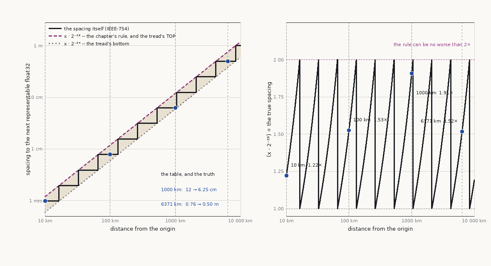
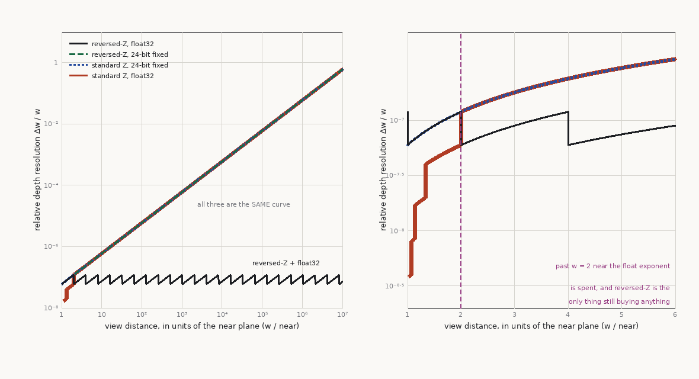
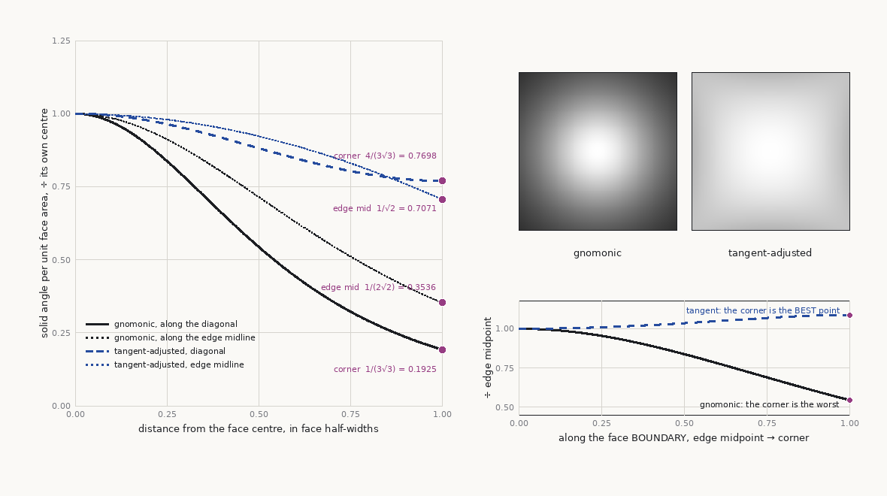

# Planetary Rendering & Numerical Precision

Planet rendering is two problems wearing one coat: a **numerical precision problem** that starts
long before planetary scale (any world past ~10 km is already in trouble in float32), and a
**spherical tiling + LOD problem** spanning six orders of magnitude from orbit to boot level. Take
precision first — it is the discipline everything else here is built on, and half of "planet
renderer bugs" are precision bugs with scenery attached. The generation-side view of planets
(tectonics, climate, spherical lattices) lives in terrain-architect `25`; this chapter owns how a
renderer *draws* a globe without jitter, cracks, or z-fighting.

Contents: [Precision doctrine](#precision-doctrine) · [Depth precision](#depth-precision) ·
[Cube-sphere tiling for rendering](#cube-sphere-tiling-for-rendering) ·
[LOD across six orders of magnitude](#lod-across-six-orders-of-magnitude) ·
[Horizon culling](#horizon-culling) ·
[Atmosphere, sun, and shadow at planetary scale](#atmosphere-sun-and-shadow-at-planetary-scale) ·
[Streaming whole planets](#streaming-whole-planets) · [Coordinate systems](#coordinate-systems) ·
[Pitfalls](#pitfalls) · [Sources & provenance](#sources--provenance)

## Precision doctrine

float32 carries a 24-bit significand: ~7 significant decimal digits, and a spacing between
representable values that is **`2^(floor(log2 x) - 23)`** at magnitude `x` — constant between
consecutive powers of two, and doubling at each one. The familiar `x * 2^-23 ≈ x * 1.2e-7` is the
**upper bound** of that step, reached only at the top of each binade; the true spacing is between
one and two times smaller, depending where `x` falls inside its binade.

| Distance from origin | float32 spacing | `x · 2^-23`, the bound | Consequence |
|---|---|---|---|
| 1 km | 61 µm | 0.12 mm (1.95×) | fine |
| 10 km | 0.98 mm | 1.19 mm (1.22×) | subpixel shimmer starts in close-ups |
| 100 km | 7.8 mm | 1.19 cm (1.53×) | visible vertex swimming, normal-map crawl |
| 1000 km | 6.25 cm | 11.9 cm (1.91×) | geometry visibly quantized, physics jitter |
| 6371 km (Earth R) | 0.50 m | 0.76 m (1.52×) | unusable — vertices snap by strides |

Budget against the middle column, not the right one. The distinction is worth a factor of two and
it is not a rounding: two worlds sized either side of a power of two get different vertex
precision from the same code, and the bound hides that behind a smooth-looking law.



> **Figure 9·1 — the spacing is a staircase, and `x · 2^-23` is its bound.** `D`, and the underlying
> format is `P` (IEEE-754). Drawn by [`figures/make_figures.py`](../../water-physics/references/figures/make_figures.py)
> (`fig_float_binades`) by asking numpy's own `float32` where the representable values are — the
> machine is the authority here, so there is no constant in the figure to drift from. The window is
> 10 km to 10 000 km because eleven binades is few enough that a tread is a tread; over the twelve
> decades the table spans, the staircase draws as a straight line and says nothing.
> **Left:** the spacing itself, with `x · 2^-23` running through the top corner of every tread and
> `x · 2^-24` through the bottom. The rule is the tread's ceiling, and it touches the truth once per
> binade. **Right:** the ratio between them, which is `x / 2^floor(log2 x)` and therefore a sawtooth
> confined to `[1, 2)`. The four marked rows are this table's own, and they land at 1.22×, 1.53×,
> 1.91× and 1.52× — the 1000 km row worst, because `10^6` sits just above `2^19` and so near the
> floor of its binade. **This figure corrected the table above it:** the pre-figure rows read
> ~0.1 mm / ~1 mm / ~1 cm / ~12 cm / ~0.76 m, which is the bound column, tabulated as if it were the
> spacing.

Symptoms (`11` catalogues the tests): **vertex swimming** — geometry wobbles as the camera moves
because view = big − big cancellation drops low bits; **shadow-map jitter** — shadows crawl even on
static scenes; skinned meshes "boiling"; picking/raycast misses. This applies to *any* > ~10 km
world — open-world games hit it without ever leaving a flat map. Fixes, ranked:

1. **Camera-relative rendering (RTE — "relative to eye"), the default.** Keep authoritative
   positions in float64 (or fixed-point int64) on CPU. Per frame, compute
   `relPos = float32(worldPos_f64 - cameraPos_f64)` — the subtraction happens in double, *then*
   truncates. Near the camera, where precision matters, magnitudes are small and float32 is
   exact-enough; error grows with distance exactly where a pixel covers metres anyway. The view
   matrix has zero translation; model matrices are camera-relative. This is the structural fix —
   everything else is a refinement of it.
2. **Periodic origin rebasing.** Shift the whole world so the camera region stays near the origin;
   rebase when the camera exceeds a threshold (e.g. 5–20 km). Simpler to retrofit than full RTE,
   but the rebase touches every cached world-space quantity (physics state, particle systems,
   audio emitters, nav data) and a missed cache is a teleporting object. Rebase during a quiet
   frame; never mid-physics-step.
3. **Double-single (two-float) emulation on GPU** where per-vertex double-precision positions must
   survive on hardware without fast fp64: store position as `(high, low)` float pair, subtract the
   camera's `(high, low)` with error-compensated arithmetic in the vertex shader (DSFUN90-style;
   Cozzi & Ring's "GPU RTE"). Use only where CPU-side RTE can't reach — e.g. vertices generated
   on-GPU in absolute coordinates. fp64 in shaders is a trap: 1/16–1/64 rate on most consumer GPUs.
4. **Engine-native large-world support** — Unreal's Large World Coordinates (double-precision
   world transforms, with the renderer internally camera/tile-relative) is the engine-native
   instance of this doctrine (`03`). Using LWC does not exempt content: shaders doing math in
   absolute world position still break (see Pitfalls).

Doctrine: precision is an **architecture**, not a patch. Decide the authoritative coordinate type
(f64 vs int64 fixed-point), the frame in which every subsystem works, and where the
double→float truncation happens (exactly once, camera-relative) — then audit every path that
bypasses it.

## Depth precision

Six orders of magnitude of view distance breaks naive depth too. The stack, in order of adoption:

- **Reversed-Z + float32 depth + [0,1] clip range.** Map near→1, far→0. Standard projection piles
  depth resolution near the *near* plane hyperbolically; float32 piles *representable values* near
  zero. Reversed-Z aligns the two gradients instead of opposing them, yielding near-constant
  relative error across the range. This is free (flip GREATER/LESS, clear to 0) and is the 2026
  default everywhere, not just planets. Requires a floating-point depth buffer; with a 24-bit
  *fixed* depth buffer reversed-Z gains **nothing at all** — the two conventions come out
  bit-identical, which figure 9·2 below draws as two curves lying on one another.
- **Infinite far plane.** With reversed-Z, take the limit far→∞ in the projection: no far clip at
  all, negligible precision cost. A planet renderer should not be tuning a far plane.



> **Figure 9·2 — reversed-Z is flat, and in fixed point it buys exactly nothing.** `D`, on `P`
> (IEEE-754 and the standard projection). Drawn by
> [`figures/make_figures.py`](../../water-physics/references/figures/make_figures.py) (`fig_depth_precision`). **There is not one
> chosen number in it.** With the infinite far plane above, the projection collapses to `z = near/w`
> (reversed) or `z = 1 − near/w` (standard), so `|dw/dz| = w²/near` for both and `near` cancels: the
> x axis is the dimensionless `w/near` and the y axis is the ratio `Δw/w`. The only input left is
> where the buffer's own representable values are, which is figure 9·1's question asked again.
> **Left:** reversed-Z with float32 is flat over seven decades — and *exactly* one binade flat, from
> `2^-24` to `2^-23`, which is the sawtooth of figure 9·1 seen side-on. That is what "near-constant
> relative error" means, and it means constant to a factor of two and never better. The other three
> climb linearly and **lie on one another to the last bit**: with standard Z, a float depth buffer
> is not merely worse than reversed-Z, it is bit-identical to 24-bit fixed point. **Right:** the one
> window where they differ. Standard Z writes `z = 1 − near/w`, which is inside the binade
> `[½, 1)` for every `w` past twice the near plane — so past `w = 2·near` the exponent is spent and
> only the mantissa is left. A float depth buffer under standard Z buys precision solely within
> twice the near plane, which is the one place nothing needs it.
- **Logarithmic depth** — the alternative when float depth targets are unavailable or range is
  extreme: write `z = log2(1 + w) / log2(1 + far)`-style depth. Costs, and why reversed-Z won:
  writing depth in the pixel shader **disables early-Z / hierarchical-Z** (unless conservative
  depth output is carefully used), and per-vertex log depth interpolates incorrectly across long
  triangles near the camera (cracks/artifacts on large near polygons). Legacy of the pre-float-
  depth era (Outerra popularized it — public posts exist, **T/F**); reach for it only when cornered.
- **Per-regime near/far adaptation.** Even reversed-Z cannot give you a 5 cm cockpit near plane
  *and* precision at 40,000 km with one setting on all hardware. On ascent, slide the near plane
  out as the nearest geometry recedes (near=0.05 m on ground, near=100 m in orbit), or render in
  two depth partitions (near scene / far scene, composited) when a cockpit must coexist with a
  planet. Adapt smoothly; a near-plane pop is visible as a one-frame depth-test flicker.

## Cube-sphere tiling for rendering

Renderers overwhelmingly draw planets as a **cube-sphere**: six faces, each an independent
quadtree of patches, projected to the sphere/ellipsoid. Contrast with the generation side: an
icosahedral/hexagonal DGGS (terrain-architect `25`/`26`) is a *sampling and simulation* choice —
excellent for tectonics/climate/flow — but renderers draw quads and want per-face 2D parameter
spaces, mip chains, and virtual-texture pages; so even hex-simulated planets get *resampled* into
cube-face tiles (or locally-flat tiles) for drawing. Do not couple the render lattice to the
simulation lattice; declare the resample as part of the bake.

The tiling and its precision discipline in one sketch:

```
       +----+                           per-patch local frame — the precision fix:
       | +Y |
  +----+----+----+----+                       up   north
  | -X | +Z | +X | -Z |                        \   /
  +----+----+----+----+                ...______\_/______...  patch of the ellipsoid
       | -Y |                                   O-----> east  (curved, drawn flat)
       +----+
  six faces, one quadtree each         O = patch origin (patch centre on the
  +---------+----+-+-+                     ellipsoid), stored in double
  |         |    +-+-+                 vertices = float32 offsets in the local
  |         +----+---+                     east/north/up frame at O
  |         |    |   |                 per draw: upload float32(O_f64 - cam_f64);
  +---------+----+---+                 the GPU never sees a planet-radius-magnitude
  quadtree deepens toward the viewer   coordinate
```

- **Mapping and distortion.** The naive (gnomonic) cube→sphere mapping varies texel solid angle by
  **`3√3` = 5.196×** between face centre and corner, and for gnomonic the corner *is* the face
  minimum, so that one number bounds the whole face — corners waste resolution and distort features.
  Tangent-adjusted mappings (`u' = tan(u·π/4)`, applied per axis) cut it to **`3√3/4` = 1.299×**
  centre-to-corner — exactly a quarter — but the corner is no longer where that map is worst: its
  face minimum is the **edge midpoint**, at exactly `1/√2`, so the variation across a face is
  **`√2` = 1.414×**. Quote 1.414 when sizing a texel budget and 1.299 only if you mean the corner
  specifically. Equal-area-ish variants (COBE quadrilateralized sphere family) go further at the
  cost of a more expensive inverse. Pick once, bake it into tile addressing, and use the *same*
  mapping for geometry and texturing — a mismatch shows as texture swimming toward face corners.



> **Figure 9·3 — the re-derivation this chapter's provenance table asks for.** `D`; the two figures
> were previously **F** ("widely reproduced numbers, no single canonical citation; re-derive before
> quoting in print"). Drawn by [`figures/make_figures.py`](../../water-physics/references/figures/make_figures.py)
> (`fig_cube_sphere`) from the two mappings as this section states them — the Jacobian of
> `(u, v, 1)` onto the sphere, `(1 + u² + v²)^(−3/2)`, times `du'/du = (π/4)sec²(uπ/4)` per axis for
> the tangent variant. Every number is computed, none quoted. **Left:** density along the diagonal
> and along the edge midline, each normalised to its own face centre. For gnomonic the diagonal is
> the steepest way off the centre, so the corner is the worst point; for tangent-adjusted it is the
> *shallowest*, and the edge midline overtakes it. **Right, top:** the same two densities as fields
> over a whole face, each scaled to its own maximum. **Right, bottom:** the face boundary from edge
> midpoint to corner, and the two maps run in **opposite directions** along it — the corner is
> gnomonic's worst point and tangent-adjusted's *best* one. That is where the quoted "roughly
> 1.3–1.4×" comes from: the band's two ends are not an uncertainty, they are two different
> measurements of two different points.
- **Per-patch local frames — the precision fix applied structurally.** Each patch stores its
  origin (patch centre on the ellipsoid) in double, and its vertices as float32 offsets in a local
  frame (origin + local east/north/up). The GPU never sees a planet-radius-magnitude coordinate:
  per draw, upload `float32(patchOrigin_f64 - cameraPos_f64)` and add in-shader. This composes
  with RTE and is why a correctly built planet renderer needs no fp64 on the GPU at all.
- **Skirts on curved patches.** Same crack fallback as `06`, but skirts must extend *toward the
  planet centre* (local down), not world −Z, and be deep enough to cover both LOD gaps and the
  chord-vs-arc error of the flat triangulation of a curved patch at that level.
- **Tangent-frame continuity across edges and corners.** Each face has its own natural tangent
  basis; at the 12 cube edges the bases rotate relative to each other, and at the 8 corners three
  faces meet with no consistent 2D parameterization (the hairy-ball theorem guarantees at least
  one singular point for any global tangent field — the cube pushes singularities to corners).
  Normal maps, anisotropy, and detail-UV directions must either (a) be expressed in a world/local
  ENU frame rather than per-face UV space, or (b) carry explicit per-edge rotation tables when
  crossing faces (same rotation tables the generation side uses for flow — terrain-architect
  `25`). Symptom of getting it wrong: lighting seams exactly on cube edges and pinwheel artifacts
  at corners.

## LOD across six orders of magnitude

From 400 km orbit (whole-disc view) to 1 m standing height, the pyramid spans roughly levels 0–20+
on an Earth-size body. What changes versus flat-world LOD (`01`, `06`):

- **SSE with curvature.** The same `sse = e/d · K` refinement as `06`, with two planetary
  adjustments: `d` measured to the patch's bounding volume on the *ellipsoid* (not a flat AABB),
  and patches fully below the horizon skipped before SSE is even computed (next section). At
  near-tangent viewing angles the projected error of a patch is dominated by its silhouette
  contribution; a curvature-aware error metric (error projected along the view ray vs along the
  surface normal) prevents over-refining flat-on ground while under-refining the limb.
- **Orbit→surface transition.** No special case needed if the pyramid is honest: the same
  traversal that draws 6 root faces from orbit draws thousands of deep patches at the surface. The
  practical breakpoints are (a) when the atmosphere shell starts occupying pixels, (b) when
  per-patch normal maps must hand over to geometry (`07` displacement tiers), and (c) when the
  planetary system hands off to a *local terrain system* — many productions switch to a flat
  local-ENU terrain (full `01`/`06` machinery, physics, gameplay) below a few km altitude, with
  the planet renderer continuing underneath as far-field. If you do this, the handoff must be
  crossfaded and both systems fed from the same source data or the switch is a visible world-swap.
- **Per-face quadtree depth limits and UV precision.** A face parameterized 0–1 in float32 runs
  out of UV precision around level 23–24 (2^-24 of a face ≈ 0.6 m on Earth — and *sub*-texel
  addressing needs several more bits). Before that: make UVs patch-local (0–1 within the patch,
  offset/scale in double on CPU) — same structural fix as positions. Any absolute-face-UV shader
  path is a deep-zoom bug waiting.
- **Frustum + horizon + SSE ordering.** Cull order per patch: horizon test (cheapest, kills the
  far side), frustum test, then SSE refine. GPU-driven variants of this traversal belong to `08`.

## Horizon culling

On a globe, the planet itself is the best occluder in the scene: everything beyond the geometric
horizon is hidden by the ellipsoid. The classic test (Cozzi & Ring): scale space so the ellipsoid
is the unit sphere, let `cv = camera` in that space, and for a point `t` (patch bounding-sphere
centre pushed out by its radius, or each corner of an OBB):

```
vc = -cv                     // camera to centre
vt = t - cv                  // camera to target
occluded(t) =  dot(vt, vc) > dot(vc, vc) - 1          // beyond the horizon plane
            && dot(vt, vc)^2 / dot(vt, vt) > dot(vc, vc) - 1   // inside the occlusion cone
```

Apply it to patch bounding volumes during traversal (using the patch's *maximum* height so
mountains peeking over the horizon survive), and to expensive objects (cities, weather cells).
Notes: at surface level this culls nearly half of everything the frustum alone would keep — the
frustum happily contains the far side of the planet through the ground; conversely at high orbit
the frustum does most of the work and the horizon test degenerates gracefully. Use the ellipsoid
*minus* max terrain depression as the occluder radius or valleys get culled while still visible.
Terrain self-occlusion beyond the ellipsoid (a mountain hiding a valley) is `08`'s occlusion
culling, not this test.

## Atmosphere, sun, and shadow at planetary scale

The atmosphere is the terrain renderer's **distance cue**: aerial perspective (in-scattered blue,
extinction of surface contrast) is what makes 50 km read as 50 km. The scattering math itself —
transmittance/scattering LUTs, multiple scattering — is physically-based-rendering territory
(route to `10` and the PBR literature); what this chapter owns is the *interface*:

- Terrain must be shaded with per-pixel aerial perspective from the same LUT set as the sky, or
  the terrain visibly detaches from the atmosphere at the horizon. Apply as
  `L = L_surface * transmittance(camera, p) + inscatter(camera, p)` — never a distance fog hack
  at planetary range, which cannot produce the correct reddening/blueing.
- The atmosphere must be evaluated in the same camera-relative frame as everything else; a
  planet-absolute-position atmosphere shader jitters independently of the jitter-free terrain.
- **Sun and shadow.** Cascaded shadow maps assume a locally-flat world; over tens of km of curved
  terrain the light direction itself rotates (~1°/111 km on Earth) and CSM cascades either waste
  resolution or clip against the curvature. Near-field: standard CSM in the local frame, fitted to
  a few km. Far-field: ray-marched shadows against the terrain heightfield / horizon maps, or
  precomputed terrain shadowing — route the machinery to `10`. Nighttime/terminator rendering is
  where absolute-frame shadow math visibly fails first: the terminator line is a planet-scale
  shadow boundary and must be computed in double or in a planet-local frame.

## Streaming whole planets

The pyramid and residency machinery is `06`, instantiated once per cube face (6 quadtrees, one
shared budget). What planets add:

- **Procedural on-demand generation.** Storage for a full Earth at 1 m/px is ~10^15 texels —
  planets are *generated*, not stored, below some level. On tile request, run the generation
  graph for that patch in compute (noise + amplification per terrain-architect's chapters),
  BCn-encode, and insert into the same residency pipeline as if it had been loaded. The tile is
  then indistinguishable from a stored tile downstream — same eviction, same seams contract.
- **The determinism contract.** A regenerated tile must be bit-identical to its previous
  generation and to the same tile generated on any client (multiplayer, or collision baked
  server-side): seeded from (face, level, x, y, worldSeed) only, no frame state, deterministic
  math paths (beware fast-math and GPU-vendor-divergent transcendentals if cross-machine identity
  is required — if it is, generate the *authoritative* fields with integer/fixed-point hashing and
  reserve floating point for view-only detail). This is the same seed contract the generation
  side signs (terrain-architect `08`); the renderer must not add hidden inputs.
- **Mixed stored + procedural.** The production norm: stored macro tiles (real DEM or offline-
  simulated tectonics/erosion, levels 0–10ish) + procedural detail amplification below (noise,
  material-aware displacement conditioned on the stored layers' slope/moisture/lithology masks).
  The blend level must be *per-region* (data density varies) and the amplification must read the
  stored layers' apron so amplified detail doesn't seam at stored-tile edges.
- **Priority at planetary scale**: the `06` priority function plus altitude regime — in orbit,
  breadth (whole visible disc at uniform level) beats depth; on descent, bias sharply toward the
  sub-camera point using the predicted landing region.

## Coordinate systems

Name the frames or drown in bugs. The minimum set:

| Frame | Definition | Used for |
|---|---|---|
| Planet-fixed (ECEF-style) | Origin at planet centre, rotates with planet | Authoritative positions (f64), tile addressing |
| Local ENU | East/North/Up tangent frame at a reference point | Gameplay, physics islands, local terrain system |
| Camera-relative render | Origin at camera, axes world-aligned | Everything on the GPU |
| Inertial (if orbits matter) | Non-rotating | Orbital mechanics, sun/moon ephemeris |

- **Geodetic vs geocentric normals.** On an ellipsoid, "up" (geodetic normal, perpendicular to the
  surface) is *not* the direction from the centre (geocentric); on Earth they differ by up to
  ~0.19°. Use the geodetic normal for ENU frames, gravity alignment, and shading `up`; using
  geocentric introduces a latitude-dependent tilt — buildings lean, water flows uphill slightly.
  For a pure sphere the two coincide; decide sphere-vs-ellipsoid once, globally.
- **Rotating-frame pitfall.** If the planet rotates in an inertial world (space games), then the
  planet-fixed frame is non-inertial: objects "at rest" on the surface are accelerating.
  Physics must run in the planet-fixed frame locally (with rotation applied to the frame, not the
  objects), or every parked object drifts. Sun direction must be transformed *into* the planet-
  fixed frame per frame — computing lighting in the inertial frame reintroduces absolute-magnitude
  precision loss at 1 AU scale (1.496e11 m: float32 spacing **16.4 km** — ephemeris math is
  f64-only).

## Pitfalls

- **Single-precision model matrices silently reintroduced by middleware.** You built RTE, then a
  vendor library / engine component composes its own float32 world matrix from absolute f64
  positions internally — one frame later, jitter is back, only on that subsystem's objects
  (decals, particles, vegetation). Audit every matrix build site; grep for float casts of
  authoritative positions. UE LWC has the same class of leak in shaders using absolute world
  position nodes (`03`).
- **Physics engines are float32.** Havok/PhysX/Jolt-class engines simulate in float. Do not feed
  them planet-absolute coordinates: run **simulation islands** with local origins (the ENU frame
  of each active region), rebase islands as actors move, and convert to f64 planet-fixed only at
  the boundary. Symptoms of skipping this: jittering ragdolls and contacts that pop at large
  coordinates — far from origin the contact solver operates below its tolerance floor.
- **Lightmap / virtual-texture UV precision at deep zoom.** Absolute UVs in a face- or planet-wide
  atlas quantize visibly around level 20+; page-local UVs with f64 offset on CPU (mirror of the
  position fix). Also applies to procedural texturing keyed on absolute world position.
- **Z-fighting at horizon distances.** Coplanar-ish layers (terrain vs ocean vs decals) that
  coexist at 100 km+ fight even under reversed-Z. Slope-scaled depth bias fails at grazing angles;
  prefer geometric separation (ocean skirt below terrain holes), draw-order with depth-test
  tweaks, or single-pass compositing of the layers.
- **Camera near plane vs cockpit scale.** near = 0.05 m for a cockpit while flying over terrain at
  800 km/h destroys distant depth ordering on 24-bit fixed depth, and even float depth strains.
  Use reversed-Z float + infinite far, and if artifacts persist, two-partition rendering
  (cockpit pass / world pass) — the standard flight-sim structure.
- **Testing only near the origin.** Every demo works at (0,0,0). Verification (`11`) must include:
  teleport to antipode, 24 h soak at max coordinate, shadow stability at 1000 km from origin,
  deep-zoom UV inspection at max level, and orbit→surface→orbit cycling for depth-regime pops.

## Sources & provenance

- **P** — Cozzi & Ring, *3D Engine Design for Virtual Globes* (2011): the canon for this chapter —
  RTE/camera-relative rendering and GPU RTE (double-single), depth precision at globe scale,
  horizon culling test, ellipsoid geodesy (geodetic vs geocentric), cube-sphere tiling and
  out-of-core globe streaming.
- **P** — Upchurch & Desbrun, "Tightening the Precision of Perspective Rendering" (JGT 2012):
  reversed-Z + floating-point depth error analysis.
- **D** — Reed, "Depth Precision Visualized" (2015, public write-up): the standard practical
  explanation of reversed-Z / float depth interaction.
- **D** — Epic Games, Unreal Engine Large World Coordinates documentation: engine-native
  double-precision world transforms and their shader-side limits (`03`).
- **P** — Snyder, *Map Projections: A Working Manual* (1987): projection distortion background for
  cube-face mappings (via terrain-architect `25`'s scale-factor doctrine).
- **T/F** — Outerra blog posts (Kemen) on logarithmic depth and planet rendering; public posts
  exist — treat specific constants as folklore.
- **T/F** — *Star Citizen*, *No Man's Sky*, *Microsoft Flight Simulator*, *Elite Dangerous*
  planet-tech talks: public GDC/SIGGRAPH talks and posts exist covering 64-bit coordinates, local
  physics grids, and procedural planet streaming; name the technique, not remembered internals.
- **D** — Gnomonic-vs-tangent-adjusted cube mapping distortion. Was **F** ("widely reproduced
  numbers, no single canonical citation; re-derive before quoting in print"); re-derived here in
  `figures/make_figures.py` (`fig_cube_sphere`) and now closed-form: gnomonic centre/corner is
  `3√3` = 5.1962 and is the face minimum; tangent-adjusted centre/corner is `3√3/4` = 1.2990,
  exactly a quarter of it, but its face minimum is the **edge midpoint** at `1/√2`, giving `√2` =
  1.4142 across the face. The quoted 1.3–1.4 band is those two points, not an uncertainty.
- **D** — The float32 spacing table and the 1 AU figure: `2^(floor(log2 x) − 23)`, taken from the
  machine in `fig_float_binades`, against the `x · 2^-23` bound the table previously carried.
  Reversed-Z's constancy and the fixed-point equivalence are the same file's `fig_depth_precision`,
  dimensionless in `w/near`.
- **F** — Two-partition cockpit/world depth rendering, per-regime near-plane sliding: standard
  flight/space-sim practice, no canonical paper.
