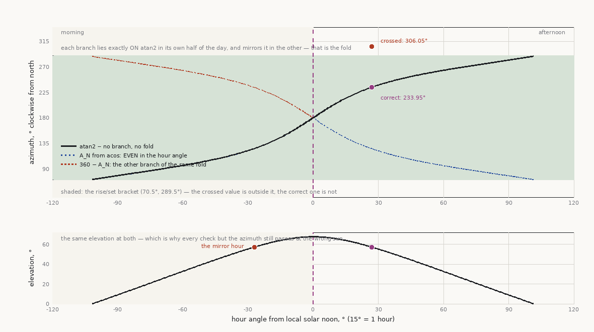
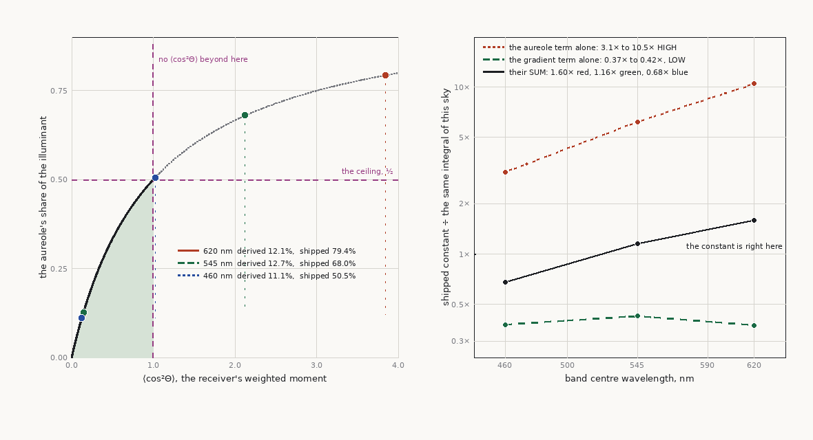
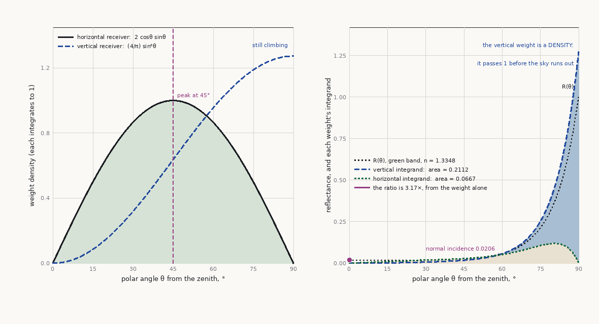

# Lighting, shadows, and terrain integration

This chapter owns getting light onto terrain at kilometer scale: sun shadows across huge ranges,
heightfield-native shadow techniques, ambient and GI, the normal pipeline across LOD, and the
atmosphere that makes distance readable. BRDF, scattering, and ambient-term math route to the
physically-based-rendering skill; material-side aliasing is `07`; geometry LOD contracts that
shadows depend on are `01`/`02`; verification harnesses are `11`.

Contents: [Historical shadow ladder](#the-historical-shadow-ladder) ·
[Cascaded shadow maps at terrain scale](#cascaded-shadow-maps-at-terrain-scale) ·
[Heightfield-native shadows](#heightfield-native-shadows) ·
[Virtual shadow maps](#virtual-shadow-maps) · [Self-occlusion, AO, and GI](#self-occlusion-ao-and-gi) ·
[The normal pipeline across LOD](#the-normal-pipeline-across-lod) ·
[Atmospheric integration](#atmospheric-integration) ·
[Where the sun angles come from](#where-the-sun-angles-come-from) ·
[Time-of-day dynamics](#time-of-day-dynamics) ·
[Pitfalls](#pitfalls) · [Sources](#sources--provenance)

## The historical shadow ladder

Terrain exposed the limit of every shadow era first. Blob/projected shadows avoided terrain
self-shadow entirely. Single directional shadow maps added real occlusion but spent one fixed
texture over the whole camera range. CSM partitioned that texture by distance and made outdoor
sun shadows practical, then failed again when the last cascade had to cover kilometers. The
modern answer is not "more cascades": keep near/mid dynamic casters in CSM or VSM, virtualize
receiver-driven shadow pages where the platform supports them, and move the static terrain far
field to heightfield ray marching or horizon data. Each step changes the allocation unit —
whole view, cascade, page, then terrain sample — because kilometer scale cannot be solved by
bias tuning.

## Cascaded shadow maps at terrain scale

CSM is still the baseline sun-shadow machine: N shadow maps (3-5 typical) covering nested slices
of the view frustum, finest near the camera. Everything below is about making it survive terrain,
whose failure modes — huge depth ranges, km-scale casters, a camera that mostly looks at shadowed
ground — are harsher than architecture's.

- **Split scheme**: pure logarithmic splits (theoretically optimal for perspective aliasing) pack
  cascades absurdly tight near the camera; pure uniform splits waste resolution on the far field.
  Ship the standard blend: `split_i = lerp(uniform_i, log_i, lambda)` with `lambda ≈ 0.5-0.9`
  (PSSM's practical-split scheme — P). Expose lambda; terrain-heavy views want it lower than
  corridor games because mid-distance ground fills the screen.
- **Texel snapping**: an orthographic cascade that re-fits the frustum slice every frame changes
  its texel grid every frame, and shadow edges crawl/shimmer as the camera moves. Fix the cascade
  extent (bound the slice with a *sphere* so rotation cannot change the projection size), then
  snap the projection origin to whole shadow-texel increments in light space each frame (D —
  standard depth-map guidance). Both halves are required; sphere-bounding without snapping still
  shimmers on translation.
- **Per-cascade caster culling with conservative height bounds**: a caster outside the cascade's
  view-slice can still shadow into it — cull against the light-space footprint extruded toward
  the light, never the camera slice. For terrain tiles the extrusion test is cheap if every tile
  carries conservative min/max height (`06` tile metadata): a distant ridge whose max height
  cannot reach the light path into this cascade is skipped; one whose bounds are stale (edited
  terrain, wrong apron) silently deletes a mountain's shadow — keep bounds authoritative, and
  depth-clamp ("pancake") casters between the light near plane and the cascade to avoid far-plane
  clipping of tall peaks.
- **Far-cascade strategies**: the outer cascades change slowly — amortize them. Round-robin one
  far cascade per frame; or cache a static far cascade re-rendered only when the camera crosses a
  cell boundary or the sun moves past a threshold (see
  [Time-of-day dynamics](#time-of-day-dynamics)); composite cached static-caster shadows with a
  small per-frame dynamic-caster overlay. All standard practice (F).
- **The km-scale problem**: a cascade spanning 10 km at 4096² is ~2.4 m/texel. At that footprint
  terrain *self*-shadowing — the thing that makes distant ridges read — is mush: shallow relief
  vanishes entirely because the slope-scale bias required to suppress acne at 2.4 m texels is
  larger than the relief itself. This is structural, not tunable. Past the last cascade you can
  afford, switch representations: heightfield-native shadows below. CSM for the near field where
  meshes and dynamic casters live; heightfield techniques for the terrain far field.

## Heightfield-native shadows

The terrain's own shadow can be computed from the *authoritative heightfield* instead of
rasterized geometry — immune to geometry LOD (no shadow/visual LOD mismatch, no `01` morph
stripes), resolution-independent, and cheap at ranges where CSM texels are meters wide.

- **Ray-marched heightfield shadows**: per shaded point, march from the surface toward the sun
  through the heightmap, testing ray height against terrain height, and accelerate with a
  **max-mip pyramid** (each mip texel stores the max height beneath it — HiZ logic applied to
  height): step at coarse mips over empty air, descend near the surface, giving tens of steps for
  tens of km. Run it per screen pixel (needs world position; fits deferred) or bake it into a
  terrain-space shadow buffer updated over several frames. Approximate penumbra by tracking the
  minimum angular clearance between ray and terrain along the march and mapping it through the
  sun's angular radius — cone-march soft shadows (F). Engines ship variants of this as a
  far-shadow tier; UE5's Lumen represents Landscape as a heightfield for its software ray
  tracing, and heightfield-traced far shadows exist as engine features under various names —
  verify the exact mechanism per engine before promising behavior (N/?, `03`).
- **Horizon mapping** (Max 1988 — P): the precomputed cousin. For each terrain texel, bake the
  horizon *angle* — the highest elevation angle at which terrain occludes the sky — for a set of
  azimuths (8-32 channels; 8 gives visible azimuth banding, 16+ is comfortable). At runtime,
  interpolate the horizon angle at the sun's azimuth and compare with sun elevation:

  ```hlsl
  float horizon = sampleHorizonAngle(uv, sunAzimuth);        // interpolate adjacent azimuth bins
  float shadow  = smoothstep(horizon - sunRadius, horizon + sunRadius, sunElevation);
  ```

  The smoothstep width doubles as a physically-motivated penumbra (sun angular radius ~0.25°,
  widen for softness). The bake is **sun-independent** — it survives full time-of-day for free —
  and evaluation is one sample + compare, viable at any distance including the entire far field.
  Limits: terrain-static only (re-bake on terrain edit; bake is a marching pass over the
  heightfield, amortizable), self-shadowing only (meshes neither cast into nor receive from it
  coherently), and azimuth quantization shows as shadow direction stepping at low bin counts.
- **When baked horizon beats cascades**: everywhere beyond the cascade range where the caster is
  terrain itself — which on open terrain is most shadowed pixels. The shipping pattern: CSM (or
  VSM) near field for everything; heightfield ray-march or horizon map for terrain beyond, with a
  blend band; make the two agree in the band or the handoff line is visible at every dusk (`11`
  has the comparison harness).

## Virtual shadow maps

UE5's Virtual Shadow Maps (N/D) apply `07`'s page-table plumbing to shadow maps: each directional
light gets a stack of clipmap levels, each level a virtual 16k×16k shadow map backed by 128²
physical pages, and **only pages covering visible receiver pixels get allocated and rendered**.
Resolution is effectively receiver-driven — near-pixel-perfect shadow texel density without
choosing cascade counts.

That allocation rule is the structural improvement over CSM at world scale. A CSM commits one
physical texture across the entire cascade footprint before it knows which receivers matter; as
range grows, every texel's world footprint grows with it. A VSM commits physical pages only where
visible receiver pixels request them, so detailed shadow memory follows the image rather than
the square kilometers inside a cascade. Virtualization does not create infinite detail — distant
clipmap levels still become coarse — but it postpones the failure and spends the budget where the
camera can observe it.

Why they pair with virtualized geometry (`02`): rendering a single 128² page requires drawing
just the casters touching it at an appropriate detail level — cheap with cluster-culled,
LOD-continuous Nanite-style geometry, brutal with monolithic draw calls that must be re-issued
per page. The cache is the point and the cost: pages persist across frames while nothing changes;
**moving casters and WPO/vertex-animated materials invalidate every page they touch every frame**
(wind-animated foliage over terrain is the classic budget killer — bound WPO invalidation ranges,
disable WPO in shadow passes where acceptable, N/D), and a moving sun invalidates globally (see
below). On terrain specifically, VSM's fine texel density restores near-field self-shadowing that
CSM texel sizes blur away — but the far field still wants the heightfield techniques above; VSM
clipmap levels at extreme distance recreate the same big-texel problem with different plumbing.

**Far-field handoff contract.** Do not switch from VSM/CSM to heightfield shadowing on an
arbitrary distance constant. Blend across a band where both paths are evaluated, normalize both
to a common world-space penumbra width, and place the handoff where the page/cascade texel
footprint exceeds the terrain-shadow quality threshold. The raster path uses a geometry proxy;
the heightfield path uses the authoritative field, so an unblended switch reveals LOD and
filter-kernel disagreement as a ring at dawn/dusk. Hardware RT shadows are an optional near-field
tier against `18`'s stable terrain proxy; they do not remove the far-field requirement.

## Self-occlusion, AO, and GI

- **Baked AO and bent normals from the generation side**: terrain-architect's analysis maps
  (its `06`) produce heightfield AO / sky-view factor and bent normals from the *authoritative*
  field with correct world-scale radii. Doctrine: large-scale terrain occlusion is baked; it
  multiplies **sky/ambient irradiance only, never the sun term** (the sun has real shadows above —
  multiplying both is double-darkening, see Pitfalls); bent normals steer the ambient/env lookup
  direction. Ambient-BRDF specifics route to the physically-based-rendering skill.
- **SSAO is inadequate on terrain, not merely weak**: its sampling radius covers meters of screen
  space; terrain self-occlusion operates over hundreds of meters (valleys, basins). SSAO on
  rolling terrain contributes contact grime around rocks and grass and *nothing* at landform
  scale — and its screen-space horizon collapses at the grazing view angles terrain is seen at.
  Keep it for contact detail; never let it be the terrain AO story.
- **Distance-field / ray-traced AO**: mid-scale option between baked sky visibility and SSAO;
  heightfield ray-marched AO (cone-march the max-mip pyramid, same machinery as shadows above)
  gives dynamic medium-range occlusion when terrain deforms at runtime and the bake can't keep up.
- **Probe / DDGI-class GI on terrain**: irradiance probe volumes (DDGI — P) work, but naive 3D
  grids waste most probes underground or high in the air. The heightfield placement answer is a
  2.5D shell: probe layers offset above the surface following the terrain, denser near the ground
  where receivers are (F). Watch leaking through thin ridges (probe on one side lighting the
  other) — DDGI's visibility term handles most of it; validate in canyon terrain.
- **Lumen on Landscape** (N/D, honest costs): works — Landscape participates via heightfield
  representation in the Lumen scene — and buys sky occlusion in valleys and bounce from terrain,
  at real GPU cost; surface-cache updates over huge terrain plus foliage churn are the recurring
  bills. Big flat vistas are comparatively cheap; dense foliage over terrain is not. Verify
  budget on target hardware before committing the art direction to dynamic GI.
- **Static lightmaps are impractical at terrain scale**: the unique-texel budget math from `07`
  applies verbatim (km² at useful lightmap density is absurd storage), and any dynamic sun kills
  them outright. Baked *irradiance probes* and baked *AO/horizon* data survive where baked
  *lightmaps* do not, because they are either sparse or sun-independent.

## The normal pipeline across LOD

- **The geometry/shading band split** (`01`): geometry carries frequencies up to the current
  vertex density; the baked normal map carries everything between that and texel resolution; the
  material detail normal (`07`) sits on top. When geometry LOD coarsens, frequencies migrate from
  the geometry band into the shading band — the normal map sampled at coarser mesh LOD still
  contains them, which is exactly why `01` mandates baked normal maps over in-shader derivation:
  derived normals *lose* the migrated band and lighting visibly flattens per LOD ring.
- **Morph the whole lighting input, not just positions**: during geomorph/LOD fade, normals (and
  every height-derived shading input — slope masks, AO) must blend with the same morph factor as
  geometry (`01` geomorph doctrine). Lighting pops read louder than silhouette pops.
- **Detail normals fade with distance** and their lost variance reappears as roughness — the
  `07` specular-AA contract; the terrain-critical symptom is glittery distant slopes at grazing
  sun (Pitfalls).
- **Tile-border normal seams — the apron rule**: normals computed per tile from clamped edge
  samples differ across the border by one finite-difference stencil → a one-texel lighting seam
  on every tile edge, visible at every sun angle. The generation side computes normals (and AO,
  curvature) with a ≥1-texel neighbor apron so border texels see true neighbors (terrain-architect
  output contract); the renderer's obligation is to never "fix up" edges by re-deriving from
  clamped data. If runtime deformation forces re-derivation, exchange apron rows between tiles
  first (`06`).
- **Shoreline lighting interplay**: the water/terrain boundary is a lighting problem before it is
  a water problem — the water surface itself (waves, foam, reflection/refraction, underwater)
  is `12`; this bullet owns only the lighting of the terrain around and under it.
  Drive it with the generation side's water **depth field** (terrain-architect
  hydrology handoff, its `27`): depth-driven shore blending — wet-sand darkening + roughness drop
  in a band above the waterline (the `07` wetness layer with a shoreline mask), depth-based
  absorption tint on submerged terrain, soft alpha/depth fade at the waterline instead of a hard
  polygon edge. A hard aliased waterline pixel edge is the tell that water was intersected in
  geometry with no depth-driven blend.

## Atmospheric integration

- **The history is vertex Z-fog → height fog → physical atmosphere.** Classic terrain engines
  attenuated vertices or pixels by camera-space Z toward one fog color. It hid the far clip plane
  and texture repetition, but every wavelength and altitude behaved identically, so a 40 km
  mountain read as a small model behind gray glass. Exponential height fog added altitude
  structure and sold valley mist, but remained an art-directed local medium. The 2026 baseline
  evaluates Rayleigh/Mie scattering and aerial perspective from one atmosphere state; height fog
  remains a bounded mood layer, never the world-scale distance model.
- **Aerial perspective is THE distance cue.** Without atmosphere, a 40 km vista reads as a
  miniature: nothing else — not fog cards, not desaturation grading — communicates scale like
  wavelength-dependent in-scatter accumulating over kilometers. Budget it as a core terrain
  feature, not a post effect. The modern standard is Hillaire's LUT-based model (P/T):
  transmittance LUT + sky-view LUT + a low-res froxel volume for aerial perspective, evaluated
  per pixel at trivial cost. Scattering math routes to the physically-based-rendering skill; the
  terrain contract is only that every terrain pixel composites transmittance and in-scatter from
  the shared atmosphere system.
- **Height fog vs aerial perspective**: two systems, two jobs. Aerial perspective is the
  planet-scale physical medium and owns the distance cue; exponential height fog is a local,
  art-directed medium for valley mist and morning mood. Stacking both as distance cues
  double-attenuates: washed-out mid-ground and a fog color fighting the sky's scattered color.
  Let the physical system own distance; constrain height fog in range and density; derive fog
  color from the sky system so sunset propagates into the valleys.
- **Sun disk vs terrain horizon**: the sun disk renders in the sky pass and must be depth-occluded
  by terrain — sunrise behind a ridge with the disk and its bloom clipped by the silhouette is a
  landmark shot; a disk drawn over terrain (sky composited without depth test) is an instant
  fake. Bloom must bleed from the *visible* portion only, which it does for free when occlusion
  happens before the bloom chain.
- **The skybox is the same fullscreen triangle.** Modern sky rendering is neither a dome mesh
  nor a box: draw the sky **last** as one fullscreen triangle (the `12`/`16` idiom), depth-tested
  at the far plane (`GREATER_EQUAL` at depth 0 under reversed-Z) so only pixels no geometry
  touched get shaded — zero overdraw behind terrain, and the sun-disk occlusion above comes free.
  Reconstruct the view ray per pixel and sample the sky: a cubemap for authored skies, the
  sky-view LUT for the physical model. Ownership boundary: the sky *model* — scattering, cloud
  rendering as a participating medium — belongs to the atmosphere system (route
  physically-based-rendering); terrain owns the **seam**: sky pixels and terrain aerial
  perspective must evaluate the *same* atmosphere parameterization or the horizon shows a color
  discontinuity where mountains meet sky, and the horizon band's depth precision is `09`.
- **Volumetric (froxel) fog is a boundary, not a terrain system.** Camera-frustum froxel
  volumetrics is engine-wide (render-graph placement is game-engine-guru; phase functions and
  scattering are physically-based-rendering). Terrain owns what *feeds* it: height/valley fog
  density driven by terrain data — altitude, and the `14` aux maps, so morning mist pools where
  the simulation put moisture, not uniformly at y < k; god rays sourced from the same terrain
  shadow path rendered above (cascades or heightfield rays), never a separate shadow pass; and
  the double-attenuation rule extended to three media — aerial perspective, height fog, froxel
  fog — declare which owns the distance cue, which owns mood, which owns light shafts, and never
  let two attenuate the same cue.
- **God rays / crepuscular rays** come in two mechanism families, and terrain vistas expose the
  difference. The classic **screen-space post-process** (radial sampling toward the sun's screen
  position — Mitchell, GPU Gems 3 ch. 13, P/D) is nearly free and scene-complexity-independent,
  but it dies the moment the sun leaves the frame, and it bleeds through thin foreground
  occluders. The **volumetric form** — shadowed in-scatter in the froxel volume or a raymarched
  sun-visibility term — costs real budget but works with the sun off-screen and composes
  correctly with the fog media above. Terrain doctrine either way: the occlusion source is the
  terrain shadow path this chapter already built (cascades, heightfield rays, horizon maps), so
  rays pour through ridge notches and valley gaps exactly where the shadows say they should —
  rays through a notch at dawn are a scale cue of the same rank as aerial perspective. Pitfall:
  post-process rays stacked on shadowed froxel fog double-counts the same phenomenon — the
  three-media ownership rule above extends to light shafts; exactly one system renders them.
- **Volumetric clouds** (raymarched noise-density decks — the Horizon Zero Dawn cloudscapes
  lineage, Schneider, SIGGRAPH 2015 Advances, T) belong to the sky system, but terrain owns
  three seams. First, the cloud pass must read terrain depth and march only to the nearer of
  cloud exit or terrain hit — or summits get cloud drawn over them the day a mountain pierces
  the deck. Second, one sky state: the coverage field that shapes the clouds is the *same* map
  that drives the cloud-shadow term below and, where a weather system exists, `13`'s weather
  intensity — clouds, their shadows, and the rain they imply must agree. Third, the
  above-the-deck regime (flying through, seeing cloud tops from a summit or orbit) rides `09`'s
  altitude machinery.
- **Cloud shadows** are the cheapest large-scale life a vista can buy: a scrolling, tiling
  cloud-coverage texture projected top-down and sampled in the sun-visibility term (F-tier
  standard practice — a light modulator, *not* a shadow-map caster; keep it out of the caster
  path). Two rules: every terrain consumer — ground, vegetation (`15`), water (`12`) — samples
  the same shared lookup, or clouds pass over the grass but not the lake; and its scroll vector
  is `13`/`15`'s wind vector, so clouds, grass, and blowing snow agree about the sky.
- **Planet-scale**: at planetary distances the planet's own shadow darkens the atmosphere — the
  terminator seen from orbit, shadowed sky after sunset. That coupling, plus the precision
  machinery it rides on, is `09`; the flat-world approximation here quietly assumes the sun
  reaches all atmosphere, which becomes visibly wrong somewhere around horizon-curvature
  altitudes.

## Where the sun angles come from

This chapter takes `sunElevation` and `sunAzimuth` as given, and for an invented world they are an
art decision. The moment a shot has to match a **real place and time** — a plate, a location scan,
"golden hour on the Algarve" — they stop being a dial and become a **computation**: latitude,
longitude, date and UTC time through the standard solar-position algorithm (Meeus, *Astronomical
Algorithms*; NOAA's implementation is the usual reference, well under a degree for any rendering
purpose). Take the **full-precision** series from a library: Meeus's periodic terms run to hundreds
of coefficients, a mistyped one is a silent multi-degree error, and nothing in a renderer needs that
accuracy. What is worth having written down — and is written out
[below](#computing-the-illuminant-from-a-place-and-a-time) — is the **low-order NOAA form**: a
truncated equation of centre and a closed-form equation of time, a page long, good to well under a
tenth of a degree for any date a renderer will be handed. It is written here for two reasons. A
reader who has to *check* someone else's sun, or reconcile two of them, cannot do it against a
library call. And the one genuinely dangerous step in the whole computation is in its last three
lines, where a branch chosen wrongly moves the sun by tens of degrees while leaving the elevation
exactly right.

It is worth knowing how much rides on those two numbers, because a guessed sun does not look
"slightly off", it breaks four things at once and only the first is obvious:

| Quantity | Driven by | What a guessed angle costs |
|---|---|---|
| Shadow length and direction | elevation, azimuth | the visible mismatch — the one people do check |
| **Sun colour**, via air mass `≈ 1/sin(elev)` | elevation | a 21° sun runs ~2.8 air masses and is distinctly golden; rendered near-white it reads as a noon sun no matter what the shadows do |
| Refracted beam angle in water → caustic offset, slant path, the dark band a pool wall throws on its own floor | elevation | `12` |
| **Glitter reachability** | elevation *and* azimuth | `12` — and this one is unforgiving at low sun, where sparkle can be geometrically impossible rather than merely faint |

Sunrise/sunset from the same algorithm is a free sanity check on the brief: a sun computed 21° up
at 18:41 local with sunset at 20:33 confirms "high summer, still broad daylight" instead of
assuming it — and if the two disagree, the timezone or the UTC offset is wrong, which is the
single most common way this goes silently astray.

### Computing the illuminant from a place and a time

A photograph with a place, a date and a clock time carries a **fully determined illuminant**, and
recovering it is the first step of any comparison between a render and that photograph — not an
optional refinement. Until the frame's sun is known, a disagreement in shadow direction, in water
colour or in the ratio between two surfaces cannot be attributed to the renderer, because the
illuminant is a free variable soaking up the residual. The chain is short and every step is
standard: **solar declination** `δ` and the **equation of time** from the Julian century, **hour
angle** from true solar time, **solar zenith angle** and azimuth from the spherical triangle, then
Bennett's **refraction** correction and the Kasten–Young **relative optical air mass**.

```
# --- date to Julian century -------------------------------------------------
JD  = julian_day(Y, M, D) + (t_local_hours - tz_hours) / 24     # tz in hours east
T   = (JD - 2451545.0) / 36525.0                                # Julian centuries; TT ~ UT here

# --- the sun's apparent longitude -------------------------------------------
L0  = (280.46646 + T*(36000.76983 + T*0.0003032)) mod 360       # geometric mean longitude, deg
M_a =  357.52911 + T*(35999.05029 - 0.0001537*T)                # geometric mean anomaly, deg
ecc =  0.016708634 - T*(0.000042037 + 0.0000001267*T)
C   =  sin(M_a)*(1.914602 - T*(0.004817 + 0.000014*T))          # equation of centre, deg
     + sin(2*M_a)*(0.019993 - 0.000101*T)
     + sin(3*M_a)*0.000289
Om  =  125.04 - 1934.136*T                                      # lunar node, for the nutation term
lam =  L0 + C - 0.00569 - 0.00478*sin(Om)                       # apparent longitude, deg

# --- obliquity and declination ----------------------------------------------
e0  =  23 + (26 + (21.448 - T*(46.8150 + T*(0.00059 - T*0.001813)))/60)/60
eps =  e0 + 0.00256*cos(Om)                                     # true obliquity, deg
decl=  asin( sin(eps) * sin(lam) )                              # solar declination, deg

# --- equation of time, in minutes -------------------------------------------
y   =  tan(eps/2)^2
EoT =  4 * degrees( y*sin(2*L0) - 2*ecc*sin(M_a) + 4*ecc*y*sin(M_a)*cos(2*L0)
                    - 0.5*y*y*sin(4*L0) - 1.25*ecc*ecc*sin(2*M_a) )

# --- true solar time and hour angle -----------------------------------------
TST = (t_local_minutes + EoT + 4*lon_east_deg - 60*tz_hours) mod 1440
ha  = TST/4 - 180                                # deg;  ha < 0 morning,  ha > 0 afternoon

# --- the spherical triangle --------------------------------------------------
cos_zen = sin(lat)*sin(decl) + cos(lat)*cos(decl)*cos(ha)
zen     = acos(clamp(cos_zen, -1, 1))            # solar zenith angle
h       = 90 - zen                               # true (geometric) elevation

# azimuth, measured clockwise from north -- USE THIS FORM, see the trap below
az      = ( degrees( atan2( sin(ha),
                            cos(ha)*sin(lat) - tan(decl)*cos(lat) ) ) + 180 ) mod 360

# --- refraction, then air mass on the REFRACTED elevation --------------------
R       = (1/60) * cot( h + 7.31/(h + 4.4) )     # Bennett, degrees
h_app   = h + R
m       = 1 / ( sin(h_app) + 0.50572*(h_app + 6.07995)^-1.6364 )   # Kasten-Young
```

Three notes on the tail, because each is a place a correct-looking implementation quietly goes
wrong, and they are worth different amounts — the first is negligible and is recorded so that it
stops being asked, the second is a fraction of a percent, and the third is unbounded.
Bennett's formula is written for *apparent* altitude; Sæmundsson's `1.02·cot(h + 10.3/(h + 5.11))`
is its true-altitude twin, and above 20° the two differ by **under 0.001°** — below anything that
matters, so either is fine as long as one is used (`D`, recomputed here). Kasten–Young is usually
quoted against zenith angle as `1/(cos ζ + 0.50572·(96.07995 − ζ)^−1.6364)`; the elevation form
above is the same expression, and it must be fed the **refracted** elevation — the difference is
0.2% at 21° and negligible at 57°, but the naive `1/sin h` is 0.6% off at 21° and diverges from
there. And `4·lon_east_deg` means **east-positive** longitude: a western site takes a negative
number, and getting that sign wrong shifts true solar time by twice the longitude correction while
leaving everything downstream self-consistent.

Worked on the two suns this skill's water chapter is calibrated against — Aljezur, Portugal
(37.3167° N, 8.8000° W), WEST = UTC+1 (`D`, recomputed here in full):

| | 2026-08-10, 18:41 | 2026-08-12, 15:28 |
|---|---|---|
| declination `δ` | 15.400° | 14.843° |
| equation of time | −5.35 min | −5.04 min |
| local solar noon | 13:40.5 | 13:40.2 |
| hour angle `ha` | **+75.11°** (5.01 h past noon) | **+26.94°** (1.80 h past noon) |
| solar zenith angle | 69.02° | 32.79° |
| elevation, true → refracted | 20.975° → **21.02°** | 57.207° → **57.22°** |
| azimuth (from north) | **273.75°** — due west | **233.96°** — south-west |
| air mass `m` (Kasten–Young) | **2.771** | **1.189** |
| shadow bearing, length | 93.75°, 2.60 × height | 53.96°, **0.64 × height** |

Everything a comparison needs follows from those two rows, and the *water* consequences — how much
of the beam enters the surface, how far it travels to the bed, and which of those differences cancel
in a ratio and which do not — are worked in
[`12`](../../water-physics/references/12-water-physics.md#the-illuminant-is-part-of-the-comparison-what-cancels-and-what-does-not).

### The quadrant trap, and why the elevation stays right

The azimuth is the one output of that chain with a **branch in it**, and it is the reason the
pseudocode above uses `atan2`. The `acos` forms are algebraically correct and ubiquitous, and there
are two of them measured from **different origins**, each with its own afternoon rule:

```
FORM N -- measured from NORTH
    cos A_N = ( sin(decl) - sin(h)*sin(lat) ) / ( cos(h)*cos(lat) )
    A_N = acos(...) in [0, 180]      morning: az = A_N        afternoon: az = 360 - A_N

FORM S -- measured from SOUTH (the NOAA spreadsheet's form)
    cos A_S = ( sin(lat)*cos(zen) - sin(decl) ) / ( cos(lat)*sin(zen) )
    A_S = acos(...) in [0, 180]      morning: az = 180 - A_S  afternoon: az = 180 + A_S
```

Both give 233.96° for the 15:28 sun above. **Crossing them does not fail; it returns a plausible
number.** Form S's `A_S = 53.96°` put through Form N's afternoon rule gives `360 − 53.96 =`
**306.04°** — a north-*west* sun, **72.08° wrong** (`D`, recomputed here), and Form N's `A_N` put
through Form S's rule lands on the same 306.04° from the other side. The elevation is untouched: it
comes from `cos ζ`, which has no branch, so every other check a reader is likely to run still
passes. This exact error placed a mid-afternoon August sun in the northwest during this project's
own reference work, and it invalidates every shadow in a comparison while looking like a small
transcription slip.

The mechanism is worth naming, because it is what makes the wrong answer *plausible* rather than
absurd. Both `acos` forms take the hour angle only through `cos(ha)` — via the elevation, or via the
zenith — so both are **even functions of it**: each folds about solar noon and neither can, in
principle, tell morning from afternoon. That is why they need an afternoon rule at all, and why
crossing the rules returns the mirror of a true azimuth: a real compass bearing, on the wrong side.



> **Figure 10·3 — an `acos` cannot know the afternoon, and the elevation never tells on it.** `D`.
> Drawn by [`figures/make_figures.py`](../../water-physics/references/figures/make_figures.py) (`fig_azimuth_fold`) by sweeping
> `reference-impl/atmosphere.py`'s own `solar_position` across 2026-08-12 at Aljezur and feeding the
> declination and elevation it returns into the two `acos` forms above — one routine, evaluated the
> chapter's three ways. **Top:** `atan2` rises monotonically through the day and passes 180° at
> solar noon. Each `acos` branch lies exactly *on* it in its own half of the day and mirrors it in
> the other; the fold at `ha = 0` is the whole bug. The shaded band is the rise/set bracket
> (70.5°, 289.5°) — the crossed value **306.05°** is outside it and the correct **233.95°** is
> inside, which is the cheap guard the section recommends, working. **Bottom:** the elevation over
> the same day, with the 15:28 sun and its mirror hour marked at the *same* height. There is no
> `acos` branch in the elevation, so colour, air mass and slant path are all still right at the
> wrong sun — and every check a reader is likely to run keeps passing.

Three guards, in the order they are worth running:

- **Ship `atan2`.** The two-argument form has no branch and no origin ambiguity; the `acos` forms
  belong in a cross-check, not in the renderer. Agreement between the two is a real guard rather
  than a restatement, because what is being tested — the branch — is precisely what they do not
  share (`11`, [a test and the code it checks must not share a
  premise](11-verification-failures.md#seven-ways-a-measurement-lies-while-looking-like-one)).
- **Bracket it with the rise/set azimuths.** Compute `cos A_rise = (sin δ − sin h₀ sin φ)/(cos h₀
  cos φ)` at the horizon `h₀ = −0.833°`; the azimuth is confined all day to the arc running from
  `A_rise` to `360 − A_rise` **through the meridian the sun culminates on**. Whenever `|δ| < |φ|`
  and both are the same sign — every mid-latitude case — that arc contains 180° and the bracket is
  simply `(A_rise, 360 − A_rise)`: on the date above, **(70.5°, 289.5°)**, which afternoon narrows
  to (180°, 289.5°). 306.04° is outside it and the check catches it; 233.96° is inside (`D`). In the
  tropics with `δ > φ` the sun culminates north of the zenith and the arc is the complementary one —
  state which case you are in rather than hard-coding the mid-latitude bracket.
- **Check the shadow against the frame.** The bearing is `az − 180`, so a reference photograph
  containing any vertical object with a visible shadow settles the azimuth to a few degrees for
  free — 53.96° at 0.64 × height here. This is the only one of the three that tests the *whole*
  chain, timezone and longitude sign included.

The cost of getting it wrong is set out in the table above: shadows swing 72° across the frame,
every water-side quantity that depends on azimuth (glitter reachability, the direction the refracted
beam offsets the caustic net, which wall the sun lands on) moves with them, and the elevation-driven
quantities — colour, air mass, slant path — stay right, so the render disagrees with the photograph
in a pattern that reads as a *shading* problem rather than as a wrong sun.

### The sky must be the atmosphere the beam came through

The sun and the sky are not two art assets. They are one atmosphere seen twice — the beam is what
survived it, the sky is what was scattered out of the beam — and a renderer that authors them
separately violates conservation in a way that is invisible in a still and structural everywhere
else. Two rules follow, and both are cheap.

**Adding scattering to the sky without removing it from the beam creates the light twice.** Aerosol
in particular is tempting to add to the environment because it is what makes a hazy afternoon look
like one, and it is exactly where a reflection is most sensitive. Priced on a water scene at
`τ_a(550) = 0.10`: the same frame went to a mean luminance of **245/255 over the far water, 98% of
it above 200**, with the shadow ratio inverted — a frame shot along the sun's azimuth cannot hold
both a hazy sky and a legible surface (`D`). And the correction is not local: dimming the beam means
changing the **sun colour**, which relights every diffuse surface in the frame. So the pair is one
change or neither, and "just add a little aureole" is not a small edit.

**A sun colour already encodes its own atmosphere — read it back before inventing a sky.** A
hand-set golden sun is not free data; it is an optical depth and an air mass written down in another
notation. Worked on one scene: `exp(−m·τ_Rayleigh)` at air mass 2.77 (the value the 21° elevation
implies), evaluated at the renderer's own band centres and normalised to red, reproduced a hand-set
sun colour to **one part in 10⁴** (`D`). That single check fixed three things at once — the air mass
is no longer free, the reddening is physics rather than a colour grade, and the **aerosol optical
depth that colour was written with is zero**, which then forbids the aureole above. Before building
a sky for that sun to sit in, invert the colour you already have; if it does not come out as an
atmosphere, the grade and the physics are already fighting.

The consumer that exposes all of this first is water — see `12`'s
[sun glitter](../../water-physics/references/12-water-physics.md#sun-glitter-the-sparkle-path), where a sun lobe fitted by eye
turns small blinding points into a broad pale smear.

### An illuminant is that sky's own cosine integral, and the disc is not in it

Once the sky is the atmosphere the beam came through, the **ambient constant stops being a
constant**. An illuminant for a diffuse receiver is one number and there is nothing left to choose
in it:

```
E(N)/pi  =  (1/pi) INT_hemisphere  L(w) (w . N)+  dw
```

`L(ω)` is already owned — it is the environment the section above forced to be an atmosphere — so
the only judgement left is **which lobes of it belong inside the integral**, and that is settled by
an audit rather than by taste.

**A term may appear in exactly one of {beam, environment}, and the flux identity says which.** A
sun disc built the way [`12a` §6](../../water-physics/references/12a-water-derivations.md#6-the-sun-as-lobes) builds one carries
the direct beam *exactly*: its peak, width and flux land on the sun together, so
`∫_disc L dω = π·SUN_COL` to a part in a thousand. Every diffuse receiver in the frame already gets
that beam as an explicit `SUN_COL·(N·L)·vis` term. **Integrate the disc as well and the frame has
two suns.** The aureole is the opposite case and it is easy to get wrong in the other direction: it
is light scattered *out* of the beam, arriving from directions the beam does not occupy, so it is
skylight and it belongs in the integral. One rule, two signs — and the failure is silent in both
directions, because a doubled sun and a missing aureole are both smooth level changes.

**Worked on this project's reference pool, where a hand-written deck illuminant survived the entire
run.** `SKY_DECK = SKY_AMB × 0.30 + SUN_COL × 0.075` — two hand terms, 1.74 stops written by eye,
applied to a horizontal deck and to a vertical band alike. Against its own sky's cosine integral:

| deck illuminant `E/π`, the renderer's own sky | red | green | blue |
|---|---|---|---|
| the elevation gradient's cosine integral | 0.4478 | 0.6381 | 1.1270 |
| the Rayleigh aureole, disc excluded | 0.0616 | 0.0928 | 0.1405 |
| **derived** | **0.5094** | **0.7309** | **1.2675** |
| what shipped | 0.8127 | 0.8462 | 0.8604 |
| **shipped / derived** | **1.595** | **1.158** | **0.679** |

(`D`, recomputed here; the two hand terms reproduce the shipped triple to
`(0.8130, 0.8465, 0.8606)`, i.e. to three decimals, from `SKY_AMB` and `SUN_COL` alone.)

**Two errors of opposite sign that cancelled in green, which is why it survived.** `SKY_AMB × 0.30`
is **0.42×** the gradient's own integral in green (0.37× in red and blue); `SUN_COL × 0.075` is
**6.2×** the aureole's in green (10.5× in red, 3.1× in blue). The sum lands 16% high in green and
wrong in colour in both directions at once. Every green-channel comparison this project made was
blind to it by construction — which is the general lesson and not a local one: **a hand constant
built from two terms is a two-parameter fit, and a two-parameter fit passes a one-channel test.**
The remedy is not more care in choosing it; it is that the integral has no parameters.

### The aureole has a ceiling, and no quadrature is needed to find it

The sharpest thing in the section above needs neither the renderer's sky nor any optical depth.
Rayleigh's phase function splits into an isotropic part and a forward/backward part:

```
P(Theta) = (3/4)(1 + cos^2 Theta)        # normalised: INT P dw / 4pi = (3/4)(1 + 1/3) = 1
           \_____/   \___________/
           isotropic   the aureole -- ALL of the angular structure a Rayleigh sky has
```

For **any** receiver, with any weighting `w(ω)` the geometry imposes, the aureole's share of what
that receiver collects is

```
share  =  <cos^2 Theta>_w / (1 + <cos^2 Theta>_w)                  # monotone in <cos^2>
```

and `⟨cos²Θ⟩_w ∈ [0, 1]` because `cos²Θ` is. Three results fall straight out, and all three are
free of `τ`, of solar elevation, of wavelength and of the beam's normalisation, because `Θ` enters
the physics *only* through the phase function and the phase function's angular moments are fixed:

- **A pointwise ceiling of ½.** No receiver anywhere, at any optical depth, under any sun, can take
  more than half of a singly-scattered Rayleigh sky's light from the aureole — that limit needs
  `cos²Θ = 1` in every direction the receiver sees.
- **An all-sky value of exactly ¼.** Over the whole sphere `⟨cos²Θ⟩ = ⅓`, so the aureole carries
  `(3/4)(1/3) = 0.25` of the scattered flux — **exactly**, for any `τ` and any elevation. Higher
  scattering orders are more isotropic than the first, so the ceiling on the *total* diffuse sky is
  if anything lower.
- **Therefore the constant above is not merely wrong, it is impossible.** The derived aureole is
  **12.7%** of the derived deck illuminant in green (12.1% red, 11.1% blue), which inverts to an
  effective `⟨cos²Θ⟩_w = 0.145` — an ordinary number for a horizontal face under a 21° sun. The
  hand constant put the aureole at **68%** of its illuminant, which inverts to `⟨cos²Θ⟩_w = 2.125`.
  There is no atmosphere, no sun position and no receiver for which that exists (`D`, all four
  figures recomputed here). And it is not only green: red inverts to **3.846** and blue to
  **1.021**, so all three shipped bands clear a ceiling that nothing can clear.



> **Figure 10·1 — a ceiling, three points under it, and three points where nothing can be.** `D` on
> `P` (Rayleigh's phase function and its angular moments). Drawn by
> [`figures/make_figures.py`](../../water-physics/references/figures/make_figures.py) (`fig_aureole_ceiling`) from
> `reference-impl/atmosphere.py`'s own environment and its own quadrature — `sky(lobes=())` is the
> gradient, `SKY_DIFFUSE_LOBES` adds the aureole, and `env_irradiance` integrates both against the
> same horizontal receiver. Nothing is re-integrated in the figure. **Left:** `share = m/(1+m)`
> against `m = ⟨cos²Θ⟩_w`. The shaded region is the whole of what can exist, because `cos²Θ ∈ [0,1]`
> forces `m ∈ [0,1]`; the curve simply stops rising at ½. The three derived shares sit at
> 12.1 / 12.7 / 11.1 %, on the curve and well inside the domain. The three shipped shares sit at
> 79.4 / 68.0 / 50.5 % — **above the ceiling in every band**, at abscissae the axis only shows
> because the figure extends it past the point where the physics ends. This is the one claim in the
> chapter a picture states better than a number: a level says "too big", a bound says "outside".
> **Right, on a log axis because the terms span 0.37× to 10.5×:** why it survived. `SKY_AMB × 0.30`
> is 0.37–0.42× the gradient's own integral, `SUN_COL × 0.075` is 3.1–10.5× the aureole's, and their
> **sum** crosses 1.0 between green and blue — 1.60× red, 1.16× green, 0.68× blue. Two errors of
> opposite sign, nearly cancelling in the one band a luminance check looks hardest at.

**That is a falsification from the atmosphere, with no photograph in it** — which is the point
worth carrying past this project. A constant that has resisted every image comparison for a year
can still be dead on arrival against a moment of the phase function, and moments are cheap: they
need no quadrature, no scene and no reference frame.

**What this does *not* close, stated so the next reader does not think it did.** The two lobes come
from the Rayleigh atmosphere; the elevation **gradient** they sit on — a horizon radiance, a zenith
radiance and an exponent between them — does not, and never did. What the atmosphere can offer it
is a **lower bound**, computed rather than asserted: single-scattered Rayleigh radiance for a ground
observer,

```
L = (F0 P(Theta) / 4pi) * mu_s * (e^{-tau/mu_v} - e^{-tau/mu_s}) / (mu_v - mu_s)
```

with `F₀ = E_sun·e^{+τ·m}` the top-of-atmosphere beam the scene's own sun colour implies, gives a
deck illuminant that is **0.55 / 0.58 / 0.49** of the shipped gradient's (`D`, recomputed). That is
a bound and not a disagreement: it carries no multiple scattering and no ground return, and at
`τ_R(blue) = 0.202` neither is small. **A named gap is the honest form of an open constant** — the
missing pieces are orders two and up of the sky's own transfer and the albedo of the ground under
it — and it is worth strictly more than a `0.30` with nobody's name on it, because a reader handed
a bound goes and closes it.

### An illuminant is a property of the receiver's orientation, not of the scene

The most expensive habit in the section above is not the constant's value; it is that **one
illuminant was handed to two receivers pointing in different directions**. A "sky ambient" is not a
property of the sky. It is a property of the *pair* — sky and receiver normal — and the two
receivers a terrain frame always has, a horizontal ground plane and a vertical face, weight the sky
in ways that peak in different places.

Put the sky's radiance as `L(θ)` in zenith angle and integrate the two:

```
horizontal N:  E/pi = 2 INT_0^{pi/2}  L(th) cos th sin th  dth       # weight peaks at th = 45 deg
vertical   N:  E/pi = 2 INT_0^{pi/2}  L(th) sin^2 th       dth       # weight peaks at th = 90 deg
                                                                     #   -- the HORIZON
```

(The vertical form is the azimuthal integral of `(ω·N)+` over the half the face can see: `∫cos φ dφ`
over `(−π/2, π/2)` is 2, and the remaining `sin θ · sin θ` is the cosine factor times the Jacobian.)

**For a uniform sky the ratio is exactly ½, and for nothing else.** That is why halving a deck
illuminant for a wall is so durable a habit — it is right in the one case everybody checks. What it
costs elsewhere is the difference between a `cos θ sin θ` weight and a `sin² θ` one:



> **Figure 10·2 — same area, nothing else the same.** `P/synthesis` for the weights (the cosine law
> integrated over each receiver's visible azimuth), `D` for the reflectances. Drawn by
> [`figures/make_figures.py`](../../water-physics/references/figures/make_figures.py) (`fig_receiver_weights`); the exact ½ is
> checked before any pixel against `atmosphere.env_irradiance`'s own spherical quadrature, which
> shares no line with the 1-D forms above. **Left:** the two weights normalised to unit area, which
> is what makes them comparable at all. The horizontal receiver's peaks at 45° and is symmetric
> about it; the vertical receiver's is **still climbing when it runs out of sky**. They enclose
> the same area and agree about nothing else — which is exactly why one number can be right for a
> uniform sky and wrong for every real one. **Right:** the consequence, on the pool's own interface.
> The vertical weight peaks precisely where Fresnel turns up, so the two integrands' areas are
> 0.2112 and 0.0667 — **3.17×**, produced entirely by the receiver's orientation, with nothing about
> the water changed. Both integrands are shown whole, on one scale, so the two shaded areas are the
> two numbers: the vertical one passes 1.0 before the sky runs out, because a weight normalised to
> unit area over a finite interval is a *density* and is under no obligation to stay below one.

- **A vertical face weights the horizon and a horizontal face cannot reach it.** Where the sky is
  brighter near the horizon — which is every real atmosphere in red and green — the vertical face
  gets **more** than half. On the reference pool's own derived sky a poolward-facing strip collects
  **1.232 / 1.099 / 0.966** of half the deck illuminant (`D`, recomputed): +23% in red, +10% in
  green, −3% in blue. The blue figure is the check that the integrator is doing its job — that
  sky's horizon and zenith radiances are equal in blue, so the blue ratio must return to the
  uniform-sky answer, and it does to 3%.
- **The aureole is where a shared illuminant breaks outright, because it has an azimuth.** A
  horizontal deck sees the aureole wherever the sun is. A vertical face that the sun is *behind*
  does not: roughly the aureole and the horizon band around the sun are simply unavailable to it.
  Measured on the same pool, a band facing the sun collects **1.23×** in luminance what the averted
  band on the opposite wall does (1.20 / 1.24 / 1.23 per channel, `D`) — and **a single halved deck
  illuminant cannot be both numbers**, whatever value it is given. The tell is a scene in which
  every wall is equally lit from the sky while the sun is plainly on one side of it.
- **Below a vertical face there is a second illuminant nobody writes down.** The lower half of a
  wall's hemisphere is not empty: it is ground, or water. And because the `sin²θ` weight peaks at
  the horizon, that half is collected at **grazing** incidence, where a water surface's external
  Fresnel is nothing like its normal-incidence value. The `sin²θ`-weighted mean unpolarised
  reflectance of a water surface is **0.2112** against the cosine-weighted **0.0667** a horizontal
  receiver would use and **0.0206** at normal incidence — a factor of **3.17** and **10.3** (`D`,
  quadratured here at `n = 1.3348`). A wall over water is lit substantially by *sky reflected in
  that water*, and the constant that governs it is not the one printed next to the surface.

**The general rule, and the cost of ignoring it.** Compute one illuminant per receiver orientation
that appears in the frame, or state which orientation the single one you have is for and accept the
error everywhere else. It is a small integral over an environment already in memory, and the
alternative is a constant that is right for the ground and wrong for every wall standing on it, in a
direction that changes with the sun's azimuth — which is to say, a constant that will be
re-tuned every time the time of day changes and will never be right twice. `12` carries the water
consumer of all three results:
[an illuminant per receiver, and what it costs a waterline](../../water-physics/references/12-water-physics.md#an-illuminant-per-receiver-and-what-that-costs-at-a-waterline).

## Time-of-day dynamics

A moving sun converts "bake it" into a caching-and-invalidation problem. Sort every shadow/light
data structure by what sun motion does to it:

| Structure | Under dynamic sun | Strategy |
|---|---|---|
| Per-frame cascades | rebuilt anyway | nothing to do |
| Cached/static far cascades | invalidated by sun delta | re-render amortized on angle threshold |
| VSM cached pages | globally invalidated by sun motion | quantize sun motion; budget re-render (N/D) |
| Horizon maps (Max) | **survive** — bake is sun-independent | evaluate against new sun angle, free |
| Baked AO / sky visibility / bent normals | **survive** — sun-independent by definition | none |
| Static lightmaps | **die** — bake embeds sun | do not ship with dynamic sun |
| Heightfield ray-march | per-frame anyway | nothing to do |

- **Amortized cascade re-render**: cached far cascades re-render when accumulated sun rotation
  exceeds a threshold (tune: the pop must hide under the penumbra width at that cascade's texel
  size) or round-robin at fixed Hz. Too slow shows discrete shadow "ticks" across the landscape —
  disguise by blending old/new cascade over a few frames (F).
- **VSM under continuous sun motion** loses its central bargain (page caching); shipping patterns
  quantize sun motion into steps sized to sit under perceptibility, preserving cache reuse
  between steps, or accept the invalidation cost during time-lapse sequences only (N/?, verify
  current engine behavior — this area evolves).
- The table is the design tool: a dynamic-time-of-day title should push shadow/ambient data toward
  the rows that survive — horizon maps and sky-visibility bakes are the terrain far field's
  time-of-day-proof foundation, with rasterized shadows only where dynamic casters live.

## Pitfalls

- **Acne/peter-panning at km-cascade texel sizes**: bias must scale with per-cascade texel world
  size — constant bias tuned on cascade 0 guarantees acne on cascade 3 or peter-panning on
  cascade 0. Slope-scale bias on steep terrain at huge texels detaches shadows meters from ridge
  lines (peter-panning); normal-offset bias scaled by texel size is the better-behaved primary
  tool (F/D). Accept that no bias tuning restores shallow-relief self-shadowing at 2+ m texels —
  that is the [km-scale problem](#cascaded-shadow-maps-at-terrain-scale), solved by changing
  representation, not by more bias.
- **Shadow LOD ≠ visual LOD**: shadow passes drawing different terrain LOD/morph state than the
  main view self-intersect — stripe/moiré acne that tracks LOD rings and crawls during morphs.
  One LOD selection shared by all passes (`01`); verify with `11`'s mismatch harness. Skirts
  (`01`) in shadow passes cast phantom wall shadows — exclude or verify.
- **Cascade handoff artifacts**: missing cascade blend band → a visible line where texel density
  steps; unsnapped cascades → edge shimmer during camera motion; per-cascade caster culling with
  stale tile height bounds → mountains that cast no shadow from offscreen.
- **Specular sparkle at grazing sun on distant slopes**: low sun + minified normal detail is the
  worst case for specular aliasing — fireflies crawling across far hillsides every dusk. Fix on
  the material side: variance-compensated roughness mips and detail-normal fade (`07`), math in
  physically-based-rendering. TAA hides some of it at the price of shimmer; it is not the fix.
- **Double-darkening**: baked AO × SSAO × GI sky occlusion all multiplied into ambient turns
  every valley to charcoal. Assign each occlusion scale exactly one owner — landform scale to the
  bake, contact scale to SSAO, and when dynamic GI computes sky visibility itself, *retire* the
  baked sky-visibility term rather than stacking it. And never multiply AO into direct sun — the
  sun term is owned by real shadows.
- **Fog fighting atmosphere**: two distance-attenuation systems stacked → washed-out mid-ground,
  wrong horizon color, and a lighting team tuning one against the other. One owner for the
  distance cue.
- **Horizon-map azimuth banding**: too few baked azimuth bins shows shadow direction stepping as
  the sun sweeps; 16+ bins or angular interpolation with care at the wraparound.
- **Sky scattering added without dimming the beam**: aerosol or aureole authored into the
  environment while the directional light keeps its full radiance. The light now exists twice, and
  it shows up first in reflections and wet surfaces rather than in the sky. The beam and the
  environment are one atmosphere; change both or neither.
- **A sun colour that is not any atmosphere**: a warm sun picked by eye that does not invert to an
  air mass and an optical depth. It will disagree with the sky the moment the sky becomes physical,
  and the disagreement is diagnosed as a tone-mapping problem for weeks.
- **The sun's disc integrated into the ambient as well as delivered as a beam.** Two suns, and the
  symptom is a frame that is uniformly a little hot with shadows that are too shallow — read as
  exposure for months. The audit is one line: the disc lobe's flux must equal `π·SUN_COL`, and
  whatever carries the beam may not appear in the environment integral. Its mirror image, dropping
  the **aureole** from that integral, is equally silent and pushes the other way.
- **One "sky ambient" handed to receivers of different orientation.** A horizontal face weights the
  sky by `cos θ sin θ` and a vertical one by `sin² θ`; the two agree at exactly ½ for a uniform sky
  and nowhere else, and the aureole gives the vertical case an **azimuth** the constant does not
  have. Presents as walls that are lit identically on the sunny and shaded sides of a building —
  [an illuminant is a property of the receiver](#an-illuminant-is-a-property-of-the-receivers-orientation-not-of-the-scene).
- **A two-term hand-fitted ambient checked in one channel.** Two constants are a two-parameter fit
  and a two-parameter fit passes a single-channel comparison by cancellation. Check the *colour* of
  an ambient against its own sky's integral, per channel, before checking its level.

## Sources & provenance

| Claim | Tier |
|---|---|
| Horizon mapping — Max 1988, "Horizon mapping: shadows for bump-mapped surfaces" (The Visual Computer) | **P** |
| Practical split scheme (uniform/log blend) — Zhang et al., Parallel-Split Shadow Maps (2006) | **P** |
| Cascade texel snapping + fixed (sphere-bounded) extents to stop shimmer | **D/F** (standard depth-map guidance) |
| DDGI — Majercik et al. 2019, "Dynamic Diffuse Global Illumination with Ray-Traced Irradiance Fields" (JCGT) | **P** |
| Hillaire LUT-based sky/atmosphere model (transmittance + sky-view LUTs, aerial-perspective froxel volume) — Hillaire 2020, EGSR | **P/T** |
| UE5 Virtual Shadow Maps: per-clipmap-level 16k virtual maps, 128² pages, receiver-driven allocation, page caching, WPO invalidation cost | **N/D** (verify against current UE docs) |
| VSM pairing rationale with Nanite-style virtualized geometry | **N/D** + **F** (interpretive) |
| Lumen treats Landscape as heightfield in software ray tracing; Lumen-on-landscape cost profile | **N/?** (mechanism from docs memory; verify) |
| Heightfield ray-marched sun shadows with max-mip acceleration; cone-march penumbra | **F** (widely shipped; no single canonical paper) |
| Heightfield far-shadow features shipping in engines under various names | **N/?** (exists as a family; verify per engine) |
| Per-cascade caster culling via light-space extrusion; caster depth pancaking; conservative tile height bounds | **D/F** |
| Cached/amortized far cascades; angle-threshold re-render; old/new blend to hide ticks | **F** |
| Sun-motion quantization to preserve VSM/cascade caches | **F/?** (shipping pattern; specifics vary) |
| km-scale arithmetic: 10 km cascade at 4096² ≈ 2.4 m/texel; bias-vs-relief argument | **F** (arithmetic + practice) |
| SSAO radius vs landform-scale occlusion mismatch; grazing-angle failure | **F** |
| 2.5D probe-shell placement over heightfields; ridge leaking concerns | **F** |
| Bent normals / sky-visibility bakes multiply ambient only; bake-vs-runtime survival table under dynamic sun | **F** (doctrine) |
| Baked AO / analysis maps from generation side — terrain-architect analysis-maps chapter | **D** (sibling skill contract) |
| Shoreline depth-driven blending; hydrology depth handoff | **D** (terrain-architect `27` contract) + **F** (technique) |
| Aerial perspective as the primary scale cue; height fog vs aerial perspective separation | **F** |
| Normal-band migration across LOD; apron rule for tile-border normals | **F** + **D** (generator output contract) |
| Lightmaps impractical at terrain scale (texel budget + dynamic sun) | **F** (arithmetic + practice) |
| Normal-offset bias scaling with cascade texel size as primary anti-acne tool | **F/D** |
| Rayleigh optical depth `τ ≈ 0.008569·λ⁻⁴` with its two dispersion corrections (Hansen & Travis 1974), used to invert a sun colour to an air mass | **P** (standard form; attribution from model knowledge, not re-verified) |
| The low-order solar-position algorithm in [Computing the illuminant](#computing-the-illuminant-from-a-place-and-a-time) — truncated equation of centre, closed-form equation of time, hour angle, spherical triangle | **P** (Meeus, *Astronomical Algorithms*, as truncated by NOAA's Solar Calculator; coefficients transcribed from that standard form and **not** re-derived — the check that they are right is the worked table, which reproduces two independently-stated suns) |
| Bennett (1982) refraction `R = cot(h + 7.31/(h + 4.4))` arcmin, and that its Sæmundsson true-altitude twin `1.02·cot(h + 10.3/(h + 5.11))` differs by <0.001° above 20° elevation | **P** (both formulae standard) + **D** (the agreement recomputed here, 2026-08) |
| Kasten & Young (1989) relative optical air mass `1/(cos ζ + 0.50572·(96.07995 − ζ)^−1.6364)`, and the elevation-form identity used above | **P** (standard; the algebraic restatement and the 0.2%/0.6% error figures against refracted-vs-true and against `1/sin h` are arithmetic here) |
| The Aljezur table — δ, EoT, solar noon, hour angle, zenith, elevation, azimuth, air mass and shadow bearing/length for 2026-08-10 18:41 and 2026-08-12 15:28 WEST at 37.3167 N, 8.8000 W | **D** — computed here from the algorithm above; they reproduce the two suns `12`'s reference work was stated with (21.0°/273.75°/2.77 and 57.22°/233.96°/1.189) to the digits those were quoted at |
| The quadrant trap: two `acos` azimuth forms with different origins, each with its own afternoon branch, and that crossing them returns **306.04°** against a correct **233.96°** — a 72.08° error with the elevation untouched | **D** (recomputed here) + **F** (that it is a *common* error is this skill's experience, including its own; the arithmetic is not in doubt) |
| That a hand-set sun colour inverted to `exp(−m·τ_Rayleigh)` at air mass 2.77 to one part in 10⁴, and that the aerosol pair at `τ_a(550) = 0.10` drove far water to 245/255 with the shadow ratio inverted | **D** — both measured on `12`'s pool reference implementation against its own constants; the *rule* (one atmosphere, read the sun colour back) is this skill's composition from them |
| That an illuminant for a diffuse receiver is `(1/π)∫L(ω)(ω·N)⁺dω`, that a disc lobe carrying the beam exactly must therefore be excluded from it, and that the aureole must be included | **P/synthesis** — the integral is the definition; the exclusion rule is this skill's statement of a bookkeeping identity, and the flux test `∫_disc L dω = π·SUN_COL` is `12a` §6's disc construction read as an audit |
| The derived deck illuminant `(0.5094, 0.7309, 1.2675)` = gradient `(0.4478, 0.6381, 1.1270)` + aureole `(0.0616, 0.0928, 0.1405)`, against a shipped `(0.8127, 0.8462, 0.8604)` at ×1.595 / ×1.158 / ×0.679 | **D** — quadratured on `12`'s reference implementation's own sky; every row re-summed and every ratio recomputed here (2026-08). It prices **that** atmosphere at **that** sun; what transfers is that a two-term hand ambient cancels in one channel |
| That `SKY_AMB × 0.30` is 0.42× the gradient integral and `SUN_COL × 0.075` is 6.2× the aureole, both in green (0.37×/0.38× and 10.5×/3.1× in red/blue) | **D** — recomputed here from the shipped constants; the shipped triple reproduces from them to three decimals, which is the check that the decomposition is the right one |
| The Rayleigh aureole ceiling: `share = ⟨cos²Θ⟩_w/(1 + ⟨cos²Θ⟩_w)`, hence **≤ ½ pointwise for any receiver** and **exactly ¼ over the sphere**, independent of optical depth, solar elevation and wavelength | **P** (Rayleigh's phase function and its angular moments) + **D** — the inversion of the two shares (12.7% → `⟨cos²Θ⟩_w = 0.145`; 68% → 2.125, which does not exist) is arithmetic recomputed here. This is the transferable half: a moment of the phase function falsifies a constant with no scene and no photograph |
| That the single-scattered plane-parallel Rayleigh radiance gives a **lower bound** of 0.55 / 0.58 / 0.49 on the shipped gradient, missing orders ≥ 2 and the ground return | **D** — recomputed here from the form quoted, on that sun's own `F₀`; **`?`** for the gradient itself, which is not derived from anything and is the open constant this entry exists to mark |
| The receiver-orientation weights `cos θ sin θ` (horizontal, peak at 45°) and `sin² θ` (vertical, peak at the horizon), their exactly-½ ratio under a uniform sky, and the 1.232 / 1.099 / 0.966 and 1.23× azimuth figures | **P/synthesis** — the two weights are the cosine law integrated over each receiver's visible azimuth (derived here, and the ½ verified by quadrature to 10⁻¹¹); the two measured triples are **D** on that pool's sky and that basin's geometry |
| The `sin²θ`-weighted mean unpolarised water reflectance **0.2112**, against **0.0667** cosine-weighted and **0.0206** at normal incidence, `n = 1.3348` | **D** — quadratured here from the exact Fresnel equations (400 001 samples), not quoted. ⚠️ The reference implementation prints **0.243** for the same quantity because its weighting also carries the sky's own horizon brightening; the purely geometric figure is 0.2112 and the two are not the same number |
