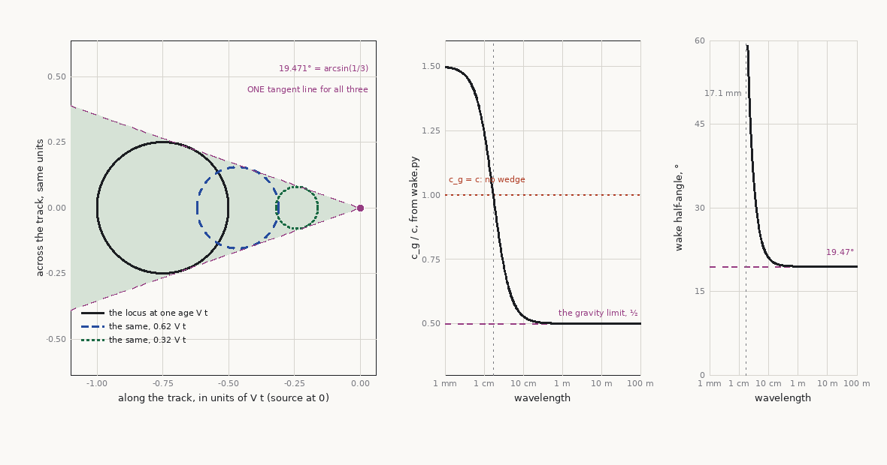

# Real-Time Fluid Simulation

The engine half of "the tool provides causes, the engine provides motion". `12` covers water as a
*rendered surface* — wave synthesis, optics, shorelines. This chapter covers water as a *simulated
body*: when a heightfield is no longer enough, what the alternatives actually are, what each one
structurally cannot do, and how simulated liquid gets drawn and coupled to physics.

Scope: **real-time only.** Offline film-quality liquid simulation is out of scope and stays there;
it appears below solely where it establishes the lineage of a real-time technique. Terrain-side
liquid *identity* — what the liquid is, its optics and rheology — is terrain-architect `28`;
terrain-side liquid *history* — erosion, deposition, lava emplacement — is that skill's `04`/`19`.

Contents: [The representation procedure](#the-representation-procedure) ·
[Tier 1 — heightfield](#tier-1--heightfield-methods) ·
[Tier 2 — particles](#tier-2--particle-methods-sph-and-descendants) ·
[Tier 3 — hybrid grid-particle](#tier-3--hybrid-grid-particle-picflipapic) ·
[Tier 4 — MPM](#tier-4--mpm-and-multi-phase-materials) ·
[Drawing a particle fluid](#drawing-a-particle-fluid) ·
[Coupling and buoyancy](#coupling-and-buoyancy) ·
[Domains, budgets and LOD](#domains-budgets-and-lod) ·
[The fluid authority contract](#the-fluid-authority-contract) ·
[Verification & failures](#verification--failures) ·
[Sources & provenance](#sources--provenance)

## The representation procedure

The same discipline as the terrain paradigm procedure in `SKILL.md`: the representation is chosen
by contract, before any code, and the wrong choice cannot be optimised out. Four questions.

**1. Must the surface overturn?** A heightfield stores one height per column. Breaking waves,
splashes, droplets, pouring, and anything that separates from the bulk are *unrepresentable* — not
expensive, impossible. If the answer is yes anywhere the camera lives, no amount of heightfield
tuning fixes it.

**2. Is it a surface or a volume?** An ocean is a surface with a datum; a bucket of water, a
flooding room, or a river you can divert is a volume with a free boundary. Volumes need mass
tracked, not just displacement.

**3. Who interacts, and in which direction?** Nothing (ambient) → one-way (fluid pushes bodies) →
two-way (bodies displace fluid). Each step up costs a solver stage and a synchronisation point.

**4. What scale and persistence?** A puddle sim over 8 m for 10 seconds and a river sim over 8 km
that must persist across a save are different problems. Persistence in particular forces the
authority question at the end of this chapter.

| Contract | Representation | Tier |
|---|---|---|
| Ambient ocean/lake surface, no interaction | Procedural wave synthesis — *not a simulation* | `12` |
| Surface that ripples, reflects obstacles, carries wakes; never overturns | Heightfield: shallow-water or wave-equation patch | 1 |
| Splashes, pouring, small detached volumes, foam/spray | Particles (PBF/SPH) | 2 |
| Large sloshing volume, flooding, high-quality free surface | Hybrid grid-particle (FLIP/APIC) | 3 |
| Mud, snow, sand, lava — yield stress, granular, multi-phase | MPM | 4 |

**Expect a hybrid**, exactly as with terrain: a shipped world is usually procedural ocean far,
heightfield patch near the player, and particles for the splash and spray on top — three
representations under one art direction, with the seams designed rather than discovered.

## Tier 1 — heightfield methods

A 2.5D field, one height (and usually one velocity) per cell. Cheap, stable, trivially GPU'd,
trivially collided against, and the workhorse of interactive water in games.

**Shallow-water equations.** The depth-averaged form of Navier–Stokes, valid when horizontal scale
greatly exceeds depth — which is true of nearly all terrain water:

```
∂h/∂t + ∇·(h·u)      = 0                 # mass:     h = water column height, u = depth-averaged velocity
∂u/∂t + (u·∇)u + g∇(h+b) = 0             # momentum: b = bed elevation (the terrain underneath)
```

They give you real wave propagation, correct reflection and refraction around obstacles, damming
and draining, and flooding that follows the terrain — all from the bathymetry the generator
already exported.

**The pipe (virtual-pipe) model** is the same physics discretised as flux between neighbouring
cells through virtual pipes, which is unconditionally friendly to GPU implementation and is the
same machinery the generator uses for hydraulic erosion (terrain-architect `04`). If both sides
implement pipes, they share a mental model and a debug view.

**Wave-equation / convolution patches** drop mass transport and keep only surface disturbance —
the classic interactive-ripple patch of `12`. Cheapest of all; cannot flood, cannot drain.

**What Tier 1 structurally cannot do:** overturn, splash, separate, or represent more than one
water surface per column (no water under a bridge *and* in a cave below it). Everything else about
it is a virtue.

## Tier 2 — particle methods (SPH and descendants)

Lagrangian: carry the fluid as particles, evaluate field quantities by smoothing over neighbours
with a kernel `W(r,h)`. No grid, no domain bounds, free surfaces and splashes for free, mass
conserved exactly because mass *is* the particles.

**The founding real-time paper is Müller, Charypar & Gross (SCA 2003)** — SPH with force density
fields derived directly from Navier–Stokes plus a surface-tension term, explicitly aimed at
interactive rates. Everything below descends from it.

**The central problem is incompressibility.** Naive SPH uses a stiff equation of state: pressure
rises steeply with density error, which forces tiny timesteps or tolerates visible compression
(fluid that squashes and springs). The descendants are all attacks on that one problem:

| Variant | Approach | Trade |
|---|---|---|
| **PCISPH** (Solenthaler & Pajarola 2009) | Predictive-corrective: iterate pressure to drive predicted density error to zero, without a global Poisson solve | Larger steps than WCSPH; iteration cost |
| **IISPH** (Ihmsen et al. 2014) | Implicit discretisation of the pressure Poisson equation | Better convergence at low compressibility |
| **DFSPH** (Bender & Koschier 2015) | Enforce *both* zero density error and zero divergence (two solvers) | Large stable steps; the modern SPH default |
| **PBF** (Macklin & Müller-Fischer 2013) | Reformulate density as a **positional constraint** solved by Position Based Dynamics | Very large steps, unconditionally stable, game-grade |

**Position Based Fluids (Macklin & Müller-Fischer, SIGGRAPH 2013) is the one games actually use.**
It inherits PBD's stability, tolerates large timesteps, and slots into a unified solver alongside
rigid bodies, cloth and ropes — which matters more in a game than physical exactness, because the
coupling comes free. If you are adding liquid to a game engine today and do not have a strong
reason otherwise, this is the default.

**What Tier 2 costs you:** neighbour search every step (the real cost, and the thing to optimise —
spatial hashing, Z-order, GPU bucketing); particle count scales with *volume*, so large bodies are
brutal; and the surface is implicit, so drawing it is its own problem (below). Pressure/density
noise shows up as jitter at rest — a resting pool that shimmers is the tell.

## Tier 3 — hybrid grid-particle (PIC/FLIP/APIC)

Carry mass and velocity on particles, but solve pressure/incompressibility on a **grid**, then
transfer back. You get the grid's cheap, accurate pressure projection and the particles' exact mass
transport and free surface.

- **PIC** (particle-in-cell) transfers velocity particle→grid→particle each step. Stable, but each
  round trip is an interpolation, and interpolation is dissipation: PIC water looks like syrup.
- **FLIP** transfers only the *velocity change* back to particles, so the dissipation cancels.
  Introduced to graphics by **Zhu & Bridson (SIGGRAPH 2005)** — the "animating sand as a fluid"
  paper, which also observed that a water solver becomes a sand solver with a friction term. FLIP
  is energetic and lively, and noisy: particle velocities can drift out of agreement with the grid.
- **APIC** (**Jiang, Schroeder, Selle, Teran & Stomakhin, SIGGRAPH 2015**) gives each particle a
  locally *affine* velocity description rather than a constant one. It recovers FLIP's low
  dissipation without FLIP's noise, and is angular-momentum conserving. **If you are choosing
  today, choose APIC over raw FLIP** — the extra state per particle is small and the stability win
  is large.

In practice FLIP/APIC is the quality tier: it is what film uses and what the best real-time liquid
demos use, and it is viable in real time for *bounded* domains (a room, a boat's interior, a
hero pool) rather than open worlds.

## Tier 4 — MPM and multi-phase materials

The Material Point Method is the continuum-mechanics generalisation of the hybrid tier: particles
carry a deformation gradient and a constitutive model, the grid solves the momentum update.
**Stomakhin, Schroeder, Chai, Teran & Selle (SIGGRAPH 2013)** — the Disney snow paper — is the
landmark, and the reason MPM matters here: it handles materials with **yield stress and
plasticity**, which is exactly the class terrain-architect `28` identifies as "everything that is
not water". Mud, wet snow, sand, lava crust and foam are all MPM's natural territory, and none of
them is representable by a water solver.

Real-time MPM is at the frontier: viable for bounded, hero-scale effects on modern GPUs, not for
world-scale liquid. Reach for it when the *material* is the point (a mudslide, deep snow the player
ploughs through), not when water is the point.

## Drawing a particle fluid

A particle fluid has no surface — you have to invent one, and the choice matters as much as the
solver.

**Screen-space fluid rendering is the real-time default** (van der Laan, Green & Sainz, I3D 2009).
It never builds a mesh:

```
1. Render particles as sphere impostors -> DEPTH buffer only (point sprites, analytic sphere depth)
2. SMOOTH that depth buffer      <- the load-bearing step: curvature flow, or bilateral/separable blur
3. Reconstruct NORMALS from the smoothed depth (ddx/ddy of view-space position)
4. Render particle THICKNESS additively in a second pass (no depth test)
5. Shade: Fresnel + reflection + refraction, absorption via exp(-sigma * thickness)  [12]
```

Its virtues are exactly the ones that matter in a frame budget: no polygonisation, no marching-cubes
grid artifacts, cost proportional to *screen* area rather than volume, and inherent view-dependent
LOD. The smoothing step is what stops the fluid reading as a clump of balls — under-smooth and it is
blobby, over-smooth and it shrink-wraps and loses splash detail.

**Isosurface meshing** (marching cubes / surface nets over a density field — the machinery of `05`)
is the alternative. Choose it when the fluid must be re-lit like normal geometry, cast conventional
shadows, be intersected by other systems, or persist as an asset. Pay for it in grid resolution and
temporal popping of the mesh.

**Diffuse particles are a separate, cheaper class layered on top.** Production practice splits
aerated water into three sets seeded from the same criterion — high local curvature, high relative
velocity, or trapped air:

| Class | Behaviour | Rendering |
|---|---|---|
| **Spray** | Ballistic, above the surface, gravity + drag only | Camera-facing sprites, bright, short-lived |
| **Foam** | Rides the surface, advected with it | Surface-projected texture/sprites, opaque white |
| **Bubbles** | Below the surface, buoyant, advected by fluid | Refractive sprites, or a density term in the volume |

These are not the simulation — they are *classified debris* driven by it, an order of magnitude
cheaper, and they are what actually sells a splash. See `12` for the optics of aerated water
(white from multiple scattering at air–water interfaces, not from a foam texture).

## Coupling and buoyancy

**One-way (fluid → body)** is cheap and covers most gameplay: sample the fluid, apply forces to the
rigid body, done. **Two-way (body → fluid as well)** requires the solver to see the body as a
boundary condition, and is where cost and instability live.

**Floating a boat on heightfield/ocean water — the production idiom.** Do *not* try to integrate
pressure over a hull. Place N probe points on the hull, sample the wave surface at each, and apply
a buoyant force per probe proportional to its submerged depth:

```
for each probe p on the hull:
    waterY      = SampleWaveSurface(p.xz, t)        # the SAME evaluator the renderer uses [12]
    submersion  = clamp(waterY - p.y, 0, maxDepth)
    F_buoy      = rho_water * g * submersion * areaPerProbe * up
    F_drag      = -dragCoef * relativeVelocityAt(p)   # separate linear + angular terms
    ApplyForceAtPosition(body, F_buoy + F_drag, p)
# torque falls out of applying at multiple offset points - this is what makes a boat pitch and roll
# drag refinement with a shipped first-party citation: scale resistance by the PROJECTED AREA of
# the body along its velocity (Tears of the Kingdom, GDC 2024) - a plate broadside drags far more
# than edge-on, which is what makes rafts steer and paddles work
```

Three probes float; four to eight give convincing pitch and roll; more buys little. The critical
correctness rule: **the physics must sample the same wave function the renderer displaces with**,
at the same time value, or the boat visibly floats above or sinks into its own wake. If the
renderer displaces on the GPU, either evaluate the analytic waves again on the CPU or read back
with a declared frame latency and accept it (`17`'s async-readback discipline).

**Amortize the queries; they are the real cost.** Wave evaluation on the CPU is what floating things
actually cost — probes × bodies × frames, each a Gerstner sum or a cascade fetch — and the shipped
answer is to spread it: update a fixed **number of probe points per frame** round-robin rather than
every probe every tick, and let a quiescent body **pause for N frames** between updates entirely,
with rigid-body integration carrying it in between. Unreal's buoyancy component exposes exactly these
two dials, which is a good sign they are the right ones. Two rules make it safe: the latency is
*declared* (a fast hull in a heavy sea is where it shows, and the fix is a higher rate for hero
bodies, never a global raise), and the round-robin order is stable, or probes on the same hull sample
different times and the boat shivers.

**Bodies displacing the fluid.** For a heightfield, inject a negative displacement (or a velocity
source) at the hull's footprint each step — that is a wake, and it costs almost nothing. This is
the cheapest genuinely two-way coupling available and it covers boats, swimming characters and
falling debris.

**Kelvin wakes.** A steadily moving vessel in deep water generates a wake whose half-angle is
**arcsin(1/3) ≈ 19.47°**, and — the useful part — that angle is *independent of speed*, because it
follows from deep-water group velocity being half the phase velocity. So the V behind a boat is a
constant-shape pattern that can be authored as a texture/decal parameterised by speed rather than
simulated, with the sim reserved for the near-hull disturbance. In shallow water, or above roughly
Froude number 1, the pattern changes and narrows — if the game has shallows, either handle it or
keep boats in deep water.

The half-angle is a function of the ratio `c_g/c` **and of nothing else**, which is both why it is
speed-free and where its limits are. Write the steady pattern's locus: a disturbance of age `t`,
radiating at angle `θ` to the track, sits at `V·t·(−1 + r cos²θ, r cosθ sinθ)` with `r = c_g/c`.
That is self-similar in `V·t` — the wedge is scale-free, so speed cannot enter — and its half-angle
is `max_θ atan(r sinθ cosθ / (1 − r cos²θ))`, which at `r = ½` is exactly `arcsin(1/3)`. It follows
that **there is a third regime the paragraph above does not name**: capillarity. Below about 10 cm
`r` leaves ½ on deep water alone, and the wedge *widens* rather than narrowing; at the capillary
minimum (17.1 mm, 0.231 m/s) `c_g = c`, `r = 1`, and there is no wedge at all. Ship wakes never go
there; a jet in a swimming pool lives entirely inside it, which is why `12`'s wake is not a Kelvin
wedge and is not drawn as one.



> **Figure 19·1 — the angle is a ratio, and the ratio is not always ½.** `P` for the construction
> (Kelvin 1887), `D` for the capillary band. Drawn by
> [`figures/make_figures.py`](figures/make_figures.py) (`fig_kelvin_wake`); `r` is never assumed —
> it is measured from `reference-impl/wake.py`'s `sigma_w` and `c_group`, one capillary-gravity
> dispersion relation with both halves taken from it. **Left, drawn isometrically so the angle is
> the angle:** the constant-age loci at three speeds. They are three different sizes and the tangent
> from the source is **one line** — that is the speed-independence as a picture rather than as an
> assertion, and it is why the V can be a decal. **Middle:** `c_g/c` against wavelength. It is ½ to
> four figures across the whole gravity range, turns up through the capillary band, and reaches 1 at
> the 17.1 mm minimum, where `wake.py`'s own `C_MIN` is the phase speed. **Right:** the half-angle
> that follows. 19.47° wherever the ratio is ½, climbing steeply once it is not, and **ceasing to
> exist** past the minimum — beyond it the energy outruns the phase and there is no trailing wedge
> to have an angle.

## Domains, budgets and LOD

Fluid does not stream, so the domain is a budget decision made explicitly:

- **Follow the camera/player** with a sim patch, and **fade the sim's contribution to zero over the
  outer ~15% of the domain** (`12`) so the boundary is never a visible edge. A hard edge where
  wakes stop existing is one of the most-reported water artifacts.
- **Nest resolutions** rather than one huge grid: fine near, coarse far, procedural beyond.
- **Budget in particles and cells, and assert it** — like every other budget in this skill. Particle
  count scales with volume, so doubling a pool's linear size is 8× the particles.
- **Decouple sim rate from frame rate.** Accumulate-and-step at a fixed timestep; a sim whose
  stability constant depends on frame rate will explode on a hitch (`12`).
- **Sleep and cull.** A pool nobody is looking at, with no interaction, should be a heightfield or a
  flat plane. Promote on interaction, demote on quiescence, with hysteresis.

## The fluid authority contract

Directly parallel to the deformation authority contract in `SKILL.md` Part 3, and it exists for the
same reason: **every fluid effect is exactly one of two things, and there is no middle.**

- **Cosmetic GPU state.** Ripples, splashes, spray, foam, wakes, puddle response. GPU-only,
  camera-local, non-authoritative. Physics, navigation, replication and the server all ignore it.
  It may be dropped on a low tier or when off-screen, and nothing depends on it.
- **Gameplay liquid state.** A flood that rises and drowns, a dam the player breaks, a channel
  diverted, water that persists in a save. This is CPU/server-owned, versioned, replicated,
  persisted, and committed before gameplay treats it as real; the GPU renders its authoritative
  result.

There is no automatic promotion from the first to the second, and no GPU readback that makes
cosmetic water authoritative. Deciding to promote is a **gameplay feature with a budget, a
synchronisation design and a replication story** — which is why "can the player flood the
basement?" is an architecture question asked at design time, not a shader question. Water that
changes the navigable world also invalidates collision and navmesh: route that to `17`.

The contract's strongest form is **water as a drivable surface** (the Wave Race → Mario Kart
World lineage, `12`'s stylized section): vehicles ride the wave geometry and dynamic waves —
including ones raised by gameplay events like explosions — serve as ramps. Then the *waves
themselves* are gameplay liquid state: the wave function must be deterministic, evaluated
identically by rendering and vehicle physics (the one-evaluator rule with zero tolerance — a
mismatch is a broken road, not a floating-boat artifact), CPU/server-owned, and synchronized
across the network in multiplayer. Cosmetic detail layers may ride on top; nothing the vehicle
touches may come from them.

## Verification & failures

| Symptom | Mechanism | Minimal fix |
|---|---|---|
| Resting pool shimmers/jitters | Pressure/density noise (SPH), or FLIP velocity drift | Raise solver iterations; switch FLIP→APIC; add a rest damping term |
| Fluid visibly compresses and springs | Stiff equation-of-state SPH with too large a step | Move to a corrective/constraint solver (DFSPH, PBF) |
| Liquid looks like syrup | PIC dissipation from repeated interpolation | FLIP/APIC velocity-delta transfer |
| Fluid reads as a clump of balls | Screen-space depth not smoothed enough | Increase curvature-flow iterations / bilateral radius |
| Splashes shrink-wrap and lose detail | Depth over-smoothed | Reduce smoothing; add diffuse spray particles for the detail |
| Boat floats above or sinks into its own wake | Physics samples a different wave evaluator or time than the renderer | One evaluator, one time value; declare readback latency |
| Wakes stop at an invisible line | Sim domain boundary with no fade | Fade contribution over the outer ~15% of the domain |
| Sim explodes after a frame hitch | Timestep tied to frame time | Fixed-step accumulate-and-step, clamp per-step injection |
| Flood drowns the player but not the AI | Cosmetic water treated as gameplay state on one side only | Declare authority; navmesh/collision follow the authoritative field |

**Debug views to build before you need them:** particle count and neighbour-count heatmap; density
error per particle; sim domain bounds and fade band; velocity field arrows; the smoothed depth
buffer and reconstructed normals as separate views (most screen-space fluid bugs are visible in
exactly one of them).

## Sources & provenance

Tiers per `00`: **P** paper · **T** talk · **D** docs · **F** folklore · **?** unverified.

- **P** — Kass & Miller, "Rapid, Stable Fluid Dynamics for Computer Graphics" (SIGGRAPH 1990): the
  founding real-time heightfield water paper; the shallow-water/wave-equation patch lineage.
- **P** — Stam, "Stable Fluids" (SIGGRAPH 99 Conference Proceedings, 121–128): unconditionally
  stable semi-Lagrangian advection — the reason grid fluid became real-time-plausible at all.
  Verified 2026-08.
- **P** — Müller, Charypar & Gross, "Particle-Based Fluid Simulation for Interactive Applications"
  (ACM SIGGRAPH/Eurographics Symposium on Computer Animation, 2003, 154–159): SPH for interactive
  rates; force densities from Navier–Stokes plus surface tension. Verified 2026-08.
- **P** — Macklin & Müller-Fischer, "Position Based Fluids" (ACM TOG 32(4), SIGGRAPH 2013): density
  as a positional constraint in the PBD framework; large timesteps, unified solver. **The games
  default.** Verified 2026-08.
- **P** — Zhu & Bridson, "Animating Sand as a Fluid" (ACM TOG 24(3), 965–972, SIGGRAPH 2005): FLIP
  in graphics, and the water-solver-plus-friction-equals-sand observation. Verified 2026-08.
- **P** — Jiang, Schroeder, Selle, Teran & Stomakhin, "The Affine Particle-In-Cell Method"
  (ACM TOG 34(4), Article 51, 2015): locally affine particle velocity; FLIP's low dissipation
  without FLIP's noise. Author list and article number verified 2026-08.
- **P** — Stomakhin, Schroeder, Chai, Teran & Selle, "A Material Point Method for Snow Simulation"
  (SIGGRAPH 2013): the MPM landmark; elasto-plastic constitutive model on a hybrid
  Eulerian/Lagrangian grid. Verified 2026-08.
- **P** — van der Laan, Green & Sainz, "Screen Space Fluid Rendering with Curvature Flow"
  (I3D 2009, 91–98): sphere impostors → depth smoothing → normal reconstruction → thickness pass.
  Verified 2026-08.
- **P** — Kelvin wake half-angle `arcsin(1/3) ≈ 19.47°`, speed-independent in deep water because
  deep-water group velocity is half the phase velocity. William Thomson (Lord Kelvin), "On Ship
  Waves", *Proceedings of the Institution of Mechanical Engineers* 38, 409–434 (1887). Verified
  2026-08.
- **D** — That the half-angle is `max_θ atan(r sinθ cosθ / (1 − r cos²θ))` for a general
  group-to-phase ratio `r`, reducing to `arcsin(1/3)` at `r = ½`; that the locus is self-similar in
  `V·t` and therefore speed-free; and that the wedge widens and then ceases to exist through the
  capillary band, with `r = 1` at the 17.1 mm minimum. Derived and drawn in
  `figures/make_figures.py` (`fig_kelvin_wake`), with `r` measured from `reference-impl/wake.py`'s
  own dispersion relation rather than assumed. The capillary regime is not in Kelvin and is not a
  correction to him — it is outside the deep-water-gravity limit his result is stated in.
- **P** — **SPH incompressibility variants** (verified 2026-08): Solenthaler & Pajarola,
  "Predictive-Corrective Incompressible SPH", *ACM TOG* 28(3) (SIGGRAPH 2009), 40:1–40:6;
  Ihmsen, Cornelis, Solenthaler, Horvath & Teschner, "Implicit Incompressible SPH", *IEEE TVCG*
  20(3), 426–435 (2014); Bender & Koschier, "Divergence-Free Smoothed Particle Hydrodynamics",
  *ACM SIGGRAPH/Eurographics Symposium on Computer Animation* (SCA 2015) — DFSPH enforces
  incompressibility on both position and velocity level, compression below 0.01%.
- **T** — Dohta, Takayama & Osada, "Tunes of the Kingdom: Evolving Physics and Sounds for 'The
  Legend of Zelda: Tears of the Kingdom'" (GDC 2024): water resistance from the projected area of
  the body along its velocity — a shipped first-party refinement of the drag term.
  [GDC Vault](https://gdcvault.com/play/1034667/Tunes-of-the-Kingdom-Evolving). Verified 2026-08.
- **F** — Water as a drivable gameplay surface (Wave Race 64 → Mario Kart World lineage):
  mechanism reconstruction from press and footage — Nintendo has published no talk; Mario Kart
  World claims are launch-window coverage. The *doctrine* it exemplifies (deterministic
  one-evaluator waves as gameplay state) is this skill's authority contract, not a citation.
- **D/F** — Amortized buoyancy queries (round-robin probe updates per frame, whole-body pause
  between updates): the two dials are shipped as `N Points Per Frame` and `N Frames Pause` on
  Unreal's buoyancy component, surfaced from Epic's water-waves/buoyancy documentation in 2026-08
  search rather than a page-by-page read (**?** on the exact names per version). The technique and
  the stable-ordering/declared-latency rules are standard practice. The wider Water-plugin
  architecture, including the shared CPU/GPU wave evaluator, is `12`'s engine-native section.
- **F** — Probe-point buoyancy, diffuse-particle spray/foam/bubble classification, sim-domain fade
  fractions, sleep/promote hysteresis, and the debug-view list: universal production practice with
  no single canonical source.
- **F** — The fluid authority contract is this skill's doctrine, mirroring its deformation
  authority contract; no external citation.
