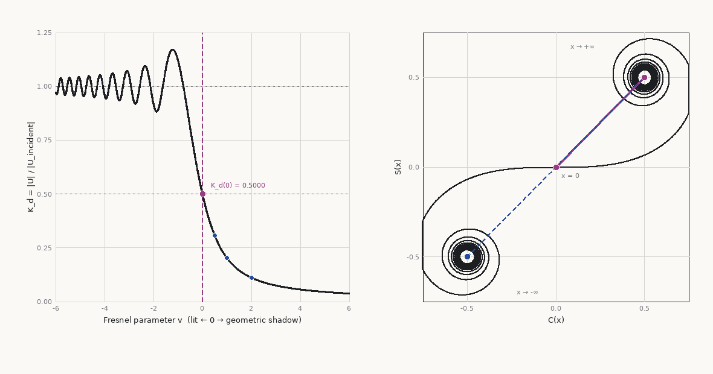
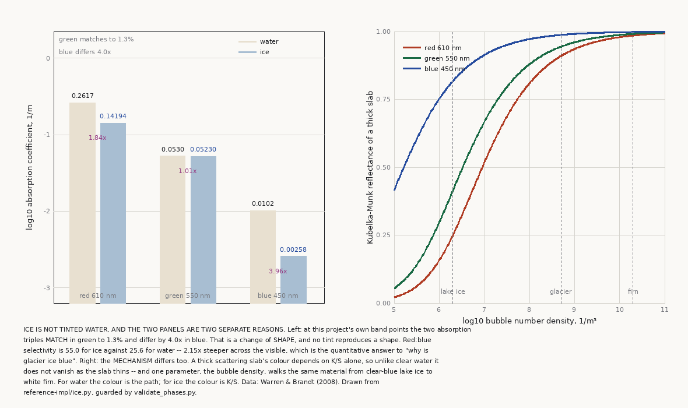
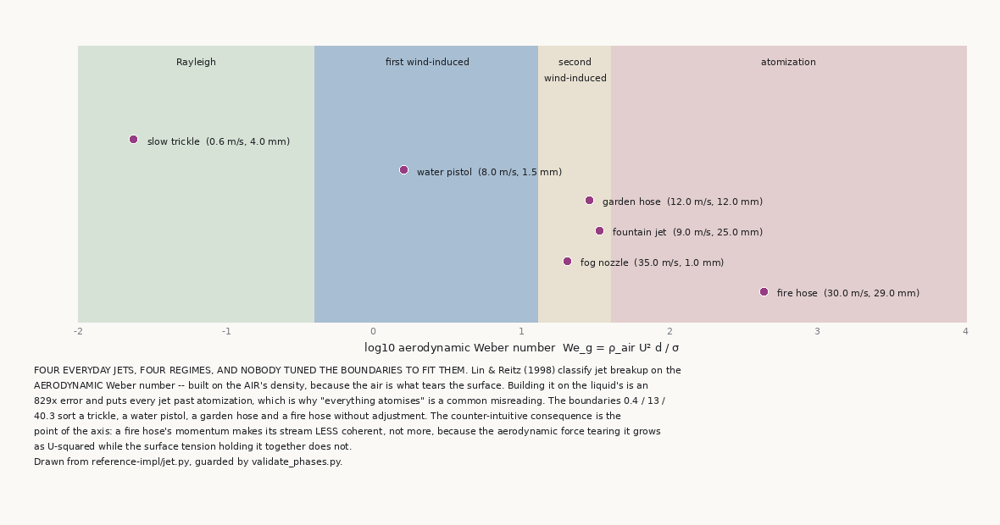
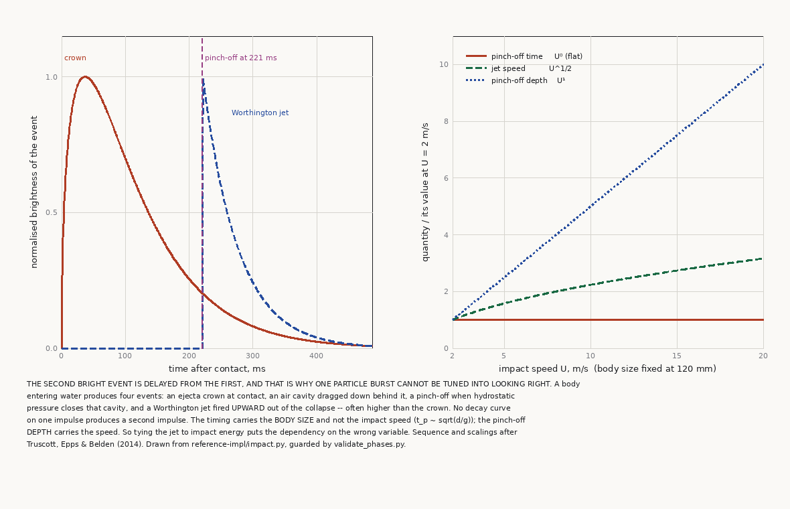
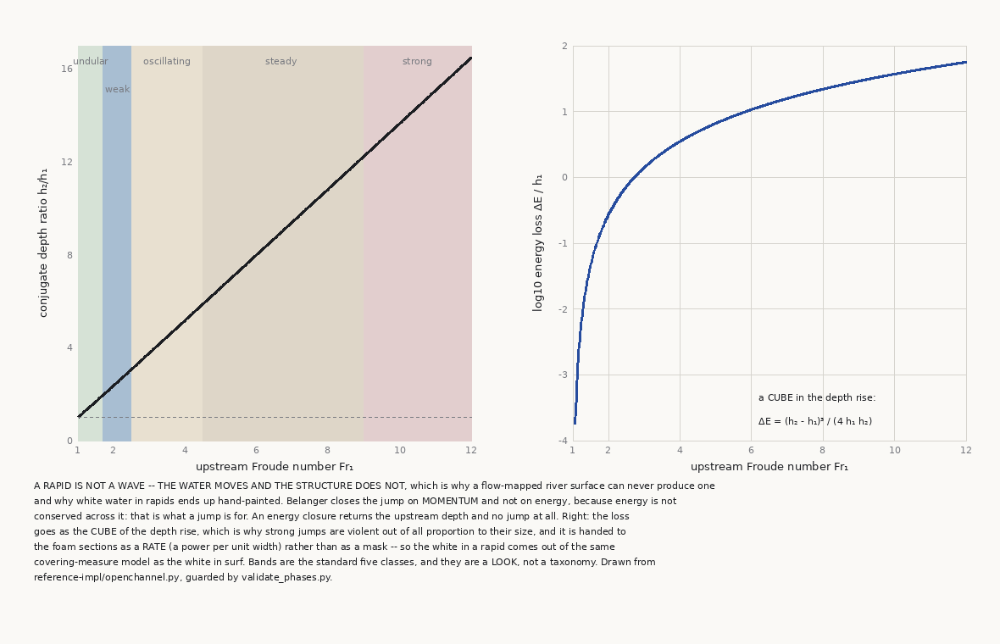
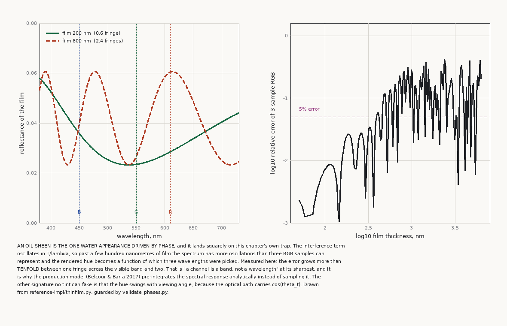
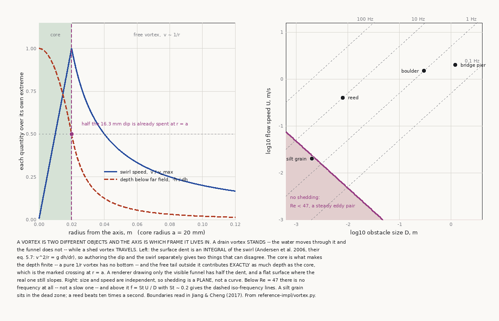
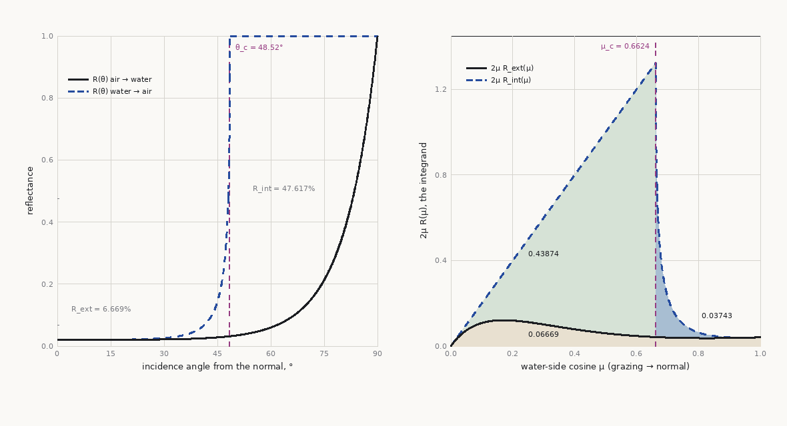
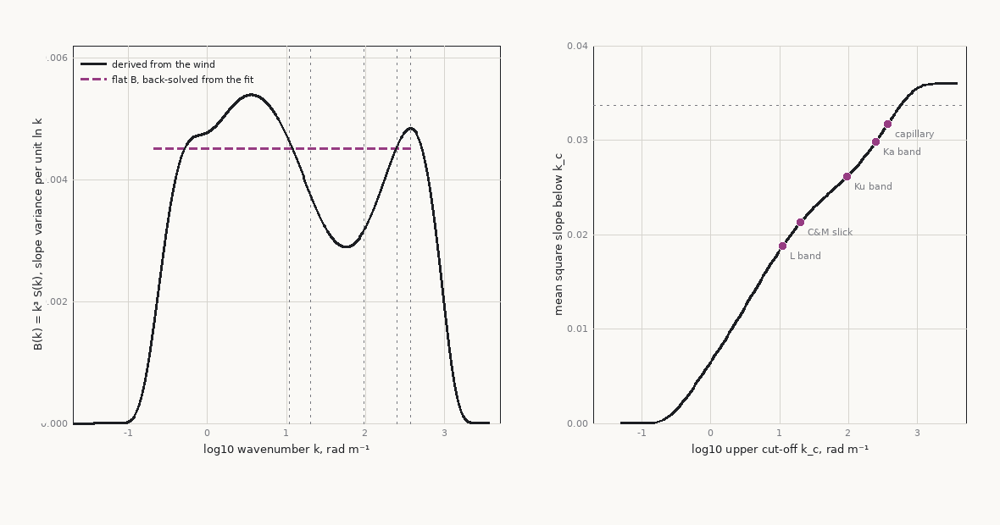
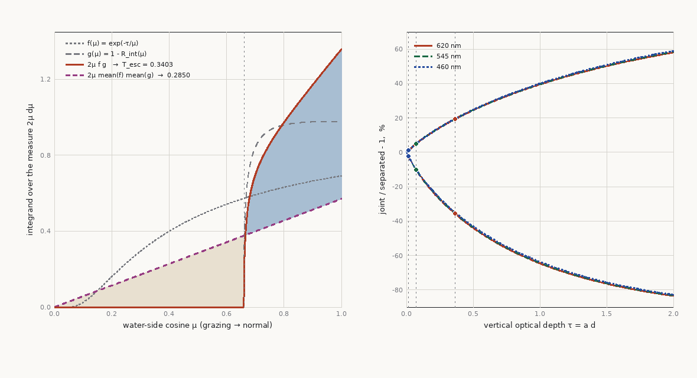

# Water Physics

**Every number a water renderer needs, with its derivation and its warrant.** This chapter is the
mechanism side of water: what the air/water interface does to light, where a water body's colour
comes from, how a wave shoals and refracts and breaks, what foam is made of and what it returns,
and how a wind speed becomes a slope distribution. It is paired with an implementation — a pool,
an open coast and a screen-space pass — and every quantity here is checked by one of their suites
against a closed form, a published measurement or an independent method.

**Where the rest of this chapter lives.** The derivations and pseudocode are in
[`12a-water-derivations.md`](12a-water-derivations.md), with the suite row that guards each. The
sources, tiers and every `?` are in [`12b-water-provenance.md`](12b-water-provenance.md) — read it
before citing anything here. The **render-side architecture** — surface LOD, the
fullscreen-triangle pass, pass ordering, what to pre-cook, engine-native water systems, shoreline
integration, and the diagnostic index that routes a symptom on screen to a mechanism — is
`terrain-renderer`'s [`12-water-rendering.md`](../../terrain-renderer/references/12-water-rendering.md),
which routes here for every number it quotes.

Contents: [Sea states: the energy ladder](#sea-states-the-energy-ladder) ·
[Calm water: the low-energy regime](#calm-water-the-low-energy-regime) ·
[Shallow water: the physics](#shallow-water-the-physics) ·
[Aerated water: foam, spray and whitewater](#aerated-water-foam-spray-and-whitewater) ·
[Six axes the rest of this chapter is a point on](#six-axes-the-rest-of-this-chapter-is-a-point-on) ·
[Man-made water: pools, tanks and channels](#man-made-water-pools-tanks-and-channels) ·
[Shading and optics](#shading-and-optics) ·
[Caustics: the other half of the light path](#caustics-the-other-half-of-the-light-path) ·
[Attenuation and escape, and what a table separates](#attenuation-and-escape-and-what-a-table-separates)

---

## Sea states: the energy ladder

Water is not one rendering problem. A mirror-calm lake and a storm sea share a surface model and
almost nothing else: which techniques matter, which dominate the frame, and which can be switched
off entirely all change with energy. The Beaufort scale — long since given standard wind-speed and
sea-state equivalents by the meteorological bodies — is the right spine, because its descriptors
are *visual observations* and therefore map directly onto rendering features.

| Bft | Wind (kt) | Observed sea (NOAA/WMO wording) | What the renderer must switch on |
|---|---|---|---|
| 0 | <1 | "Sea surface smooth and mirror-like" | Reflection fidelity is everything; **minimum slope-variance clamp** or the sun becomes a Dirac |
| 1 | 1–3 | "Scaly ripples, no foam crests" | Capillary detail only — normal-map band, no displacement |
| 2 | 4–6 | "Small wavelets, crests glassy, no breaking" | Displacement begins; still no foam anywhere |
| **3** | **7–10** | "Large wavelets, crests begin to break, **scattered whitecaps**" | **Foam turns on here** — the Jacobian/coverage path starts contributing |
| 4 | 11–16 | "Small waves, numerous whitecaps" | Whitecap coverage climbs steeply; glitter path widens |
| **5** | **17–21** | "Moderate waves, many whitecaps, **some spray**" | **Spray particles turn on**; foam becomes a major albedo term |
| 6 | 22–27 | "Larger waves, whitecaps common, more spray" | Aerated water is now a first-class material, not a decal |
| **7** | **28–33** | "Waves 13–19 ft, **white foam streaks off breakers**" | **Streaked, advected foam** — orientation along wind matters |
| 8 | 34–40 | "Edges of crests begin to break into **spindrift**, foam blown in streaks" | Wind-torn spray leaving the crest; strong aerial perspective |
| 9–11 | 41–63 | "Dense streaks of foam, spray may reduce visibility" → "foam patches cover sea" | Spray becomes atmospheric — a participating medium, not sprites |
| 12 | 64+ | "Sea completely white with driving spray" | Foam coverage saturates; the surface is barely water any more |

Three transitions are worth hard-coding as feature gates, because they are observational facts
rather than art direction: **whitecaps begin at Force 3**, **spray begins at Force 5**, and **foam
streaks begin at Force 7**. They also cross-validate the coverage model in
[Distance and filtering](../../terrain-renderer/references/12-water-rendering.md#distance-and-filtering-why-far-water-turns-to-plastic): Monahan's
`W = 3.84e-6·U^3.41` puts whitecap coverage at essentially zero around 5 m/s (~0.1%) and
conspicuous by 15 m/s (~4% of the surface), and Force 3 is 7–10 kt ≈ 3.6–5.1 m/s. An empirical formula and a 19th-century observational scale
agreeing on where foam starts is a good sign both are right — and a strong argument for driving
foam from wind rather than from a hand-tuned constant.

The **WMO sea state code** (built on the Douglas scale) is the parallel system, and
it classifies the *sea* rather than the *wind* — useful when swell arrives from a distant storm and
local wind does not explain the surface. Significant wave height `H_s` (the mean of the highest
third, and `≈ 4·sqrt(m₀)` from the spectrum's zeroth moment) is its currency and the natural
parameter to expose in a wave-spectrum UI.

**One wind, every consumer.** The same wind speed must drive the wave spectrum, the whitecap
coverage, the glitter slope variance, the spray rate and the foam streak direction. Wiring them
separately is how you get a mirror-calm sea covered in foam, or a gale with a needle-sharp sun
highlight — both instantly wrong, and both common.

## Calm water: the low-energy regime

Beaufort 0–2 is not "the easy case with the waves turned down". It is a distinct regime that
breaks several assumptions the rest of this chapter relies on, and it is where a water renderer
most often looks *obviously* synthetic — because there is nothing left to hide behind. The
classic failure on a millpond is one of two: the sea goes to patent leather, or to a black void
with one searing highlight.

**There is a smallest possible wave, and it is not zero.** Including surface tension, the
dispersion relation is

```
omega^2 = ( g*k + (sigma/rho)*k^3 ) * tanh(k*h)      # sigma = surface tension, rho = density
```

The `k³` term means phase speed *rises* again for very short waves, so it has a **minimum**, and
both halves of that minimum come from **one** surface tension:

```
sigma = 0.0728 N/m, rho = 1000 kg/m^3, g = 9.81 m/s^2      # reference-impl/wake.py: SIG, RHO, G
c_min    = (4 g sigma / rho)^(1/4)  = 0.23119 m/s = 23.12 cm/s
k_min    = sqrt(rho g / sigma)                              # the same k minimises c and c_g
lam_min  = 2 pi sqrt(sigma / (rho g)) = 0.017116 m = 1.712 cm
```

⚠️ **Quote the pair from one `σ` or do not quote it as a pair.** This chapter carried
**23.1 cm/s at 1.73 cm** for its whole run and
[`00`'s ledger](../../terrain-renderer/references/00-index.md#least-confident-claims-ledger) recorded the
two as *verified together*. They are not consistent: 23.1 cm/s inverts to `σ = 0.07256 N/m` and
1.73 cm to `σ = 0.07437 N/m` — **2.5% apart in `σ`**, 1.1% in `λ`. Both are inside the ordinary
spread of published clean-water values, which is exactly why the mismatch survived being checked:
each number is defensible alone and the *pair* is not. Nothing downstream moves at this precision,
so it is a **provenance defect rather than a numerical one** — and this project treats that as the
worse kind, because a pair marked verified that cannot both be right is a claim whose check has
been spent without being made. The rule that prevents the recurrence is the one used for `c` versus
`K_d` and for per-axis versus total slope: **declare the constant once, upstream, and derive every
consequence from it at the point of use.** `σ` is the declaration above; `c_min` and `λ_min` are
two lines of it. (`D` for both closed forms from `σ`; `P/?` for `σ` itself, whose published
clean-water values at 20 °C span roughly 0.0724–0.0729 N/m and which
[the meniscus](#the-meniscus-line-where-reachability-cannot-fail) reads at `ρ = 998`.)

Below that wavelength you are in the capillary
regime (surface tension restoring), above it the gravity regime. Two consequences: a spectrum has
a natural high-frequency cutoff around a couple of centimetres — ripples finer than the minimum
are *damped out rather than supported*, so a renderer that keeps adding finer normal-map octaves
to "sharpen" calm water is fabricating detail the physics forbids, and will alias for its
trouble — and wind cannot raise waves at all until it can push past that minimum
speed, which is why a breeze produces *patches* of ripple ("cat's paws") separated by glassy
water rather than uniform texture.

**One slope convention, fixed for the whole chapter.** `s` is the **total** rms slope,
`s = √⟨|∇h|²⟩ = √(σ_x² + σ_y²)`; *slope variance* and *mean-square slope* mean `s²`. The per-axis
`σ = s/√2` is equally standard and is what Gaussian and Rayleigh tail arithmetic takes, so where a
formula needs it the relation is written at the point of use and the unit never switches silently.
The mix is cheap to make and expensive to find: `/2` is the `⟨cos²⟩ = ½` of a plane-wave sum in one
place and a per-axis split in another, so every band stays individually defensible while the budget
summing them is wrong by `√2` on whichever band was restated. Quote the convention with every slope
figure, and read `σ` from its label — it also carries surface tension, frequency and extinction.

**Dead calm is genuinely hard, for a specific reason.** As slope variance → 0, a microfacet
specular lobe collapses toward a Dirac, and energy conservation makes what survives brighter as it
narrows. The result is a single blown-out pixel-ish highlight instead of a sun reflection with
finite extent. The fix is the same one that saves distant water: **clamp the slope variance to a
minimum corresponding to the solar disc** (0.53°), so even a perfectly still surface produces a
sun image of the right angular size — Bruneton et al. state the clamp explicitly. This is the
low-energy end of the same machinery described in
[Distance and filtering](../../terrain-renderer/references/12-water-rendering.md#distance-and-filtering-why-far-water-turns-to-plastic), and the symmetry
is exact: the far sea is calm *in the pixel footprint*. Variance is the common currency at both
extremes.

**What actually sells calm water is reflection fidelity, not the surface.** With slope variance
near zero the water is a mirror, so every reflection error is presented at full strength and
undamped: SSR dropout at screen edges, missing off-screen geometry, a low-resolution cubemap
fallback, a reflection that disagrees with the real scene. Rough water hides all of these; calm
water audits them. Budget accordingly — for a still lake, planar reflection is often the honest
choice precisely because it is the case where SSR's failure modes are most visible.

**Slicks and wind shadows are variance features.** Surface films damp capillary and short gravity
waves — Cox & Munk measured slicked water at **2–3× lower** total mean-square slope than clean sea
(per [Sun glitter](#sun-glitter-the-sparkle-path)) — so an oil slick, a wind shadow behind an
island or a current convergence line renders as a
**smooth mirror patch against rougher water**, not as a dark decal. Modulate the local
slope-variance field; the albedo barely changes. This is also why calm water is rarely uniformly
calm: real still water is a patchwork of glassy and faintly-textured regions — much of what makes
a real calm sea look alive rather than like a plane — and a perfectly
uniform mirror reads as fake almost as strongly as a uniformly rough one.

**Residual swell survives dead calm — on the sea.** Long-period swell is generated by distant
weather and propagates for thousands of kilometres, so a glassy ocean still rises and falls on a
long, very low-amplitude undulation. Killing all displacement at low wind gives a rigid sheet;
keep a long-wavelength, low-amplitude component alive and **decouple it from local wind**, or
moored boats and shorelines stop breathing. (This is also the case the WMO sea-state code exists
for — sea classified by the *sea*, not the wind — see
[Sea states](#sea-states-the-energy-ladder).) **This is gated by `bodyType`**: a lake has no
distant storm feeding it, so it gets *no* residual swell — dead calm on a lake really is a mirror,
and its only waves are local, fetch-limited wind waves. Swell on a mountain tarn is a classic
misclassification tell (the handoff table above; terrain-architect `03`).

**Bands that vanish, and one that does not.** In this regime foam is *absent* (below Force 3),
spray is absent (below Force 5), whitecap machinery contributes nothing, and displacement is
negligible — so the geometry and foam budgets collapse and can be spent on reflection quality
instead. What does *not* vanish is the water-body optics of
[Water-body optical identity](#water-body-optical-identity-where-the-iops-come-from):
with no surface agitation to scatter light, depth-dependent absorption and the bottom return are
the entire look of a calm shallow lake.

## Shallow water: the physics

How a wave arriving from deep water becomes a line of surf: what refraction does and what it
cannot do, why a curved coast needs diffraction to hold its shape, why a surf line breaks up, and
the two limits a single-valued height field runs into.

The **tier ladder** that turns all of this into a shipped shore-wave band — Tiers 1 to 3, shoal
awareness, the wave–current term and the data contract — is render-side and lives in
[`terrain-renderer` `12`](../../terrain-renderer/references/12-water-rendering.md#shallow-water-shoaling-refraction-and-breakers).

### Diffraction is not refraction, and nothing above contains any of it

The refraction bullet says crests "wrap around headlands". That is true of a **headland**, which is
a depth gradient, and it is what every tier below computes. It is *not* what happens behind an
isolated rock, a stack, a jetty head or a breakwater, and the difference is not a matter of degree:

- **Refraction** is eikonal turning of a ray where the wave speed varies. It is in every model in
  this section — the `k(ω,h)` LUT, the travel-time phase field, the per-wave depth response — and
  it is verifiable. On the reference implementation, a marching transform given a plane bed whose
  contours run at 10 / 20 / 30° to its own grid, and never told the rotation, reproduces Snell about
  the rotated normal to **0.186 / 0.310 / 0.277°** (`D`, recomputed here). The mechanism works.
- **Diffraction** is energy spreading *into a geometric shadow*. **It is not in the ray description
  at all** — not approximated badly, not present at low accuracy: a ray carries energy along a path
  and there is no path into the shadow. Adding depth resolution, ray count or LUT precision does not
  produce a single quantum of it.

**What it costs, in one exact number.** For a plane wave past a straight edge the field on the
geometric shadow boundary is the Sommerfeld half-plane result, and it is exactly **half the incident
amplitude** — a quarter of the energy — falling to `K_d` = 0.31, 0.20, 0.11 at Fresnel parameters
`v` = 0.5, 1, 2 into the shadow (`D`, Fresnel integrals evaluated here; `K_d(0) = 0.5000`). A ray
model says **zero** at all four. That is the size of the term, and it is the term that makes a real
lee look like water rather than like a hole.

**The controlling parameter is the obstacle's width over the wavelength, and it decides how far the
shadow reaches before it closes.** Behind an obstacle of width `W`, the lee fills in over a distance
of order `W²/λ` — the distance at which the Fresnel zone grows wider than the obstacle. Computed on
the lee centre line (Fresnel–Kirchhoff, incident amplitude 1, `D`):

| distance behind, in `W²/λ` | 0.1 | 0.25 | 0.5 | 1 | 2 | 4 | 10 |
|---|---|---|---|---|---|---|---|
| amplitude on the centre line | 0.20 | 0.31 | 0.41 | **0.51** | 0.62 | 0.71 | 0.80 |

So `W/λ` is the whole story, because `W²/λ = λ·(W/λ)²`:

- **`W/λ ≫ 1`** — a long island, a full breakwater. The shadow is real and persists for
  `(W/λ)²` wavelengths. Ray optics is a good approximation and diffraction is a soft edge on it.
- **`W/λ ≪ 1`** — a pier piling. The lee closes within a fraction of a wavelength; there is no
  shadow, but there is also almost no feature, so nobody notices the model's.
- **`W/λ ≈ 1`** — an isolated rock in ordinary swell, which is the common case on a rocky coast.
  ⚠️ **This is where ignoring diffraction is worst**: the obstacle is large enough to be a visible
  feature in frame, and the shadow it "should" cast closes within about one wavelength, so a model
  that carves one is wrong across the whole of it. Photographs of surf past an isolated rock show
  the crests bending round and **closing again in the lee within a wave or two**; a ray model does
  not.

**And the failure is not always a shadow — which is the part worth checking before assuming.** A
ray/eikonal transform has no boundary condition for an emergent obstacle at all, so what it does
with one depends on how the depth field is floored. Put a 40 m rock standing 1 m out of the water
into the reference implementation's plan-view march on a flat 8 m shelf (`λ = 74 m`, so
`W/λ = 0.54`) and the rock becomes a `D_MIN` **shoal**, not a boundary: the march refracts rays into
it, focuses them, and delivers a lee centre-line wave height of **3.66 m against a 1.48 m ambient —
2.5× too high, where the truth is a filled-in shadow at roughly ambient** (`D`, measured here). A
different implementation that masks the rock as land and stops propagation gives the opposite
error, a hard-edged hole. **Neither is diffraction, and the two look nothing alike**, so "does the
model have diffraction" cannot be answered by looking at the lee and deciding whether it seems dark
enough.

**The test is one object and it is cheap.** Put an isolated obstacle a wavelength or so across into
the scene and look at what is behind it. For any ray, eikonal or travel-time model the answer is
*no diffraction*, by construction — the value of the test is that it converts a structural fact into
something a reviewer can see in one frame, and it forces the question of whether this scene has any
isolated obstacles in it. If it does not — an open beach, a smooth bay — the term is genuinely
absent from the shot and nothing is owed. If it does, say which of the two errors above the
implementation makes, because they need different fixes: the shoal-focus artefact is fixed by
handling emergent cells as boundaries, and the hard shadow needs an actual diffraction term
(a Sommerfeld/Penney–Price edge solution stamped per obstacle, or a spectral model that carries
directional spreading) rather than a wider filter on the depth field. **Blurring the shadow is not
modelling the diffraction**; it happens to look better and it gets `W/λ` wrong in both directions.

#### K_d is half the solution. The other half is a DIRECTION, and it is what a bay is held by

Everything above prices diffraction as an **amplitude** — `K_d`, a number between 0 and 1 that says
how much wave is in the lee. That is the half a coastal-engineering chart gives you and it is the
half a renderer least needs, because a wave field is a direction as well as a height and the
direction is what turns crests. **The same solution carries both**, and taking only the amplitude
from it is the reason the term keeps getting described as "a soft edge on the shadow".

**The solution, in the form Penney & Price (1952) applied to water waves.** Sommerfeld (1896) solved
the half-plane exactly — the first exact solution of any diffraction problem. With `e^{−iωt}`, a
screen along `φ = ±π` from the edge, and a unit plane wave arriving **from** direction `φ₀`:

```
u(r, φ) = U(r, φ − φ₀)  +  s · U(r, 2π − φ − φ₀)

U(r, ψ) = (1/√2)·e^{−iπ/4}·[ (1+i)/2 + C(X) + i·S(X) ]·e^{−i k r cos ψ},
X(r, ψ) = 2·√(kr/π)·cos(ψ/2)
```

`C`, `S` are the Fresnel integrals; `s = +1` for a **rigid (Neumann)** screen, which is the
water-wave case — no flow through a breakwater or a headland — and `−1` for pressure release. The
first term is the incident wave switched off across the **geometric shadow** boundary; the second is
the reflected wave switched off across the **reflection** boundary. Each switches through exactly
`1/2` at its own boundary because `X = 0` there and `F(0) = 0` exactly — *that* is where this
section's `K_d(0) = 0.5000` comes from, and it holds at every range rather than asymptotically.
**`P` for the two papers; `D` for the form as written, which was verified here rather than
transcribed.**

> **The second term's argument is `2π − φ − φ₀`, not `φ + φ₀`.** Both give the same plane wave —
> `cos(2π − φ − φ₀) = cos(φ + φ₀)` — but they switch it on in **complementary** regions, and
> `φ + φ₀` stands the reflected wave at full strength *inside* the geometric shadow. `U` is
> **4π-periodic**, so `2π − ψ` is the other sheet of the same function, which is the whole content
> of "the half-plane lives on a two-sheeted Riemann surface". The reference implementation shipped
> `φ + φ₀` first and it drew a completely convincing lee; what caught it was the `1/2` on the shadow
> boundary reading **1.106 / 0.615 / 1.323** instead. **`D`, and recorded because the picture cannot
> find it.**

**The direction is `grad(arg u)`.** `u` is complex, so `k_vec = ∇(arg u) = Im(∇u / u)` is the local
wavenumber vector, and it is an **output** of the wave solution with nothing per-station stated
anywhere in it. Measured on the reference implementation (`D`):

- **Deep in the geometric shadow the orthogonal is RADIAL from the tip**, to **0.10°** at ranges of
  0.6–2 km on a 126 m swell, with `|k_vec|/k = 1.000` to 7×10⁻⁴. Nothing radial is put in: the field
  is two Fresnel integrals of a plane wave. So "the fan converges on the diffraction point" is a
  **result**, not the ansatz a plan-form construction has to assume it is.
- **Far in the lit region it is the incident direction**, to 0.02° at 12 km.
- **Near the shadow boundary it is neither, and it rings** — `K_d = 0.980` and the orthogonal
  **0.89°** off the incident direction at Fresnel parameter `v = −5.4`. The lit side of an edge
  overshoots; a model that returns a clean 1.0 and 0.0 there has smoothed the physics away, which is
  the same failure as blurring the shadow seen from the other side.

**What this section's own numbers survived.** An independent implementation (no scipy in the
container; Fresnel integrals built from a power series, Gauss–Legendre quadrature and an asymptotic
series, cross-checked against each other) reproduces `K_d(0) = 0.50000` and `0.30783 / 0.20267 /
0.11103` against the `0.31 / 0.20 / 0.11` above, and **all seven columns** of the lee centre-line
table to ≤ 0.005. **`D`, and the table's convention is now stated because it was not obvious:** the
centre-line values are the **coherent sum of two half-plane edge fields**, `2·K_d(v)` with
`v = (W/2)·√(2/(λr))`, the two edges being equidistant on the centre line and therefore in phase. A
Fresnel–Kirchhoff integral over the *aperture* on the same geometry gives 0.431 at `r = W²/λ`, not
0.51, so a reader reconstructing the table from the words alone would have missed it.



> **Figure 12·4 — the half on the shadow boundary, and why it is a half.** `D`. Drawn by
> [`figures/make_figures.py`](figures/make_figures.py) (`fig_sommerfeld`) from
> `reference-impl/beach_diffract.py`'s own `knife_edge_kd`, `fresnel` and `cornu_limit` — the
> same Fresnel integrals the suite checks, not a second implementation. Scene-linear; `K_d` is an
> amplitude ratio. **Left:** `K_d(v)` with `v > 0` into the geometric shadow. Three things a ray
> model gets wrong are all in the shape. `K_d(0) = 0.5000` **exactly**, at every `kr`, with no
> asymptotics in it. The **lit side overshoots and rings** — 1.122 at `v = −1`, still 1.052 at
> `v = −3`, decaying as the Cornu spiral winds in — so a model that returns a clean 1.0 outside the
> shadow has smoothed the physics away in the same way, and for the same reason, as one that
> returns a clean 0.0 inside it. And the shadow side has **no edge at all**: it decays smoothly
> through the chapter's own 0.30783 / 0.20267 / 0.11103 at `v = 0.5 / 1 / 2` (marked). **Right,
> the Cornu spiral, which is the argument rather than an illustration:** `K_d` is `1/√2` times the
> **chord** from the current point `(C(v), S(v))` to the upper eye. The three marked points are
> **collinear** — `(−½, −½)`, the origin, `(+½, +½)` — so the chord from the origin is exactly half
> the chord from the far eye, and `K_d(0) = ½` follows from `C(±∞) = S(±∞) = ±½` and nothing else.
> That is the whole of "the half is a half and not something else", and it is one look.

**Three checks that can actually fail, and what each one cannot see.**

| check | what it says | what it is blind to |
|---|---|---|
| `(∇² + k²)u = 0` on a 4th-order stencil | residual 1.4×10⁻⁶, and it falls as `h⁴` (5.056 / 5.060 against the stencil's 5.0625), so it is truncation | **almost everything.** A *sum* of solutions is a solution, so the PDE constrains nothing about the boundary conditions: of seven deliberate defects it caught only the one that broke the arithmetic |
| `K_d = 1/2` on the geometric shadow boundary | 0.529 / 0.514 / 0.507 / 0.504 at `kr` = 25 / 99 / 398 / 1591, and `(K_d − ½)·√(kr)` is **constant to 0.005** — the departure is the reflected term, not an error | nothing much: it caught 3 of the 7 |
| energy across two downwave lines | equal to 3×10⁻⁴; and split at the shadow boundary, the **gain** in the geometric shadow is **0.98** of the **deficit** on the lit side | a scale error common to both sides |

**The energy statement is the one worth quoting to a reviewer**, because it is the answer to "where
did the wave in the lee come from": exactly as much flux appears where a ray model puts none as goes
missing from the side that was lit. A model that fills the lee by widening a filter cannot make that
statement, and a model that masks the obstacle and stops propagation fails it outright.

### The shoreline is part of the wave field, and a straight one is a test that cannot fail

Everything above turns *crests* onto contours. Nothing above asks where the **contours** came from,
and on a coast that matters, because the strongest and cheapest verification a reviewer has is
"do the surf lines follow the curve of the bay" — and **on a straight shore that test passes by
construction**. A straight shoreline plus a shore-keyed ramp gives straight contours, and crests
that arrive already parallel to them have proved nothing about the refraction. The test only has
teeth if the shore curves.

So the plan-form has to come from somewhere, and there are only two honest sources: a drawn
coastline (unverifiable) or a **form**. The form exists and it is coastal-engineering canon.

**The static-equilibrium (headland-)bay.** A sandy shore between two rock control points, worked by
a persistent oblique swell, migrates until the **longshore sediment transport is zero everywhere
along it**. That state has two published closed forms — the **logarithmic spiral** (Krumbein 1944;
Yasso 1965; Silvester 1970) and the **parabolic bay-shape equation** (Hsu & Evans 1989) — and one
testable property, which is the reason to prefer it to any drawn curve:

> At static equilibrium the wave orthogonal is normal to the shoreline at every station, so the
> CERC transport `Q ∝ H_b^(5/2)·sin(2·θ_loc)` is zero all along the bay.

That is a claim with a number attached, and it can be *fired at the shore you built* rather than
asserted about it. **`P/D`**

**Only one member of the family is derivable, and it is the circle.** If the orthogonals radiate
from a pole — the diffraction point of the sheltering headland, or more generally the virtual
source the fan converges on — then the radius vector *is* the orthogonal, "shore normal to the
orthogonal" reads "shore normal to the radius", and the curve is a **circular arc about the pole,
exactly**. If the orthogonal is rotated off the radius by a *constant* δ, the tangent makes the
constant angle `α = 90° − δ` with the radius, and a constant tangent-to-radius angle is the
logarithmic spiral's own definition and nothing else's. That is *why* the spiral, rather than a fit
to four coastlines — the algebra is in
[`12a` §11](12a-water-derivations.md#11-the-static-equilibrium-bay). What is **not** derivable is δ.
Silvester's published α for real bays is 30–50°, i.e. δ = 40–60°, an order above anything refraction
leaves at the break point; that is an empirical fit and must not be confused with a computed
residual obliquity. **`P` for the forms, `D` for the derivation of the circular member, `?` for δ.**

**The parabolic form is not implemented in `reference-impl/` and the reason is provenance, not
preference.** Hsu & Evans' `C₀/C₁/C₂` are three quartic polynomials in β — fifteen fitted
coefficients from a least-squares fit to 27 prototype and model bays — and a fifteen-coefficient fit
has no internal consistency check that would catch a wrong digit. Writing them from memory would
manufacture a citation. The log spiral has **one** parameter and a defining geometric property that
checks itself, so it is the form built. **`?` on the parabolic coefficients: do not cite them from
this chapter, because this chapter does not carry them.**

#### The result that matters to a renderer: a bay is not a property of a shoreline

Impose zero transport on a wave field with **plane offshore crests and shore-parallel contours**
and integrate. Snell is `sin θ = (c/c₀)·sin θ₀` with θ measured from the *local* shore normal, and
`c/c₀` is never zero, so `θ_b = 0` requires `θ₀,local = 0`: the shore normal must lie along the
**deep-water** direction, at every station. Integrating `φ_s = −θ₀` gives

```
x_s(y) = x_ref − tan(θ₀)·(y − y_mid)          # a STRAIGHT coast, rotated to face the swell
```

— one straight line, and **any curvature raises the transport**. terrain-architect `12`'s coastal
loop says the same thing in words ("headlands retreat faster than bays … until the coast
**straightens**") and it is *right* for the wave field it assumes. A curved static-equilibrium bay
is therefore **not** a property of a shoreline. It is a property of a shoreline **and** the headland
that shelters it: the bay exists only where the wave orthogonal **fans** alongshore, and the fan is
diffraction plus refractive focusing at the headland — the term
[the section above](#diffraction-is-not-refraction-and-nothing-above-contains-any-of-it) says no ray
model contains. The two sections are one statement seen from two ends.

**Measured on the reference implementation** (`beach.py`, 1408 m of coast, 89 alongshore stations,
one offshore spectrum `H₀ = 1.5 m, T = 9 s, θ₀ = 20°`, one Dean ramp, one 2-D energy-flux march, one
CERC closure — the only thing that differs between rows is the array `x_s(y)`; `D`):

| shoreline | mean \|θ_loc\| at breaking | `Q` rms, m³/s | vs straight |
|---|---|---|---|
| straight, plane crest | 6.469° | 9.233 × 10⁻² | — (the control) |
| **the closed-form zero-transport coast** (rotated 20°) | **0.202°** | **5.127 × 10⁻³** | **18× down** |
| the log-spiral bay, plane crest | 5.595° | 1.875 × 10⁻¹ | **2× UP** |
| the log-spiral bay, under the fan its own pole implies | 2.801° | 7.921 × 10⁻² | 1.2× down (3.5× over the spiral span) |
| the same bay, ramp keyed **concentrically** about the pole | 2.759° | 6.437 × 10⁻² | the two-line change, and it buys 0.04° |
| **the same bay, ramp keyed to the NORMAL distance to the shore** | **2.448°** | **7.176 × 10⁻²** | 12 % of the residual, and it is the general form |
| the bay, under a **DIFFRACTED** fan — direction only, `H₀` uniform | 3.081° | 6.256 × 10⁻² | `2.10 × 10⁻²` over the spiral span |
| **the bay, under a DIFFRACTED fan — direction AND `K_d`** | **1.875°** | **7.629 × 10⁻³** | **`3.94 × 10⁻³` over the spiral span, 2.2× the floor** |

Read the second row first. **A near-zero reading is worthless until zero has been shown to be
reachable** — that is the fourteenth way a measurement lies (`11`) with the sign flipped, two
instruments agreeing because neither could have said anything else. The rotated coast is the
calibration, and it costs one line.

**And calibrating it found a defect in the transform that eight waves of surf work had not.** The
2-D march's offshore boundary conserved the wavenumber component along the **grid's** alongshore
axis. The Snell invariant is the component along the **contour**. The two agree only for a coast
whose contours are the grid's rows — which every scene in this project had been until the shore
curved. On the closed-form zero-transport coast, which must break at exactly `θ = 0`, the grid-axis
boundary left **4.89°** of residual obliquity and 76 % of the straight coast's transport; against
the local contour it leaves **0.20°**. **If your transform takes a scalar offshore direction and
applies Snell against the grid, it is exact only for a straight coast, and it will be silently wrong
on any bay you give it.** `D`

#### A shore-attached headland does not shelter its own bay, and the geometry says so first

The obvious place to stand the edge is the **updrift headland tip**, and on this coast it delivers
nothing — for a reason that needs no wave theory at all. An edge modifies the field where it
**blocks** something, so before computing a diffracted field, cast the straight ray from each
shoreline station back along the incident direction and ask whether it meets land. On the reference
scene, whose headland protrudes **91 m** seaward at a deep-water obliquity of **20°**, the geometric
shadow is **250 m** of coast — `5` of `89` shoreline stations, and **1** of the bay's `66`, all of
them on the **headland's own updrift face**. `D`

```
alongshore reach of a shore-attached headland's shadow  ≈  protrusion / tan(θ₀)
```

**That is a criterion, and it is cheap.** A headland shelters a bay only if `protrusion / tan θ₀` is
comparable with the bay's own length. Here it is 250 m against 1409 m, i.e. **18 %**, and the bay
the closed form builds is **2.46× more indented than the photograph** — which is the same fact seen
from the other end. **The closed form is building a bay that needs a shelter this coast does not
have**, and the honest reading of the over-prediction is not that the spiral is wrong but that the
frame is not one whole bay between one diffraction point and one control point. `D`

The pole the two-condition solve returns sits **1441 m** from the updrift anchor and **773 m
seaward of the domain**, and it *does* shelter the bay — 55 of its 66 stations. But there is no
barrier there: `D` is a **virtual** source, so the direction its screen extends in has no geometry
behind it. That is the one free parameter in this construction and it is priced rather than hidden:
**rotating the screen through 80° moves the measurement by 0.051° out of 1.90°**, and changing the
wavenumber the edge diffracts at across 4 m, 8 m and deep water moves it by **0.034°** — because the
deep-shadow direction is radial whatever `k` is, so `k` sets the width of the transition and the
spacing of the Fresnel ripples, not the fan. **A constant chosen to make a picture right does not
behave like that.** `?` on the bearing; `D` on both sensitivities.

#### The fan is an OUTPUT, and making it one overturns the attribution above

The last two rows of that table replace the *stated* per-row offshore direction with `grad(arg u)`
of a Sommerfeld edge stamped at the plan-form's own pole — the point `12a` §11 already calls "the
diffraction point, or more generally the virtual source the fan converges on", so standing a real
edge there turns an assertion into a measurement. Nothing per-station is stated: the field still
arrives from outside with one spectrum (`H₀ = 1.5 m, T = 9 s, θ₀ = 20°`) and everything shoreward of
the boundary stays the transform's output. **`D`**

**Read the direction-only row and the full row as two different claims.** `Q ∝ H_b^{5/2}`, so a
shadow that halves the height cuts the transport by 5.7× whether or not the shoreline is an
equilibrium — which is a way a measurement lies, and it is why the third meter below exists:

| meter | straight | the floor | bay, plane crest | bay, stated fan | bay, DIFFRACTED |
|---|---|---|---|---|---|
| mean \|θ_loc\| | 6.469° | **0.202°** | 5.595° | 2.801° | **1.875°** |
| `Q` rms over the spiral span | 9.233×10⁻² | **1.780×10⁻³** | 1.333×10⁻¹ | 2.650×10⁻² | **3.935×10⁻³** |
| rms `sin(2θ_loc)` — the closure with its height and its coefficient divided out | 2.239×10⁻¹ | **4.101×10⁻³** | 2.311×10⁻¹ | 8.907×10⁻² | **5.549×10⁻²** |

**The two meters disagree by an order and the height-free one is the honest one.** `Q` reaches
**2.2×** the floor; `sin(2θ)` is still **13.5×** it. `K_d` falls to **0.073** at the sheltered end,
so the updrift limb of this bay carries an 0.11 m wave and its transport is near zero for a reason
that has nothing to do with the shoreline. **The bay is smaller, not zero, and part of the fall in
`Q` is bought by the shelter rather than by the plan-form.** `D`

**And the fan is not what a stated radial fan is.** In the geometric shadow the diffracted direction
and the radius from the tip agree to **1.07° rms**; over the whole boundary they differ by **11.4°**,
because outside the shadow the field is the incident wave and knows nothing about the tip. A stated
radial fan applies the fan everywhere. **A diffracted field applies it only where the edge blocks
something, and the shadow boundary is where it stops** — that boundary is the thing an assumed fan
cannot have.

**This overturns the residual decomposition below, and the overturn is a measurement.** That
decomposition attributes 0.71° to the ramp's keying and 1.46° to the march meeting curvature, both
measured with **exactly radial** incidence on the circular bay, which puts the "attributed floor" at
**2.371°**. Take one shoreline, one bed, one transform and change only the incidence:

| incidence on the circular bay, cartesian ramp | mean \|θ_loc\| |
|---|---|
| exactly radial from the pole | 2.371° |
| **Sommerfeld's diffracted field from the same pole** | **1.278°** |
| exactly radial, concentric ramp | 1.661° |
| Sommerfeld, concentric ramp | 0.998° |

The diffracted field gets under the attributed floor **with the ramp and the march untouched**, and
it survives grid refinement — at `dx` = 8 / 4 / 2 / 1 m the first pair reads 2.475/1.403,
2.371/1.278, 2.320/1.219, 2.295/1.190, both converging and the gap not closing — so it is not the
column march's discretisation. **The two contributions are therefore not independent of the
incidence and must not be quoted as an additive floor.** The mechanism is that a stated radial fan
is radial *at the shoreline station*, while the physical field is radial *at the point it is
evaluated at*; on concentric contours the second is normal to every contour it crosses and the first
is not. `D`

#### Where the residual goes, and the honest answer

The bay under its own fan is **small and not zero**: `2.65 × 10⁻²` m³/s over the spiral span against
a meter floor of `1.78 × 10⁻³` — about **15× the floor**. It decomposes, and the decomposition is
the useful part:

- **The ramp is keyed along the grid's axis rather than to the shoreline curve** — worth **0.71°**
  on a circular bay at radial incidence and **0.25°** on the bay actually built. `D`, and the gap
  between those two numbers is a finding in its own right; see below.
- **1.46° — the solver, on a curved bed.** A column-marched transform carries the ray's alongshore
  drift only through its `∂k/∂y` terms. At 20° the drift is 0.36 of a cell per step, not the 0.015
  the near-normal case gives, and on straight contours at the same obliquity the same march leaves
  only 0.20°. So the extra is the march meeting curvature, not physics. `D`
- **The declared residual obliquity `δ`**, which neither of the two above named and which turns out
  to dominate the built bay: **+1.40°** of the +1.42° the bay actually carries. `M`

Neither of the first two is a tolerance and neither was widened. **The claim that survives is the
mechanism** — that a bay's equilibrium is a statement about the shoreline *and* its sheltering
headland together — and the claim that does not is "the built bay carries zero transport", which it
does not, by a factor that is now attributable rather than absorbed.

#### The cross-shore distance is a distance to a CURVE, and this is where a renderer gets it wrong

`d = A·(x_s(y) − x)^(2/3)` is not the Dean profile on a curved coast. It is the Dean profile
*composed with an offset along the grid's x axis*, and that generates the family of **translates**
of the shoreline; the profile's own sentence — "depth ∝ distance from the shoreline" — generates the
family of **normal offsets**. The two agree if and only if the shore runs parallel to the grid's
alongshore axis, which is every straight-coast scene ever shipped. Three things follow, and the
algebra is in [`12a` §11](12a-water-derivations.md#what-cross-shore-distance-means-on-a-curved-coast--and-why-an-axis-offset-is-not-a-normal-offset). **`D`**

- **A normal offset shares its normal lines with the shoreline**, so a ray launched normal to the
  shore is normal to every contour it crosses and Snell is the identity along it. A translate does
  not: after travelling `s` the ray meets the contour belonging to station `y + s·sin φ_s`, whose
  normal has turned by `Δθ = −(dφ_s/dy)·s·sin φ_s` to first order — curvature × offset × the sine of
  the shore's obliquity **to the grid**. Measured off the bed at the 2 m contour: 0.397° axis-keyed,
  0.0008° normal-keyed, 0.397° from the formula.
- **The translate family's perpendicular contour spacing varies as `cos φ_s`** — 5.4 % of crowding
  across this bay — so *rotating the grid changes the bathymetry*. That is disqualifying for a
  landform claim on its own, before any wave touches it.
- **"Key the ramp concentrically about the pole" is the special case for a circular shore.** Keying
  it to the distance to the curve needs no pole and is right for a composite coast — headland,
  spiral, tangential beach — of which only the middle third is an arc about anything. Its one limit
  is the shoreline's **medial axis**, where normal offsets fold and `min` creases the bed: 0 % of the
  ramp on the analytic bay, 0.25 % on the same scene's rough rock shoreline, which is the signal
  that a 90 m-radius wiggle is too sharp for a 483 m ramp to be keyed to.

**Measured on the built bay under the same fan, the same transform and the same CERC closure — one
field changed:** mean `|θ_loc|` **2.801° → 2.448°** and `Q` rms over the spiral span
**2.650 × 10⁻² → 2.454 × 10⁻²** m³/s, against a floor of `1.780 × 10⁻³` that the keying does not
move (the zero-transport coast is straight, so both keyings give it the same contour *directions*
and differ only in the depth they assign). The concentric ramp instead gives 2.759° and
**3.189 × 10⁻²** — lower angle, *higher* transport, because `Q ∝ H_b^(5/2)` and a different bed
shoals differently. **`M`**

#### The attribution failed, and it failed in the statistic

The 0.71° above was measured on a circle and quoted against a bay. It reproduces exactly on the
circle and removes 0.041° of the bay's whole-domain mean. The reason is worth more than the fix:
**every number in that attribution is a mean of `|θ_loc|`, and `mean|·|` is not additive.** The
keying error is antisymmetric about the bay's apex (`sin φ_s` changes sign there), so it is
**scatter, not drift** — 0.710° in `mean|θ|` and 0.05° in the signed mean. Hold the geometry exactly
fixed and sweep only the incidence obliquity and the ramp term falls 0.710° → 0.111° while the
signed term does not move: the two "independent" terms are not independent **in that statistic**.
In the signed mean the four terms sum to +1.375° against +1.420° measured, and the physics
decomposes fine. **Attribute in a statistic that adds; report in whichever one the reader needs.**
`M`

#### For the reviewer

- **If the scene has a curved shore, ask where the curve came from.** A drawn one is authoring and
  should be labelled as such; it is not wrong, it just cannot be verified and must not be presented
  as an output.
- **If the shore is straight, the refraction check is void** and a different one is owed — a rotated
  test bed, or the isolated-obstacle test above.
- **If a bay is claimed to be sheltered, ask which object shelters it and how long its shadow is.**
  `protrusion / tan θ₀` against the bay's length, before any wave model. A shore-attached headland
  at a small obliquity shelters almost nothing, and a "diffraction point" that turns out to be a
  virtual source a kilometre offshore is a fitted parameter wearing a physical name.
- **If a diffraction term is claimed, ask for the direction field and not only for `K_d`.** An
  amplitude chart is half the solution and it is the half that does not turn crests. Ask also what
  the model does on the *lit* side of the shadow boundary: the real field overshoots and rings
  there, and a clean 1.0 is the same defect as a blurred shadow.
- **If a transport residual is decomposed, ask whether the pieces were measured at the same
  incidence.** Two contributions measured under one boundary condition do not add to a floor under a
  different one; on this scene a decomposition that looked additive was got under by 0.5° once the
  incidence became an output.
- **If the plan-form is claimed as an equilibrium, ask for the transport profile and for the
  meter's floor.** Two numbers, and the second is the one that gets left out.
- **The bay's indentation is the one number to compare against a photograph, and it must not be
  fitted to one.** On this scene the closed form gives **122.8 m over 1409 m** where the owner's
  overview photograph gives roughly **50 m over 1408 m** — 2.46×, reported and not corrected.
  Inverting the same closed form instead, the deep-water obliquity that *would* produce 50 m is
  **8.45°** against the scene's declared 20°: a measurement of the offshore spectrum out of a
  plan-form, which is a result worth having and a calibration worth refusing.

**Gap reported to the sibling skill.** terrain-architect `12-glacial-coastal.md` carries the coastal
loop, longshore drift, spits, the Dean profile and the surf-zone morphodynamics, and **neither
plan-form closed form**. Its only statement about coastal plan-form equilibrium is the "until the
coast straightens" clause — which this section shows is exactly right *and* exactly why a bay needs
a term that chapter does not have. The log-spiral and parabolic bays belong there, next to the
coastal loop that cannot produce them.

### A surf line breaks up because the waves are not the same height

The bullet above says *"superpose two or three periods with a slow group envelope"*, and every
renderer that has shipped a beach has written some version of it. It is worth knowing **what that
line is standing in for**, because the usual implementation buys none of it.

**Measure the thing before believing the story.** Take a shore-wave band built exactly as Tier 2
describes — `η = (H/2)·cos(φ)` over a shoaled `H` field — and sample it at ten surf-zone points over
twenty periods. The crest-to-crest coefficient of variation is **3.7 × 10⁻¹⁶**. Machine zero. Every
wave at a point is *exactly* the same height, because there is one `H` field and one phase, and a
metronome is what that surface is. A Rayleigh sea gives `CV = √(4/π − 1) = `**`0.5227`**.

That is the defect, and it is one level above the one people reach for. The usual diagnosis of a
too-clean surf line is **short-crestedness** — one long crest running the length of the beach — and
that is real and separately worth fixing. But it is not what makes a surf line *break up*, and two
measurements say so:

- **Refraction straightens crests; it does not break them up.** Snell conserves `k_y`, so the
  *alongshore* wavenumber spread is invariant through refraction: the crest length in metres does
  not shrink shoreward while the wavelength does. On a representative coastal spectrum the crests
  really are long — about 445 m on a 1408 m coast — and making them shorter changes the plan-view
  texture without changing where the line breaks.
- **A surf line is discontinuous because individual waves break at different depths**, and they
  break at different depths because they have different heights. Battjes & Janssen's `Q_b` is the
  **fraction of waves breaking** at a given depth — an ensemble statement — and a renderer that
  alpha-blends by it draws the expectation. Measured on a metronome surface, the seaward edge of
  every breaking field is smooth to an alongshore standard deviation of 18 m, and since those fields
  are deterministic functions of `(d, H)`, **that 18 m is the bed's variation, not the sea's**. A
  Rayleigh population breaks over depths spanning **0.33 to 1.52 ×** the `H_rms` breakpoint across
  its 10th-to-90th percentile alone.

⚠️ **This is the chapter's dominant error class, in its fourth costume** — see also
[glitter](#sun-glitter-the-sparkle-path), [foam](#aerated-water-foam-spray-and-whitewater) and the
run-up band. *A distribution painted where a realisation belongs.* An expectation that varies
smoothly in `x` **is** an airbrush gradient; that is what the operation means, not a side effect
of it.

**One construction fixes both and introduces nothing.** A sum of many random-phase components is a
Gaussian process; its crest heights are Rayleigh and its envelope groups, both as *consequences*.
So transporting the directional realisation you already draw — component by component, each with its
own frequency, direction, shoaling and refraction — delivers short crests, groups **and** the height
population together, out of physics already present. Measured: crest CV **0.5274** against Rayleigh's
0.5227, and a groupiness factor of **0.823** against **0.0** for the single carrier. Nothing is
dialled, and there is no "wave height variation" parameter anywhere in it.

⚠️ **And the count that matters is DISTINCT FREQUENCIES, not components.** This is the trap, and it
is easy to ship: at a **fixed point**, every component sharing a frequency keeps a fixed relative
phase forever, so `n_θ` directions at one frequency collapse into **one** quasi-monochromatic
contribution. The directions buy short crests in *space* and buy exactly nothing in *time*. A ladder
at a constant 256 components, redistributed:

| distinct frequencies `n_f` | 1 | 8 | 32 | 256 |
|---|---|---|---|---|
| directions `n_θ` | 256 | 32 | 8 | 1 |
| crest CV | **0.0000** | 0.4568 ± 0.1454 | — | **0.5434** |

**`n_f = 1` with 256 directions gives a crest CV of exactly zero** — a perfectly short-crested,
perfectly monochromatic sea, which is the metronome again wearing a different texture. Budget the
component count along the *frequency* axis first.

**The dissipation is the one thing that cannot be done per component**, and the reason is physical
rather than budgetary: depth-limited breaking is a property of the **surface**, not of a Fourier
mode — a 10 cm component of a 1.5 m sea does not break in 2 m of water on its own. Use the closure
every spectral wave model uses: distribute the total dissipation over components in proportion to
their energy, applied as one dimensionless field `g(x,y) = H_broken/H_conservative ∈ (0, 1]` where
`H_conservative = √(Σ H_j²)` is the bundle's own. No constant is introduced, and the surface keeps
its statistics through the surf zone instead of collapsing back to a carrier.

### The surf zone: what a pool reference lends the sea, and the one thing it cannot

A treated pool is the cleanest optics laboratory a water renderer has — flat datum, known bed,
known depth, `b_b ≈ 0` — and the temptation after doing that work is to assume the sea is the same
physics at larger numbers. **Most of it is.** The exception is a single one, it is the one that
decides the colour, and knowing which is which is worth more than any individual sea constant.

| what transfers from a pool **unchanged** | why |
|---|---|
| external Fresnel, and internal Fresnel with its critical angle | properties of one interface and one IOR; the ocean's `n` is 1.339 against fresh water's 1.333 — a 0.4% shift, worth 0.02% on the transmitted share |
| the `1 − 1/n²` partition, and `L/n²` across the interface | [radiance is not conserved](#radiance-is-not-conserved-across-the-interface); geometry and IOR only |
| Beer–Lambert along every leg | the law, not the coefficient |
| the trapped series, wherever there is a bottom in reach | [the two materials a pool has](#the-two-materials-a-pool-actually-has-and-neither-is-water) |
| dispersion, and [a channel is a band](#a-channel-is-a-band-not-a-wavelength) | `n(λ)` is Cauchy in both |
| the meniscus, the glitter path, the caustic Jacobian | surface mathematics |
| **the IOPs** | **nothing transfers. `b_b ≈ 0` is the pool's degenerate case and it is false everywhere in the sea** |

**One exposure refutes the `waterColor` category error outright, and it needs no measurement.** In a
frame of a breaking wave shot into the light, the wave *face* reads a saturated translucent green
while the same water two metres away reads grey-blue. **The same liquid shows two colours at once**,
so the green cannot be a tint on the water body: it is a **path-length effect**, present only where
the column is thin *and* backlit and absent everywhere else in the same frame. That is the sharpest
available statement of the rule this chapter already gives — **the colour is the path, so it must
vanish when the path does** — and a renderer whose sea is green everywhere has tinted it. This is
the falsification a `waterColor` parameter cannot survive, and it is a photograph anybody can take.

**A breaking wave is a wedge, which makes it a variable-path cuvette, which makes it an
instrument.** Thin at the lip, thick toward the trough, with the colour grading continuously across
it. (⚠️ It is an instrument for a *photograph*. As a **criterion on a height-field renderer** the
same face is unreachable, and that is a theorem rather than a budget —
[below](#the-30-ceiling-a-single-valued-crest-cannot-be-read-lengthwise).) Two points on one backlit
face at estimated thicknesses `L₁` and `L₂` invert directly:

```
T(lambda, L) = exp(-c(lambda) L)          # c = a + b, beam attenuation along the transmitted path
=>  c(lambda) = -ln( T_2 / T_1 ) / (L_2 - L_1)
```

The ratio kills the source spectrum, the surface transmission at entry and exit, the camera's
exposure and any constant gain — **everything that is not the path** — which is why a *within-frame*
pair works where absolute triples do not, exactly as `11`'s
[seven ways](../../terrain-renderer/references/11-verification-failures.md#seven-ways-a-measurement-lies-while-looking-like-one)
requires. The thicknesses come from the wave geometry, so the whole measurement is one frame plus a
crest profile. **A breaking wave is a free spectrophotometer pointed at precisely the unknown**, and
the unknown is the only quantity in the table above that the pool work cannot lend.

**How far off the pool's own water is, in a number.** Pure water over a 2 m path transmits
`(0.593, 0.899, 0.980)` (`D`, recomputed at the band means `a = (0.2617, 0.05299, 0.01022) m⁻¹`) —
a mild shift toward blue-green, and **not** the saturated green a coastal wave face shows. That
green is CDOM and chlorophyll taking the blue and leaving a window near 550 nm: not an extra effect,
[different IOPs](#water-body-optical-identity-where-the-iops-come-from), and the same machinery run
from the other end.

**A confusable pair, with the discriminator, because both are in every coastal frame.**

| | mechanism | how to tell |
|---|---|---|
| **shallow bottom** | you see the bed through the column; bright for exactly the reason a pool is | it **reveals** structure, and that structure **stays put** |
| **suspended sediment** | a scattering veil *in* the column | it **hides** the bed, **moves with the water**, and **pulses** with the wave |

The discriminator is temporal and it costs nothing: **watch it while the water moves.** A bed does
not move; a veil does. The same test settles the corresponding question at a pool — whether a dark
patch is weathering on the liner or something in the water — and it is more reliable than any
single-frame reading because it uses the one axis a photograph does not have.

**The cloud left after a wave breaks on rock is two clouds, and they are separated by decay rather
than by appearance.**

| | lifetime | behaviour |
|---|---|---|
| **entrained air** | **seconds** — bubbles rise and burst | the bright white plume that visibly shrinks; buoyant, so it goes *up* and out |
| **suspended sediment** | **minutes** — settles, and advects with the current | the stain that stays; denser than water, so it goes *down* and along |

They overlap in space and look alike in a still. **One decay curve fits neither**, and the tell is a
plume that either vanishes too fast to leave a stain or lingers too white for too long. This is the
same one-white-several-mechanisms error [Aerated water](#aerated-water-foam-spray-and-whitewater)
records for foam and spray — now with a *temporal* separator instead of a spatial one, which is
worth noticing on its own: **when two mechanisms are inseparable in space, look for an axis on which
they are not**, and lifetime is the cheapest one to instrument.

⚠️ **And there is a third confusion on top of those two: both of them hide the bed, and a render may
not credit one for the other.** In a measured surf scene they are not remotely comparable. Over
50 713 pixels at 1.5–3 m depth, per-band medians (`D`, recomputed here off the scene-linear buffer):

| depth band | the **suspension**'s own transmittance | the **plume**'s, `T²/(1 − R·R_sub)` |
|---|---|---|
| 1.5 – 3 m | **2.76×10⁻⁵** | **0.152** |
| 3 – 6 m | 1.29×10⁻⁵ | 1.000 — no plume at this depth in this frame |
| > 6 m | 1.40×10⁻² | 1.000 — likewise |

**The suspension beats the entrained air by four orders of magnitude**, and the depth dependences are
not even the same shape: the suspension's is Beer–Lambert on a column that grows with depth, while
the plume's is set by the *plume's own* thickness — of order `H/2` at the surface — and is simply
**absent** below it. So a render carrying only the entrained air would still hide the bed in the
breaking band, **for the wrong reason, with the wrong depth dependence, and on the wrong clock**
(seconds against minutes, per the table above). It would then fail everywhere the plume is not, which
is most of the water.

**Measure each one absolutely and never as a ratio of the two.** The obvious guard — bed radiance
seen over bed radiance emitted — is blind here, because in the breaking band the suspension has
already driven *both* terms to the floor and the quotient of two near-zeros carries no information:
that guard reported `1.6×10⁻⁴` for a control run with the plume switched **off**, where the answer is
`1` by construction. The absolute row is the one that works — the bed's radiance out of the water is
`3.50×10⁻⁸` with the plume and `3.86×10⁻⁶` without, in the same scene-linear units as everything else
in the frame. Same disease as
[`11`'s tenth way](../../terrain-renderer/references/11-verification-failures.md#the-tenth-way-a-ratio-cannot-see-a-common-factor), met
in a new place: **one absolute row per quantity, and the ratio only ever computed forward.**

**And the structural obstacle, which is not an extension of anything above.** A plunging breaker
throws its lip forward over an air tube, so for the duration of the overturn the free surface is
**multivalued** — there is water above air above water on one vertical line. That is the moment
`z = f(x, y)` stops existing, and with it goes the height field, the caustic pass's Jacobian, the
surface-intersection route and every LOD scheme in [Surface geometry](../../terrain-renderer/references/12-water-rendering.md#surface-geometry--lod). It is
a **different representation** — a parametric sheet, a particle/level-set hybrid, or a genuinely
volumetric surface — and it is the real work in surf. Everything else in this section is arithmetic
on machinery that already exists; this one is not, and the honest planning move is to price it as a
representation change rather than to schedule it as a feature (`?`). **And it is not the only thing
on the far side of that line** — the backlit face two paragraphs up is there too, for a reason that
turns out to be the same one at an earlier instant
([below](#the-30-ceiling-a-single-valued-crest-cannot-be-read-lengthwise)).

**The reference gap, named.** Nine frames of surf and coast supported the paragraphs above — an
unbroken wave face, a coastline from a cliff, a rock break, two breaking lines with persistent foam,
a backlit face, a mid-break lip. **None of them catches the backwash lifting sand**: the swash
retreating down a beach face with the sheet flow visibly loaded is the one frame that would pin the
erosive half of the cycle, and it is missing. Written down because a marked gap in a reference set
is worth more than a confident inference from the frames that are there.

### The 30° ceiling: a single-valued crest cannot be read lengthwise

The cuvette above is the sharpest optical criterion in this chapter, and it is the one criterion
here that **a height-field renderer is not merely failing but is barred from meeting**. That is a
theorem, it has no depth, wavelength, wave height, grid, sea state or shader in it, and it is worth
more than the phenomenon it forbids — because a limit of the *representation* survives every
improvement to the implementation, and the alternative is a team steepening waves forever.

**Half of it is Stokes' corner (1880), and it is four lines.** At the crest of the **limiting** wave
of permanent form the fluid is at rest in the frame moving with the wave, so the crest is a
stagnation point and Bernoulli on the free surface, measured downward from it, is `q²/2 + gz = 0`
— hence `q ~ (2g|z|)^½ ~ r^½` near the corner. A potential flow in a wedge of interior angle `2α`
has `q ~ r^(π/2α − 1)`. Matching the exponents:

```
pi/(2 alpha) - 1 = 1/2     =>     2 alpha = 2 pi / 3 = 120 deg
```

so **the free surface leaves the crest at 30° to the horizontal**, and *nothing entered the
derivation except the stagnation condition and the wedge*: it is the same 120° for the limiting
deep-water Stokes wave at any order, the limiting cnoidal wave and the limiting solitary wave.
(Longuet-Higgins & Fox 1977 put the maximum inclination of the *almost*-highest wave slightly above
the corner value, near **30.37°**, attained just off the crest — `P`, cited and not reproduced here.
Use 30.4° as the cap if a margin matters; nothing below turns on the difference.)

**The other half is two Snell cones, and it is the half worth restating** — the criterion has been
carried in this project as "the face must be steeper than `90° − θ_c` = 41.48°", which is right for
a symmetric crest and is *not* the reason. The reason is that a sightline through a wave crosses the
surface **twice**, and each crossing costs a cone:

- entering, the refracted ray lies within `θ_c` of the **inward** normal at the entry point;
- leaving, it must lie within `θ_c` of the **outward** normal at the exit point, or it is totally
  internally reflected and there is no path at all.

The ray between them is straight, so one direction has to sit inside both cones. If the surface
inclinations from horizontal at the entry and exit points are `α₁` and `α₂`, the inward entry normal
and the outward exit normal are separated by **at least** `180° − (α₁ + α₂)` (spherical triangle
inequality — so this holds in 3-D, for a ray in any azimuth, not only in the wave's cross-section),
and two cones of half-angle `θ_c` overlap only when that separation is `≤ 2θ_c`. Hence, for **any**
single-valued surface, whatever its shape between the two points:

> **`α₁ + α₂  ≥  2·(90° − θ_c)`** — **82.69 / 82.96 / 83.46°** on this chapter's IOR triple
> (`D`, and the symmetric case is the familiar 41.34 / 41.48 / 41.73° per face).

**Put the two halves together.** A wave of permanent form caps *each* inclination at 30° (30.4°),
so its best possible sum is **60°** — **23° short**, and no split of the budget helps, because the
condition is on the sum. A face at the corner's own 30° would need its partner at **52.96°**, which
is 23° past what any steady wave has anywhere on it.

**Verified two ways rather than argued.** The condition was checked by shooting the full incidence
hemisphere at a wedge and marching the refracted ray (`D`, here): zero rays enter and leave at
`α₁+α₂` = 16.5, 31.6, 41.5, 60.0, 60.7 and **82.96°**, the first survivors appear at 83.10°, and
the threshold is insensitive to the split — 30+53.1, 20+63.1 and 10+73.1 all open at the same sum
and pass the same 83 rays. And on the reference implementation's own bay, `beach_render.py`'s
`through_face` marches the refracted view ray until the free surface comes back down to meet it:
the fraction that leave the far side of a crest is **0.0000**, on every surface the implementation
can draw (`D`, recomputed).

**And the second check disposes of the obvious objection, which is that the surface was not steep
enough.** `surface_slope` over 90 000 world points and 8 instants across one period, on the shipped
spectral surface, reads median **1.69°**, p99.9 **18.09°**, p99.99 **22.09°**, max **43.53°** — and
a fine zoom at 0.2 m spacing around the steepest sample reads **46.89°**, so the tail is real and
the coarse grid was undersampling it. ⚠️ **Quote the percentiles, not the max**: a max over a random
field is an extreme-value statistic and moves with the sample count, not with the physics (a census
at half the difference-operator step agreed to a tenth of a degree at p99.9 and p99.99, and differed
by 9° at the max only because it ran half as many instants).

So the shipped surface is **already past Stokes' corner** — 30° is exceeded by about one wet sample
in 115 000 and 41.48° by about one in 690 000. That is not a defect; 30° caps a wave of **permanent
form**, and a linear sum of 256 components is not one. What it disposes of is the *framing*: the
surface does not fail for want of a steep enough face. It has faces past 41.48°, and the far side is
still unreachable — because the criterion is on the **sum**, and a face is only half of it. A
single-valued surface with a 47° face still has to bring its partner face up to 36°, on the *same
crest*, on the *same ray*.

**Turned from a zero into a distance.** Over **10 889 060** admissible entry/exit pairs on the drawn
surface, the best `α₁ + α₂` anywhere in the scene is **68.48°** against the 82.96° needed, and the
typical good pair (p99.9) sits at **43.20°** (`D`). The remaining 14.48° is the measured width of
the gap — and note that 68.48° **already exceeds the 60° a wave of permanent form can reach**, so
no amount of the steepening the corner allows will close it. What closes it is folding.

**And the geometric wall is not the operative one, which is the practical half.** Even where the
cones just overlap, both crossings are at near-grazing incidence and Fresnel collapses: at
`α₁=α₂=41.6°` the best two-crossing transmittance any ray achieves is **0.098**, and the share of
intercepted flux that gets through is **1.5 × 10⁻⁴** (`D`). It takes **≈50°** faces to pass a
tenth of the intercepted flux and **≈55°** to pass a fifth. So 82.96° is a hard floor and the
phenomenon lives well above it.

| `α₁ = α₂` | 41.6° | 43° | 45° | 50° | 55° | 60° | 70° |
|---|---|---|---|---|---|---|---|
| best `T_in · T_out` | 0.098 | 0.532 | 0.735 | 0.890 | 0.933 | 0.949 | 0.958 |
| share of intercepted flux through | 0.0002 | 0.011 | 0.038 | 0.126 | 0.228 | 0.339 | 0.571 |

⚠️ **What this changes about the criterion, stated plainly, because it is easy to over-read.** The
two-colour backlit wave remains a **valid falsification of a `waterColor` tint** — it needs only a
photograph, and the [diagnostic row](../../terrain-renderer/references/12-water-rendering.md#diagnostic-index-symptom-to-mechanism) that uses it stands
untouched. What it is **not** is a criterion a single-valued surface can be asked to *reproduce*.
The face that shows it is at or past the overturn, which is exactly the
[multivalued instant](#the-surf-zone-what-a-pool-reference-lends-the-sea-and-the-one-thing-it-cannot)
priced above as a representation change: **the backlit face and the plunging lip are one criterion
at two moments**, and the 23° of summed inclination between a steady wave's best and the two-cone
floor is the width of the gap. A renderer that wants the green face must **author** it — a shader
term keyed to the breaking mask, a bespoke lip mesh, a particle sheet — and say so, because it is
not going to emerge from a taller wave. The honest budget line is *"needs the overturn
representation"*, not *"needs more steepness"*.

### A peaked crest is not a steep face: one harmonic, two moments

The ceiling above says how far a steady wave can go. This says which lever moves it, and the obvious
lever is the wrong one — which matters because the wrong one is what a shoaling model already has
lying around, and reaching for it feels like reuse rather than like a guess.

**The setup, which is standard and is the whole apparatus.** A shoaling wave is a primary plus a
**bound second harmonic**, and one shape parameter and one phase describe it:

```
eta = a [ cos(phi)  +  r cos(2 phi + psi) ],     a = H/2,   r = b/a
```

In shallow water `r → 2·Ur` exactly with `Ur = (3/16)·H·k/(kd)³` — so **any model already carrying
an Ursell number is already carrying `r`**, and the only free thing is `ψ`.

**Both third moments are closed forms of the same two numbers, and that is the finding.** With
`H(cos nφ) = sin nφ`:

```
Sk = <eta^3>/sigma^3   = +(3/4) r cos(psi) / ((1 + r^2)/2)^(3/2)
As = <H(eta)^3>/sigma^3 = -(3/4) r sin(psi) / ((1 + r^2)/2)^(3/2)

    =>   Sk^2 + As^2 = (9/16) r^2 / ((1 + r^2)/2)^3       -- a function of r ALONE
```

(`D`, verified here against a direct numerical quadrature of both moments at four `(r, ψ)` pairs.)
So `r` sets **how much** third moment the shape has and `ψ` only says **which of the two it is
in**. `ψ = 0` is the peaked, fore–aft symmetric crest of a shoaling wave; `ψ = −π/2` is the
pitched-forward sawtooth of a bore. Nothing in between creates or destroys the moment; it rotates.

**Now the slope, which is the quantity a backlit face is about, and the two limits are exact.**
Write the face-slope gain as `max|dη/dφ| / a`, which is 1 for a sinusoid by construction. Each shape
has its own **validity limit**, the `r` at which the surface grows a false crest inside its own
trough (still single-valued, and still wrong) — derived, not chosen:

| shape | why the limit is there | its `r` | slope gain at it |
|---|---|---|---|
| pure **skewness**, `ψ = 0` | `dη/dφ = −sin φ (1 + 4r cos φ)` factorises; the extra root arrives at `cos φ = −1/(4r)` | **1/4** | **3√3/4 = 1.29904** |
| pure **asymmetry**, `ψ = −π/2` | the derivative is a quadratic in `sin φ` whose second root leaves `[−1, 1]` | **1/2** | **2** exactly (`1 + 2r`) |

⚠️ **The same harmonic buys 30% of face slope in one moment and 100% in the other, and the reason is
one line.** At `ψ = 0` the harmonic's slope contribution is `2r sin 2φ`, which **vanishes at the
primary's own steepest point** (`sin φ = ±1 ⇒ sin 2φ = 0`) — so it only reaches the face at *second*
order in `r`, and meanwhile it is spending its whole budget sharpening the crest, where the slope is
zero and nobody is looking through it. At `ψ = −π/2` the two terms add directly at `φ = π/2`, giving
`1 + 2r` at *first* order.

**So "use the skewness" is the right quantity at the wrong moment.** A wave that is merely *skewed*
is **peaked**, not steep. What steepens a face is the rotation, and the rotation is free — it is a
phase, not an amplitude, and it costs nothing in validity: the pitched shape tolerates **twice** the
harmonic the peaked one does, so rotating buys headroom rather than spending it.

This is what [Tier 2](../../terrain-renderer/references/12-water-rendering.md#tier-2--the-shore-wave-band-production-default)'s *"steepen it as `a/h` rises;
asymmetrize it approaching the break"* is two separate instructions **about**, and the table is which
is which: the first is `r`, the second is `ψ`, and only the second reaches the face.

**And the family's own ceiling, swept rather than assumed.** Along the validity boundary the gain is
monotone in `ψ` — 1.299 at 0°, 1.480 at −10°, 1.710 at −30°, 1.927 at −60°, **1.99999 at −90°**
(`D`, `stokes2_crest_limit` bisected at each `ψ`). **×2.000 is the ceiling of the entire
second-order family**, at any `r`, any `ψ`, any depth.

**And a single carrier sits on that ceiling, in closed form.** On the reference bay's own
`(r, ψ)` the gain maxes at exactly **2.000** — the pure-asymmetry limit — while `a·k` maxes at
**0.1481 = 8.42°**, so the product is **0.2945 = 16.41°**; the carrier measures **16.02°**, which is
that number less the difference operator's own attenuation. **97.6% of the ceiling of the whole
family.** Second order was not under-exploited; it was spent.

⚠️ **This ceiling binds one carrier, and the shipped surface is not one carrier.** A linear sum of
components has no such closed form and is not bound by it — the same bay's spectral surface reaches
**43.53°**, nearly three times the carrier's ceiling, and it still does not open the far side of a
crest. Read the two numbers as what they are: 16.41° is *how much a single wave shape can be asked
for*, and 43.53° is *what the drawn surface actually does*. Quoting the first where the second
belongs is the mistake this paragraph exists to prevent.

Combined with [the 30° ceiling](#the-30-ceiling-a-single-valued-crest-cannot-be-read-lengthwise)
above, the ordering of the limits is the useful part: **the shape family runs out first, the
representation runs out second, and neither runs out because of the implementation.**

## Aerated water: foam, spray and whitewater

When a wave breaks, a fall lands, or a rapid churns, air is entrained and the result is **not water
with foam painted on it — it is a different material**. Treating it as a texture on a transparent
surface is the single most common reason breaking waves, rapids and waterfalls read as wet plastic:
the surface underneath keeps doing Fresnel and refraction when physically there is nothing left to
see through.

**The physics, and the numbers that matter.** Whitecaps and foam are weakly-absorbing,
strongly-scattering two-phase media. Measured **void fractions run 60–99%** in surface whitecaps —
i.e. liquid water is only ~1–40% of the volume — with **mean bubble diameters of 0.16–1 mm**.
Whiteness comes from **multiple scattering across thousands of air–water interfaces**, not from
pigment, which is why foam is broadband white in the visible where water barely absorbs.

**One constant runs the mirror under the surface and every bubble wall in a foam** (~~and the
whiteness of foam~~ — struck; the whiteness is multiple scattering, and the correction is two
paragraphs down). An air bubble seen
from the water side presents the same water→air interface as the surface seen from below, so it has
the same critical angle, and the cosine-weighted flux beyond it is `1 − 1/n²` = **43.72%** at
`n = 1.333` and **43.874%** at this chapter's own green IOR of 1.3348 (`D`, recomputed; it runs
43.64 / 43.87 / 44.31 % across the IOR triple, so it is barely chromatic and one figure is honest).
That is the *geometric* part of the internal reflectance and not the whole of it: the full diffuse
`R_int` is **47.617%**, of which `1 − 1/n²` is 92.1% and partial Fresnel inside the cone is the
remaining **3.743%**. Use `1 − 1/n²` for a bubble wall, which is a per-direction mirror, and `R_int`
for a hemispherical average — [both, and the loss neither of them is](#surface-reflection-names-two-opposite-things-a-loss-and-a-trap).
Every bubble wall mirrors that share of everything striking it: one bubble reads silvered, a cloud
of them reads white and opaque. A renderer that gets Snell's window right and takes foam whiteness
from a painted albedo has special-cased one of the two faces of a single number.

⚠️ **The constant is right and one reading of it is wrong: `1 − 1/n²` is a *reflectance*, not a
backscatter fraction, and this chapter said so loosely enough to be read the other way.** The
sentence above — *"every bubble wall mirrors that share"* — is exactly true and says nothing about
*where* the mirrored light goes. Trace it. A ray reflected off a sphere at incidence `θᵢ` leaves
deviated by

```
Theta_0 = pi - 2 theta_i          the p = 0 (external reflection) branch for a sphere
theta_i > theta_c = 48.52 deg     is what "totally internally reflected" MEANS
=> Theta_0 < 82.96 deg            EVERY totally reflected ray, without exception
```

so not one of the 43.874% comes back toward the source: they all leave **forward of the
perpendicular**. A geometric-optics trace over the bubble's disc — area-uniform impact parameter,
Fresnel by reciprocity, forty orders, energy closing to `1 ± 8×10⁻⁷` — returns a backscatter ratio
of **`b_b/b = 0.023`** and an asymmetry parameter of **`g = 0.688`** (`D`, recomputed here; the
traced pair is `0.0228 / 0.0230 / 0.0235` and `0.691 / 0.688 / 0.684` across the IOR triple).
**Twenty times smaller than the reflectance.** A bubble is a *side* scatterer, not a retroreflector,
and it is why the asymmetry is 0.69 rather than negative.

**So surf is white by *multiple* scattering in a medium of single-scattering albedo ≈ 1, not because
each bubble returns 44% of the light to the eye** — which is what the paragraph above already says
about thousands of interfaces, and what a renderer loses the moment it spends the 43.874% as an
albedo. The operational form is the similarity scaling and not the constant: `τ' = (1 − g)τ`, then
`R = τ'/(1 + τ')` and `T = 1/(1 + τ')` for a conservative slab, which is where a foam layer's
*opacity* and its *whiteness* come from together. Using `1 − 1/n²` as `b_b/b` in a volumetric foam
inflates the backscatter by 19× and gives a plume that whitens without hiding what is behind it —
a defect that reference-impl now carries deliberately (`foam-backscatter-is-tir`) precisely because
it reads as plausible.

**And the constant survives the trace, from the other end.** The same run recovers
`0.4364 / 0.4387 / 0.4431` for the totally-reflected share **without ever evaluating `1 − 1/n²`** —
it is measuring the area of the disc beyond the critical angle, which *is* what the formula is. With
the Fresnel evaluated per channel rather than at the red band's refracted cosine, the trace's full
disc-average reflectance recovers `R_int = 0.47371 / 0.47617 / 0.48068` to six digits as well, from
a ray trace against a quadrature that shares no code with it (`D`, recomputed here). Two
independent routes to both numbers; the arithmetic was never the problem, the noun was.

And **foam is
white rather than tinted because the paths are short**: transmission over 5 mm of water is 0.999 in
red, so light bouncing between bubble walls never accumulates enough path to pick up the water's
colour or the bed's. **Foam is many short paths where blue water is one long one** — which is why
foam over a blue liner and foam over sand are the same white, and why tinting foam toward the body
colour is wrong in every water.

**A single frame of a beach break holds *three* whites, they are three different materials, and
collapsing them into one particle system is the standard reason CG surf reads wrong.**

| what | what it actually is | not | share of the white |
|---|---|---|---|
| the blanket left behind a break | a **coverage mask on the surface** — a bubble layer of high albedo, advected with the surface flow and decaying | not particles, and not a volume | the largest |
| the opacity *inside* the wave mouth | a **participating medium** in the water, high scattering albedo — you stop seeing the bottom through it | not a surface layer | the one that carries the wave's form |
| spray thrown clear along the crest | **water in air** — a droplet size distribution, ballistic, decoupled from the fluid | this one *is* particles | **the smallest** |

They are built on the same `1 − 1/n²` wall reflectance — and, per the correction above, they *whiten*
by multiple scattering rather than by that number — and share nothing else: different carrier (surface / volume /
air), different advection (surface flow / fluid velocity / ballistics), different decay (seconds /
the break itself / sub-second), different rendering (coverage lerp that kills Fresnel beneath it /
`a`,`b`,`g` medium / sprites, becoming a medium at high wind). **The one that gets over-built is the
smallest of the three**, because it is the one that looks like a particle system in a photograph —
and the two that carry most of the white are a mask and a medium, neither of which a particle system
can produce. `19` owns the simulation side; the rendering split is the row above.

**"Aerated water" is two mechanisms that share only that constant**, and merging them is why
jacuzzi water and surf usually get the same wrong effect:

| | Surf, a fall, a breaking crest | An injected plume (jacuzzi, aeration jet) |
|---|---|---|
| Air enters | at the **surface**, folded in by the break | at **depth**, through an orifice under pressure |
| Where it lives | a **skin**, optically thick within centimetres | a **volume** — a buoyant plume through the bulk |
| Time | **transient**: each patch decays in seconds | **steady** while the pump runs |
| Bubble sizes | very wide, microns to centimetres | narrow, set by the nozzle and the shear |
| Renders as | a **coverage mask** you cannot see into | a **participating medium** you see partly through |
| Also throws | **spray** — water in air, a third medium | nothing |

The plume case is the one that needs the `a`/`b`/`g` split rather than a collapsed `sigma`, and it
is the same machinery as [turbid water](#water-body-optical-identity-where-the-iops-come-from)
run to its high end. Note also which fittings do this: a pool's filtration return is submerged and
pumps *water*, so it does not foam; a jacuzzi fitting deliberately aspirates air, which is a
different fitting rather than a stronger one.

⚠️ **And a coverage mask is a *random set*, so shipping the coverage means shipping its first
moment.** Every foam model in this chapter routes through `coverage = 1 − exp(−m)`, which is not a
saturating curve chosen for its shape — it is the **void probability of a Boolean (germ–grain)
model**: drop grains of mean area `⟨A⟩` at a Poisson process of intensity `λ` and a point escapes
all of them with probability `exp(−λ⟨A⟩)`. So a renderer that computes `m` **has already declared a
random set**, and alpha-blending by `coverage(m)` draws `E[χ]` and never `χ`. An expectation that
varies smoothly in `x` *is* an airbrush gradient: one soft band, one smooth hump, both edges
continuous curves, no texture at any scale — every one of those a property of the mean and not of
the set. **The physics can be entirely right and the picture still an airbrush, because the last
step threw the realisation away.** Drawing the set instead needs exactly one quantity the coverage
does not carry — the **grain size**, because `m = λ⟨A⟩` is a product and fixes neither factor — and
in the surf zone that comes from the **depth**, which caps any eddy's vertical extent and so sets
the smallest coherent horizontal scale the surface flow carries. Full construction, the exactness
proof, and the dimensionless measurement against photographs: [`12a`
12a·13](12a-water-derivations.md#13--the-foam-is-a-boolean-model-and-a-coverage-is-its-first-moment).
This is the same defect as glitter drawn as its slope pdf and a beach face drawn as its run-up
exceedance; finding it a fourth time is the argument for treating *"is this field a distribution or
a realisation?"* as a standing question rather than a bug.

⚠️ **Which breaking statement lays the deck is a separate decision, and getting it wrong moves the
foam rather than only dimming it.** A random-sea closure — Battjes & Janssen's `Q_b` — is a Rayleigh
exceedance over a height *distribution*; hand it the deterministic `H` of a single train and there
is no distribution for it to operate on. The failure is not only that the level comes out eight to
ten times low through the saturated surf zone: an exceedance keys on `H/d` **approaching** `γ` while
the dissipation keys on the wave **actually breaking**, so the foam is drawn *seaward of the break
point*. Bar criteria are explicit that this is the distinction that matters, because a monotone
cross-shore profile cannot distinguish a renderer that computes breaking from one that draws foam
near the shore. Lay the deck from whatever the dissipation, the undertow and the bar already read —
one statement about whether this wave is breaking, not two.

**Foam albedo is a decay curve, not a constant** — and this is the most useful single fact here:

| State | Visible reflectance | Reads as |
|---|---|---|
| Fresh, intense breaking | **~50%** | Brilliant white, the moment of the break |
| Active whitecap | **~40%** | The body of the foam |
| Thin residual foam / bubble plume | **~18%** | The dissipating streak behind the crest |

The widely-quoted **~22% (Koepke 1984)** is a *time-averaged effective* whitecap reflectance
derived from film density, and it under-represents fresh foam — it is the right number for
averaging a whole sea over time, and the wrong number for a hero breaking wave. Ship the decay,
not the average: foam should be born bright and fade to a dim streak, with reflectance falling as
the bubble plume thins. A constant-albedo foam texture is why most game foam looks like paint.

⚠️ **And the reason it looks like paint even when the decay *is* shipped: 0.22 is not a foam albedo
at all, so a renderer that models the decay and also uses 0.22 has counted it twice.** Koepke's
number is averaged over the whitecap's **life** *and* over its **area** — it already contains
everything the decay curve above is there to produce. Two ingredients, one number:

- **Coverage.** A whitecap occupies a fraction of the cell and that fraction falls with age.
- **Reflectance.** What the foam that *is* there returns, which also falls with age — Koepke's own
  measurement runs **0.20–0.55 at first breaking to 0.03–0.10 after ten seconds**.

`0.22` is the product of the two, integrated. A model with an explicit coverage mask `W(t)` and an
explicit `R(age)` supplies both, and then multiplying by 0.22 supplies them a second time. **The
symptom is grey foam that no exposure fixes**, because the error is a factor on one material inside
the frame.

**What the fresh foam actually returns, two ways, and neither is 0.22.** A raft a few centimetres
thick is seventy-odd walls of a non-absorbing scatterer. Stokes' pile of plates,
`R_N = Nρ/(1 + (N−1)ρ)` with `ρ` the bubble wall's own `1 − 1/n²`, and a two-stream
`R = τ'/(1 + τ')` with `τ' = (1 − g)·b·h` that never sees that constant, land on **0.983 and 0.985 —
0.21% apart** at `N = 73` walls (`D`, recomputed here). A soap foam is that white and so is fresh
surf. Meanwhile `1 − 1/n²` = 0.4387 sits **inside Koepke's own 0.20–0.55 fresh-whitecap band**: a
published bracket on a derived constant, recorded as **survived**.

**So the numbers on the decay curve above are the ones to ship, and 0.22 is a sea-average
radiometry figure that belongs in a satellite forward model and nowhere in a frame.** What is still
`?` is the shape of `R(age)` between the endpoints — closing it needs Koepke's time-resolved bins,
which are not in hand here.

**Foam is not spectrally flat.** Reflectance drops sharply into the near-infrared, with troughs at
roughly **750, 980 and 1200 nm** corresponding to liquid-water absorption bands — bubbles lengthen
the path through water and *enhance* its absorption. Visible-band rendering can treat foam as
white, but any NIR-sensitive pass (some sensor/thermal views, certain stylised looks) must not.

**Three classes, one seeding criterion.** Production splits aerated water into sets that behave
differently and cost differently — see `19` for the simulation side:

| Class | Where | Motion | Cheapest honest rendering |
|---|---|---|---|
| **Spray** | Above the surface | Ballistic — gravity + drag, decoupled from the fluid | Bright short-lived sprites; at high wind becomes a *participating medium*, not sprites |
| **Foam** | On the surface | Advected with the surface flow, decaying | Albedo layer that **kills the Fresnel term beneath it** |
| **Bubbles** | Below the surface | Buoyant, advected, rising to feed foam | Density term in the water volume; brightens *and* opacifies from below |

Seed all three from the same criterion — the Jacobian/folding signal of
[Ambient waves](../../terrain-renderer/references/12-water-rendering.md#ambient-waves-gerstner-and-fft) offshore, the break mask of
[Shallow water](../../terrain-renderer/references/12-water-rendering.md#shallow-water-shoaling-refraction-and-breakers) inshore, and turbulence
intensity in rivers — so the classes stay consistent with each other and with the wave that made
them.

#### Where the white comes from: two sources, one field, and coverages do not add

A sea has **two independent whitening mechanisms** and a renderer needs both, because each is
absent in the other's regime. Inshore, waves break because the depth runs out; offshore, they break
because the wind is strong. A frame with only the first has a dead-flat open sea in a gale; a frame
with only the second has a beach with no surf.

**The wind half is a published power law, and its spread is the finding.** Monahan &
O'Muircheartaigh (1980) give fractional whitecap coverage `W = 3.84×10⁻⁶ · U₁₀^3.41` — the form
universally quoted, and the one Koepke's whitecap reflectance model is built on. ⚠️ **The same paper's
own optimal fit is `2.95×10⁻⁶ · U₁₀^3.52`**, and the two differ by **12% at 6 m/s and 25% at 20**.
The literature at large is worse: Callaghan et al. (2008) fit a piecewise law with an **onset at
`U₁₀ = 3.70 m/s`** and branches meeting at 10.18 m/s, which is not a power law at all. Carry the
band `n ∈ (3.0, 3.52)`, not a number — and note that **inverting** a coverage to read a wind divides
that spread by the exponent, which is the one direction in which the mess is forgiving.

⚠️ **Coverages do not add. Covering measures do.** This is the same shape as the foam-realisation
error and it bites the same way. `W` is a *coverage* — a fraction of area already saturated into
`[0,1)` — so adding the surf zone's `W_surf` to the wind's `W_wind` can exceed 1, and clamping it
hides the error rather than fixing it. Invert the saturation **once**, carry one **covering measure**
`m`, and saturate **once** at the end:

```
m_wind  = -log(1 - W(U10))          # Monahan's coverage, back to a measure
m_total = m_wind + m_surf           # measures add; this is the Boolean-model sum
W_total = 1 - exp(-m_total)         # one saturation, at the end
```

The construction reduces to Monahan **exactly** where nothing is breaking, and to the surf zone's
own field where there is no wind. One field carries both sources and no caller is ever in a position
to write `1 − exp(−k·f)` with its own `k`.

**The control that catches the whole family of mistakes is a calm sea.** `W(0) = 0` exactly — the
power law has no offset, so at zero wind the open water must carry **zero** foam pixels while the
shore keeps its surf. Run it: on one worked scene, **0 of 2886 open-water pixels** carry foam at
`U₁₀ = 0` while 3268 shore pixels still do. Any implementation with a foam *floor*, an ambient white
term, or a wind-independent whitecap constant fails this instantly, and it is a two-line test.

⚠️ **And `Q_b` is a fraction of waves, not a switch on one.** Battjes & Janssen's `Q_b` answers *what
fraction of the population is breaking at this depth* — it is an ensemble statement, and
alpha-blending by it paints the expectation. That is the same defect the
[wave-height population](#a-surf-line-breaks-up-because-the-waves-are-not-the-same-height) section
prices, and it is why a foam field can be *correct on average* and still read as an airbrush: the
covering measure has to be **drawn**, as a Boolean realisation with the photographs' own correlation
length, not blended by its mean. A realised deck matches photographic clot statistics at a
correlation length of **0.3–0.8%** of the patch width; the expectation drawn directly measures
**2.25%**, and every edge in it is a continuous curve.

**Aerated water changes the water's own optics, not just its albedo.** Where bubble density is
high, scattering swamps absorption: the body colour washes out toward white, transparency
collapses, and the depth-based colour ramp of
[Water-body optical identity](#water-body-optical-identity-where-the-iops-come-from)
stops applying. Practically, blend the IOPs toward a high-albedo, high-scattering,
short-mean-free-path set as the aeration mask rises, and drive Fresnel to zero underneath. Foam
that still reflects the sky is an instant tell.

**Backlit crests.** A thin, sunlit-from-behind wave face glows green-turquoise because light is
transmitted through a thin water sheet carrying suspended scatterers. The standard cheap
approximation is view-dependent translucency (Barré-Brisebois & Bouchard, GDC 2011 / GPU Pro 2 —
shipped in Frostbite): compute transmitted light from `dot(V, −L)` distorted along the normal, and
scale it by a **thickness** proxy. For waves the thickness proxy is free: crest height above the
mean plane, or the inverse of the wave's local thickness at the crest. Gate it on the sun being
*behind* the wave relative to the camera, or every crest glows all day.

**Waterfalls are a construct, and the physics tells you how to build it.** A falling sheet does
not stay a sheet: aerodynamic waves grow on its surface until the sheet ruptures, fragments
contract into ligaments (Rayleigh–Taylor), and the ligaments break into droplets by the
**Rayleigh–Plateau** instability, whose most unstable mode for an inviscid column is around
**9× the radius**. So the correct visual cascade down a fall is
**coherent sheet → perforated/streaky sheet → ligaments → droplets and mist**, and the transition
distance shortens as discharge falls. Build a fall as that progression, not as one scrolling
texture:

```
lip        : coherent sheet - the nappe. Scrolling normals, high transparency, sharp edge
upper fall : sheet perforating - streaks and holes appear, foam mask climbs
lower fall : ligaments/droplets - switch to particle-dominated, sheet mesh fades out
impact     : maximum aeration - opaque white, ~50% albedo, Fresnel killed
plunge pool: bubble plume rising, foam disc advecting outward and decaying to ~18%
mist       : lit volumetric column; wets surrounding rock (13) and can carry a rainbow
```

All of it *steered* by the generator's exported discharge and drop height, none of it in the
export. Two consequences follow: a tall fall must be **particle-dominated at the bottom and
sheet-dominated at the top** (a single sheet mesh all the way down is the classic wet-ribbon
look), and the mist plume is a **lit participating medium**, not a billboard disc — it is the
element that grounds the fall in the scene, because it scatters sunlight and shadows the rock
behind it. The recurring structural defect remains the one in
[Rivers](../../terrain-renderer/references/12-water-rendering.md#rivers-flow-driven-surfaces): a fall authored where the flow field does not support it.

## Six axes the rest of this chapter is a point on

Everything above this line is organised by **subject** — a sea state, a pool, a waterfall, a foam
patch. That is how the chapter grew and it is why it had the gaps it had, because a subject list
can only be extended by thinking of another subject. Six things were missing from it, and five of
the six were missing the same way: **the subject was present and the axis it sits on was never
drawn.** Snow was covered and ice was not, because nothing here named the *phase* axis. The
waterfall's breakup was derived — Rayleigh–Plateau, most-unstable mode — and a fire hose was not,
because nothing named the *Weber* axis. Splashes were mentioned and the four-event sequence was
not, because nothing named the *impulse* axis. Rapids were absent, and drain vortices with them,
because nothing distinguished structure that **travels** from structure that **stands**.

So this section is not six more subjects. It is the six axes, each with the closed forms that
order it, and each ending in the same place: the parameter a renderer must read to know **which of
several looks it is drawing**. Where a subject already appears above, the axis is what tells you
*which point on it* you have.

One of the six is different in kind and is here because it has nowhere else to be: an oil sheen is
the one water appearance driven by **interference**, and none of this chapter's absorption,
scattering or Fresnel machinery reaches it.

⚠️ **And the sixth was not found the same way as the other five.** Vortex structure was the one
gap the register held open *with no citation* — the axis had been identified and a source had not,
and this project does not write physics from memory. It closes below because two papers were
finally located, downloaded and read. That distinction is kept in the text because the two kinds
of work are different: five of these were a failure of **organisation**, and one was a failure of
**search**.

Everything below is implemented in `reference-impl/ice.py`, `jet.py`, `impact.py`,
`openchannel.py`, `thinfilm.py` and `vortex.py`, and guarded by
[`validate_phases.py`](../reference-impl/validate_phases.py) — **41 rows**, and the `--bugs`
harness proves all **eight** of its deliberate defects fire.

---

### The phase axis: ice is not tinted water, and the mechanism differs twice

**The category error, stated first.** The obvious move is to draw ice as water with a lower
roughness, a higher `F0` and a blue tint. Every part of that is close enough to be tempting and
the last part is wrong in a way no parameter fixes, because *ice and water are blue for different
reasons.* Water is blue because red light is **absorbed along a path**; the colour is the path,
and a thin enough layer of water has no colour. Glacier ice is blue because red light is absorbed
*while blue survives many scattering events and returns*; the colour is a **ratio**, and it does
not vanish as the slab thins. That difference is the whole section and it decides which knob a
renderer is even allowed to have.

**The interface, which is the part that nearly transfers.** At this chapter's own band points, from
Warren & Brandt's compilation at −7 °C (`P`):

| | red 610 nm | green 550 nm | blue 450 nm |
|---|---|---|---|
| `n` ice | 1.3091 | 1.3110 | 1.3157 |
| `k` ice | 6.890 × 10⁻⁹ | 2.289 × 10⁻⁹ | 9.239 × 10⁻¹¹ |

`n` is 1.311 against water's 1.334, so `F0` is **0.01811** against **0.02048** — 11.6% lower, and
the critical angle moves from 48.56° to 49.71° (`D`). Real, small, and *not* what makes ice look
like ice. A renderer that changes only these has drawn slightly duller water.

⚠️ **And note the sign, because the common instruction has it backwards.** Shading guidance for
snow — including this project's own snow ramp, now corrected — reaches for *"ice = low roughness,
**high** `F0`"*. `F0` goes **down**, not up: 0.0181 is below water's 0.0205 and below half the 0.04
dielectric default an engine ships with. Raising `F0` to sell "icy" is a change the physics does not
support, and it buys nothing, because the look is not in the interface at all.

**The absorption, which is where it stops transferring.** The absorption coefficient follows from
the imaginary index by

```
a = 4·π·k / λ                    [m^-1]     -- k dimensionless, lambda in metres
```

and evaluating it at the three band points against the water values this chapter already carries:

| | red 610 | green 550 | blue 450 |
|---|---|---|---|
| `a` ice, m⁻¹ | 0.14194 | 0.05230 | 0.00258 |
| `a` water, m⁻¹ | 0.26170 | 0.05299 | 0.01022 |
| water / ice | **1.84×** | **1.01×** | **3.96×** |

**Read the last row, because it is a shape and not an offset.** In green the two materials are the
same substance to **1.3%**. In blue they differ by **a factor of four**. A tint is a scale — it
multiplies a spectrum and cannot change its shape — so **no tint on water reproduces ice**, and no
amount of artist time on a `iceColor` swatch will find it. The single number that names the shape
is the red-to-blue selectivity:

```
sel = a_red / a_blue          ice 55.01     water 25.61     ratio 2.148  (D)
```

Ice is **2.15× more selective across the visible band than water is.** That is the quantitative
answer to "why is glacier ice *that* blue" and it is checkable in one line.

**The mechanism, and the parameter that runs the whole material.** Ice's appearance is dominated by
**scattering from air inclusions, bubbles and grain boundaries**, not by path absorption. For
bubbles large against the wavelength the scattering coefficient is geometric:

```
S = N · Q_ext · π · r²         Q_ext -> 2 in the large-particle limit   (P)
```

and a thick slab's diffuse reflectance follows Kubelka–Munk:

```
R_inf = 1 + K/S - sqrt( (K/S)² + 2·K/S )         K = absorption, S = scattering
K/S   = (1 - R_inf)² / (2·R_inf)                 the inverse, for reading R back
```

⚠️ **`R_inf` depends on `K/S` alone**, and that is the sentence to carry: it contains **no
thickness**. Halving a glacier does not halve its blue. Everywhere else in this chapter a colour is
`exp(−a·d)` and thinning the medium returns it to clear; here it does not, and a renderer built on
the path-length doctrine will fight this material until it stops trying to.

One parameter — the bubble number density — walks the same ice from clear to white (`D`, at 0.5 mm
bubbles):

| | `N`, m⁻³ | `S`, m⁻¹ | `R_∞` red | `R_∞` green | `R_∞` blue | reads as |
|---|---|---|---|---|---|---|
| clear lake ice | 2 × 10⁶ | 3.14 | 0.741 | 0.833 | 0.960 | dark, strongly blue |
| glacier ice | 5 × 10⁸ | 785 | 0.981 | 0.989 | 0.997 | bright, faintly blue |
| firn / snow-ice | 2 × 10¹⁰ | 3.14 × 10⁴ | 0.997 | 0.998 | 1.000 | white |

**Two readings, and the second is the useful one.** First: the *contrast* between channels
collapses as `S` rises, which is why glacier ice is pale blue and firn is white — not because the
absorption changed, but because light stops going far enough for absorption to matter. Second, and
the reason scattering makes ice blue at all: the mean path a photon travels before returning is
**amplified** by scattering, so a material whose absorption is far too weak to colour a straight
path colours a scattered one. At glacier density the amplification is **104× in red and 779× in
blue** (`D`) — the blue photons are the ones that survive to make the long journeys.

**Ice on water is a layered medium, not a blend.** Where a frozen surface sits over open water the
two reflectances compose through the interreflection series this chapter already sums for a pool
liner:

```
R_total = R_ice + T_ice² · R_water / (1 - R_ice · R_water)
```

Same geometric series, same fixed point, different layers — so nothing new has to be written to
render lake ice over a dark bed, and a renderer that blends the two colours instead has dropped the
trapped term that makes thin ice over deep water read as *depth* rather than as paint.



> **Figure 12·7 — the same substance, two mechanisms, and neither panel is a tint.** `D` from `P`
> data. Drawn by [`figures/make_figures.py`](figures/make_figures.py) (`fig_ice_vs_water`) from
> `reference-impl/ice.py`'s own `ABS_ICE`, `bubble_scattering` and `km_reflectance_infinite` —
> the same functions the suite checks. **Left:** the two absorption triples at 610/550/450 nm on a
> log axis, with the water:ice ratio printed on each pair. Green matches to 1.3% and blue differs
> by 3.96×: that is a change of *shape*, and no tint reproduces a shape. **Right:** `R_∞` against
> bubble number density for the three channels, with clear lake ice, glacier ice and firn marked.
> The three curves rise together and converge, which is the material walking from dark-and-blue to
> white under **one** parameter — and they never depend on thickness, because `R_∞` is a function
> of `K/S` only. Guarded by `validate_phases.py`.

**What to carry away.** *For water the colour is the path; for ice the colour is `K/S`.* If a
renderer has one water shader and wants ice, the honest minimum is a second, scattering-dominated
path with bubble density as its axis — and the reward is that lake ice, glacier ice, icicles and
firn stop being four materials.

---

### The Weber axis: a trickle, a pistol, a hose and a fountain are one jet

**The waterfall section above derives the endpoint and never names the parameter.** It has
Rayleigh–Plateau breakup and the most-unstable mode, so it can tell you what a column *becomes*.
It cannot tell you that a water pistol and a fire hose are the same phenomenon at different points,
because the ordering parameter was never drawn — and the consequence is exactly backwards from
intuition:

> **A fire hose's momentum makes its stream *less* coherent, not more.** The aerodynamic force
> tearing the surface grows as `U²`; the surface tension holding it together does not grow at all.

**The three numbers, and the one that is usually built wrong.**

```
We_g = rho_air · U² · d / sigma        aerodynamic Weber -- the regime axis
We_l = rho_water · U² · d / sigma      liquid Weber -- inertia against surface tension
Oh   = mu / sqrt(rho · sigma · d)      Ohnesorge -- viscosity against inertia and tension
Re   = rho · U · d / mu
Oh   = sqrt(We_l) / Re                 the identity that ties the three together
```

⚠️ **`We_g` is built on the AIR's density.** The jet is torn by the gas it moves through, so the
relevant inertia is the gas's. Using `rho_water` here is an error of **829×** in the direction that
puts every jet past atomization, and it is the commonest misreading of the regime diagram —
"everything atomises" is the symptom. The identity `Oh = √We_l/Re` is checked in the suite rather
than asserted, because it is what says the diagram's two axes are not independent choices.

Note also that **velocity does not appear in `Oh`.** It is a property of the fluid and the nozzle,
which is precisely why the classical diagram puts `Oh` on one axis and a velocity-carrying number
on the other.

**The four regimes**, after Lin & Reitz (1998) (`P`):

| regime | `We_g` | what breaks it | drop size against the jet |
|---|---|---|---|
| Rayleigh | < 0.4 | its own capillary instability | **larger** than the jet, regularly spaced |
| first wind-induced | 0.4 – 13 | capillary, with aerodynamic help | ≈ the jet diameter |
| second wind-induced | 13 – 40.3 | short aerodynamic waves strip the surface | **much smaller** than the jet |
| atomization | > 40.3 | breakup begins **at the nozzle** | a spray; no intact core |

And the everyday jets sorted by it, with nothing tuned (`D`):

| | `U`, m/s | `d`, mm | `We_g` | regime |
|---|---|---|---|---|
| slow trickle | 0.6 | 4.0 | 0.024 | Rayleigh |
| water pistol | 8.0 | 1.5 | 1.59 | first wind-induced |
| fog nozzle | 35.0 | 1.0 | 20.3 | second wind-induced |
| garden hose | 12.0 | 12 | 28.6 | second wind-induced |
| fountain jet | 9.0 | 25 | 33.5 | second wind-induced |
| fire hose | 30.0 | 29 | **432** | atomization |

**Four everyday objects, four regimes, and no boundary was moved to make them fit.** That is the
check worth having: a scale that sorts the familiar cases correctly without adjustment is a scale,
and one that needs a fudge per object is a lookup table with extra steps.

**Drop size in the Rayleigh regime, which a particle system usually gets wrong.** The
fastest-growing disturbance on an inviscid column has `λ = 4.508·d` (`P`, Rayleigh 1878), and one
wavelength of column becomes one drop, so by volume conservation:

```
(pi/4)·d²·lambda = (pi/6)·D³      =>      D = d · (1.5 · lambda/d)^(1/3)  =  1.891 · d
```

**The drops are nearly twice the diameter of the jet that made them.** A particle system that sizes
its droplets to the nozzle is wrong by a factor of two in the one regime where the drops are
regular enough for the error to be visible.

**Breakup length, and the trend reversal that a single "coherence" slider cannot represent.** In
the Rayleigh regime the disturbance needs a fixed number of growth times, and a faster jet covers
more distance in that time, so the intact length **grows** with speed:

```
L = C · sqrt(We_l) · d          C ~ 10, experimental  (P; C exposed, never baked)
```

A 4 mm trickle at 0.6 m/s gives `L ≈ 44 d` (`D`). Past the first wind-induced boundary aerodynamic
stripping takes over and the trend **reverses**, which is why this is a curve with a maximum rather
than a slider. ⚠️ `breakup_length_rayleigh` therefore **returns NaN outside its own regime**:
evaluated on a fire hose the correlation gives roughly 6000 diameters of intact column, which is
not merely inaccurate but backwards. A correlation that keeps returning a plausible number outside
its range is how a wrong trend ships.

**Where the drops go, and whether they are drops at all.** Two more closed forms finish the axis:

```
U0 = C_d · sqrt(2·dP/rho)                        Bernoulli through an orifice, C_d ~ 0.92 (?)
R  = (vx/g)·(vy + sqrt(vy² + 2·g·h0))            drag-free ballistic range
St = rho_d · D² · U / (18 · mu_air · L)          Stokes number
```

The ballistic range is stated as the **upper bound it is**: a coherent column has a small
area-to-mass ratio and tracks it closely, while the droplets it becomes do not — so a fountain's
arc falls short at its tip and not at its root, and *that divergence is the visual signature*. One
trajectory for the whole jet reads as a hose of pellets.

`St` decides the drawing method rather than the physics. At 30 m/s over a 1 m scale a 1 mm drop
has **St ≈ 92** — ballistic, ignores the air, draw it as a particle — and a 50 µm drop has
**St ≈ 0.23** — carried by the air, draw it as a participating medium (`D`). That is the same
ladder the waterfall cascade above already climbs, now with its rung boundary named instead of
eyeballed.



> **Figure 12·8 — one axis, four regimes, six objects, nothing tuned.** `D` from `P` boundaries.
> Drawn by [`figures/make_figures.py`](figures/make_figures.py) (`fig_jet_regimes`) from
> `reference-impl/jet.py`'s `weber_aero` and `regime`. The bands are Lin & Reitz's boundaries at
> `We_g` = 0.4 / 13 / 40.3; each marker is an everyday jet at its own stated speed and diameter,
> placed by the formula and not by hand. A trickle, a water pistol, a garden hose and a fire hose
> land in four different regimes without adjustment — and the fire hose is furthest **into**
> atomization precisely because it is the most powerful, which is the counter-intuitive
> consequence the axis exists to make unavoidable. Guarded by `validate_phases.py`.

---

### The impulse axis: four events, and the bright one is not the first

**The defect this exists to prevent.** A renderer emits one particle burst when something touches
the water. That draws the **first** of four events and skips the three that follow — and the ones
it skips are the ones that read as water rather than as a puff:

1. **crown** — an ejecta sheet rises at the contact ring, thin and translucent
2. **cavity** — the body drags an air cavity down behind it
3. **pinch-off** — hydrostatic pressure closes that cavity at depth, splitting it
4. **Worthington jet** — the collapse fires a narrow column **upward** out of the surface, often
   higher than the crown, and **delayed** from it

**The delay is the tell, and it is why one burst cannot be tuned into looking right.** The two
bright events are separated in time by the cavity's whole life, and *no decay curve on one impulse
produces a second impulse.* No amount of work on the particle system reaches it, because the thing
missing is not a parameter.

**The two groups, and they are needed together.**

```
Fr = U² / (g·d)                inertia against gravity      -- is there a cavity?
We = rho·U²·d / sigma          inertia against surface tension -- does the crown break up?
```

⚠️ **A Froude threshold alone is not the criterion, and this file shipped that error until a suite
row caught it.** A 2.5 mm drip at 1 m/s has `Fr ≈ 41` — comfortably "high" — and leaves no
persistent cavity, because at millimetre scale **surface tension closes the cavity long before
hydrostatic pressure would**. Both numbers have to clear:

```
cavity        <=>   Fr > 10  AND  We > 100
crown breaks  <=>   We > 500
```

The second condition is what separates a drip from a pebble, and the suite checks the *pair*
(`splash_regime(1.0, 2.5e-3)` → no cavity; `splash_regime(20.0, 1.2)` → cavity) rather than either
threshold alone.

**The kinematic skeleton: when the second event happens, and where it comes from.**

```
t_p = C · sqrt(d/g)            pinch-off TIME      C order unity, fitted (P)
h_p = C · d · sqrt(Fr)         pinch-off DEPTH     C order unity, fitted (P)
r   = C · sqrt(U·d·t)          crown radius, inertial phase
```

**Read which variable is in which.** The pinch-off *time* scales on the **gravitational time of the
body's own size** and the impact speed does not enter it at all — `cavity_pinchoff_time` names its
`u` argument and then `del`s it, so the independence is documented in the code rather than trusted.
Hitting the water harder makes the cavity **deeper**, not longer-lived. So:

> A faster impact does not delay the second flash. It moves it further down and makes the jet that
> follows faster.

That single sentence is the whole scheduling rule, and tying the second event to impact *energy* —
the natural thing to do — puts the dependency on the wrong variable.

**The jet is faster than the impact, and that is not a mistake.** The cavity's walls converge on a
line, so a large area of slowly-moving water is focused into a small one — the same singular
focusing a collapsing bubble does. Taking a fraction `eta` of the cavity's potential energy into a
column of the neck's area:

```
U_jet ~ sqrt(2·eta·g·h_p) · (d / d_neck)
```

⚠️ `eta` and the neck ratio are **not** derived here; this is a scaling with its assumptions
exposed, and the suite checks only that the jet **exceeds** the impact speed for a deep cavity —
the qualitative fact a renderer must not get backwards.

**Worked, on four bodies** (`D`, `t_p` and `h_p` at the module's default constants):

| | `d` | `U`, m/s | `Fr` | `We` | `t_p`, ms | `h_p`, m |
|---|---|---|---|---|---|---|
| falling raindrop | 2.5 mm | 7.0 | 1999 | 1680 | 31.9 | 0.056 |
| pebble | 20 mm | 5.0 | 127 | 6856 | 90.3 | 0.113 |
| rock | 120 mm | 8.0 | 54.4 | 105 300 | **221** | 0.442 |
| body | 350 mm | 6.0 | 10.5 | 172 800 | **378** | 0.567 |

A fifth of a second between the splash and the jet for a thrown rock; well over a third for a
diver. **These are animation-scale delays, not sub-frame ones**, which is why the missing events
are missing *visibly*.

And the crown's expansion is a **square root**, not a line: `r ∝ √t` gives 98 mm at 10 ms and
196 mm at 40 ms for the rock above — a factor of 2 for a factor of 4 in time (`D`). A crown drawn
with linear expansion is wrong early **and** wrong late, and no keyframe fixes both ends.



> **Figure 12·9 — a second impulse, and which variable schedules it.** `D` from `P` scalings.
> Drawn by [`figures/make_figures.py`](figures/make_figures.py) (`fig_water_entry`) from
> `reference-impl/impact.py`. **Left:** the crown and the Worthington jet against time after
> contact for a 120 mm body at 8 m/s, with the pinch-off marked at 221 ms. The gap between the two
> peaks is the cavity's life; a single burst has no way to produce the second one. **Right:** the
> impact speed swept at fixed body size, each quantity normalised to its value at 2 m/s. The
> pinch-off time is **flat** (`U⁰`), the jet speed rises as `U^½`, the pinch-off depth as `U¹` —
> **three different exponents off one variable**, which is the quantitative form of "tying the
> second flash to impact energy puts the dependency on the wrong variable." Guarded by
> `validate_phases.py`.

---

### Travelling or standing: the hydraulic jump

**Why this is not a wave section.** Everything above describes water that moves *through* the
scene — swell, surf, wakes, capillary rings. A rapid, a weir and a spillway are the opposite: the
water moves and the **structure does not**. A flow-mapped river surface scrolls texture over a bed
and can never produce one, so white water in rapids ends up hand-painted — and painted white water
has a signature: it does not move when the discharge changes, and it sits in the wrong place when
the level does.

**The mechanism in one sentence.** Where fast shallow flow (`Fr > 1`, supercritical — disturbances
cannot travel upstream) meets slow deep flow (`Fr < 1`), the transition cannot be gradual, because
there is no steady profile connecting them: the flow **jumps**, and the energy that cannot be
carried across is dissipated in place as turbulence and entrained air.

```
Fr  = U / sqrt(g·h)                            flow speed against shallow-water wave speed
h_c = (q²/g)^(1/3)                             critical depth for unit discharge q
E   = h + q²/(2·g·h²)                          specific energy: depth plus velocity head
```

`Fr`'s meaning here is **kinematic, not energetic**: shallow-water waves travel at `√(g·h)`, so
`Fr > 1` means the flow outruns its own disturbances and nothing downstream can signal upstream.
That is what makes the transition abrupt.

**Bélanger, and the closure that has to be momentum.**

```
h2/h1 = (1/2) · ( -1 + sqrt(1 + 8·Fr1²) )                          (P)
```

⚠️ **Derived from momentum, not energy, and that is the whole point.** Energy is *not* conserved
across a jump — that is what a jump is *for* — so the closure has to be the momentum flux plus
pressure force, which survives the dissipation. **A model that conserves energy here produces no
jump at all and quietly returns the upstream depth.** That failure is silent and plausible, which
is why it is a suite row.

**The dissipation is a cube, and that is the number that explains the violence.**

```
dE = (h2 - h1)³ / (4·h1·h2)              head lost across the jump, metres
P  = rho·g·q·dE                          power per unit width, W/m -- the aeration budget
L_roller ~ 6·(h2 - h1)                   along-stream extent of the white water (C ~ 6, experimental)
```

Doubling the depth rise costs **eight times** the head. Worked on a 0.30 m upstream depth (`D`):

| `Fr₁` | `U₁`, m/s | `h₂`, m | `h₂/h₁` | `ΔE`, m | roller, m | power, W/m | class |
|---|---|---|---|---|---|---|---|
| 1.4 | 2.40 | 0.463 | 1.54 | 0.0077 | 0.98 | 55 | undular — standing waves, no roller, little air |
| 2.0 | 3.43 | 0.712 | 2.37 | 0.082 | 2.47 | 823 | weak — a smooth roller, surface fairly flat |
| 3.5 | 6.00 | 1.342 | 4.47 | 0.703 | 6.25 | 12 400 | oscillating — the jet wanders, waves travel down |
| 6.0 | 10.29 | 2.400 | 8.00 | 3.216 | 12.60 | 97 200 | steady — well-defined roller, the classic rapid |
| 10.0 | 17.15 | 4.095 | 13.65 | 11.124 | 22.77 | 560 000 | strong — rough, violent, heavy spray |

**A factor of 7 in Froude number buys a factor of 10 000 in dissipated power.** The five classes
are worth carrying because they are a **look**, not a taxonomy: each names what the surface does,
and a renderer drawing the same white water for all of them is drawing one of five things.

**And the last column is a rate, which is what makes this compose.** The power per unit width is
handed to the aerated-water sections above as a **source term**, not as a coverage: the covering
measure the whitecap machinery already sums grows at a rate this sets. So the white in a rapid
comes out of the same model as the white in surf, instead of being a second, unrelated mask with
its own artist-facing controls.

⚠️ **The limitation travels with every number here.** Bélanger neglects bed roughness, and a rapid
is the roughest bed there is — so this gives the **geometry** of the jump and **overstates the
energy that survives it**.



> **Figure 12·10 — white water that stands, from momentum and a cube.** `D` from `P` relation.
> Drawn by [`figures/make_figures.py`](figures/make_figures.py) (`fig_hydraulic_jump`) from
> `reference-impl/openchannel.py`'s `conjugate_depth` and `energy_loss`. **Left:** `h₂/h₁` against
> upstream Froude number, with the five standard classes as bands. The curve is very nearly linear
> in `Fr₁` past about 2 — the square root of `8·Fr₁²` dominates — so the *depth* is the mild part.
> **Right:** the head loss on a log axis, spanning more than five decades over the same sweep,
> which is the cubic in `(h₂ − h₁)` doing its work. That gap between a mild geometric change and a
> violent energetic one is why strong jumps look disproportionate to their size. Guarded by
> `validate_phases.py`.

---

### The other phase axis: thin-film interference, and this chapter's own trap at its sharpest

**Why it needs to be here.** An oil slick already appears above as a *slick* — a surface-tension
film that damps capillary waves. That is a different physical effect and it is covered. The
**colour** is not, and it cannot be reached from anything else in this chapter: every other colour
here comes from absorption, scattering or Fresnel, and an oil sheen comes from **interference**.

The signature that no tint reproduces is that the hue **changes with viewing angle**
(goniochromatism) while a tint does not.

**The Airy summation — and the one difference that matters.**

```
delta = 4·pi·n_film·d·cos(theta_t) / lambda            round-trip phase through the film
R     = |r01 + r12·e^{-i·delta}|² / |1 + r01·r12·e^{-i·delta}|²      per polarisation
```

This is **the same interreflection geometric series** this chapter sums for a pool's trapped light
— and it is done in **amplitude** instead of intensity. That is the only difference, and it is
total: summing intensities loses the phase and gives a smooth, colourless result; summing
amplitudes keeps it and gives the fringes.

The factor in `delta` is **four** π and not two — the light crosses the film twice — and the
`cos(theta_t)` is the entire visual signature. At grazing the optical path shortens, the fringes
shift, and the sheen runs through its colour sequence. Measured on a 400 nm film (`D`): the
reflectance peak sits at **470 nm at normal incidence** and **603 nm at 70°**, with the peak
reflectance rising from 0.056 to 0.199. *The hue crosses most of the visible band on view angle
alone.*

⚠️ **The Fresnel sign cannot be discarded here.** Everywhere else in this chapter Fresnel appears
as an intensity `|r|²` and the sign is irrelevant. In a thin film **the sign is a phase shift of
π**, and dropping it inverts the interference: the wavelengths that should cancel reinforce, and
the colour comes out complementary. A sheen that looks "right but the wrong colour" is usually
exactly this, and it is a suite row for that reason.

**The trap, measured rather than warned about.** The interference term oscillates in `1/λ`, so the
number of fringes across the visible band grows with thickness:

```
dlambda ~ lambda² / (2·n·d·cos)          separation between adjacent maxima
```

At 800 nm of film that spacing is **141 nm** — three RGB samples across a 350 nm band cannot
represent a signal that turns over every 141 nm. Integrating the true spectrum at 401 wavelengths
against a 3-sample evaluation (`D`):

| film thickness | fringes across the band | relative error of 3-sample RGB |
|---|---|---|
| 100 nm | 0.30 | 0.7% |
| 200 nm | 0.61 | 2.2% |
| 400 nm | 1.22 | 5.7% |
| 800 nm | 2.44 | **25.7%** |

**The error grows more than tenfold between one fringe across the band and two.** Note the claim
is a *ratio* and not a threshold: a fixed "under 2%" bar would have been picked to pass, and the
ratio is the thing the physics actually predicts. Past two fringes the rendered hue becomes a
function of **which three wavelengths you happened to pick** — which is
[a channel is a band, not a wavelength](#a-channel-is-a-band-not-a-wavelength) at its sharpest.

The production answer is therefore not "sample more carefully" but **pre-integrate the spectral
response analytically**, which is what Belcour & Barla (2017) (`P`) do, over a rough base layer, so
that RGB and spectral renderers agree. This section derives the underlying summation and measures
the aliasing that motivates their model; it does not reimplement it.



> **Figure 12·11 — three samples cannot describe a spectrum that oscillates.** `D`. Drawn by
> [`figures/make_figures.py`](figures/make_figures.py) (`fig_thin_film`) from
> `reference-impl/thinfilm.py`'s `airy_reflectance` and `rgb_aliasing_error`. **Left:** a 200 nm
> film (0.6 fringe) and an 800 nm film (2.4 fringes) with the R/G/B sample wavelengths marked. On
> the thick film the red sample lands on a maximum, the green on a minimum and the blue halfway up
> — three numbers, and nothing in them records that there were 2.4 oscillations. **Right:** the
> relative error of the 3-sample answer against the band-integrated truth, over film thickness. It
> crosses 5% around 400 nm of film and keeps climbing; the deep notches are where the sampled
> answer happens to cross the truth, which is coincidence and not accuracy. Guarded by
> `validate_phases.py`.

---

---

### The frame axis: a vortex that stands and a vortex that travels

**This was the register's last open gap, and it was open for a reason worth
keeping.** [`12c`](12c-uncovered.md) recorded five gaps with a verified primary
source and a sixth — vortex structure — with none, because none had been found.
Inventing a plausible citation to make the table symmetric is exactly what
[`12b`](12b-water-provenance.md)'s convention forbids, so it stayed open. It
closes here because two papers were located, downloaded and **read**:

| | |
|---|---|
| `P` | Andersen, A., Bohr, T., Stenum, B., Juul Rasmussen, J. & Lautrup, B. (2006), *"The bathtub vortex in a rotating container"*, **J. Fluid Mech. 556**, 121–146, doi:[10.1017/S0022112006009463](https://doi.org/10.1017/S0022112006009463). The standing half. The cyclostrophic balance below is their **equation (5.7)**, the surface curvature their **(5.6)**, and the Ekman and Rossby numbers their **table 1**. Short-form companion: Phys. Rev. Lett. **91**, 104502 (2003). |
| `P` | Jiang, H. & Cheng, L. (2017), *"Strouhal–Reynolds number relationship for flow past a circular cylinder"*, **J. Fluid Mech. 832**, 170–188. The travelling half: the onset, the instability boundaries, the family of fitted forms, and the `Re = 1000` anchor come from their text and their **table 3**. |

⚠️ **And what is attributed rather than read.** Roshko (1954, 1955), Fey et al.
(1998), Norberg (1994), Williamson (1996a) and Williamson & Brown (1998) appear
below *because Jiang & Cheng name them*. Their own papers were not opened —
Annual Reviews and APS both refused the request — so they are attributions, in
the same sense `jet.py` marks Ohnesorge (1936). Every number in this section was
read in one of the two papers above, or derived here from a closed form.

**The axis is which frame the vortex lives in**, and the two kinds are not
versions of one thing:

- a **drain vortex stands.** The water moves through it and the funnel does not.
  It is a surface **shape**.
- a **shed vortex travels.** It is released at a rate and carried downstream. It
  is a **clock**.

A renderer needs the shape from one and the frequency from the other, and this
chapter supplied neither.

#### The standing vortex: the dent is an integral of the swirl

**The one relation, and it is the section.** Andersen et al.'s equation (5.7) is
the radial balance at the free surface:

```
v²/r  =  g·dh/dr  −  (α/ρ)·dκ/dr                         their (5.7)
κ     =  h′ / (r·[1 + h′²]^½)  +  h″ / [1 + h′²]^(3/2)   their (5.6), the curvature
```

Drop the curvature term and it reads `dh/dr = v²/(g·r)`. **The surface dent is
an integral of the velocity profile.** That is the statement to carry, because
it says a renderer may not author the dip and the swirl separately: two
independent controls are two things that can disagree, and once they do, neither
is the physics.

**The core is what makes the answer finite.** For a Rankine vortex — solid-body
inside, free outside:

```
v(r) = Γ·r / (2π·a²)      r ≤ a          (forced core, ω = Γ/(2πa²))
v(r) = Γ / (2π·r)         r > a          (free vortex)
```

integrating the balance on each branch gives the surface, measured down from the
far field:

```
r >  a :   h = −Γ² / (8π²·g·r²)                          the 1/r² tail
r ≤ a :   h = −Γ²/(4π²·g·a²)  +  Ω²·r²/(2g)             a paraboloid in the core
Δh    =    Γ² / (4π²·g·a²)   =   Ω²·a²/g                 total depth, axis to far field
```

continuous at `r = a` by construction rather than by fitting. A **pure** free
vortex — no core — has `v → ∞` on the axis and a dip with no bottom; the depth
goes as `a⁻²`, so shrinking the core by 1000 deepens the dip by a factor of 10⁶
(`D`). Every real vortex has a core, and a model without one has no finite
answer to give.

**The result a renderer cannot guess: the halves are equal.**

```
outside the core :  Ω²a²/(2g)          inside the core :  Ω²a²/(2g)
```

The free tail contributes **exactly as much depth as the core does**. So a
renderer that draws only the visible funnel has **half the dent** — and worse, a
surface that is *flat where the real one is still sloping*, because the outer
half of the depression lies outside anything that looks like a hole. On the
section's worked case (`a = 20 mm`, `Ω = 20 rad/s`, so `Γ = 0.0503 m²/s` and a
peak swirl of 0.40 m/s) the dip is **16.3 mm**, and 8.2 mm of it is already spent
by the time you reach the rim of the funnel (`D`, and checked in the suite by
integrating the balance numerically against the closed form — they agree to
5.5 × 10⁻⁶).

**When the curvature term stops being optional.** Andersen et al. found surface
tension had to be included for a quantitative account of their experiment,
because their dip narrows to a needle. The scale that says when is the capillary
length:

```
l_c = √(σ / (ρ·g))  =  2.73 mm                           on this skill's own σ
```

Once the tip's radius of curvature approaches `l_c`, the `dκ/dr` term is no
longer a correction. **A bathtub vortex is millimetric at the tip and lives right
on this boundary; a river eddy is metres across and does not** — so the simple
form above is enough for a scene and wrong for a sink.

**And it is a three-dimensional object, not a dent.** Andersen et al. find the
fast downflow confined to a narrow, rapidly rotating *drainpipe* running from the
surface to the drain, with slow **upward** flow all around it, generated by the
Ekman layer on the floor. The fluid that feeds the funnel arrives along the
bottom, not from the sides:

```
δ  = √(ν/Ω)              Ekman layer depth      0.89 mm at 12 r.p.m.  (D)
Ek = ν / (2·Ω·L²)        Ekman number           1.0 × 10⁻⁵ at L = 0.2 m  (D)
```

⚠️ **One honest limit on all of the above.** These are the relations for a
*steady, axisymmetric* vortex. Andersen et al. also report a **tip instability**:
above a critical rotation rate the tip oscillates vertically, and higher still it
sheds air bubbles. A renderer wanting a violent drain vortex is outside every
closed form on this page.

#### The travelling vortex: a clock, and a regime that has no clock

```
Re = U·D/ν                          does it shed at all?
f  = St·U/D          St ≈ 0.2       how often, in Hz
```

**The onset is the part that gets drawn wrong.** Jiang & Cheng state shedding
emerges at **`Re = 47`**. Below that, the wake is a **steady pair of attached
eddies** that sit there and do not detach.

> ⚠️ The steady regime is not a slow version of the oscillating one. There is no
> frequency at all. An animation that scales its shedding rate down with velocity
> draws a slow beat where the truth is *no beat* — and `f = St·U/D` will happily
> return a number there. `vortex.py::shedding_frequency` returns **NaN** below
> onset for that reason, the same refusal `jet.py` makes outside the Rayleigh
> regime.

**The regimes, boundaries read rather than recalled** (Jiang & Cheng):

| `Re` | what the wake is |
|---|---|
| < 47 | steady — a fixed pair of eddies, no shedding and no frequency |
| 47 – 180 | laminar shedding — a clean two-dimensional Kármán street |
| 180 – 260 | wake transition — mode A then mode B; `St` drops and is twin-peaked |
| 260 – 1300 | three-dimensional shedding — the street persists, the cores do not |
| 1300 – 2×10⁵ | shear-layer instability — turbulent wake, the periodic street survives |
| > 2×10⁵ | boundary-layer transition — the drag crisis, shedding goes irregular |

**Worked, on things a scene contains** (`D`):

| | `D` | `U`, m/s | `Re` | shedding |
|---|---|---|---|---|
| silt grain | 2 mm | 0.02 | 40 | **none** — below onset |
| reed | 8 mm | 0.4 | 3 190 | **10 Hz** |
| boulder | 0.30 m | 1.5 | 4.5 × 10⁵ | **1.0 Hz** |
| bridge pier | 1.2 m | 2.0 | 2.4 × 10⁶ | **0.33 Hz** |

**One second per vortex behind a boulder.** That is an animation-rate number
falling straight out of two quantities a scene already has, and it is the payoff:
the wake behind a rock is not noise, it has a period, and the period is
computable.

**What the value of `St` rests on, stated precisely.** At `Re = 1000` Jiang &
Cheng's table 3 compares their own 3-D DNS across five meshes (**0.2098–0.2125**)
against Williamson & Brown's experiment (**0.212**) and Norberg's (**0.210**) —
three independent estimates agreeing to under 1%. The round **0.2** a renderer
would use is 6% below that, which is defensible and is checked as such.

⚠️ **The fitted forms carry no constants here, deliberately.** Jiang & Cheng list
three in use —

```
St = A + B/Re          Roshko (1954), Ponta & Aref (2004)
St = A + B/√Re         Fey et al. (1998), Williamson & Brown (1998), Ponta (2006)
St = 1/(A + B/Re)      Roushan & Wu (2005)
```

— and say plainly that all of them *"were still derived ultimately through curve
fitting"*. **The paper that was read gives the form and never quotes the
coefficients.** `vortex.py` shipped recalled defaults for one round and a suite
row caught them by asserting a shape they do not have; the defaults are gone and
`A` and `B` are required arguments. What survives not knowing them is that a
negative `B` makes `St` climb monotonically toward `A` without reaching it, and
that is the only claim this skill makes about the family. The exponent carries
the physics: `√Re` is the shear-layer thickness (attributed to Williamson &
Brown), where `Re⁻¹` is not derived from anything.

⚠️ **And `St*` is not `St`.** Williamson & Brown's near-universal **0.176**
(0.164–0.186, over `Re` 55 to 1.4 × 10⁵) is the **wake** Strouhal number
`St* = f·D′/U_s`, built on the wake width and the separating velocity — not on
the obstacle diameter and the free stream. Conflating the two is a 20% error, and
`strouhal_is_universal` returns the claim's own domain rather than an opinion
outside it: an attribution is not a licence to extrapolate.



> **Figure 12·12 — a shape and a clock, and neither is the other.** `D` from `P`
> relations. Drawn by [`figures/make_figures.py`](figures/make_figures.py)
> (`fig_vortex`) from `reference-impl/vortex.py`. **Left:** both quantities are
> normalised by their own extreme, because the swirl peaks at 0.40 m/s while the
> dip is 16 mm and on a shared linear axis the surface is a flat line on zero.
> Normalised, the claim lands *on* the axis: `−h/Δh` passes through exactly
> **0.5 at `r = a`** (marked), so half the depression is already spent at the rim
> of the visible funnel. **Right:** obstacle size and flow speed are independent,
> so shedding is a **plane** rather than a curve. The `Re = 47` onset has slope
> −1 and the iso-frequency lines slope +1; below the boundary there is no
> frequency at all, which is why that region is a block and not a continued
> curve. Guarded by `validate_phases.py`.

#### What this sixth axis hands back

| hands back to | what it supplies |
|---|---|
| [Aerated water](#aerated-water-foam-spray-and-whitewater) | the shedding frequency behind an obstacle, so foam in a wake has a rate instead of a scroll speed |
| [Travelling or standing](#travelling-or-standing-the-hydraulic-jump) | the second member of the standing-structure family — a jump stands across the flow, a drain vortex stands in it |
| the surface itself | a dent that is an *integral of the flow field*, which is the only member of this chapter where the shading and the animation are forced to share one source |

**And the register can now be read as a method rather than a list.** Five gaps
were closed by asking what *axis* was missing rather than what subject; the sixth
was closed by finding a source instead of assuming one did not exist. Those are
two different kinds of work, and the second is the one that had been deferred.

### What these six change elsewhere in the chapter

None of the five is a self-contained addition; each one hands something back to a section that was
already here, and that is the test of whether an axis was the right thing to add.

| axis | hands back to | what it supplies |
|---|---|---|
| phase (ice) | [Shading and optics](#shading-and-optics) | a second, scattering-dominated appearance path — and the layered `R_ice + T²R_water/(1−RR)` reuses the pool's own trapped series |
| Weber (jets) | [Aerated water](#aerated-water-foam-spray-and-whitewater) | the regime and the `St` boundary that decide whether a waterfall's cascade is drawn as particles or as a medium |
| impulse (entry) | [Aerated water](#aerated-water-foam-spray-and-whitewater) | the four-event schedule, so a splash is a sequence with a delay rather than one burst |
| standing structure | [Aerated water](#aerated-water-foam-spray-and-whitewater) | `P = ρ·g·q·ΔE` as a **source term** into the covering measure the whitecap model already sums |
| interference | [A channel is a band](#a-channel-is-a-band-not-a-wavelength) | the sharpest measured instance of the RGB-sampling error the chapter already warns about |
| frame (vortices) | [Aerated water](#aerated-water-foam-spray-and-whitewater), and the surface itself | a shedding frequency behind an obstacle, and a surface dent that is an *integral of the flow field* rather than a second authored control |

**The search rule that produced five of the six, kept because it predicts:** *do not look for
another subject — look for another axis.* Phase, confinement scale, energy input, composition, and
whether the structure travels or stands. That question closed five gaps in one pass.

**And the sixth is the more useful lesson, because it is the one that nearly did not close.** The
axis was identified at the same time as the others; what was missing was a *source*, and the entry
sat in the register marked open **and unsourced** rather than being written from memory. It closed
only when two papers were found, downloaded and read. So the register's own rule earns its keep in
both directions: it refused an invented citation for as long as that was the honest state, and it
named precisely what would end the refusal.

⚠️ **What is still not covered, now that the register is empty of gaps it can name.** An empty gap
list is not the same as completeness — it is the boundary of what this skill has *thought to
ask*. Two limits are known and stated rather than left implicit: the standing-vortex relations
above are for a **steady, axisymmetric** vortex and say nothing about the tip instability Andersen
et al. report past a critical rotation rate; and every Strouhal number here is for a **circular
cylinder**, which a boulder is not.

## Man-made water: pools, tanks and channels

A swimming pool, a fountain basin, a lock chamber, a reservoir, an irrigation canal, an industrial
tank. These bodies never arrive from the generation handoff — terrain-architect *classifies*
`bodyType` from the fill mask and flow accumulation (its `03`), and no classifier turns a gunite
shell into a lake. They arrive **authored**, exactly as the engine-native water bodies do
([Bodies are splines](../../terrain-renderer/references/12-water-rendering.md#bodies-are-splines-and-the-splines-carve-the-terrain)), the enum extends
renderer-side, and nearly every default in this chapter is wrong for them — structurally, not by a
tuning margin. The contracts hold (depth field, `liquidBody` optics, pass ordering, one wave
evaluator); most of the bands gate off.

```
bodyType += pool | basin | tank | canal | reservoir     # authored; never classified
```

| Machinery | Natural body | Man-made body |
|---|---|---|
| Shore distance, foam band, wet sand | The strongest shoreline cue there is | **Degenerate** — the waterline is a hard edge on a vertical wall. Gate shoreline foam and wet sand off; a static wet band and a meniscus on wall and coping replace them |
| Shoaling, refraction, breakers, run-up | Tier 2 shore band, the production default | **Off.** No sloping bed, no surf zone. A pool with breakers is an ungated body type, not a storm |
| Whitecaps (Jacobian foam) | Wind-driven, from Force 3 up | **Off.** No fetch reaches the breaking threshold across 10 m of water |
| Ambient wind-wave spectrum | Fetch-limited wind sea, or full swell | Fetch is *metres*, so the wind-driven part collapses onto the capillary–gravity floor ([Calm water](#calm-water-the-low-energy-regime)) — the **smallest** term on a sheltered pool, not the model |
| Wave sources | Wind, swell, current | **The return jets, then the walls** — a driven, reverberant basin response, not a spectrum: [The wave field is a driven basin](#the-wave-field-is-a-driven-basin-not-a-spectrum) |
| Sim-patch edge contract | Fade to zero over the outer ~15% | **Inverted** — the domain edge is a real wall. Reflect it, and keep the fade only where a sim domain ends inside a larger body |
| Depth ramp | The single strongest realism cue water has | 1–3 m of range, almost no dynamic range to spend. What reads instead is the wall/floor junction and the refracted straight-line grid |
| Reflection | Planar is a hero-body-only luxury | One small flat body: **planar reflection is genuinely affordable**, and SSR behaves unusually well because the reflected geometry is close and on screen |
| Caustics | A detail on the bed | **The dominant visual event** |
| Single-depth-layer limit | A real architectural constraint | A non-issue — one surface, nothing stacked |

The net effect is an inverted budget. On an ocean you spend on the surface and economize on the
bottom; on a pool you spend on the bottom — caustics, bed albedo, refraction fidelity — and the
surface is a nearly flat sheet with ripples on it.

### The wave field is a driven basin, not a spectrum

A directional wind spectrum on a sheltered pool is plausible and wrong in a way a photograph
exposes immediately. Pool water is organised by the plumbing and the walls. "**Driven basin**" is
this chapter's phrase for that, not a term of art (`?`); the construction under it is standard room
acoustics, and the physics is the ordinary capillary–gravity kind.

- **The source is the filtration return; the walls send it all back.** The inlet jets inject a
  narrow band of gravity waves — order 10–30 cm — continuously from a fixed point whenever the pump
  runs, with swimmer transients on top; wind over metres of fetch is the smallest contributor. A
  tiled wall is a near-total reflector at these wavelengths — argued from the physics, with no
  reflection coefficient measured (`?`) — so the result is a **reverberant basin response**: the
  field is **not statistically homogeneous**, the pattern is **stationary in the basin frame** (the
  same structure sits in the same place every day), and a train can be traced from the inlet to the
  far wall and back.
- **Damping sorts the field into two bands, and forcing sorts it the same way.** Deep-water viscous
  decay `α = 2νk²` (Lamb) against the group speed gives an e-folding distance `c_g/α` of ~90 m at
  16.5 cm — eleven lengths of an 8 m pool — but only ~2.1 m at 3 cm, which dies before the far wall.
  A surface film (sunscreen, body oils) shortens the short end by roughly 3–9× again — the
  inextensible-film limit `α ≈ 0.35·k·√(νω)` against the clean-surface `2νk²`, prefactor unconfirmed
  (`P/?`), so the factor is indicative — and leaves the long end alone, because long waves stretch
  the film and see a clean surface. Wind cannot force long waves at metre-scale fetch either, so
  forcing limit and damping limit land in the same place: a pool surface is **two superposed fields,
  not one spectrum**.

| | Long band (≳10 cm) | Short band (≲5 cm) |
|---|---|---|
| Source | Return jets, swimmers — a fixed point | Wind, over the whole surface |
| Structure | Coherent, reverberant, basin-modal, stationary in the basin frame | Incoherent, statistically homogeneous |
| Reach | Rings around the basin many times | Dies in ~2 m; never reflects |
| Carries | The visible undulation, the trackable motion, and — once the film has eaten the short end — most of the slope | Sparkle and fine bed texture, on under a tenth of the slope variance |
| Local shelter | **Unaffected** — passes straight through a lee | **Strongly modulated** — this is what a lee removes |

Shading sees slope, and a single wave's slope is `2πa/λ`, so equal slope costs amplitude
proportional to wavelength: a 1.5 mm ripple at 5 cm out-slopes a 3 mm jet wave at 16.5 cm, ≈0.19
against ≈0.11. **Never budget the two bands by wave height.** Those two figures are *single-wave*
slopes at one illustrative amplitude, though, not the *band rms slope* the focusing number takes;
substituting one for the other is how an `F` nobody can reproduce gets published. The band figures,
read off the reference implementation's far field away from the jet (`reference-impl/field.py`) as
total rms slope, are `s ≈ 0.016` at `λ ≈ 3 cm` (`k ≈ 210 m⁻¹`) short and `s ≈ 0.055` at `λ ≈ 18 cm`
(`k ≈ 35 m⁻¹`) long — both **chosen inputs to that implementation, not measurements of water** (`?`),
so read them as a budget and never as evidence for themselves. Over the reference pool's 1.40 m
floor `F = 0.25·d·s·k` ([The focusing number](#the-focusing-number-which-regime-the-bed-is-in)) puts
them at `F ≈ 1.2` and `F ≈ 0.7`. Which is why the short band must not own the bed pattern: it is
*at* focus, but onto a 3 cm cell, and it holds under a tenth of the slope variance — it stipples the
bed, while the long band sits between fold onset and focus, where the soft, low-contrast net lives.

- **Shelter modulates the short band only.** In the wind shadow of a sail or a hedge the surface
  goes glassy *but keeps undulating*: the lee kills the wind band while the jet waves cross it
  untouched. Multiply a lee mask into the whole field and long waves stop dead at the shadow line,
  which no water does.

```hlsl
// Pool surface in a raster pass: two band fetches, one baked-wake fetch, one mask.
float3 nLong   = BasinNormal(uv, t);         // >=10 cm: FFT cascade (flat spread) + image trains
float3 nShort  = WindRippleNormal(uv, t);    // <=5 cm: the existing short-wave detail set
float  shelter = SampleShelter(uv);          // painted/baked lee mask; 1 = exposed, 0 = full lee

// Combine as SLOPES, not normals: slopes add, and the short band is the slope budget.
float2 sLong   = nLong.xy  / max(nLong.z,  1e-4);
float2 sShort  = nShort.xy / max(nShort.z, 1e-4);

// The wake is a bake, one fetch in the fitting's frame. .xy = slope, .z = the forcing envelope.
float3 wake    = WakeAtlas.SampleLevel(smp, WakeUV(worldPos, fitting), 0).xyz;
float3 N       = normalize(float3(-(sLong + shelter * sShort + wake.xy), 1));

// Same masks into the filtered-variance path, or distance filtering re-adds the sparkle the lee
// removed. Slope scales linearly with a mask, so variance scales with its square. mss = total s^2.
float mssShort = shelter * shelter * mssShortBase + wake.z * wake.z * mssJetBase;
```

- **A return jet, taken from the jet and not from an authored lobe.** A submerged round jet spreads
  linearly and decays as `1/s`, and cannot force the surface until it has spread far enough to reach
  it, so the disturbed patch is elongated along the aim and **starts downstream of the fitting
  rather than at it** — ~0.9 m downstream for a 20 mm restricted eyeball at ~13 m³/h set 15 cm deep,
  half-length ~0.7 m, local rms slope roughly **twice** the far field — total `0.122` against
  `0.053–0.058`, ratio **2.1–2.3**, on the reference implementation. The ratio is the claim, not the levels:
  `η ~ C·u'²/g` carries an unknown O(1) constant (`?`) and both levels inherit the chosen bands (`?`).
  Its wake is a **narrow downstream band, not rings and not a Kelvin wedge**: the drift it drives,
  of order 1 m/s (0.8 bar through that eyeball is an 11.6 m/s jet), is strongly supercritical
  against water's minimum phase speed of 0.231 m/s ([Calm
  water](#calm-water-the-low-energy-regime)), so nothing propagates upstream — a ring system needs a
  source at rest in still water — and because energy travels with the current (`c_g ≤ U/2`) the fan
  is only **±19°** about the axis. The ship case, source moving through still water, is the mirror
  image and its wedge does not transfer. Three checks a reference photograph gives free: the pattern
  is **steady** in the pool frame (one that animates outward is a wrong model), its crest arcs are
  centred a metre or so **out in the water** because the forcing region is a stretch of the axis
  rather than the outlet, and what it launches fades out around **3 m in an 8 m pool**. Forcing
  scales as `(U0·d)²`, so what you calibrate against an observed roughness contrast is the **flow
  rate through the fitting**, not a shape exponent.
- **Then it has to be *aimed*, and that is a composition decision rather than a plumbing one.** The
  wake is the one long, ordered, repeating structure in a pool frame, so its angle **in plan**
  against the camera decides whether it reads as water at all: with the axis within a few degrees of
  the camera azimuth it projects as a near-vertical stripe up the middle of the frame and reads as a
  **seam**. On the reference scene 3.4° off the camera azimuth was not obliquity and 11.9° was
  (`D`, that camera and that basin). Obliquity in plan is what turns a periodic train into a pattern
  crossing the frame; amplitude is not the control and lowering it only makes a fainter seam. The
  rule is not specific to jets — a boat wake, a swell train and a rip lane all carry it — and it is
  the layout half of the argument [Sun glitter](#sun-glitter-the-sparkle-path) makes about where a
  camera may stand: both say the frame is decided before the shader is.
- **What ships at frame rate.** Every band maps onto an evaluator this chapter already has, so
  nothing new runs in the frame. The **diffuse tail** is random-phase and isotropic — an FFT cascade
  with a flat directional spread, or a short Gerstner sum with scattered directions. The **early
  wall reflections** are the direct train plus its first-order mirror images across the walls
  (`1/√r` spreading, damping as above) — a handful of extra trains in the same sum; pushing the
  image count up instead buys a coherent lattice no basin shows and costs more. The **wind band** is
  the existing short-wave detail set. The **jet wake**, being stationary, is a bake: solve it once
  offline per fitting, store slope and forcing envelope in a small texture in the fitting's frame,
  and sample it — one fetch, no solver in the pass, and it rotates and tiles with the fitting. The
  **lee** is a painted or baked mask. A **height-field** sim patch with reflecting walls and a
  driven source cell buys swimmer transients at the usual patch cost ([Interactive simulation
  patches](../../terrain-renderer/references/12-water-rendering.md#interactive-simulation-patches)); the steady field does not need it. The bed pattern
  then goes through the same caustics ladder as any other body ([The tier ladder](#the-tier-ladder))
  — the driven basin changes which band feeds it, not the technique. And the tail's near-isotropy is
  a review test in its own right: a wind sea writes streaky, direction-aligned caustics; a
  reverberant tail writes isotropic cells.

### Pool optics: the colour is the bottom, not the water

The optical identity machinery in this chapter is built from oceanography — Jerlov types,
Forel-Ule index, chlorophyll and CDOM — and **a treated pool belongs to none of those classes**.
Filtration and flocculation remove precisely the particles that scatter: `b_b → ≈ 0`, `c → a`, and
Secchi depth exceeds the body depth by design. With `b_b ≈ 0` the **scatter-colour term is
essentially zero** — a pool has no body colour of its own, and a shader that derives its colour
from `L_scatter` is structurally incapable of rendering one.

**What the treatment actually puts in, and why none of it shows.** "Treated water" is doing real
work in that sentence, and it is the first thing a sceptical reader challenges:

- **Chlorine is a UV absorber, not a visible one.** Hypochlorite peaks at **292 nm**
  (`ε ≈ 300–380 M⁻¹cm⁻¹`), hypochlorous acid at 235 nm; at a pool dose of 1–3 mg/L that is an
  absorbance of roughly **0.5–1.5 per metre in the UV** — real, and why chlorine burns off in
  sun — while by 450 nm the band has decayed far below water's own `a(450) = 0.0092 m⁻¹`. Chlorine
  does not colour pool water at any dose anyone swims in.
- **Dissolved calcium is colourless; *precipitated* calcium is not.** Ca²⁺ and carbonate absorb
  nothing visible, but past roughly pH 7.8 the calcium leaves solution as microscopic CaCO₃ that
  stays in suspension. That is **scattering**, and it is the one ordinary impurity that genuinely
  breaks `b_b ≈ 0` — the standard milky pool.
- **The two are told apart by the sign of the error, and that is the diagnostic to ship.**
  Absorption only subtracts, so it darkens and shifts hue with path length; scattering **adds** — a
  veiling glow, lifted shadows, hazed distance, and **blurred caustics**. A pool that has gone
  cloudy loses its caustic net well before it looks obviously milky.
- **Which means a photograph measures its own scattering.** A crisp caustic net at 1.40 m bounds
  `b_b` directly: the net's blur is already accounted for by the sun-disc penumbra (6.8 mm at that
  depth and that sun), so anything scattering appreciably more than that would show as a softer
  net. Read off the artefact rather than assumed — no numeric bound was extracted this way (`?`).
- **Two impurities that *would* recolour the water, so the exception is bounded:** dissolved
  **copper**, from an algaecide or a corroding heat exchanger, which really does tint water
  blue-green, and **CDOM** from leaf litter, which absorbs blue and pushes it yellow-green. Both
  are absorbers, so both fit the machinery already here — they change `a`, never `b`.

The colour is **bottom albedo attenuated over the down-and-back path**. For a near-vertical view of
a 1.5 m floor the light crosses ~3.0 m of water, and pure-water absorption at this chapter's RGB
sample points ([Water-body optical
identity](#water-body-optical-identity-where-the-iops-come-from)) does the rest:

```
depth 1.5 m -> round trip 3.0 m,  transmittance = exp(-a * 3.0)
  a(610 nm) = 0.2644 m^-1  ->  0.45    red     more than halved
  a(550 nm) = 0.0565 m^-1  ->  0.84    green   barely touched
  a(450 nm) = 0.0092 m^-1  ->  0.97    blue    untouched
```

A white liner at ~0.8 albedo therefore returns roughly `(0.36, 0.68, 0.78)` before any sky
reflection is composited on top: bright, cyan-leaning, and **desaturated** — because with `b_b ≈ 0`
the column is a pure Beer-Lambert filter that can only subtract. The deeply saturated turquoise
most people picture comes from a **blue liner**: a mid-blue PVC at roughly `(0.24, 0.54, 0.70)`
returns about `(0.11, 0.46, 0.68)`, far more saturated and about a third darker. Start a modern
domestic pool from a blue liner, not white plaster, and let the water *darken* it rather than
colour it; reaching for a saturation or tint control instead is compensating for a bottom albedo
that was never authored. Two consequences, both checkable against reference photography: **change
the liner and the water changes completely** (sand → green-teal, the fashionable dark-grey liner →
near-black, since nothing fills the column and only the Fresnel sky survives — a pool that looks
the same over every liner has no bottom-albedo term), and **colour is nearly depth-independent
within one pool**, since across 1–3 m blue hardly moves, green moves little, and red carries almost
all of the change. A strong hue shift across a pool floor is an artifact, not a depth cue.

### The two materials a pool actually has, and neither is "water"

A pool is a **boundary** and a **medium**, and a renderer needs both stated. The medium is the
`a`/`b`/`g` this chapter already demands from
[`liquidBody`](#water-body-optical-identity-where-the-iops-come-from); in treated water it
is pure water and nothing else, so it is not a choice — the same three inherent optical properties
under the [vocabulary rule](#the-vocabulary-and-which-half-of-it-you-can-look-up), never a tint. **The boundary is the choice, and it is the
one that decides what the pool looks like** — because with `b_b ≈ 0` the water can only subtract,
so every photon that reaches the eye from below has been off the liner.

So the contract is two lines, and the second is the interesting one:

    medium : a(lambda), b(lambda), g                        # IOPs -- pure water, for a treated pool
    liner  : base_color, base_weight, specular_roughness    # the boundary -- albedo, and wet vs dry

**Liner albedo is not proportional to what you see, and that surprises people.** Light that returns
from the liner meets the underside of the surface, where the diffuse **internal** reflectance
`R_int = 0.47617` sends about half of it back down for another bounce — the *trap* sense of
"surface reflection", 7.14× the 6.669% loss the same surface applies on the way in, and the two are
told apart in [their own section](#surface-reflection-names-two-opposite-things-a-loss-and-a-trap). That trapped series — the
ordinary geometric interreflection sum, under a name that is this chapter's own — is
`1/(1 − ρ·R_int)`, so its *gain* rises with the albedo — and a dark liner therefore loses twice,
once on each return and again on the bounces it never gets:

⚠️ **The gain column below is `1/(1 − ρ·R_int)`, which is the trap with the column's absorption
removed — an upper bound and not the gain of any particular pool.** It is the right object for the
argument being made here (a dark liner loses twice, and the mechanism is depth-free); it is the
wrong object for pricing a basin, because the returned light crosses the water twice and
`G_rt(a·d) ≤ R_int` with equality only at `τ = 0`. On this chapter's own 1.40 m the bound overstates
by 24.7% in red at ρ = 0.50. Priced, drawn and cross-checked in [figure
12·3](#the-upgoing-half-traced-the-return-leg-the-mirror-and-the-fixed-point).

| Liner | ρ (green) | Trapped gain, `τ = 0` | Apparent | Against white |
|---|---|---|---|---|
| White | 0.80 | **1.61×** | 1.21 | 1.00 |
| Light blue | 0.65 | 1.45× | 0.88 | 0.73 |
| Sand / beige | 0.55 | 1.35× | 0.70 | 0.58 |
| Mid blue *(this chapter's default)* | 0.50 | 1.31× | 0.61 | 0.51 |
| Dark grey | 0.15 | 1.08× | 0.15 | 0.13 |
| Anthracite / black | 0.05 | 1.02× | 0.05 | **0.04** |

A black liner returns **4%** of what a white one does where its albedo is 6% of it (`D`). That is
why an anthracite pool reads almost as a mirror — with nothing coming back from below, the
**external** reflection `R_ext` is all that is left (6.669% diffuse, 2.06% at normal incidence and
rising steeply toward grazing), and the body goes near-black. It is also why the same water, the
same sun and the same depth can look like the Caribbean or like a slate tank: **you are choosing
the pool's colour when you choose its lining, not when you tint its water.**

Two consequences for how a scene is authored:

- **Tinting the medium to get a colour is the error this section exists to prevent.** It produces
  water that stays coloured in a shadow, does not deepen with depth, and cannot be made pale by a
  white bottom — three things a photograph refutes immediately.
- **Wet is not dry.** The liner above the waterline and the same liner below it are one pigment,
  but the wet one reads `(0.85, 0.79, 0.82)` of the dry (`D`), because the water film adds an
  internal reflection — `R_int` again, the trap sense — that the dry surface does not have. That makes the dry band a **free calibration
  target**: it is the pigment with no water path, no interface and no `n²` between it and the eye,
  so it pins `rho` on its own — and the ratio between it and the submerged bed then pins the
  absorption path. Two measurements from one photograph, and neither needs a reference chart. That
  last step assumes one pigment above and below, which is true of a liner on the day it was fitted
  and of no other day: [A liner in service is an albedo
  field](#a-liner-in-service-is-an-albedo-field-and-the-waterline-is-its-coordinate).

### Saying it in OpenPBR, and where the mapping stops

The two-material contract above is not this chapter's invention — it is what a standard surface
model already asks for, so state it in those terms and a reader can author it in a DCC tool without
translating. In **OpenPBR Surface** the medium's absorption is carried by a transmission depth and
colour that *are* Beer–Lambert: `transmission_depth` `λ_T` is the distance at which white light
becomes exactly `transmission_color` `T`, so

    a(lambda) = -ln(T) / lambda_T          and        T = exp(-a * lambda_T)

This chapter's pool, written out (`D`, from `a = (0.2617, 0.05299, 0.01022) m⁻¹`):

    base_color            (0.24, 0.54, 0.70)     # the liner -- the choice that sets the colour
    base_weight           1.0
    specular_ior          1.333                  # water; never the generic dielectric 1.5
    transmission_depth    1.0                    # metres; the scale is free, T follows
    transmission_color    (0.770, 0.948, 0.990)  # ... or (0.351, 0.809, 0.960) at depth 4.0
    transmission_scatter  (0, 0, 0)              # b ~ 0 in treated water
    transmission_scatter_anisotropy  g           # only once the water is not treated

Note what that makes visible: **`transmission_scatter` is the turbidity axis** — it is `b`, with
`transmission_scatter_anisotropy` carrying `g` — and setting it non-zero is the same act as leaving
Case 1 water: it is where a pool becomes a lake.

**There is no `waterColor` in that list, and the absence is the doctrine.** A parameter with that
name invites precisely the error the section above exists to prevent, because a colour multiplied
into a medium is not a distance and knows nothing about one: it gives water that stays coloured in
shadow, does not deepen with depth, and cannot be made pale by a white bottom. The transmission
*pair* cannot express that mistake — `transmission_color` means nothing without
`transmission_depth`, which is the entire reason it is written as two values and not one swatch.

**Where the mapping stops, and it stops early.** A standard surface model describes *one material
with a homogeneous interior bounded by its own surface* — MaterialX draws the same picture from the
other end, layering a transmissive BSDF over a volume distribution function whose own documented
example is "colored glass or turbid water" (`P`). A body of water is not that. It is a **medium
bounded by two different materials** — the wave surface above and the liner below — and several of
this chapter's central problems live in the gap:

- **The bed is not the material's own back face.** Its depth varies, and the medium's path length is
  a field over the surface, not a thickness of the object.
- **Caustics are transport, not material.** No surface parameter produces them; they are the
  Jacobian of a refracted ray map ([tier ladder](#the-tier-ladder)), and a rasteriser has to build
  them as a pass whatever its material model says.
- **The trapped series is geometry.** A path tracer recovers `1/(1 − ρ·R_int)` by bouncing; a
  surface model with a single transmission event does not, and a fullscreen-triangle pass must carry
  it explicitly or a white-bottomed pool comes out 60% dark.
- **The camera may be inside the medium.** Every standard surface model assumes it is outside
  looking in. [Snell's window and the split shot](#the-view-from-inside-and-the-split-shot) are not
  material states at all.

So: take the *material* half from OpenPBR and let it be authored the way everything else in the
scene is; keep the *transport* half here. The division is exactly this chapter's tier ladders — and
a project that expects its material model to deliver the second half will discover the shortfall at
the point where the water starts to matter.

### The vocabulary, and which half of it you can look up

That division is also the naming rule, and this chapter takes **both** halves from existing
standards rather than coining a house style. The point of borrowing a vocabulary is that a reader
can look a term up; a coined name that merely *looks* borrowed defeats it, and sends someone
hunting through a material browser for a quantity that was never going to be there.

- **The interface is OpenPBR** (`P`): `base_color`, `base_weight`, `specular_ior`,
  `specular_roughness`, `transmission_color`, `transmission_depth`, `transmission_scatter`,
  `transmission_scatter_anisotropy`. A name from that list means what OpenPBR says it means and is
  authorable in a material editor.
- **The medium is IOPs** — ocean optics' *inherent* optical properties, so called because they
  belong to the water alone and not to the light falling on it: absorption `a`, scattering `b`,
  backscattering `b_b`, beam attenuation `c = a + b`, and the phase function with its asymmetry
  `g`, the coefficients in m⁻¹. These are measurable, they are what the literature tabulates, and
  they are what [Water-body optical
  identity](#water-body-optical-identity-where-the-iops-come-from) spends its length on.
- **What a renderer computes from them are AOPs** — *apparent* optical properties, which depend on
  the medium **and** on the illumination geometry: diffuse attenuation `K_d`, reflectance, the
  radiance a column returns. An IOP can be authored; an AOP is a result, and authoring one directly
  is the same category error as `waterColor`.

The IOP/AOP split is Preisendorfer's and is the standard division in the field (`P`) — the same
material/transport line, drawn decades before anyone was rendering water by people who were
measuring it. So no house prefix and no invented parameter names are needed anywhere:
**OpenPBR names the boundary, IOPs name the medium, AOPs name what comes back, and everything left
over is a pass.**

**Three terms in this chapter are its own coinage, and are labelled so you do not go looking for
them.** A coinage that reads like a standard is worse than one that admits it:

| Term | Status |
|---|---|
| **Focusing number** `F = 0.25·d·s·k` | **Ours.** Every ingredient is standard — ray deflection, the Jacobian, catastrophe theory's folds and cusps — but the dimensionless group and its four rungs are assembled here, and no established name for it was found (`?`). Useful enough to keep; never cite it as literature |
| **Driven basin**, for pool waves as a forced reverberant response rather than a spectrum | **Ours.** The construction is carried over from room acoustics, where early-reflections-plus-diffuse-tail is standard practice; the phrase is not a term of art in water rendering (`?`) |
| **Trapped series**, for the interreflection sum `1/(1 − ρ·R_int)` | **Ours** as a *name* only. The sum is the ordinary geometric interreflection series and `R_int ≈ 0.476` is a standard internal-reflectance figure |

Everything else that reads like jargon is standard, and knowing the field it comes from is what
lets you check it. **Radiance, irradiance and radiant intensity** are SI radiometry and are used
here *exactly*: the `1/n²` factors in the caustic budget, on [the transmitted
column](#radiance-is-not-conserved-across-the-interface) and in
[Underwater, a load-time constant is two
constants](../../terrain-renderer/references/12-water-rendering.md#underwater-a-load-time-constant-is-two-constants) are radiance-conservation
bookkeeping and nothing else, and a renderer that treats radiance as a synonym for brightness drops
them silently. **Form factor** is standard radiative-transfer too, and is used here exactly. **BSDF/BRDF/BTDF**, **Fresnel reflectance and transmittance**, the **critical angle**
and **Snell's window** are optics; **mean square slope** is Cox & Munk's own term; **capillary
length** and **Young–Laplace** are surface physics; **eikonal**, **Hamiltonian** and **wave action**
are wave mechanics; **optical depth**, **single-scattering albedo**, **Secchi depth**, **Jerlov
type** and **Case 1 / Case 2 water** are ocean optics. **Turbidity** is standard as well — as a
*water-quality* measure in NTU — which is exactly why it is the wrong shader parameter: one
nephelometric scalar cannot carry two independent axes, and the pitfall list has two entries about
what happens when it is asked to.

A third kind of name appears in the [UE Water plugin
section](../../terrain-renderer/references/12-water-rendering.md#engine-native-water-the-ue-water-plugin-read-as-architecture) — `Water Zone`, `Water Info
Texture`, `Single Layer Water`, `PhaseG`, `Tile Size`, `N Points Per Frame`. **Those are Epic's
names for Epic's things**, quoted verbatim so the section can be checked against the documentation,
and deliberately not translated. The same holds for `liquidBody[i]` and its fields, which are
terrain-architect's export names, not this chapter's.

### A liner in service is an albedo field, and the waterline is its coordinate

The contract above gives the liner one `base_color`. That is right for the day it was fitted and
wrong for every day after it, and the project owner's ruling on this is a statement about the
*class* rather than about one pool: *"We moeten rekening houden met dat niet ieder zwembad net
aangelegd is en kalk aantasting of andere bleking heeft ondergaan"* — not every pool is newly laid,
and the ones that are not have taken scale attack or some other bleaching. A perfectly uniform liner
reads as CG immediately, and the tell is always in the same place.

Nothing here needs new vocabulary, which is the point of putting it directly after
[the vocabulary rule](#the-vocabulary-and-which-half-of-it-you-can-look-up). A weathering field is
`base_color` as a function of position — that is what a texture is — and the mechanisms under it are
ordinary chemistry. The only thing that is not obvious is the **organising coordinate**, and it is
not the one an author reaches for.

```
h(x) = x.z - z_water          # signed height above the free surface, metres
```

Everything below keys off `h`. World height is wrong, because a pool with a step, a bench or a
sloping floor has one waterline and many bed elevations. A painted texture is wrong, because
`z_water` moves — a pool being drained or filled, a tank whose level is gameplay state — and the
profile has to move with it.

**It decomposes, and the two kinds of weathering do not compose the same way.**

```
rho(x) = lerp( lerp( rho_0 * w(h) * m(x),  rho_scale, c(h) ),  rho_bio, m_dep(x) )

  rho_0       pristine liner albedo -- the base_color of the two-material contract, per channel
  w(h)        MODIFICATION of the pigment in place: UV bleach, oxidative attack. MULTIPLIES.
  m(x)        the same, geometry-selective: abrasion on treads and nosings. NOT a function of h.
  c(h)        COVERAGE by a layer deposited on top: carbonate scale and the oils bound into it. LERPS.
  m_dep(x)    the same, geometry-selective: biofilm in dead corners and shade. NOT a function of h.
  rho_scale   the deposit's OWN albedo and spectrum -- pale, near-neutral, nothing to do with rho_0
  rho_bio     the other deposit's own -- dark and green-shifted, and it is why one lerp is not enough

  Nesting order is DEPOSITION order: biofilm settles onto scale, not the other way round.
```

That distinction is load-bearing and it is the one most often collapsed into a single multiply. A
modification can only scale the pigment already there; a deposit *replaces* it over a coverage
fraction and brings its own albedo, its own hue and its own roughness. **A multiplicative weathering
mask can never draw a dark liner's tide line**, because white is not a multiple of dark blue — so the
highest-contrast feature on an aged pool is precisely the one a multiply-only pipeline is
structurally unable to produce.

| Zone | Band | Mechanism | Kind | ρ | Hue | Clock |
|---|---|---|---|---|---|---|
| **Dry band / freeboard** | above the splash reach, up to the bead track | **UV photodegradation** of pigment and plasticiser. No water column over it, so it takes the highest solar UV dose of any part of the liner, and it dries between wettings | modification | **↑ lightens**, and chalking raises roughness with it | desaturates toward the pale substrate; on a blue liner red rises fastest because it started lowest | slow, monotone, years (`?`) |
| | | *and* airborne soil, pollen and dust settle on the same band | deposit | ↓ | site-dependent | — |
| **Tide line** | a *narrow* band on the **long-term mean** level, order 1–5 cm (`?`) | **Carbonate scale**: evaporation concentrates the surface microlayer exactly at the line, and CaCO₃ leaves solution past the saturation index onto the strip that is wetted and dried over and over. Plus **body oils, sunscreen and dust** bound into it | **deposit** | **↑↑ strongly, over a narrow band** — the highest-contrast feature on an aged liner, and the reason it reads as a *line* rather than a gradient | near-neutral white where scale dominates, grey-brown where the organic film does. Two deposits, two colours, one band | months; removed in an afternoon with acid |
| **Splash zone** | just above and below, order ±10 cm | repeated wetting and drying: partial scale, and the **optical** wet-film darkening in the same place | both — *and one of them is not weathering at all* | ↑ material, ↓ optical | — | the optical half is instantaneous and closed form ([`12a`](12a-water-derivations.md#the-companion-why-a-wet-band-is-darker-with-no-free-parameter)); the material half is permanent |
| **Submerged wall and bed** | `h < 0`, graded with depth | **Oxidative attack by free chlorine** on the pigment, running continuously for as long as the pool is sanitised, plus the UV that survives the column — UV-B is stripped in the top decimetres and UV-A goes further, so the photolytic dose falls with depth | modification | **↑ lightens, graded, strongest just under the line** | toward the substrate, as the dry band | dose-like in concentration × time (`?`) |
| **Corners, coves, behind ladders, shaded runs, the lee of steps** | **not** a function of `h` | **Biofilm and algae**, where circulation is dead and the sanitiser residual is lowest. Corners are dead precisely *because* the return jets sweep the open water ([driven basin](#the-wave-field-is-a-driven-basin-not-a-spectrum)) | deposit | **↓↓ darkens** — the counterexample | green to blue-black: pulls red hardest, blue next, green least | days to establish, hours to kill |
| **Treads, step nosings, the shallow end, the entry** | geometry-selective, `h`-adjacent | **Abrasion** — feet, brushes, the vacuum head | modification | ↑ on a pigmented liner: the top layer goes first | little hue change | use-driven; roughness is usually the more reliable cue than albedo (`?`) |

**Say which way each one goes, because a reader who assumes weathering bleaches will get the corners
backwards** — and the corners are what sells the picture. An old pool is *pale in the middle and dark
in its corners at the same time*, and a mask that only lightens produces a pool that has been left
in the sun rather than one that has been swum in.

**The mechanisms do not move together, so age is not a scalar.** A pool that was acid-washed last
spring has no tide line at all and a fully bleached submerged wall. A brand-new pool with a failed
chlorinator has algae in the corners, no tide line, and pristine albedo everywhere else. A new pool
filled with hard water and run at pH 8.2 grows a tide line within a season and nothing else. **One
"age" slider produces combinations no pool has**, and a wrong combination is more visible than no
weathering, because each zone runs on its own clock and a viewer has seen all of them.

**Inference rules, from the picture back to the mechanism.** Each is also a constraint on what a
profile is *allowed* to claim:

```
R1  narrow, high-contrast, centred on the mean level, lighter than its surroundings
        -> DEPOSIT.  A pigment change cannot be that narrow; no dose gradient has that edge.
R2  graded monotonically in |h| below the line, no edge anywhere in it
        -> DOSE-LIMITED MODIFICATION (oxidant or UV). Not a deposit.
R3  geometry-selective, darkening, green-shifted, indifferent to h
        -> BIOFILM.  Key it to circulation and shade, never to height.
R4  present on every wall regardless of aspect
        -> MATERIAL, not shading.  Orientation-independence is what rules a lighting explanation
           out, and it is the entire content of the reference observer's "rondom donkerder".
R5  the SIGN of the change differs above and below the line
        -> TWO mechanisms, therefore two profiles.  One mask with a sign flip inside it is a
           curve fit; two mechanisms on two clocks is a model.
R6  a deposit reads the same colour above the line and on the bed
        -> TRANSPORT MISSING, not material.  Same carbonate, different path length: next section.
```

**And the numbers are deliberately not here.** Deposition rates, bleaching rates, the albedo and
spectrum of pool scale, the albedo of a two-year-old liner against a new one — none of these were
measured in this run or chased to a source, and every one of them is marked `?` in
[`12b`](12b-water-provenance.md). That is the more useful state to leave them in: a reader handed a
figure stops measuring, and a reader handed a marked gap goes and swabs the wall. What is durable
here is the **set of zones, the mechanism in each, and the sign** — and the signs are checkable
against a photograph of any pool that has been in service.

### Where a weathering profile is allowed to come from, and what the water does to it

**Light transport is derived; material parameters are stated.** Given geometry, an illuminant and
materials, every radiance in the frame follows and nothing in it is free — that is what the tier
ladders in this chapter are ladders *of*. Material parameters are the other kind: inputs, from
outside the render, that no amount of transport work will produce. [OpenPBR draws exactly this
line](#saying-it-in-openpbr-and-where-the-mapping-stops) — the BSDF is physics the renderer
evaluates, `base_color` is a number the author supplies, and the specification has nothing whatever
to say about where that number came from.

A weathering profile is on the stated side. It is therefore legitimate input on exactly the terms any
material parameter is: **it came from a measurement of the surface, or from a stated typical value
with its source named and its uncertainty carried.** It becomes illegitimate the moment it is
adjusted until the picture is right — not because the mechanism is fake, but because at that point it
has stopped being a statement about the pool and become a residual wearing a physical name, and a
residual absorbs whatever error is nearest to hand, including the errors that belong to the
transport.

**The test is one question:** *would you have written the same profile if you had never seen the
render?* Three things follow, and they are what make the question usable rather than rhetorical:

- A profile from a measurement passes by construction, because the measurement predates the render.
- A profile from a typical value passes **only while the value stays typical**. Nudging it off the
  published figure to close a gap fails, and its having started as a citation does not launder it —
  a cited number moved by 30% is an uncited number with a footnote.
- Enforceability is procedural: **write the profile down, freeze it, then render**, and report the
  resulting ordering as an *output*. A material split only measures something for as long as it is
  reported rather than fitted; the moment it is fitted the render stops being an instrument.

**Weathering is dangerous specifically because it is real.** A tint has no argument behind it and is
easy to refuse. Every mechanism in the table above is genuine chemistry, so a weathering term arrives
with an excuse ready for any value it is given — and, uniquely, for values in *either direction*,
since the zone table supplies both lightening and darkening. A parameter that can be argued for both
ways is the one to watch, and it is the one whose justification has to be written before its value is
chosen.

**What the water then does to it is not a constant.** The bed's apparent brightness under the
[trapped series](#the-two-materials-a-pool-actually-has-and-neither-is-water) is

```
A(rho) = rho / (1 - rho * R_int)          # radiance factor AT the bed, per unit irradiance there
G(rho) = 1   / (1 - rho * R_int)          # the trap gain

dlnA/dlnrho = 1 + rho*R_int/(1 - rho*R_int) = 1/(1 - rho*R_int) = G(rho)      # exact
```

**The elasticity of apparent brightness with respect to albedo is the trap gain itself.** A 1% change
in liner albedo is a `G`% change in what the picture shows — and `G` is not a constant, it is a
function of the very quantity being changed. At the diffuse constant `R_int = 0.47617` (green;
this is the `τ → 0` limit, which matters below):

| ρ_bed | trap gain `G` | apparent `A = ρ·G` | elasticity `dlnA/dlnρ` |
|---|---|---|---|
| 0.40 | 1.23528 | 0.49411 | 1.235 |
| 0.51 | 1.32074 | 0.67358 | 1.321 |
| 0.60 | 1.39998 | 0.83999 | 1.400 |
| 0.70 | 1.49997 | 1.04998 | 1.500 |

(`D`, recomputed here; all four rows reproduce to the digits printed.) Between the first two rows,
**+27.5% in albedo comes out as +36.3% in apparent brightness** — a finite-step amplification of
1.321, which sits between `G(0.40)` and `G(0.51)` as it must. `A` passing 1 at high albedo is not an
error to clamp: it is a radiance factor at the bed relative to the irradiance delivered *there*, and
the trapped series legitimately returns more than one bounce's worth to the bed. What escapes is `A`
with the escape leg on it, which is where `1 − R_int` and the [`1/n²`](#radiance-is-not-conserved-across-the-interface) live.

**But `R_int` is the wrong constant for a bed at depth — it is an upper bound, and a chromatic one.**
The reflectance that closes the series for a *submerged* bed is not the diffuse **internal** constant
but the round-trip return `G_rt(τ)` of [Attenuation and escape do not
factorise](#attenuation-and-escape-do-not-factorise-and-a-lut-is-where-you-will-separate-them): the
light must cross the column **twice** before it is back on the bed, so the denominator is
`1 − ρ·G_rt(τ)`, and `G_rt → R_int` only as `τ → 0`. On this chapter's own pool
(`τ = a·d = 0.3664 / 0.0742 / 0.0143` at 1.40 m, `G_rt = 0.0965 / 0.3277 / 0.4445`):

| ρ_bed | gain, red | gain, green | gain, blue |
|---|---|---|---|
| 0.40 | 1.0401 | 1.1509 | 1.2162 |
| 0.51 | 1.0518 | 1.2007 | 1.2932 |
| 0.60 | 1.0615 | 1.2447 | 1.3637 |
| 0.70 | 1.0724 | 1.2977 | 1.4517 |

(`D`, recomputed here from this chapter's own `G_rt`.) **Red barely traps at all** — 1.07 at ρ = 0.70
against the 1.50 the diffuse constant promises — because a red photon sent back down mostly does not
return. So the amplification is real and monotone in albedo, but on a 1.40 m pool it runs **1.04–1.45
across the channels**, not the 1.24–1.50 of the `τ → 0` table. Use the diffuse constants as a bound
and `G_rt` for a body that has depth.

**The consequence runs two ways at once, on two different quantities.** Take a mask authored on a dry
sample — a swatch, a material-editor preview, a photograph of the liner out of the water — and put
the same material under 1.40 m of pool:

- **Contrast is amplified, by exactly the gain** — `G` above, taken with `G_rt` for a bed at depth.
  The ratio between two weathered patches is `A(ρ₂)/A(ρ₁)`, and every constant on the exit path
  cancels out of it. A 10% albedo step on the swatch is a **10.4–14.5%** radiance step on this
  pool's bed, the low end in red and the high end in blue over a pale liner.
- **Level is attenuated, by exactly the round trip, per channel.** At 1.40 m the round trip is 2.80 m
  and `exp(−a·2.80)` on the reference implementation's band means is **0.4806 / 0.8621 / 0.9718**
  (`D`). The same mask therefore lands *fainter in absolute radiance and higher in contrast* than it
  was authored — a combination nobody tunes their way out of by eye.
- **A neutral change does not stay neutral.** Because that transmittance is 0.48 in red against 0.97
  in blue, a **colour-neutral** weathering step on the bed reaches the eye with roughly **half the red
  swing it has in blue** (ratio 0.494). So the tide line and the scale on the floor can be the same
  carbonate and must *not* be the same colour in the frame: above the line the deposit reads as
  itself, on the bed it reads cyan-shifted. That is R6, and it is a review test — if scale above and
  below the waterline comes out the same colour, what is missing is transport, not material.

**Which is why a weathering mask cannot be tuned against the final image.** Anyone doing it is
inverting `A = ρ/(1 − ρ·G_rt)` by eye, through a gain that depends on the value being solved for,
separately per channel, composited under a Fresnel sky share that varies across the frame with view
angle. Whatever comes out of that is not a material statement, which puts it straight back on the
test above. **Author the profile in albedo space against the material; read the picture to check it,
never to set it.**

**Driving it at runtime, and the whole of it is one line: there are two `z_water`.**

```hlsl
// Waterline weathering: one 1-D LUT in h, one two-channel stamp in the body's frame.
// Every constant below is a STATED input. None of them is a place to close a residual,
// and RHO_SCALE / RHO_BIOFILM are marked `?` in 12b because nobody measured them here.
float  hDatum = worldPos.z - WaterDatumZ(bodyId);          // liquidBody[i].waterSurface -- the MEAN level
float  hInst  = worldPos.z - WaterSurfaceZ(worldPos.xy);   // the displaced surface, this frame

float4 prof   = WaterlineLUT.SampleLevel(smpClamp, ProfileU(hDatum), 0);   // .rgb = w(h), .a = c(h)
float2 stamp  = WeatherStamp.SampleLevel(smpBody, BodyUV(worldPos), 0).rg; // .r = m(x)     wear
                                                                          // .g = m_dep(x) biofilm cover

float3 base   = rho0 * prof.rgb * stamp.r;                 // pigment modification -- MULTIPLIES
       base   = lerp(base, RHO_SCALE,   prof.a);           // scale + oils  -- COVERS, own albedo, PALE
       base   = lerp(base, RHO_BIOFILM, stamp.g);          // algae         -- COVERS, own albedo, DARK
float  rough  = lerp(rough0, ROUGH_DEPOSIT, max(prof.a, stamp.g));   // both deposits are rougher

// The wet film is OPTICAL and instantaneous, in the same place and on the other clock.
base          = lerp(base, WetAlbedo(base), WetFraction(hInst));   // a_wet, closed form, 12a
```

- **The tide line uses the datum; the wet band uses the instantaneous surface.** A deposit laid down
  over months sits at the *mean* level and must not wobble with 3 mm of ripple; the water film does
  wobble, because it is water. One `z` each. A pipeline carrying only one of them has either a tide
  line that breathes or a wet band that is frozen, and both are immediately visible.
- **`h` comes from the field everything else reads** — `liquidBody[i].waterSurface` from
  [the handoff](../../terrain-renderer/references/12-water-rendering.md#the-handoff-seen-from-the-render-side), or the [Water Info
  Texture](../../terrain-renderer/references/12-water-rendering.md#the-water-info-texture-fuse-the-handoff-into-one-sampleable-field) where the architecture
  is that shape. Never a second copy of the level: a drained pool with its tide line still at the old
  height is the tell, and a texture baked at a fixed level guarantees it.
- **Never into RVT/VT pages.** The profile is a function of a time-varying global, so it composes
  *over* the resolved base material — `13`'s [state-layer
  doctrine](../../terrain-renderer/references/13-snow-weather-surface-state.md#static-says-possible-runtime-says-current), and the same
  rule that keeps snow amount out of page generation keeps water level out. Draining a pool must not
  dirty the cache.
- **It is one-dimensional, so it is a 1-D texture — and the parameterisation is the whole cost.**
  Only the geometry-selective term needs a 2-D map, and being stationary in the basin that is a bake
  in the body's frame exactly like the [jet
  wake](#the-wave-field-is-a-driven-basin-not-a-spectrum). But a *linear* 1-D LUT over ±2 m at 256
  texels is 15.6 mm per texel against a tide line 10–50 mm wide (`?`) — the highest-contrast feature
  in the frame landing on one to three texels. Spend texels where the derivative is: an `asinh`-like
  or piecewise `ProfileU(h)` with most of its range inside ±10 cm.
- **It writes `base_color` and `specular_roughness`, and nothing else.** In particular it must not
  touch `transmission_color` or `transmission_depth`: those are the medium, and the medium does not
  weather. Reaching for them to make an old pool look tired is modelling a carbonate deposit as a
  change in the water — the `waterColor` category error arriving through a new door.

**What this does to the open finding this project is currently stuck on.** Its bar records it in
sections J and K: the reference pool's submerged wall reads *lighter* than its dry band, on every
side, and two waves of derived transport failed to produce that ordering. The render stalls at a
wall:band ratio of 0.513 where the observation requires greater than 1, which prices the albedo ratio
submerged:dry at **≥ 1.95** and, since albedo cannot exceed 1, constrains *both* sides at once.

Weathering makes that ordering **reachable as a material fact rather than an optical one**, and it
gets there through the rules above rather than by assumption: a sign difference across the line is
R5 (chlorine attack below, a dry band whose pigment is intact or soiled above), and the
orientation-independence the observer reports — *"de rand is rondom donkerder"* — is R4, which is what
removes the shading explanation.

**It is a hypothesis under test in that project, not a settled result, and this section is not a
licence for it.** Three reasons it is not yet earned, and the first is the one that matters:

1. **The cheaper explanation has not been eliminated.** A dry band that is simply over-*lit*
   reproduces both orderings with no material difference at all. The instrument that separates them —
   band against water, in scene-linear, a within-frame pair close enough in level to survive every
   camera failure that bar catalogues — has not been read.
2. **The profile has no measurement behind it.** K's albedo table is the set of values the ordering
   *requires*: that is the inverse of a stated input, derived from the target. Under the test above it
   is a fit wearing a mechanism's name, and the mechanism being real is exactly what makes it hard to
   see as one.
3. **The required albedo ratio and the required apparent ratio are not the same number.** By the
   amplification above they differ by a per-channel gain that depends on the albedos being solved for,
   so a profile fitted against the picture is not the profile a reflectance measurement of the actual
   liner would return — and the two will disagree even in the case where the ordering comes out right.

What closes it is a measurement of the real liner above and below the line, which turns the profile
from a fit into a statement and makes the ordering an **output**. Short of that the row stays open —
and an open row that says so is worth more than one closed by choosing a number. Reaching for
weathering to explain a discrepancy is precisely the move the test in this section exists to catch.

### Fouling in the corners, from an algorithm rather than from a texture

The zone table above is organised by `h` because most of a liner's weathering is. **The corners are
the row that is not**, and they are the row that sells the picture: an old pool is pale in the
middle and dark in its corners *at the same time*. This section is the algorithm for that darkening,
and it is worth having as an algorithm because the obvious substitutes — a painted mask, or a grime
term driven by ambient occlusion — are wrong in a way that is specific and diagnosable rather than
merely approximate.

**Three driver fields, none of them authored.**

| field | what it is | where it comes from |
|---|---|---|
| `h = z − z_water` | the zone coordinate | [the albedo field](#a-liner-in-service-is-an-albedo-field-and-the-waterline-is-its-coordinate) — already specified, already runtime |
| `E` | irradiance at the surface point | the renderer computes it for shading anyway; reuse the value, do not re-derive a proxy |
| `σ` | **stagnation** | the only new physics, and it is one Laplace solve |

**`σ` needs no CFD, and the reason it does not is the load-bearing part.** Deposit does not collect
in corners because corners are dark. It collects because **the water does not move there**. A pool
has a return fitting at a known position and aim and a skimmer opposite it, so the first
approximation is the classical one — incompressible, irrotational, plan view:

```
# Stagnation from one Laplace solve. Deterministic, mesh-free in the authoring sense,
# and the same field every run -- which is what makes it an input rather than an effect.

solve   grad^2 phi = 0                on the basin's plan polygon
with    dphi/dn = 0                   on every wall            (no flux through a solid)
        dphi/dn = +Q  at the return   (source, or a short segment for a wall jet)
        dphi/dn = -Q  at the skimmer  (sink; the two must sum to zero or there is no solution)

u       = grad phi                    # plan velocity
sigma   = 1 - smoothstep(u_lo, u_hi, |u|)      # stagnation in [0,1], NOT 1/|u|
```

A few hundred iterations of Gauss–Seidel on a 2-D grid, or a direct sparse solve; it is cheaper
than one frame of the render it feeds, and it is *classical* — the first thing a hydrodynamicist
would write down, not an art trick reverse-engineered from a photograph.

**Its limits belong beside it, and one of them is not a caveat but a warning.**

- No viscosity, so no boundary layer and no separation: a real return jet separates off the wall it
  runs along and the recirculation behind that separation is where a real pool's dead water is.
- A pool return is a **wall jet**, not a point source. Model it as a short segment with an aim if
  the geometry is known; a point source puts the momentum in the wrong place.
- **Potential flow gives *exactly* zero velocity at a sharp corner, and that is precisely where the
  effect is wanted.** In a corner of interior angle `α` the admissible solution is
  `φ = A·r^(π/α)·cos(πθ/α)` — it satisfies `∇²φ = 0` and `∂φ/∂n = 0` on both walls by construction —
  so

  ```
  |u|  ~  r^(pi/alpha - 1)
       alpha =  90 deg  (a square corner)      ->  |u| ~ r^1      -> zero AT the corner
       alpha = 120 deg  (a chamfered corner)   ->  |u| ~ r^0.5    -> still zero, less sharply
       alpha = 270 deg  (a re-entrant corner,  ->  |u| ~ r^-1/3   -> SINGULAR: the model
                         the outside of a step)                       predicts infinite speed
  ```

  (`D`, derived here.) So the approximation **flatters the result in exactly the place the feature
  lives**, and it does so with an exponent that depends on the corner angle — a chamfered corner
  gets less fouling than a square one for a reason the solve supplies rather than an author. Give
  `σ` a floor and clamp `|u|` from below, and say that you did; an unclamped `1/|u|` is a
  singularity waiting for a step nosing. This is the loudest `?` in the section: the *field* is
  classical, its behaviour at the corner is a known artefact of dropping viscosity, and no part of
  this predicts a rate.

**The two fields are not aligned, and that is the whole diagnostic value of the section.** Biofilm
needs **stagnation**. Photosynthetic algae need stagnation **and light**. So

```
cover_biofilm  =  f( sigma,        h )          # dark, indifferent to E
cover_algae    =  f( sigma * E',   h )          # dark, green-shifted, needs BOTH
                                                #   E' = irradiance normalised over the basin
```

and the worst place in a real pool is therefore not the darkest corner but the **sunlit stagnant**
one. **The standard move — drive a grime mask from ambient occlusion — is the correct answer for
one mechanism and exactly backwards for the other**, because AO is high where light is low, and one
of the two organisms needs the light. A single accessibility mask cannot represent two unaligned
drivers, whatever it is multiplied by; the tell is a pool whose dirt is all in the shade, and it
generalises to every AO-driven dirt term in a renderer. (Which organism dominates in which
conditions is `?` and is not a renderer's to assert.)

**Patchiness comes from feedback, not from noise.** Deposit roughens the surface; a rougher surface
holds more deposit. That coupling is **positive**, and it is why aged surfaces are blotchy rather
than evenly grey:

```
d_{k+1} = d_k + dt * S(sigma, E, h) * (1 + kappa * d_k) * (1 - d_k)    # k = 3..5 is enough
rough   = lerp(rough_0, ROUGH_DEPOSIT, d)
```

Linearise about a uniform state `d̄`: a perturbation grows at `∂ḋ/∂d = S·(κ(1 − 2d̄) − 1)`, which is
**positive** for `κ > 1/(1 − 2d̄)` — so above a threshold roughness feedback the uniform state is
unstable and any heterogeneity the geometry already supplies amplifies into blotches, while the
`(1 − d)` saturation bounds them. **The pattern is the instability, not a texture.** A few
iterations give it for free, and it keeps the useful property that nothing in the mask is authored
— no noise, no cellular texture, nothing that has to be re-authored when the basin changes shape.
Seed the heterogeneity from the fields already present (`σ`, `E`, `h`, and the surface's own
roughness map), never from a noise octave: a noise texture here would be the first authored thing
in the chain and it would be authored into the one place where a real mechanism is available.

**Composition is the albedo field's, unchanged, and two of its rules bite hardest here.** Biofilm is
a **deposit**, so it lerps toward `RHO_BIOFILM` and never multiplies — a multiplicative mask cannot
darken toward a green-black that is not a multiple of the liner. And the same deposit above and
below the line must **not** be the same colour in frame: the round trip at 1.40 m is
`(0.4806, 0.8621, 0.9718)`, so a colour-neutral deposit on the bed arrives with roughly half the red
swing it has in blue (`D`, recomputed). If it renders identical either side of the waterline, what
is missing is [transport, not
material](#where-a-weathering-profile-is-allowed-to-come-from-and-what-the-water-does-to-it).

**Rates are not renderable. Susceptibility is, and it is two numbers per material.** A weathering
*rate* is chemistry and service history — water hardness, sanitiser regime, cumulative UV dose, the
polymer's formulation and plasticiser — and **none of it is renderable input**. A renderer that
computed it would be inventing every term, which is the exact class of constant this chapter spends
its length removing. **You state the state; you do not derive it.** What *is* renderable is how
readily a material takes each of the two mechanisms the albedo field already separates:

| | modification (pigment) — *multiplies* | deposition — *lerps to its own albedo* |
|---|---|---|
| **PVC liner** | high — chlorine and UV attack the pigment | high |
| **glazed ceramic** | ≈ 0 — the glaze is glass | low on the glaze, **high in the grout** |
| **fair-faced concrete / render** | low | high, and it wicks (`?`) |

(`?` throughout — these are orderings a materials scientist would recognise, not measurements, and
`12b` marks them as such. The *orderings* are what the section rests on; the numbers are not stated
because nobody measured them here.)

**The payoff is that the signature changes shape for free.** On a tiled pool the weathering moves
from a **band** to a **grid**: the glaze stays clean while the grout limes and holds biofilm, being
porous and rough. One algorithm, one control, two susceptibility pairs — and a qualitatively
different picture, which is what a real tiled pool shows and what a second hand-authored mask is
usually written to fake.

**Where the parameters live, because the wrong placement is what forces a second algorithm later.**

- **Susceptibility is a *material* property.** It sits beside `base_color` and
  `specular_roughness`, travels with the material into every scene, and is two numbers.
- **The `neglect` path is a *scene* (instance) property.** One control from *newly commissioned* to
  *years badly maintained*, implemented as a **curve through** the individual dimensions rather than
  as a dimension itself — because [age is not a
  scalar](#a-liner-in-service-is-an-albedo-field-and-the-waterline-is-its-coordinate) and one slider
  over the raw space produces combinations no pool has. A path through a space is one number that
  keeps the space addressable; a slider *replacing* the space is one number that destroys it.
- Put susceptibility on the instance and every material needs its own copy of the curve. Put the
  path on the material and a scene cannot age two pools differently. Both mistakes end in a second
  algorithm.

**And the default is not zero.** Most outdoor pools in service carry a waterline band, so **a
pristine liner is the special case** and a renderer whose neutral setting is zero age reads as CG by
default — a perfectly clean waterline is a synthetic tell, and unlike most tells it is present in
every outdoor pool ever framed. Ship `neglect` at a non-zero default and let `0` mean *newly
commissioned*, which is then a deliberate choice rather than the absence of one.

**Generalise it, because the pool is the least of it.** Any surface with a persistent liquid line
accumulates at that line: tanks, locks, harbour walls, canal revetments, weirs, a boat's hull, a
water butt, a reservoir drawdown zone. In every one of them the *default state of a real one is not
the state of a new one*, and rendering the new one is the exception that needs justifying. The
machinery is identical — `h` against the body's own datum, a stagnation field from whatever drives
the flow, a susceptibility pair per material — and only the datum's stability changes: a lock's
level cycles daily and writes a *wide* band, a reservoir's seasonally and writes a wider one, a
pool's barely at all and writes the narrow high-contrast line this chapter measures.

### The rest of the man-made checklist

- **Straight lines are the fidelity test.** Tiled walls and rectangular coping hand the viewer a
  known-straight reference that the refracted surface visibly bends. It is also where the depth
  reject in [Shading and optics](#shading-and-optics) earns its place: deck, coping and everything
  standing on them sit *directly* adjacent to the water in screen space, so an unrejected
  refraction sample smears them into the pool every frame.
- **The waterline is geometry, not a fade.** On a vertical wall the shore-distance field carries no
  information. Author the band: wet tile below the line, a damp gradient above from splash, the static
  scale line at the tile course, a specular [meniscus](#the-meniscus-line-where-reachability-cannot-fail).
  All of it keys off `h = z − z_water` and none of it is paintable at a fixed level —
  [A liner in service is an albedo
  field](#a-liner-in-service-is-an-albedo-field-and-the-waterline-is-its-coordinate).
- **Inflows are the flow field.** Return jets and skimmer draw are the only steady flow, and they
  are small and local — author them as sim-patch injections rather than exporting a flow raster for
  a 10 m body.
- **The gameplay surface is trivially correct here** — flat datum plus a centimetre of ripple — so
  there is no excuse for the swim-volume mismatch in [Pitfalls](../../terrain-renderer/references/12-water-rendering.md#pitfalls).

## Shading and optics

BRDF math routes to physically-based-rendering; what this skill owns is the *composition* — which
signals feed the water shader and where each comes from. The water pixel is:

```
color = lerp(refracted_underwater, reflected_environment, Fresnel(NdotV))
      + foam + sun_glint
```

- **Fresnel** is the blend, and its `F0` comes from the body's index of refraction — a
  **per-body** value, not a constant. It is the **external** reflectance, the one a camera in air
  meets; the same interface returns 7.14× as much to light arriving from *inside*, and conflating
  the two is [its own failure](#surface-reflection-names-two-opposite-things-a-loss-and-a-trap). Fresh water is IOR 1.33 → `F0 = ((1.33−1)/(1.33+1))² ≈ 0.02`,
  **half** the generic dielectric default of 0.04 (which is IOR 1.5, glass/plastic); ship the
  default and calm water reads too reflective and faintly plastic even before the
  distance-filtering problems compound it. But natural liquids span IOR ~1.31–1.47 (ice → seawater
  → brine → oil), i.e. `F0` from ~0.018 to ~0.036 — a **2× reflectance spread**, so a brine pool
  reflects visibly more than the lake beside it. Take `ior` from the `liquidBody` descriptor
  (terrain-architect `28`) into `specular_ior` rather than hardcoding 1.33. Use the roughness-aware
  form of [Distance and filtering](../../terrain-renderer/references/12-water-rendering.md#distance-and-filtering-why-far-water-turns-to-plastic) at
  grazing angles; the `F0 = ((n−1)/(n+1))²` derivation and the amplitude-Fresnel details route to
  physically-based-rendering.
- **Reflection** is a fallback hierarchy, never a single source: SSR first (correct for local
  objects), planar reflection for the hero body when budget allows (see
  [Transparency & pass ordering](../../terrain-renderer/references/12-water-rendering.md#transparency--pass-ordering)), distant cubemap/sky capture
  last. Blend by SSR confidence — SSR *will* drop out at grazing angles and screen edges (the
  reflected ray leaves the screen exactly where water is most reflective), and the fallback must
  match the SSR result in brightness or the dropout draws a line. Grazing-angle Fresnel makes
  water the most brutal SSR-consistency test in the frame.
- **Refraction**: the normal-driven UV distortion below is a **screen-space approximation of
  Snell's-law bending** at the surface (`n_air·sinθ_i = n_water·sinθ_t`, water IOR ≈ 1.33) — it
  offsets the lookup by the surface normal rather than tracing the bent ray, which is why it is
  cheap and why it cannot handle a surface steep enough to see *around* an obstacle. Sample the
  scene-color copy, clamped by view depth so near-surface distortion doesn't grab pixels metres
  away. The canonical artifact:
  a distorted sample lands on an object *above* the water (a dock post, a character's torso),
  smearing it into the water. The fix is a depth reject — if the refracted sample's scene depth
  is closer than the water surface, fall back to the undistorted UV:

```hlsl
float2 uvR = uv + n.xz * distortStrength / viewDepth;
if (LinearEyeDepth(SceneDepth.Sample(s, uvR)) < waterViewDepth) uvR = uv;  // sample was above water
float3 refracted = SceneColor.Sample(s, uvR).rgb;
```

- **Absorption and scattering with depth**: extinguish the refracted color per channel with the
  water-traversal distance — Beer–Lambert on `c`, whose red component exceeds green exceeds blue
  for natural water — and add the column's own returned radiance as that transmission saturates.
  The traversal distance is the vertical column divided by the **Snell** cosine — *not* the
  straight-ray length from scene depth vs surface depth, which
  [diverges at grazing incidence where the refracted one cannot](../../terrain-renderer/references/12-water-rendering.md#screen-space-water-the-fullscreen-triangle-pass) —
  and the vertical component comes from the exported depth field; the shallow→deep color ramp is the
  single strongest realism cue water has, and it is entirely a function of the generator's
  bathymetry. Flat-colored water is almost always a missing/ignored depth field.

```hlsl
float verticalDepth = WaterDepth(worldXZ);                                     // bathymetry field

// The refracted path, not the straight one. cos(theta_a) goes to zero at the horizon; mu_w
// cannot go below 1/n = 0.749, so this length is bounded by 1.33 * verticalDepth and the
// straight-ray version is not. Taking `SceneLinearDepth - waterLinearDepth` here instead costs
// a median of 12.1% and 46.5% at p95 over a measured frame -- one sqrt.
float  sinA         = sqrt(saturate(1.0 - cosA * cosA));                       // cosA = view . up
float  mu_w         = sqrt(saturate(1.0 - (sinA / n) * (sinA / n)));           // Snell cosine
float rayDistance   = verticalDepth / max(mu_w, 1e-4);                         // metres in water

float3 T_beam  = exp(-c_RGB   * rayDistance);    // beam attenuation: the bed's OWN radiance
float3 T_diff  = exp(-K_d_RGB * verticalDepth);  // diffuse attenuation: the light column
float3 L_water = refracted * T_beam + L_scatter * (1.0 - T_diff);

shoreMask   = saturate(verticalDepth / shoreFadeDepth);
causticMask = 1.0 - saturate(verticalDepth / causticFadeDepth);
```

Three things about that block. `rayDistance` controls extinction along the camera path;
`verticalDepth` controls the shore regime, caustic survival, and shallow-wave response — related by
exactly one factor `1/μ_w ∈ [1, 1.33]`, and never interchangeable. The two terms are **not** a lerp and their weights do not sum to one: they
are two transport paths, not two ends of a blend. And **`c` and `K_d` are two coefficients, not
one** — the trap named in
[Water-body optical identity](#water-body-optical-identity-where-the-iops-come-from) below, easy to
ship because one lumped extinction looks reasonable until someone measures it. `c` runs 5–20×
larger than `K_d`, so whichever of the two a single constant was fitted to, the other term is wrong
by that factor. `L_scatter` is the radiance the column returns: an **AOP**, computed from `b_b`,
`K_d` and the incident irradiance, never an authored swatch. All of it belongs to the water-body
descriptor — ocean, clear lake, and turbid river must not share one global constant.
- **Foam** is three masks with one compositor: shoreline foam (depth + shore distance, advected
  along shore tangent), whitecaps (Jacobian, above), and flow foam — whose surface is
  [`terrain-renderer` `12`'s rivers section](../../terrain-renderer/references/12-water-rendering.md#rivers-flow-driven-surfaces).
  Composite as an
  opaque-ish albedo layer that *kills* the Fresnel reflection under it — foam is scattering
  froth, not glossy water, and reflective foam is an instant fake tell.
- **Caustics** are the light that got *through* the surface and focused on the bed. They carry
  their own pass, tier ladder and masking contract — see
  [Caustics](#caustics-the-other-half-of-the-light-path). The one-line version: caustic brightness
  is the inverse Jacobian of the refracted-ray map, it multiplies the sun term rather than the
  albedo, and it is gated by sun visibility **at the surface**, not at the receiver.
- **Underwater camera state** is a real state machine, not a fog tweak: on submersion switch to
  underwater fog (aggressive, chromatic, from the same IOPs), render the surface from below
  (total internal reflection outside **Snell's window** — for water→air the critical angle is
  `arcsin(1/1.33) ≈ 48.6°`, so the whole above-water world compresses into a ~97°-wide bright
  circle overhead and everything outside it mirrors the bottom; a cheap, high-value cue), and
  handle the half-submerged frame explicitly. The waterline crossing is
  either a hard cut (acceptable, hide with a droplet/meniscus overlay for a frame or two) or a
  true split-screen meniscus (render both states, mask by the wave-displaced waterline in screen
  space — expensive, hero-camera only). The untreated version — one frame of neither-state
  garbage at the crossing — is a certified review catch.

### Surface reflection names two opposite things: a loss and a trap

Everything above says "Fresnel", "surface reflection" or "reflectance" and means one of **two**
numbers. They are the same interface read from its two sides, they differ by **7.14×**, and they push
a pool's interior in opposite directions. This chapter used both senses under one word for its whole
run; a reader who takes the wrong one is out by that factor, in the direction that makes the water
too dark. Fix the vocabulary before quoting any transport figure below.

| | seen from **above** — `R_ext` | seen from **below** — `R_int` |
|---|---|---|
| what it is | light arriving from the air that **never enters** the water | light arriving from the water that is **turned back into** it |
| it behaves as | a **loss**: subtract it once, on the way in | a **trap**: it multiplies, `1/(1 − ρ·R_int)` |
| diffuse constant at `n = 1.3348` | **6.669%** | **47.617%** |
| at normal incidence | 2.056% | — (the whole cone is sub-critical; use `R(θ)`) |
| at 32.78° incidence — a 57.22° sun | **2.217%** | — |
| at 68.98° incidence — a 21.02° sun | **12.241%** | — |
| past `θ_c` = 48.519° | no critical angle exists from the thin side | **exactly 1** — total internal reflection |
| where it belongs | the entry fee on the sun and on the sky; the reflected column of a water pixel; the sky a poolward band sees *in* the water (`sin²θ`-weighted mean **0.2112**) | the denominator of the trapped series; the diffuse escape `1 − R_int`; the mirror outside Snell's window, which fills 78% of a submerged vertical face's upper half |

(`D`, exact unpolarised Fresnel and 2000-node quadratures recomputed here on this chapter's IOR
triple; the derivation, the per-channel spread and the discontinuity that has to be split out of the
internal integral are [`12a` §7](12a-water-derivations.md#one-interface-two-diffuse-reflectances).)



> **Figure 12·1 — one interface, two reflectances, and where the larger one comes from.** `D`.
> Drawn by [`figures/make_figures.py`](figures/make_figures.py) (`fig_two_sides`), green band,
> `n = 1.3348`, from `reference-impl/optics.py`'s own `fresnel` and `r_int_at` — no constant is
> retyped. Scene-linear (both axes are dimensionless ratios; no transfer curve anywhere).
> **Left:** the same boundary read from its two sides. The air→water curve has **no critical
> angle** and climbs smoothly to 1 only at grazing; the water→air curve is **pinned to exactly 1**
> past `θ_c = 48.52°` and is flat there for 41.5° of the hemisphere. That single discontinuity is
> the whole reason the two hemispherical means differ by 7.14×, and the symmetric-looking formula
> `R = ½(r_s + r_p)` does not show it. **Right:** the cosine-weighted integrand `2μ R(μ)`, whose
> **areas are the three constants**. The pale block left of `μ_c` is `∫₀^{μ_c} 2μ dμ = cos²θ_c =
> 1 − 1/n² = 0.43874`, which contains **no Fresnel evaluation at all** — it is geometry. The narrow
> block right of it is the partial Fresnel remnant, 0.03743, and the two sum to `R_int = 0.47617`.
> The third, flattest area is `R_ext = 0.06669` on the same scale: the entire external loss is the
> sliver. Read the picture and the reason `1 − 1/n²` gets used *as* `R_int` is immediate — they are
> the same region minus a shape that is hard to see and worth 3.74 points.

**The two are tied, so getting one right does not license guessing the other.** Walsh's relation

```
n^2 (1 - R_int) = 1 - R_ext          0.933310 vs 0.933310 at n = 1.3348
```

holds on independent quadratures of the two index pairs to **6×10⁻¹¹**. It is the same identity that
[pins the `1/n²`](#radiance-is-not-conserved-across-the-interface) on light leaving the medium, and
it is a guard rather than a definition precisely because neither side is computed from the other.

**The internal one decomposes exactly, and its larger piece is not Fresnel at all.**

```
R_int  =  (1 - 1/n^2)   +   partial Fresnel inside the cone
       =    43.874%     +        3.743%       =  47.617%
```

**92.1% of the internal return is total internal reflection** — pure geometry, `cos²θ_c`, no Fresnel
evaluation in it — and 7.9% is the partial reflection of sub-critical rays. That is why `1 − 1/n²`
gets used *as* `R_int`: the two are 3.74 points apart, small enough to hide and large enough to cost
1.9% of a red trap and 12.2% of a blue one
([the truncation table](#the-upgoing-half-traced-the-return-leg-the-mirror-and-the-fixed-point)).

**And `1 − 1/n²` is the same constant that whitens foam.** An air bubble seen from the water side
presents the same water→air interface as the surface seen from below, so it has the same critical
angle and mirrors the same 43.874% of everything striking it. One number runs the mirror outside
Snell's window and the opacity of whitewater — see
[Aerated water](#aerated-water-foam-spray-and-whitewater), where it arrives from the other end. A
renderer that derives one face of it and paints the other has split a single constant in two.

⚠️ **`mirrors` is the whole of the claim and `toward you` is no part of it.** Reflection off a
*sphere* deviates a ray by `π − 2θᵢ`, and total internal reflection is the statement `θᵢ > θ_c`, so
every one of those rays turns by **less than `π − 2θ_c` = 82.96°** — forward of the perpendicular,
every time. A traced bubble backscatters **`b_b/b = 0.023`** against its own 43.874% reflectance,
with `g = 0.688` (`D`). The constant is a per-direction mirror strength and never a return fraction;
[Aerated water](#aerated-water-foam-spray-and-whitewater) carries the trace, the similarity scaling
that replaces the misreading, and what confusing the two costs.

**What the confusion costs, priced.** On this chapter's liner (`ρ_bed = 0.222 / 0.585 / 0.681`):

| the wrong sense | what it does |
|---|---|
| `R_ext` (6.669%) used as the internal return | the trapped gain falls `1.386 → 1.041` in green: **−9.2 / −24.9 / −29.2 %** per channel. Chromatic, so it **desaturates** rather than darkens, and survives a luminance check |
| `R_int` (47.617%) used as the external loss | the surface rejects 47.6% of the sun instead of 6.7% — the water takes **0.561×** the light, flatly and achromatically |
| both, which is what one symbol produces | **0.421×** in green — the interior is **2.37× too dark**, and no exposure fixes it because the reflected column of the same pixel is untouched |

(`D`, arithmetic here on the constants above.) The rule that prevents it is the same one this chapter
applies to `c` versus `K_d` and to per-axis versus total slope: **name the convention once, upstream
of every consumer.** Two symbols, `R_ext` and `R_int`, never one `R_surface`; and where a number is
quoted, say which side of the boundary the light was on and whether it is a hemispherical mean or a
`R(θ)`.

### Radiance is not conserved across the interface

The composition at the top of [Shading and optics](#shading-and-optics) reads as a blend of two
radiances, and it is not one.
The reflected term is measured in **air**; the refracted term — bottom albedo times the irradiance
that got through the surface — is measured in **water**, and radiance does not survive a change of
index. What is invariant along a pencil is **`L/n²`**, because the étendue `n² dA dΩ` is. So the
transmitted column leaves the water as

```
L_air = T(theta_v) * L_in / n^2,     n^2 = 1.774 / 1.782 / 1.796 on an IOR triple of 1.3320/1.3348/1.3400
```

and a shader that omits the divisor renders the bed **1.78× too bright** — 0.827 to 0.844 stops.

**No exposure setting absorbs it, because it is a *relative* error inside one pixel.** The sky term
is air-side and already correct, so the two columns of the same `lerp` disagree by `n²`. That is
exactly the reflected-versus-transmitted ratio a water body is judged on, and a grade cannot move
one half of a pixel. This project shipped the omission for its whole run.

**The diffuse form, and the trap that follows it.** For a Lambertian source under the surface the
same transport integrates to `(1 − R_ext)/n² = 1 − R_int` — **0.526 / 0.524 / 0.519** on those
IORs, Walsh's relation, and the same `R_int = 0.47617` that drives the [trapped
series](#the-two-materials-a-pool-actually-has-and-neither-is-water). Note which reflectance is on
which side of it: the numerator's is the **external** 6.669% and the result's is the **internal**
47.617%, and [they are not the same number](#surface-reflection-names-two-opposite-things-a-loss-and-a-trap). A renderer will happily carry
that on **one** route out of the interface and not on another: `reference-impl` had a hand-written
`0.5` on the diffuse route (upwelling radiance onto the surrounding stone) while the camera's own
route through the `lerp` had nothing at all. Two exits from one interface disagreeing by `n²`, with
nothing in the file comparing them. Enumerate every place light leaves the medium and check that
they all divide by the same thing.

**Fitted constants do not launder it, but you need something to prove that with.** The standard
objection is that albedos and exposure were fitted to a photograph with the factor absent and may
be compensating for it, so applying the divisor and raising exposure to compensate would only move
the error. What breaks that circle is a calibration target with **no water path**: here, the [dry
liner band](#the-two-materials-a-pool-actually-has-and-neither-is-water) above the waterline — same
pigment, no absorption, no interface and no `n²` between it and the eye, so its radiance over its
own irradiance reads the albedo directly. A pigment secretly carrying a missing 1.78 would have to
sit 78% off a published PVC value; measured, it was within 8%, and neither the liner tint nor the
exposure moved when the divisor went in. Absent such a target, fix the physics and *state* that the
constants fitted around it are now suspect — do not raise exposure to put the brightness back.

**Two guards, and neither could have been written from the derivation.** Walsh's relation
`n²(1 − R_int) = 1 − R_ext`, with both sides quadratured independently, pins the **exponent** and
not merely the presence of a factor — at `n¹` the two sides part by 25% and at `n³` by 33%. And a
closed energy audit: a body with a perfect white Lambertian bed and no absorption must have an
apparent albedo of **exactly 1**; composed with the divisor it is 1, without it **1.73**, with a
`1/n` instead **1.31**. Neither guard contains a constant of the renderer. Why a large suite of
Fresnel tests could not see any of this — and why that generalises past water — is
[`11`](../../terrain-renderer/references/11-verification-failures.md#seven-ways-a-measurement-lies-while-looking-like-one).

**And then read what that audit *borrows*, because it is one name.** It catches the divisor and it
catches nothing else: it writes its own irradiance and its own in-water radiance, closes the
interreflection series itself, has no absorption (every path length exactly 1) and no basin. So it
passed throughout while the transport it was named after was wrong in three separate factors. The
replacement is a **pair** — a lossless limit that pins the series' shape, and a photon walk at the
medium's own absorption that pins its path lengths — chosen so each sees where the other is blind,
and both fired at deliberately reintroduced bugs. That discipline, and why the title of a test is
the most dangerous thing about it, is [`11`'s eighth
way](../../terrain-renderer/references/11-verification-failures.md#the-eighth-way-is-about-the-test-not-the-measurement).

### What a submerged vertical face sees of the sky

The same interface, read by a receiver that is not the bed. A submerged wall, a step riser, a
piling, a ladder stringer, a swimmer's flank — every vertical face under the water — has an upper
half-hemisphere, and a renderer will fill it with the sky. **It is not the sky.** It is the
underside of the surface, and the underside is two different things either side of the critical
angle: inside the Snell cone the transmitted sky, compressed into `asin(1/n)` about the **vertical**
— the worst possible placement for a receiver whose normal is horizontal — and outside it, over
`1 − 1/n²` of the directions, a perfect mirror showing the pool's own upwelling field.

**Split the half-hemisphere and both numbers fall out.** Take a uniform in-water radiance `L`, let
`θ_c = asin(1/n)`, and normalise everything to what a *horizontal* face at the same depth collects
from the whole hemisphere. The three ratios, and the partition identity that ties them, are
[`12a` §7's](12a-water-derivations.md#the-window-and-the-mirror-two-halves-of-one-hemisphere):

```
E_vert / E_horiz  over the FULL hemisphere       = tir_vert(0)          = 0.500
E_vert / E_horiz  over the mirror cone t > tc    = TIR_VERT             = 0.885
E_horiz(cone)     / E_horiz(hemisphere)          = 1 - 1/n^2 = TIR_FRAC = 0.439

    tir_vert(tc) = ( pi/2 - tc + sin tc cos tc ) / ( pi cos^2 tc )

=> mirror's share of the vertical face      = TIR_VERT * TIR_FRAC       = 0.388
   window's share of the vertical face      = 0.5 - 0.388               = 0.112
   ...and against the BED's own sky, which arrives through the same window and is 1/n^2 of
   that bed's hemisphere:                     0.112 * n^2               = 0.199
```

Three things to take from those lines (`D`, recomputed here at `n = 1.3348`; per channel the
window share runs 0.1995 / 0.1988 / 0.1976 on this chapter's IOR triple, so one figure is honest):

- **`0.5` is a correct partition and a wrong description.** A vertical face does collect exactly
  half of what a horizontal one does under a uniform hemisphere — that is the ½ every riser gather
  closes on — but of that half, **77.7% is mirror and only 22.3% is window**. Filling the whole
  upper half with sky is not a small approximation of the split; it is the other end of it.
- **A submerged vertical face's sky share is `0.199` of a horizontal face's at the same depth**, not
  `0.5`. The reference implementation handed it `WALL_SKY × WAO = 0.50 × 0.78 = 0.390`, **over-giving
  the sky by ×1.96** — a factor of two on a term, arrived at by using the partition as the value.
- **Over-giving the sky necessarily under-gives the mirror**, because they are two halves of one
  hemisphere and the partition is fixed. The upwelling field that should fill the other 77.7% is the
  pool's own trapped return, which a one-bounce truncation already under-delivers. So the wall
  arrives at roughly the right *level* by two errors of opposite sign, and **a wall lit right for
  the wrong reason is the failure mode.**

**How to separate them, because any measurement of the total is blind by construction.** Three
instruments, in increasing order of what they cost to set up:

- **Colour.** The window carries the *sky's* spectrum and the mirror carries the *bed's*, filtered
  by two more legs of water. They are far apart: a blue-dominant hemisphere against a liner-coloured
  upwelling field that has crossed the column twice. A vertical face whose hue tracks the sky rather
  than the liner is over-window-ed, whatever its level.
- **Structure.** The mirror carries the caustic net — folded, doubled and softened, but present and
  *moving with the surface*. The window carries none. A submerged face with the right brightness and
  no moving structure on it has had the mirror replaced by a constant.
- **Turn one off.** Zero the sky and the face must fall to 77.7% of its upper-half irradiance, not
  to zero and not to half. That single ratio separates the two terms with no photograph and no
  reference, and it is the row to add to a suite before either constant is touched.

**This is a different claim from the floor-lit-wall ceiling and the two must not be merged.** The
ceiling in [the masking contract](#the-masking-contract--four-gates-and-the-third-is-the-one-that-gets-skipped)
— `L_wall ≤ ρ_wall·L_floor/2` — compares a wall against **the floor**, and it is about the *lower*
half of the wall's hemisphere: a form factor of exactly ½ to an adjoining diffuse plane, which is
why adding gather strength cannot rescue a dark wall. This section is about the **upper** half and
compares a wall against **the sky through the surface**. One bounds what the bed can give a wall;
the other says what the surface can. Conflating them produces the confident wrong move of raising a
gather multiplier to fix a sky term, and the two halves sum to the whole hemisphere, so an error in
either shows up as the same symptom.

**Where it stands in the reference implementation: measured, both halves now derived, and still
open.** The submerged wall read **0.470** of the dry liner band over its first 100 mm and **0.581**
over the next 150 mm; with the receiver's whole hemisphere traced those became **0.518** and
**0.616**, and with the band's own illuminant derived as well, **0.513** and **0.621** — against an
observation of the real pool that puts them above 1 (`D`, three successive rounds). Beer–Lambert
over those centimetres of water is worth 0.971–0.995, so the path is not the cause; binned by traced
leg the ratio *rises*, because a deeper texel sees more of the bed, which means the bins are reading
depth and not absorption. The entry fee alone — an in-water radiance seen from the air takes the
`1/n²` while the dry band 10 cm above it takes nothing — means the wall must be **1.78× brighter
than the band below the surface merely to draw level with it above the surface**. Closing it needed
both halves at once, and both have now been closed: the window's `0.199` in place of `0.5`, *and*
the mirror's missing bounces, which is the section below. **The ordering still did not emerge**, and
the remaining factor of ~1.95 is now attributed to neither the receiver nor the source but to what
is missing from both — a located fault, not a fixed one (`?`).

### The upgoing half, traced: the return leg, the mirror, and the fixed point

The partition above says what the two halves of a submerged vertical face's upper hemisphere *are*.
This section is how to evaluate them, and it exists because the shape of the integral is what
renderers get wrong, not the constants in it. **Do not resolve the window and the mirror into two
terms and multiply each by a constant.** Gather the half-hemisphere and let the trace decide which
of the two any given direction is:

```
# The upgoing half of ANY submerged face's hemisphere -- bed, wall, riser, hull, ladder.
# One function, so the renderer cannot hold two opinions about what is above a submerged surface.

E_up/pi  =  (1/pi) INT_{w.n > 0, w_z > 0}  L(w) (w.n) dw

L(w):
    hit = trace_up(x, w)                       # an UP-GOING intersector -- see the note below
    if hit is a solid before the surface:
        return radiance_map[hit]               # THE RETURN LEG: wall -> bed, wall -> wall, riser
    t   = angle(w, surface_normal)             # incidence on the underside, from inside
    if t >= t_c:  return L(reflect(w))         # past the critical angle the mirror is PERFECT
    R   = r_int_at(t)                          # exact internal Fresnel, per direction, no cone mean
    return (1 - R) * sky_through_window(w) + R * L(reflect(w))
```

Three properties of that fragment are the whole content, and each is a thing production renderers
routinely lack.

- **`trace_up` is usually missing.** A water renderer's scene intersector is built for the *down*
  legs — camera to surface, surface to bed, sun to bed — and is frequently direction-restricted or
  depth-buffer-backed, neither of which can answer "what solid is above and to the side of this
  wall texel". Without it, the wall→bed leg cannot exist and the bed's ambient gets a constant over
  the third of its hemisphere that is wall. On this chapter's reference basin that share is
  **35.3%** of the bed's hemisphere, and the wall it stands for runs `(0.335, 0.920, 1.186)` at the
  waterline to `(0.125, 0.759, 1.131)` at its foot (`D`) — a factor of 2.7 in red across the
  receiver, so no constant is right for it.
- **`r_int_at(t)` must be the *external* Fresnel read at the conjugate air-side angle** — Stokes
  reversibility — and not a cone-averaged `R_int`. The diffuse constant `R_int = 0.47617` is a
  hemispherical mean and is correct only for the hemispherical quantity; used per direction it is
  wrong everywhere, too high inside the window and too low outside it, and the two errors do not
  cancel because the window and the mirror carry different sources.
- **Walls are emitters as well as receivers.** In a shooting formulation the fraction of the trap
  that meets a wall on its way up is a *loss*; in a gather those directions simply **are** wall hits
  and bring the wall's own radiance back. Same geometry, opposite bookkeeping — and the shooting
  version silently deletes it. On this basin that fraction was 58% (`D`).

**A bed point's own window is occluded by the basin, which is not obvious and runs the other way.**
The sky arrives through a 48.5° cone about the vertical, so a wall near the horizon cannot reach
into it — the naive expectation is therefore that walls cost the bed nothing in sky. They do,
through aspect ratio: a bed point at depth `d` sends its window rays out to `d·tan(48.5°)` of
horizontal run — 1.58 m at 1.40 m — so in an 8 × 4 m basin **87% of the floor has part of its own
window behind a wall**, and the part behind it is the *outer* window, which a horizontal face
weights by `cos t sin t` and therefore weights most. Measured: the window's sky on the deep floor
falls **17% in green** while the mirror-plus-wall term rises by a factor of ~8 (`D`):

| the deep floor's ambient, same units | window sky | mirror **and wall** | together |
|---|---|---|---|
| one bounce, flat constant over the wall share | `(0.248, 0.629, 1.085)` | `(0.006, 0.054, 0.082)` | `(0.254, 0.683, 1.167)` |
| traced, iterated to a fixed point | `(0.225, 0.521, 0.890)` | `(0.046, 0.426, 0.720)` | `(0.271, 0.947, 1.610)` |

**+39% in green on the bed's ambient**, and the two-symptom prediction it closes is the one in the
[masking contract](#the-masking-contract--four-gates-and-the-third-is-the-one-that-gets-skipped):
caustic interiors too dark *and* an occluder's shadow too bright, in one frame. The occluder's
shadow now arrives at **92%** of its own depth against 91% (`D`) — the shadow barely moved while the
interiors filled, which is exactly what a *directional* return does and a raised ambient cannot.

**Truncating the trap at one bounce is a real error with a computable size, and it is not small.**
The closed geometric series and its truncations, at the diffuse constant and at the wrong cone.
⚠️ **Every column here is at `τ = 0`** — the summed column is the exact value *of the series*, which
is an **upper bound on the gain**, not the gain; the figure caption below prices the difference and
the [round-trip section](#attenuation-and-escape-do-not-factorise-and-a-lut-is-where-you-will-separate-them)
carries the depth-aware form. Read the rows against each other, not against a pool.

| bed albedo ρ | closed series, `τ = 0` | one bounce | two bounces | one bounce over `1 − 1/n²` |
|---|---|---|---|---|
| 0.222 (this liner, red) | 1.1182 | 1.1057 (−1.1%) | 1.1169 (−0.1%) | 1.0974 (−1.9%) |
| 0.400 (luminance) | 1.2353 | 1.1905 (−3.6%) | 1.2267 (−0.7%) | 1.1755 (−4.8%) |
| 0.585 (this liner, green) | 1.3861 | 1.2786 (**−7.8%**) | 1.3562 (−2.2%) | 1.2567 (−9.3%) |
| 0.681 (this liner, blue) | 1.4799 | 1.3243 (**−10.5%**) | 1.4294 (−3.4%) | 1.2988 (−12.2%) |


> **Figure 12·3 — the trapped gain: three errors in one quantity, and one of them is the chapter's
> own.** `D`. Drawn by [`figures/make_figures.py`](figures/make_figures.py)
> (`fig_trapped_series`) from `reference-impl/optics.py`'s `R_INT`, `slab_trap` and `IOR`.
> Scene-linear; a gain is dimensionless. **Left:** the closed series against its truncations, with
> this liner's three albedos marked. The error grows *superlinearly* in `ρ`, which is why one
> curve read at three albedos produces a **chromatic** error — the truncation is a function of `ρ`
> alone and the chromaticity is entirely the liner's. The wrong-constant curve
> `1/(1 − ρ(1 − 1/n²))` sits just below one bounce for every `ρ`, so the two mistakes are
> **additive and easy to make together**. **Right, and this is the finding the picture forced:**
> the gain the table above quotes is `1/(1 − ρ·R_int)`, which assumes the returned light **crosses
> the column twice for free**. It does not. The real round trip is `G_rt(τ)`, the same integral the
> LUT section [refuses to factorise](#attenuation-and-escape-do-not-factorise-and-a-lut-is-where-you-will-separate-them),
> and at this pool's own 1.40 m it is `0.0965 / 0.3277 / 0.4445` against `R_int = 0.476` flat. So
> at ρ = 0.50 the quoted **1.31× gain is really 1.05× in red** — the lossless form overstates by
> **24.7 / 9.7 / 2.4 %** — and on this liner's own triple by **9.4 / 12.0 / 3.7 %** (`D`,
> recomputed here). **`1/(1 − ρ·R_int)` is an upper bound, not the gain**, and it is tight only as
> `τ → 0`. The trapped-gain table in [The two materials a pool actually
> has](#the-two-materials-a-pool-actually-has-and-neither-is-water) is therefore a **depth-free**
> statement and now says so; use it to reason about *why a dark liner loses twice*, and use
> `1/(1 − ρ·G_rt(a·d))` to price a specific pool. The two errors on this page run opposite ways —
> truncation makes the trap too weak, the lossless constant makes it too strong — which is one
> more instance of the rule the LUT section states: **compose the error, do not reason term by
> term.**

(`D`, recomputed here at `R_int = 0.47617`, `1 − 1/n² = 0.43874`.) **The error is chromatic**,
because ρ is, so a one-bounce truncation does not darken a pool — it *desaturates* it, by 7–10% in
the channels the liner is bright in and 1% in the one it is dark in. That is why it survives a
luminance check and why the symptom is read as a washed-out liner colour rather than as missing
transport. And the second bounce buys back three quarters of it for one more pass, which is the
cost argument: **truncation at one is never the cheap choice, it is the choice that leaves the
largest single increment on the table.**

**The fixed point is cheap, and its residual is a bound rather than an assumption.** The transfer is
linear, so iterate it and measure its own gain:

```
L_0 = seed                                     # anything; the previous frame's maps are ideal
L_{k+1} = E_direct + K L_k                     # K = the traced gather above, applied to every
                                               #     submerged emitter (bed, walls, risers)
d_k = |L_k - L_{k-1}|                          # the increment, per channel
r   = d_k / d_{k-1}                            # the operator's MEASURED spectral gain
tail <= d_k * r / (1 - r)                      # geometric bound on everything after pass k
```

Two things make this worth doing rather than picking a bounce count. **Seed from the previous
solution and the first increment is exactly the size of the defect** — which is a free measurement
of what the truncation was costing, taken on the way to fixing it. And `r` is *measured*, not
assumed, so the residual is bounded rather than hoped for: on this basin `r = 0.335 / 0.442` on the
bed and `0.378 / 0.475` on the wall (green / blue), giving a tail of **0.50× and 0.79×** the last
increment on the bed and **0.61× and 0.90×** on the wall, i.e. **0.012% and 0.033% of the converged
level in green** (`D`, the ratio `r/(1−r)` recomputed here). That is under the lattice's own
quadrature error. **Guard the pass count with a row that fails at fewer passes** — run the same
operator for exactly `N` passes from black against the closed series and check that `N−1` FAILs,
or the constant is back.

**Do not expect the fixed point to reach the infinite-basin series, and say why in the same
breath.** That series has no walls to absorb; a real basin loses `(0.754, 0.352, 0.246)` of every
bounce to a liner over a third of a bed point's hemisphere. A solve that *does* reach ×1.2354 in a
walled basin has a leak in it. Print both and the gap between them is the basin.

**How to separate the sky from the mirror, quantitatively — because the total is blind by
construction.** The three qualitative instruments are
[above](#what-a-submerged-vertical-face-sees-of-the-sky); this is the arithmetic that makes the
blindness precise. In the reference implementation the sky was over-given by **×1.96** and the
mirror under-given by roughly the same partition, and the two very nearly cancelled on the wall:
correcting both moved the wall's own radiance **+9.5% in green, +15.3% in blue and −6.2% in red**
(`D`) — **less than either error, in a different direction per channel.** On the step risers, whose
sky share is smaller and whose mirror sees the bed at a metre rather than at four, the same two
corrections gave **+39%** on the face. One scene, one pair of errors, and a factor of four between
what they did to two surfaces.

So: **the measurement that cannot separate them is the one everybody takes.** Three that can, in
increasing cost —

1. **Zero the sky and check the survivor.** The face must fall to **77.7%** of its upper-half
   irradiance. Not to zero, not to half. One row, no reference, no photograph.
2. **Read the two channels apart.** The correction's *sign flips between red and blue* on the wall
   above, because the window carries the sky's spectrum and the mirror carries the liner's after two
   more crossings of the column. A per-channel report distinguishes them where a luminance report
   cannot; a change that moves all three channels the same way is not this pair.
3. **Read a second receiver with a different partition.** A riser at a metre and a wall at four have
   different mirror path lengths and different sky shares, so one pair of errors produces two
   different total shifts. **Two receivers, one correction, two answers** — and if the two answers
   are consistent with a single sky error and a single mirror error, the pair is identified. This is
   the same argument as `11`'s [eighth
   way](../../terrain-renderer/references/11-verification-failures.md#the-eighth-way-is-about-the-test-not-the-measurement), run
   forwards: a test's power is the surface area it shares, and two receivers share more of the
   partition than one does.

**What stays approximate here, named rather than buried.** The mirror leg reflects in the **still**
plane: the wave field is not on it. Over a leg of metres against a slope rms of 0.05–0.12 that
smears a source by a few degrees inside an integral that is already a hemisphere average, which is
why the mirror reads as a *lift* and not as a second caustic net — defensible, and an approximation
(`?`). And a face whose own reflection is in the gather (a riser built from the wall map) needs a
pass of its own or it contributes zero; on this basin that is 4.9% of the lower half and 1.4% of the
upper (`D`), which is the size of the hole a "consumers are not emitters" shortcut leaves.

### The illuminant is part of the comparison: what cancels and what does not

A render is compared to a photograph by holding everything but the renderer fixed, and the largest
thing that is usually *not* held fixed is the sun. A frame that arrives with a place, a date and a
clock time carries a fully determined illuminant — elevation, azimuth and relative optical air mass
are a computation, not an estimate, and `10` gives the algorithm and its
[one dangerous branch](../../terrain-renderer/references/10-lighting-shadows.md#the-quadrant-trap-and-why-the-elevation-stays-right).
Compute it before arguing about water. Until it is known, every discrepancy has a free variable to
hide behind, and "the light was different" is unfalsifiable rather than merely unproven.

What the elevation does to water, on the two suns this chapter's reference pool was photographed
under (Aljezur; the position mathematics and the full table are in
[`10`](../../terrain-renderer/references/10-lighting-shadows.md#computing-the-illuminant-from-a-place-and-a-time)):

| | 18:41, elevation 21.02° | 15:28, elevation 57.22° |
|---|---|---|
| incidence at the surface `θ_i = 90 − h` | 68.98° | **32.78°** |
| transmitted share `1 − R(θ_i)`, unpolarised, `n = 1.3348` | **87.76%** | **97.78%** |
| refracted angle `θ_t` | 44.37° | 23.93° |
| slant path to a 1.40 m bed, `d/cos θ_t` | **1.959 m** | **1.532 m** |
| horizontal offset of the refracted beam at that bed | 1.370 m | 0.621 m |
| air mass | 2.771 | 1.189 |

All six are functions of **elevation alone** (`D`, recomputed here on the reference
implementation's IOR triple; the transmitted share moves by 0.1% across its three channels and by
0.02% between `n = 1.333` and `n = 1.3348`, so a single figure is honest at this precision).

**The cancellation rule, which is what decides whether a comparison means anything.** A deck and a
water surface are both **horizontal receivers**, so the `sin h` projection factor and the air-mass
attenuation of the beam are *identical* on the two of them and cancel exactly in any water-to-deck
ratio. Between these two suns that is a factor of 2.34 in `sin h` and another 1.10–1.38 per channel
in atmospheric transmittance — a combined 2.58 / 2.75 / 3.23 in RGB (`D`) — which is large enough
that it will be reached for as an explanation, and it explains nothing about a ratio. **A quantity
that cancels in the measurement may not be invoked to excuse a discrepancy in that measurement.**
The same argument disposes of the illuminant's *chromaticity* for such a ratio: to the extent both
receivers are dominated by the direct beam, `E(λ)` divides out per channel, and what is left is the
water's own absorption over its own path against the two albedos. This is the same structural point
as `11`'s [sixth way](../../terrain-renderer/references/11-verification-failures.md#seven-ways-a-measurement-lies-while-looking-like-one)
read forwards instead of backwards: a ratio is blind to whatever multiplies both of its terms — a
liability when the thing you are testing is that factor, and an asset when it is the confound.

What does **not** cancel is exactly the two rows of the table that belong to the water and not to
the geometry of a horizontal plane:

- **the Fresnel share entering the surface**, because the deck takes the whole beam at any elevation
  while the water admits only `1 − R(θ_i)`: **1.114×** in the higher sun's favour;
- **the slant path to the bed**, because the beam's leg through the medium is `d/cos θ_t`: 1.532 m
  against 1.959 m, worth **1.118×** in red at `a(610) = 0.2644 m⁻¹`. Only the *down* leg moves — a
  near-vertical view's return leg is the depth itself in both cases — so this is the whole of it,
  not half of a round trip.

Together the two are **1.246×** in the red on a near-vertical view (`D`) — the whole of what a
high sun buys the water against the deck beside it, and the number a discrepancy in a water-to-deck
ratio has to be **smaller** than before the sun can be blamed for it. On this project's own
reference frames the measured gap is about twice that again, so the confound covers part of it and
does not close it (the measurement itself is still open, `?`).

**Air mass reddens the beam, and it can run either way against you — so state the direction and
check it.** The relation is `exp(−m·τ_Rayleigh(λ))`, the same inversion `10` uses to read an
[atmosphere back out of a sun colour](../../terrain-renderer/references/10-lighting-shadows.md#the-sky-must-be-the-atmosphere-the-beam-came-through):
a low sun is golden, a high sun is near-white, and a redder illuminant must give redder water,
because with `b_b ≈ 0` the column can only subtract from whatever fell on it. That makes a usable
**inference rule for signed discrepancies**: work out which way the illuminant difference pushes,
and a discrepancy that runs the *other* way is strengthened rather than explained. Worked here: the
reference implementation's `SUN_COL = (1.000, 0.892, 0.674)` inverts to air mass 2.77, i.e. a
red-to-blue ratio of **1.484**, against **1.184** for a genuine air-mass-1.189 illuminant at the
same band centres — so the render's sun is **1.253× redder** than the sun the 15:28 photograph was
shot under (`D`, recomputed here; the bare 1.484 figure compares the render's sun to a flat white
illuminant rather than to the photograph's, which overstates the confound by that same 1.253). The
render's water is nonetheless *less* red than the photograph's. A redder sun producing less red
water is a discrepancy the confound makes **worse**, and the finding survives it.

Two limits on all of the above, both worth stating before a number is quoted from it. The
cancellation is exact only for the direct beam: the sky's share of a receiver's irradiance rises as
the sun drops, and sky and beam have different chromaticities, so a low-sun frame carries an
ambient-to-direct mixture that a high-sun frame does not — which is precisely why the lit/shaded
pair below is a *separate* instrument from the water/deck one. And none of it survives a camera
that is not linear: what a photograph can support is in
[`11`](../../terrain-renderer/references/11-verification-failures.md#seven-ways-a-measurement-lies-while-looking-like-one).

### An illuminant per receiver, and what that costs at a waterline

The section above is about holding the *sun* fixed between a render and a photograph. This one is
about what happens after that is done, and it is the more expensive of the two because it is
invisible in the frame that has no reference at all: **the ambient handed to the water and the
ambient handed to the stone beside it are two different integrals of one sky**, and a renderer that
ships one constant for both has quietly asserted that they are not.

`10` derives the general result — [an illuminant is a property of the receiver's
orientation](../../terrain-renderer/references/10-lighting-shadows.md#an-illuminant-is-a-property-of-the-receivers-orientation-not-of-the-scene),
the two weights are `cos θ sin θ` and `sin² θ`, and the aureole gives a vertical face an azimuth
that a halved deck constant cannot carry. A waterline is where a terrain frame collects the most
receiver orientations in the smallest space, so it is where the cost shows first:

| receiver, all within 150 mm of one another | what it sees | why one constant cannot serve it |
|---|---|---|
| **coping and deck**, horizontal, above the water | the whole sky, `cos θ sin θ` | the reference case — the only orientation a "deck illuminant" is right for |
| **the dry liner band**, vertical, poolward-facing | its *upper* half by `sin² θ`, weighted onto the horizon; the aureole only if the sun is in front of its plane | +23 / +10 / −3 % against half the deck value on this sky, and **1.23× between a sun-facing and a sun-averted wall of the same pool** (`D`) |
| **the same band's lower half** | the **water**: the pool's own upwelling *and* the sky reflected in that water at grazing incidence | the reflected-sky term is **23%** of what the band's lower half receives in green (`D`) and is the one most often absent entirely |
| **the submerged wall**, vertical, below the water | 22% Snell window, 78% mirror — [a different partition again](#what-a-submerged-vertical-face-sees-of-the-sky) | not an illuminant question at all: the interface has replaced the sky |

**The lower half is the term that gets left out, and grazing Fresnel is why it is not small.** A
poolward-facing strip a few centimetres above the water looks *down* at the surface over the whole
of its lower half, and the `sin²θ` weight puts most of that half near the horizon — which is
exactly where a water surface stops being a 2% reflector. The `sin²θ`-weighted mean unpolarised
external reflectance is **0.2112** against **0.0206** at normal incidence, a factor of **10.3**
(`D`, quadratured here at `n = 1.3348`). So a band over water is lit substantially by *sky it can
only see as a reflection*, and a renderer that gives it the pool's upwelling and stops has modelled
the smaller half of what the water returns to it.

**Both errors were live in this chapter's own reference implementation, and their signs are the
useful part.** Its band took `SKY_DECK × 0.50` for its sky and the pool's diffuse upwelling for the
water, with no reflected-sky term at all. Deriving the band's own hemisphere at its own azimuth
gives (`D`, per channel, `E/π`):

| the band's own irradiance, sun-averted wall | red | green | blue |
|---|---|---|---|
| its own sky, upper half | 0.3139 | 0.4016 | 0.6124 |
| the sky the **water reflects** into the lower half | 0.0838 | 0.0975 | 0.1291 |
| the pool's upwelling into the lower half | 0.0484 | 0.3242 | 0.4749 |
| direct sun (`N·L = −0.061`, clipped) | 0 | 0 | 0 |
| **sum of the terms above** | **0.4461** | **0.8233** | **1.2164** |

The reflected sky is **19 / 12 / 11 %** of the band's total and **63 / 23 / 21 %** of its lower half
(`D`, recomputed here). ⚠️ The run that produced these components prints a "total" of
`(0.4761, 0.9220, 1.3568)`, which is **not** the sum of its own rows — the difference is 6.7 / 12.0 /
11.5 % and is not a constant, so it is a different normalisation rather than a rounding. Both cannot
be right and this chapter does not know which is; the components are reproducible and the total is
marked `?` in [`12b`](12b-water-provenance.md). **Quote the terms, not the total.**

**The counterfactual that this replaces is worth keeping as a method warning.** Before the integral
existed, an earlier round reasoned: the band cannot see the aureole, the aureole is 68% of the deck
illuminant, therefore drop it and the wall-to-band ratio goes 0.518 → 0.78. Every step is
arithmetic and the conclusion is wrong, because it **subtracted one hand constant while keeping
another** — and the one it kept was 0.42× the integral it stood for. Against the derived integral
the band's sky half moves by about 5% in green, not 34%, and the ratio ends at **0.513** (`D`).
The category error was real; its *size* was an artefact of the decomposition it was computed in.
**A counterfactual evaluated inside a wrong decomposition inherits the decomposition's error, and it
inherits it with confidence**, because subtraction of a known term feels like a measurement.

**One thing an occluder over that band does not do, because the closed form is singular where it
matters.** A strip of height `H` under a ledge overhanging it by `w` keeps a fraction
`(α + sin α cos α)/π` of the upper half at depth `D` below the ledge, with `α = atan(D/w)` — exactly
`0.50`, the whole upper half, at `w = 0`. The trap is that this goes to **zero** as `D → 0`, so a
strip's *average* sky loss is dominated entirely by its top edge:

| overhang `w` | mean over a 100 mm band, as a fraction of the full half | at the band's foot (`D` = 100 mm) |
|---|---|---|
| 20 mm | 87.5% | 99.68% |
| 30 mm | 81.5% | 98.97% |
| 50 mm | 70.6% | 95.95% |

(`D`, integrated here.) ⚠️ A figure of "94% of its sky" for a 30 mm overhang has been quoted for
this geometry and does not reproduce — the value depends almost entirely on how far the band's top
sits below the ledge, which is a *section* question and not a lighting one. **An average sky-loss
number for a strip under a ledge is mostly a statement about where you put the top of the strip**,
so quote the profile or quote the foot; do not quote the mean.

**What it costs to reuse one illuminant, stated as a rule.** Halving a horizontal illuminant for a
vertical face is exact for a uniform sky and for nothing else; it is wrong by the sky's own
horizon-to-zenith contrast in the channels where that contrast exists, and it is wrong by the
aureole's whole azimuth structure on every face the sun is not in front of. Neither error is
visible in a single frame, both are visible the moment the sun moves, and both are cheaper to fix
than to detect: the integral is a few thousand directions against an environment already resident.

### The view from inside, and the split shot

The submerged view is the same water and the same code seen from the other side, which makes it the
strongest verification instrument a water renderer has: every above-water shortcut that survives by
being invisible from a downward view becomes visible from underneath. Three things invert.

- **Snell's window is the composition, and its rim is dispersive.** The whole above-water world
  compresses into a cone of half angle `asin(1/n)` — 48.5° at green, 97° across — and outside it the
  surface is a **perfect mirror**, reflectance exactly 1, showing the bed and walls folded back
  down. There is no partial regime out there, which makes the rim the hardest edge in the frame.
  On an IOR triple of 1.3320/1.3348/1.3400 the critical angle runs 48.655°/48.519°/48.268°, a
  **0.39° fringe** with red outside blue (`D`) — the same three constants that fringe the caustics,
  now landing on a hard edge instead of a soft one.
- **Absorption acts along the *view* path for the first time**, so it reads as aerial perspective:
  at `a = (0.264, 0.0565, 0.0092) m⁻¹` transmission over 5 m is `(0.27, 0.75, 0.96)`, and far
  geometry loses three quarters of its red with contrast falling as it goes. That bounds this
  chapter's own [pool-optics claim](#pool-optics-the-colour-is-the-bottom-not-the-water): *the
  colour is the bottom, not the water* is a statement about a view from above, and from inside it
  is false.
- **Anything touching the surface from below carries a mirrored twin**, because the underside is a
  mirror right up to the waterline: a wall, a step or a float meets its own image there,
  corrugations and all. It is the most recognisable underwater cue after the window itself, and it
  comes free from the same surface that writes the caustics.

**The split shot — half in, half out — is a property of the port, not of the camera.** A
mathematical point aperture at the datum gives a straight, degenerate split; a real front element of
finite radius gives the waterline **traced across the port**, a curve that undulates with the
passing waves and rides up and down them. So the port must be modelled explicitly, and which port
is visible in the result: a **flat port** refracts, so the submerged half reads at `d/n` — 25%
closer, 33% larger, field narrowing from 46° to ≈34° — while a **dome** restores the submerged half
and narrows the **air** half instead. **No port leaves both halves native.** That yields the
cheapest hard check in underwater rendering: one straight edge crossing the waterline — a wall, a
coping, a mooring line — must **step in scale** through a flat port and run **unbroken** through a
dome. A frame whose halves match while claiming a flat port has not chosen a port at all. And the
magnification is the *interface*, not the water: a camera fully submerged with no port sees none,
because nothing refracts between it and the subject.

### What the window actually contains, and why the rim is where the world is

The section above says the above-water world compresses into a 97°-wide cone. This one says **where
inside that cone it lands**, because that is not uniform, and the non-uniformity decides how an
underwater frame is sampled and what an overhead occluder is worth. The map is Snell's law
differentiated, and it is derived in
[`12a` §7](12a-water-derivations.md#the-window-from-below-snells-jacobian-and-where-the-horizon-goes):

```
dOmega_w / dOmega_a  =  cos(theta_a) / ( n^2 cos(theta_w) )        theta_a = angle in AIR
                                                                   theta_w = angle in WATER
INT over the air hemisphere  =  2 pi (1 - cos theta_c)  =  2.12139 sr        at n = 1.3348
```

**The law: refraction crushes the whole low-elevation air world into a narrow annulus just inside
the rim.** The numerator vanishes at grazing, so the concentration diverges there:

| air, `θ_a` from vertical | elevation | lands at `θ_w` | share of the **air hemisphere** beyond it | share of the **window** beyond it |
|---|---|---|---|---|
| 60° | 30° | 40.45° | 50.00% | 29.20% |
| 70° | 20° | 44.75° | 34.20% | 14.17% |
| 80° | 10° | 47.54° | 17.36% | **3.75%** |
| 85° | 5° | 48.27° | 8.72% | **0.95%** |
| 89° | 1° | 48.51° | 1.75% | **0.04%** |

(`D`, closed form recomputed here.) Half the sky sits in the outer 29% of the window; everything
under 10° of elevation — which is where a shoreline, a jetty, a hull, a person at the pool edge and
the horizon itself all live — is inside **3.75%** of it.

**So an environment lookup indexed naively from below is wrong in a specific direction.** Spread
samples uniformly in `θ_w`, or uniformly across the window disc, or over an equal-area map of the
*water-side* hemisphere, and the resolution follows `dΩ_w`, which is the wrong measure by exactly
that Jacobian. Priced on a `θ_w`-uniform radial map: the innermost 10° of `θ_w` takes **20.6%** of
the radial samples for **2.72%** of the air hemisphere (over-served 7.6×, and it is the zenith, where
a sky is smooth and slowly varying), while the outermost 1° takes **2.06%** for **17.58%**
(starved 8.5×, and it is where the entire horizon is stacked). The correct radial variable is the
**air-side cosine**, `v = cos θ_a = √(1 − n² sin²θ_w)`, which runs 1 at the centre to 0 at the rim
and is uniform in air solid angle by construction. The operational form is shorter than the algebra:
**refract first, look up second** — index the environment by the air direction and let Snell's law
choose the sample. A cached window-space disc is only defensible if its radial coordinate is `v`.

**What is actually up there, measured two ways.** On this chapter's reference pool — a basin under a
shade sail, with a coping, a deck and a float — the window's solid angle divides as (`D`):

| what a refracted ray finds above the water | route 1 · off the frame | route 2 · off the hemisphere |
|---|---|---|
| the pool's own edge — band, bead, bullnose, in section | 0.4520% | **0.9888%** |
| the shade sail | 0.3025% | **0.0660%** |
| a float on the surface | 0.2406% | **0.0697%** |
| still sky | 99.0049% | **98.8755%** |

Route 1 weights every transmitting subsample of a rendered underwater frame by the solid angle a
rectilinear pixel subtends (`cos³` of the angle off the optical axis). Route 2 never touches a
camera: it samples the **air** hemisphere stratified in `cos θ_a` from points on the surface and
weights each direction by the Jacobian above — the estimator closing on **2.12138 sr** against the
window's own **2.12139 sr**, which is what makes those percentages shares *of* something.

**Two things fall out, and the second is the one nobody predicts.** The sail was expected to be a
large dark shape overhead and is not: it stands 8–12 m away and 2.4 m up, and subtends **72–77° from
the vertical in air** (measured across the panel; a bare `atan(2.4 / 8…12)` from a point *on* the
surface gives 73.3–78.7°, and the degree between them is the observer's own depth). Snell compresses
that whole band into **1.44°** of polar angle just inside the rim. It is a
real dark shape, it is legible in the frame, and it is a **fifteenth of a percent** of the window.
What dominates instead is **the basin's own edge section, seen at grazing all the way round** — the
freeboard band, the bead and the bullnose, in section, at 15× the sail. The general form of that is
the law above: at 72° in air a receiver is already inside the outer 12% of the window, and *every*
horizontal direction the observer has is stacked there.

**And the deck is not reachable from below at all**, which is the shape of the answer rather than a
detail. An upgoing ray in air that has cleared the coping never comes back down, and one that has not
cleared it met the vertical face first — so a poolside window contains the coping **in section** and
no paving, whatever the paving is made of. That is a geometric statement about any raised edge, and
on the reference implementation it is asserted against a 0.2 mm march of the edge profile rather than
argued (`D`).

**The two routes disagree by up to 4.6× on individual entries and agree on the total to 0.13
percentage points, and that is not a discrepancy.** A frame samples what its camera happens to see —
here the sail and the float are both in shot and most of the far coping is not — so route 1 answers
*what is this picture spending its window on*, a cost and visibility question. Route 2 samples the
hemisphere, so it answers *what does the window contain*, a property of the scene and the interface
with no camera in it. **Quote route 1 for a budget, route 2 for the physics, and never take an entry
from one against a total from the other.** That generalises past water: any percentage measured by
binning a render is conditioned on the framing, and the fix is not a better frame but a second
estimator that has no frame at all.

`?` What is still open on the reference implementation's own audit: **neither route guards the
other** — they are two reports, not a check — and the only guarded quantity in the pair is the
Jacobian's closure. A binning error common to both would not show.

### Water-body optical identity: where the IOPs come from

Most water shaders expose one lumped `sigma` and a scatter colour as art-directed swatches. Both
are the wrong shape: the quantities underneath are **inherent optical properties**, they are
measured rather than picked, and taking them from oceanography instead of from a colour picker is
the cheapest realism win in the whole chapter — it is what separates "blue-tinted glass" from
*this specific water*. (`sigma` is also worth retiring on its own account: this chapter needs the
symbol for surface tension and for per-axis rms slope, both standard uses, and a third meaning
invented for extinction collides with both.) The generation-side producer of this descriptor is
terrain-architect's liquid property bundle (its `28`, exported as `liquidBody[i]` in its
`08`/`27` contract) — when the pipeline ships it, consume it rather than re-authoring; this
section is the theory for reviewing those values and the fallback for pipelines that lack them.

**Pure water is blue for a spectroscopic reason.** Its visible absorption is the high-order
overtone band of the O–H stretch — vibrational, not electronic — which is why absorption is
minimal in the blue and climbs steeply into the red. Pope & Fry's measurements put the minimum
at **0.0044 m⁻¹ at 418 nm**, against **0.62 m⁻¹ at 700 nm**: red is ~140× more strongly absorbed
than blue-violet. In practice red is gone by ~5 m, orange by ~10 m, yellow by ~20 m, green by
~40 m. That single ratio is the entire shallow→deep colour ramp, and it is *not* sky reflection.

```
c_RGB     =  (a + b) evaluated at ~610 / ~550 / ~450 nm     # beam attenuation, the IOP
a_water   ~= (0.264, 0.0565, 0.0092) m^-1   # pure water at 610/550/450 nm, Pope & Fry 1997
#   the absolute minimum is 0.0044 m^-1 at 418 nm - deep violet, below a typical B channel
#   THE WAVELENGTHS ARE PART OF THE CONSTANT. a climbs 4% per 10 nm on the red shoulder and
#   19% per 10 nm on the green one, so the SAME water at 620/545/460 nm is
#   (0.2755, 0.0511, 0.0098). Quote the sample points with the numbers, always
```

**And a sampling point is not the only defensible reading of that curve.** A camera channel is a
*band*, not a wavelength, so the quantity a renderer wants is `a` averaged over the band it actually
integrates. Over the Voronoi cells of 620/545/460 nm — 582.5–657.5, 502.5–582.5, 417.5–502.5 nm,
tiling with no gap and no overlap — the same Pope & Fry table gives

```
a_band ~= (0.2617, 0.05299, 0.01022) m^-1     # Pope & Fry 1997, averaged over the three bands
```

which is what `reference-impl/render.py` ships, and which differs from the point sample at those same
nominal wavelengths by 5.0% / 3.7% / 4.4%, with the red sign opposite to the green and blue. Take
whichever matches how the rest of the renderer samples spectrum — a three-delta model wants the point
values, a band model wants these — but **take one, say which, and never present the two triples as
competing waters.** They are one measurement read two ways, and the difference between them is the
curvature of `a(λ)`, not a disagreement about water. (A band mean of `a` is itself an approximation:
Beer–Lambert over a band is `−ln⟨exp(−a(λ)L)⟩`, not `⟨a⟩L`, and the two separate by ~1% of the red
channel's transmittance over a 4 m path. It is first-order right where a point sample is not.)

**A natural water is four optically significant components, and they add.** Pure water is always
present and never varies; the other three are the shader's actual authoring dials, because each has
a *distinct* visual signature:

| Constituent | Absorbs | Scatters | Reads as |
|---|---|---|---|
| **Pure water** | strongly in red, `a(610) = 0.264 m⁻¹` | molecularly, of order 10⁻³ m⁻¹ (`?`, not verified here) | The cyan. The floor of every water |
| **Chlorophyll** (phytoplankton) | blue (~440 nm) *and* red (~675 nm), leaving a window at 550–570 nm | by the cells | Green. Productive lakes, coastal blooms; pea-soup opaque at high load |
| **CDOM** / tannins / "gelbstoff" | steeply toward blue, `a(λ) = a₄₄₀·exp[−S(λ−440)]`, `S ≈ 0.012–0.022 nm⁻¹` | **nothing at all** — it is dissolved | Transparent but *dark*. Tea/amber shallow, near-black deep |
| **Non-algal particles** (mineral sediment) | weakly, a similar exponential | **strongly**, near spectrally *flat* (`b_b ∝ λ^−0.5…−1` vs λ^−4.3 for water molecules) | Turbidity, haze, milkiness. Turquoise → green → ochre as load climbs |

The critical distinction for a shader author: **CDOM darkens, sediment brightens.** They are not
interchangeable "murkiness" sliders — they are two independent axes that look nothing alike, brown
and *clear* (a peat river: you can see the bottom, it is just brown) against pale and *opaque* (a
stirred estuary). Blackwater (Rio Negro, `a_CDOM(440) ≈ 9 m⁻¹`) kills blue within ~11 cm but passes
red to ~1.4 m — so it reads amber in the shallows and, because CDOM contributes *no* backscatter,
near-black and mirror-like over the channel. Collapsing the two into one turbidity slider is the
single most common way to make water look wrong, and it produces mud in both directions.

**The Case 1 / Case 2 split is a count of free parameters, not a taxonomy.** *Case 1* waters — the
open ocean — have everything covarying with chlorophyll, so **one number** describes them. *Case 2*
— coastal, lake, river, estuary — have CDOM and particles varying independently of the plankton and
of each other, so **three**. A treated swimming pool is the degenerate point where all three are
≈ 0, which is exactly why the `b_b ≈ 0` of
[Pool optics](#pool-optics-the-colour-is-the-bottom-not-the-water) holds there and nowhere else.
Deciding which case a body is in decides how many dials its descriptor needs, before any spectrum
is picked.

**So take concentrations, not coefficients.** `a`, `b` and `g` are nine numbers across RGB and most
of their combinations correspond to no water that exists; three or four constituent loads are fewer
numbers, and **every** combination of them is a water that does. The spectra are literature rather
than art direction. The `a`/`b`/`g` split this chapter asks of `liquidBody` is what a constituent
model should *feed*; it is not what should be handed to an author.

**The number that makes the case.** At this chapter's own three sample points, a modest CDOM load
of `a_g(440) = 0.20 m⁻¹` on the standard exponential (`S = 0.014 nm⁻¹`) adds:

| m⁻¹ | R 610 | G 550 | B 450 |
|---|---|---|---|
| pure water | 0.2644 | 0.0565 | 0.0092 |
| + that CDOM | +0.0185 | +0.0429 | **+0.1739** |

It multiplies **blue** absorption by **20×** and raises red by 7%. That is the whole difference
between a peaty lake and a swimming pool — the same mechanism run from the other end. A pool
subtracts red and reads cyan; a lake subtracts blue and reads brown. Nothing else needs to change,
and a renderer reaching for a brown *tint* has abandoned machinery it already has.

**It also sharpens the band warning above.** These spectra are far steeper than pure water's — an
exponential in CDOM, narrow peaks in chlorophyll — so sampling them at three delta wavelengths is
worse here than anywhere else in this chapter, and for the reason
[A channel is a band](#a-channel-is-a-band-not-a-wavelength) gives: **a channel is a band, and the
steeper the spectrum the more that matters.**

**Glacial turquoise is not Rayleigh scattering.** This is stated all over the web and is
physically impossible: rock flour is 2–65 µm, 10–100× the wavelength, firmly in the Mie/geometric
regime where scattering is nearly *wavelength-independent*. The real mechanism is a two-step:
flat-spectrum backscatter shortens the mean photon path to order a metre, and over that short
path `a_water` still removes red efficiently while barely touching blue-green. Concentration is
therefore the *hue* knob — more flour shifts it paler and greener, less goes deeper blue — which
is exactly why proglacial lake chains get bluer downstream as flour settles out, and why the same
lake drifts in hue across the melt season.

**Authoring handle: Secchi depth.** The cleanest bridge between an artist-legible dial and the
shader is `Z_SD ≈ 1 / min_λ K_d` (Lee et al. 2015) — "you can see four metres down" fixes the
minimum of the diffuse attenuation spectrum, and *which wavelength* that minimum sits at is the
water's hue. Author clarity plus a water class; solve for the IOPs.

**One trap worth stating:** `c = a + b` (beam attenuation) and `K_d` (diffuse attenuation) are
different coefficients, and `c` is typically 5–20× larger because forward scattering dominates
(`b_f` ≳ 50·`b_b`). Use `c` for a *sharp sightline* — how fast a submerged object's own radiance
is lost, i.e. refracted lookthrough — and `K_d` for the *diffuse light column*, i.e. depth-tinted
volumetric fog. Driving both from one constant makes water look far murkier than it is.

**And a transmitted path is an instrument, so the trap has a second half: the forward glow is not
Beer–Lambert, and reading `c` off a path that contains it is biased low by a quarter.** The way
anyone recovers `c` from a picture or a buffer is the cuvette relation
`c = −ln(T₂/T₁)/(L₂ − L₁)` — two thicknesses of the same water, everything multiplicative
cancelling. It is exact, and it is exact only on the *transmitted* term. A single-scattering source
inside the slab integrates to something with a different shape entirely:

```
L_glow = ∫₀^L  b·p(Θ)·E · e^{−c(L−s)} · e^{−cs} ds  =  b·p(Θ)·E · L · e^{−cL}
#                    \_______/  \_____/
#                     in to s   out from s      -- the two exponentials multiply to e^{-cL},
#                                                  independent of s, so the integral is just L
```

**Linear in `L` times the exponential, not the exponential.** It rises out of zero, peaks at
`L = 1/c` and falls — so it is *brightest* where a naive reading assumes the signal is weakest, and
the cuvette picks up an extra term that depends only on the two thicknesses:

```
−ln(T₂/T₁)/(L₂−L₁)  =  c  −  ln(L₂/L₁)/(L₂−L₁) · (the glow's share of the signal)
#   at L1 = 1 m, L2 = 3 m the bias coefficient is ln(3)/2 = 0.5493 m^-1, and it is SUBTRACTED
```

Measured on the reference implementation's backlit wedge, where the glow is **5.07% of the pixel**
and every other term is the scene's own (`D`, `beach_render.py`, from the scene-linear buffer):

| what is in the signal | `c` red | `c` green | `c` blue | error |
|---|---|---|---|---|
| put in (`a + b`) | 0.28356 | 0.08560 | 0.16191 | — |
| **transmitted only** | 0.28356 | 0.08560 | 0.16191 | **0.0 / 0.0 / 0.0 %** |
| **+ the forward glow** | 0.26822 | 0.06480 | 0.13630 | −5.4 / **−24.3** / −15.8 % |
| **+ the front face's own reflection** | 0.26263 | 0.06386 | 0.13367 | −7.4 / −25.4 / −17.4 % |

⚠️ **Five per cent of forward-scattered light costs a quarter of the green coefficient** — and green
is the band the whole colour argument of this section lives in, so the error lands where it does the
most damage. Read the table in absolute terms and it is clear why green loses: the bias subtracted
is **0.0153 / 0.0208 / 0.0256 m⁻¹** in red / green / blue — the same order in all three — while `c`
itself spans 0.28 to 0.086. **A roughly band-independent subtraction from a strongly band-dependent
quantity is largest, in relative terms, wherever the water is clearest**, and for water that is
green. Three consequences, and the third is the one that generalises:

1. **Separate the glow before inverting.** Two thicknesses give one equation; a scattering
   contaminant makes it two unknowns. Either measure where the glow is identically zero — the same
   wedge front-lit reads **0.00%** glow, because the sun cannot reach the back face at all — or
   model `L·e^{−cL}` and fit both.
2. **`b_f ≳ 50·b_b` is what makes this unavoidable.** The same inequality that makes `c` 5–20×
   `K_d` puts nearly all the scattered light *forward*, i.e. into the transmitted sightline. There
   is no water for which the glow is small because the scattering is.
3. **Any transmitted path used as a measurement inherits this**, not just a cuvette: a sun shaft
   read for optical depth, a backlit wave face read for a green grade, a submerged object's contrast
   read for visibility. If the path is backlit, the glow *is* the picture, and the instrument is
   measuring something other than what it is named after until the glow is taken out of it.

**Clear does not mean bright.** Reflectance goes as `b_b/a`; in the clearest water `b_b` is
molecular only and tiny, so deep clear water returns almost nothing and reads **near-black with a
blue cast**, with all apparent brightness coming off the surface. Shallow clear water over bright
sand is luminous cyan because the *bottom* is the return path. A shader that maps "clear →
bright cyan" gets the tropical shallows right and the drop-off catastrophically wrong; the reef
edge is exactly where `b_b` stops being bottom-dominated and becomes molecular.

**Turbidity is a missing axis, not a missing feature — and its symptoms arrive out of order.**
Everything above treats `b` as a stated near-zero, and it is the one parameter a pool, a lake, a
river mouth and a stirred estuary genuinely differ by. It is `b` and `g` — `transmission_scatter`
and `transmission_scatter_anisotropy` on the material side — and never a single scalar, whatever
the NTU meter reads. Author it as a **visibility distance rather than as a coefficient**: nobody knows what `b = 0.35 m⁻¹` looks like, everybody knows "you can just
see the bottom". Bracketed at green (`a = 0.0565 m⁻¹`), with Secchi from `Z ≈ 1.44/(c + K_d)` and a
crude `K_d ≈ a + 0.02·b` (`?` — the backscatter ratio is a placeholder, and the Secchi column moves
with it):

| `b` m⁻¹ | reads as | `ω₀ = b/(a+b)` | Secchi (`?`) | caustic contrast |
|---|---|---|---|---|
| 0 | a treated pool | 0.00 | 12.7 m | 1.00 |
| 0.15 | faintly hazy | 0.73 | 5.4 m | 0.75 |
| **0.35** | **caustics half gone** | 0.86 | 3.1 m | **0.50** |
| 0.90 | bottom lost at 1.4 m | 0.94 | 1.4 m | 0.17 |
| 3.0 | milky | 0.98 | 0.45 m | 0.00 |

Caustic contrast is the unscattered fraction along the *sun* path, `exp(−b·L)` — here the 1.96 m
slant of a 1.40 m pool under a 21° sun — so it **halves at `b ≈ 0.35 m⁻¹`**, where the Secchi depth
is still three metres and the bottom is perfectly visible. The order that produces is not the order
a reader expects:

1. **the caustic net fades first**, while the water still looks clear;
2. then shadows lift, because scattering *adds* where absorption only subtracts;
3. then distance hazes and the bed loses contrast;
4. then the water takes on a body colour and reads milky rather than tinted;
5. and from below, Snell's window loses its rim.

A renderer that reaches for a white tint at step 4 has skipped the three steps that actually sell
it — and steps 1–3 are cheap: a contrast multiplier on the existing caustic pass plus a
depth-dependent haze, no volumetric integration at all. That is the low tier of the ladder; the
high tier is the same single-scattering machinery a submerged lamp or a bubble plume needs. Note
also where `ω₀` sits by the time the water is only *faintly* hazy: 0.73. **Scattering takes over the
light budget long before it takes over the look**, which is why "treated water barely scatters"
describes a very narrow regime and should be written as one.

**In the surf zone an IOP stops being a material input and becomes a state variable.** Everything
above treats `a`, `b` and `g` as a description of *the water*: constants of a body, authored or
measured once, uniform over it. That is true of a pool, true of a lake, true of the open ocean —
and **false in the swash zone**, where the waves suspend the bed, the **backwash** is the erosive
half of the swash cycle, and turbidity therefore **pulses with each wave**. The IOPs become a field
produced by the dynamics that also produce the surface:

```
db/dt  +  u . grad b   =   E(tau_bed, ...)  -  w_s * b / d          # suspend, advect, settle
                            \___________/      \________/
                             entrainment,       settling at
                             set by bed shear   the fall velocity
```

**This is a change in what kind of quantity an IOP is, not an extra term**, and it has three
consequences a renderer feels before it feels the equation. `b` is now **coupled to the wave field**
rather than authored beside it, so a shader reading a constant is reading a quantity that no longer
exists. It is **spatially structured** — a turbid band along the break line against clear water
outside it, which is a strong composition cue and unreachable from any single value. And it is
**periodic at the wave period**, so it is the one optical property a still frame cannot verify and a
two-second clip settles immediately. The pool sits at the degenerate end of the same equation with
`E = 0`, which is exactly why `b_b ≈ 0` holds there and nowhere in the surf; the
[confusable pair](#the-surf-zone-what-a-pool-reference-lends-the-sea-and-the-one-thing-it-cannot)
under Shallow water is how to tell the resulting veil from a shallow bottom in a frame. (The
entrainment law and the fall velocity are sediment transport, not rendering, and both are `?` here.)

**Presets.** Jerlov's water types (oceanic I, IA, IB, II, III; coastal 1C–9C) are the standard
classification, defined by the spectral shape of `K_d`, and Morel's chlorophyll ladder maps them
to a look (type I ≈ 0–0.01 mg/m³, deepest blue; III ≈ 1.5–2.0, green and productive). Ship them
as named presets rather than as sliders. Honest caveat: the numeric `K_d(λ)` tables live in
Jerlov (1976) Tables XXVI–XXVII and Solonenko & Mobley (2015), both paywalled — the values
circulating in blog posts and asset packs are mostly untraced. Either extract them from the
source, or generate the oceanic series by running the Solonenko & Mobley `K_d(a,b)` relation
forward from the chlorophyll ladder, and say which you did.

### Sun glitter: the sparkle path

`sun_glint` in the composition formula above is not a decorative extra — it is the single
brightest thing on a sunlit sea, and getting it wrong is the most common reason ocean renders
read as vinyl. The failure is structural, not a tuning problem.

**The physics.** The sun's disc subtends **0.53°** — about 1/8000 of the hemisphere. The
sea-surface slope distribution is enormously wider: Cox & Munk photographed sun glitter from
aircraft and fitted mean-square slope against wind speed,

```
sigma_c^2 = 0.003 + 1.92e-3 * W        # crosswind component   -- PER-AXIS variance
sigma_u^2 = 0.000 + 3.16e-3 * W        # up/downwind component -- PER-AXIS variance
sigma_c^2 + sigma_u^2 = s^2 = 0.003 + 5.12e-3 * W       # the TOTAL mss; s = rms slope
#   W = wind speed in m/s AT 12.5 m (not the 10 m of standard wind data — convert)
#   valid 1-14 m/s; at 14 m/s s^2 ~= (tan 16 deg)^2, i.e. total rms slope s ~= 0.28
```

so the reflected-direction spread is **tens of degrees** while the source is a fraction of one.
The distribution is *anisotropic* — `sigma_u^2/sigma_c^2` averages about 1.34, ranging 1.0–1.8
with steadier wind giving stronger anisotropy — so the glitter pattern is an ellipse elongated
along the wind, not a disc.

#### Cox & Munk is a LIMIT, not an input — and that changes what you may do with it

Read the block above again and notice what it is: **a fitted boundary condition**. It is a 1954
empirical summary of what wind does to open water with long fetch, and every number in it was
measured somewhere else. Nothing is wrong with citing it. But a renderer that *takes* `mss` from
that line has asserted a measurement rather than computed one, and it inherits three limits it
usually does not know it has — the wind must be at 12.5 m, between 1 and 14 m/s, over **open sea**.
Point it at a lake, a harbour, or a swimming pool and it is being extrapolated silently.

The fix is not a second fit. It is to compute the slope statistics from the forcing, using a
wind-wave **spectrum**, and to recover Cox & Munk as the large-fetch limit:

```
mss(<k_c) = ∫₀^{k_c} k² S(k) dk = ∫ B(k) d ln k          # B(k) = k³S(k), dimensionless
```

`B(k)` is the **slope variance per unit ln k** — the whole slope budget, decade by decade. Using
the ECKV (1997) unified spectrum, which spans gravity and capillary wavenumbers continuously and is
parameterised by wind *and fetch*, the integral returns

| `U₁₂.₅` | Cox & Munk | derived from the wind | gap |
|---|---|---|---|
| 3 m/s | 0.01836 | 0.02491 | +36% — outside the 1954 band |
| **6 m/s** | **0.03372** | **0.03597** | **+6.7% — inside it** |
| 10 m/s | 0.05420 | 0.05914 | +9.1% |
| **14 m/s** | **0.07468** | **0.07511** | **+0.6% — inside it** |

**So the fit is a consequence of the wind, not an input to the picture** — to within its own
published uncertainty over most of its range, with a known low-wind excess that the literature
also reports. Three things follow that a renderer can act on.

**1 · "The" mean square slope does not exist until you name a cut-off.** The integral is dominated
by its high-wavenumber tail, so `mss` is meaningless without an upper limit — and **the upper limit
is a property of the instrument, not of the water**:

| upper cut-off `k_c` | what sets it | share of total mss at 6 m/s |
|---|---|---|
| 11 rad/m | L-band radar | 52% |
| **20 rad/m** | **Cox & Munk's own slicked runs** (suppressed waves < 0.3 m) | **59%** |
| 95 rad/m | Ku band | 73% |
| 250 rad/m | Ka band | 83% |
| 370 rad/m | the gravity–capillary scale | 88% |

Cox & Munk's clean and slicked numbers are **two different integrals of one sea**, which is why the
chapter's own "slicks are 2–3× lower mss" (above) is a *filtering* statement and not a different
ocean. For a renderer the consequence is direct: **your cut-off is your pixel footprint.** A pixel
of side `L` resolves up to `k = π/L`; everything above that must be carried statistically in the
BRDF, and everything below it should be drawn. Splitting the budget anywhere else double-counts or
loses variance.



> **Figure 12·6 — one sea, five mean square slopes.** `D` for the integrals, **`P (attribution)`**
> for the spectrum (ECKV 1997 — see [`12b`](12b-water-provenance.md); the paper is not held here).
> Drawn by [`figures/make_figures.py`](figures/make_figures.py) (`fig_mss_cutoff`) from
> `reference-impl/wind_spectrum.py`. Scene-linear and dimensionless throughout; `U₁₂.₅ = 6 m/s`,
> large fetch.
> **Left:** `B(k) = k³S(k)` is the slope variance per unit `ln k`, so **the area under this curve is
> a mean square slope** and the dotted verticals are where five instruments stop integrating. The
> dashed line is what Phillips' equal-variance-per-octave asserts instead — a *constant* `B`. It is
> right on the mean to 7.1% and wrong in shape by a factor of **3.44**, and the twin-peaked
> structure is why: a gravity peak near the wind sea, a trough near `k ≈ 30–100 rad m⁻¹`, and a
> capillary peak that the flat model cannot represent at all.
> **Right:** the running integral of the left panel. **Read the slope at each marker, not the
> height** — the curve is still climbing steeply where every one of the five instruments stops,
> which is the whole claim: none of them has measured "the" mean square slope, and the differences
> between them are not disagreements. The dotted horizontal is the 1954 fit, which the derivation
> returns to within that paper's own ±0.004 at this wind.

**2 · Basin size reaches almost none of it — the optics really is scale-free.** Fetch enters the
whole derivation in exactly **one** place, the peak wavenumber `k_p = g Ω_c²/U₁₀²`. The short-wave
branch that carries most of `k²S(k)` is

```
B_h = ½ α_m (c_m/c) F_m ,     α_m = 0.01[1 + ln(u*/c_m)]
```

and `α_m` contains the friction velocity **and no length scale of any kind**. Measured at the
capillary scale, a 10 m basin and an open ocean under the same wind differ by **1.7%**. Shrink the
water and the gravity waves have nowhere to grow; the centimetre waves that make the glitter never
notice. **A renderer therefore needs one slope model for the sea and the pool, differing in one
argument** — which is the opposite of the usual instinct to write two.

**3 · Below about 200 m of fetch, say you do not know.** ECKV's own fitted domain is
`0.84 < Ω_c < 5`; for a 6 m/s wind that bottoms out at a fetch of **204 m**. A 10 m pool gives
`Ω_c = 12.3`, two and a half times outside it, and a 25 m competition pool is still eight times
below the domain edge. **There is no wind-wave spectrum here to integrate**, and a number produced
by extrapolating one is not a prediction. For a small basin the surface disturbance is not
fetch-limited wind sea at all — it is swimmers, inflow jets and the basin's own reflections — and
that is a different model, honestly named rather than faked with an out-of-range fit.

> **The rule this replaces.** Old: *look up `mss` from the wind.* New: *integrate the spectrum to
> your pixel footprint, and if the fetch is too short to have a spectrum, say so.* The old rule is
> still the right shortcut for open sea at 1–14 m/s, and now it is a shortcut with a derivation
> behind it instead of a citation standing in for one.

*Derived in `12a-water-derivations.md` §7a; implemented in `reference-impl/wind_spectrum.py`;
guarded by `_sec_spectrum` in `validate_beach.py` (20 rows, 8 deliberate defects). ⚠️ The ECKV 1997
paper is **not held in this repository** — the equations are the agreed intersection of four
independent restatements and the structure is `P (attribution)`; the arithmetic is `D`.*

**Why the naive version inverts the physics.** A sharp specular lobe (high Blinn-Phong exponent,
low GGX alpha) on a normal-mapped surface produces one small blown-out highlight where the mirror
direction lands. Reality is the opposite: a *glitter path* stretching tens of degrees toward the
observer, made of thousands of individually resolvable facets winking on and off. A tight lobe is
not "glitter that needs more contrast" — it is the wrong shape of function.

**And the *source* has to be a disc, or there is nothing to glitter with.** The lobe shape is only
half the problem; the other half is what the environment says the sun is, and a `cos^n` "sun"
fitted by eye is an **aureole, not a disc**. The error is enormous rather than marginal: audited on
a reference implementation, the hand-fitted lobe peaked **1563× below** the sun's own radiance over
a solid angle **7.8× too wide**, and all three sky lobes together carried **0.695 against a direct
beam of 24.1** — a factor of 35 short (`D`). The symptom is not a dim sun. It is that glitter comes
out as a **broad pale smear** where the physics has small blinding points, which presents as a
tuning problem and is not one.

Constrain it so nothing is left to choose. A `cos^n` lobe carries `2π/(n+1)` over the hemisphere,
so `n = 2/θ_s² − 1` makes that flux identically `Ω_sun = π·θ_s²`; giving the lobe a peak of
`L_sun = E_n/Ω_sun` then makes its flux equal the direct beam exactly. Peak, width and flux land on
the sun together and there is no amplitude left to pick. At the solar angular radius
`θ_s = 0.265°` that is `n ≈ 93 500` and `Ω_sun = 6.72×10⁻⁵ sr` (`P`, arithmetic recomputed here).
The environment's sun and the directional light that casts the shadows then become **one quantity**,
which is the property a glitter path needs and a fitted lobe cannot have.

The rest of that argument belongs to `10` and is worth reading before building any sky for water to
reflect: the environment must be **the atmosphere the beam came through**, and a sun colour already
encodes its own air mass.

**Three tiers, and the first two are not alternatives.**

| Tier | Mechanism | Use |
|---|---|---|
| Statistical BRDF | Evaluate a microfacet BRDF whose NDF **is** the Cox–Munk anisotropic Gaussian, with Smith masking. Ross et al. 2005 is the standard analytic form; it is what Bruneton's ocean uses | **The base. Always.** Correct energy and lobe width at every distance |
| Discrete glints | Count actual facets reflecting toward the eye within the pixel footprint — Deliot & Belcour's binomial-law method is the current real-time state of the art | Near-to-mid field, where individual sparkles resolve |
| Noise-perturbed specular | Scroll a noise texture through the specular term | Indie tier. Cheap, reads acceptably, physically unfounded |

Tier 1 gives correct *statistics*; tier 2 gives correct *granularity*. Shipping tier 2 alone
gives sparkle that does not integrate to the right brightness; shipping tier 1 alone gives a
correct but slightly too-smooth glitter path in the near field. Production is tier 1 everywhere
plus tier 2 within a fade radius.

**And all three tiers are single-bounce, which at a low sun loses a tenth of the light the surface
intercepts.** This is not a tier — it is a term missing from every one of them, and it is
measurable. Integrate the flux the tilted facets intercept from the beam,
`∫ ρ_F(ω) cos ω · p(z)/cos β dz` over slope space, and integrate the radiance a Cox–Munk glitter
model *produces* over the upward hemisphere: the two share nothing but the slope pdf and they agree
to **7×10⁻⁵ relative** (`D`, and that agreement is the Jacobian `dω_v = 4 cos ω cos³β dz` and
nothing else) — **but only after restricting the first to facets whose mirror direction points
up.** The rest is real light going somewhere:

| sun elevation | `U₁₂.₅` = 3 m/s | 6 m/s | 12 m/s |
|---|---|---|---|
| 10° | 10.4% | 12.1% | 12.5% |
| **21°** | 3.7% | **10.3%** | 18.0% |
| 30° | 0.5% | 4.1% | 13.3% |
| 45° | 0.00% | 0.2% | 3.1% |
| 60° | 0.00% | 0.00% | 0.2% |

Facets tilted far enough away from a low sun send their specular lobe **below the horizon** — into
the sea, or into the back of the next wave. A single-bounce model drops that light entirely, and it
is exactly the light a multiple-surface-bounce model puts back as the **faint filling between the
glints**: the reason a real glitter path has a floor between its sparkles and a rendered one has
black. Read the table's shape rather than any one cell — the loss is a **low-sun, high-wind**
phenomenon and it is *negligible above about 45°*, which is a scheduling fact as much as a physical
one. The shots that want a glitter path are exactly the shots where the term is largest.

**Check reachability before budgeting for glitter at all.** A glint needs the surface to supply the
normal that bisects sun and eye, and the surface can only supply what its slope distribution
contains. One half-vector settles it: `tilt = angle(normalize(L + V), up)`, read against the
**per-axis** rms slope `sigma = s/sqrt(2)` — this tail is Rayleigh in `sigma`, not in the total `s`.

```
tilt < ~2 sigma   a glitter path -- the classic shimmering road
tilt ~  3 sigma   sparse isolated glints; |grad h| of a 2D Gaussian slope field is Rayleigh,
                  so P(|grad h| > 3 sigma) = exp(-9/2) ~= 1%, far less of it aimed the right way
tilt > ~4 sigma   nothing. What the water shows there is sky reflection, not sun
```

**At low sun the test is brutally azimuth-sensitive — and that makes it invertible.** With the sun
low, both `L` and `V` are near-horizontal, so an azimuth miss translates almost fully into required
tilt. Holding the eye at the mirror elevation, an 18.75° azimuth error costs **23° of tilt at a 21°
sun, 7.8° at 50°, and 3.4° at 70°**: low-sun sparkle is pinned inside a narrow azimuth wedge, while
a high sun forgives a lot. Run the test backwards and a photograph becomes a **measurement**. The
geometry fixes the tilt the surface must supply, so the mere presence of sparkle puts a floor under
the local total rms slope, quoted beside the per-axis `sigma = s/sqrt(2)` the tail actually eats:

```
required tilt 17.8 deg (measured sun + measured camera bearing)
  s = 0.078  (sigma 0.055)  ->  5.7 sigma  ->  0.000 %  -> nothing visible
  s = 0.127  (sigma 0.090)  ->  3.5 sigma  ->  0.25  %  -> a sparse scatter of glints
  s = 0.156  (sigma 0.110)  ->  2.8 sigma  ->  1.8   %  -> a well-populated patch
```

So a sparkle patch beside glassy water is not a lighting accident: it localizes water roughly twice
as rough as its surroundings — a jet-stirred or gust-ruffled patch, and a calibration handle rather
than a knob.

The common trap is a **low sun with a high camera**, because the two constraints multiply: the
mirror elevation equals the sun's, *and* the observer must be near the anti-solar azimuth. A 21° sun
viewed from a balcony 40° up and 70° off that azimuth needs ~47° of tilt — fifteen sigma at the
table's top row, which is not "rare" but *never*. Move the same camera into the anti-solar azimuth
and the requirement drops to ~9.5°, 3 sigma, and sparse glints appear. Two payoffs: do not spend a
glitter tier on a shot that cannot show one, and when matching reference photography, the
**presence, sparsity or absence of sparkle reads back the camera's azimuth relative to the sun** — a
free forensic check on a plate before you start tuning anything.

**Read as a layout constraint it is stronger still, and cheaper than anything it decides.** All
specular structure lies on **one line in plan** — the sun's bearing through the eye — so the test
constrains where a camera may *stand*, not merely what it will see:

- **The mirror point cannot be removed.** Where the required tilt is zero, the mean surface itself
  mirrors the sun, and zero is the mode of every slope distribution — so no amount of roughness,
  filtering or lobe amplitude deletes a broad road there. If it is in frame it is in the picture,
  and the only control is the aim.
- **A rough patch's glint window is a window, not a point.** A rougher patch only out-glints calm
  water past a contrast ratio, so its visible band sits at a *finite offset* either side of the
  mirror direction — a steep branch and a grazing one. On the reference pool that is
  `|θ_v − 21°|` between 15.3° and 18.5° for 10×–100× contrast (`D`): the sparkle sits beside the
  mirror band, never on it, which is why "put the camera on the highlight" finds nothing.
- **So the sun and the feature fix where the photographer may stand**, to within about half a metre
  laterally. That is the difference between a shot criterion being satisfiable and not, and it
  costs a page of arithmetic against a scene that costs weeks.

**Glitter is a filter applied to the wave field, not a texture applied to the water.** Note what
separates tiers 1 and 2 from tier 3: the first two are *functions of the slope field*, the third
is not. That is the whole distinction, and it is the same structural argument the Voronoi caustic
fails ([Caustics](#caustics-the-other-half-of-the-light-path)) — applied above the surface instead
of below it. A glint appears exactly where the surface normal is the half-vector between sun and
eye, which is a **level set of the slope field**: the sparkle sits on crest and trough lines, not
at independent random points. Four things follow, and each is a review test:

1. **It is trackable.** Individual glints ride specific crests and travel with them. Over a second
   of footage a viewer can follow one crest across the glitter path. Cell noise has no crests to
   follow. Freeze a frame and the fake and the real thing look alike — which is precisely why a
   noise-perturbed specular survives a screenshot review and dies on video. **The test for glitter
   is temporal, not spatial**; judge it on a pan, never on a still.
2. **It is dispersive, and that is the cheapest tell in the frame.** The field carries many scales
   at once and each moves at its own speed: `c = ω/k` from `ω² = (gk + (σ/ρ)k³)·tanh(kh)`, with the
   minimum at 23.12 cm/s / 1.712 cm — both derived from one `σ`, see
   [Calm water](#calm-water-the-low-energy-regime) — and rising in
   *both* directions from there. Across a pool-sized band — say 3 cm to 55 cm, entirely on the
   gravity side of that minimum — the long components outrun the short ones by roughly **4:1**
   (~0.25 m/s against ~0.93 m/s), so the eye sees fine ripples crawling while a longer swell
   sweeps through them. A scrolled texture — noise, Voronoi, authored caustic sheet — advects
   every scale at one velocity by construction and can never show this. Watch two scales at once
   for two seconds; that is the entire test.
3. **It is phase-locked to the caustics.** One slope field, two consumers: the same surface
   curvature that makes the glint above the water makes the fold below it. Drive glitter from a
   noise texture and the sparkle stops sitting above the bright line it caused — a mismatch that
   reads as wrong long before anyone can say why. This is the one-evaluator rule (`19`) applied to
   optics rather than to physics.
4. **The "cells" are interference, not cells.** With a single wave train the glitter is a set of
   parallel bands along the crests and the bed caustic is parallel stripes. Add trains from other
   directions and both become a mosaic that photographs like a cell tessellation. Nothing turned
   into noise — the components are all still there, still separable, still individually
   followable. Reading that mosaic as "a Voronoi pattern" and reaching for cell noise inverts
   cause and effect: the tessellated *look* is the output of a directional wave spectrum, and cell
   noise reproduces the look while discarding everything that generated it.

**Wind is a rendering parameter here, not just an animation one.** Because mean-square slope is a
function of wind speed, the glitter path *widens and dulls* as wind rises, and *narrows and
intensifies* as it drops. Wire the same wind that drives the wave spectrum into the glitter
variance or the two disagree — a mirror-calm sea with a wide glitter path is an instant tell.

**Stronger, and it is the reason the previous paragraph is not a matter of taste: the path's
angular width is a *readout* of the mean-square slope.** Not "related to" — proportional to its
square root, and tightly. Measured on `reference-impl/beach_optics.py`, where there is no spread
parameter to have chosen: `ρ_F` is the shared `optics.fresnel`, `E_n` is the shared atmosphere's
solar beam, `p` is the Cox–Munk slope pdf above, and the rest is the Jacobian
`dω_v = 4 cos ω · cos³β dz`, giving `L = ρ_F E_n p(z)/(4 cos⁴β cos θ_v)`. Sun at 21.02°, the eye at
10° of elevation, the full width at half maximum taken in view **azimuth** on the green band:

| `U₁₂.₅` | mss | rms slope `s` | path FWHM | FWHM / `s` |
|---|---|---|---|---|
| 3 m/s | 0.01824 | 0.1351 | 7.230° | **53.53** |
| 6 m/s | 0.03348 | 0.1830 | 9.792° | **53.52** |
| 10 m/s | 0.05380 | 0.2319 | 12.467° | **53.75** |
| 16 m/s | 0.08428 | 0.2903 | 15.802° | **54.43** |

**Constant to 1.7% over a factor of 5.3 in wind** (`D`, recomputed here). That constancy is the
whole argument: it makes the width a *measurement* of the wind rather than a look, and it is the
one thing a chosen spread parameter cannot reproduce, because a chosen number has no reason to
track `√mss` when the wind changes. Run it backwards and a photograph with a measurable glitter
width and a known sun and camera geometry yields a wind speed — the inverse of the regression
above, `U = (mss − 0.003)/5.08×10⁻³`, which is the same forensic move the reachability table makes
with sparsity, only continuous. (`5.08` rather than the `5.12` in the code block above is not a
typo and not a correction: the two **components** sum to `0.003 + 5.08×10⁻³ W`, while `5.12` is the
paper's *separately fitted* combined slope. They differ by 0.8% at any wind, inside Cox & Munk's own
±0.004 / ±0.002 — but a file that quotes both as if one implied the other has misread the source.
Invert with whichever one the forward model used.)

**And the path's *shape* is diagnostic too: it narrows toward the horizon while it brightens.** Same
sun, same wind (6 m/s), sweeping the view elevation down to the horizon:

| view elevation | FWHM in azimuth `Δφ` | as an angle on the sky `Δφ·cos θ` | peak radiance (green) | facet tilt at the half-max |
|---|---|---|---|---|
| 25° | **14.96°** | 13.56° | 13.6 | 8.9° |
| 21.02° (the mirror elevation) | 13.54° | 12.64° | 19.7 | 8.7° |
| 15° | 11.46° | 11.07° | 33.2 | 9.2° |
| 10° | 9.79° | 9.64° | 51.8 | 10.3° |
| 6° | 8.49° | 8.44° | 79.5 | 11.5° |
| 3° | 7.52° | 7.51° | 119.5 | 12.5° |
| 1.5° | 7.04° | 7.04° | 152.5 | 13.0° |
| 0.5° | 6.72° | 6.72° | 182.7 | 13.4° |
| 0.2° (the horizon) | **6.63°** | 6.63° | 193.4 | 13.5° |

**A factor of 2.26 narrower and 14.2× brighter, from the horizon to the near field, with one slope
distribution and one wind** (`D`). The last column is the mechanism stated as a number: the facet
tilt the path's own half-maximum asks for moves by only **1.55×** across that sweep while the
azimuth it occupies falls by **2.26×**. The same slopes are still there; they simply subtend a
different range of specular direction. Two pieces of geometry do it, and both are one line:

- **At the centre of the path the required facet tilt is `β₀ = |θ_sun − θ_view|/2`** — half the
  elevation difference, because the facet has to bisect them. It is 0 at the mirror elevation and
  climbs to 10.4° at the horizon, which is what walks the path's centre out onto the flank of the
  slope pdf.
- **The azimuth-to-tilt map steepens toward grazing.** Off-azimuth by `Δφ`, the half-vector
  acquires a horizontal component `≈ Δφ cos θ_view` against a vertical one `≈ sin θ_sun + sin
  θ_view`, so the denominator shrinks as the eye drops and a smaller azimuth excursion carries the
  facet through the same range of tilt. Fewer degrees of azimuth for the same slopes: a narrower
  path.

The brightening is the same geometry read on the other axis, and it does **not** decompose into one
term — worth saying, because the tempting single explanation is off by an order of magnitude. From
25° to 0.2°: the `1/cos θ_v` projection alone contributes **121×**, Fresnel at the steeper facet
**3.2×**, `1/cos⁴β` **1.07×** — and against them the slope pdf at the walked-out centre falls to
**0.37×** and Smith shadowing at a 0.2° view to **0.091×**. The product is 13.9, against 14.2
measured on the full profile (the residual is the peak not sitting exactly at `Δφ = 0`). Quote the
`1/cos θ_v` on its own and the path comes out **8.5× too bright** at the horizon.


> **Figure 12·5 — the path's width is a function, and one number cannot be it.** `D`, and the
> underlying slope statistics are `P` (Cox & Munk 1954). Drawn by
> [`figures/make_figures.py`](figures/make_figures.py) (`fig_glitter_path`) by calling
> `reference-impl/beach_optics.py`'s `glitter_radiance` directly — the shipped Cox–Munk BRDF with
> its Smith shadowing, not a re-derivation. **Scene-linear radiance throughout**; the right panel's
> axis is the radiance itself, with no exposure and no tone curve, which is the only way the 14×
> is readable as a number rather than as a look. Green band, `U₁₂.₅ = 6 m/s`, sun at 21.02°.
> **Left:** five azimuth cuts, each normalised to **its own** peak, so the only thing the panel
> shows is *shape*. The path narrows monotonically as the eye drops, and it does so with **one
> slope distribution and one wind** — nothing in the model changes between the curves except where
> the camera is. **Middle and right:** the two columns of the table above, as two curves that go
> **opposite ways** — FWHM 14.90° → 6.60° (**2.258×** narrower) while the peak runs 13.6 → 193.4
> (**14.18×** brighter), reproducing the printed 2.26 and 14.2 from the implementation itself. A
> spread parameter is a single number and can be neither of these curves; that is the argument,
> and the two panels together are it.

⚠️ **So a glitter path of uniform width is wrong, and it is the default.** Anything that draws the
path as a stretched blob, a scrolled mask, or a lobe with one width applied along its length is
making a claim about the surface statistics that the surface statistics contradict — and it is
wrong in a way that is obvious once stated and almost never modelled, because the error is a shape
rather than a level and no exposure check sees it. The rule falls out of the two tables together:
**the path must come from the slope pdf and never from a spread parameter**, because a spread
parameter is a single number and the path's width is a *function* — of the wind through `√mss`, and
of the view elevation through the geometry above. One number cannot be both.

#### Every equation above is about the ENSEMBLE, and a pixel is not one

Take everything in this section as given — the Jacobian, the two variances, Smith shadowing, the
width as a function of view elevation — implement it exactly, and the path will still come out as a
**solid lozenge with no dark water in it.** That is not a bug in any of the above. It is what those
equations mean.

`p(z)` is the slope *distribution*: the fraction of facets, over an ensemble, whose slope is `z`.
Evaluating it once per pixel and shading with the answer says *this pixel contains the whole
ensemble* — which is true for a pixel a kilometre across and false for one 20 cm across on a sea
whose roughness is centimetres. Split the slope into the band the footprint resolves and the band it
does not; they are disjoint bands of one spectrum, so

```
p_tot(z*)  =  ∫ p_res(z_r)·p_sub(z* − z_r) dz_r
```

and the correct shading is `p_sub(z* − z_res)` with `z_res` **drawn**. Shading with `p_tot(z*)` is
that integral with `p_res = δ`. **The pdf is the ensemble mean and using it per pixel is a claim that
the pixel resolves nothing.**

What this costs to fix is one realisation of the sub-footprint slope field, filtered by the pixel's
own footprint, added to the shading normal, with the *complement* of its variance left for the pdf.
The total is conserved identically, so the width law above survives untouched — and the interior of
the path acquires a coefficient of variation that
[`12a` §7b](12a-water-derivations.md#7b-shading-with-the-slope-pdf-declares-the-pixel-unresolved)
derives in closed form from the resolved/unresolved variance ratio alone:
**≈0.65 at a 20 cm footprint, ≈0.83 at 10 cm, →0 as the footprint grows.** Photographed paths imply
0.5–0.8. An ensemble-mean renderer sits at the bottom of that curve at every distance.

Three consequences a real-time implementation should carry:

- **The footprint is anisotropic and the axis usually dropped is the one that matters.** A pixel's
  footprint on horizontal water is stretched `1/|d_z|` along the view and not at all across it. The
  along-view axis is the safe scalar band limit for *geometry* — and using it for the slope split
  throws away everything the pixel could have resolved across its width, which is precisely the
  direction the granularity runs.
- **Perturb the normal, not the intersection.** The sub-footprint band's elevation amplitudes are
  `a = A/k`, sub-millimetre where the slope lives. Anything measuring a **length through the water**
  must keep the geometric normal.
- **Do not check this with a mean.** The construction conserves the mean exactly, so a mean-radiance
  comparison reads 1.000 whether the realisation happened or not — and it reads **1.002** on a
  surface deliberately made rough *twice*, because the Jacobian spreads the same flux over a wider
  path. Check the slope **budget** as an identity, and check the picture with a run-length median.
  A soft LOD blend between "realised" near and "pdf" far is the correct structure, but it must blend
  the **variance split**, not the two shaded results.

⚠️ **`U` in the Cox & Munk block is at 12.5 m.** A neutral log profile puts `U₁₂.₅/U₁₀ = 1.021`, so
feeding `U₁₀` straight in loses **1.9% of mss**. It is too small to see and too large to leave in a
model whose whole claim is that the numbers are derived.

**Slicks are a slope-variance effect, not a colour effect.** Cox & Munk also measured oil-slicked
water: films damp capillary and short gravity waves, cutting total mean-square slope by a factor
of **2–3** and eliminating the skewness entirely. So an oil slick, a wind shadow behind an island,
or a current-convergence line should be rendered as a **local reduction of the slope-variance
field** — which makes it appear as a smooth mirror-like patch against rough sea — not as a dark
albedo decal. This is the mechanism behind every "glassy streak" on a real ocean.

### The meniscus line: where reachability cannot fail

Water climbs a wetted solid to `h = a·√(2(1 − sin θ))` on the capillary length `a = √(σ/ρg)` =
**2.73 mm** (clean water at 20 °C, `σ = 0.0728 N/m`, `ρ = 998 kg/m³`): **3.86 mm** of rise at
perfect wetting, 2.73 mm at a 30° contact angle (`?`, unmeasured). The fillet is a few capillary
lengths across, so over roughly **5–10 mm** the tilt runs continuously from 90° at the wall to 0° at
the flat surface, and that strip therefore holds **every** facet orientation — the specular
condition is met inside it for any light in the sky at any sun elevation. It is the one exception to
the reachability test above. On the open surface a far-field `s ≈ 0.056` (per-axis `s/√2` = 2.27°)
puts the 17.8° the measured sun-and-camera geometry above asks for at **7.8σ**, and the 34.5° a
straight-down view asks for at **15σ**: never, not rare. Hence a bright line at the waterline in nearly
every pool photograph, glassy open water included — and wherever a river meets stone or a lake a jetty.

That `s` is the *ensemble* figure — the quadrature sum of the band constants — and it is quoted
that way on purpose. Any 2 m patch of the same field measures **0.053 to 0.058** depending on where
it is taken, because a band synthesised from a few dozen discrete components has real sampling
spread and the shelter mask varies underneath it (`D`). Quote the ensemble, treat a patch reading as
one draw from it, and check that the conclusion survives the spread before publishing either: here
17.8° runs 7.6σ–8.3σ and 34.5° runs 14.7σ–16.1σ across the whole range, which is "never" throughout.
A doctrine that flips inside the sampling spread of its own measurement was never load-bearing.

**It is the bevel highlight, not inverse ambient occlusion.** Both promote a sub-pixel feature to a
shading term at a junction, but AO answers a *visibility* question and is an approximation, while
this answers an *orientation* question and is real geometry merely left unresolved. The relative is
the hard-surface edge highlight: a zero-radius edge never catches light and reads as fake, a
fraction of a millimetre of chamfer glints, because a swept edge passes through all normals. Both
are signs of one quantity, **curvature** — concave loses hemisphere and darkens, swept sweeps
normals and glints — and a meniscus is both, so a dark band against the wall carries a thin bright
line inside it. In the reference frames that band is probably dominated by the wall's **cast
shadow** at a 21° sun rather than by occlusion; both contribute, ratio unmeasured (`?`).

**Real-time form.** A thin strip on a known contour is a decal or a junction shader term, never a
simulation: walk the wetted contour, shade a band a few millimetres wide as **specular** catching sun
and sky, and below ~1 px clamp the screen width while scaling intensity by the same ratio, or it
aliases into a dashed line. An ambient or roughness lift is the standard miss — wrong category, and
it reads as a softened edge rather than the corner it is.

## Caustics: the other half of the light path

Sun glitter is the light that bounced *off* the surface; caustics are the same focusing mechanism
applied to the light that went *through* it. On open ocean they are a detail nobody looks at. On
any clear shallow body — a reef flat, a river bed, a pool — they are the most recognizable thing
water does, and the budget inverts accordingly ([Man-made water](#man-made-water-pools-tanks-and-channels)).

**The physics, in one equation.** Refraction maps each surface point `p` to the point `q(p)` it
illuminates on the bed. Flux is conserved along the ray tube, so receiver brightness is the
inverse of how much that map stretches area:

```
i      = -L                                    # propagation direction of the sunlight, z up
t(p)   = refract(i, n(p), 1.0/ior)             # Snell at the surface;  t.z < 0, heading down
q(p)   = p.xy + t(p).xy * (d(p) / -t(p).z)     # where that ray meets the bed, d = depth below p
E(q)   = E_sun / |det( dq/dp )|                # the caustic
```

Two consequences fall straight out, and both are load-bearing:

- **Caustics are a curvature quantity, not a normal quantity.** `dq/dp` contains `dn/dp` — the
  *second* derivative of the wave field, where surface shading is driven by the first. That is
  why a normal map with no coherent height behind it produces caustics that visibly do not belong
  to the surface above them, and why a normal map filtered one mip too far yields caustics that
  are far too smooth while the surface itself still looks fine.
- **The bright lines are where `det dq/dp` passes through zero** — the fold set of the map. This
  is catastrophe optics, and it fixes the *shape* of a real caustic network: for a map from a
  surface to a plane the only structurally stable singularities are **folds** (curves) and
  **cusps** (isolated points where two fold branches meet tangentially). A caustic network is
  therefore smooth bright curves that close, run off, or terminate in cusps. It is not a cell
  tessellation — which is the specific reason the Voronoi fake reads wrong.

### Caustics above the waterline, and why they are the sharper ones

Water throws caustics **upward** as well as down — onto a coping, a wall, a hull, a harbour arch,
the underside of a jetty. They are among the most recognisable things water does and they arrive by
**two different paths**, which must not be collapsed into one term.

- **Reflected.** The wavy surface is a curved *mirror*. It focuses exactly as a lens does — same
  ray-map Jacobian, same folds and cusps — and it costs one Fresnel reflection.
- **Transmitted (the water-out path).** Light that entered, lit the bed, came back up and refracted
  out. It carries the bed's own caustic net outward, and it costs `T · albedo · T / n²` plus the
  absorption of the round trip.

**The reflected path focuses eight times harder, and that is the number to remember.** A surface
slope `s` turns a refracted ray by `s(1 − 1/n) = 0.25s`, but a mirror tilted by `s` deflects by
`2s`. So against the bed's `F = 0.25·d·s·k` the reflected caustic runs

    F_reflected = 2·L·s·k          L = path from the water to the receiving surface

a ratio of **7.97** at water's IOR (`D`). At this chapter's own far-field figures — `s = 0.058`,
`λ_dom = 17 cm` — that puts a wall **0.30 m** from the water at the same focus the bed reaches at
**1.40 m**.

Three consequences follow, and the first is the one that gets rendered wrong:

- **Above-water caustics go past focus almost immediately.** At `L = 1 m`, `F_reflected ≈ 4.2` —
  the [unresolvable-wash rung](#the-focusing-number-which-regime-the-bed-is-in). So a crisp net on
  stone exists only within a few tens of centimetres of the water; beyond that it is a **wash of
  moving light with no cell structure**, and a renderer that projects the bed's net onto a distant
  wall is showing a pattern that is two rungs too sharp for its own geometry.
- **The reflected path usually dominates**, because the geometry that puts a surface near water is
  also the geometry that makes the reflection grazing, where Fresnel runs from 0.3 to 1 — while the
  transmitted path is paying two transmissions, a liner albedo, `1/n²` and a round trip of
  absorption. Build the mirror path first; the water-out path is the *colour*, not the brightness.
- **A low sun makes them streaks, not cells.** The mirror sends the beam back up at the sun's own
  elevation, so at 21° it strikes nearby vertical surfaces at a shallow angle and stretches the
  pattern along the wall — the long ropes of light on a harbour wall, not the net on a pool floor.

**And the sun angle gates the whole effect — twice, in the same direction.** The mirror returns
the beam at the sun's own elevation, so the elevation decides *where it lands*; and the Fresnel
reflectance of a horizontal surface rises steeply as the sun drops, so it also decides *how much
goes up at all*. The two compound, which is why above-water caustics are a **morning-and-evening
phenomenon** and why a renderer that shows them at noon is showing something that is not there.

| Sun elevation | Fresnel off the water | Beam leaves at | Height on a wall 1 m away | Band height |
|---|---|---|---|---|
| 10° | **0.349** | 10° | 0.18 m | 0.24 m |
| 21° | 0.123 | 21° | 0.38 m | 0.27 m |
| 35° | 0.044 | 35° | 0.70 m | 0.35 m |
| 50° | 0.025 | 50° | 1.19 m | 0.58 m |
| 70° | **0.021** | 70° | 2.75 m | 2.22 m |

A 21° sun therefore puts **5.9×** the energy on a nearby wall that a 70° sun does, and puts it in a
band a quarter of a metre tall at knee height instead of smeared over two metres above head height
(`D`). At high sun the reflected beam still exists — it just goes nearly straight up, which is why
the surfaces that keep their caustics at noon are **undersides**: a jetty, an arch, a hull, a
ceiling.

The band's *height* is the third reading of the reachability argument: the beam's angular spread is
**twice** the surface's rms slope, `2s = 6.6°` at this chapter's far-field figure, so a wall's lit
band measures the roughness directly. Glassy water gives a hard-edged stripe; a chop widens it and
softens its edges. Same inversion as [glitter](#sun-glitter-the-sparkle-path) and the
[Snell window's rim](#the-view-from-inside-and-the-split-shot) — the pattern is a readout of the
slope distribution, not a decoration on top of it.

**Real time:** this is the [existing caustic map](#the-tier-ladder) run once more with the *mirror*
direction in place of the refracted one, projected from the water's plane onto the receiving
geometry. No new machinery, and it obeys the same
[four gates](#the-masking-contract--four-gates-and-the-third-is-the-one-that-gets-skipped) — in
particular the fourth: it is **irradiance on the receiver**, added to its lighting, never a
multiplier on its albedo.

### The focusing number: which regime the bed is in

Whether a body shows a crisp caustic net, a soft wash, or nothing much is not a matter of taste,
and it has a one-line estimate. **The name is this chapter's**, not a standard dimensionless group
([the vocabulary rule](#the-vocabulary-and-which-half-of-it-you-can-look-up)) — the ingredients
below are all standard, the bundling is ours, and it should not be cited as literature. A surface slope `s` turns the refracted ray by `s·(1 − 1/n)`, so at
depth `d` the receiver point moves by `d·s·(1 − 1/n)`; focusing happens when that displacement's
*gradient* reaches unity. With `k` the dominant wavenumber and `s` the band's **total** rms slope —
not the per-axis `σ = s/√2`, and never a single wave's `2πa/λ`; either lands you a rung or two up:

```
F = d * (1 - 1/n) * s * k        # water: 1 - 1/1.333 = 0.25, so F ~= 0.25 * d * s * k
    F << 1   below focus  -> a soft, wide brightness modulation; no network
    F ~  0.5 fold onset   -> the net just appears: present, soft-edged, low-contrast
    F ~= 1   at focus     -> the crisp net, folds and cusps resolved
    F >> 1   past focus   -> branches overlap into an unresolvable wash
```

(Near-normal sun; at low sun an obliquity factor enters and the pattern stretches along the sun
azimuth.) The onset rung is measured from the Jacobian, not interpolated: the folded fraction of bed
area runs 0.0% at `F ≈ 0.3`, 0.4% at 0.5, 7% at 0.8 and 19% at 1.1 (`D`) — the net arrives abruptly
below focus, and that onset, not focus, is where a photographed pool sits. Three practical readings:

- **Cell size on the receiver is of the order of the dominant wavelength**, so measuring caustic
  cells against a photograph is a direct readout of the wave field that produced them — a cheap
  calibration check when matching reference.
- **Lengthening the waves at fixed slope moves you *down* the ladder**, because `k` falls. "Lower
  the wave frequency" alone does not give bigger caustics; it gives fainter ones.
- **Holding the look while lengthening the waves costs `s ∝ λ`, i.e. amplitude `a = s/k ∝ λ²`.**
  Big crisp caustics require genuinely big waves — going from 16 cm to 50 cm at constant `F` is a
  ~10× rise in amplitude. A calm body cannot have a large-celled sharp net, and art direction that
  asks for one is asking for a contradiction.

### The tier ladder

| Tier | Mechanism | Verdict |
|---|---|---|
| **0 · Authored texture** | One or two scrolling caustic textures at different scales and speeds to hide the loop | What most engines' starter water ships. Wrong in one specific and visible way: uncorrelated with the surface above it — when the water goes calm, the caustics keep churning |
| **1 · Worley / Voronoi (`F2−F1`)** | Cellular noise, two octaves, animated feature points, small per-channel offset | The community default, and what most people mean by "a caustics shader". Cheap, passable in motion at distance, structurally wrong — below |
| **2 · Caustic map from the real wave field** | Rasterize the refracted receiver positions from the light's view and accumulate; folds appear for free wherever several rays land in one texel | **The recommended default.** Shah, Konttinen & Pattanaik's caustics mapping and Wyman & Davis's image-space technique are the canonical formulations; GPU Gems 1 ch. 2 is the water-specific version. Costs one light-view pass over the wave grid |
| **3 · Ray-traced / photon-mapped** | Photons traced through the surface (DXR), splatted or resampled | Hero water on RT hardware. Correct including multi-branch folds and the secondary caustics from total internal reflection. Theory routes to physically-based-rendering (`caustics.md`) |

**Why it resembles a caustic at all.** The resemblance is not a coincidence, and naming it tells
you exactly where the approximation stops. Propagate a wavefront and two different singular sets
appear: the **focal set**, where neighbouring rays cross and the ray-map Jacobian degenerates, and
the **cut locus**, where fronts of equal travel time arrive at a point from two directions. A
caustic is the focal set. `F2−F1` is the gap between the nearest and second-nearest seed distance,
so its ridge set is precisely the **cut locus** of a family of circular fronts expanding from those
seeds — and circular fronts never focus (the evolute of a circle is a single point), so a cell-noise
field contains no focal set whatsoever. Both are bright-line networks born of front propagation;
that is the whole of the similarity. The junction difference then follows by classification rather
than by tuning: a planar cut locus generically meets in **triple junctions**, a focal set
generically meets in **cusps**.

**Which is why the approximation does not converge.** Adding octaves, jittering the seeds harder,
or animating the feature points moves the field around *within the family of cut loci*; no amount
of refinement produces a focal set. Compare the physical path, where adding wave components makes
the fold network strictly more correct because they enter the same Jacobian. Voronoi is a
legitimate approximation of the **appearance** and not a low-order approximation of the
**mechanism** — budget it as a stand-in with a fixed quality ceiling, never as a base to improve
on. If the shot needs better caustics than the fake gives, the move is to change tier, not to
add octaves.

**What separates it on screen — and how to ship it anyway.** Worley `F2−F1` gives a
network of bright lines around dark cells, which is why it convinces on a still frame. Three
things separate it from the real thing, all of them consequences of the fold/cusp classification:

1. **The wrong junctions.** A Voronoi edge network meets in *triple junctions* — three edges at a
   vertex. A caustic network has none: fold curves meet only in **cusps**, where two branches join
   tangentially, and fold curves may also simply end. The eye reads the difference as "cracked
   glass" rather than "focused light" long before it can name it.
2. **Uniform brightness along an edge.** Real fold lines vary strongly in intensity along their
   length and blow out at cusps, because `det dq/dp` varies along the fold. Cell noise has no such
   structure — every edge is as bright as every other.
3. **No coupling to anything.** The pattern knows nothing of wind direction, wave anisotropy, or
   depth. The most visible symptom is the one Tier 0 shares: **on mirror-calm water it keeps
   animating**, where the correct answer is that a flat surface has a constant Jacobian and
   therefore produces no caustic structure at all — just uniform light on the bed.

If the budget demands it, ship it — but label it a fake in the material, scale cell size with
depth so it respects at least that one law, and drive its animation amplitude from the wave
amplitude so calm water goes flat.

### The masking contract — four gates, and the third is the one that gets skipped

```hlsl
float3 caustic = SampleCausticMap(worldPos, time) * causticStrength;
caustic *= 1.0 - saturate(verticalDepth / causticFadeDepth);  // 1. depth fade
caustic *= exp(-c_RGB * lightPathLength);                     // 2. extinction along the LIGHT path
caustic *= SunShadow(surfaceEntryPoint);                      // 3. sun must reach the SURFACE
sunLighting += caustic;                                       // 4. irradiance, never albedo
```

1. **Depth fade on `verticalDepth`**, not on `rayDistance` — the distinction drawn in
   [Shading and optics](#shading-and-optics). Two mechanisms converge on the same fade: extinction,
   and the fact that the fold pattern spreads and overlaps into an unresolvable wash past the
   focal depth.
2. **Extinction along the *light* path**, on beam attenuation `c` because a caustic is what is
   left of a collimated beam, and a different distance from the camera path
   already computed for refraction: `verticalDepth / cos(theta_t)` from surface to bed, with
   `theta_t` the refracted sun angle. Reuse `rayDistance` here and caustics fade with camera angle
   instead of sun angle — subtly wrong in every frame, and obviously wrong the moment the camera
   moves while the sun does not.
3. **Sun visibility sampled at the surface entry point, not at the receiver.** The occluder — a
   shade sail, a parasol, a diving board, a tree, the pool wall at low sun — blocks the ray
   *before* it enters the water, so the shadow test belongs to `p`, not `q`. Sampling the cascaded
   shadow map at the receiver is the near-miss version: near-correct at high sun, visibly wrong at
   low sun where entry and receiver points sit metres apart. Skipping the test altogether is the
   classic bug — **caustics crawling through the shadow on the bottom**. Nothing else in the frame
   announces "this is a scrolling texture" so loudly.
   **And the gate is fractional, not binary, whenever the occluder is fabric or foliage.** Shade
   cloth transmits roughly 15–30%, leaf canopy more, and the transmitted light is **diffuse** — so
   it lifts the shadowed water without putting any caustic structure into it. That splits this gate
   in two: the caustic term is still gated hard to zero, because no collimated beam survives the
   fabric, while an **ambient** term is added underneath it. Drive that term from the solid angle
   the panel subtends rather than from its footprint — a point two metres to the side still sees
   most of it, and a `1/(1 + (d/R)²)` falloff about the centroid is enough. Ship the binary
   version and the shadowed water goes far too dark, losing the cue that actually reads: under a
   shade sail the caustics vanish while the water stays luminous.
   **And a shadow on the bed fills in even when the occluder is perfectly opaque, by a mechanism
   that is not the occluder's at all.** The same slope field that writes the caustic net swings the
   refracted beam: a facet tilted by `ε` moves the transmitted direction by
   `|1 − cos θ_i/(n cos θ_t)|·ε` — **0.2508** at normal incidence, which is the `1 − 1/n` of [the
   focusing number](#the-focusing-number-which-regime-the-bed-is-in), and **0.6241** at this
   chapter's 21° sun, so a low sun wanders a shadow 2.5× harder than a high one. Over the slant to
   the bed that is a *displacement*: a one-axis slope rms of 0.0712 over 1.96 m moves the beam's
   landing point **87 mm** rms, against a floating ball's shadow only **221 mm** wide across the
   beam. Measured on that shadow: the geometric umbra is 0.0800 m², the umbra the caustic map
   actually holds is 0.0131 m² — **84% of it is filled in** — with bed radiance **72.8%** of the
   open floor inside it and the net's own contrast still **61.5%**, i.e. legible (`D`). The umbra's
   core is genuinely zero: a rubber ball transmits nothing. So *a shadow under water is a reduction
   rather than a hole* is true of **opaque** occluders too, and attributing it to translucency
   installs a second, wrong mechanism on top of a real one. **The net inside the shadow and the
   softness of its edge are one mechanism, and it is the mechanism that writes the caustics.**
   Diagnostic consequence: if a shadow's fill does not respond to sun elevation and to slope
   variance, it is being painted rather than transported.
4. **Caustics are irradiance.** They multiply the sun's contribution to the receiver's BRDF; they
   are not added to albedo or to the final colour. Backwards, and they survive into shadow, into
   ambient-only lighting and into fog, and they stop responding to exposure.

**They fall on everything below the surface, not on the terrain.** Project in world space onto
whatever the pass finds under the water plane — bed, walls, steps, props, swimmers. A caustic
decal projected only onto the terrain heightfield leaves every object in the water conspicuously
unlit by the brightest thing in the scene. The above-water counterpart — surface-reflected light
dancing on a wall or a hull — is a second, weaker caustic on the reflection side, cheap from the
same map and a strong cue for pools and harbours.

**Interiors too dark and shadows too bright at once means a missing directional bounce.** Worth
naming as a diagnostic, because each symptom alone reads as a tuning error and only the pair
identifies the mechanism: a single flat ambient standing in for inter-reflection **under**-fills
where a nearby bright surface should be bouncing (caustic cell interiors on the bed come out too
dark) and **over**-fills where nothing should be (an occluder's shadow on the water comes out too
bright). Errors of *opposite sign in one frame* are a missing transport path, never a constant that
needs raising — and no better constant fixes it, because the source varies: on the reference pool
the wall runs 2.2× in red from waterline to foot. Priced there, the walls take **35% of the bed's
cosine-weighted hemisphere on average and 77% at the worst texel**, with a flat sky ambient applied
over all of it, and **58%** of the total-internal-reflection return off the underside of the surface
meets a wall before it can get back out (`D`). In an enclosed body — a pool, a tank, a canal, a
harbour — the walls are a first-class light carrier, not a boundary condition.

**The same missing leg has a third symptom, and it gets filed as a material bug.** A submerged
vertical face that catches no direct sun — a step riser, the shaded side of a wall — is lit by that
flat ambient and by nothing else, so it renders dead and near-neutral while a grazing sky
reflection wins the pixel by default. Reaching for the material is the wrong move twice over,
because direct sun is not the answer either: on the reference pool only about **6% of a riser's arc
is both lit and visible**, and nowhere on it does `min(N·L, N·V)` exceed 0.10 (`D`). What is
missing is one bounce off the sunlit tread and floor a few centimetres in front of the face, and it
does not merely brighten the receiver — it **moves its colour**, and it is the only one of the two
terms that carries the caustic net onto a vertical surface. A riser lit by a flat ambient is a
riser with no net moving on it, which is the cheapest way to spot the defect in a still frame.

**And that bounce has a hard ceiling, which is the other half of the same diagnostic.** A
Lambertian surface's radiance is **view-independent**, so a neighbouring surface cannot concentrate
its light — it can only re-emit what it absorbs. The form factor from a point on a wall to the
adjoining infinite floor is exactly **½** (the floor fills half the wall's cosine-weighted
hemisphere; everything above the floor plane fills the other half), so `E = ½·π·L_floor` and

```
L_wall = rho_wall * L_floor / 2
```

A surface lit *only* by a neighbouring diffuse surface is therefore **necessarily darker than it**
— at most `rho/2`, which on the reference pool's wall albedo `(0.25, 0.65, 0.75)` is **12 / 32 /
38 %** of the floor's radiance. This is not a pool fact: it bounds a cave wall beside a lit floor, a
canyon wall, the shaft of a light well, any receiver whose only source is a diffuse neighbour.

**That ceiling is about the wall's *lower* half-hemisphere, and there is a separate claim about its
upper one — keep them apart.** This bounds what the **floor** can give a wall. What the **surface**
can give it is [a different partition entirely](#what-a-submerged-vertical-face-sees-of-the-sky):
the upper half is 22% Snell window and 78% mirror, so a submerged face's *sky* share is 0.199 of a
horizontal face's at the same depth and not the ½ that appears in both arguments. The two halves are
additive and their ½s are the same half-hemisphere split seen from two sides; merging them produces
the confident wrong move of raising a gather multiplier to fix a sky term.

**The renderer rule that follows is a stop sign.** If a submerged wall renders too dark, *adding
bounce cannot fix it* and a multiplier on the gather is the wrong move — on the reference pool the
gather already sits at **0.77 / 0.83 / 0.87** of its own theoretical maximum, so there is no
headroom in the term at all. Check instead whether the **refracted sun reaches that wall**. When a
photograph shows a submerged wall reading *brighter* than the water beside it, that wall is
directly lit, and which wall is bright is decided by where the refracted beam lands — nothing else
in the transport can produce that ordering. In this scene the split is stark: the east wall carries
the refracted sun and reads **2.63 / 1.63 / 1.39×** the deep floor's radiance, while the north wall
— the one wall of four the refracted beam never reaches, direct caustic **0.000** — reads
0.34 / 0.57 / 0.72× the same floor, on the same liner at the same depth (`D`).

That last comparison is worth keeping as an instrument. The **ordering** between two surfaces at
the same depth, seen through the same water, is invariant to exposure, tone curve and white point —
it is a ratio of radiances in one frame — which makes it one of the very few checks a grade cannot
fake.

**Sharpness has a physical floor, and it scales with depth.** The sun is not a point: its disc
subtends **0.53°**, and refraction compresses that cone on entry by `cos(theta_i)/(n·cos(theta_t))`
— near normal incidence simply `1/n`, so ≈ 0.53°/1.33 ≈ 0.40° ≈ 7.0 mrad. The penumbra grows
linearly with depth:

```
blur ~= 7.0e-3 * depth   ->   ~0.7 cm per metre of depth (near-normal sun)
  1.5 m pool floor -> ~1 cm      5 m -> ~3.5 cm      20 m reef -> ~14 cm
```

So caustic lines in a shallow pool are genuinely crisp and in deep water genuinely cannot be. A
caustic map still pin-sharp at 20 m is over-resolved; one blurred to 5 cm at 1.5 m has thrown the
effect away. Off-normal the compression is anisotropic, so a low sun stretches the blur along the
sun azimuth. This is the same 0.53° that sets the glitter path above the surface — above the water
it makes the highlight too *wide*, below it makes the caustic too *soft*.

**And every other depth-derived quantity is a function too.** The penumbra is the easy case,
because `depth` is visibly in the formula. The expensive failures come from constants *derived* at
one depth and then applied everywhere: a penumbra kernel computed once at the deepest point and
reused put **7× too much blur** on a 205 mm shallow, and a wall attenuated per texel over the full
slant path dimmed a texel 200 mm under the waterline as though it sat under 1.96 m of water. State
the rule and grep the code against it: **if the scene has more than one depth, every depth-derived
quantity is a function, not a constant** — the extinction path, the slant, the penumbra and the
focusing number, all at once. A single `depth` constant in a renderer with a sloping floor, a step
flight or a bench is a bug list, not a parameter, and each of its symptoms will be diagnosed
separately.

**Dispersion is visible and cheap.** Water's index falls across the visible band — roughly 1.337
at 486 nm to 1.331 at 656 nm — so the three channels' fold sets do not coincide. The offset is
small, but it lands on the highest-contrast feature in the image, which is why real caustic edges
carry faint colour fringing. Refract per channel, or offset the sampled map per channel scaled
with depth, rather than shipping a grey caustic.

### A caustic on a vertical face is not the bed's pattern at that face's own position

The masking contract says caustics fall on *everything* below the surface, and every renderer that
takes that seriously immediately hits the question of how a **vertical** surface reads a map that
was rasterised for a horizontal one. The cheap answer — sample the caustic map at the receiver's own
world `(x, y)` — is wrong in a way that is diagnostic, and it is wrong on every vertical surface in
the scene at once: pool walls, step risers, pilings, ladders, a swimmer's body, a hull, a submerged
rock face.

**The signature, so a reader recognises it before diagnosing it: vertical streaking with no
variation along the height.** A bed caustic map has structure at its own texel scale — millimetres
in a pool, centimetres in open water — and a read with no `z` term smears whatever that map is doing
at one point up the entire face. A field with fine structure along the arc and *exactly none* in
`z` is a comb, and a comb convolved with a bilinear read is a set of vertical bars. On the
reference implementation's step unit the term carried **41% rms along the arc and zero up the
face — zero by construction, not by measurement** (`D`), while the bed-bounce term beside it carried
1.1% along the arc. That asymmetry is the tell: **a term whose variation collapses to zero along one
axis is not noisy, it is missing an argument.**

It is also why the obvious fix fails. Resolution does nothing to it, because it is not an
estimator problem: quadrupling the caustic map's arc bins **and** quadrupling the gather's directions
— 4× and 4×, both acting on that map and nothing else — moved the visible stripe rms on the frame's
near riser from **1.372 to 1.363** encoded levels (`D`, measured on the implementation). *A term that
can be quartered in noise without moving the artefact is not the artefact.*

**Where the read belongs, derived.** The refracted sun under the water is **one direction**, and
flux is conserved along it. The horizontal flux density crossing a plane at height `z` is the same
density that would cross the bed plane further along that beam — so the point on a vertical face at
height `z` is lit by the beam that, had the face not been there, would have landed at the beam's
own continuation to the **face's own foot**:

```
sample_xy(z) = face_xy  +  (z - z_foot) * T_sun.xy / (-T_sun.z)
             = face_xy  +  (z - z_foot) * tan(theta_t) * sun_azimuth_hat

    theta_t = the REFRACTED sun angle, from Snell at the surface -- not the incident one
    z_foot  = the height of the bed at the foot of THAT face, not a global datum
```

and the per-face-area conversion beside it is unchanged: `N·L / cos θ_t` turns flux per horizontal
area into flux per face area, and it was never the problem. Note what the correction is *not*: it is
not a blur, not a fade with height, and not a second noise term. It is the removal of a missing
variable, and it costs one bed-height lookup and two adds per sample.

On the reference implementation's sun (incidence 68.97°, refracted 44.37°, `tan θ_t = 0.978`) the
run is very nearly the height itself — **235 mm over the 240 mm riser, 249 mm over the 255 mm one,
and 685 mm over the 700 mm drop to the floor at the outer nosing** (`D`, recomputed here). Fixing
it took that frame's stripe rms from **1.372 to 0.816** encoded levels and the term's
height-to-arc structure ratio from **0 to 0.941** (`D`, measured on the implementation).

**The same trap in different clothes.** Two other ways to sample a caustic have exactly this bug
with a different-looking symptom:

- **A screen-space or projected caustic pass** projects the map down the world `z` axis onto
  whatever it finds. On a vertical face that projection is degenerate — the whole face maps to one
  line of the texture — so it produces the identical comb, and it will be blamed on projection
  aliasing rather than on the sample position. Project along the **refracted light direction**, which
  is what a shadow-map-style light-space projection does for free if it is built from the light and
  not from the axis.
- **A caustic decal projected onto the terrain heightfield only.** Named in the masking contract
  as a coverage bug; it is the same bug with the vertical surfaces omitted instead of mis-sampled.

**And the honest limit of the fix used here (`?`).** Reading the bed's map at the beam's
continuation is still a **proxy**, because that map is focused at each texel's *own* depth and the
face's point is at a different one; the fold pattern's focusing over that quarter-metre of run is
ignored. On this pool the folds move by less than their own width over that distance, so it is
below the artefact it replaces — but the correct answer is to **rasterise the vertical faces into
their own caustic map** in the pass itself, which is the same forward-splat with the receiver
geometry changed and no new physics. Filed as not-done rather than claimed.

### A channel is a band, not a wavelength

Refracting three channels with three IORs is not just an approximation of dispersion — it is a
**sampling scheme**, three delta wavelengths standing in for three broad sensor bands, and a
three-point quadrature is only as good as the integrand is smooth over the sample spacing. Which
part of the frame you are looking at decides whether it is:

- On a **caustic fold** the integrand *is* smooth over the dispersion scale, so three samples are
  plenty. That is why fold fringing always looks right, and why nobody suspects the scheme.
- On an **opaque silhouette** seen through the surface — a step nosing, a ladder rail, a wall — the
  integrand is a **step** at exactly that scale, and three deltas resolve a step as a **comb**:
  three separately-placed edges, so the pixel between them carries one primary with the other two
  missing. That is the saturated blue-and-yellow speckle on every refracted edge, and it is not
  dispersion, it is aliasing *of* dispersion. Measured at 1.40 m: the red and blue images of the
  bed land 9.8 mm apart, 2.1 output pixels, with 0.33% of water rays disagreeing about which
  surface they hit (`D`).

**The fix costs no extra rays.** `n(λ)` is already implicit in the constants you have — a
two-parameter Cauchy fit through the three `(λ, n)` pairs reproduces all three to 5×10⁻⁵, so the
three IORs were themselves drawn from one curve and the curve can be recovered from them. Give each
channel the **Voronoi cell of the three nominals** as its band, and let the existing subsample grid
carry the spectral integral: assign each subsample a different wavelength stratum inside its
channel's band, laid out as a **Latin square** over the grid so the spectral index is decorrelated
from sub-pixel position in *both* axes — otherwise the band integral comes out as a sub-pixel colour
ramp rather than a mean. The box filter that resolves subsamples into a pixel was already an
integral; it now performs the spectral one at the same time, for one multiply per ray.

**The light path is band-integrated too, and by more than the view path.** The sun's own refraction
spans each band, so every channel's fold is smeared before surface roughness or the sun disc enters:
≈3.5 mm on the red fold at 1.40 m against ≈9.4 mm on the blue, measured across the beam like the
6.8 mm sun-disc penumbra it sits beside (`D`, this sun and this depth). **Blue folds are physically
softer than red ones** — a statement three deltas cannot express at all, and one reason a
monochrome caustic map tinted per channel reads subtly wrong even when its offsets are right.

**Reusing the whitecap machinery — with one correction.** An FFT surface already computes a 2×2
Jacobian determinant per grid point for whitecap foam
([Aerated water](#aerated-water-foam-spray-and-whitewater)). That is **not** this Jacobian: the
foam one is the folding of the surface's own horizontal displacement map, this one is the folding
of the refracted-ray map onto the bed at depth `d`. Different maps, different fold sets. What
transfers is the machinery — the finite-difference stencil, the determinant, the clamp against the
`1/|det|` singularity, and the grid it runs on — so Tier 2 is usually a second dispatch over an
existing buffer rather than new infrastructure.

## Attenuation and escape, and what a table separates

The one derivation behind *what to pre-cook*: the two factors a LUT is built from do not
factorise, and the covariance between them is not small.

The table formats, the half-texel discipline and the rest of the pre-cook checklist are render-side
and live in
[`terrain-renderer` `12`](../../terrain-renderer/references/12-water-rendering.md#what-to-pre-cook-and-what-to-recompute).

### Attenuation and escape do not factorise, and a LUT is where you will separate them

The three above are about *what* to bake. This one is about **how a baked quantity is allowed to be
written down**. The half-texel remap below is the most-*shipped* LUT bug; this is the one that
survives being looked for, because the table is built correctly, sampled correctly and interpolated
correctly, and holds the wrong number. It has nothing to do with water in particular — it is a
statement about products of correlated integrands, and water only supplies an unusually sharp
instance of it.

**The rule, first, because it is two lines of probability and it governs every table in this
section.** For any two quantities integrated over the same variable under a normalised measure,

```
<f g>  =  <f> <g>  +  Cov(f, g)                     # exact, always
<f g> / (<f> <g>)  -  1  =  r * CV_f * CV_g         # r = correlation, CV = coefficient of variation
```

So the product of the means equals the mean of the product **only** when the two are uncorrelated
over that measure. Storing `<f>` in one table and `<g>` in another and multiplying them at runtime
is the product of the means, and the error is not a rounding — it is `r·CV_f·CV_g`, which is
first-order in each factor's spread and carries the sign of the correlation.

**The water case, which is the exit transport of a submerged bed.** Light leaving a Lambertian bed
at depth `d` has to do two things before it reaches the air: cross the column, and get through the
underside of the surface. Both are functions of the **same** water-side cosine `μ`, and they are
strongly correlated — a steep ray is inside the Snell cone *and* takes the short path, a grazing
one is totally internally reflected *and* takes the long one. The correct objects are one integral
each, over that cosine, with both factors inside:

```
measure on the water-side cosine:   dP = 2 mu dmu,    INT_0^1 2 mu dmu = 1

T_esc(tau) = INT_0^1 2 mu exp(  -tau / mu) (1 - R_int(mu)) dmu     # escapes on this pass
G_rt (tau) = INT_0^1 2 mu exp(-2 tau / mu)      R_int(mu)  dmu     # returned, and back at the bed

    tau = a*d, the vertical optical depth;  R_int(mu) = 1 past the critical angle,
    the exact unpolarised Fresnel inside it -- NOT a diffuse constant

rho_water = (1 - R_ext(theta_sun)) * T_slant * rho_bed * T_esc / (1 - rho_bed * G_rt)
```

The separated pair a table-builder reaches for instead is an **absorption** term and a
**Fresnel/escape** term: `<T> = 2E₃(τ)`, the diffuse slab transmittance, times the diffuse exit
constant `1 − R_int`. Both are respectable quantities; their product is not the transport. On this
chapter's pool (`τ = a·d = 0.3664 / 0.0742 / 0.0143` at 1.40 m, `D`, recomputed here):

| Leg | Joint integral | Separated `<f>·<g>` | Separated form reads | Correlation `r` |
|---|---|---|---|---|
| Escape, `T_esc` | **0.3403 / 0.4795 / 0.5106** | 0.2850 / 0.4563 / 0.5050 | **16.2 / 4.8 / 1.1 % low** (the truth is 19.4 / 5.1 / 1.1 % above it) | **+0.76** in red |
| Round trip, `G_rt` | **0.0965 / 0.3277 / 0.4445** | 0.1389 / 0.3614 / 0.4546 | **43.9 / 10.3 / 2.3 % high** (the truth is 30.5 / 9.3 / 2.2 % below it) | **−0.85** in red |



> **Figure 12·2 — why the product of the means is not the mean of the product.** `D`. Drawn by
> [`figures/make_figures.py`](figures/make_figures.py) (`fig_factorisation`) from
> `reference-impl/optics.py`'s `slab_esc`, `slab_trap`, `r_int_at` and `_e3`. Scene-linear;
> dimensionless throughout. **Left, the mechanism**, on this pool's own red column
> (`τ = 0.36638`): the two thin curves are the factors, and they **rise together** — a steep ray
> attenuates less *and* escapes, a grazing one attenuates more *and* is totally reflected. The
> thick solid curve is the joint integrand `2μ f g`, whose area is `T_esc = 0.3403`; the dashed
> straight line is the separated integrand `2μ ⟨f⟩⟨g⟩`, whose area is `0.2850`. **The two curves
> cross**, and the two tinted regions are the two halves of `Cov(f, g)`: the separated form
> over-counts below `μ_c` (where the true escape is *identically zero* and it still credits some)
> and under-counts above it by more. The net is the printed +19.4%. **Right, the size of it**:
> `joint/separated − 1` against `τ` for both legs, per band, with each band's own pool `τ` marked.
> Two things are visible that the tables below cannot show. The escape leg and the round trip have
> **opposite signs** at every `τ`, which is the cancellation that lets a chain-level check pass at
> 2.8% while a term inside is wrong by 19.4%. And the three bands **very nearly coincide** — the
> spread the correction below names is real but small, so the per-channel spread in the printed
> numbers comes almost entirely from the three bands sitting at *different `τ`*, not from
> `R_int(μ)` differing between them. That is a sharper statement than "the table needs a band
> label", and it is the one to carry: **re-run the row at your own `τ`, and do not expect the band
> label to be what moves it.**

⚠️ **And the round-trip row hides a second choice, where the *more* physical option is the *further*
off.** `(2E₃(τ))²` in the table is **two one-way diffuse legs**, which re-randomises the ray's
direction at the surface. A specular surface does no such thing: the down leg travels at the same
cosine as the up leg, so the direction-preserving transmittance is `2E₃(2τ)` — one leg of twice the
optical depth — and it is the better physics. It is also **worse**: `2E₃(2τ)·R_int` reads
`0.1502 / 0.3651 / 0.4549`, i.e. **+55.6 / +11.4 / +2.4 %** over the joint form against the squared
version's +43.9 / +10.3 / +2.3 %, so **fixing the direction error alone moves the red 8.1% away from
the truth** (`D`, recomputed here). The squared form was getting part of its accuracy from a
cancellation between its two decorrelations. **Partial corrections to a factorisation are not
monotone: "the more physical of two approximations" is not automatically the closer one**, and the
only way to know is to compose the error rather than reason term by term — which is also why a
half-finished migration off a separated LUT can ship a regression that reads as a bug in the new
code. **The table in this row is the `2E₃(τ)²` form; the scaling table below is the `2E₃(2τ)` one**,
and the four numbers that follow from the two forms crossed with the two directions of the ratio are
printed [there](#attenuation-and-escape-do-not-factorise-and-a-lut-is-where-you-will-separate-them),
because carrying one of them without saying which is what produced two contradictory correct answers
in this project.

**The two errors have opposite signs, and that is the dangerous part.** The escape leg is
positively correlated and the separated form is dark; the round trip is negatively correlated and
the separated form is bright; the round trip sits in a *denominator*, so the two partly cancel in
the composed albedo. Written out on this pool the composed number moves by **−2.8% in luminance**
while the escape term inside it is wrong by **19.4% in red** (`D`). A chain-level comparison at that
tolerance passes. **Check the term, not the chain** — an end-to-end agreement of a few percent is
not evidence about a factor that is wrong by twenty, and a bake is exactly where term-level errors
get composed out of sight.

**This section is now MEASURED rather than predicted, and it survived.** Every figure above had been
derived and none of it had been run until a raster pass was built to run it. At this pool's own
`d = 1.40 m` the term-level errors reproduce as **+19.400 / +5.072 / +1.101 %** on the escape leg
against the printed 19.4 / 5.1 / 1.1, and the composed albedo moves **−2.833% in luminance** against
the printed −2.8 (`D`, `raster-impl/lut.py:factorisation_error` and `composed_albedo`, on a bed
albedo taken from `render.py` and the sun's own cosine — no table and no interpolation in the way).
Recorded as **survived**: the prediction was made from `r·CV_f·CV_g` and confirmed by a machine that
did not exist when it was written. What it did not carry is the next paragraph.

⚠️ **How much of a term-level error reaches the pixel is an architectural choice, and it is worth
more than the term.** The list below names *where the temptation arises*; it does not say that one of
those places is nearly immune. Same scene, same camera, same 128-texel table, same separated bake —
only the question of *where the angular average sits* differs, over 157 641 water pixels (`D`,
`raster-impl/evidence.py:fig_frame_factorisation`, reproduced here):

| where the upwelling comes from | whole frame, red / green / blue | worst binned red |
|---|---|---|
| **a column table**, `T[depth]·kExit` — the second bullet below, taken literally | **−9.27 / −4.68 / −0.76 %** | **−17.5 %** |
| **each ray attenuated over its own path**, the table read only for the sky's entry leg and the trap gain — the one place an angular average genuinely sits | **−0.84 / +0.65 / +0.58 %** | **−2.1 %** |

**A factor of eleven whole-frame in red, and 8.2 on the worst bin, from one decision the chapter did
not make for the reader.** Both rows carry the *same* wrong table. The actionable statement is
therefore not *"do not separate"* — it is: **separate only where the pixel's own `μ` is unknown.** A
pass that knows the view ray can attenuate along it and never asks the table for the thing the table
gets wrong, and the same defective bake then costs under a per cent. The error the section predicts
is smaller than the error a reader makes applying it in the wrong place.

**And the frame error is not monotone in `τ`, which the scaling table below cannot show.** It peaks
near `τ_red ≈ 0.4` and flattens, because the deepest water in this frame is also the most grazing and
a grazing water pixel is mostly surface reflection. **Optical depth alone does not price this error;
the view angle prices it too** — and the table below is tabulated against `τ` alone.

**How the error scales, so it can be priced before it is measured.** ~~It is a function of optical
depth alone~~ — **it is not** (struck; see the two corrections under the table) — and it is already
worth having at depths nobody thinks of as absorbing (`D`, quadrature here on the exact internal
Fresnel). **Round trip: `2E₃(2τ)·R_int`, read as `joint/sep − 1`. Green band.**

```
tau = a*d      0.05    0.10    0.20    0.37    0.50    1.00    2.00
escape leg    +3.6%   +6.6%  +12.0%  +19.4%  +24.6%  +39.6%  +58.4%    (joint over separated)
round trip    -7.3%  -13.2%  -22.9%  -35.5%  -43.6%  -64.2%  -83.2%    (2E3(2tau) form, joint over sep)
```

⚠️ **Correction one: that label is new, and its absence produced two builders who each measured a
different number and were each right.** The table above is **not** the same separated form as the
1.40 m table eight lines up — that one leads with `2E₃(τ)²·R_int` and this one is `2E₃(2τ)·R_int`.
The two differ by 12.4 pp in red at 1.40 m. A reader takes the two blocks as one quantity, and there
is a second fork on top of it: `1 − joint/sep` and `sep/joint − 1` are **the same fact and different
numbers**, 13 pp apart at 44%. Four cells, all defensible, none of them previously named. In red, at
this pool's `d = 1.40 m` (`D`, all four recomputed here):

| round-trip separated form | `1 − joint/sep` | `sep/joint − 1` |
|---|---|---|
| `2E₃(τ)²·R_int` — up leg × mirror × down leg, the product of the means taken **twice** | **30.52 %** | **43.94 %** |
| `2E₃(2τ)·R_int` — one table read at the round-trip depth, direction-preserving and the **better physics** | **35.74 %** | **55.63 %** |

The project has now confused two of these once each, in opposite directions, and both readings were
reported as "the" answer. **When a ratio between two approximations is quoted, the form and the
direction are part of the number.** State both or print all four.

⚠️ **Correction two: the scaling is *not* a function of optical depth alone.** The joint integrals
carry `R_int(μ)`, which is per band, so one `τ` gives three different errors — the three bands spread
by **0.63 pp at `τ = 2`** on the round-trip row and no single band reproduces every printed cell
(`D`, recomputed). Green matches six of seven; the `0.37` column is this pool's own
`τ_red = 0.36638`, where the escape row's +19.4% is red rather than green. **The table needs a band
label, which it now has** — and a reader carrying it to a different water should re-run it rather
than interpolate this one.

At `τ → 0` both collapse to the diffuse constants — `T_esc → 1 − R_int`, `G_rt → R_int` — and this
is the trap's second half: **a lossless check cannot see it.** Open water's absorption to zero and
the separated form becomes exact, so an energy-conservation row, a white-bed audit, or any test run
at `a = 0` passes every version of this. What catches it is a check at the medium's own absorption
with nothing averaged in it — a photon walk that attenuates each path over its own `1/μ` (`12a`
§10). That is a general property of this class of bug and it is why it belongs beside
[`11`'s eighth way](../../terrain-renderer/references/11-verification-failures.md#the-eighth-way-is-about-the-test-not-the-measurement).

⚠️ **And a note on computing these two integrals, because the obvious rule is the wrong one.**
`R_int(μ)` **pins to exactly 1 past the critical angle**, so the integrand has a **kink** at
`μ = cos θ_c` — and a smooth high-order rule spread across it converges algebraically, not
spectrally. Splitting the interval at `cos θ_c` and using 400 nodes a side reaches eight digits
where a single 2000-node Gauss–Legendre rule reaches four and a half (`D`; the shipped figures in
the table above are unaffected at the precision quoted, but the rule sits `+3.9 / −6.2 / +3.1 e-5`
relative away on `T_esc`). Baking these into a LUT hides the residual behind interpolation error,
which is why it is worth getting right in the generator; the episode, and the suite row whose
tolerance was exactly the size of it, are
[`11`'s thirteenth way](../../terrain-renderer/references/11-verification-failures.md#the-thirteenth-way-a-tolerance-the-size-of-the-thing-it-covers).

**Where the temptation arises in a real-time pipeline**, in rough order of how often it is taken:

- **The water shader's own composition.** `refracted * exp(-c * rayDistance) * (1 - F)` is the
  separated form written inline: an extinction and an exit Fresnel, multiplied. It is right for a
  *single* ray, whose `μ` is known, and wrong the moment either factor is standing in for an average
  over directions — which is exactly what a diffuse bed term, an irradiance cache or a prefiltered
  probe is.
- **A depth-indexed absorption table times a constant exit factor.** The most direct instance:
  `T[depth] * kExit`. Store `T_esc[τ]` and `G_rt[τ]` instead — one table, one fetch, two channels,
  identical cost. The trap is free to avoid and there is no performance argument on the other side
  of it. **This is the one that reaches the pixel**: it is the −9.27% row above, and the same bake
  read only where an angular average genuinely sits is the −0.84% row.
- **Splitting a table by "what changes and what does not".** `n` is fixed at load and `d` is a
  field, so the Fresnel half looks like a uniform and the Beer half like a texture. That reasoning
  is about *cadence* and it silently reorders an integral. Cadence decides where a term is
  evaluated; it may not decide whether a product is inside or outside an integral sign.
- **Any `mean(visibility) * mean(radiance)`** — a shadow term times an irradiance cache, an AO
  scalar times a probe, a caustic mean times a sun term. Same identity, same sign rule: if the
  occluder is correlated with the source direction, the separated product is wrong in whichever
  direction the correlation runs.

**The general statement to carry out of this section:** *a pre-computation may split a product only
across variables the integral does not run over.* Two factors that share an integration variable
are one table. And when a split is forced, price it: compute `r·CV_f·CV_g` once, offline, at the
extremes of the table's own domain, and either bound it or store the joint form.

**And the factorisation that does hold, with the cone it holds inside.** The useful converse, and
the one worth knowing because it saves a dimension: **a Lambertian bed under a flat surface emits a
near-Lambertian field into the air**, so a water-to-deck ratio is nearly view-independent and a
table over the bed does not need a view axis. The reason is that the only angular dependence on the
way out is the Fresnel transmittance, which is flat until it is not. Normalising by the
cosine-weighted mean gives the shape factor a directional read has to carry:

```
S(theta_a) = (1 - R(theta_a)) / (1 - R_ext_diff)        # 1.049 at nadir on this IOR triple
```

| View from vertical | 0° | 30° | 45° | 60° | 70° | 80° |
|---|---|---|---|---|---|---|
| `S(θ)`, green | 1.0494 | 1.0483 | 1.0413 | 1.0071 | 0.9280 | 0.6980 |
| … × the up leg's own `exp(−a·d/μ_w)`, red, against nadir | 1.000 | 0.971 | 0.929 | 0.855 | 0.761 | — |

So the emergent field is Lambertian to **0.4% in luminance inside a 40° cone** and 0.8% inside 45°,
and then it stops: **4.2% by 60°, 13.1% by 70°** on the Fresnel factor alone (`D`, all recomputed
here). Two corrections to the simplification, both signed, both easy to state:

- **The medium tilts it further, and per channel.** The last leg is `d/μ_w`, not `d`, so absorption
  adds its own obliquity: at 60° the emergent red is 0.855 of nadir against 0.955 in blue, which
  means **an oblique view of a pool reads more cyan than a nadir one for reasons that are not the
  water's colour**. Useful as a signed inference rule when a render and a photograph disagree at
  different camera heights.
- **A standing camera is not inside the cone.** Over the reference implementation's own whole-basin
  frame the water spans **44°–73°** from vertical, and across that span the shape factor alone
  varies by **17.6%** in luminance and the full emergent field by **21.2%**, rising to **29.3%** in
  red (`D`). "Near-Lambertian" is a nadir statement — an aerial or drone reference, or a closed form
  written for one — and quoting it at a poolside eye is worth a fifth of the answer.
